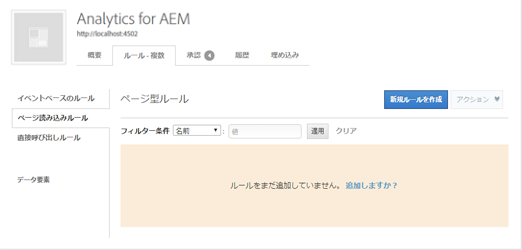
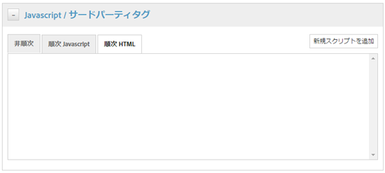
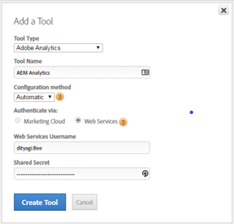
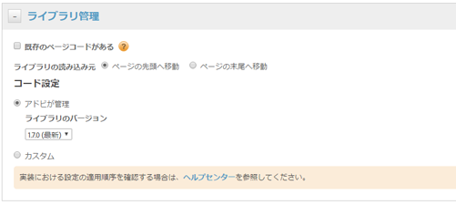
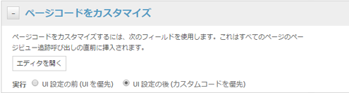

# DTM でのアセットインサイトの有効化 {#enable-asset-insights-through-dtm}

Adobe Dynamic Tag Management は、デジタルマーケティングツールをアクティベートするツールです。これは Adobe Analytics のユーザーに無償で提供されます。

サードパーティ CMS ソリューションがアセットインサイトを使用できるようにトラッキングコードをカスタマイズできますが、DTM を使用してアセットインサイトのタグを挿入することをお勧めします。

>[!NOTE]
>
>インサイトのサポートおよび提供がおこなわれるのは、画像に対してのみです。

DTM を使用してアセットインサイトを有効にするには、次の手順を実行します。

1. Click the Experience Manager logo, and go to **[!UICONTROL Tools]** > **[!UICONTROL Assets]** > **[!UICONTROL Insights Configuration]**.
1. [DTMクラウドサービスを使用したExperience Managerインスタンスの設定](/help/sites-administering/dtm.md)

   The API token should be available once you log on to [https://dtm.adobe.com](https://dtm.adobe.com/) and visit **[!UICONTROL Account Settings]** from the Profile icon. Experience Manager SitesとAsset Insightsの統合はまだ機能しているので、アセットインサイトの観点からは、この手順は必要ありません。

1. [https://dtm.adobe.com](https://dtm.adobe.com/) にログオンし、必要に応じて会社を選択します。
1. Web プロパティを作成するか既存の Web プロパティを開きます。

   * Select the **[!UICONTROL Web Properties]** tab, and then click **[!UICONTROL Add Property]**.

   * 必要に応じてフィールドを更新し、「プロパティを **[!UICONTROL 作成]**」をクリックします。 See [documentation](https://helpx.adobe.com/jp/experience-manager/using/dtm.html).
   

1. In the **[!UICONTROL Rules]** tab, select **[!UICONTROL Page Load Rules]** from the navigation pane and click **[!UICONTROL Create New Rule]**.

   

1. Expand **[!UICONTROL Javascript /Third Party Tags]**. Then click **[!UICONTROL Add New Script]** in the **[!UICONTROL Sequential HTML]** tab to open the Script dialog.

   

1. Experience Managerロゴをクリックし、 **[!UICONTROL ツール/アセットに移動します]**。
1. Click **[!UICONTROL Insights Page Tracker]**, copy the tracker code, and then paste it in the Script dialog you opened in step 6. 変更内容を保存します。

   >[!NOTE]
   >
   > * `AppMeasurement.js` が削除されます。 これは、DTM の Adobe Analytics ツールで使用できるはずです。
   > * The call to `assetAnalytics.dispatcher.init`() is removed. この関数は、DTM の Adobe Analytics ツールの読み込みが完了すると呼び出されるはずです。
   > * アセットインサイトページトラッカーがホストされている場所（Experience Manager、CDNなど）に応じて、スクリプトソースの接触チャネルに変更が必要な場合があります。
   > * Experience Managerがホストするページトラッカーの場合、ソースは、ディスパッチャーインスタンスのホスト名を使用して発行インスタンスを指す必要があります。


1. `https://dtm.adobe.com` にアクセスします。Web プロパティの「**[!UICONTROL 概要]**」をクリックし、「**[!UICONTROL ツールを追加]**」をクリックするか既存の Adobe Analytics ツールを開きます。While creating the tool, you can set **[!UICONTROL Configuration Method]** to **[!UICONTROL Automatic]**.

   

   必要に応じてステージング／実稼動版レポートスイートを選択します。

1. Expand **[!UICONTROL Library Management]**, and ensure that **[!UICONTROL Load Library at]** is set to **[!UICONTROL Page Top]**.

   

1. Expand **[!UICONTROL Customize Page Code]**, and click **[!UICONTROL Open Editor]**.

   

1. 次のコードをウィンドウに貼り付けます。

   ```Java
   var sObj;
   
   if (arguments.length > 0) {
     sObj = arguments[0];
   } else {
     sObj = _satellite.getToolsByType('sc')[0].getS();
   }
   _satellite.notify('in assetAnalytics customInit');
   (function initializeAssetAnalytics() {
     if ((!!window.assetAnalytics) && (!!assetAnalytics.dispatcher)) {
       _satellite.notify('assetAnalytics ready');
       /** NOTE:
           Copy over the call to 'assetAnalytics.dispatcher.init()' from Assets Pagetracker
           Be mindful about changing the AppMeasurement object as retrieved above.
       */
       assetAnalytics.dispatcher.init(
             "",  /** RSID to send tracking-call to */
             "",  /** Tracking Server to send tracking-call to */
             "",  /** Visitor Namespace to send tracking-call to */
             "",  /** listVar to put comma-separated-list of Asset IDs for Asset Impression Events in tracking-call, e.g. 'listVar1' */
             "",  /** eVar to put Asset ID for Asset Click Events in, e.g. 'eVar3' */
             "",  /** event to include in tracking-calls for Asset Impression Events, e.g. 'event8' */
             "",  /** event to include in tracking-calls for Asset Click Events, e.g. 'event7' */
             sObj  /** [OPTIONAL] if the webpage already has an AppMeasurement object, please include the object here. If unspecified, Pagetracker Core shall create its own AppMeasurement object */
             );
       sObj.usePlugins = true;
       sObj.doPlugins = assetAnalytics.core.updateContextData;
       assetAnalytics.core.optimizedAssetInsights();
     }
     else {
       _satellite.notify('assetAnalytics not available. Consider updating the Custom Page Code', 4);
     }
   })();
   ```

   * The page load rule in DTM only includes the `pagetracker.js` code. `assetAnalytics` のフィールドはすべて、デフォルト値の上書きと見なされます。これらは、デフォルトでは必要ありません。
   * The code calls `assetAnalytics.dispatcher.init()` after making sure that `_satellite.getToolsByType('sc')[0].getS()` is initialized and `assetAnalytics,dispatcher.init` is available. このため、手順 11 ではこのコードの追加をスキップできます。
   * As indicated in comments within the Insights Page Tracker code (**[!UICONTROL Tools > Assets > Insights Page Tracker]**), when Page Tracker does not create an `AppMeasurement` object, the first three arguments (RSID, Tracking Server, and Visitor Namespace) are irrelevant. これを示すため代わりに空の文字列が渡されます。\
       その他の引数は、インサイト設定ページ（**[!UICONTROL ツール／アセット／インサイト設定]**）で設定された内容に対応しています。
   * AppMeasurement オブジェクトは、すべての使用可能な SiteCatalyst エンジンで `satelliteLib` に対するクエリを実行して取得されます。複数のタグが設定されている場合は、配列セレクターのインデックスをそれに応じて変更します。配列のエントリは、DTM インターフェイスで使用可能な SiteCatalyst ツールの順に並んでいます。

1. コードエディターウィンドウを保存して閉じ、変更をツール設定に保存します。
1. In the **[!UICONTROL Approvals]** tab, approve both the pending approvals. DTM タグを Web ページに挿入する準備ができました。For details on how to insert DTM tags in web pages, see [Integrate DTM in custom page templates](https://blogs.adobe.com/experiencedelivers/experience-management/integrating-dtm-custom-aem6-page-template/).
