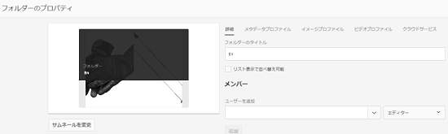
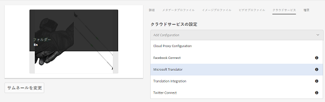
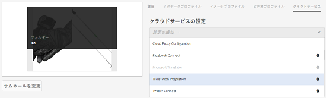
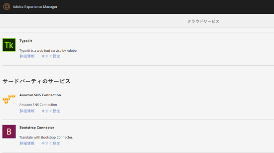
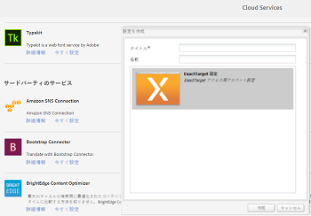
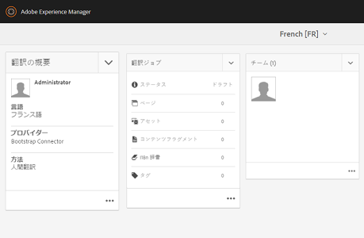

# フォルダーへの翻訳クラウドサービスの適用 {#applying-translation-cloud-services-to-folders}

Adobe Experience Managerを使用すると、任意の翻訳プロバイダーからクラウドベースの翻訳サービスを利用し、要件に基づいてアセットが翻訳されるようにすることができます。

翻訳クラウドサービスをアセットフォルダーに直接適用できるので、翻訳ワークフローの間もずっとアセットを利用できます。

## 翻訳サービスの適用 {#applying-the-translation-services}

翻訳クラウドサービスをアセットフォルダーに直接適用すると、翻訳ワークフローの作成または変更時に翻訳サービスを設定する必要がなくなります。

1. Assets ユーザーインターフェイスから翻訳サービスを適用するフォルダーを選択します。
1. From the toolbar, click **[!UICONTROL Properties]** to display the **[!UICONTROL Folder Properties]** page.

   

1. 「**[!UICONTROL Cloud Services]**」タブに移動します。
1. 「Cloud Services の設定」リストから目的の翻訳プロバイダーを選択します。例えば、Microsoft の翻訳サービスを利用する場合は、「**[!UICONTROL Microsoft Translator]**」を選択します。

   

1. 翻訳プロバイダーのコネクタを選択します。

   

1. From the toolbar, click **[!UICONTROL Save]**, and then click **[!UICONTROL OK]** to close the dialog.The translation service is applied to the folder.

## カスタム翻訳コネクタの適用  {#applying-custom-translation-connector}

翻訳ワークフローで使用する翻訳サービスにカスタムコネクタを適用する場合、カスタムコネクタを適用するには、まずパッケージマネージャーからコネクタをインストールします。次に、Cloud Services コンソールからコネクタを設定します。コネクタを設定すると、[翻訳サービスの適用](transition-cloud-services.md#applying-the-translation-services)で説明されている「Cloud Services」タブのコネクタのリストに表示されるようになります。カスタムコネクタを適用し、翻訳ワークフローを実行すると、翻訳プロジェクトの「**[!UICONTROL 翻訳の概要]**」タイルの「**[!UICONTROL プロバイダー]**」と「**[!UICONTROL メソッド]**」という見出しの下にコネクタの詳細が表示されます。

1. パッケージマネージャーからコネクタをインストールします。
1. Click the Experience Manager logo, and navigate to **[!UICONTROL Tools]** > **[!UICONTROL Deployment]** > **[!UICONTROL Cloud Services]**.
1. インストールしたコネクタを **[!UICONTROL Cloud Services]** ページの「**[!UICONTROL サードパーティのサービス]**」の下で探します。

   

1. Click the **[!UICONTROL Configure now]** link to open the **[!UICONTROL Create Configuration]** dialog.

   

1. Specify a title and a name for the connector, and then click **[!UICONTROL Create]**. [翻訳サービスの適用](#applying-the-translation-services)のステップ 5 で説明されている「**[!UICONTROL Cloud Services]**」タブのコネクタリストにカスタムコネクタが表示されます。
1. カスタムコネクタを適用したら、[翻訳プロジェクトの作成](translation-projects.md)で説明されている翻訳ワークフローを実行します。**[!UICONTROL プロジェクト]**&#x200B;コンソールで、翻訳プロジェクトの「**[!UICONTROL 翻訳の概要]**」タイルに表示されているコネクタの詳細を確認します。

   
