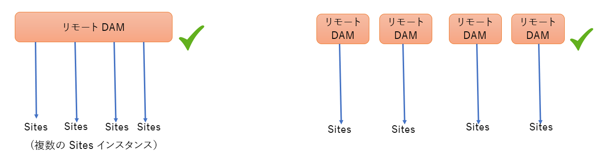
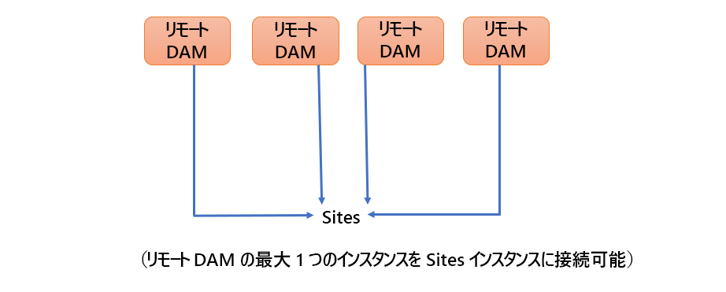
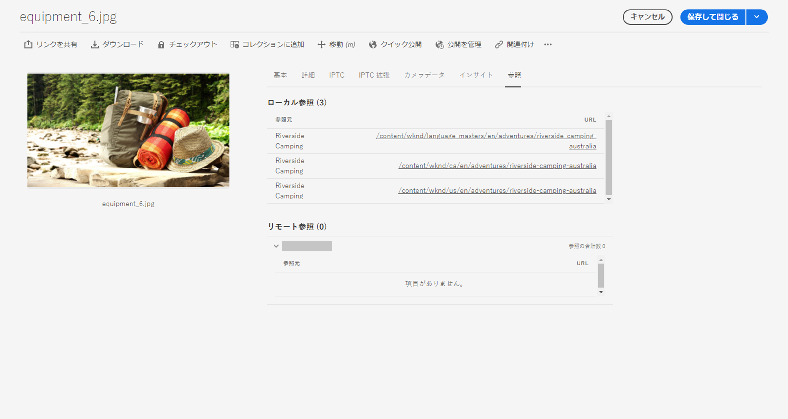
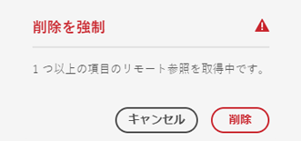
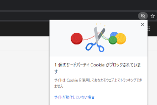
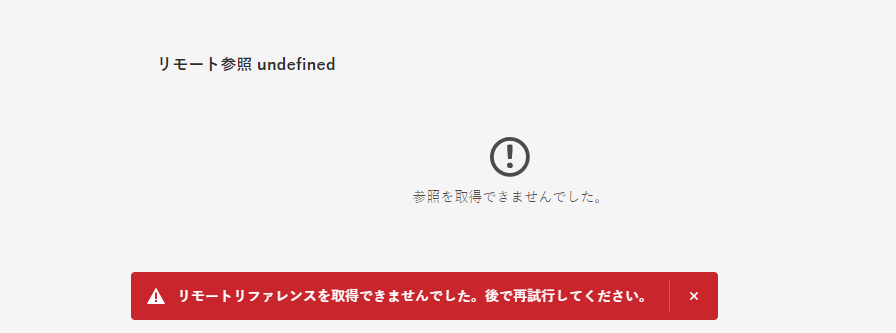

# Connected Assets を使用した [!DNL Experience Manager Sites] での DAM アセットの共有  {#use-connected-assets-to-share-dam-assets-in-aem-sites}

大規模企業では、Web サイトの作成に必要なインフラストラクチャが分散していることがあります。Web サイト作成機能と、それらの Web サイトの作成に使用されたデジタルアセットが、別のデプロイメントに格納されている場合もあります。その理由の1 つは、地理的に分散した既存のデプロイメントが連携して動作する必要があることです。もう 1 つの理由は、親会社が一緒に使用したい異種インフラストラクチャ（[!DNL Experience Manager] の各種バージョンなど）をもたらす買収です。

Connected Assets の機能は、 [!DNL Experience Manager Sites] および [!DNL Experience Manager Assets]. ユーザーは、別個の [!DNL Assets] デプロイメントから得られるデジタルアセットを使用する Web ページを [!DNL Sites] に作成できます。

>[!NOTE]
>
>Web ページのオーサリング用に、別の Sites デプロイメント上のリモート DAM デプロイメントで利用可能なアセットを使用する必要がある場合にのみ、Connected Assets を設定します。

## Connected Assets の概要 {#overview-of-connected-assets}

[!UICONTROL ページエディター]でページをターゲット先として編集する場合、作成者は、アセットのソースとして機能する別の [!DNL Assets] デプロイメントのアセットをシームレスに検索、参照および埋め込むことができます。管理者は、 [!DNL Sites] の機能を備える [!DNL Experience Manager] のデプロイメントと [!DNL Assets] の機能を備える [!DNL Experience Manager] 別のデプロイメントとの 1 回限りの統合を作成します。サイト作成者は、Connected Assets を通じてサイトの Web ページでDynamic Media画像を使用し、スマート切り抜きや画像プリセットなどのDynamic Media機能を利用することもできます。

[!DNL Sites] 作成者の場合、リモートアセットは読み取り専用のローカルアセットとして利用できます。この機能は、サイトエディター上のリモートアセットへのシームレスな検索とアクセスをサポートします。 Sites で完全なアセットコーパスを使用する必要があるその他の使用例については、Connected Assets を活用する代わりにアセットを一括で移行することを検討してください。 詳しくは、 [Experience Manager Assets移行ガイド](/help/assets/assets-migration-guide.md).

### 前提条件とサポートされているデプロイメント {#prerequisites}

この機能を使用または設定する前に、以下を確認してください。

* ユーザーがそれぞれのデプロイメント上で適切なユーザーグループに属している。
* [!DNL Adobe Experience Manager] のデプロイメントタイプでは、サポートされている条件の 1 つが満たされます。[!DNL Experience Manager] 6.5 [!DNL Assets] はで使用できます。 [!DNL Experience Manager] as a Cloud Service。 この機能が [!DNL Experience Manager] as a [!DNL Cloud Service]を参照してください。 [Connected Assets inExperience Manageras a Cloud Service](https://experienceleague.adobe.com/docs/experience-manager-cloud-service/assets/admin/use-assets-across-connected-assets-instances.html).

   |  | [!DNL Sites] as a [!DNL Cloud Service] | AMS 上の [!DNL Experience Manager] 6.5 [!DNL Sites] | [!DNL Experience Manager] 6.5 [!DNL Sites] On-Premise |
   |---|---|---|---|
   | **[!DNL Experience Manager Assets]as a[!DNL Cloud Service]** | サポート対象 | サポート対象 | サポート対象 |
   | AMS 上の **[!DNL Experience Manager]6.5 [!DNL Assets]** | サポート対象 | サポート対象 | サポート対象 |
   | **[!DNL Experience Manager]6.5 [!DNL Assets] On-Premise** | サポートなし | サポートなし | サポートなし |

### サポートされているファイル形式 {#mimetypes}

作成者は、コンテンツファインダーで画像や次のタイプのドキュメントを検索し、検索したアセットをページエディターにドラッグします。 ドキュメントが `Download` コンポーネントに追加され、画像が `Image` コンポーネントに追加されます。作成者は、任意のカスタム [!DNL Experience Manager] デフォルトの `Download` または `Image` コンポーネント。 サポートされる形式は以下の通りです。

* **画像形式**：[画像コンポーネント](https://www.aemcomponents.dev/content/core-components-examples/library/page-authoring/image.html)がサポートする形式。
* **ドキュメント形式**：詳しくは、[サポートされるドキュメント形式](assets-formats.md#supported-document-formats)を参照してください。

### 関連するユーザーとグループ {#users-and-groups-involved}

この機能の設定や使用に関係する様々な役割と対応するユーザーグループについて、以下で説明します。ローカルスコープは、作成者が Web ページを作成する場合に使用します。リモートスコープは、必要なアセットをホストしている DAM デプロイメントで使用されます。[!DNL Sites] 作成者は、これらのリモートアセットを取得します。

| 役割 | 対象範囲 | ユーザーグループ | 手順のユーザーネーム | 説明 |
|---|---|---|---|---|
| [!DNL Sites] administrator | ローカル | [!DNL Experience Manager] `administrators` | `admin` | [!DNL Experience Manager]を設定し、リモート [!DNL Assets] デプロイメントとの統合を設定します。 |
| DAM ユーザー | ローカル | `Authors` | `ksaner` | `/content/DAM/connectedassets/` の取得済みアセットを表示／複製するために使用されます。 |
| [!DNL Sites] 作成者 | ローカル | <ul><li>`Authors`（リモート DAM での読み取りアクセス権とローカル [!DNL Sites] での作成者アクセス権を持つ） </li> <li>ローカル [!DNL Sites] の `dam-users`</li></ul> | `ksaner` | エンドユーザーは、この統合を使用してコンテンツの速度を向上させる [!DNL Sites] 作成者です。作成者は、[!UICONTROL コンテンツファインダー]や、ローカル Web ページ内の必要な画像を使用して、リモート DAM 内のアセットを検索および閲覧します。`ksaner` DAM ユーザーの資格情報が使用されます。 |
| [!DNL Assets] administrator | リモート | [!DNL Experience Manager] `administrators` | リモート [!DNL Experience Manager] の `admin` | クロスオリジンリソース共有（CORS）を設定します。 |
| DAM ユーザー | リモート | `Authors` | リモート [!DNL Experience Manager] の `ksaner` | リモート [!DNL Experience Manager] デプロイメントでの作成者の役割。[!UICONTROL コンテンツファインダー]を使用して Connected Assets 内のアセットを検索／参照します。 |
| DAM ディストリビューター（テクニカルユーザー） | リモート | [!DNL Sites] `Authors` | リモート [!DNL Experience Manager] の `ksaner` | リモートデプロイメント上に存在するこのユーザーは、（[!DNL Sites] 作成者の役割ではなく）[!DNL Experience Manager]ローカルサーバーによって、[!DNL Sites] 作成者の代わりにリモートアセットを取得するために使用されます。この役割は、上の 2 つの `ksaner` の役割とは異なり、別のユーザーグループに属しています。 |

### Connected Assets のアーキテクチャ {#connected-assets-architecture}

Experience Managerを使用すると、リモート DAM デプロイメントをソースとして複数のExperience Managerに接続できます [!DNL Sites] デプロイメント。 最大 4 つの接続が可能です [!DNL Sites] をソースリモート DAM にデプロイします。 ただし、 [!DNL Sites] 1 つのリモート DAM デプロイメントのみを使用するデプロイメント。

次の図に、サポートされるシナリオを示します。

次の図は、サポートされていないシナリオを示しています。

## [!DNL Sites] デプロイメントと [!DNL Assets] デプロイメント間の接続の設定  {#configure-a-connection-between-sites-and-assets-deployments}

[!DNL Experience Manager] 管理者はこの統合を作成できます。作成した統合を使用するうえで必要な権限は、ユーザーグループを通じて設定されます。ユーザーグループは、[!DNL Sites] デプロイメントおよび DAM デプロイメントで定義されます。

Connected Assets とローカル [!DNL Sites] の接続を構成するには、次の手順を実行します:

1. 既存の [!DNL Sites] デプロイメントにアクセスするか、以下のコマンドを使用してデプロイメントを作成します。

   1. JAR ファイルのフォルダーで、ターミナルから次のコマンドを実行して各 [!DNL Experience Manager] サーバーを作成します。
      `java -XX:MaxPermSize=768m -Xmx4096m -jar <quickstart jar filepath> -r samplecontent -p 4502 -nofork -gui -nointeractive &`

   1. 数分後に [!DNL Experience Manager] サーバーが正常に起動します。この [!DNL Sites] デプロイメントを、Web ページオーサリング用のローカルマシン（`https://[local_sites]:4502`）と見なします。

1. ローカルスコープのユーザーと役割が、[!DNL Sites] デプロイメント上と AMS の [!DNL Assets] デプロイメント上に存在していることを確認します。[!DNL Assets] デプロイメント上でテクニカルユーザーを作成し、[関連するユーザーとグループ](/help/assets/use-assets-across-connected-assets-instances.md#users-and-groups-involved)で説明したユーザーグループに追加します。

1. `https://[local_sites]:4502` にあるローカルの [!DNL Sites] デプロイメントにアクセスします。**[!UICONTROL ツール]**／**[!UICONTROL Assets]**／**[!UICONTROL Connected Assets 設定]**&#x200B;をクリックし、次の値を入力します。

   1. 構成の&#x200B;**[!UICONTROL タイトル]**。
   1. **[!UICONTROL リモート DAM URL]** は、`https://[assets_servername]:[port]` 形式で指定した [!DNL Assets] の場所の URL です。
   1. DAM ディストリビューター（テクニカルユーザー）の資格情報。
   1. 「**[!UICONTROL マウントポイント]**」フィールドに、[!DNL Experience Manager] が取得したアセットの格納先となるローカルの [!DNL Experience Manager] パスを入力します。例：`remoteassets` フォルダー。DAM から取得したアセットは、[!DNL Sites] デプロイメントのこのフォルダーに保存されます。
   1. **[!UICONTROL ローカルサイト URL]** は、 [!DNL Sites] デプロイメントの場所です。[!DNL Assets] デプロイメントは、この値を使用して、この [!DNL Sites] デプロイメントによって取得されたデジタルアセットへの参照を維持します。
   1. [!DNL Sites] 技術ユーザーの資格情報。
   1. **[!UICONTROL 元のバイナリ転送最適化しきい値]**&#x200B;フィールドの値は、元のアセット（レンディションを含む）を同期的に転送するかどうかを指定します。ファイルサイズが比較的小さいアセットは簡単に取得できますが、ファイルサイズが大きいアセットは非同期で同期するのが最適です。値は、ネットワークの機能に応じて異なります。
   1. 選択 **[!UICONTROL Connected Assets とデータストアを共有]**&#x200B;データストアを使用してアセットを保存し、データストアが両方のデプロイメント間で共有されている場合は、 この場合、実際のアセットバイナリはデータストアで利用可能で、転送されないため、しきい値の制限は重要ではありません。

   

   *図：Connected Assets 機能の典型的な設定*

1. [!DNL Assets]デプロイメント上の既存のデジタルアセットは既に処理され、レンディションが生成されます。これらのレンディションは、この機能を使用して取得されるので、レンディションを再生成する必要はありません。レンディションの再生成を禁止するには、ワークフローランチャーを無効にします。（[!DNL Sites]）デプロイメントのランチャーの設定を調整して、`connectedassets` フォルダーを除外します（アセットはこのフォルダーに取得されます）。

   1. [!DNL Sites] デプロイメントで、**[!UICONTROL ツール]**／**[!UICONTROL ワークフロー]**／**[!UICONTROL ランチャー]**&#x200B;をクリックします。

   1. **[!UICONTROL DAM アセットの更新]**&#x200B;および **[!UICONTROL DAM メタデータの書き戻し]**&#x200B;ワークフローを含むランチャーを検索します。

   1. ワークフローランチャーを選択し、アクションバーの「**[!UICONTROL プロパティ]**」をクリックします。

   1. [!UICONTROL プロパティ]ウィザードで、「**[!UICONTROL パス]**」フィールドを次のマッピングに従って変更し、マウントポイント **[!UICONTROL connectedassets]** が除外されるように正規表現を更新します。

   | 前 | 後 |
   |---|---|
   | `/content/dam(/((?!/subassets).)*/)renditions/original` | `/content/dam(/((?!/subassets)(?!connectedassets).)*/)renditions/original` |
   | `/content/dam(/.*/)renditions/original` | `/content/dam(/((?!connectedassets).)*/)renditions/original` |
   | `/content/dam(/.*)/jcr:content/metadata` | `/content/dam(/((?!connectedassets).)*/)jcr:content/metadata` |

   >[!NOTE]
   >
   >作成者がアセットを取得する際、リモートデプロイメントで使用可能なすべてのレンディションが取得されます。取得したアセットのレンディションをさらに作成したい場合は、この設定手順をスキップしてください。[!UICONTROL DAM アセットの更新]ワークフローが開始され、追加のレンディションが作成されます。これらのレンディションは、ローカルの [!DNL Sites] デプロイメントでのみ使用でき、リモート DAM デプロイメントでは使用できません。

1. [!DNL Assets] デプロイメントの CORS 構成で、許可されたオリジンとして [!DNL Sites] デプロイメントを追加します。詳しくは、「[オリジン間リソース共有について（CORS）](https://experienceleague.adobe.com/docs/experience-manager-learn/foundation/security/understand-cross-origin-resource-sharing.html?lang=ja)」を参照してください。

1. [同じサイト cookie サポート](/help/sites-administering/same-site-cookie-support.md)を設定します。

設定済みの [!DNL Sites] デプロイメントと [!DNL Assets] デプロイメントの間の接続を確認できます。

![設定済み Connected Assets の接続テスト [!DNL Sites]](assets/connected-assets-multiple-config.png)
*図：設定済みの Connected Assets の接続テスト [!DNL Sites].*

## Dynamic Media Assets の使用 {#dynamic-media-assets}

Connected Assets では、 [!DNL Dynamic Media] Sites ページのリモート DAM デプロイメントから削除し、スマート切り抜きや画像プリセットなどのDynamic Media機能を活用します。

使用する [!DNL Dynamic Media] Connected Assets を使用：

1. 設定 [!DNL Dynamic Media] 同期モードが有効なリモート DAM デプロイメント時。
1. 設定 [Connected Assets](#configure-a-connection-between-sites-and-assets-deployments).
1. 設定 [!DNL Dynamic Media] リモート DAM で設定されたのと同じ会社名を持つ Sites インスタンス上で、 Sites デプロイメントで Connected Assets を操作するには、Dynamic Mediaアカウントへの読み取り専用アクセス権が必要です。 そのため、Sites インスタンスのDynamic Media設定で同期モードを無効にする必要があります。

>[!CAUTION]
>
>Connected Assets および [!DNL Dynamic Media] 設定： [!DNL Dynamic Media] で使用可能なローカルアセットを処理するには [!DNL Sites] デプロイメント。

## [!DNL Dynamic Media] の設定 {#configure-dynamic-media}

を設定するには、以下を実行します。 [!DNL Dynamic Media] オン [!DNL Assets] および [!DNL Sites] 配置：

1. 有効化と設定 [!DNL Dynamic Media] リモートでのグローバル構成として [!DNL Assets] オーサーのデプロイメント。 Dynamic Mediaを設定するには、 [Dynamic Mediaの設定](/help/assets/config-dynamic.md#configuring-dynamic-media-cloud-services). リモート [!DNL Assets] デプロイメントの [!UICONTROL  Dynamic Media 同期モード]で、「**[!UICONTROL デフォルトで有効]**」を選択します。

1. Connected Assets 設定の作成 ( [Sites デプロイメントと Assets デプロイメント間の接続の設定](#configure-a-connection-between-sites-and-assets-deployments). また、 **[!UICONTROL Dynamic Media Connected Assets 用の元のレンディションを取得]** オプション。

1. ローカル [!DNL Sites] およびリモート [!DNL Assets] デプロイメントに [!DNL Dynamic Media] を設定します。[設定 [!DNL Dynamic Media]](/help/assets/config-dynamic.md#configuring-dynamic-media-cloud-services)の指示に従います。

   * すべての設定で同じ会社名を使用します。
   * ローカルの [!DNL Sites] の [!UICONTROL Dynamic Media 同期モード]で、「**[!UICONTROL デフォルトで無効]**」を選択します。この [!DNL Sites] デプロイメントは、 [!DNL Dynamic Media] アカウント
   * ローカルの [!DNL Sites] の「**[!UICONTROL アセットを公開]**」オプションで、「**[!UICONTROL 選択的公開]**」を選択します。「**[!UICONTROL すべてのコンテンツを同期]**」は選択しないでください。

1. 画像コアコンポーネントで[[!DNL Dynamic Media] サポートを有効にします。](https://experienceleague.adobe.com/docs/experience-manager-core-components/using/components/image.html?lang=ja#dynamic-media)この機能を使用すると、ローカルの [!DNL Sites] デプロイメント上の Web ページの作成者が [!DNL Dynamic Media] 画像を使用する場合、デフォルトの[画像コンポーネント](https://www.aemcomponents.dev/content/core-components-examples/library/page-authoring/image.html)に [!DNL Dynamic Media] 画像を表示できます。

## リモートアセットの使用 {#use-remote-assets}

Web サイト作成者は、コンテンツファインダーを使用して DAM デプロイメントに接続します。Web サイト作成者は、コンポーネント内のリモートアセットを参照、検索、ドラッグできます。リモート DAM に対する認証をおこなうには、管理者から提供された資格情報（存在する場合）を手元に用意します。

作成者は、ローカル DAM デプロイメントで利用可能なアセットとリモート DAM デプロイメントで利用可能なアセットを、単一の Web ページ内で使用できます。コンテンツファインダーを使用すれば、ローカル DAM の検索とリモート DAM の検索を切り替えることができます。

ローカルの [!DNL Sites] デプロイメントで使用できる、完全に対応するタグ（同じ分類階層を持つ）を持つリモートアセットのタグのみが取得されます。その他のタグは破棄されます。作成者は、全文検索が提供されるので、リモート [!DNL Experience Manager] デプロイメントに存在するすべてのタグを使用して、リモートアセットを検索できます。

### 使用手順 {#walk-through-of-usage}

上記のセットアップを使用してオーサリングエクスペリエンスを試し、機能を理解してください。リモート DAM デプロイメントで、選択したドキュメントまたは画像を使用します。

1. リモートデプロイメントの [!DNL Assets] インターフェイスに移動するには、[!DNL Experience Manager] Workspace から **[!UICONTROL Assets]**／**[!UICONTROL ファイル]**&#x200B;にアクセスします。または、ブラウザーで `https://[assets_servername_ams]:[port]/assets.html/content/dam` にアクセスします。選択したアセットをアップロードします。
1. [!DNL Sites] デプロイメントの右上隅にあるプロファイルアクティベーターで、「**[!UICONTROL 別のユーザーとして実行する]**」をクリックします。ユーザー名として `ksaner` を入力し、提供されたオプションを選択し、「**[!UICONTROL OK]**」をクリックします。
1. **[!UICONTROL Sites]**／**[!UICONTROL We.Retail]**／**[!UICONTROL us]**／**[!UICONTROL en]** で、We.Retail Web サイトページを開きます。ページを編集します。または、ブラウザーで `https://[aem_server]:[port]/editor.html/content/we-retail/us/en/men.html` にアクセスしてページを編集します。

   ページの左上隅にある「**[!UICONTROL サイドパネルを切り替え]**」をクリックします。

1. を開きます。 [!UICONTROL Assets] 」タブ（リモートコンテンツファインダー）に移動し、 **[!UICONTROL Connected Assets にログイン]**.
1. 資格情報（ユーザー名：`ksaner`、パスワード：`password`）を入力します。このユーザーには、両方の [!DNL Experience Manager] デプロイメントのオーサリング権限があります。
1. DAM に追加したアセットを検索します。リモートアセットは左側のパネルに表示されます。画像またはドキュメントでフィルタリングしてから、サポートされているドキュメントのタイプでさらにフィルタリングします。`Image` コンポーネント上の画像と `Download` コンポーネント上のドキュメントをドラッグします。

   ローカル [!DNL Sites] デプロイメントでは、取得されたアセットは読み取り専用です。[!DNL Sites] コンポーネントが提供するオプションを使用して、取得したアセットを編集できます。コンポーネントによる編集は非破壊的です。

   

   *図：リモート DAM でアセットを検索するときにドキュメントタイプと画像をフィルタリングするオプション*

1. アセットの元のアセットが非同期で取得され、取得タスクが失敗した場合、サイト作成者に通知されます。 オーサリング中またはオーサリング後でも、作成者は[非同期ジョブ](/help/sites-administering/asynchronous-jobs.md)ユーザーインターフェイスで取得タスクやエラーについての詳細情報を確認できます。

   

   *図：バックグラウンドで発生するアセットの非同期取得に関する通知。*

1. ページを公開すると、ページで使用されているアセットの完全なリストが [!DNL Experience Manager] に表示されます。公開時にリモートアセットが正常に取得されることを確認します。取得した各アセットのステータスを確認するには、[非同期ジョブ](/help/sites-administering/asynchronous-jobs.md)ユーザーインターフェイスをご覧ください。

   >[!NOTE]
   >
   >1 つ以上のリモートアセットが完全に取得されなくても、ページは公開されます。 [!DNL Experience Manager] 通知領域では、非同期ジョブページに表示されるエラーの通知を確認できます。

>[!CAUTION]
>
>Web ページで使用すると、取得したリモートアセットは、ローカルフォルダーへのアクセス権限を持つユーザーが検索および使用できます。取得したアセットは、ローカルフォルダー（上のウォークスルーの `connectedassets`）に保存されます。これらのアセットは、ローカルリポジトリーでも[!UICONTROL コンテンツファインダー]経由で検索および表示できます。

取得されたアセットは他のローカルアセットと同じように使用できます。ただし、関連するメタデータは編集できません。

### Web ページ間でのアセットの使用の確認 {#asset-usage-references}

[!DNL Experience Manager] DAM ユーザーは、アセットへのすべての参照を確認できます。リモートの [!DNL Sites] および複合アセット内のアセットの使用状況を理解し、管理するのに役立ちます。[!DNL Experience Manager Sites] のデプロイメントの Web ページの作成者の多くは、異なる Web ページのリモート [!DNL Assets] にあるアセットを使用できます。アセット管理を単純化し、参照が壊れないようにするには、DAM ユーザーはローカルおよびリモートの Web ページ全体でのアセットの使用を確認することが重要です。アセットの[!UICONTROL プロパティ]ページの「[!UICONTROL 参照]」タブは、アセットのローカル参照とリモート参照をリストします。

[!DNL Assets] デプロイメントで参照を表示および管理するには、次の手順に従います。

1. [!DNL Assets] コンソールでアセットを選択し、ツールバーの「**[!UICONTROL プロパティ]**」をクリックします。
1. 「**[!UICONTROL 参照]**」タブをクリックします。[!DNL Assets] デプロイメントでのアセットの使用については、「**[!UICONTROL ローカルの参照]**」を参照してください。Connected Assets 機能を使用してアセットが取得された [!DNL Sites] デプロイメント上のアセットの使用については、「[!UICONTROL リモートの参照]」を参照してください。

   

1. [!DNL Sites] ページの参照は、各ローカル [!DNL Sites] の参照の合計数を表示します。すべての参照を見つけて、参照の総数を表示するのは時間がかかる場合があります。
1. 参照のリストはインタラクティブで、DAM ユーザーは参照をクリックして参照ページを開くことができます。何らかの理由でリモート参照を取得できない場合は、失敗の通知が表示されます。
1. ユーザーはアセットを移動または削除できます。アセットを移動または削除すると、選択したすべてのアセット／フォルダーの参照の合計数が警告ダイアログに表示されます。参照が取得されていないアセットを削除すると、警告ダイアログが表示されます。

   

### リモート DAM でアセットの更新を管理 {#manage-updates-in-remote-dam}

後 [接続の設定](#configure-a-connection-between-sites-and-assets-deployments) リモート DAM と [!DNL Sites] デプロイメントの場合、リモート DAM 上のアセットは [!DNL Sites] デプロイメント。 その後、リモート DAM のアセットまたはフォルダーに対して、更新、削除、名前変更および移動の操作を実行できます。 更新は、しばらくの間、 [!DNL Sites] デプロイメント。 さらに、リモート DAM 上のアセットがローカル DAM で使用されている場合 [!DNL Experience Manager Sites] ページの場合、リモート DAM 上のアセットの更新が [!DNL Sites] ページ。

アセットを別の場所に移動する際に、次の点を確認します。 [参照を調整](/help/assets/manage-assets.md) アセットが [!DNL Sites] ページ。 ローカルからアクセスできない場所にアセットを移動する場合 [!DNL Sites] デプロイメント時に、Sites デプロイメントにアセットが表示されません。

また、リモート DAM 上のアセットのメタデータプロパティを更新し、変更内容をローカル DAM で利用することもできます [!DNL Sites] デプロイメント。

[!DNL Sites] 作成者は、 [!DNL Sites] 変更をデプロイして再公開し、で利用できるようにします。 [!DNL Experience Manager] パブリッシュインスタンス。

[!DNL Experience Manager] に、 `Remote Assets Content Finder` サイト作成者が [!DNL Sites] ページ。 期限切れのステータスを持つアセットを [!DNL Sites] ページで、アセットが [!DNL Experience Manager] パブリッシュインスタンス。

>[!NOTE]
>
>リモート DAM 内のアセットに対する更新は、 [!DNL Sites] リモート DAM および [!DNL Sites] デプロイメントは次の場所にあります。 [!DNL Experience Manager].

## よくある質問 {#frequently-asked-questions}

### Connected Assets を設定する場合、 [!DNL Sites] 導入？

この場合、Connected Assets を設定する必要はありません。 使用可能なアセットは、 [!DNL Sites] デプロイメント。

### Connected Assets 機能を設定する必要があるのはいつですか？

Connected Assets 機能を設定するのは、 [!DNL Sites] デプロイメント。

### 数 [!DNL Sites] デプロイメントは、Connected Assets を設定した後、リモート DAM デプロイメントに接続できますか？

最大 4 つの接続が可能です [!DNL Sites] Connected Assets の設定後にリモート DAM デプロイメントにデプロイメントします。 詳しくは、 [Connected Assets のアーキテクチャ](#connected-assets-architecture).

### リモート DAM デプロイメントのうち、1 つの [!DNL Sites] Connected Assets を設定した後のデプロイメント

1 つのリモート DAM デプロイメントを [!DNL Sites] Connected Assets の設定後のデプロイメント 詳しくは、 [Connected Assets のアーキテクチャ](#connected-assets-architecture).

### Adobe Analytics の [!DNL Sites] Connected Assets を設定した後のデプロイメント

Connected Assets の設定後、 [!DNL Dynamic Media] アセットは、 [!DNL Sites] 読み取り専用モードでのデプロイメント。 その結果、 [!DNL Dynamic Media] 上のアセットを処理する [!DNL Sites] デプロイメント。 詳しくは、 [Sites デプロイメントとDynamic Mediaデプロイメント間の接続の設定](#dynamic-media-assets).

### リモート DAM デプロイメントの画像およびドキュメント形式のアセットを [!DNL Sites] Connected Assets を設定した後のデプロイメント

はい。 [!DNL Sites] Connected Assets の設定後のデプロイメント

### リモート DAM デプロイメントのコンテンツフラグメントとビデオアセットを [!DNL Sites] Connected Assets を設定した後のデプロイメント

いいえ。 [!DNL Sites] Connected Assets の設定後のデプロイメント

### リモート DAM デプロイメントのDynamic Mediaアセットを [!DNL Sites] Connected Assets を設定した後のデプロイメント

はい、 [!DNL Sites] Connected Assets の設定後のデプロイメント 詳しくは、 [Sites デプロイメントとDynamic Mediaデプロイメント間の接続の設定](#dynamic-media-assets).

### Connected Assets の設定後、リモート DAM のアセットまたはフォルダーに対して更新、削除、名前変更、移動の操作を実行できますか？

はい。Connected Assets を設定した後、リモート DAM のアセットまたはフォルダーに対して、更新、削除、名前変更、移動の操作を実行できます。 更新は、Sites デプロイメントで自動的に利用できます（少し遅れて）。 詳しくは、 [リモート DAM でアセットの更新を管理](#handling-updates-to-remote-assets).

### Connected Assets を設定した後、 [!DNL Sites] デプロイメントを作成し、リモート DAM デプロイメントで使用できるようにしますか？

アセットを [!DNL Sites] ただし、これらのアセットをリモート DAM デプロイメントで使用することはできません。

## 制限事項とベストプラクティス {#tip-and-limitations}

* アセットの使用状況に関するインサイトを取得するには、[!DNL Sites] インスタンスで[アセットインサイト](/help/assets/asset-insights.md)機能を設定します。

### 権限とアセット管理 {#permissions-and-managing-assets}

* ローカルアセットは読み取り専用のコピーです。[!DNL Experience Manager] コンポーネントは、アセットに対して非破壊編集を行います。その他のいかなる編集もできません。
* ローカルで取得されたアセットは、オーサリング用途でのみ使用できます。アセット更新ワークフローの適用やメタデータの編集は行えません。
* 画像とリストに表示されるドキュメント形式のみがサポートされます。[!DNL Content Fragments] および ではサポートされていません。[!DNL Experience Fragments]
* Adobe [!DNL Experience Manager] はメタデータスキーマを取得しません。つまり、取得されたすべてのメタデータが表示されない可能性があります。[!DNL Sites] デプロイメントでスキーマが別個に更新されると、すべてのメタデータプロパティが表示されます。
* [!DNL Sites] 作成者は全員、リモート DAM デプロイメントへのアクセス権限を持っていなくても、取得されたコピーに対する読み取り権限を持ちます。
* 統合をカスタマイズするための API サポートはありません。
* この機能は、リモートアセットのシームレスな検索および使用をサポートします。多くのリモートアセットをローカルデプロイメントで一度に利用できるようにするには、リモートアセットの移行を検討します。[Assets 移行ガイド](assets-migration-guide.md)を参照してください。
* リモートアセットを[!UICONTROL ページプロパティ]ユーザーインターフェイスのページサムネールとして使用することはできません。Web ページのサムネールは、[!UICONTROL ページプロパティ]ユーザインターフェイスの[!UICONTROL サムネール]から、「[!UICONTROL 画像を選択]」をクリックして設定できます。

### セットアップとライセンス {#setup-licensing}

* [!DNL Adobe Managed Services] での [!DNL Assets] のデプロイメントはサポートされています。
* [!DNL Sites] 単一の [!DNL Assets] を一度にデプロイします。
* リモートリポジトリーとして機能する [!DNL Assets] のライセンスが 1 つ必要です。
* ローカルオーサリングデプロイメントとして機能する [!DNL Sites] のライセンスが 1 つ以上必要です。

### 使用方法 {#usage}

* ユーザーは、オーサリング時にリモートアセットを検索し、ローカルページにドラッグできます。その他の機能はサポートされていません。
* 取得操作は 5 秒でタイムアウトします。アセット取得時、問題が発生する場合があります（ネットワークに問題がある場合など）。作成者は、再試行を行い、リモートアセットを[!UICONTROL コンテンツファインダー]から[!UICONTROL ページエディター]にドラッグ＆ドロップできます。
* 取得されたアセットに対しては、単純な非破壊編集と、 `Image` コンポーネント経由でサポートされている編集を行えます。アセットは読み取り専用です。
* アセットを再取得する唯一の方法は、アセットをページにドラッグすることです。アセットを再取得して更新するための API サポートなどの手段はありません。
* アセットが DAM から廃止されても、それらは引き続き [!DNL Sites] ページで使用されます。
* アセットのリモート参照エントリは、非同期で取得されます。参照と合計数はリアルタイムではないので、DAM ユーザーが参照を表示しているときに Sites の作成者がアセットを使用した場合は、多少異なる場合があります。DAM ユーザーは、ページを更新して数分後に再試行し、合計数を取得できます。

## 問題のトラブルシューティング {#troubleshoot}

一般的なエラーのトラブルシューティングを行うには、次の手順に従います。

* [!UICONTROL コンテンツファインダー]からリモートアセットを検索できない場合は、必要な役割と権限が設定されていることを確認してください。

* リモート DAM から取得したアセットは、1 つ以上の理由で Web ページに発行できない場合があります。リモートサーバーに存在しない、取得する適切なアクセス許可がない、ネットワーク障害、などが原因の可能性があります。アセットがリモート DAM から削除されていないことを確認してください。適切な権限が設定され、前提条件が満たされていることを確認します。アセットをページに追加し直して、再公開してください。アセット取得時のエラーについては、[非同期ジョブのリスト](/help/sites-administering/asynchronous-jobs.md)を確認してください。

* ローカルの [!DNL Sites] デプロイメントからリモート DAM デプロイメントにアクセスできない場合は、クロスサイト cookie が許可され、[同じサイト cookie サポート](/help/sites-administering/same-site-cookie-support.md)が設定されていることを確認します。クロスサイト cookie がブロックされると、[!DNL Experience Manager] のデプロイメントが認証されない場合があります。例えば、匿名モードの [!DNL Google Chrome] は、サードパーティ cookie をブロックする可能性があります。[!DNL Chrome] ブラウザーで cookie を許可するには、アドレスバーの目アイコンをクリックし、**サイトが動作していません**／**ブロック**&#x200B;に移動し、リモート DAM URL を選択して、ログイントークン cookie を許可します。または、「[サードパーティ cookie を有効にする方法](https://support.google.com/chrome/answer/95647)」を参照してください。

   

* リモート参照が取得されず、エラーメッセージが表示される場合は、[!DNL Sites] のデプロイメントが使用可能かどうか、また、ネットワーク接続の問題がないかどうかを確認します。確認のために後で再試行します。[!DNL Assets] デプロイメントは、 [!DNL Sites] デプロイメントとの接続の確立を 2 回試み、失敗を報告します。

   

