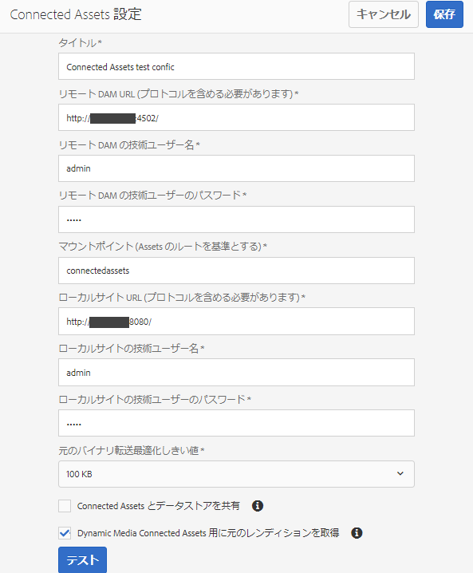

# Connected Assets を使用した での DAM アセットの共有[!DNL Experience Manager Sites]{#use-connected-assets-to-share-dam-assets-in-aem-sites}

大規模企業では、Web サイトの作成に必要なインフラストラクチャが分散していることがあります。Web サイト作成機能と、それらの Web サイトの作成に使用されたデジタルアセットが、別のデプロイメントに格納されている場合もあります。親会社が一緒に使用したい異種インフラストラクチャにつながる、連携または買収に必要な既存の導入環境が、地理的に分散する理由がいくつか考えられます。

[!DNL Adobe Experience Manager Sites] は Web ページの作成機能を備え、 は Web サイトに必要なアセットを提供するデジタルアセット管理（DAM）システムです。[!DNL Adobe Experience Manager Assets][!DNL Experience Manager] とを統合することで、上記の使用例をサポートするように [!DNL Experience Manager Sites] なりまし [!DNL Experience Manager Assets]た。

## Connected Assets の概要 {#overview-of-connected-assets}

When editing pages in Page Editor, the authors can seamlessly search, browse, and embed assets from a different [!DNL Experience Manager Assets] deployment. To do an [!DNL Experience Manager] administrator do a one-time integration of a local deployment of [!DNL Experience Manager Sites] with a different (remote) deployment of [!DNL Experience Manager Assets].

For the [!DNL Sites] authors, the remote assets are available as read-only local assets. この機能は、一度に少数のリモートアセットをシームレスに検索および使用できるようサポートします。多くのリモートアセットをローカルデプロイメントで一度に利用できるようにするには、一括でのリモートアセットの移行を検討します。詳しくは、 [Experience Manager Assets移行ガイドを参照してください](/help/assets/assets-migration-guide.md)。

### 前提条件とサポートされている導入 {#prerequisites}

この機能を使用または設定する前に、以下を確認してください。

* ユーザーがそれぞれのデプロイメント上で適切なユーザーグループに属している。
* Adobe Experience Managerのデプロイメントタイプでは、サポートされている条件の1つが満たされます。 [!DNL Experience Manager] 6.5は、クラウ [!DNL Assets] ドサービス [!DNL Experience Manager] として機能します。 詳しくは、Experience Managerのクラウドサ [ービスとしての接続されたアセット機能を参照してください](https://docs.adobe.com/content/help/en/experience-manager-cloud-service/assets/admin/use-assets-across-connected-assets-instances.html)。

   |  | [!DNL Experience Manager Sites] クラウドサービス | AMS版Experience Manager 6.5 [!DNL Sites] | Experience Manager 6.5オンプレ [!DNL Sites] ミスの場合 |
   |---|---|---|---|
   | **[!DNL Experience Manager Assets]クラウドサービス&#x200B;** | サポート対象 | サポート対象 | サポート対象 |
   | **AMS版Experience Manager 6.5[!DNL Assets]** | サポート対象 | サポート対象 | サポート対象 |
   | **Experience Manager 6.5オンプレ[!DNL Assets]ミスの場合** | サポートなし | サポートなし | サポートなし |

### サポートされているファイル形式 {#mimetypes}

作成者は、コンテンツファインダーで画像や次のタイプのドキュメントを検索し、検索したアセットをページエディターで使用できます。 Documents can be added to the `Download` component and images can be added to the `Image` component. Authors can also add the remote assets in any custom Experience Manager component that extends the default `Download` or `Image` components. サポートされるリストは次のとおりです。

* **画像形式**:画像コンポーネントでサポートされている [画像形式は](https://docs.adobe.com/content/help/ja-JP/experience-manager-core-components/using/components/image.html) 、接続されたアセットでサポートされています。 [!DNL Dynamic Media] 画像はサポートされていません。
* **ドキュメント形式**:詳しくは、接続さ [れたアセットでサポートされるドキュメント形式を参照してくださ](assets-formats.md#supported-document-formats)い。

### 関連するユーザーとグループ {#users-and-groups-involved}

この機能の設定や使用に関係する様々な役割と対応するユーザーグループについて、以下で説明します。ローカルスコープは、作成者によって Web ページが作成される使用例のために使用されます。リモートスコープは、必要なアセットをホストするDAMデプロイメントに使用されます。 The [!DNL Sites] author fetches these remote assets.

| 役割 | 対象範囲 | ユーザーグループ | ウォークスルーでのユーザ名 | 要件 |
|---|---|---|---|---|
| [!DNL Sites] administrator | ローカル | Experience Manager管理者 | `admin` | Set up Experience Manager, configure integration with the remote [!DNL Assets] deployment. |
| DAM ユーザー | ローカル | 作成者 | `ksaner` | Used to view and duplicate the fetched assets at `/content/DAM/connectedassets/`. |
| [!DNL Sites] 各手順で | ローカル | Author (with read access on the remote DAM and author access on local [!DNL Sites]) | `ksaner` | End user are [!DNL Sites] authors who use this integration to improve their content velocity. 作成者は、コンテンツファインダーを使用し、ローカルWebページで必要な画像を使用して、リモートDAM内のアセットを検索および参照します。 The credentials of `ksaner` DAM user are used. |
| [!DNL Assets] administrator | リモート | Experience Manager管理者 | `admin` リモートExperience Manager | クロスオリジンリソース共有（CORS）を設定します。 |
| DAM ユーザー | リモート | 作成者 | `ksaner` リモートExperience Manager | リモートのExperience Managerデプロイメントでの作成者の役割。 コンテンツファインダーを使用して Connected Assets 内のアセットを検索／参照します。 |
| DAM ディストリビューター（テクニカルユーザー） | リモート | パッケージビルダーおよびサイト作成者 | `ksaner` リモートExperience Manager | This user present on the remote deployment is used by Experience Manager local server (not the Site author role) to fetch the remote assets, on behalf of [!DNL Sites] author. この役割は、上の 2 つの `ksaner` の役割とは異なり、別のユーザーグループに属しています。 |

## Configure a connection between [!DNL Sites] and [!DNL Assets] deployments {#configure-a-connection-between-sites-and-assets-deployments}

この統合は、Experience Manager管理者が作成できます。 Once created, the permissions required to use it are established via user groups that are defined on the [!DNL Sites] deployment and on the DAM deployment.

To configure Connected Assets and local [!DNL Sites] connectivity, follow these steps.

1. Access an existing [!DNL Experience Manager Sites] deployment or create a deployment using the following command:

   1. JARファイルのフォルダー内で、ターミナルで次のコマンドを実行し、各Experience Managerサーバーを作成します。
      `java -XX:MaxPermSize=768m -Xmx4096m -jar <quickstart jar filepath> -r samplecontent -p 4502 -nofork -gui -nointeractive &`

   1. 数分後、Experience Managerサーバーの開始は正常に完了します。 Consider this [!DNL Experience Manager Sites] deployment as the local machine for web page authoring, say at `https://[local_sites]:4502`.

1. Ensure that the users and roles with local scope exist on the Experience Manager Sites deployment and on the [!DNL Experience Manager Assets] deployment on AMS. Create a technical user on [!DNL Assets] deployment and add to the user group mentioned in [users and groups involved](/help/assets/use-assets-across-connected-assets-instances.md#users-and-groups-involved).

1. でローカル配置にア [!DNL Experience Manager Sites] クセスしま `https://[local_sites]:4502`す。 **[!UICONTROL ツール]**／**[!UICONTROL アセット]**／**[!UICONTROL Connected Assets 設定]**&#x200B;をクリックし、次の値を入力します。

   1. [!DNL Experience Manager Assets] 場所は `https://[assets_servername_ams]:[port]`、
   1. DAM ディストリビューターの資格情報（テクニカルユーザー）。
   1. In **[!UICONTROL Mount Point]** field, enter the local Experience Manager path where Experience Manager fetches the assets. For example, `remoteassets` folder.
   1. Adjust the values of **[!UICONTROL Original Binary transfer optimization Threshold]** depending on your network. このしきい値より大きいサイズのアセットレンディションは、非同期で転送されます。
   1. Select **[!UICONTROL Datastore Shared with Connected Assets]**, if you use a datastore to store your assets and the Datastore is the common storage between both Experience Manager deployments. この場合、実際のアセットバイナリはデータストアに存在し、転送されないので、しきい値の制限は関係ありません。
      
   *図：接続されたアセットの一般的な設定です。*

1. アセットは既に処理され、レンディションが取得されたので、ワークフローランチャーを無効にします。Adjust the launcher configurations on the local ([!DNL Experience Manager Sites]) deployment to exclude the `connectedassets` folder, in which the remote assets are fetched.

   1. On [!DNL Experience Manager Sites] deployment, click **[!UICONTROL Tools]** > **[!UICONTROL Workflow]** > **[!UICONTROL Launchers]**.

   1. **[!UICONTROL DAM アセットの更新]**&#x200B;および&#x200B;**[!UICONTROL DAM メタデータの書き戻し]**&#x200B;ワークフローを含むランチャーを検索します。

   1. ワークフローランチャーを選択し、アクションバーの「**[!UICONTROL プロパティ]**」をクリックします。

   1. プロパティウィザードで、「**[!UICONTROL パス]**」フィールドを次のマッピングに従って変更し、マウントポイント **[!UICONTROL connectedassets]** が除外されるように正規表現を更新します。
   | 前 | 後 |
   |---|---|
   | `/content/dam(/((?!/subassets).)*/)renditions/original` | `/content/dam(/((?!/subassets)(?!connectedassets).)*/)renditions/original` |
   | `/content/dam(/*/)renditions/original` | `/content/dam(/((?!connectedassets).)*/)renditions/original` |
   | `/content/dam(/*)/jcr:content/metadata` | `/content/dam(/((?!connectedassets).)*/)jcr:content/metadata` |

   >[!NOTE]
   >
   >作成者がアセットを取得する際に、リモートのExperience Managerデプロイメントで使用可能なすべてのレンディションが取得されます。 取得したアセットのレンディションをさらに作成したい場合は、この設定手順をスキップしてください。The [!UICONTROL DAM Update Asset] workflow gets triggered and creates more renditions. These renditions are available only on the local [!DNL Sites] deployment and not on the remote DAM deployment.

1. Add the [!DNL Experience Manager Sites] instance as one of the **[!UICONTROL Allowed Origins]** on the remote [!DNL Experience Manager Assets] CORS configuration.

   1. 管理者の資格情報を使用してログインします。Search for `Cross-Origin`. **[!UICONTROL ツール]**／**[!UICONTROL 操作]**／**[!UICONTROL Web コンソール]**&#x200B;にアクセスします。

   1. To create a CORS configuration for [!DNL Experience Manager Sites] instance, click  icon next to **[!UICONTROL Adobe Granite Cross-Origin Resource Sharing Policy]**.

   1. In the field **[!UICONTROL Allowed Origins]**, input the URL of the local [!DNL Sites], that is, `https://[local_sites]:[port]`. 設定を保存します。

## リモートアセットの使用 {#use-remote-assets}

Web サイト作成者は、コンテンツファインダーを使用して DAM インスタンスに接続します。作成者は、コンポーネント内のリモートアセットを参照、検索およびドラッグできます。 リモート DAM への認証をおこなえるよう、管理者から提供された DAM ユーザーの資格情報を手元に用意してください。

作成者は、ローカル DAM インスタンスで利用可能なアセットとリモート DAM インスタンスで利用可能なアセットの両方を、単一の Web ページ内で使用できます。コンテンツファインダーを使用すれば、ローカル DAM の検索とリモート DAM の検索を切り替えることができます。

ローカルインスタンスで使用可能な、完全に対応するタグと同じ分類階層を持つリモートアセットのタグのみが取得さ [!DNL Sites] れます。 その他のタグは破棄されます。 作成者は、リモートExperience Managerのデプロイメントに存在するすべてのタグを使用して、リモートアセットを検索できます。Experience Managerオファーは全文検索です。

### 使用手順 {#walk-through-of-usage}

上記のセットアップを使用してオーサリングエクスペリエンスを試し、機能を理解してください。リモート DAM デプロイメントで、選択したドキュメントまたは画像を使用します。

1. Navigate to the [!DNL Assets] user interface on the remote deployment by accessing **[!UICONTROL Assets]** > **[!UICONTROL Files]** from [!DNL Experience Manager] workspace. または、ブラウザーで `https://[assets_servername_ams]:[port]/assets.html/content/dam` アクセスします。 選択したアセットをアップロードします。
1. On the [!DNL Sites] instance, in the profile activator in the upper-right corner, click **[!UICONTROL Impersonate as]**. ユーザー名として `ksaner` を入力し、提供されたオプションを選択し、「**[!UICONTROL OK]**」をクリックします。
1. **[!UICONTROL サイト]**／**[!UICONTROL We.Retail]**／**[!UICONTROL us]**／**[!UICONTROL en]** で、We.Retail Web サイトページを開きます。ページを編集します。または、ブラウザー `https://[aem_server]:[port]/editor.html/content/we-retail/us/en/men.html` でアクセスしてページを編集します。

   ページ **[!UICONTROL の左上隅にある]** 「サイドパネルを切り替え」をクリックします。

1. Open the [!UICONTROL Assets] tab and click **[!UICONTROL Log in to Connected Assets]**.
1. Provide the credentials -- `ksaner` as user name and `password` as password. This user has authoring permissions on both the [!DNL Experience Manager] deployments.
1. DAM に追加したアセットを検索します。リモートアセットは左側のパネルに表示されます。画像またはドキュメントでフィルタリングしてから、サポートされているドキュメントのタイプでさらにフィルタリングします。コンポーネント上の画像とコ `Image` ンポーネント上のドキュメントをドラ `Download` ッグします。

   The fetched assets are read-only on the local [!DNL Experience Manager Sites] deployment. You can still use the options provided by your [!DNL Experience Manager Sites] components to edit the fetched asset. コンポーネントによる編集は非破壊的です。

   

   *図：リモートDAM上のドキュメントを検索する際に、アセットの種類と画像をフィルターするオプションです。*

1. アセットが非同期で取得され、取得タスクが失敗した場合、サイト作成者に通知されます。オーサリング中またはオーサリング後でも、作成者は[非同期ジョブ](/help/assets/asynchronous-jobs.md)ユーザーインターフェースで取得タスクやエラーについての詳細情報を確認できます。

   

   *図：バックグラウンドで発生するアセットの非同期フェッチに関する通知。*

1. When publishing a page, [!DNL Experience Manager] displays a complete list of assets that are used in the page. 公開時にリモートアセットが正常に取得されることを確認します。取得した各アセットのステータスを確認するには、[非同期ジョブ](/help/assets/asynchronous-jobs.md)ユーザーインターフェースをご覧ください。

   >[!NOTE]
   >
   >1 つ以上のリモートアセットが取得されない場合でも、ページは公開されます。リモートアセットを使用するコンポーネントは空で公開されます。The [!DNL Experience Manager] notification area displays notification for errors that show in async jobs page.

>[!CAUTION]
>
>Web ページで使用された、取得済みのリモートアセットは、その格納先となるローカルフォルダー（上の手順の場合は `connectedassets`）へのアクセス権限を持つすべてのユーザーから検索や使用が可能となります。The assets are also searchable and visible in the local repository via [!UICONTROL Content Finder].

取得されたアセットは他のローカルアセットと同じように使用できます。ただし、関連するメタデータは編集できません。

## 制限事項 {#limitations}

**権限とアセット管理**

* ローカルアセットは、リモートデプロイメントの元のアセットと同期されません。DAM デプロイメント上での編集、削除または権限の失効は、ローカル側には一切伝播されません。
* ローカルアセットは読み取り専用のコピーです。Experience Managerコンポーネントは、アセットに対して非破壊的な編集を行います。 その他のいかなる編集もできません。
* ローカルで取得されたアセットは、オーサリング用途でのみ使用できます。アセット更新ワークフローの適用やメタデータの編集はおこなえません。
* 画像とリストに表示されるドキュメント形式のみがサポートされます。 [!DNL Dynamic Media] アセット、コンテンツフラグメント、エクスペリエンスフラグメントはサポートされていません。
* メタデータスキーマは取得されません。
* All [!DNL Sites] authors have read permissions on the fetched copies, even if they do not have access to the remote DAM deployment.
* 統合をカスタマイズするための API サポートはありません。
* この機能は、リモートアセットのシームレスな検索および使用をサポートします。多くのリモートアセットをローカルデプロイメントで一度に利用できるようにするには、リモートアセットの移行を検討します。[Assets 移行ガイド](assets-migration-guide.md)を参照してください。
* リモートアセットをページプロパティユーザーインターフェイスのページサムネールとし [!UICONTROL て使用する] ことはできません。 「画像を選択」をクリックして、「ページのプロパティ」ユーザイ [!UICONTROL ンターフェイスで] 、Webページのサムネ [!UICONTROL ール][!UICONTROL を設定できます]。

**セットアップとライセンス**

* [!DNL Experience Manager Assets] AMSでの展開がサポートされています。
* [!DNL Experience Manager Sites] は、一度に1つのリポジトリ [!DNL Experience Manager Assets] に接続できます。
* A license of [!DNL Experience Manager Assets] working as remote repository.
* One or more licenses of [!DNL Experience Manager Sites] working as local authoring deployment.

**使用方法**

* リモートアセットを検索し、ローカルページ上のリモートアセットをコンテンツを作成するためにドラッグする機能のみがサポートされています。
* 取得操作は 5 秒でタイムアウトします。アセット取得時、問題が発生する場合があります（ネットワークに問題がある場合など）。Authors can re-attempt by dragging the remote asset from [!UICONTROL Content Finder] to [!UICONTROL Page Editor].
* Simple edits that are non-destructive and the edit supported via the [!DNL Experience Manager] `Image` component, can be done on fetched assets. アセットは読み取り専用です。

## 問題のトラブルシューティング {#troubleshoot}

一般的なエラーシナリオのトラブルシューティングをおこなうには、次の手順に従います。

* コンテンツファインダーからリモートアセットを検索できない場合は、必要な役割と権限が設定されていることを再度確認してください。
* リモート DAM から取得したアセットは、リモートに存在しない、それを取得するための適切な権限が不足している、ネットワーク障害などの理由で Web ページに公開されない場合があります。アセットがリモートDAMから削除されないか、権限が変更されていないことを確認します。適切な前提条件が満たされていることを確認します。ページへのアセットの追加を再試行し、再公開します。 アセット取得時のエラーについては、[非同期ジョブのリスト](/help/assets/asynchronous-jobs.md) を確認してください。
