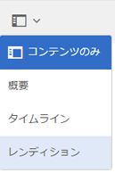
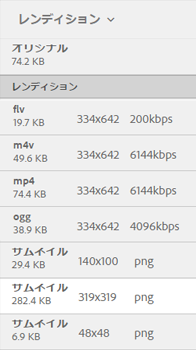

# ビデオレンディション {#video-renditions}

Adobe Experience Manager（AEM）Assets では、様々な形式（OGG、FLV など）のビデオアセット用のビデオレンディションを生成します。

AEM Assets では、メディアアセットの静的レンディションと動的レンディション（DM エンコードされたレンディション）がサポートされています。

静的レンディションは、FFMPEG（システムパスにインストールされ、使用できるもの）を使用してネイティブに生成され、コンテンツリポジトリに保存されます。

DMエンコードされたレンディションは、プロキシサーバーに保存され、実行時に提供されます。

AEM Assets は、クライアント側でのこのようなレンディションの再生をサポートします。

特定のビデオアセットのレンディションを表示するには、アセットページを開き、グローバルナビゲーションアイコンをタップします。 Then, choose **[!UICONTROL Renditions]** from the list.

ビデオレンディションのリストは、**[!UICONTROL レンディション]**&#x200B;パネルに表示されます。

DM エンコードされたレンディションのプロキシサーバーを設定するには、[Dynamic Media クラウドサービス](config-dynamic.md)を設定します。

必要なパラメーターを指定してビデオレンディションを生成するには、[対応するビデオプロファイルを作成](video-profiles.md)します。

プロキシサーバーを設定し、ビデオプロファイルを作成したら、このビデオプリセットを処理プロファイルに追加して、その処理プロファイルをフォルダーに適用することができます。

>[!NOTE]
>
>Microsoft Internet Explorer 11上のOGGおよびWAVファイルでは、オーディオ再生が動作しません。 An error `Invalid Source` displays up on the asset details page for assets with extension OGG or WAV.
>
>MS edgeおよびiPadでは、OGGファイルは再生されず、サポートされていない形式エラーが発生します。
