# ダイナミックメディアでのビデオ {#video}

ここでは、Dynamic Media でのビデオの操作方法について説明します。

## クイックスタート：ビデオ {#quick-start-videos}

次のワークフローの手順説明は、Dynamic Media 内のアダプティブビデオセットをすぐに使い始めることを目的としたものです。各手順に続いて、詳しい説明のあるトピックの見出しへのリンクが記載されています。

>[!NOTE]
>
>ダイナミックメディアでビデオを操作する前に、AEM管理者がダイナミックメディア —Scene7モードまたはダイナミックメディア — ハイブリッドモードでダイナミックメディアCloud Servicesを有効にし、設定済みであることを確認してください。
>
>* 「Dynamic Media - Scene7 モードの設定」の[ Dynamic Media クラウドサービスの設定](/help/assets/config-dms7.md#configuring-dynamic-media-cloud-services)、および[ Dynamic Media - Scene7 モードのトラブルシューティング](/help/assets/troubleshoot-dms7.md)を参照してください。
   >
   >
* [](/help/assets/config-dynamic.md#configuring-dynamic-media-cloud-services)Dynamic Media - ハイブリッドモードの設定の Dynamic Media クラウドサービスの設定を参照してください。

>


1. 次の手順を実行して、**Dynamic Media ビデオをアップロード**&#x200B;します。

   * 独自のビデオエンコーディングプロファイルを作成します。または、Dynamic Media に付属している事前定義済みの&#x200B;_アダプティブビデオエンコーディング_（AVE）プロファイルを使用してもかまいません。

      * [ビデオエンコーディングプロファイルの作成](/help/assets/video-profiles.md#creating-a-video-encoding-profile-for-adaptive-streaming)
      * [ビデオエンコーディングのベストプラクティス](#best-practices-for-encoding-videos)に関する詳細
   * ビデオ処理プロファイルを、プライマリソースビデオのアップロード先となる 1 つ以上のフォルダーに関連付けます。

      * [ビデオプロファイルのフォルダーへの適用](/help/assets/video-profiles.md#applying-a-video-profile-to-folders)
      * [処理プロファイルを使用するためのデジタルアセットの整理におけるベストプラクティス](/help/assets/organize-assets.md)に関する詳細
      * [デジタルアセットの整理](/help/assets/organize-assets.md)に関する詳細
   * フォルダーにプライマリソースビデオをアップロードします。15 GB までのビデオファイルをアップロードできます。フォルダーにビデオを追加すると、そのフォルダーに割り当てたビデオ処理プロファイルに従ってビデオがエンコードされます。

      * [ビデオのアップロード](/help/assets/managing-video-assets.md#upload-and-preview-video-assets)
      * [サポートされる入力ファイル形式](/help/assets/assets-formats.md#supported-multimedia-formats)に関する詳細
   * アセットまたはワークフロー表示から[ビデオ処理の進行状況](#monitoring-video-encoding-and-youtube-publishing-progress)を監視します。


1. 次のいずれかの操作をおこなって、**Dynamic Media ビデオを管理**&#x200B;します。

   * ビデオアセットを整理、参照および検索します。

      * [デジタルアセットの整理](/help/assets/organize-assets.md)。
詳しくは、[処理プロファイルを使用するためのデジタルアセットの整理におけるベストプラクティス](organize-assets.md)を参照してください。

      * [ビデオアセットの検索](search-assets.md#custompredicates)または[アセットの検索](/help/assets/search-assets.md)。
   * ビデオアセットをプレビューして公開します。

      * ソースビデオとビデオのエンコードされたレンディションを、関連するサムネールと共に表示します。
         [ビデオのプレビュー](managing-video-assets.md#upload-and-preview-video-assets)または[アセットのプレビュー](previewing-assets.md)。
         [ビデオレンディションの表示](video-renditions.md)
         [ビデオレンディションの管理](managing-assets-touch-ui.md#managing-renditions)。

      * [ビューアプリセットの管理](managing-viewer-presets.md)
      * [アセットの公開](publishing-dynamicmedia-assets.md)
   * ビデオのメタデータを操作します。

      * フレームレート、オーディオおよびビデオのビットレート、コーデックなど、エンコードされたビデオレンディションのプロパティを表示します。
         [ビデオレンディショのプロパティの表示](video-renditions.md)

      * タイトル、説明、タグ、カスタムメタデータフィールドなど、ビデオのプロパティを編集します。
         [ビデオプロパティの編集](managing-assets-touch-ui.md#editing-properties)

      * [デジタルアセット用のメタデータの管理](metadata.md)
      * [メタデータスキーマ](metadata-schemas.md)
   * ビデオをレビューおよび承認し、注釈を付け、完全なバージョン管理を維持します。

      * [ビデオの注釈の作成](managing-video-assets.md#annotate-video-assets) 、アセットの [注釈の作成](managing-assets-touch-ui.md#annotating)

      * [バージョンの作成](managing-assets-touch-ui.md#asset-versioning)
      * [アセットへのワークフローの適用](assets-workflow.md) 、またはアセットでのワークフローの [開始を参照してください。](managing-assets-touch-ui.md#starting-a-workflow-on-an-asset)

      * [フォルダーのアセットのレビュー](bulk-approval.md)
      * [プロジェクト](../sites-authoring/projects.md)


1. 次のいずれかの操作をおこなって、**Dynamic Media ビデオを公開します。**

   * Webコンテンツ管理ーシステムとしてAdobe Experience Managerを使用している場合は、ビデオを直接Webページに追加できます。

      * [Web ページへのビデオの追加](adding-dynamic-media-assets-to-pages.md)
   * サードパーティの Web コンテンツ管理システムを使用している場合、Web ページにビデオをリンクするか、ビデオを埋め込むことができます。

      * URL を使用したビデオの統合：
         [Web アプリケーションへの URL のリンク](linking-urls-to-yourwebapplication.md)。

      * Web ページの埋め込みコードを使用したビデオの統合：
         [Web ページへのビデオビューアの埋め込み](embed-code.md)。
   * [YouTube にビデオを公開します](#publishing-videos-to-youtube)。
   * [ビデオレポートを生成します](#viewing-video-reports)。

   * [ビデオにキャプションを追加します](#adding-captions-to-video)。


## Dynamic Media でのビデオの操作 {#working-with-video-in-dynamic-media}

Dynamic Media のビデオは、高品質のアダプティブビデオを簡単に公開して、デスクトップ、iOS、Android、Blackberry、Windows などのモバイルデバイスを含む複数の画面にストリーミングするためのエンドツーエンドのソリューションです。アダプティブビデオセットでは、同じビデオを、400 kbps、800 kbps、1000 kbps などの様々なビットレートと形式でエンコードしたバージョンにグループ分けします。デスクトップコンピューターまたはモバイルデバイスによって、利用可能な帯域幅が検出されます。

例えば、iOS モバイルデバイスでは、3G、4G、Wi-Fi などの帯域幅が検出されます。次に、アダプティブビデオセット内の様々なビデオのビットレートの中から、適切なエンコード済みビデオが自動的に選択されます。そのビデオが、デスクトップ、モバイルデバイスまたはタブレットにストリーミングされます。

さらに、デスクトップまたはモバイルデバイスでネットワーク状況が変化した場合に、ビデオ品質が自動的に、動的に切り替えられます。また、デスクトップが全画面表示モードに切り替わった場合、アダプティブビデオセットがより高い解像度を使用するように応答するので、ユーザーの閲覧エクスペリエンスが向上します。アダプティブビデオセットを使用すると、Dynamic Media ビデオを複数の画面とデバイスで再生するユーザーにとって最適な再生方法が提供されます。

再生または再生時に選択するエンコード済みビデオの決定に、ビデオプレーヤーが使用するロジックは、次のアルゴリズムに基づきます。

1. ビデオプレーヤーは、プレーヤー自体の「初期ビットレート」に設定されている値に最も近いビットレートで、初期ビデオフラグメントを読み込みます。
1. ビデオプレーヤーは、帯域幅の速度の変化に応じて、次の条件に従って切り替わります。

   1. プレーヤーは、見積もり帯域幅を超えない範囲内で、最も高い帯域幅でのストリームを選択します。
   1. プレーヤーは、使用可能な帯域幅の 80％ほどを見積もります。ただし、使用可能な帯域幅が上昇した場合は、帯域幅を大きく見積もりすぎてすぐに元の帯域幅に戻ることを防ぐために、より控えめな 70％ほどの見積もりとなります。

アルゴリズムの技術情報について詳しくは、[https://android.googlesource.com/platform/frameworks/av/+/master/media/libstagefright/httplive/LiveSession.cpp](https://android.googlesource.com/platform/frameworks/av/+/master/media/libstagefright/httplive/LiveSession.cpp) を参照してください。

1 つのビデオおよびアダプティブビデオセットの管理では、次の方法がサポートされています。

* サポートされる各種ビデオ形式およびオーディオ形式のビデオをアップロードして、複数の画面での再生用にビデオを MP4 H.264 形式へとエンコードすること。事前定義済みのアダプティブビデオセット、1 つのビデオのエンコーディングプリセットを使用するか、独自のエンコーディングをカスタマイズしてビデオの品質とサイズを制御することができます。

   * アダプティブビデオセットが生成される場合、そのセットには MP4 ビデオが含まれます。
   * **注意**：マスター／ソースビデオはアダプティブビデオセットには追加されません。

* すべての HTML5 ビデオビューアでのビデオキャプション。
* 効率的なビデオアセット管理のための、メタデータが完全にサポートされたビデオの整理、参照および検索。
* Web やデスクトップおよびモバイルデバイス（iPhone、iPad、Android、Blackberry および Windows Phone を含む）へのアダプティブビデオセットの配信。

アダプティブビデオのストリーミングは、各種 iOS プラットフォームでサポートされています。詳しくは、[Scene7 ビューアリファレンスガイド](https://docs.adobe.com/content/help/ja-JP/dynamic-media-developer-resources/library/viewers-aem-assets-dmc/video/c-html5-video-reference.translate.html)を参照してください。

Dynamic Media では、MP4 H.264 ビデオのモバイルビデオ再生がサポートされています。このビデオ形式をサポートする Blackberry デバイスについては、[Blackberry でサポートされているビデオ形式](https://support.blackberry.com/kb/articleDetail?ArticleNumber=000005482)のページで確認できます。

このビデオ形式をサポートする Windows デバイスについては、[Windows Phone でサポートされているビデオ形式](https://msdn.microsoft.com/library/windows/apps/ff462087%28v=vs.105%29.aspx)で確認できます。

* Dynamic Media ビデオビューアプリセットを使用してビデオを再生します。このビューアプリセットには、次のビューアが含まれます。

   * 1 つのビデオのビューア
   * ビデオコンテンツと画像コンテンツの両方を組み合わせた混在メディアビューア

* 自社ブランドのニーズに合わせてビデオプレーヤーを設定します。
* 単純な URL か埋め込みコードを使用して、ビデオを Web サイト、モバイルサイトまたはモバイルアプリケーションに統合します。

詳しくは、[動的なビデオ再生](https://s7d9.scene7.com/s7/uvideo.jsp?asset=GeoRetail/Mop_AVS&amp;config=GeoRetail/Universal_Video1&amp;stageSize=640,480)の例を参照してください。

See also [Viewers for AEM Assets and Dynamic Media Classic](https://docs.adobe.com/content/help/ja-JP/dynamic-media-developer-resources/library/viewers-aem-assets-dmc/c-html5-s7-aem-asset-viewers.translate.html) and [Viewers for AEM assets only](https://docs.adobe.com/content/help/ja-JP/dynamic-media-developer-resources/library/viewers-for-aem-assets-only/c-html5-aem-asset-viewers.translate.html) in the Adobe Scene7 Viewers Reference Guide.

## ベストプラクティス：HTML5 ビデオビューアの使用 {#best-practice-using-the-html-video-viewer}

Dynamic Media の HTML5 ビデオビューアプリセットは堅牢なビデオプレーヤーです。このプリセットを使用すれば、HTML5 ビデオ再生でよくある問題や、モバイルデバイスに関する問題（アダプティブストリーミング配信機能がない、デスクトップブラウザーの対応状況が限定的であるなど）の多くを回避することができます。

プレーヤーのデザイン側から見れば、ビデオプレーヤーの全機能を、標準の Web 開発ツールでデザインできます。例えば、HTML5 と CSS を使用して、ボタン、コントロールおよびカスタムのポスター画像背景をデザインして、カスタマイズした表示によって顧客に対応することができます。

ビューアの再生側から見れば、ビューアによってブラウザーのビデオ機能が自動的に検出されます。その後、HLS（HTTP ライブストリーミング）を使用してビデオが配信されます。HLS はアダプティブビデオストリーミングとも呼ばれます。または、これらの配信方法が使用できない場合は、HTML5 プログレッシブが代わりに使用されます。

HTML5 と CSS を使用して再生コンポーネントをデザインできる機能、埋め込み再生の機能、ブラウザーの機能に応じてアダプティブストリーミングまたはプログレッシブストリーミングを使用できる機能を 1 つのプレーヤーにまとめることで、リッチメディアコンテンツを配信する範囲をデスクトップユーザーとモバイルユーザーの両方に拡大して、ビデオエクスペリエンスを効率化することができます。

『Adobe Scene7 ビューアリファレンスガイド』の [HTML5 ビューアについて](https://docs.adobe.com/content/help/ja-JP/dynamic-media-developer-resources/library/viewers-for-aem-assets-only/c-html5-aem-asset-viewers.translate.html)も参照してください。

### HTML5 ビデオビューアを使用した、デスクトップコンピューターおよびモバイルデバイス上でのビデオ再生 {#playback-of-video-on-desktop-computers-and-mobile-devices-using-the-html-video-viewer}

デスクトップおよびモバイルへのアダプティブビデオストリーミングの場合、ビットレートの切り替えに使用されるビデオは、アダプティブビデオセット内のすべての MP4 ビデオに基づいています。

ビデオ再生は、HLS（HTTP ライブストリーミング）かプログレッシブビデオダウンロードを使用しておこなわれます。6.0、6.1、6.2 など以前の AEM バージョンでは、ビデオは HTTP 上でストリーミングされました。

一方、AEM 6.3 以降では、DM ゲートウェイサービスの URL が常に HTTPS も使用するので、ビデオは HTTPS でストリーミングされるようになりました（つまり HLS）。このデフォルトの動作はユーザーに影響しません。つまり、ブラウザーでサポートされていない場合を除き、ビデオストリーミングは常に HTTPS 上でおこなわれます（以下の表を参照してください）。したがって、次のようになります。

* HTTPS Web サイトが HTTPS ビデオストリーミングに対応している場合は、ストリーミングが適しています。
* HTTP Web サイトが HTTPS ビデオストリーミングに対応している場合は、ストリーミングが適しており、Web ブラウザーから混合コンテンツに関する問題は発生しません。

HLS は、アダプティブビデオストリーミングの Apple 標準で、ネットワーク帯域幅のキャパシティに応じて再生を自動的に調整します。また、HLS では、ビデオの残りのダウンロードを待たずに、ビデオ内の任意のポイントを「シーク」できます。

プログレッシブビデオは、ユーザーのデスクトップシステムやモバイルデバイスにダウンロードしてローカルに保存することで配信されます。

次の表に、デバイス、ブラウザー、およびデスクトップコンピューターやモバイルデバイスでの Scene7 ビデオビューアによるビデオの再生方法を示します。

<table>
 <tbody>
  <tr>
   <td><strong>デバイス</strong></td>
   <td><strong>ブラウザー</strong></td>
   <td><strong>ビデオ再生モード</strong></td>
  </tr>
  <tr>
   <td>デスクトップ</td>
   <td>Internet Explorer 9 および 10</td>
   <td>プログレッシブダウンロード。</td>
  </tr>
  <tr>
   <td>デスクトップ</td>
   <td>Internet Explorer 11+</td>
   <td>Windows 8 および Windows 10 では、HLS が要求されるたびに HTTPS を強制的に使用します。既知の制約事項：このブラウザー／オペレーティングシステムの組み合わせでは、HLS での HTTP は機能しません。<br /><br />Windows 7 - プログレッシブダウンロード。HTTP プロトコルと HTTPS プロトコルの選択には標準的なロジックが使用されます。</td>
  </tr>
  <tr>
   <td>デスクトップ</td>
   <td>Firefox 23～44</td>
   <td>プログレッシブダウンロード。</td>
  </tr>
  <tr>
   <td>デスクトップ</td>
   <td>Firefox 45 以降</td>
   <td>HLS</td>
  </tr>
  <tr>
   <td>デスクトップ</td>
   <td>Chrome</td>
   <td>HLS</td>
  </tr>
  <tr>
   <td>デスクトップ</td>
   <td>Safari（Mac）</td>
   <td>HLS</td>
  </tr>
  <tr>
   <td>モバイル</td>
   <td>Chrome（Android 6 以前）</td>
   <td>プログレッシブダウンロード。</td>
  </tr>
  <tr>
   <td>モバイル</td>
   <td>Chrome（Android 7 以降）</td>
   <td>HLS</td>
  </tr>
  <tr>
   <td>モバイル</td>
   <td>Android（デフォルトブラウザー）</td>
   <td>プログレッシブダウンロード。</td>
  </tr>
  <tr>
   <td>モバイル</td>
   <td>Safari（iOS）</td>
   <td>HLS</td>
  </tr>
  <tr>
   <td>モバイル</td>
   <td>Chrome（iOS）</td>
   <td>HLS</td>
  </tr>
  <tr>
   <td>モバイル</td>
   <td>Blackberry</td>
   <td>HLS</td>
  </tr>
 </tbody>
</table>

## Dynamic Media ビデオソリューションのアーキテクチャ {#architecture-of-dynamic-media-video-solution}

次の図に、アップロード後、（Dynamic Media Hybrid モードの）DMGateway によってエンコードされ、公開されるビデオのオーサリングワークフローの全体像を示します。

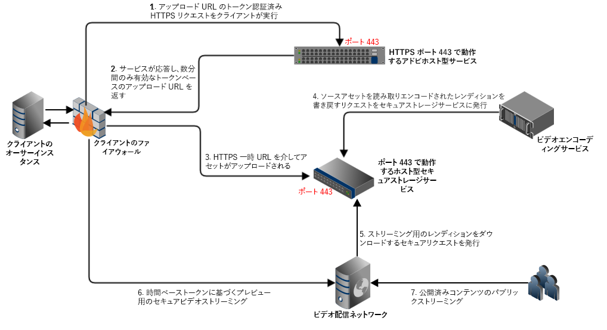

## ビデオのハイブリッド公開アーキテクチャ {#hybrid-publishing-architecture-for-videos}

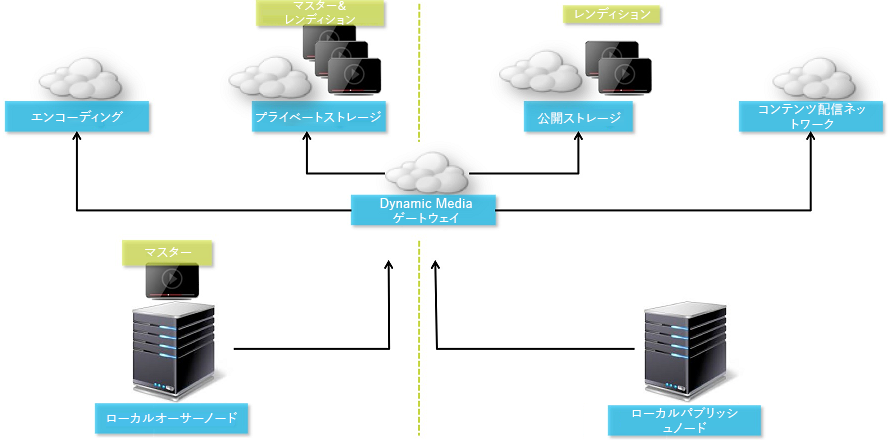

## ビデオエンコーディングのベストプラクティス {#best-practices-for-encoding-videos}

Dynamic Media を有効にし、ビデオクラウドサービスを設定済みの場合、**Dynamic Media エンコードビデオ**&#x200B;ワークフローがビデオをエンコードします。このワークフローは、ワークフローの処理履歴とエラー情報を取り込みます。詳しくは、[ビデオエンコーディングと YouTube への公開の進行状況の監視](#monitoring-video-encoding-and-youtube-publishing-progress)を参照してください。Dynamic Media を有効にし、ビデオクラウドサービスを設定済みの場合、ビデオをアップロードすると、**[!UICONTROL Dynamic Media エンコードビデオ]**&#x200B;ワークフローが自動的に有効になります（Dynamic Media を使用していない場合は、**[!UICONTROL DAM アセットの更新]**&#x200B;ワークフローが有効になります）。

ここでは、ソースビデオファイルのエンコードにおけるベストプラクティスのヒントを説明します。

ビデオエンコーディングに関するアドバイスについては、以下を参照してください。

* [ストリーミング 101：基本 - コーデック、帯域幅、データレートおよび解像度](https://www.adobe.com/go/learn_s7_streaming101_jp)。
* [ビデオエンコーディングの基本](https://www.adobe.com/go/learn_s7_encoding_jp)。

### ソースビデオファイル {#source-video-files}

ビデオファイルをエンコードするときは、可能な限り最高品質のソースビデオファイルを使用します。以前にエンコードされたビデオファイルの使用は避けてください。そのようなファイルは既に圧縮済みで、さらにエンコードすると標準を下回る品質のビデオが作成されるからです。

次の表に、ソースビデオファイルのエンコード前の推奨サイズ、縦横比および最小ビットレートを示します。

| サイズ | 縦横比 | 最小ビットレート |
|--- |--- |--- |
| 1,024 X 768 | 4:3 | 4,500 kbps（ほとんどのビデオ） |
| 1,280 X 720 | 16:9 | 3,000～6,000 kbps（ビデオ内のモーションの量に応じて調整） |
| 1,920 X 1,080 | 16:9 | 6,000～8,000 kbps（ビデオ内のモーションの量に応じて調整） |

### ファイルのメタデータの取得 {#obtaining-a-file-s-metadata}

ビデオ編集ツールを使用してメタデータを参照するか、メタデータ取得用のアプリケーションを使用して、ファイルのメタデータを取得することができます。以下は、サードパーティアプリケーションの MediaInfo を使用してビデオファイルのメタデータを取得する手順です。

1. 次の Web ページにアクセスします。[https://mediainfo.sourceforge.net/en/Download](https://mediainfo.sourceforge.net/en/Download)
1. GUI バージョンのインストーラーを選択してダウンロードし、インストール手順に従って操作します。
1. インストールの完了後、ビデオファイルを右クリックして（Windows のみ）MediaInfo を選択するか、MediaInfo を開いてビデオファイルをアプリケーションにドラッグします。ビデオの幅、高さ、fps を含む、ビデオファイルに関連するすべてのメタデータが表示されます。

### 縦横比 {#aspect-ratio}

プライマリソースビデオファイルのビデオエンコーディングプリセットを選択または作成するときには、プライマリソースビデオファイルと同じ縦横比をプリセットに使用してください。縦横比とは、ビデオの高さに対する幅の比率のことです。

ビデオファイルの縦横比を求めるには、ファイルのメタデータを取得し、そのファイルの幅と高さを記録します（前述のファイルのメタデータの取得を参照してください）。さらに、次の式を使用して縦横比を計算します。

幅/高さ = 縦横比

次の表に、この式の解を一般的な縦横比に変換した結果を示します。

| 式の解 | 縦横比 |
|--- |--- |
| 1.33 | 4:3 |
| 0.75 | 3:4 |
| 1.78 | 16:9 |
| 0.56 | 9:16 |

例えば、幅 1,440、高さ 1,080 のビデオの縦横比は 1,440/1,080、つまり 1.33 になります。このビデオファイルをエンコードするには、縦横比 4:3 のビデオエンコーディングプリセットを選択します。

### ビットレート {#bitrate}

ビットレートとは、1 秒間のビデオ再生を作成するためにエンコードされるデータの量です。ビットレートは、1 秒あたりのキロビット数（Kbps）の単位で測定します。

>[!NOTE]
>
>すべてのコーデックで非可逆圧縮が使用されるので、ビットレートは、ビデオ品質における最も重要な要素となります。非可逆圧縮では、ビデオファイルの圧縮率が高いほど、ビデオの品質は低下します。したがって、他の特性（解像度、フレームレートおよびコーデック）がすべて等しい場合は、ビットレートが低いほど、圧縮ファイルの品質は低下します。

ビットレートエンコーディングは 2 種類あり、そのどちらかを選択できます。

* **[!UICONTROL 固定ビットレートエンコーディング]**（CBR） - CBR エンコーディングでは、ビットレートまたは 1 秒あたりのビット数が、エンコーディングプロセス全体で同じ数値に維持されます。CBR エンコーディングでは、設定されているデータレートが、ビデオ全体での設定値として使用されます。また、CBR エンコーディングでは、メディアファイルの品質は最適化されませんが、その分、空き容量の節約になります。ビデオ全体に同じようなモーションレベルが含まれている場合は、CBR を使用します。CBR は、ビデオコンテンツのストリーミングに最も一般的に使用されています。[カスタムで追加するビデオエンコーディングパラメーターの使用](/help/assets/video-profiles.md#using-custom-added-video-encoding-parameters)も参照してください。

* **[!UICONTROL 可変ビットレートエンコーディング]**（VBR） - VBR エンコーディングでは、圧縮形式で必要となるデータに基づいて、データのレートが設定した下限から上限の範囲内で調整されます。つまり、VBR エンコーディングプロセスでは、メディアファイルのビットレートが、そのニーズに応じて動的に増減します。VBR は、CBR よりエンコードに時間がかかりますが、生成されるメディアファイルは最高品質となります。VBR は、ビデオコンテンツの HTTP プログレッシブ配信に最も一般的に使用されます。

VBR と CRB のどちらを使用するべきかVBR と CBR のどちらを選択するべきかという話になると、ほとんどの場合、メディアファイルには VBR を使用することをお勧めします。VBR は、優位性のあるビットレートで CBR より高品質のファイルを生成します。VBR を使用するときは、2 パスエンコーディングを使用し、最大ビットレートをターゲットビデオのビットレートの 1.5 倍に設定してください。

ビデオエンコーディングプリセットを選択するときには、ターゲットのエンドユーザーの接続速度を考慮してください。その速度の 80％のデータレートを持つプリセットを選択してください。例えば、ターゲットのエンドユーザーの接続速度が 1,000 Kbps の場合の最適なプリセットは、ビデオデータレートが 800 Kbps のプリセットです。

次の表に、一般的な接続速度のデータレートを示します。

| 速度（Kbps） | 接続タイプ |
|--- |--- |
| 256 | ダイアルアップ接続。 |
| 800 | 一般的なモバイル接続。この接続では、3G エクスペリエンス向けに 400～800 の範囲のデータレートがターゲットとなります。 |
| 2,000 | 一般的なブロードバンドデスクトップ接続。この接続では、800～2,000 Kbps の範囲のデータレートがターゲットとなります。大部分のターゲットは、平均 1,200～1,500 Kbps です。 |
| 5,000 | 一般的な高帯域幅接続。この高帯域幅の範囲でのエンコードは推奨されません。ほとんどのユーザーに対して、この速度でビデオを配信することはできません。 |

### 解像度 {#resolution}

「解像度」は、ビデオファイルの高さと幅をピクセル単位で表したものです。ほとんどのソースビデオは、1,920 x 1,080 などの高解像度で保存されます。ストリーミング用のソースビデオは、比較的低い解像度（640 x 480 以下）に圧縮されます。

解像度とデータレートは、ビデオの品質を決める、一体的な関連を持つ 2 つの要素です。同じビデオ品質を維持するには、ビデオファイル内のピクセル数が多いほど（解像度が高いほど）、データレートを高くする必要があります。例えば、320 x 240 の解像度と 640 x 480 の解像度のビデオファイルにおけるフレームあたりピクセル数を考察すると、次のようになります。

| 解像度 | フレームあたりピクセル数 |
|--- |--- |
| 320 x 240 | 76,800 |
| 640 x 480 | 307,200 |

640 x 480 のファイルのフレームあたりピクセル数は 4 倍あります。これら 2 つの解像度例で同じデータレートを達成するには、640 x 480 のファイルに対して 4 倍の圧縮率を適用します。その結果、ビデオの品質が低下する可能性があります。つまり、250 Kbps のビデオデータレートの場合、320 x 240 の解像度では高品質の表示が可能ですが、640 x 480 の解像度では高品質の表示は期待できません。

一般に、高いデータレートを使用するほど、ビデオの画質は良くなり、高い解像度を使用するほど、その画質を維持するために必要になるデータレートも（解像度が低い場合と比較して）増加します。

解像度とデータレートには関連があるので、ビデオをエンコードする際には次の 2 つの方法から選択できます。

* データレートを選択してから、選択したデータレートできれいに表示される最高の解像度でエンコードします。
* 解像度を選択してから、選択した解像度で高品質のビデオを配信するために必要になるデータレートでエンコードします。

プライマリソースビデオファイルのビデオエンコーディングプリセットを選択（または作成）する場合は、次の表を使用して正しい解像度をターゲットにします。

| 解像度 | 高さ（ピクセル） | 画面サイズ |
|--- |--- |--- |
| 240p | 240 | ごく小さな画面 |
| 300p | 300 | 小型の画面（一般にモバイルデバイス用） |
| 360p | 360 | 小型の画面 |
| 480p | 480 | 中型の画面 |
| 720p | 720 | 大型の画面 |
| 1080p | 1080 | 高画質の大型の画面 |

### Fps（1 秒あたりのフレーム数）{#fps-frames-per-second}

日本および米国では、ほとんどのビデオは 1 秒あたりのフレーム数（fps）が 29.97 で撮影されます。また、ヨーロッパでは、ほとんどのビデオが 25 fps で撮影されます。映画は 24 fps で撮影されます。

プライマリソースビデオファイルの fps レートに一致するビデオエンコーディングプリセットを選択します。例えば、プライマリソースビデオが 25 fps の場合は、25 fps のエンコーディングプリセットを選択します。デフォルトでは、すべてのカスタムエンコーディングでプライマリソースビデオファイルの fps が使用されます。そのため、ビデオエンコーディングプリセットを作成するときに、fps 設定を明示的に指定する必要はありません。

### ビデオエンコーディングのサイズ {#video-encoding-dimensions}

最適化の理由で、ソースビデオのサイズがエンコードされるすべてのビデオの整数倍になるようなエンコーディングのサイズを選択してください。

この比率を計算するために、ソースの幅をエンコードの幅で割って幅の比率を求めます。次に、ソースの高さをエンコードの高さで割って高さの比率を求めます。

結果の比率が整数の場合は、ビデオが最適なサイズで縮小されます。結果の比率が整数でない場合は、ディスプレイに圧縮による副作用のピクセルが残存して、ビデオの品質に影響を及ぼします。この影響は、ビデオにテキストが含まれる場合に特に目立ちます。

例として、1,920 x 1,080 のソースビデオを取り上げます。次の表の 3 つのエンコードされたビデオは、使用すべき最適なエンコーディング設定です。

| ビデオタイプ | 幅 x 高さ | 幅の比率 | 高さの比率 |
|--- |--- |--- |--- |
| ソース | 1,920 x 1,080 | 1 | 1 |
| エンコード | 960 x 540 | 2 | 2 |
| エンコード | 640 x 360 | 3 | 3 |
| エンコード | 480 x 270 | 4 | 4 |

### エンコードされたビデオのファイル形式 {#encoded-video-file-format}

Dynamic Media では、MP4 H.264 ビデオエンコーディングプリセットの使用を推奨しています。MP4 ファイルでは H.264 ビデオコーデックが使用されるので、高品質のビデオを圧縮されたファイルサイズで作成することができます。

## YouTube へのビデオの公開 {#publishing-videos-to-youtube}

以前作成した YouTube チャンネルに、オンプレミス AEM ビデオアセットを直接公開できます。

ビデオアセットを YouTube に公開するには、タグを使用して AEM Assets をセットアップします。これらのタグを YouTube チャンネルに関連付けます。ビデオアセットのタグが YouTube チャンネルのタグと一致する場合、ビデオが YouTube に公開されます。YouTube への公開は、関連するタグが使用されている限り、ビデオの通常公開と一緒におこなわれます。

YouTube は独自のエンコーディングをおこないます。そのため、AEM にアップロードされた元のビデオファイルは、Dynamic Media のエンコードで作成されたビデオレンディションではなく YouTube に公開されます。Dynamic Media を使用してビデオを処理する必要はありませんが、再生にビューアプリセットが必要な場合は、それがおこなわれます。

ビデオ処理プロファイルをスキップして YouTube に直接公開すると、AEM Assets のビデオアセットに対して、表示可能なサムネールが作成されない可能性があります。また、dynamicmedia または dynamicmedia_scene7 実行モードで実行する場合、エンコードされていないビデオは、どの Dynamic Media アセットタイプとも機能しません。

ビデオアセットの YouTube サーバーへの公開において、YouTube との安全でセキュアなサーバー間認証をおこなうには、次のタスクを実行する必要があります。

1. [Google Cloud 設定](#configuring-google-cloud-settings)
1. [YouTube チャンネルの作成](#creating-a-youtube-channel)
1. [公開用タグの追加](#adding-tags-for-publishing)
1. [YouTube への公開のレプリケーションエージェントの有効化](#enabling-the-youtube-publish-replication-agent)
1. [AEM での YouTube の設定](#setting-up-youtube-in-aem)
1. [（オプション）アップロードしたビデオのデフォルト YouTube プロパティ設定の自動化](#optional-automating-the-setting-of-default-youtube-properties-for-your-uploaded-videos)
1. [YouTube チャンネルへのビデオの公開](#publishing-videos-to-your-youtube-channel)
1. [（オプション）YouTube での公開済みビデオの確認](/help/assets/video.md#optional-verifying-the-published-video-on-youtube)
1. [Web アプリケーションへの YouTube URL のリンク](#linking-youtube-urls-to-your-web-application)

また、[ビデオを非公開にして YouTube から削除する](#unpublishing-videos-to-remove-them-from-youtube)こともできます。

### Google Cloud 設定 {#configuring-google-cloud-settings}

YouTube に公開するには、Google アカウントが必要です。Gmail のアカウントを持っている場合は、既に Google アカウントも所有しています。Google アカウントがない場合も、簡単に作成できます。Google アカウントが必要な理由として、YouTube へのビデオアセットの公開時に秘密鍵証明書が必要になります。既にアカウントを作成済みの場合は、このタスクをスキップして [YouTube チャンネルの作成](#creating-a-youtube-channel)タスクに進んでください。

Google Cloud で使用するアカウントと YouTube に使用する Google アカウントは、必ずしも同じである必要はありません。

Google ではユーザーインターフェイスが定期的に変更されることに注意してください。そのため、YouTube にビデオを公開する手順は、以下の手順とは少し異なる場合があります。これは、ビデオが YouTube にアップロードされるかどうかを確認する場合にも当てはまります。

>[!NOTE]
>
>以下の手順は、このドキュメントを執筆している時点で正確なものです。Google は、Web サイトを予告なく定期的に更新します。そのため、以下の手順は、最新の手順とは少し異なる場合もあります。

Google Cloud を設定するには：

1. 新しい Google アカウントを作成します。
   [https://accounts.google.com/SignUp?service=mail](https://accounts.google.com/SignUp?service=mail)

   既に Google アカウントを持っている場合は、次のステップに進んでください。

1. [https://cloud.google.com/](https://cloud.google.com/) にアクセスします。
1. On the Google Cloud page, near the upper-right corner, click **[!UICONTROL Console.]**

   必要に応じて、Google アカウントの資格情報を使用して&#x200B;**[!UICONTROL ログイン]**&#x200B;し、「]**コンソール**[!UICONTROL 」オプションの確認が必要になる場合があります。

1. ダッシュボードページで、**[!UICONTROL Google Cloud Platform]** の右側にある「プロジェクト」ドロップダウンリストをクリックして、プロジェクトの選択ダイアログボックスを開きます。
1. In the Select a project dialog box, tap **[!UICONTROL New Project.]**

   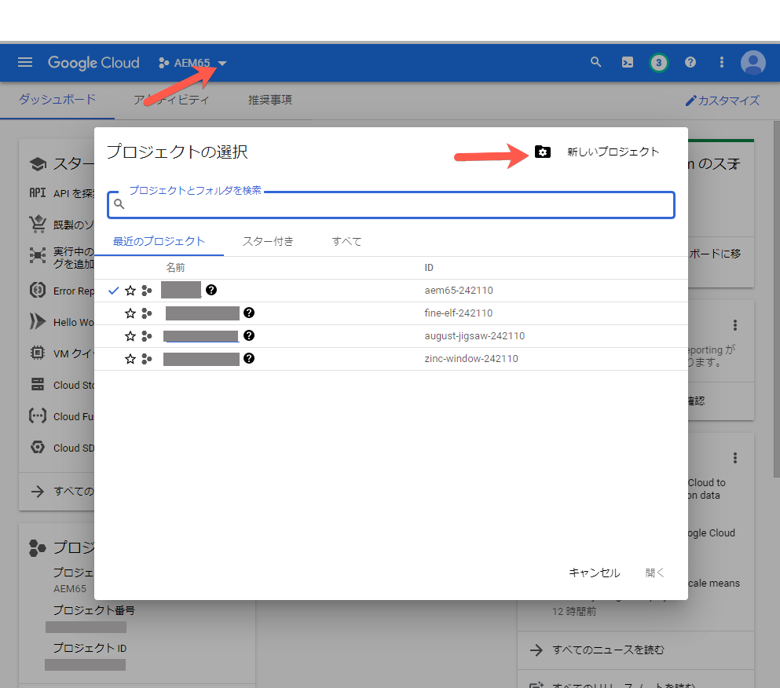

1. 新しいプロジェクトダイアログボックスで、「プロジェクト名」フィールドに新しいプロジェクトの名前を入力します。

   プロジェクト ID は、プロジェクト名に基づいて付けられます。そのため、プロジェクト名は慎重に選んでください。プロジェクト名を後で変更することはできません。また、後で AEM で YouTube をセットアップする場合は、同じプロジェクト ID を再度入力する必要があるので、ID を書き留めておくとよいでしょう。

1. Click **[!UICONTROL Create.]**

1. 次のいずれかの操作をおこないます。

   * On your project’s Dashboard, in the Getting Started card, tap **[!UICONTROL Explore and enable APIs.]**
   * On your project&#39;s Dashboard, in the APIs card, tap **[!UICONTROL Go to APIs overview.]**

   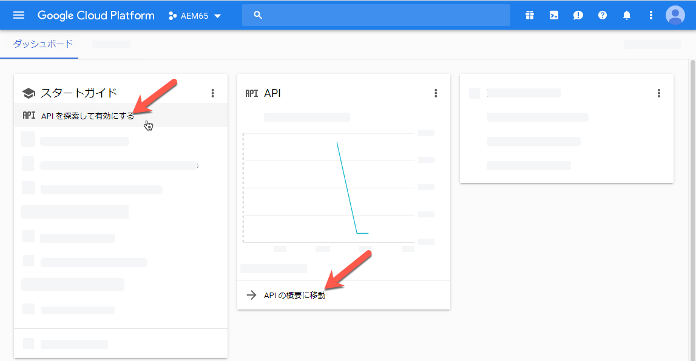

1. Near the top of the APIs &amp; Services page, tap **[!UICONTROL Enable APIs and Services.]**
1. API ライブラリページの左側の「**[!UICONTROL カテゴリ]**」で、「**[!UICONTROL YouTube」をタップします。]** ページの右側で、「YouTube Data API」 **[!UICONTROL をタップします。]**
1. On the YouTube Data API v3 page, tap **[!UICONTROL Enable.]**

   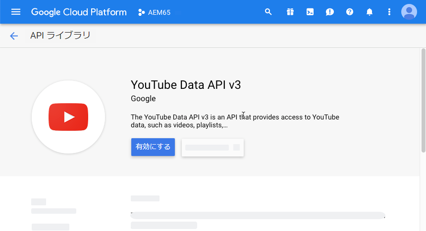

1. この API を使用するために資格情報が必要となる場合があります。If necessary, click **[!UICONTROL Create Credentials.]**

   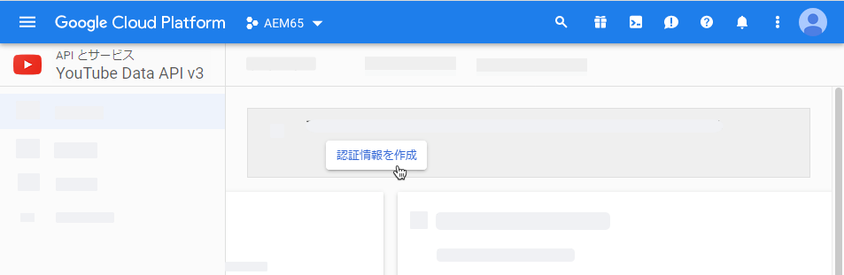

1. **[!UICONTROL プロジェクトへの認証情報の追加]**&#x200B;ページの手順 1 で以下をおこないます。

   * 「**[!UICONTROL 使用する API]** ドロップダウンリストで、「YouTube Data API v3」 **[!UICONTROL を選択します。]**

   * 「**[!UICONTROL API を呼び出す場所]**」ドロップダウンリストから、「**[!UICONTROL ウェブサーバー（node.js、Tomcat など）]**」を選択します。

   * 「**[!UICONTROL アクセスするデータの種類]** ドロップダウンリストで、「 **[!UICONTROL ユーザーデータ」をタップします。]**

   

1. 「**[!UICONTROL 必要な認証情報]**」をタップします。
1. **[!UICONTROL プロジェクトへの認証情報の追加]**&#x200B;ページの手順 2 で、「**[!UICONTROL OAuth 2.0 クライアント ID を作成する]**」の下の「名前」フィールドに、必要に応じて一意の名前を入力します。または、Google で指定されるデフォルトの名前を使用することもできます。
1. 「**[!UICONTROL 承認済みの JavaScript 生成元]**」の下にあるテキストフィールドに、次のパスに従って、実際に使用するドメインとポート番号を入力します。入力が終わったら、**[!UICONTROL Enter]** キーを押して、パスをリストに追加します。

   `https://<servername.domain>:<port_number>`

   例：`https://1a2b3c.mycompany.com:4321`

   **注意**：上記のパスは入力例です。

   

1. 「**[!UICONTROL 承認済みのリダイレクト URI]**」の下にあるテキストフィールドに、次のように、実際に使用するドメインとポート番号を入力します。入力が終わったら、**[!UICONTROL Enter]** キーを押して、パスをリストに追加します。

   `https://<servername.domain>:<port_number>/etc/cloudservices/youtube.youtubecredentialcallback.json`

   例：`https://1a2b3c.mycompany.com:4321/etc/cloudservices/youtube.youtubecredentialcallback.json`

   **注意**：上記のパスは入力例です。

1. Click **[!UICONTROL Create OAuth client ID.]**
1. **[!UICONTROL プロジェクトへの認証情報の追加]**&#x200B;ページの手順 3 で、「**[!UICONTROL OAuth 2.0 同意画面を設定する]**」の下で、現在使用している Gmail 電子メールアドレスを選択します。

   

1. 「**[!UICONTROL ユーザーに表示される製品名]**」の下のテキストフィールドに、同意画面に表示する内容を入力します。

   同意画面は、AEM 管理者が YouTube の認証をおこなう際に表示され、AEM は YouTube に権限を要求します。

1. Click **[!UICONTROL Continue.]**
1. On the Add credentials to your project page, step 4, under the **[!UICONTROL Download credentials]** heading, tap **[!UICONTROL Download.]**

   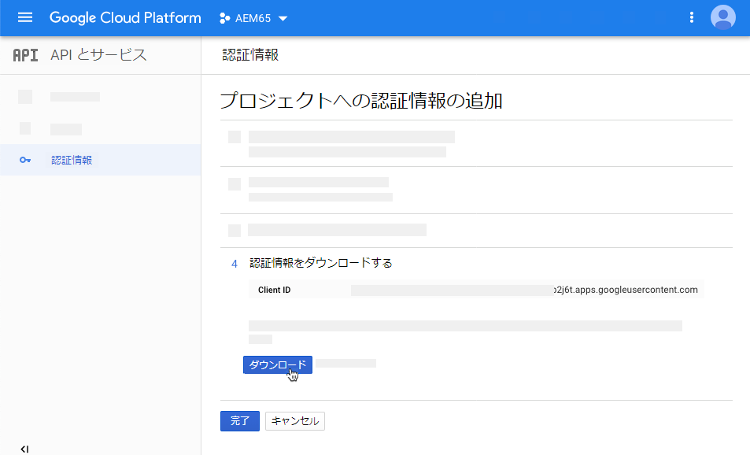

1. `client_id.json` ファイルを保存します。

   このダウンロードした JSON ファイルは、後で Adobe Experience Manager で YouTube をセットアップするときに必要になります。


1. Click **[!UICONTROL Done.]**

   Google アカウントからログアウトします。次に、YouTube チャンネルを作成します。

### YouTube チャンネルの作成 {#creating-a-youtube-channel}

YouTube にビデオを公開するには、1 つ以上のチャネルが必要です。既に YouTube チャンネルを作成している場合は、このタスクをスキップして、次の「[公開用タグの追加](/help/assets/video.md#adding-tags-for-publishing)」タスクに進んでください。

>[!CAUTION]
>
>** AEM の「YouTube 設定」にチャネルを追加する前に、YouTube のチャネルを既に 1 つ以上セットアップ済みであることを確認してください（以下の [AEM での YouTube の設定](#setting-up-youtube-in-aem)を参照してください）。この確認をおこなわなくても、既存のチャネルが存在しないことを知らせる警告は表示されません。ただし、それでも、チャネルを追加する際に Google 認証がおこなわれますが、ビデオの送信先となるチャネルを選択するオプションがありません。

YouTube チャンネルを作成するには：

1. [https://www.youtube.com](https://www.youtube.com/) にアクセスし、Google アカウントの資格情報を使用してログインします。
1. YouTube ページの右上隅にあるプロフィール写真（内側に文字が表示された、べた塗りの円が表示されている場合はその円）をクリックし、「**[!UICONTROL 設定]**」（丸い歯車アイコン）をクリックします。
1. On the Overview page, under the Additional Features heading, click **[!UICONTROL See all my channels or create a new channel.]**
1. On the Channels page, click **[!UICONTROL Create a new channel.]**
1. On the Brand Account page, in the Brand Account Name field, enter a business name or any other channel name you choose where you want to publish your video assets, then click **[!UICONTROL Create.]**

   この名前は、AEM で YouTube をセットアップするときに入力する必要があるので、覚えておいてください。

1. （オプション）必要に応じて、さらにチャネルを追加します。

     次は、公開用タグを追加します。

### 公開用タグの追加 {#adding-tags-for-publishing}

AEM で、YouTube にビデオを公開するには、1 つ以上の YouTube チャンネルにタグを関連付けます。公開用タグの追加については、[タグの管理](/help/sites-administering/tags.md)を参照してください。

また、AEM のデフォルトのタグを使用する場合は、このタスクをスキップして、次の [YouTube への公開のレプリケーションエージェントの有効化](#enabling-the-youtube-publish-replication-agent)タスクに進んでください。

### YouTube への公開のレプリケーションエージェントの有効化 {#enabling-the-youtube-publish-replication-agent}

YouTube への公開のレプリケーションエージェントを有効化した後、Google Cloud アカウントへの接続をテストする場合は、「**[!UICONTROL 接続をテスト」をタップします。]**&#x200B;ブラウザーのタブに接続結果が表示されます。YouTube チャンネルを追加した場合は、それらのリストがテストの一部として表示されます。

1. In the upper-left corner of AEM, click the AEM logo, then in the left rail, click **[!UICONTROL Tools]** > **[!UICONTROL Deployment]** > **[!UICONTROL Replication]** > **[!UICONTROL Agents on Author.]**
1. On the Agents of Author page, click **[!UICONTROL YouTube Publish (youtube).]**
1. On the toolbar, to the right of Settings, click **[!UICONTROL Edit.]**
1. 「**[!UICONTROL 有効]**」チェックボックスをオンにして、レプリケーションエージェントをオンにします。
1. 「**[!UICONTROL OK]**」をクリックします。

   次は、AEM で YouTube をセットアップします。

### AEM での YouTube の設定 {#setting-up-youtube-in-aem}

AEM 6.4 以降では、AEM で YouTube への公開をセットアップするための新しいタッチ対応ユーザーインターフェイスが導入されました。使用している AEM のインストール済みインスタンスに応じて、次のいずれかをおこないます。

* 6.4 以前の AEM で YouTube を設定するには、[6.4 以前の AEM での YouTube](/help/assets/video.md#setting-up-youtube-in-aem-before) の設定を参照してください。
* AEM 6.4 以降で YouTube を設定するには、](#setting-up-youtube-in-aem-and-later)AEM 6.4 以降での YouTube の設定[を参照してください。

#### AEM 6.4 以降での YouTube の設定 {#setting-up-youtube-in-aem-and-later}

1. Dynamic Media のインスタンスに管理者としてログインしてください。
1. In the upper-left corner of AEM, tap the AEM logo, then in the left rail, tap **[!UICONTROL Tools]**(hammer icon) > **[!UICONTROL Cloud Services]** > **[!UICONTROL YouTube Publishing Configuration.]**
1. 「**[!UICONTROL グローバル]**」をタップします（選択しないでください）。

1. Near the upper-right corner of the global page, tap **[!UICONTROL Create.]**
1. YouTube 設定を作成ページの「Google Cloud Platform 設定」で、「**[!UICONTROL アプリケーション名]**」フィールドに Google プロジェクト ID を入力します。

   このプロジェクト ID は、先ほど Google Cloud 設定をおこなったときに指定したものです。YouTube 設定を作成ページを開いたままにしておきます。このページには後で戻ります。

   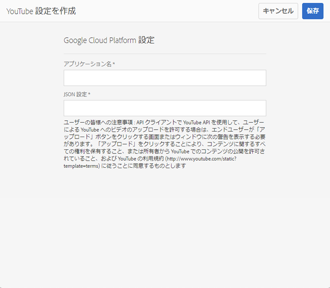

1. 任意のテキストエディターを使用して、「[Google Cloud 設定](/help/assets/video.md#configuring-google-cloud-settings)」のタスクでダウンロードして保存しておいた JSON ファイルを開きます。
1. この JSON テキスト全体を選択してコピーします。
1. YouTube アカウント設定ダイアログボックスに戻ります。「**[!UICONTROL JSON 設定]**」フィールドに JSON テキストを貼り付けます。
1. Near the upper-right corner of the page, tap **[!UICONTROL Save.]**

   次は、AEM で YouTube チャンネルをセットアップします。

1. Tap **[!UICONTROL Add Channel.]**
1. 「チャネル名」フィールドに、前に「**[!UICONTROL YouTube への 1 つ以上のチャネルの追加]**」タスクで作成したチャネルの名前を入力します。

   オプションで、必要に応じて説明を追加できます。

1. Tap **[!UICONTROL Add.]**
1. YouTube／Google 認証が表示されます。Google Cloud アカウントにまだログインしていない場合は、この手順をスキップしてください。

   * 前述の Google プロジェクト ID と JSON テキストに関連付けられた Google ユーザー名とパスワードを入力します。
   * アカウントに存在するチャネルの数によっては、2 つ以上の項目が表示されます。チャネルを選択してください。電子メールアドレスはチャネルではないので、選択しないでください。
   * 次のページで、「**[!UICONTROL 確定]**」をタップして、このチャネルへのアクセスを許可します。

1. Tap **[!UICONTROL Allow.]**

   次は、公開用タグを設定します。

1. **[!UICONTROL 公開用タグの設定]** - Cloud Services／YouTube ページで、鉛筆アイコンをタップして、使用するタグのリストを編集します。
1. ドロップダウンリストアイコン（上下逆のキャレット）をタップして、AEM で利用可能なタグのリストを表示します。
1. 1 つ以上のタグをタップして追加します。

   To delete a tag you have added, select the tag, and tap **[!UICONTROL X.]**

1. 使用するタグの追加が終了したら、「**[!UICONTROL 保存]**

   次は、YouTube チャンネルにビデオを公開します。

#### 6.4 以前の AEM での YouTube の設定 {#setting-up-youtube-in-aem-before}

1. Dynamic Media のインスタンスに管理者としてログインしてください。

1. In the upper-left corner of AEM, tap the AEM logo, then in the left rail, tap **[!UICONTROL Tools]** (hammer icon) > **[!UICONTROL Deployment]** > **[!UICONTROL Cloud Services.]**
1. Under the Third Party Services heading, under YouTube, tap **[!UICONTROL Configure now.]**
1. 設定を作成ダイアログボックスで、タイトル（必須）と名前（オプション）をそれぞれのフィールドに入力します。
1. Tap **[!UICONTROL Create.]**
1. YouTube アカウント設定ダイアログボックスで、「**[!UICONTROL アプリケーション名]**」フィールドに Google プロジェクト ID を入力します。

   このプロジェクト ID は、先ほど [Google Cloud 設定をおこなった](/help/assets/video.md#configuring-google-cloud-settings)ときに指定したものです。YouTube アカウント設定ダイアログボックスを開いたままにしておきます。このダイアログボックスには後で戻ります。

1. 任意のテキストエディターを使用して、「Google Cloud 設定」のタスクでダウンロードして保存しておいた JSON ファイルを開きます。
1. この JSON テキスト全体を選択してコピーします。
1. YouTube アカウント設定ダイアログボックスに戻ります。「**[!UICONTROL JSON 設定]**」フィールドに JSON テキストを貼り付けます。
1. Tap **[!UICONTROL OK.]**

   次は、AEM で YouTube チャンネルをセットアップします。

1. 「**[!UICONTROL 利用可能なチャネル]**」の右にある「**+**」（プラス記号のアイコン）をタップします。
1. YouTube チャンネル設定ダイアログボックスの「タイトル」フィールドに、前の「**[!UICONTROL YouTube への 1 つ以上のチャネルの追加]**」タスクで作成したチャネルの名前を入力します。

   オプションで、必要に応じて説明を追加できます。

1. Tap **[!UICONTROL OK.]**
1. YouTube／Google 認証が表示されます。Google Cloud アカウントにまだログインしていない場合は、この手順をスキップしてください。

   * 前述の Google プロジェクト ID と JSON テキストに関連付けられた Google ユーザー名とパスワードを入力します。
   * アカウントに存在するチャネルの数によっては、2 つ以上の項目が表示されます。チャネルを選択してください。電子メールアドレスはチャネルではないので、選択しないでください。
   * 次のページで、「**[!UICONTROL 確定]**」をタップして、このチャネルへのアクセスを許可します。

1. Tap **[!UICONTROL Allow.]**

   次は、公開用タグを設定します。

1. **[!UICONTROL 公開用タグの設定]** - Cloud Services／YouTube ページで、鉛筆アイコンをタップして、使用するタグのリストを編集します。
1. ドロップダウンリストアイコン（上下逆のキャレット）をタップして、AEM で利用可能なタグのリストを表示します。
1. 1 つ以上のタグをタップして追加します。

   追加したタグを削除するには、そのタグを選択して、「**X**」をタップします。

1. 使用するタグの追加が終了したら、「**[!UICONTROL OK]**

   次は、YouTube チャンネルにビデオを公開します。

### （オプション）アップロードしたビデオのデフォルト YouTube プロパティ設定の自動化{#optional-automating-the-setting-of-default-youtube-properties-for-your-uploaded-videos}

ビデオをアップロードする際に YouTube プロパティの設定を自動化することもできます。これをおこなうためには、メタデータ処理プロファイルを AEM で作成します。

メタデータ処理プロファイルを作成するには、まず「**[!UICONTROL フィールドラベル]**」、「**[!UICONTROL プロパティにマッピング]**」、「**[!UICONTROL 選択肢]**」の各フィールドの値をコピーします。これらはすべてビデオのメタデータスキーマで見つかります。次に、これらの値を追加して、YouTube ビデオメタデータ処理プロファイルを作成します。

アップロードしたビデオのデフォルト YouTube プロパティの設定を自動化するには：

1. In the upper-left corner of AEM, click the AEM logo, then in the left rail, click **[!UICONTROL Tools]** (hammer icon) > **[!UICONTROL Assets]** > **[!UICONTROL Metadata Schemas.]**
1. 「**[!UICONTROL デフォルト値」をクリックします]** （「デフォルト」の左にある選択ボックスにチェックマークを追加しないでください）。
1. **[!UICONTROL デフォルトのページで]** 、 **[!UICONTROL ビデオの左側にあるチェックボックスをオンにし]**、「 **[!UICONTROL 編集」をクリックします。]**
1. メタデータスキーマエディターページで、「**[!UICONTROL 詳細]**」タブをクリックします。
1. Under the YouTube Publishing heading, click **[!UICONTROL YouTube Category.]**
1. ページの右側の「**[!UICONTROL 設定]**」タブで次の手順を実行します。

   * 「**[!UICONTROL プロパティにマッピング]**」テキストフィールドで、値を選択してコピーします。コピーした値を、開いているテキストエディターに貼り付けます。後でメタデータ処理プロファイルを作成するときにこの値が必要になります。テキストエディターは開いたままにしておきます。

   * 「**[!UICONTROL 選択肢]**」の下で、使用するデフォルト値（「人とブログ」または「科学と技術」など）を選択してコピーします。コピーした値を、開いているテキストエディターに貼り付けます。後でメタデータ処理プロファイルを作成するときにこの値が必要になります。テキストエディターは開いたままにしておきます。

1. Under the YouTube Publishing heading, click **[!UICONTROL YouTube Privacy.]**
1. ページの右側の「**[!UICONTROL 設定]**」タブで次の手順を実行します。

   * 「**[!UICONTROL プロパティにマッピング]**」テキストフィールドで、値を選択してコピーします。コピーした値を、開いているテキストエディターに貼り付けます。後でメタデータ処理プロファイルを作成するときにこの値が必要になります。テキストエディターは開いたままにしておきます。

   * 「**[!UICONTROL 選択肢]**」の下で、使用するデフォルト値を選択してコピーします。選択肢は 2 つが 1 組になっています。1 組の下のフィールドは、コピーするデフォルト値（公開、非公開またはプライベート）です。コピーした値を、開いているテキストエディターに貼り付けます。後でメタデータ処理プロファイルを作成するときにこの値が必要になります。テキストエディターは開いたままにしておきます。

1. Near the upper-right corner of the Metadata Schema Editor page, click **[!UICONTROL Cancel.]**
1. In the upper-left corner of AEM, tap the AEM logo, then in the left rail, click **[!UICONTROL Tools]** (hammer icon) > **[!UICONTROL Assets]** > **[!UICONTROL Metadata Profiles.]**

1. On the Metadata Profiles page, near the upper-right corner of the page, click **[!UICONTROL Create.]**
1. In the Add Metadata Profile dialog box, in the **[!UICONTROL Profile title]** text field, enter the name `YouTube Video` then click **[!UICONTROL Create.]**
1. メタデータプロファイルエディターページで、「**[!UICONTROL 詳細]**」タブをクリックします。
1. 次の手順を実行して、コピーした「YouTube への公開」の値を、プロファイルに追加します。

   * ページの右側にある「**[!UICONTROL フォームを作成]**」タブをクリックします。
   * （オプション）**[!UICONTROL セクションヘッダー]**&#x200B;というラベルのコンポーネントを左にドラッグして、フォーム領域にドロップします。
   * （オプション）「**[!UICONTROL フィールドラベル]**」をクリックして、コンポーネントを選択します。
   * （オプション）ページの右側にある「設定」タブで、「フィールドラベル」テキストフィールドに「`YouTube Publishing`」と入力します。
   * 「**[!UICONTROL フォームを作成]**」タブをクリックし、「**[!UICONTROL 複数値テキスト]**」というラベルのコンポーネントをドラッグして、作成したばかりの「**[!UICONTROL YouTube への公開]**」の下にドロップします。

   * 「**[!UICONTROL フィールドラベル]**」をクリックして、コンポーネントを選択します。
   * ページの右側にある「設定」タブで、先ほどコピーした「YouTube への公開」の値（フィールドラベル値と、プロパティにマッピング値）をフォームのそれぞれのフィールドに貼り付けます。選択肢値を「デフォルト値」フィールドに貼り付けます。

1. 次の手順を実行して、コピーした「YouTube のプライバシー」の値を、プロファイルに追加します。

   * ページの右側にある「**[!UICONTROL フォームを作成]**」タブをクリックします。
   * （オプション）**[!UICONTROL セクションヘッダー]**&#x200B;というラベルのコンポーネントを左にドラッグして、フォーム領域にドロップします。
   * （オプション）「**[!UICONTROL フィールドラベル]**」をクリックして、コンポーネントを選択します。
   * （オプション）ページの右側にある「設定」タブで、「フィールドラベル」テキストフィールドに「`YouTube Privacy`」と入力します。
   * 「**[!UICONTROL フォームを作成]**」タブをクリックし、「**[!UICONTROL 複数値テキスト]**」というラベルのコンポーネントをドラッグして、作成したばかりの「**[!UICONTROL YouTube のプライバシー]**」の下にドロップします。

   * 「**[!UICONTROL フィールドラベル]**」をクリックして、コンポーネントを選択します。
   * ページの右側にある「設定」タブで、先ほどコピーした「YouTube への公開」の値（フィールドラベル値と、プロパティにマッピング値）をフォームのそれぞれのフィールドに貼り付けます。選択肢値を「デフォルト値」フィールドに貼り付けます。

1. Near the upper-right corner of the page, click **[!UICONTROL Save.]**
1. YouTube への公開メタデータプロファイルを、ビデオのアップロード先フォルダーに適用します。メタデータプロファイルとビデオプロファイルを設定する必要があります。

   詳しくは、[メタデータプロファイル](/help/assets/metadata-profiles.md)と[ビデオプロファイル](/help/assets/video-profiles.md)を参照してください。

### YouTube チャンネルへのビデオの公開 {#publishing-videos-to-your-youtube-channel}

次は、前の手順で追加したタグを、ビデオアセットに関連付けます。このプロセスによって、AEM は、YouTube チャンネルに公開するアセットを把握します。

>[!NOTE]
>
>Dynamic Media - Scene7 モードで実行する場合は、即時公開しても YouTube に自動的には公開されないことに注意してください。When Dynamic Media - Scene7 mode is set up, there are two publish options to choose from: **[!UICONTROL Immediately]** or **[!UICONTROL Upon Activation.]**
>
>**[!UICONTROL 即時公開する]**&#x200B;の場合、アップロードされたアセットは、IPS と同期された後、配信システムに自動的に公開されます。これは Dynamic Media には当てはまりますが、YouTube には当てはまりません。YouTube に公開するには、AEM オーサーを介して公開する必要があります。

>[!NOTE]
>
>AEM では、YouTube からのコンテンツの公開に **[!UICONTROL YouTube への公開]**&#x200B;ワークフローを使用します。このワークフローでは、進行状況を監視して、エラー情報を表示できます。
>
>詳しくは、[ビデオエンコーディングと YouTube への公開の進行状況の監視](#monitoring-video-encoding-and-youtube-publishing-progress)を参照してください。
>
>詳細な進行状況については、レプリケーション下の YouTube ログを監視できます。ただし、このような監視には管理者アクセスが必要です。

YouTube チャンネルにビデオを公開するには：

1. AEM で、YouTube チャンネルに公開するビデオアセットの場所に移動します。
1. ビデオアセット（アダプティブビデオセット）を選択します。
1. On the toolbar, click **[!UICONTROL Properties.]**
1. 「基本」タブの「メタデータ」で、「タグ」フィールドの右側にある「**[!UICONTROL 選択ダイアログを開く]**」をクリックします。
1. タグを選択ページで、使用するタグに移動し、1 つ以上のタグを選択します。

   タグは YouTube チャンネルに関連付ける必要があります。

1. In the upper-right corner of the page, click **[!UICONTROL Select.]**
1. In the upper-right corner of the video&#39;s properties page, click **[!UICONTROL Save and Close.]**
1. On the toolbar, click **[!UICONTROL Quick Publish.]**

   [AEM Sites での公開管理の使用](https://docs.adobe.com/content/help/en/experience-manager-learn/sites/page-authoring/publication-management-feature-video-use.html)も参照してください。

   オプションで、YouTube チャンネルで公開済みビデオを確認できます。

### （オプション）YouTube での公開済みビデオの確認{#optional-verifying-the-published-video-on-youtube}

オプションで、YouTube への公開（または非公開）の進行状況を監視できます。

詳しくは、[ビデオエンコーディングと YouTube への公開の進行状況の監視](#monitoring-video-encoding-and-youtube-publishing-progress)を参照してください。

公開にかかる時間は、プライマリソースビデオの形式、ファイルサイズ、アップロードトラフィックなどの多数の要因により左右されます。公開プロセスにかかる時間は、数分から数時間までの幅があります。また、高解像度の形式では、レンダリングの時間がかかることにも注意してください。例えば、720p や 1080p の場合、表示されるまでの時間が 480p よりも大幅に長くなります。

8 時間経っても「**[!UICONTROL アップロード済み（処理中、お待ちください）]**」というステータスメッセージが表示される場合は、サイトからビデオを削除して再度アップロードしてみてください。

### Web アプリケーションへの YouTube URL のリンク {#linking-youtube-urls-to-your-web-application}

ビデオの公開後、Dynamic Media によって生成された YouTube URL 文字列を取得できます。YouTube URL をコピーしたらクリップボードに配置されるので、必要に応じて Web サイトのページまたはアプリケーションに貼り付けることができます。

>[!NOTE]
>
>YouTube URL は、ビデオアセットを YouTube に公開するまではコピーできません。

Web アプリケーションに YouTube URL をリンクするには：

1. URL のコピー先となる、*YouTube への公開済み*&#x200B;ビデオアセットの場所に移動して選択します。

   YouTube URL をコピーするには、*その前に*&#x200B;ビデオアセットを YouTube に&#x200B;*公開しておく*&#x200B;必要があります。

1. On the toolbar, click **[!UICONTROL Properties.]**
1. 「**[!UICONTROL 詳細]**」タブをクリックします。
1. 「YouTube への公開」の「YouTube URL リスト」で、URL テキストを選択し、Web ブラウザーにコピーしてアセットをプレビューするか、Web コンテンツページに追加します。

### ビデオを非公開にして YouTube から削除 {#unpublishing-videos-to-remove-them-from-youtube}

AEM でビデオアセットを非公開にすると、そのビデオは YouTube から削除されます。

>[!CAUTION]
>
>YouTube 内からビデオを直接削除すると、AEM にはそのことがわかりません。そのため、AEM は、そのビデオがまだ YouTube に公開されているかのように機能を続けます。ビデオアセットを YouTube で非公開にするときは、必ず AEM からおこなってください。

>[!NOTE]
>
>AEM では、YouTube からのコンテンツの削除に **[!UICONTROL YouTube で非公開]**&#x200B;ワークフローを使用します。このワークフローでは、進行状況を監視して、エラー情報を表示できます。
>
>詳しくは、[ビデオエンコーディングと YouTube への公開の進行状況の監視](#monitoring-video-encoding-and-youtube-publishing-progress)を参照してください。

ビデオを非公開にして YouTube から削除するには：

1. YouTube チャンネルで非公開にするビデオアセットの場所に移動します。
1. アセット選択モードで、1 つ以上の公開済みビデオアセットを選択します。
1. ツールバーで「**[!UICONTROL 公開を管理」をクリックします。]**&#x200B;場合によっては、ツールバーの 3 つのドット（...）アイコンon the toolbar to see **[!UICONTROL Manage Publication.]**
1. On the Manage Publication page, tap **[!UICONTROL Unpublish.]**
1. In the upper-right corner of the page, tap **[!UICONTROL Next.]**
1. In the upper-right corner of the page, tap **[!UICONTROL Unpublish.]**

## ビデオエンコーディングと YouTube への公開の進行状況の監視 {#monitoring-video-encoding-and-youtube-publishing-progress}

ビデオエンコーディングが適用されたフォルダーに新しいビデオをアップロードしたり、YouTube にビデオを公開したりする場合は、ビデオエンコーディング／YouTube への公開の進行状況（エラー状況）を様々な方法で監視できます。YouTube への公開の実際の進行状況は、ログを介してのみ把握できますが、YouTube への公開が失敗したか成功したかは、別の方法で示されます（以下の手順で説明します）。また、YouTube の公開ワークフローやビデオエンコーディングが完了するか中断されると、そのことを知らせる電子メール通知を受け取ることもできます。

### 進行状況の監視 {#monitoring-progress}

進行状況を監視するには（エンコーディング／YouTube の公開の失敗を含む）：

1. アセットフォルダー内のビデオエンコーディングの進行状況を表示します。

   * カード表示では、ビデオエンコーディングの進行状況は、アセットにパーセントで表示されます。エラーがある場合、エラー情報はアセットにも表示されます。

   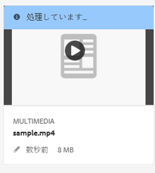

   * リスト表示では、ビデオエンコーディングの進行状況は、「**[!UICONTROL 処理ステータス]**」列に表示されます。エラーがある場合は、そのメッセージも同じ列に表示されます。

   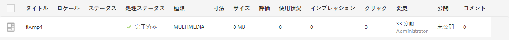

   この列は、デフォルトでは表示されません。To enable the column, select **[!UICONTROL View Settings]** from the views drop-down menu, and add the **[!UICONTROL Processing Status]** column and tap or click **[!UICONTROL Update.]**

   

1. アセット詳細の進行状況を表示します。アセットをタップまたはクリックしたら、ドロップダウンメニューを開き、「**[!UICONTROL タイムライン」を選択します。]** エンコーディングやYouTube投稿などのワークフローアクティビティに絞り込むには、「 **[!UICONTROL ワークフロー」を選択します。]**

   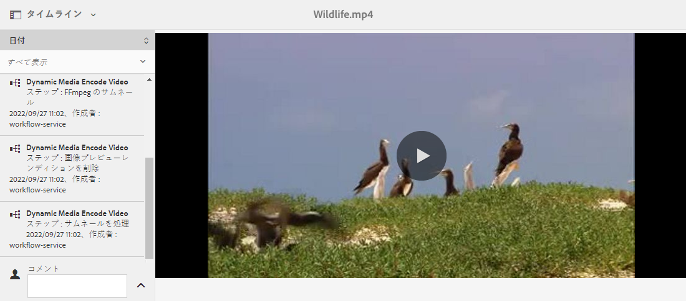

   エンコーディングなどのワークフロー情報がタイムラインに表示されます。YouTube の公開の場合、ワークフロータイムラインには、YouTube チャンネルの名前と YouTube ビデオの URL も含まれます。さらに、パブリッシュが完了すると、ワークフロータイムラインには、エラー通知も表示されます。

   >[!NOTE]
   >
   >[https://localhost:4502/system/console/configMgr](https://localhost:4502/system/console/configMgr) からの&#x200B;**[!UICONTROL 再試行]**、**[!UICONTROL 再試行遅延]**&#x200B;および&#x200B;**[!UICONTROL タイムアウト]**&#x200B;に関する複数のワークフロー設定があるので、失敗／エラーメッセージが最終的に記録されるまでには長時間を要する可能性があります。例えば、次の設定です。
   >
   >    * Apache Sling Job Queue Configuration
   >    * Adobe Granite Workflow External Process Job Handler
   >    * Granite Workflow Timeout Queue

   >
   >これらの設定の&#x200B;**[!UICONTROL 再試行]**、**[!UICONTROL 再試行遅延]**&#x200B;および&#x200B;**[!UICONTROL タイムアウト]**&#x200B;プロパティは調整できます。

1. For workflows in progress, see Workflow Instances available from **[!UICONTROL Tools]** > **[!UICONTROL Workflow]** > **[!UICONTROL Instances.]**

   >[!NOTE]
   >
   >**[!UICONTROL ツール]**&#x200B;メニューにアクセスするには、管理者権限が必要となる場合があります。

   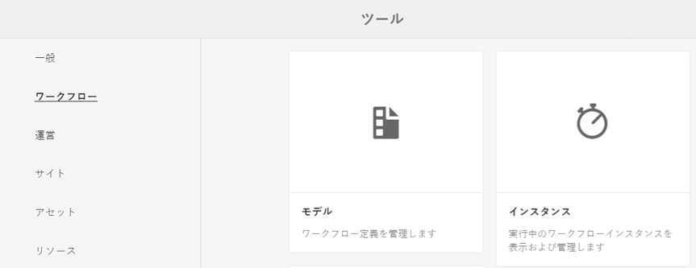

   Select the instance and tap or click **[!UICONTROL Open History.]**

   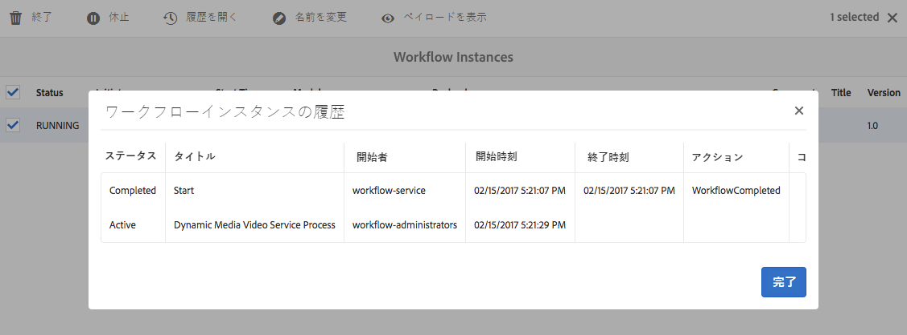

   ワークフローインスタンス領域から、ワークフローを休止、終了または名前変更できます。詳しくは、[ワークフローの管理](/help/sites-administering/workflows-administering.md)を参照してください。

1. エラーが発生したジョブについては、**[!UICONTROL ツール]**／**[!UICONTROL ワークフロー]**／**[!UICONTROL エラーからワークフローエラーを表示します。]****[!UICONTROL ワークフローエラー]**&#x200B;に、エラーが発生したすべてのワークフローアクティビティが表示されます。

   >[!NOTE]
   >
   >**[!UICONTROL ツール]**&#x200B;メニューにアクセスするには、管理者権限が必要となる場合があります。

   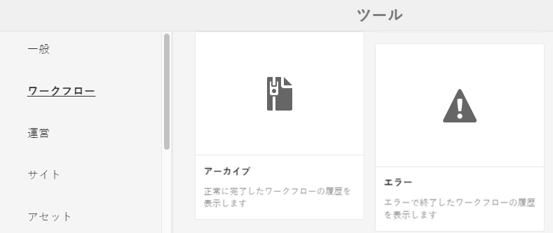

   >[!NOTE]
   >
   >[https://localhost:4502/system/console/configMgr](https://localhost:4502/system/console/configMgr) からの&#x200B;**[!UICONTROL 再試行]**、**[!UICONTROL 再試行遅延]**&#x200B;および&#x200B;**[!UICONTROL タイムアウト]**&#x200B;に関する複数のワークフロー設定があるので、エラーメッセージが最終的に記録されるまでには長時間を要する可能性があります。例えば、次の設定です。
   >
   >
   >
   >    * Apache Sling Job Queue Configuration
   >    * Adobe Granite Workflow External Process Job Handler
   >    * Granite Workflow Timeout Queue

   >
   >
   >これらの設定の&#x200B;**[!UICONTROL 再試行]**、**[!UICONTROL 再試行遅延]**&#x200B;および&#x200B;**[!UICONTROL タイムアウト]**&#x200B;プロパティは調整できます。

1. 完了したワークフローについては、**[!UICONTROL ツール]**／**[!UICONTROL ワークフロー]**／**[!UICONTROL アーカイブからワークフローアーカイブを表示します。]****[!UICONTROL ワークフローアーカイブ]**&#x200B;に、完了したすべてのワークフローアクティビティが表示されます。

   >[!NOTE]
   >
   >**[!UICONTROL ツール]**&#x200B;メニューにアクセスするには、管理者権限が必要となる場合があります。

   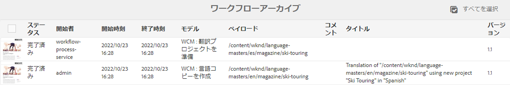

1. 中止またはエラーが発生したワークフロージョブに関する電子メール通知を受け取ることができます。これらの電子メール通知は、管理者が設定できます。詳しくは、[電子メール通知の設定](#configuring-e-mail-notifications)を参照してください。

#### 電子メール通知の設定 {#configuring-e-mail-notifications}

>[!NOTE]
>
>**[!UICONTROL ツール]**&#x200B;メニューにアクセスするには、管理者権限が必要となる場合があります。

通知の設定方法は、エンコーディングジョブに関する通知と、YouTube への公開ジョブに関する通知のどちらを希望しているかによって異なります。

* For encoding jobs, you can access the configuration page for all AEM workflow email notifications at **[!UICONTROL Tools]** > **[!UICONTROL Operations]** > **[!UICONTROL Web Console]** and by searching for **[!UICONTROL Day CQ Workflow Email Notification Service.]** 「AEMでの電子メール通知の [設定](/help/sites-administering/notification.md)」を参照してください。 You can select or clear the check boxes for **[!UICONTROL Notify on Abort]** or **[!UICONTROL Notify on Complete]** accordingly.

* YouTube への公開ジョブの場合、次の手順に従います。

1. In AEM, tap **[!UICONTROL Tools]** > **[!UICONTROL Workflow]** > **[!UICONTROL Models.]**
1. ワークフローモデルページで、「]**YouTube に公開**[!UICONTROL 」を選択して、ツールバーの「]**編集**[!UICONTROL 」をタップします。
1. Near the upper-right corner of the Publish to YouTube workflow page, tap **[!UICONTROL Edit.]**
1. 「YouTube のアップロード」コンポーネントにマウスポインターを置き、1 回タップしてインラインツールバーを表示します。

   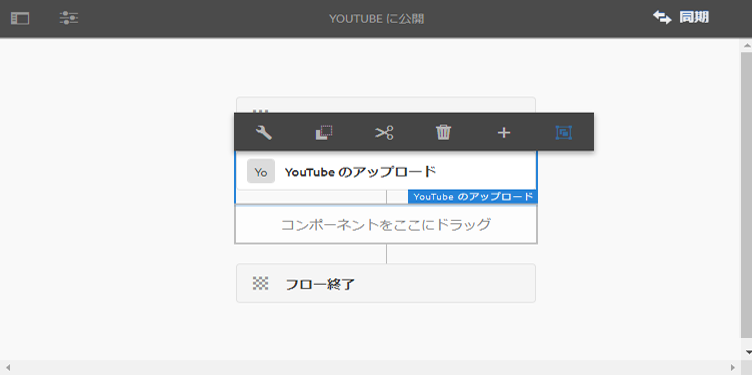

1. インラインツールバーで、設定アイコン（レンチ）をタップします。Click the **[!UICONTROL Arguments]** tab.

   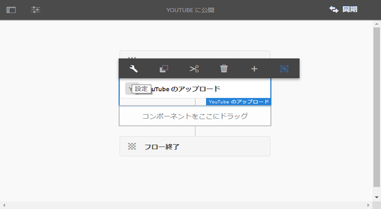

1. YouTube のアップロードプロセス - ステップのプロパティダイアログボックスで、「**[!UICONTROL 引数]**」タブをタップします。

   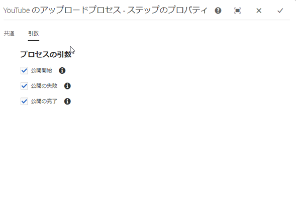

1. 次のチェックボックスをオンまたはオフにできます。

   * 公開開始
   * 公開の失敗
   * 公開の完了（チャネルと URL に関する情報を含む）

   チェックボックスをオフにすると、YouTube の公開ワークフローから指定された電子メール通知は届きません。

   >[!NOTE]
   >
   >これらの電子メールは YouTube に固有で、かつ一般的なワークフロー電子メール通知です。結果として、設定に応じて、**[!UICONTROL Day CQ Workflow Email Notification Service]** で使用できる一般的な通知と、YouTube に固有の通知の 2 つの電子メール通知セットを受け取ることができます。

1. 作業が終了したら、ダイアログボックスの右上隅にある&#x200B;]**完了**[!UICONTROL &#x200B;アイコン（チェックマーク）をタップします。
1. On the Publish to YouTube workflow page, near the upper-right corner, tap **[!UICONTROL Sync.]**

## ビデオレポートの表示 {#viewing-video-reports}

>[!NOTE]
>
>ビデオレポートを使用できるのは、Dynamic Media - ハイブリッドモードを実行している場合のみです。

ビデオレポートには、指定した期間における様々な集計指標が表示されます。ユーザーはビデオレポートを使用して、公開済みの個々のビデオやビデオの集合が期待どおりに動作しているかを監視できます。次のトップの指標データは、Web サイト全体のすべての公開済みビデオについて集計されるものです。

* ビデオ開始
* 完了率
* ビデオの平均視聴時間
* ビデオの合計視聴時間
* 訪問別ビデオ数

すべての&#x200B;*公開済み*&#x200B;ビデオの表も表示されるので、ビデオ開始数の合計に基づいて、Web サイトで視聴された上位のビデオを追跡できます。

リストのビデオ名をタップすると、ビデオのオーディエンス保持（ドロップオフ）レポートが折れ線グラフの形式で表示されます。このグラフには、ビデオ再生中の特定の瞬間におけるビュー数が表示されます。ビデオを再生すると、プレーヤーの時間インジケーターと同期して縦棒が表示されていきます。この折れ線グラフのデータが急激に下るところは、オーディエンスが関心をなくして再生を終了したところです。

ビデオが Adobe Experience Manager Dynamic Media 以外でエンコードされた場合、オーディエンス保持（ドロップオフ）グラフおよび表内の再生率データは利用できません。

[Dynamic Media クラウドサービスの設定](/help/assets/config-dynamic.md)も参照してください。

>[!NOTE]
>
>トラッキングおよびレポートのデータは、Dynamic Media 独自のビデオプレーヤーと関連するビデオプレーヤープリセットの使用状況のみに基づいています。そのため、他のビデオプレーヤーによって再生されたビデオを追跡およびレポートすることはできません。

デフォルトでは、ビデオレポートを最初に開いたときに、今月初めから今月の今日の日付までのビデオデータが表示されます。ただし、このデフォルトの日付範囲を上書きして、独自の日付範囲を指定することができます。次回ビデオレポートを開くと、指定した日付範囲が使用されます。

ビデオレポートの正常動作のために、Dynamic Media Cloud Services の設定時に、レポートスイート ID が自動的に作成されます。そのときに、そのレポートスイート ID がパブリッシュサーバーにプッシュされ、アセットのプレビューの際に URL のコピー機能で使用できるようになります。ただし、そのためにはパブリッシュサーバーを事前にセットアップしておく必要があります。If the Publish server is not set up, you can still publish to see the video report, however, you will need to return to the Dynamic Media Cloud Configuration and tap **[!UICONTROL OK.]**

ビデオレポートを表示するには：

1. In the upper-left corner of AEM, tap the AEM logo, then in the left rail, tap **[!UICONTROL Tools]** (hammer icon) > **[!UICONTROL Assets]** > **[!UICONTROL Video Reports.]**
1. ビデオレポートページで、次のいずれかの操作をおこないます。

   * 右上隅近くにある「**ビデオレポートの更新**」アイコンをタップします。レポートの終了日が現在の日付の場合にのみ、[更新]を使用する必要があります。これにより、前回レポートを実行した後に発生したビデオ追跡を確実に確認できます。

   * Near the upper-right corner, tap the **Date Picker **icon.
Specify the beginning and end date range for which you want video data, and then tap **[!UICONTROL Run Report.]**

   「トップの指標」グループボックスに、サイト全体にわたるすべての公開済みビデオに関する様々な集計値が表示されます。

1. 上位の公開済みビデオを示した表で、ビデオ名をタップしてビデオを再生し、そのビデオのオーディエンス保持（ドロップオフ）レポートを表示します。

### Scene7 HTML5 ビューア SDK を使用して作成したビデオビューアに基づくビデオレポートの表示 {#viewing-video-reports-based-on-a-video-viewer-that-you-created-using-the-scene-hmtl-viewer-sdk}

Dynamic Media で標準提供されているビデオビューアを使用している場合、または標準提供のビデオビューアからカスタムのビューアプリセットを作成した場合は、ビデオレポートを表示するための追加手順は必要ありません。これに対して、Scene7 HTML5 ビューア SDK から独自のビデオビューアを作成した場合は、次の手順を実行して、ビデオビューアが Dynamic Media のビデオレポートにトラッキングイベントを送信するように設定する必要があります。

独自のビデオビューアを作成するには、Scene7 ビューアリファレンスと Scene7 HTML5 ビューア SDK を使用します。

詳しくは、[Scene7 ビューアリファレンスガイド](https://docs.adobe.com/content/help/ja-JP/dynamic-media-developer-resources/library/home.translate.html)を参照してください。

<!-- Download the Scene7 HTML Viewer SDK from Adobe Developer Connection.

See [Adobe Developer Connection](https://help.adobe.com/en_US/scene7/using/WSef8d5860223939e2-43dedf7012b792fc1d5-8000.html). -->

Scene7 HTML5 ビューア SDK を使用して作成したビデオビューアに基づいてビデオレポートを表示するには：

1. 公開済みビデオアセットの場所に移動します。
1. Near the upper-left corner of the asset&#39;s page, from the drop-down list, select **[!UICONTROL Viewers.]**
1. 任意のビデオビューアプリセットを選択し、埋め込みコードをコピーします。
1. 埋め込みコード内の次の行を探します。

   `videoViewer.setParam("config2", "<value>");`

   `config2` パラメーターは、HTML5 ビューアでの追跡を有効にします。また、ビデオレポートの設定情報や、お客様固有の Adobe Analytics 設定を含む、会社固有のプリセットでもあります。

   config2パラメータの正しい値は、「**Embed Code **」と「**URL **」コピー関数の両方にあります。**URL **commandのコピー元のURLの中で、検索するパラメータは `&config2=<value>` です。 この値はほぼ常に `companypreset` ですが、一部のケースでは `companypreset-1`、`companypreset-2` などとなっていることもあります。

1. カスタムのビデオビューアコードで、次の操作をおこなって、ビューアページに AppMeasurementBridge.jsp を追加します。

   * 最初に、`&preset` パラメーターが必要かどうかを判断します。
`config2` パラメーターが `companypreset` の場合、`&preset=parameter` は不要です。
`config2` がその他の場合は、プリセットパラメーターを `config2` パラメーターと同じに設定します。例えば、`config2=companypreset-2` の場合、`&param2=companypreset-2` を AppMeasurmentBridge.jsp の URL に追加します。

   * 次に、AppMeasurementBridge.jsp にスクリプトを追加します。
      `<script language="javascript" type="text/javascript" src="https://s7d1.scene7.com/s7viewers/AppMeasurementBridge.jsp?company=robindallas&preset=companypreset-2"></script>`

1. 次の操作をおこなって、TrackingManager コンポーネントを作成します。

   * `s7sdk.Utils.init();` をコールした後に、次の行を追加して、TrackingManager インスタンスを作成し、イベントを追跡します。
      `var trackingManager = new s7sdk.TrackingManager();`

   * 次の操作をおこなって、コンポーネントを TrackingManager に接続します。
`s7sdk.Event.SDK_READY` イベントハンドラーで、追跡するコンポーネントを TrackingManager に関連付けます。例えば、コンポーネントが `videoPlayer` の場合、
      `trackingManager.attach(videoPlayer);` を追加して、コンポーネントを trackingManager にアタッチします。ページ上の複数のビューアを追跡するには、複数のトラッキングマネージャーコンポーネントを使用します。

   * 次のコードを追加して、AppMeasurementBridge オブジェクトを作成します。

      ```
      var appMeasurementBridge = new AppMeasurementBridge(); appMeasurementBridge.setVideoPlayer(videoPlayer);
      ```

   * 次のコードを追加して、トラッキング関数を追加します。

      ```
      trackingManager.setCallback(appMeasurementBridge.track,
       appMeasurementBridge);
      ```
   appMeasurementBridge オブジェクトには組み込みのトラッキング関数があります。ただし、複数のトラッキングシステムやその他の機能をサポートするために、独自のトラッキング関数を作成することもできます。

   詳しくは、『*Scene7 HTML5 Viewer SDK User Guide*』の「*Using the TrackingManager Component*」を参照してください。このガイドは、[Adobe Developer Connection](https://help.adobe.com/ja_JP/scene7/using/WSef8d5860223939e2-43dedf7012b792fc1d5-8000.html) からダウンロードできます。

## ビデオへのキャプションの追加 {#adding-captions-to-video}

キャプションを 1 つのビデオまたはアダプティブビデオセットに追加することにより、ビデオの提供先をグローバルマーケットまで広げることができます。キャプションを追加すると、言語ごとの音声の吹き替えの必要性、つまりネイティブスピーカーを使って音声を再録音する必要性がなくなります。ビデオは録画された言語で再生されます。外国語のサブタイトルが表示されるので、違う言語の視聴者も音声部分を理解できます。

聴覚障害者のためのクローズドキャプションを使用することで、キャプションによってアクセシビリティを大幅に向上させることもできます。

>[!NOTE]
>
>使用するビデオプレーヤーがキャプションの表示に対応する必要があります。

Dynamic Media には、キャプションファイルを JSON（JavaScript Object Notation）形式に変換する機能があります。このように変換できるので、JSON テキストを、ビデオの完全なトランスクリプトとして表示せずに Web ページに埋め込むことができます。この後、検索エンジンがコンテンツをクロールしてインデックスを作成できます。これにより、ビデオを検索しやすくなり、ビデオコンテンツの詳細がユーザーに提供されます。

URL で JSON 機能を使用する方法について詳しくは、*Scene7 画像サービング API ヘルプ*&#x200B;の[静的コンテンツ（画像以外）の提供（英語）](https://docs.adobe.com/content/help/ja-JP/dynamic-media-developer-resources/image-serving-api/image-serving-api/c-serving-static-nonimage-contents.translate.html)を参照してください。

ビデオにキャプションまたはサブタイトルを追加するには:

1. サードパーティアプリケーションまたはサービスを使用して、ビデオキャプション／サブタイトルのファイルを作成します。

   WebVTT（Web Video Text Tracks）標準に従ってファイルを作成してください。キャプションファイルの拡張子は .vtt です。WebVTT キャプション標準をよく確認してください。

   [WebVTT：Web Video Text Tracks 形式（英語）](https://dev.w3.org/html5/webvtt/)を参照してください。

   Dynamic Media の外部でキャプション／サブタイトルのファイルを作成するための無料ツールや有料ツールがあります。例えば、スタイル設定なしの単純なビデオキャプションファイルを作成するには、次に示すキャプションの作成および編集用の無償オンラインツールを使用できます。

   [WebVTT Caption Maker](https://testdrive-archive.azurewebsites.net/Graphics/CaptionMaker/Default.html)

   良い結果を得るためには、このツールを Explorer 9 以上、Google Chrome、または Safari で使用してください。

   In the tool, in the **[!UICONTROL Enter URL of video file]** field, paste the copied URL of your video file and then click **[!UICONTROL Load]**. [アセットの URL の取得](/help/assets/linking-urls-to-yourwebapplication.md#obtaining-a-url-for-an-asset)を参照して、ビデオファイルそのものの URL を取得し、それを「**[!UICONTROL ビデオファイルの URL を入力」フィールドに貼り付けてください。]**&#x200B;その後、Internet Explorer、Chrome、または Safari で、ビデオを再生できます。

   ここで、サイトの画面に表示される指示に従って、WebVTT ファイルを作成して保存します。終了したら、キャプションファイルの内容をコピーし、空のテキストエディターに貼り付けて、ファイル拡張子 .vtt を付けて保存します。

   >[!NOTE]
   >
   >複数言語のビデオサブタイトルを用意してグローバル対応する場合、WebVTT 標準では、サポート対象の言語ごとに個別の .vtt ファイルを作成して呼び出す必要があります。

   通常、VTT ファイルの名前はビデオファイルと同じにして、言語ロケール（-EN、-FR、-DE など）を追加します。そうしておくと、既存の Web コンテンツ管理システムを使用してビデオの URL を自動的に生成する際に役立ちます。

1. AEM で、WebVTT キャプションファイルを DAM にアップロードします。
1. アップロードしたキャプションファイルを関連付ける、公開済み&#x200B;**&#x200B;ビデオアセットに移動します。

   URL をコピーするには、その&#x200B;*前に*&#x200B;アセットを&#x200B;*公開*&#x200B;しておく必要があります。

   [アセットの公開](/help/assets/publishing-dynamicmedia-assets.md)を参照してください。

1. 次のいずれかの操作をおこないます。

   * ポップアップビデオビューアエクスペリエンスの場合、「**[!UICONTROL URL」をタップします。]** URL ダイアログボックスで、URL を選択してクリップボードにコピーし、その URL を単純なテキストエディターに貼り付けます。コピーしたビデオの URL を次の構文で追加します。

      `&caption=<server_path>/is/content/<path_to_caption.vtt_file,1>`

      キャプションパスの末尾にある `,1` に注意します。パスの .vtt ファイル名拡張子の直後で、ビデオプレーヤーバーのクローズドキャプションボタンの有効（オン）と無効（オフ）を切り替えることができます。それぞれ、`,1` または `,0` を設定します。

   * 埋め込みビデオビューアエクスペリエンスの場合、「**[!UICONTROL 埋め込みコード」をタップします。]**&#x200B;埋め込みコードダイアログボックスで、埋め込みコードを選択してクリップボードにコピーし、そのコードを単純なテキストエディターに貼り付けます。コピーした埋め込みコードを次の構文で追加します。

      `videoViewer.setParam("caption","<path_to_caption.vtt_file,1>");`

      キャプションパスの末尾にある `,1` に注意します。パスの .vtt ファイル名拡張子の直後で、ビデオプレーヤーバーのクローズドキャプションボタンの有効（オン）と無効（オフ）を切り替えることができます。それぞれ、`,1` または `,0` を設定します。

## ビデオへのチャプターマーカーの追加 {#adding-chapter-markers-to-video}

1 つのビデオまたはアダプティブビデオセットにチャプターマーカーを追加すると、長編ビデオの視聴と操作が簡単になります。ビデオの再生中に、ビデオのタイムライン（ビデオスクラバーとも呼ばれる）上のチャプターマーカーをクリックするだけで、関心があるポイントや、新しいコンテンツ、デモ、チュートリアルなどにすぐに移動できます。

>[!NOTE]
>
>ビデオプレーヤーが、チャプターマーカーの使用をサポートしている必要があります。Dynamic Media ビデオプレーヤーは、チャプターマーカーをサポートしていますが、サードパーティのビデオプレーヤーは、チャプターマーカーを必ずしもサポートしているとは限りません。

必要であれば、ビデオビューアプリセットを使用するのではなく、チャプター機能を備えた独自のカスタムビデオビューアを作成して、ブランディングできます。チャプターナビゲーション機能を備えた独自の HTML5 ビューアの作成方法について詳しくは、『Adobe Scene Viewer SDK for HTML5』の「Customizing Behavior Using Modifiers」で `s7sdk.video.VideoPlayer` クラスと `s7sdk.video.VideoScrubber`7 クラスの説明を参照してください。Adobe Scene7 Viewer SDK は、[Adobe Developer Connection](https://help.adobe.com/ja_JP/scene7/using/WSef8d5860223939e2-43dedf7012b792fc1d5-8000.html) からダウンロードして入手できます。

 ビデオのチャプターリストを作成する方法は、キャプションを作成する方法とほとんど同じです。つまり、WebVTT ファイルを作成します。ただし、この WebVTT ファイルは、WebVTT キャプションファイルと分けておく必要があります（キャプションファイルを使用する場合）。キャプションとチャプターを 1 つの WebVTT ファイルにまとめることはできません。

 チャプターナビゲーション機能を備えた WebVTT ファイルを作成する際に使用するフォーマットの例として、次のサンプルを使用できます。

### ビデオチャプターナビゲーション機能を備えた WebVTT ファイル {#webvtt-file-with-video-chapter-navigation}

```xml
WEBVTT
Chapter 1
00:00.000 --> 01:04.364
The bicycle store behind it all.
Chapter 2
01:04.364 --> 02:00.944
Creative Cloud.
Chapter 3
02:00.944 --> 03:02.937
Ease of management for a working solution.
Chapter 4
03:02.937 --> 03:35.000
Cost-efficient access to rapidly evolving technology.
```

上記の例では、`Chapter 1` はキュー識別子で、オプションです。`00:00:000 --> 01:04:364` のキュー時間は、チャプターの開始時間と終了時間を、`00:00:000` という形式で指定しています。最後の 3 桁はミリ秒で、`000` のまま残しておくこともできます。チャプタータイトルの `The bicycle store behind it all` は、チャプターの内容を示す実際の説明です。ユーザーが、ビデオのタイムラインのビジュアルキューポイントにマウスポインターを置くと、キュー識別子、開始キュー時間およびチャプタータイトルが、ビデオプレーヤー内にポップアップ表示されます。

 HTML5 ビデオビューアを使用するので、作成するチャプターファイルが WebVTT（Web Video Text Tracks）標準に準拠していることを確認してください。チャプターファイルの拡張子は .vtt です。WebVTT キャプション標準をよく確認してください。

 詳しくは、[WebVTT: The Web Video Text Tracks Format](https://dev.w3.org/html5/webvtt/) を参照してください。

**ビデオにチャプターマーカーを追加するには：**

1. この .vtt ファイルを UTF8 エンコーディングで保存して、チャプタータイトルテキストの文字レンディションに関する問題を回避します。

    一般に、チャプター VTT ファイルの名前には、ビデオファイルと同じ名前を付けて、名前の末尾にチャプターを追加します。そうしておくと、既存の Web コンテンツ管理システムを使用してビデオの URL を自動的に生成する際に役立ちます。
1. AEM で、WebVTT チャプターファイルをアップロードします。

   [アセットのアップロード](/help/assets/managing-assets-touch-ui.md#uploading-assets)を参照してください。

1. 次のいずれかの操作をおこないます。

   <table>
     <tbody>
      <tr>
       <td>ポップアップビデオビューアエクスペリエンスの場合</td>
       <td>
       <ol>
       <li>アップロードしたチャプターファイルを関連付ける、公開済み<i></i>ビデオアセットに移動します。URL をコピーするには、その<i>前に</i>アセットを<i>公開</i>しておく必要があります。<a href="/help/assets/publishing-dynamicmedia-assets.md">アセットの公開</a>を参照してください。</li>
       <li>ドロップダウンメニューで「<strong>ビューア</strong>」をクリックまたはタップします。</li>
       <li>左側のレールで、ビデオビューアプリセット名をタップまたはクリックします。ビデオのプレビューが別のページで開きます。</li>
       <li>左側のレールの下部にある「<strong>URL</strong>」をクリックします。</li>
       <li>URL ダイアログボックスで、URL を選択してクリップボードにコピーし、その URL を単純なテキストエディターに貼り付けます。</li>
       <li>コピーしたビデオの URL を次の構文と共に追加し、コピーした URL とチャプターファイルに関連付けます。<br /> <br /> <code>&navigation=<<i>full_copied_URL_path_to_chapter_file</i>.vtt></code><br /> </li>
       </ol> </td>
      </tr>
      <tr>
       <td>埋め込みビデオビューアエクスペリエンスの場合 <br /> </td>
       <td>
       <ol>
       <li>アップロードしたチャプターファイルを関連付ける、公開済み<i></i>ビデオアセットに移動します。URL をコピーするには、その<i>前に</i>アセットを<i>公開</i>しておく必要があります。<a href="/help/assets/publishing-dynamicmedia-assets.md">アセットの公開</a>を参照してください。</li>
       <li>ドロップダウンメニューで「<strong>ビューア</strong>」をクリックまたはタップします。</li>
       <li>左側のレールで、ビデオビューアプリセット名をタップまたはクリックします。ビデオのプレビューが別のページで開きます。</li>
       <li>左側のレールの下部にある「<strong>埋め込み</strong>」をクリックします。</li>
       <li>埋め込みコードダイアログボックスで、コード全体を選択してクリップボードにコピーし、そのコードを単純なテキストエディターに貼り付けます。</li>
       <li>ビデオの埋め込みコードを次の構文と共に追加し、コピーした URL とチャプターファイルに関連付けます。<br /> <br /> <code>videoViewer.setParam("navigation","&lt;<i>full_copied_URL_path_to_chapter_file</i>.vtt&gt;"</code></li>
       </ol> </td>
      </tr>
     </tbody>
   </table>

## About video thumbnails in Dynamic Media - Scene7 mode {#about-video-thumbnails-in-dynamic-media-scene-mode}

ビデオサムネールは、ビデオフレームまたは画像アセットの縮小バージョンで、顧客向けのビデオを表すものです。サムネールは、顧客がビデオをクリックする気になるようなものにする必要があります。

AEM 内のすべてのビデオには、サムネールを関連付ける必要があります。サムネールを置き換えることはできますが、削除することはできません。デフォルトでは、AEM にビデオをアップロードすると、最初のフレームがサムネールとして使用されます。例えば、ブランド設定やビジュアル検索用にサムネールをカスタマイズできます。ビデオサムネールをカスタマイズする場合は、ビデオを再生し、使用するフレームで一時停止するか、Digital Asset Manager に既にアップロードして&#x200B;*公開*&#x200B;した画像アセットを選択することができます。

ビデオから選択したカスタムビデオサムネール画像は抽出されず、別個のアセットとして DAM に保存されます。ただし、既存の画像アセットから選択したカスタムビデオサムネールは JCR に保存されます。次のサンプルパスのように、選択したアセットのパスがビデオアセットのノードの下に保存されます。

`/content/dam/*<folder_name*>/<*video_name*>/jcr:content/manualThumbnail`

ビデオのサムネールをカスタマイズできるのは、ビデオが格納されているフォルダーにビデオプロファイルを適用した後だけです。

また、[Dynamic Media - ハイブリッドモードのビデオサムネールについて](#about-video-thumbnails-in-dynamic-media-hybrid-mode)も参照してください。

### カスタムビデオサムネールの追加 {#adding-a-custom-video-thumbnail}

これらの手順は、「Dynamicmedia_Scene7」モードで動作している Dynamic Media にのみ適用されます。

**カスタムビデオサムネールを追加するには**：

1. 次の操作を既に完了していることを確認します。

   * ビデオアセットのフォルダーを作成。
   * [ビデオプロファイルをフォルダーに適用](/help/assets/video-profiles.md#applying-a-video-profile-to-folders)。

   * [フォルダーにビデオをアップロード](/help/assets/managing-video-assets.md#upload-and-preview-video-assets)。

1. サムネール画像を変更するアップロード済みビデオアセットに移動します。
1. **[!UICONTROL リスト表示]**&#x200B;または&#x200B;**[!UICONTROL カード表示]**&#x200B;のアセット選択モードで、ビデオアセットをタップします。
1. ツールバーの&#x200B;**[!UICONTROL プロパティ]**&#x200B;アイコン（丸で囲まれた「i」）をタップします。
1. On the video&#39;s Properties page, tap **[!UICONTROL Change Thumbnail.]**
1. サムネールを変更ページで、次のいずれかの操作をおこないます。

   * ビデオのフレームを新しいサムネールとして使用するには：

      * On the toolbar, tap **[!UICONTROL Select Frame from video.]**
      * 「再生」ボタンをタップし、ビデオの新しいサムネールとしてキャプチャするフレームの「一時停止」ボタンをタップします。
   * 画像アセットを新しいサムネールとして使用するには：

      * On the toolbar, tap **[!UICONTROL Select Thumbnail from Assets.]**
      * Tap **[!UICONTROL Select Thumbnail.]**
      * 既にアップロードして公開した画像アセットのうち、使用するものを選択します。アセットは、ビデオのサムネール画像として機能するように自動的にサイズ変更されます。
      * Select the image asset, then tap **[!UICONTROL Select.]**


1. On the Change Thumbnail page, tap **[!UICONTROL Save Change.]**
1. On the video&#39;s Properties page, in the upper-right corner, tap **[!UICONTROL Save &amp; Close.]**

## Dynamic Media - ハイブリッドモードのビデオサムネールについて {#about-video-thumbnails-in-dynamic-media-hybrid-mode}

Dynamic Media によって自動的に生成される 10 個のサムネール画像の中から、ビデオに追加する画像を 1 つ選択できます。選択したサムネールは、ビデオアセットを AEM Sites、AEM Mobile または AEM Screens のオーサリング環境で Dynamic Media コンポーネントと使用するときに、ビデオプレーヤーに表示されます。このサムネールは、ビデオの内容を最も適切に表し、かつユーザーが再生ボタンをクリックしたくなるような静的画像として提供されます。

ビデオの合計時間に基づいて、Dynamic Media は、10 個（デフォルト）のサムネール画像を、1％、11％、21％、31％、41％、51％、61％、71％、81％および 91％でビデオに取り込みます。10 個のサムネールは維持されます。つまり、後で別のサムネールを選択することになっても、一連のサムネールを再生成する必要はありません。10 個のサムネール画像をプレビューした後、ビデオで使用する画像を選択します。デフォルトに変更する場合は、CRXDE Lite を使用して、サムネール画像が生成される時間間隔を設定できます。例えば、等間隔の 4 つのサムネール画像をビデオから生成するだけの場合は、間隔時間を 24％、49％、74％および 99％に設定できます。

理論上、ビデオをアップロードしてから Web サイトで公開するまでの間は、ビデオサムネールをいつでも追加できます。

必要であれば、Dynamic Media によって生成されるサムネールを使用するのではなく、カスタムサムネールをアップロードしてビデオを表すことも可能です。例えば、ビデオのタイトル、人目を引くオープニング画像、またはビデオからキャプチャした特定の画像を持つカスタムサムネール画像を作成できます。アップロードするカスタムビデオサムネール画像は、最大解像度が 1280 x 720 ピクセル（最小幅 640 ピクセル）で、2MB を超えてはなりません。

また、[Dynamic Media - Scene7 モードのビデオサムネールについて](/help/assets/video.md#about-video-thumbnails-in-dynamic-media-scene-mode)も参照してください。

### ビデオサムネールの追加 {#adding-a-video-thumbnail}

これらの手順は、ハイブリッドモードで動作している Dynamic Media にのみ適用されます。

**ビデオサムネールを追加するには**：

1. ビデオサムネールを追加する、アップロードしたビデオアセットに移動します。
1. リスト表示またはカード表示のアセット選択モードで、ビデオアセットをタップします。
1. ツールバーの&#x200B;**[!UICONTROL プロパティを表示]**&#x200B;アイコン（丸で囲まれた「i」）をタップします。
1. On the video&#39;s Properties page, tap **[!UICONTROL Change Thumbnail.]**
1. On the Change Thumbnail page, on the toolbar, tap **[!UICONTROL Select Frame.]**

   デフォルトの時間間隔またはカスタマイズした時間間隔に基づき、Dynamic Media によって一連のサムネール画像がビデオから生成されます。

1. 生成されたサムネール画像をプレビューした後、ビデオに追加する画像を選択します。
1. Tap **[!UICONTROL Save Change.]**

   ビデオのサムネール画像が更新され、選択したサムネールが使用されます。後で、サムネール画像を変更する場合は、**[!UICONTROL サムネールを変更]**&#x200B;ページに戻って、新しい画像を選択できます。

   新しいデフォルトの時間間隔を設定した場合、または新しいビデオをアップロードして既存のビデオを置き換えた場合、Dynamic Media によってサムネールを再生成する必要があります。

   詳しくは、[ビデオサムネールが生成されるデフォルトの時間間隔の設定](#configuring-the-default-time-interval-that-video-thumbnails-are-generated)を参照してください。

#### ビデオサムネールが生成されるデフォルトの時間間隔の設定 {#configuring-the-default-time-interval-that-video-thumbnails-are-generated}

新しいデフォルトの時間間隔を設定して保存すると、この変更は、今後アップロードするビデオに対してのみ自動的に反映されます。以前にアップロードしたビデオには、新しいデフォルトは自動的に適用されません。既存のビデオについては、サムネールを再生成する必要があります。

詳しくは、[ビデオサムネールの追加](#adding-a-video-thumbnail)を参照してください。

**ビデオサムネールが生成されるデフォルトの時間間隔を設定するには：**

1. In AEM, tap **[!UICONTROL Tools]** > **[!UICONTROL General]** > **[!UICONTROL CRXDE Lite.]**

1. In the CRXDE Lite page, in the directory panel on the left, navigate t `o etc/dam/imageserver/configuration/jcr:content/settings.`

   このディレクトリパネルが表示されない場合は、「ホーム」タブの左側にある >> アイコンをタップします。

1. 右下のパネルにある「プロパティ」タブで、「`thumbnailtime`」をダブルタップします。
1. thumbnailtime を編集ダイアログボックスで、テキストフィールドに間隔値を割合で入力します。

   * プラス記号（+）アイコンをタップして、1 つ以上の間隔値フィールドを追加します。このアイコンは、ダイアログボックスの下部までスクロールしないと表示されない場合があります。
   * リストから間隔値フィールドを削除するには、そのフィールドの右側にあるマイナス記号（-）アイコンをタップします。
   * 上向き矢印アイコンと下向き矢印アイコンをタップして、間隔値の順序を変更します。

1. 「**[!UICONTROL OK]**」をタップして、「プロパティ」タブに戻ります。
1. CRXDE Lite ページの左上隅にある「**[!UICONTROL すべて保存]**」をタップした後、左上隅の「ホームに戻る」アイコンをタップして AEM に戻ります。

   詳しくは、[ビデオサムネールの追加](#adding-a-video-thumbnail)を参照してください。

### カスタムビデオサムネールの追加 {#adding-a-custom-video-thumbnail-1}

これらの手順は、ハイブリッドモードで動作している Dynamic Media にのみ適用されます。

**カスタムビデオサムネールを追加するには**：

1. カスタムビデオサムネールを追加する、アップロードしたビデオアセットに移動します。
1. リスト表示またはカード表示のアセット選択モードで、ビデオアセットをタップします。
1. ツールバーの&#x200B;**[!UICONTROL プロパティを表示]**&#x200B;アイコン（丸で囲まれた「i」）をタップします。
1. On the video&#39;s Properties page, tap **[!UICONTROL Change Thumbnail.]**
1. On the Change Thumbnail page, on the toolbar, tap **[!UICONTROL Upload New Thumbnail.]**
1. 使用するサムネール画像に移動して、その画像を選択します。次に、「**[!UICONTROL 開く]**」をタップして、AEM への画像のアップロードを開始します。。アップロード後に、必ず画像を公開してください。
1. After you have successfully uploaded and published the image, in the Change Thumbnail page, tap **[!UICONTROL Save Changes.]**

   カスタムサムネールがビデオに追加されます。

