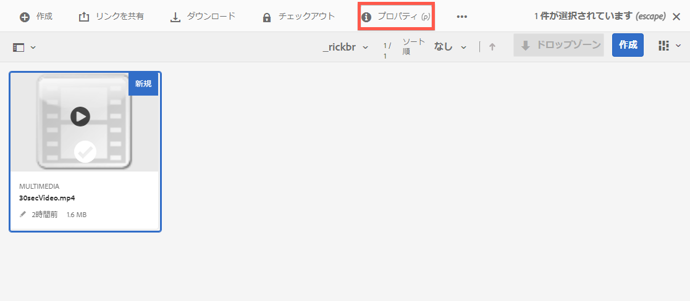
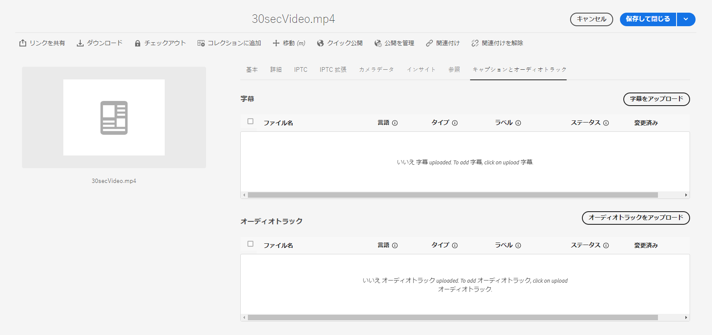
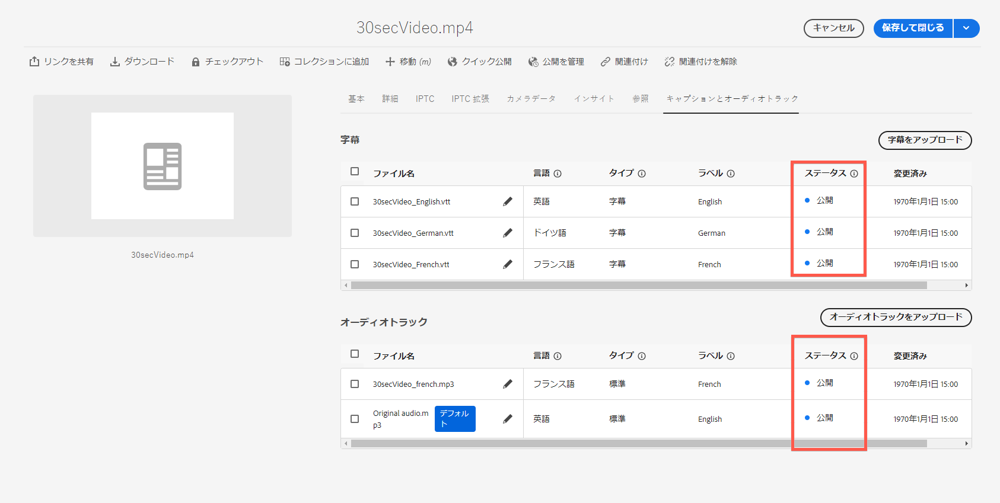
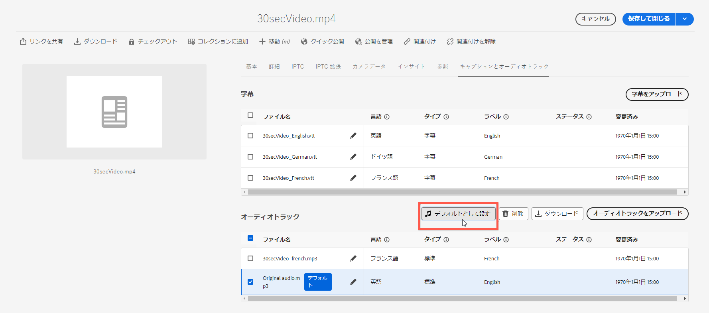
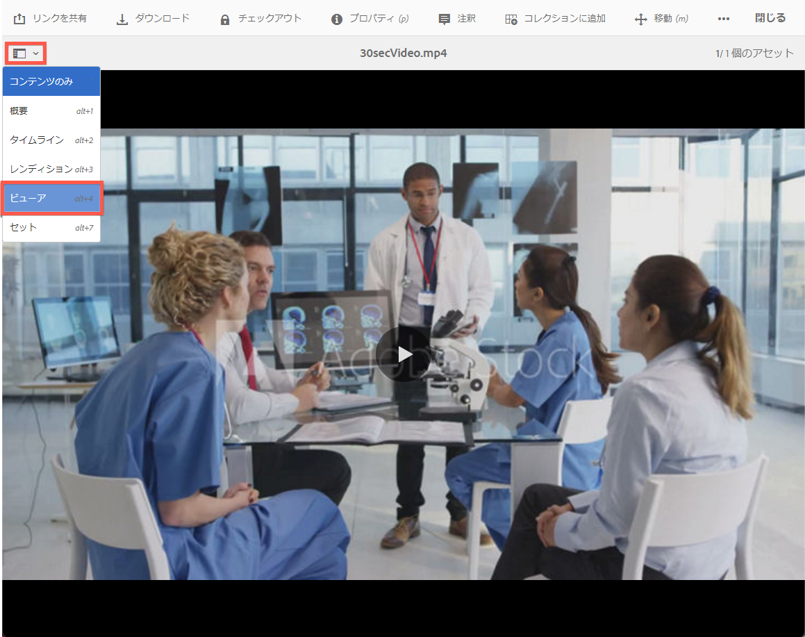
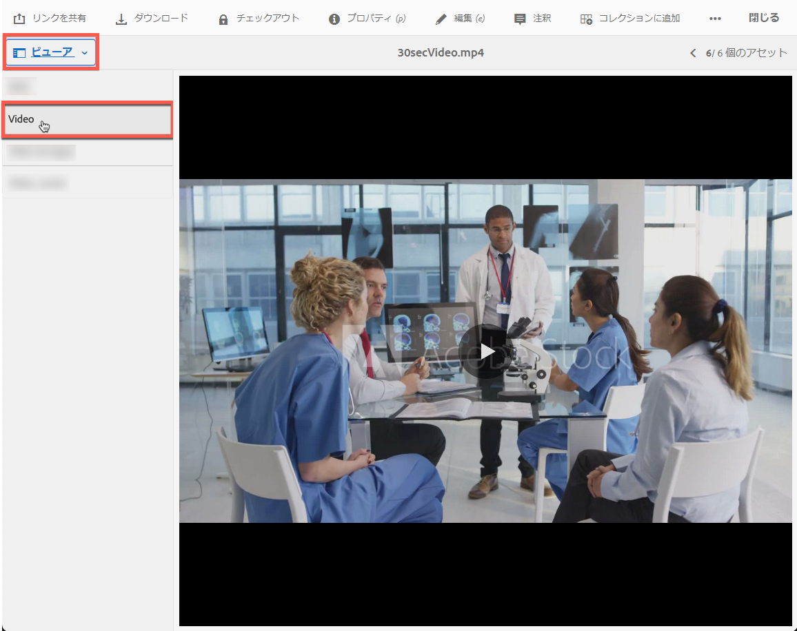
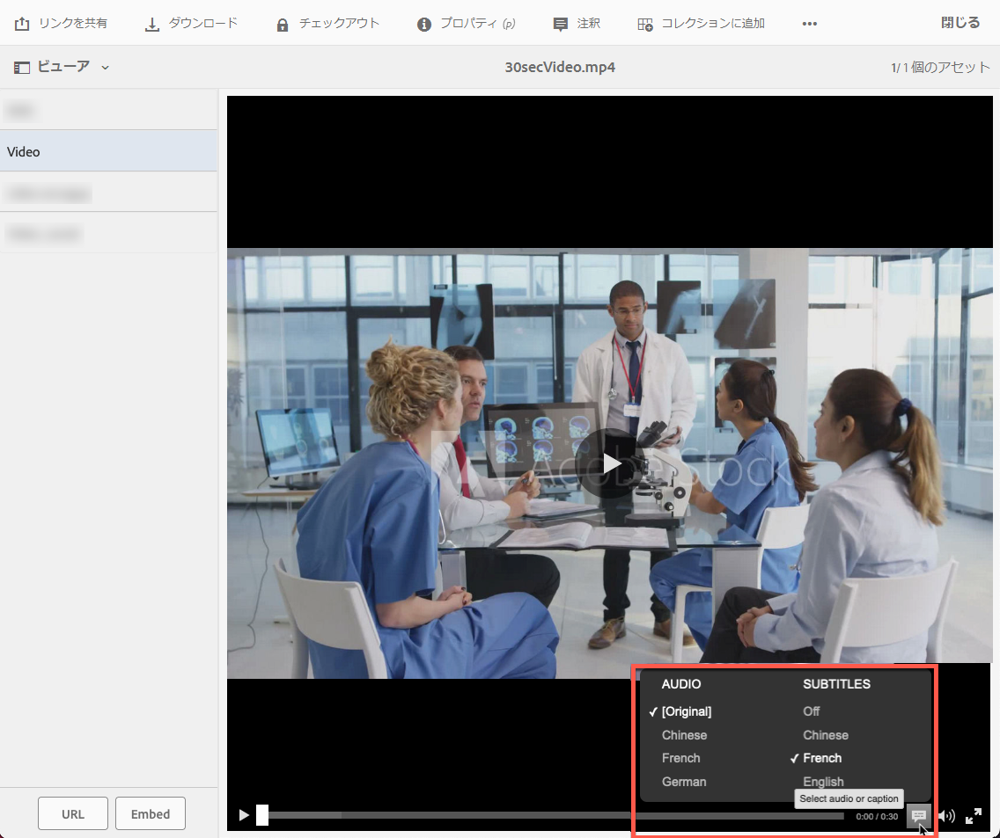

# Dynamic Media のビデオ {#video}

ここでは、Dynamic Media でのビデオの操作について説明します。

## クイックスタート：ビデオ {#quick-start-videos}

次のワークフローの手順説明は、Dynamic Media でアダプティブビデオセットをすぐに使い始めることを目的としたものです。各手順に続いて、詳しい説明のあるトピックの見出しへのリンクが記載されています。

>[!IMPORTANT]
>
>Dynamic Media のビデオを操作する前に、Adobe Experience Manager 管理者が Dynamic Media - Scene7 モードまたはハイブリッドモードのいずれかで、Dynamic Media クラウドサービスを有効にして設定を完了していることを確認してください。
>
>* 「Dynamic Media - Scene7 モードの設定」の [Dynamic Media クラウドサービスの設定](/help/assets/config-dms7.md#configuring-dynamic-media-cloud-services)および [Dynamic Media - Scene7 モードのトラブルシューティング](/help/assets/troubleshoot-dms7.md)を参照してください。
>
>* 「Dynamic Media - ハイブリッドモードの設定」の [Dynamic Media クラウドサービスの設定](/help/assets/config-dynamic.md#configuring-dynamic-media-cloud-services)を参照してください。
>
>Dynamic Media でのビデオ再生に関する既知の問題（*Experience Manager 6.5.9.0 のみ*）：
>
>* 公開済みのビデオを更新する場合は、ビデオ再度公開して配信の変更を反映する必要があります。
>

1. 次の手順を実行して、**Dynamic Media ビデオをアップロード**&#x200B;します。

   * 独自のビデオエンコーディングプロファイルを作成します。または、ダイナミックメディアに付属する、事前定義済みの「_アダプティブビデオエンコーディング_」プロファイルを使用します。

      * [ビデオエンコーディングプロファイルを作成します](/help/assets/video-profiles.md#creating-a-video-encoding-profile-for-adaptive-streaming)。
      * 出力ビデオエンコーディングの最大解像度は、8,192 × 4,320 または 4,320 × 8,192.md です。
      * 詳しくは、[ビデオエンコーディングのベストプラクティス](#best-practices-for-encoding-videos)を参照してください。

   * ビデオ処理プロファイルを、プライマリソースビデオのアップロード先となる 1 つ以上のフォルダーに関連付けます。

      * [ビデオプロファイルをフォルダーに適用します](/help/assets/video-profiles.md#applying-a-video-profile-to-folders)。
      * 詳しくは、[処理プロファイルを使用するためのデジタルアセットの整理におけるベストプラクティス](/help/assets/organize-assets.md)を参照してください。
      * 詳しくは、[デジタルアセットの整理](/help/assets/organize-assets.md)を参照してください。

   * フォルダーにプライマリソースビデオをアップロードします。フォルダーにビデオを追加すると、そのフォルダーに割り当てたビデオ処理プロファイルに従ってビデオがエンコードされます。

      * Dynamic Media は主に、最大 30 分、最小解像度が 25 x 25 を超える短時間のビデオをサポートします。
      * サポートされる入力ビデオの最大解像度は 16,384 × 16,384 です。
      * 15 GB までのビデオファイルをアップロードできます。
      * [ビデオをアップロードします](/help/assets/managing-video-assets.md#upload-and-preview-video-assets)。
      * 詳しくは、[サポートされる入力ファイル形式](/help/assets/assets-formats.md#supported-multimedia-formats)を参照してください。

   * アセットまたはワークフロー表示から、[ビデオエンコードの進行状況](#monitoring-video-encoding-and-youtube-publishing-progress)を監視します。

1. 次のいずれかの操作を行って、**Dynamic Media ビデオを管理します**。

   * ビデオアセットの整理、参照、検索

      * [デジタルアセットの整理](/help/assets/organize-assets.md)。
詳しくは、[処理プロファイルを使用するためのデジタルアセットの整理におけるベストプラクティス](organize-assets.md)を参照してください。

      * [ビデオアセットを検索](search-assets.md#custompredicates)するか[アセットを検索](/help/assets/search-assets.md)します。

   * ビデオアセットをプレビューして公開します。

      * ソースビデオとビデオのエンコードされたレンディションを、関連するサムネールと共に表示します。
        [ビデオをプレビュー](managing-video-assets.md#upload-and-preview-video-assets)するか[アセットをプレビュー](previewing-assets.md)します。
        [ビデオレンディションを表示](video-renditions.md)
        [ビデオレンディションを管理します](manage-assets.md#managing-renditions)。

      * [ビューアプリセットの管理](managing-viewer-presets.md)
      * [アセットを公開します。](publishing-dynamicmedia-assets.md)

   * ビデオのメタデータを操作します。

      * フレームレート、オーディオおよびビデオのビットレート、コーデックなど、エンコードされたビデオレンディションのプロパティを表示します。
        [ビデオレンディションのプロパティを表示](video-renditions.md)

      * タイトル、説明、タグ、カスタムメタデータフィールドなど、ビデオのプロパティを編集します。
        [ビデオのプロパティを編集します](manage-assets.md#editing-properties)。

      * [デジタルアセットのメタデータの管理](metadata.md)
      * [メタデータスキーマ](metadata-schemas.md)

   * ビデオをレビューおよび承認し、注釈を付け、完全なバージョン管理を維持します。

      * [ビデオの注釈](managing-video-assets.md#annotate-video-assets)または[アセットの注釈](manage-assets.md#annotating)

      * [バージョンを作成します。](manage-assets.md#asset-versioning)
      * [アセットにワークフローを適用](assets-workflow.md)または[アセットでワークフローを開始](manage-assets.md#starting-a-workflow-on-an-asset)を参照

      * [フォルダーのアセットのレビュー](bulk-approval.md)
      * [プロジェクト](../sites-authoring/projects.md)

1. 次のいずれかの操作を行って、**Dynamic Media ビデオを公開します**。

   * Adobe Experience Manager を web コンテンツ管理システムとして使用する場合、web ページにビデオを直接追加できます。

      * [Web ページにビデオを追加します](adding-dynamic-media-assets-to-pages.md)。

   * サードパーティの web コンテンツ管理システムを使用している場合、web ページにビデオをリンクするか、ビデオを埋め込むことができます。

      * URL を使用したビデオの統合：
        [Web アプリケーションに URL をリンクします](linking-urls-to-yourwebapplication.md)。

      * Web ページの埋め込みコードを使用したビデオの統合：
        [Web ページにビデオビューアを埋め込みます](embed-code.md)。

   * [ビデオレポートを生成します](#viewing-video-reports)。

   * [ビデオにキャプションを追加します](#adding-captions-to-video)。

## Dynamic Media でのビデオの操作 {#working-with-video-in-dynamic-media}

Dynamic Media のビデオは、高品質のアダプティブビデオを簡単に公開して、デスクトップ、iOS、Android™、BlackBerry®、Windows などのモバイルデバイスを含む複数の画面にストリーミングするエンドツーエンドのソリューションです。アダプティブビデオセットでは、同じビデオを、400 kbps、800 kbps、1000 kbps などの様々なビットレートと形式でエンコードしたバージョンにグループ分けします。デスクトップコンピューターまたはモバイルデバイスが、使用可能な帯域幅を検出します。

例えば、iOS モバイルデバイスでは、3G、4G、Wi-Fi などの帯域幅が検出されます。次に、アダプティブビデオセット内の様々なビデオビットレートの中から、適切なエンコード済みビデオが自動的に選択されます。ビデオはデスクトップ、モバイルデバイスまたはタブレットにストリーミングされます。

また、デスクトップまたはモバイルデバイスでネットワークの状態が変化した場合は、ビデオ画質が自動的に動的に切り替わります。また、顧客がデスクトップで全画面表示モードに入ると、アダプティブビデオセットはより高い解像度を使用して顧客の視聴エクスペリエンスを向上させるよう対応します。アダプティブビデオセットを使用すると、Dynamic Media ビデオを複数の画面やデバイスで視聴する顧客に最適な再生を確保できます。

再生または再生時に選択するエンコード済みビデオの決定に、ビデオプレーヤーが使用するロジックは、次のアルゴリズムに基づきます。

1. ビデオプレーヤーは、プレーヤー自体の「初期ビットレート」に設定されている値に最も近いビットレートで、初期ビデオフラグメントを読み込みます。
1. ビデオプレーヤーは、帯域幅の速度の変化に応じて、次の条件に従って切り替わります。

   1. プレーヤーは、見積もり帯域幅を超えない範囲内で、最も高い帯域幅でのストリームを選択します。
   1. プレーヤーは、使用可能な帯域幅の 80％ほどを見積もります。ただし、使用可能な帯域幅が上昇した場合は、帯域幅を大きく見積もりすぎてすぐに元の帯域幅に戻ることを防ぐために、より控えめな 70％ほどの見積もりとなります。

アルゴリズムの技術情報について詳しくは、[https://android.googlesource.com/platform/frameworks/av/+/master/media/libstagefright/httplive/LiveSession.cpp](https://android.googlesource.com/platform/frameworks/av/+/master/media/libstagefright/httplive/LiveSession.cpp) を参照してください。

単一のビデオとアダプティブビデオセットの管理では、次の機能がサポートされています。

* サポートされている様々な形式でビデオをアップロードし、複数の画面で再生できるように MP4 H.264 にエンコードします。事前定義済みのアダプティブビデオセット、1 つのビデオのエンコーディングプリセットを使用するか、独自のエンコーディングをカスタマイズしてビデオの品質とサイズを制御できます。

   * 生成されるアダプティブビデオセットには、MP4 ビデオが含まれます。
   * **注意**：プライマリ／ソースビデオはアダプティブビデオセットには追加されません。

* すべての HTML5 ビデオビューアでのビデオキャプション。
* ビデオアセットを効率的に管理するための完全なメタデータサポートを使用して、ビデオを整理、参照および検索します。
* Web やデスクトップおよびモバイルデバイス（iPhone、iPad、Android™、BlackBerry®、Windows Phone など）に対してアダプティブビデオセットを配信します。

アダプティブビデオのストリーミングは、各種 iOS プラットフォームでサポートされています。詳しくは、[Dynamic Media ビューアリファレンスガイド](https://experienceleague.adobe.com/ja/docs/dynamic-media-developer-resources/library/viewers-aem-assets-dmc/video/c-html5-video-reference#video)を参照してください。

Dynamic Media では、MP4 H.264 ビデオのモバイルビデオ再生がサポートされています。<!-- LINK IS 404 WITH NO SUITABLE REPLACEMENT You can find BlackBerry&reg; devices that support this video format at the following: [Supported video formats on BlackBerry&reg;](https://support.blackberry.com/kb/articleDetail?ArticleNumber=000005482). -->

このビデオ形式をサポートする Windows デバイスについては、[Windows Phone 8 でサポートされているメディアコーデック](https://learn.microsoft.com/ja-jp/windows/uwp/audio-video-camera/supported-codecs)のページで確認できます。

* 以下を含む Dynamic Media ビデオビューアープリセットを使用して、ビデオを再生します。

   * 単一のビデオビューア。
   * ビデオコンテンツと画像コンテンツの両方を組み合わせた混在メディアビューア。

* 自社ブランドのニーズに合わせてビデオプレーヤーを設定します。
* 単純な URL か埋め込みコードを使用して、ビデオを web サイト、モバイルサイトまたはモバイルアプリケーションに統合します。

<!-- See [Dynamic video playback](https://s7d9.scene7.com/s7/uvideo.jsp?asset=GeoRetail/Mop_AVS&config=GeoRetail/Universal_Video1&stageSize=640,480) sample. -->

[Experience Manager Assets 用のビューアおよび Dynamic Media Classic 用のビューア](https://experienceleague.adobe.com/ja/docs/dynamic-media-developer-resources/library/viewers-aem-assets-dmc/c-html5-s7-aem-asset-viewers#viewers-aem-assets-dmc)と [Experience Manager Assets 専用のビューア](https://experienceleague.adobe.com/ja/docs/dynamic-media-developer-resources/library/viewers-for-aem-assets-only/c-html5-aem-asset-viewers#viewers-for-aem-assets-only)を参照してください。

## ベストプラクティス：HTML5 ビデオビューアの使用 {#best-practice-using-the-html-video-viewer}

Dynamic Media の HTML5 ビデオビューアプリセットは堅牢なビデオプレーヤーです。このプリセットを使用すると、HTML5 ビデオ再生に関するよくある問題の多くを回避できます。アダプティブビットレートストリーミング配信の欠如やデスクトップブラウザーの限られたリーチなど、モバイルデバイスに関連する問題を回避することができます。

プレーヤーの設計側では、標準の web 開発ツールでビデオプレーヤーの機能を設計できます。例えば、HTML5 と CSS を使用して、ボタン、コントロールおよびカスタムのポスター画像背景をデザインすることにより、カスタマイズした表示で顧客にリーチすることができます。

ビューアーの再生側では、ブラウザーのビデオ機能が自動的に検出されます。次に、アダプティブビットレートストリーミングとも呼ばれる、HLS（HTTP ライブストリーミング）または DASH（HTTP での動的アダプティブストリーミング）を使用してビデオを提供します。これらの配信方法が使用できない場合は、HTML5 プログレッシブが代わりに使用されます。

単一のプレーヤーにまとめることで、次のようなことができるようになりました。

* HTML5 と CSS を使って再生コンポーネントをデザインする機能
* 埋め込み再生する機能
* ブラウザーの機能に応じて、アダプティブストリーミングとプログレッシブストリーミングを使い分ける

リッチメディアコンテンツの配信範囲をデスクトップユーザーとモバイルユーザーの両方に拡大し、ビデオエクスペリエンスを確実に効率化できます。

[HTML5 ビューアについて](https://experienceleague.adobe.com/ja/docs/dynamic-media-developer-resources/library/viewers-for-aem-assets-only/c-html5-aem-asset-viewers#viewers-for-aem-assets-only)も参照してください。

### HTML5 ビデオビューアを使用した、デスクトップコンピューターおよびモバイルデバイス上でのビデオ再生 {#playback-of-video-on-desktop-computers-and-mobile-devices-using-the-html-video-viewer}

デスクトップおよびモバイルへのアダプティブビデオストリーミングの場合、ビットレートの切り替えに使用されるビデオは、アダプティブビデオセット内のすべての MP4 ビデオに基づいています。

ビデオ再生は、DASH か HLS、またはプログレッシブビデオダウンロードを使用して行われます。6.0、6.1、6.2 など以前の Experience Manager バージョンでは、ビデオは HTTP 上でストリーミングされました。

DM ゲートウェイサービスの URL が常に HTTPS も使用するので、Experience Manager 6.3 以降ではビデオが HTTPS（DASH または HLS） でストリーミングされるようになりました。このデフォルトの動作はユーザーに影響しません。ブラウザーがサポートしていない場合を除き、ビデオストリーミングは常に HTTPS 上で行われます。（以下の表を参照）。したがって、次のようになります。

* HTTPS web サイトが HTTPS ビデオストリーミングに対応している場合は、ストリーミングが適しています。
* HTTP web サイトが HTTPS ビデオストリーミングに対応している場合は、ストリーミングが適しており、web ブラウザーから混合コンテンツに関する問題は発生しません。

DASH は国際標準であり、HLS は Apple の標準です。どちらもアダプティブビデオストリーミングに使用されます。どちらのテクノロジーも、ネットワーク帯域幅の容量に基づいて再生を自動的に調整します。また、HLS では、ビデオの残りがダウンロードされるまで待たなくても、ビデオ内の任意のポイントを「シーク」できます。

プログレッシブビデオは、ユーザーのデスクトップシステムやモバイルデバイスにビデオをダウンロードしてローカルに保存することで配信されます。

デバイス、ブラウザーおよびデスクトップコンピューターやモバイルデバイスでの Dynamic Media ビデオビューアによるビデオの再生方法を次の表に示します。

<table>
 <tbody>
  <tr>
   <td><strong>デバイス</strong></td>
   <td><strong>ブラウザー</strong></td>
   <td><strong>ビデオ再生モード</strong></td>
  </tr>
  <tr>
   <td>デスクトップ</td>
   <td>Internet Explorer 9 および 10</td>
   <td>プログレッシブダウンロード。</td>
  </tr>
  <tr>
   <td>デスクトップ</td>
   <td>Internet Explorer 11+</td>
   <td>Windows 8 および Windows 10 - DASH* または HLS が要求された場合、常に HTTPS の使用を強制します。既知の制約事項：このブラウザーとオペレーティングシステムの組み合わせでは、DASH* または HLS で HTTP は機能しません。<br /> <br />Windows 7 - プログレッシブダウンロード。HTTP プロトコルと HTTPS プロトコルの選択には標準的なロジックが使用されます。</td>
  </tr>
  <tr>
   <td>デスクトップ</td>
   <td>Firefox 23～44</td>
   <td>プログレッシブダウンロード。</td>
  </tr>
  <tr>
   <td>デスクトップ</td>
   <td>Firefox 45 以降</td>
   <td>DASH* または HLS アダプティブビットレートストリーミング。</td>
  </tr>
  <tr>
   <td>デスクトップ</td>
   <td>Chrome</td>
   <td>DASH* または HLS アダプティブビットレートストリーミング。</td>
  </tr>
  <tr>
   <td>デスクトップ</td>
   <td>Safari（Mac）</td>
   <td>HLS アダプティブビットレートストリーミング。</td>
  </tr>
  <tr>
   <td>モバイル</td>
   <td>Chrome（Android™ 6 以前）</td>
   <td>プログレッシブダウンロード。</td>
  </tr>
  <tr>
   <td>モバイル</td>
   <td>Chrome（Android™ 7 以降）</td>
   <td>DASH* または HLS アダプティブビットレートストリーミング。</td>
  </tr>
  <tr>
   <td>モバイル</td>
   <td>Android™（デフォルトブラウザー）</td>
   <td>プログレッシブダウンロード。</td>
  </tr>
  <tr>
   <td>モバイル</td>
   <td>Safari（iOS）</td>
   <td>HLS アダプティブビットレートストリーミング。</td>
  </tr>
  <tr>
   <td>モバイル</td>
   <td>Chrome（iOS）</td>
   <td>HLS アダプティブビットレートストリーミング。</td>
  </tr>
  <tr>
   <td>モバイル</td>
   <td>BlackBerry®</td>
   <td>DASH* または HLS アダプティブビットレートストリーミング。/td&gt;
  </tr>
 </tbody>
</table>

## Dynamic Media ビデオソリューションのアーキテクチャ {#architecture-of-dynamic-media-video-solution}

次の図に、アップロード後、（Dynamic Media ハイブリッドモードの）DMGateway によってエンコードされ、公開されるビデオのオーサリングワークフローの全体像を示します。


## ビデオのハイブリッド公開アーキテクチャ {#hybrid-publishing-architecture-for-videos}


## ビデオエンコーディングのベストプラクティス {#best-practices-for-encoding-videos}

Dynamic Media を有効にし、ビデオクラウドサービスを設定済みの場合、**Dynamic Media エンコードビデオ**&#x200B;ワークフローがビデオをエンコードします。このワークフローは、ワークフローの処理履歴とエラー情報を取り込みます。Dynamic Media を有効にし、ビデオ Cloud Services を設定してある場合は、ビデオをアップロードすると、**[!UICONTROL Dynamic Media エンコーディングビデオ]**&#x200B;ワークフローが自動的に有効になります（Dynamic Media を使用していない場合は、**[!UICONTROL DAM アセットの更新]**&#x200B;ワークフローが有効になります）。

<!-- DEAD The following are best-practice tips for encoding source video files.

For advice about video encoding, see [Video Encoding Basics](https://www.adobe.com/go/learn_s7_encoding_jp).

* [Streaming 101: The Basics — Codecs, Bandwidth, Data Rate, and Resolution](https://www.adobe.com/go/learn_s7_streaming101_jp). -->

### ソースビデオファイル {#source-video-files}

ビデオファイルをエンコードする場合は、可能な限り高品質のソースビデオファイルを使用します。以前にエンコードされたビデオファイルの使用は避けてください。そのようなファイルは既に圧縮済みで、さらにエンコードすると標準を下回る品質のビデオが作成されるからです。

* Dynamic Media は主に、最大 30 分、最小解像度が 25 x 25 を超える短時間のビデオをサポートします。
* 15 GB までのプライマリソースビデオファイルをアップロードできます。

次の表に、ソースビデオファイルのエンコード前の推奨サイズ、縦横比および最小ビットレートを示します。

| サイズ | 縦横比 | 最小ビットレート |
|--- |--- |--- |
| 1,024 x 768 | 4:3 | 4,500 kbps（ほとんどのビデオ） |
| 1,280 x 720 | 16:9 | 3,000～6,000 kbps（ビデオ内のモーションの量に応じて調整） |
| 1,920 x 1,080 | 16:9 | 6,000～8,000 kbps（ビデオ内のモーションの量に応じて調整） |

### ファイルのメタデータの取得 {#obtaining-a-file-s-metadata}

ファイルのメタデータを取得するには、ビデオ編集ツールを使用してメタデータを表示するか、メタデータを取得するために設計されたアプリケーションを使用します。 次に、サードパーティアプリケーションである MediaInfo を使用してビデオファイルのメタデータを取得する手順を示します。

1. [MediaInfo のダウンロードページ](https://mediaarea.net/ja/MediaInfo/Download)に移動します。
1. GUI バージョンのインストーラーを選択してダウンロードし、インストール手順に従って操作します。
1. インストールの完了後、ビデオファイルを右クリックして（Windows のみ）MediaInfo を選択するか、MediaInfo を開いてビデオファイルをアプリケーションにドラッグします。ビデオの幅、高さ、fps を含む、ビデオファイルに関連するすべてのメタデータが表示されます。

### 縦横比 {#aspect-ratio}

プライマリビデオファイルのビデオエンコーディングプリセットを選択または作成する際は、プリセットの縦横比がプライマリビデオファイルの縦横比と一致することを確認します。縦横比とは、ビデオの高さに対する幅の比率のことです。

ビデオファイルの縦横比を求めるには、ファイルのメタデータを取得し、ファイルの幅と高さをメモします。詳しくは、上記のファイルのメタデータの取得を参照してください。その後、次の式を使用して縦横比を計算します。

幅/高さ = 縦横比

次の表に、この式の解を一般的な縦横比に変換した結果を示します。

| 数式の結果 | 縦横比 |
|--- |--- |
| 1.33 | 4:3 |
| 0.75 | 3:4 |
| 1.78 | 16:9 |
| 0.56 | 9:16 |

例えば、幅 1,440、高さ 1,080 のビデオの縦横比は 1,440/1,080、つまり 1.33 になります。このビデオファイルをエンコードするには、縦横比 4:3 のビデオエンコーディングプリセットを選択します。

### ビットレート {#bitrate}

ビットレートとは、1 秒間のビデオ再生を構成するエンコードされたデータの量です。ビットレートは、1 秒あたりのキロビット数（Kbps）の単位で測定します。

>[!NOTE]
>
>すべてのコーデックは非可逆圧縮を使用するので、ビットレートはビデオ画質の最も重要な要素となります。非可逆圧縮では、ビデオファイルを圧縮するほど画質が低下します。したがって、他の特性（解像度、フレームレートおよびコーデック）がすべて等しい場合は、ビットレートが低いほど、圧縮ファイルの品質は低下します。

ビットレートエンコーディングは 2 種類あり、そのどちらかを選択できます。

* **[!UICONTROL 固定ビットレートエンコーディング]**（CBR）- CBR エンコーディングでは、ビットレートまたは 1 秒あたりのビット数が、エンコーディングプロセス全体で同じ数値に維持されます。CBR エンコーディングでは、設定されているデータレートが、ビデオ全体での設定値として使用されます。また、CBR エンコーディングでは、メディアファイルの品質は最適化されませんが、その分、空き容量の節約になります。ビデオ全体に同じようなモーションレベルが含まれている場合は、CBR を使用します。CBR は、ビデオコンテンツのストリーミングに最も一般的に使用されています。[カスタムで追加するビデオエンコーディングパラメーターの使用](/help/assets/video-profiles.md#using-custom-added-video-encoding-parameters)も参照してください。

* **[!UICONTROL 可変ビットレートエンコーディング]**（VBR）- VBR エンコーディングでは、コンプレッサーで必要となるデータに基づいて、設定したデータレートが下限から上限の範囲内で調整されます。つまり、VBR エンコーディングプロセスでは、メディアファイルのビットレートが、そのニーズに応じて動的に増減します。
VBR は、CBR よりエンコードに時間がかかりますが、生成されるメディアファイルは最高品質となります。VBR は、ビデオコンテンツの HTTP プログレッシブ配信に最も一般的に使用されます。

VBR と CRB のどちらを使用するべきかVBR と CBR のどちらを選択すべきかと言えば、ほとんどの場合、メディアファイルには VBR を使用することをお勧めします。VBR は、優位性のあるビットレートで CBR より高品質のファイルを生成します。VBR を使用するときは、2 パスエンコーディングを使用し、最大ビットレートをターゲットビデオのビットレートの 1.5 倍に設定してください。

ビデオエンコーディングプリセットを選択するときは、ターゲットエンドユーザーの接続速度を念頭に置いてください。その速度の 80% のデータレートを持つプリセットを選択してください。例えば、ターゲットエンドユーザーの接続速度が 1,000 Kbps の場合、ビデオデータレートが 800 kbps のプリセットが最適です。

次の表に、一般的な接続速度のデータレートを示します。

| 速度（Kbps） | 接続タイプ |
|--- |--- |
| 256 | ダイヤルアップ接続。 |
| 800 | 一般的なモバイル接続。この接続では、3G エクスペリエンス向けに 400～800 の範囲のデータレートがターゲットとなります。 |
| 2,000 | 一般的なブロードバンドデスクトップ接続。この接続では、800～2,000 Kbps の範囲のデータレートがターゲットとなります。大部分のターゲットは、平均 1,200～1,500 Kbps です。 |
| 5,000 | 一般的な高ブロードバンド接続。ほとんどの消費者は、この速度でのビデオ配信を使用できないので、この上限範囲でのエンコーディングはお勧めしません。 |

### 解像度 {#resolution}

**解像度**&#x200B;は、ビデオファイルの高さと幅をピクセル単位で表します。ほとんどのソースビデオは、高解像度（例：1,920 × 1,080）で保存されます。ストリーミング目的では、ソースビデオはより低い解像度（640 × 480 以下）に圧縮されます。

解像度とデータレートは、ビデオ画質を決定する統合的な 2 つの要素です。同じビデオ画質を維持するには、ビデオファイルのピクセル数が多いほど（解像度が高いほど）、データレートを高くする必要があります。例えば、解像度 320 x 240 と 640 x 480 のビデオファイルで、フレームあたりのピクセル数を考えてみましょう。

| 解像度 | フレームあたりピクセル数 |
|--- |--- |
| 320 × 240 | 76,800 |
| 640 × 480 | 307,200 |

640 x 480 ファイルのピクセル数は、フレームあたり 4 倍になります。この 2 つの解像度の例でデータレートを同じにするには、640 x 480 ファイルを 4 倍に圧縮します。これにより、ビデオの画質が低下する可能性があります。そのため、250 kbps のビデオデータレートの場合、320 x 240 の解像度では高画質になりますが、640 x 480 の解像度では高画質になりません。

一般に、高いデータレートを使用するほど、ビデオの画質は良くなり、高い解像度を使用するほど、その画質を維持するために必要になるデータレートも（解像度が低い場合と比較して）増加します。

解像度とデータレートには関連があるので、ビデオをエンコードする際には次の 2 つの方法から選択できます。

* データレートを選択してから、選択したデータレートで美しく表示される最高の解像度でエンコードします。
* 解像度を選択してから、選択した解像度で高品質のビデオを配信するために必要になるデータレートでエンコードします。

プライマリソースビデオファイルのビデオエンコーディングプリセットを選択（または作成）する場合は、次の表を使用して正しい解像度をターゲットにします。

| 解像度 | 高さ（ピクセル） | 画面サイズ |
|--- |--- |--- |
| 240p | 240 | ごく小さな画面 |
| 300p | 300 | 小型の画面（一般にモバイルデバイス用） |
| 360p | 360 | 小型の画面 |
| 480p | 480 | 中型の画面 |
| 720p | 720 | 大型の画面 |
| 1080p | 1080 | 高画質の大型の画面 |

サポートされる入力ビデオの最大解像度は 16,384 × 16,384 です。出力ビデオエンコーディングの最大解像度は、8,192 × 4,320 または 4,320 × 8,192 です。

### fps（1 秒あたりのフレーム数） {#fps-frames-per-second}

米国と日本では、ほとんどのビデオが 29.97 フレーム/秒（fps）で録画されます。ヨーロッパでは、標準は 25 fps です。ただし、映画は通常 24 fps で撮影されます。

プライマリソースビデオファイルの fps レートに一致するビデオエンコーディングプリセットを選択します。例えば、プライマリソースビデオが 25 fps の場合は、25 fps のエンコーディングプリセットを選択します。デフォルトでは、すべてのカスタムエンコーディングでプライマリソースビデオファイルの fps が使用されます。そのため、ビデオエンコーディングプリセットを作成するときに、fps 設定を明示的に指定する必要はありません。

### ビデオエンコーディングのサイズ {#video-encoding-dimensions}

最適な結果を得るには、ソースビデオがエンコードされたすべてのビデオの整数倍になるようにエンコーディングのサイズを選択します。

この比率を計算するには、ソースの幅をエンコードされた幅で割って、幅の比率を求めます。次に、ソースの高さをエンコードの高さで割って高さの比率を求めます。

結果の比率が整数の場合、ビデオは最適に拡大／縮小されます。結果の比率が整数でない場合は、余ったピクセルのアーティファクトがディスプレイに残るので、ビデオの画質に影響します。この影響は、ビデオにテキストが含まれる場合に特に目立ちます。

例えば、ソースビデオが 1,920 x 1,080 だとします。次の表では、エンコードされた 3 つのビデオで使用する、最適なエンコード設定を示しています。

| ビデオタイプ | 幅 × 高さ | 幅の比率 | 高さの比率 |
|--- |--- |--- |--- |
| ソース | 1,920 x 1,080 | 1 | 1 |
| エンコード済み | 960 × 540 | 2 | 2 |
| エンコード済み | 640 × 360 | 3 | 3 |
| エンコード済み | 480 × 270 | 4 | 4 |

### エンコードされたビデオのファイル形式 {#encoded-video-file-format}

Dynamic Media では、MP4 H.264 ビデオエンコーディングプリセットの使用をお勧めします。MP4 ファイルでは H.264 ビデオコーデックが使用されるので、高品質のビデオを圧縮されたファイルサイズで作成できます。

## ビデオレポートの表示 {#viewing-video-reports}

>[!NOTE]
>
>ビデオレポートを使用できるのは、Dynamic Media - ハイブリッドモードを実行している場合のみです。

ビデオレポートは、指定した時間にわたるいくつかの集計指標を表示し、*公開された*&#x200B;個別および集計ビデオが期待通りに実行されていることを監視するのに役立ちます。次の上位指標データは、web サイト全体で公開されているすべてのビデオについて集計されます。

* ビデオ開始
* 完了率
* ビデオの平均視聴時間
* ビデオの合計視聴時間
* 訪問別ビデオ数

すべての&#x200B;*公開済み*&#x200B;ビデオの表も表示されるので、ビデオ開始数の合計に基づいて、web サイトで視聴された上位のビデオを追跡できます。

リストのビデオ名を選択すると、ビデオのオーディエンス保持（ドロップオフ）レポートが折れ線グラフの形式で表示されます。グラフには、ビデオの再生中の任意の時間のビュー数が表示されます。ビデオを再生すると、プレーヤーの時間インジケーターと同期して縦棒が表示されます。この折れ線グラフのデータが急激に下降するところは、オーディエンスが関心をなくして再生を終了したところです。

ビデオが Adobe Experience Manager Dynamic Media 以外でエンコードされた場合、オーディエンス保持（ドロップオフ）グラフおよび表内の再生率データは利用できません。

[Dynamic Media クラウドサービスの設定](/help/assets/config-dynamic.md)も参照してください。

>[!NOTE]
>
>トラッキングとレポートのデータは、Dynamic Media 独自のビデオプレーヤーと、関連するビデオプレーヤープリセットの使用にのみ基づいています。そのため、他のビデオプレーヤーを介して再生されたビデオをトラッキングしてレポートすることはできません。

デフォルトでは、ビデオレポートを最初に開いたときに、その月初めから同月最後の日付までのビデオデータが表示されます。ただし、このデフォルトの日付範囲を上書きして、独自の日付範囲を指定できます。次にビデオレポートを開く際、指定した日付範囲が使用されます。

ビデオレポートの正常動作のために、Dynamic Media クラウドサービスの設定時に、レポートスイート ID が自動的に作成されます。そのときに、そのレポートスイート ID がパブリッシュサーバーにプッシュされ、アセットのプレビューの際に URL のコピー機能で使用できるようになります。ただし、この機能を使用するには、公開サーバーが既に設定されている必要があります。パブリッシュサーバーがセットアップされていない場合でも、公開してビデオレポートを確認することはできます。ただし、その際には Dynamic Media クラウド設定に戻って「**[!UICONTROL OK]**」を選択する必要があります。

**ビデオレポートを表示するには：**

1. Experience Manager の左上隅にある Experience Manager ロゴを選択し、左側のパネルで&#x200B;**[!UICONTROL ツール]**（ハンマーのアイコン）／**[!UICONTROL アセット]**／**[!UICONTROL ビデオレポート]**&#x200B;をクリックします。
1. ビデオレポートページで、次のいずれかの操作を行います。

   * 右上隅付近にある&#x200B;**ビデオレポートを更新**&#x200B;アイコンを選択します。「更新」を使用するのは、レポートの終了日が今日の日付である場合のみです。これにより、前回のレポート実行以降に発生したビデオトラッキングを確認できます。

   * 右上隅付近にある&#x200B;**日付選択**&#x200B;アイコンを選択します。ビデオデータを表示する開始日と終了日の範囲を指定し、「**[!UICONTROL レポートを実行]**」を選択します。

   「トップの指標」グループボックスに、サイト全体にわたるすべての公開済みビデオに関する様々な集計値が表示されます&#x200B;*。*

1. 上位の公開済みビデオを示した表で、ビデオ名を選択してビデオを再生し、そのビデオのオーディエンス保持（ドロップオフ）レポートを表示します。

### Dynamic Media HTML5 ビューア SDK を使用して作成したビデオビューアに基づいたビデオレポートの表示 {#viewing-video-reports-based-on-a-video-viewer-that-you-created-using-the-scene-hmtl-viewer-sdk}

Dynamic Media で標準提供されているビデオビューアを使用している場合、または標準提供のビデオビューアからカスタムのビューアプリセットを作成した場合は、ビデオレポートを表示するのに必要な追加手順はありません。ただし、HTML5 ビューア SDK API から独自のビデオビューアを作成した場合は、次の手順を実行して、ビデオビューアが Dynamic Media のビデオレポートにトラッキングイベントを確実に送信するようにします。

独自のビデオビューアを作成するには、[Adobe Dynamic Media ビューアリファレンスガイド](https://experienceleague.adobe.com/ja/docs/dynamic-media-developer-resources)および [HTML5 ビューア SDK API](https://s7d1.scene7.com/s7sdk/3.10/docs/jsdoc/index.html) を参照します。

**Dynamic Media HTML5 ビューア SDK を使用して作成したビデオビューアに基づいてビデオレポートを表示するには：**

1. 公開済みのビデオアセットに移動します。
1. アセットのページの左上隅付近にある、ドロップダウンリストで「**[!UICONTROL ビューア]**」を選択します。
1. 任意のビデオビューアのプリセットを選択し、埋め込みコードをコピーします。
1. 埋め込みコード内で、以下を使用して行を見つけます。

   `videoViewer.setParam("config2", "<value>");`

   `config2` パラメーターは、HTML5 ビューアでの追跡を有効にします。また、ビデオレポートの設定情報や、お客様固有の Adobe Analytics 設定を含む、会社固有のプリセットでもあります。

   config2 パラメーターの正しい値は、**[!UICONTROL 埋め込みコード]**&#x200B;のコピー機能と **[!UICONTROL URL]** のコピー機能のどちらでも検索できます。**[!UICONTROL URL]** コピーコマンドから取得した URL 内で探すべきパラメーターは、`&config2=<value>` です。この値はほぼ常に `companypreset` ですが、一部のケースでは `companypreset-1`、`companypreset-2` などとなっていることもあります。

1. カスタムのビデオビューアコードで、次の操作をおこなって、ビューアページに AppMeasurementBridge.jsp を追加します。

   * 最初に、`&preset` パラメーターが必要かどうかを判断します。

     `config2` パラメーターが `companypreset` の場合、`&preset=parameter` は&#x200B;*不要*&#x200B;です。

     `config2` がその他の場合は、プリセットパラメーターを `config2` パラメーターと同じに設定します。例えば、`config2=companypreset-2` の場合、`&param2=companypreset-2` を AppMeasurmentBridge.jsp の URL に追加します。

   * 次に、AppMeasurementBridge.jsp にスクリプトを追加します。

     `<script language="javascript" type="text/javascript" src="https://s7d1.scene7.com/s7viewers/AppMeasurementBridge.jsp?company=robindallas&preset=companypreset-2"></script>`

1. 次の操作をおこなって、TrackingManager コンポーネントを作成します。

   * `s7sdk.Util.init();` を呼び出した後で、次のコードを追加して、イベントを追跡する TrackingManager インスタンスを作成します。

     `var trackingManager = new s7sdk.TrackingManager();`

   * 以下を行って、TrackingManager にコンポーネントを接続します。

     `s7sdk.Event.SDK_READY` イベントハンドラーで、追跡するコンポーネントを TrackingManager に関連付けます。

     例えば、コンポーネントが `videoPlayer` の場合、

     `trackingManager.attach(videoPlayer);`

     追加して、コンポーネントを trackingManager に関連付けます。ページ上の複数のビューアを追跡するには、複数のトラッキングマネージャーコンポーネントを使用します。

   * 次のコードを追加して、AppMeasurementBridge オブジェクトを作成します。

     ```
     var appMeasurementBridge = new AppMeasurementBridge(); appMeasurementBridge.setVideoPlayer(videoPlayer);
     ```

   * 次のコードを追加して、トラッキング関数を追加します。

     ```
     trackingManager.setCallback(appMeasurementBridge.track, 
      appMeasurementBridge);
     ```

   appMeasurementBridge オブジェクトには組み込みのトラッキング関数があります。ただし、複数のトラッキングシステムやその他の機能をサポートするために、独自のトラッキング関数を作成することもできます。

<!--    For more information, see *Using the TrackingManager Component* in the *Scene7 HTML5 Viewer SDK User Guide* available for download from [Adobe Developer Connection](https://help.adobe.com/en_US/scene7/using/WSef8d5860223939e2-43dedf7012b792fc1d5-8000.html). -->


## Dynamic Media におけるビデオの複数のキャプションおよびオーディオトラックのサポートについて{#about-msma}

Dynamic Media で複数のキャプションおよびオーディオトラック機能を使用すると、プライマリビデオに対し、複数のサブタイトルとオーディオトラックを簡単に追加できます。この機能により、グローバルなオーディエンスがビデオにアクセスできるようになります。1 つの公開済みプライマリビデオを複数の言語でグローバルオーディエンスに向けてカスタマイズし、様々な地理的地域のアクセシビリティガイドラインに従うことができます。また、作成者は、ユーザーインターフェイスの 1 つのタブからサブタイトルとオーディオトラックを管理することもできます。


プライマリビデオに複数のキャプションやオーディオトラックを追加する際に考慮する、ユースケースの一部を次に示します。

| タイプ | ユースケース |
|--- |--- |
| **キャプション** | 複数言語のサポート |
|  | アクセシビリティ用代替テキスト |
| **オーディオトラック** | 複数言語のサポート |
|  | 解説トラック |
|  | 説明オーディオ |

[Dynamic Media でサポートされているすべてのビデオ形式](/help/assets/assets-formats.md)とすべての Dynamic Media ビデオビューア（Dynamic Media *Video_360* ビューアを除く）は、複数のキャプションとオーディオトラックでの使用がサポートされています。

### ビデオに複数のキャプションおよびオーディオトラックを追加 {#add-msma}

ビデオに複数のキャプションとオーディオトラックを追加する前に、次を確認しておく必要があります。

* Dynamic Media が AEM 環境で設定されている。
* [Dynamic Media ビデオプロファイルが、ビデオが取り込まれるフォルダーに適用されている](/help/assets/video-profiles.md#applying-a-video-profile-to-folders)。

追加されたキャプションは、WebVTT および Adobe `.vtt` 形式でサポートされています。また、追加されたオーディオトラックファイルでサポートされる形式は、MP3 形式です。

>[!IMPORTANT]
>
>Dynamic Media アカウントで複数のキャプションおよびオーディオトラックのサポートを有効化する&#x200B;*前*&#x200B;にアップロードしたビデオは、[再処理する必要があります](/help/assets/processing-profiles.md#reprocessing-assets)。このビデオ再処理の手順は、複数のキャプションとオーディオトラック機能を使用できるようにするために必要です。再処理後も、ビデオ URL は引き続き通常通り動作し、再生することができます。

**ビデオに複数のキャプションとオーディオトラックを追加するには：**

1. 既にビデオプロファイルが割り当てられている[フォルダーにプライマリビデオをアップロード](/help/assets/managing-video-assets.md#upload-and-preview-video-assets)します。
1. 複数のキャプションおよびオーディオトラックを追加する、アップロード済みビデオアセットに移動します。
1. リスト表示またはカード表示のアセット選択モードで、ビデオアセットを選択します。
1. ツールバーで、プロパティアイコン（中に「i」がある円）をタップします。
   *カード表示で選択したビデオアセット。*
1. ビデオのプロパティページで、「**[!UICONTROL キャプションとオーディオトラック]**」タブを選択します。

   >[!TIP]
   >「**[!UICONTROL キャプションとオーディオトラック]**」タブが表示されない場合、次の 2 つのいずれかを意味します。
   >
   >* 選択したビデオが存在するフォルダーにはビデオプロファイルが割り当てられていない。この場合は、[フォルダーにビデオプロファイルを適用](/help/assets/video-profiles.md#applying-video-profiles-to-specific-folders)を参照してください。
   >* または、Dynamic Media でビデオを再処理する必要があります。この場合は、[フォルダー内のアセットを再処理](/help/assets/processing-profiles.md#reprocessing-assets)を参照してください。
   >
   >上記のいずれかのタスクを完了したら、次の手順に戻ります。

   *ビデオのプロパティページの「キャプションとオーディオトラック」タブ。*

1. （オプション）ビデオに 1 つまたは複数のキャプションファイルを追加するには、次の手順を実行します。
   * 「**[!UICONTROL キャプションをアップロード]**」を選択します。
   * 1 つまたは複数の `.vtt`（Video Text Tracks）ファイルに移動して選択し、開きます。
   * キャプションをメディアプレーヤーに表示するには、アップロードした&#x200B;*各*&#x200B;キャプションファイルに関する必要な詳細（メタデータ）を追加することが&#x200B;*必要*&#x200B;です。キャプションファイル名の右側にある鉛筆アイコンを選択します。**キャプションを編集**&#x200B;ダイアログボックスで、次の必要なファイルの詳細情報を入力し、「**[!UICONTROL 保存]**」を選択します。アップロードした各キャプションファイルに対して、この手順を繰り返します。

     | キャプションメタデータ | 説明 |
     |--- |--- |
     | ファイル名 | デフォルトのファイル名は、元のファイル名から派生します。ファイル名はアップロード時にのみ変更でき、後で変更することはできません。ファイル名の文字数の要件は、AEM Assets と同じです。<br>追加のキャプションファイルとオーディオトラックファイルに同じファイル名を使用することはできません。 |
     | 言語 | キャプションの言語を選択します。 |
     | タイプ | 使用するキャプションのタイプを選択します。<br>**サブタイトル** - ダイアログを翻訳または文字起こししたビデオと共に表示されるキャプションテキスト。<br>**キャプション** - キャプションテキストには、背景雑音、話者の識別、その他の関連情報が含まれます。また、会話の翻訳または文字起こしも含まれます。これらすべての側面により、聴覚障害のある人にとってコンテンツのアクセシビリティが向上します。 |
     | ラベル | メディアプレーヤーの&#x200B;**[!UICONTROL オーディオまたはサブタイトルを選択]**&#x200B;ポップアップリストのキャプションの名前に表示されるテキスト。ラベルは、サブタイトルまたはキャプショントラックに対応するユーザーに表示される内容です。例えば、`English (CC)` のように指定します。 |

     必要に応じて、後でキャプションメタデータを変更または編集できます。ビデオが公開されると、これらの詳細が公開されたビデオの公開 URL に反映されます。

1. （オプション）ビデオに 1 つまたは複数のオーディオトラックを追加するには、次の手順を実行します。
   * 「**[!UICONTROL オーディオトラックをアップロード]**」を選択します。
   * 1 つまたは複数の .mp3 ファイルに移動して選択し、開きます。
   * メディアプレーヤーの&#x200B;**[!UICONTROL オーディオまたはキャプションを選択]**&#x200B;ポップアップリストにオーディオトラックを表示するには、必要な詳細を入力する&#x200B;*必要*&#x200B;があります。これらの詳細は、追加した&#x200B;*各*&#x200B;オーディオトラックファイルに対して必要です。オーディオトラックのファイル名の右側にある鉛筆アイコンを選択します。**オーディオトラックを編集**&#x200B;ダイアログボックスで、次の必要な詳細情報を入力し、「**[!UICONTROL 保存]**」を選択します。アップロードした各オーディオトラックファイルに対して、この手順を繰り返します。

     | オーディオトラックメタデータ | 説明 |
     |--- |--- |
     | ファイル名 | デフォルトのファイル名は、元のファイル名から派生します。ファイル名はアップロード時にのみ変更でき、後で変更することはできません。ファイル名の文字数の要件は、AEM Assets と同じです。<br>追加のオーディオトラックファイルやキャプションファイルに同じファイル名を使用することはできません。 |
     | 言語 | オーディオトラックの言語を選択します。 |
     | タイプ | 使用するオーディオトラックのタイプを選択します。<br>**オリジナル** – 元々ビデオに添付されていたオーディオトラックで、ラベルには `[Original]` と表され、デフォルトで `English` 言語が選択されています。**[!UICONTROL オーディオトラックを編集]**&#x200B;ダイアログボックスで&#x200B;**[!UICONTROL ラベル]**&#x200B;と&#x200B;**[!UICONTROL 言語]**&#x200B;は変更できますが、プライマリビデオが再処理されていると、デフォルトは元の値になります。<br>**標準** – 元の言語以外の言語のアドオンオーディオトラック。<br>**オーディオの説明** – ビデオ内の非言語的な動作やジェスチャーの記述的ナレーションも含めたオーディオトラックで、視覚障害のあるユーザー向けのコンテンツアクセシビリティを高めます。 |
     | ラベル | オーディオトラックの名前として、メディアプレーヤーの&#x200B;**[!UICONTROL オーディオまたはサブタイトルを選択]**&#x200B;ポップアップリストに表示されるテキスト。ラベルは、オーディオトラックに対応する顧客に表示される内容です。例えば、`English [Original]` などです。ビデオに添付されるオーディオのラベルは、デフォルトでは `[Original]` に設定されます。 |

     必要に応じて、後でこのオーディオトラックメタデータを変更または編集できます。 ビデオが公開されると、これらの詳細が公開されたビデオの公開 URL に反映されます。

1. ページの右上隅にある&#x200B;**[!UICONTROL 保存して閉じる]**&#x200B;ドロップダウンリストで、「**[!UICONTROL 保存]**」を選択します。ファイルがアップロードされ、メタデータ処理が開始されます（インターフェイスの&#x200B;**ステータス**&#x200B;列参照）。

   >[!NOTE]
   >
   >インスタンスのキャッシュ設定に基づき、メタデータ処理がプレビューおよび公開済み URL に反映されるまでに数分かかる場合があります。

1. （オプション）前の手順で「**[!UICONTROL 保存]**」を選択する代わりに「**[!UICONTROL 保存して閉じる]**」を選択した場合でも、アップロードしたファイルの処理ステータスを表示できます。詳しくは、[アップロードされたキャプションファイルとオーディオトラックファイルのライフサイクルステータスを表示する](#lifecycle-status-video)を参照してください。
1. （オプション）公開する前にビデオをプレビューして、キャプションとオーディオが期待どおりに動作することを確認します。詳しくは、[複数のキャプションとオーディオトラックがあるビデオのプレビュー](#preview-video-audio-subtitle)を参照してください。
1. ビデオを公開します。詳しくは、[アセットの公開](publishing-dynamicmedia-assets.md)を参照してください。

#### 既に公開されているビデオへのキャプションとオーディオトラックのファイルの追加について

既に公開済みのビデオに追加のキャプションファイルやオーディオトラックファイルをアップロードすると、これらのファイルに `Processed` ステータスが割り当てられます。このステータスは、アップロード後にファイルが準備されると適用されます。その時点で、Dynamic Media でビデオをプレビューして、新しくアップロードされたファイルを見たり、聞いたりできます。

ただし、プレビュー後、新しく追加されたキャプションまたはオーディオトラックファイルも公開されるようにするには、ビデオを再度&#x200B;*公開*&#x200B;する必要があります。公開後、キャプションやオーディオは、Dynamic Media のパブリック URL で使用できるようになります。

>[!NOTE]
>
>インスタンスのキャッシュ設定に基づき、メタデータの更新がプレビューおよび公開済み URL に反映されるまでに、数分かかる場合があります。

即時公開されるように Dynamic Media を設定したシナリオでは、追加のキャプションまたはオーディオのファイルをアップロードすると、キャプションまたはオーディオのファイルのアップロード後にビデオの公開が直ちにトリガーされます。

>[!CAUTION]
>
>公開または非公開のビデオにキャプションファイルまたはオーディオファイルをアップロードした場合、ビデオを&#x200B;[*再処理*](/help/assets/processing-profiles.md#reprocessing-assets)&#x200B;するとファイルは削除されます。ビデオの元のオーディオのみがそのままの状態で残ります。このような場合は、キャプションファイルとオーディオトラックファイルをビデオに再度アップロードする必要があります。

#### キャプション修飾子が付いた既存の URL があるビデオへの複数のキャプションの追加

Dynamic Media では、URL 修飾子を使用して、ビデオにキャプションを 1 つ追加できます。詳しくは、[ビデオへのキャプションの追加](#adding-captions-to-video)を参照してください。

公開済みビデオでは、URL 修飾子を使用して追加されたキャプションよりも、複数のキャプションの変更が優先されます。

**キャプション修飾子が付いた既存の URL があるビデオに複数のキャプションを追加するには：**

1. 既に修飾子として追加されているキャプションファイルをビデオにアップロードして、ファイルを明示的に管理できます。
1. 必要に応じて、その他のキャプションファイルをアップロードします。
1. 通常どおりにビデオを公開します。
キャプション修飾子を持つ既存の URL で、複数のキャプションを読み込めるようになりました。

### アップロードされたキャプションファイルとオーディオトラックファイルのライフサイクルステータスを表示する{#lifecycle-status-video}

プライマリビデオにアップロードされたキャプションやオーディオトラックのファイルのライフサイクルステータスを確認できます。これは、**プロパティ**&#x200B;の「**キャプションとオーディオトラック**」タブから行うことができます。

**ビデオのライフサイクルステータスを表示するには：**

1. ライフサイクルステータスを表示するビデオアセットに移動します。
1. リスト表示またはカード表示のアセット選択モードで、ビデオアセットを選択します。
1. ツールバーで、プロパティアイコン（中に「i」がある円）をタップします。
1. プロパティページで、「**[!UICONTROL キャプションとオーディオトラック]**」タブを選択します。ステータス列で、各キャプションファイルまたはオーディオファイルのステートをメモします。

| キャプションまたはオーディオトラックのステータス | 説明 |
| --- | --- |
| 処理 | 新しいキャプションまたはオーディオトラックのファイルを追加して保存すると、「処理中」の状態になります。Dynamic Media は、ストリーミングマニフェストをプライマリビデオに添付することで、ファイルを処理します。 |
| 処理済み | 処理が完了すると、キャプションやオーディオトラックのファイル、またはプライマリビデオに関連付けられていたオリジナルのオーディオトラックが「処理済み」ステータスで表示されます。ビデオを公開する&#x200B;*前*&#x200B;に、「処理済み」として表示されるキャプションおよびオーディオトラックのファイルをプレビューできます。 |
| 公開済み | 「公開済み」状態は、プライマリビデオの「公開済み」と同じ状態を表します。アセットは、プライマリビデオが公開されると公開されます。また、公開 Dynamic Media URL で使用できます。 |
| 失敗 | 「失敗」状態は、キャプションまたはオーディオトラックのファイルの処理が完了しなかったことを意味します。キャプションまたはオーディオトラックのファイルを削除して、再度アップロードします。 |
| 非公開 | 公開済みのプライマリビデオを明示的に非公開にすると、ビデオに追加したキャプションまたはオーディオトラックのファイルも非公開になります。 |

*アップロードされた各キャプションおよびオーディオトラックのファイルのライフサイクルステータス。*

### 複数のオーディオトラックがあるビデオでのデフォルトオーディオの設定

デフォルトでは、ビデオの元々のオーディオが、再生されるオーディオとしてデフォルトで設定されます。

ただし、アップロードしたオーディオトラックファイルは、ビデオをビューアーに読み込んだ後に再生されるデフォルトのオーディオとして設定できます。プロパティのユーザインターフェイスの「**キャプションとオーディオトラック**」タブでは、`Default` ラベルは、ビデオ再生用のオーディオトラックファイルの右側に適用されます。

>[!NOTE]
>
>デフォルトのオーディオの再生は、次のブラウザーで設定されている内容によっても異なります。
>
>* Chrome - ビデオに設定されているデフォルトのオーディオが再生されます。
>* Safari - Safari でデフォルト言語が設定されている場合、オーディオは設定されたデフォルト言語で再生されます（ビデオのマニフェストで使用できる場合）。それ以外の場合は、ビデオのプロパティの一部として設定されたデフォルトのオーディオが再生されます。

**複数のオーディオトラックがあるビデオのデフォルトオーディオを設定するには：**

1. デフォルトのオーディオトラックを設定するビデオアセットに移動します。
1. リスト表示またはカード表示のアセット選択モードで、ビデオアセットを選択します。
1. ツールバーで、プロパティアイコン（中に「i」がある円）をタップします。
1. プロパティページで、「**[!UICONTROL キャプションとオーディオトラック]**」タブを選択します。
1. **オーディオトラック**&#x200B;の見出しで、ビデオのデフォルトとして設定するオーディオトラックファイルを選択します。
1. 「**[!UICONTROL デフォルトとして設定]**」を選択します。
**デフォルトとして設定**&#x200B;ダイアログボックスで、「**[!UICONTROL 置換]**」を選択します。

   *ビデオのデフォルトオーディオトラックの設定*

1. 右上隅で「 **[!UICONTROL 保存して閉じる]**」を選択します。
1. ビデオを公開します。詳しくは、[アセットの公開](publishing-dynamicmedia-assets.md)を参照してください。

### 複数のキャプションとオーディオトラックがあるビデオのプレビュー{#preview-video-audio-subtitle}

キャプションファイルとオーディオトラックファイルをビデオにアップロードして処理した後、Dynamic Media ビデオビューアー（または必要に応じて他のビューアータイプ）を使用して、様々なトラックをプレビューできます。プレビューを使用すると、ビデオが顧客にどのように見え、どのように聞こえるかを確認し、期待どおりに動作していることを確認できます。

ビデオに満足したら、次のいずれかの方法を使用して[公開](publishing-dynamicmedia-assets.md)できます。

[Web ページへのビデオビューアまたは画像ビューアの埋め込み](/help/assets/embed-code.md)を参照してください。[Web アプリケーションへの URL のリンク](/help/assets/linking-urls-to-yourwebapplication.md)を参照してください。インタラクティブコンテンツに相対 URL のリンク（特に Experience Manager Sites ページへのリンク）がある場合、URL ベースのリンク方法は使用できません。[ページへの Dynamic Media アセットの追加](/help/assets/adding-dynamic-media-assets-to-pages.md)を参照してください。

>[!NOTE]
>
>Experience Manager のデフォルトの「プレビュー」タブには、複数のキャプションとオーディオトラックは表示されません。これは、これらのトラックが Dynamic Media に関連付けられており、Dynamic Media ビューアーのプレビューでのみ表示できるからです。

**複数のキャプションとオーディオトラックを持つビデオをプレビューするには：**

1. **[!UICONTROL アセット]**&#x200B;で、複数のキャプションとオーディオトラックを追加した既存のビデオに移動します。
1. ビデオアセットをクリックすると、プレビューモードで開くことができます。
1. プレビューページの左上隅付近にあるドロップダウンリストを選択し、「**[!UICONTROL ビューアー]**」を選択します。

   

1. ビューアーのリストから、ビデオプレビューに使用するビューアーを選択します。例として、次のスクリーンショットでは&#x200B;**[!UICONTROL ビデオ]**&#x200B;ビューアーが選択されています。

   

1. 右下隅付近のボリュームアイコンの左側にある吹き出しアイコンを選択し、聞きたい、見たい、またはその両方を行いたいオーディオまたはキャプションを選択します。必要に応じて、「キャプション」で&#x200B;**[!UICONTROL オフ]**&#x200B;を選択して、キャプションを非表示にすることができます。

   *ビデオ再生用のオーディオとキャプションを選択するユーザーのシミュレーション。*

1. 再生を開始するには、ビデオの&#x200B;**[!UICONTROL 再生]**ボタンを選択します。
左下隅には「**[!UICONTROL URL]**」ボタンと「**[!UICONTROL 埋め込み]**」ボタンがあります。これらのボタンはそれぞれ、[web アプリケーションにビデオの URL をリンクする](/help/assets/linking-urls-to-yourwebapplication.md)ため、[web ページにビデオを埋め込む](/help/assets/embed-code.md)ために使用します。
1. プレビューページの右上隅付近にある「**[!UICONTROL 閉じる]**」を選択します。

### ビデオからのキャプションまたはオーディオトラックファイルの削除

ビデオからキャプションファイルやオーディオトラックファイルを削除できます。公開済みのキャプションまたはオーディオトラックのファイルを削除すると、そのビデオの公開済み URL に自動的に反映されます。

プライマリビデオから抽出されたオリジナルのオーディオトラックは削除できません。

**ビデオからキャプションファイルまたはオーディオトラックファイルを削除するには：**

1. デフォルトのオーディオトラックを設定するビデオアセットに移動します。
1. リスト表示またはカード表示のアセット選択モードで、ビデオアセットを選択します。
1. ツールバーで、プロパティアイコン（中に「i」がある円）をタップします。
1. プロパティページで、「**[!UICONTROL キャプションとオーディオトラック]**」タブを選択します。
1. 次のいずれかの操作を行います。

   * キャプション - **キャプション**&#x200B;の見出しで、ビデオから削除する 1 つまたは複数のキャプションファイルを選択し、「**[!UICONTROL 削除]**」を選択します。
   * オーディオトラック - **オーディオトラック**&#x200B;の見出しで、ビデオから削除する 1 つまたは複数のオーディオトラックファイルを選択し、「**[!UICONTROL 削除]**」を選択します。

1. 削除ダイアログボックスで、「**[!UICONTROL OK]**」を選択します。
1. ビデオを公開します。

### ビデオにアップロードされたキャプションまたはオーディオトラックファイルをダウンロード

ビデオで使用するためにアップロードした 1 つ以上のキャプションまたはオーディオトラックファイルをダウンロードできます。選択したすべてのファイルを .zip としてダウンロードするか、ファイルごとに個別のダウンロードフォルダーを作成するかを選択できます。

プライマリファイルから抽出された元のオーディオトラックはダウンロードできません。

**ビデオからキャプションまたはオーディオトラックファイルをダウンロードする方法**

1. デフォルトのオーディオトラックを設定するビデオアセットに移動します。
1. リスト表示またはカード表示のアセット選択モードで、ビデオアセットを選択します。
1. ツールバーで、プロパティアイコン（中に「i」がある円）をタップします。
1. プロパティページで、「**[!UICONTROL キャプションとオーディオトラック]**」タブを選択します。
1. 次のいずれかの操作を行います。

   * キャプション - **キャプション**&#x200B;見出しで、ビデオからダウンロードする 1 つ以上のキャプションファイルを選択し、「**[!UICONTROL ダウンロード]**」を選択します。
   * オーディオトラック - **オーディオトラック**&#x200B;見出しで、ビデオからダウンロードする 1 つ以上のオーディオトラックファイルを選択し、「**[!UICONTROL ダウンロード]**」を選択します。

1. ダウンロードダイアログボックスで、以下のオプションを設定します。

   | オプション | 説明 |
   |--- |--- |
   | 名前を付けて保存 | 「名前を付けて保存」テキストフィールドに指定されたデフォルトのファイル名を使用するか、独自の名前を指定します。 |
   | アセットごとに個別のフォルダーを作成 | ダウンロード用に選択したキャプションファイルまたはオーディオトラックファイルごとにフォルダーを作成します。 |
   | メール | デフォルトのメールプログラムを使用して、.zip ファイルを指定したメールアドレスに送信します。 |
   | アセット | ダウンロードするファイルの数と、選択したすべてのファイルの合計サイズを指定します。このオプションの選択を解除すると、「**[!UICONTROL ダウンロード]**」ボタンが暗くなり（オフになり）、ファイルをダウンロードできなくなります。 |

1. 「**[!UICONTROL ダウンロード]**」を選択します。
1. ビデオを公開します。詳しくは、[アセットの公開](publishing-dynamicmedia-assets.md)を参照してください。


## ビデオへのクローズドキャプションの追加 {#adding-captions-to-video}

1 つのビデオまたはアダプティブビデオセットにクローズドキャプションを追加すると、ビデオの配信先をグローバルマーケットまで拡大できます。クローズドキャプションを追加すると、音声をダビングする必要も、異なる言語ごとにネイティブスピーカーの音声を使って再録音する必要もなくなります。ビデオは、録画された言語で再生されます。外国語のキャプションが表示されるので、異なる言語を使用する視聴者もオーディオ部分を理解できます。

クローズドキャプションは、耳の不自由な方にもご利用いただけるため、アクセシビリティの向上にもつながります。

>[!NOTE]
>
>使用するビデオプレーヤーがキャプションの表示に対応する必要があります。

[Dynamic Media のアクセシビリティ](/help/assets/accessibility-dm.md)も参照してください。

Dynamic Media では、キャプションファイルを JSON（JavaScript Object Notation）形式に変換します。このように変換できるので、JSON テキストを、ビデオの完全なトランスクリプトとして表示せずに Web ページに埋め込むことができます。この後、検索エンジンがコンテンツをクロールしてインデックスを作成します。これにより、ビデオを見つけやすくなるとともに、ビデオコンテンツについての追加情報を顧客に提供することができます。

URL での JSON 機能の使用について詳しくは、[静的コンテンツ（画像以外）の提供](https://experienceleague.adobe.com/ja/docs/dynamic-media-developer-resources/image-serving-api/image-serving-api/c-serving-static-nonimage-contents#image-serving-api)を参照してください。

**ビデオにクローズドキャプションを追加する**&#x200B;には次の手順に従います。

1. サードパーティのアプリケーションまたはサービスを使用して、ビデオのキャプションファイルを作成します。

   作成するファイルは、WebVTT（Web ビデオテキストトラック）標準に従っている必要があります。キャプションファイル名の拡張子は `.vtt` です。WebVTT キャプション標準をよく確認してください。

   [WebVTT：Web Video Text Tracks 形式（英語）](https://w3c.github.io/webvtt/)を参照してください。

   Dynamic Media 以外で WebVTT キャプション／キャプションファイルの作成に使用できる、無料と有料のツールやサービスを提供している web サイトが多数あります。<!-- THE FOLLOWING LINK IS NO LONGER LIVE. CHECKED DECEMBER 13, 2023 For example, to create a simple video caption file with no styling, you can use the following free online caption authoring and editing tool: -->

   <!--[WebVTT Caption Maker](https://testdrive-archive.azurewebsites.net/Graphics/CaptionMaker/Default.html)

   For best results, use the tool in Internet Explorer 9 or above, Google Chrome, or Safari.

   In the tool, in the **[!UICONTROL Enter URL of video file]** field, paste the copied URL of your video file and then click **[!UICONTROL Load]**. See [Obtain a URL for an Asset](/help/assets/linking-urls-to-yourwebapplication.md#obtaining-a-url-for-an-asset) to get the URL to the video file itself which you can then paste into the **[!UICONTROL Enter URL of video file field]**. Internet Explorer, Chrome, or Safari can then natively play back the video. -->

   サイトの画面に表示される指示に従って、WebVTT ファイルを作成して保存します。完了したら、キャプションファイルの内容をコピーしてプレーンテキストエディターに貼り付け、`.vtt` のファイル名の拡張子で保存します。

   >[!NOTE]
   >
   >複数言語のビデオキャプションでグローバル対応する場合、WebVTT 標準では、サポート対象の言語ごとに個別の `.vtt` ファイルと呼び出しを作成する必要があります。

   一般に、キャプションの `.vtt` ファイルにはビデオファイルと同じ名前を付け、名前の末尾に言語ロケール（-EN、-FR、-DE、-JA など）を追加します。そうしておくと、既存の web コンテンツ管理システムを使用してビデオの URL を自動的に生成する際に役立ちます。

1. Experience Manager で、WebVTT キャプションファイルを DAM にアップロードします。
1. アップロードしたキャプションファイルを関連付ける、*公開済み*&#x200B;ビデオアセットに移動します。

   URL をコピーするには、その&#x200B;*前に*&#x200B;アセットを&#x200B;*公開*&#x200B;しておく必要があります。

   [アセットの公開](/help/assets/publishing-dynamicmedia-assets.md)を参照してください。

1. 次のいずれかの操作を行います。

   * ポップアップビデオビューアエクスペリエンスの場合、「**[!UICONTROL URL]**」をクリックします。URL ダイアログボックスで、URL を選択してクリップボードにコピーし、その URL を単純なテキストエディターに貼り付けます。コピーしたビデオの URL を次の構文で追加します。

     `&caption=<server_path>/is/content/<path_to_caption.vtt_file,1>`

     キャプションパスの末尾にある `,1` に注意します。パスの `.vtt` ファイル名拡張子の直後で、ビデオプレーヤーバーのクローズドキャプションボタンの有効（オン）と無効（オフ）を任意に切り替えることができます。それには、それぞれ `,1` または `,0` を設定します。

   * 埋め込みビデオビューアエクスペリエンスの場合は、「**[!UICONTROL 埋め込みコード]**」を選択します。埋め込みコードダイアログボックスで、埋め込みコードを選択してクリップボードにコピーし、そのコードを単純なテキストエディターに貼り付けます。コピーした埋め込みコードを次の構文で追加します。

     `videoViewer.setParam("caption","<path_to_caption.vtt_file,1>");`

     キャプションパスの末尾にある `,1` に注意します。パスの `.vtt` ファイル名拡張子の直後で、ビデオプレーヤーバーのクローズドキャプションボタンの有効（オン）と無効（オフ）を任意に切り替えることができます。それには、それぞれ `,1` または `,0` を設定します。

## ビデオにチャプターマーカーを追加 {#adding-chapter-markers-to-video}

1 つのビデオまたはアダプティブビデオセットにチャプターマーカーを追加すると、長編ビデオの視聴と操作が簡単になります。ユーザーがビデオを再生する際、ビデオタイムライン（別名：ビデオスクラバー）のチャプターマーカーをクリックすると、関心のあるシーンに簡単に移動できます。または、新しいコンテンツ、デモおよびチュートリアルに即座にジャンプすることができます。

>[!NOTE]
>
>使用するビデオプレーヤーが、チャプターマーカーの使用をサポートしている必要があります。Dynamic Media ビデオプレーヤーは、チャプターマーカーをサポートしていますが、サードパーティのビデオプレーヤーは、チャプターマーカーをサポートしていない場合があります。

必要であれば、ビデオビューアプリセットを使用するのではなく、チャプター機能を備えた独自のカスタムビデオビューアを作成して、ブランディングできます。チャプターナビゲーション機能を備えた独自の HTML5 ビューアを作成する方法については、Adobe HTML5 Viewer SDK API ドキュメントで `s7sdk.video.VideoPlayer` クラスと `s7sdk.video.VideoScrubber` クラスの説明の「Customizing Behavior Using Modifiers」節を参照してください。[HTML5 Viewer SDK API](https://s7d1.scene7.com/s7sdk/3.10/docs/jsdoc/index.html) ドキュメントを参照してください。

<!-- If desired, you can create and brand your own custom video viewer with chapters instead of using a video viewer preset. For instructions on creating your own HTML5 viewer with chapter navigation, in the Adobe Scene7 Viewer SDK for HTML5 guide, reference the heading "Customizing Behavior Using Modifiers" under the classes `s7sdk.video.VideoPlayer` and `s7sdk.video.VideoScrubber`. The Adobe Scene7 Viewer SDK is available as a download from [Adobe Developer Connection](https://help.adobe.com/en_US/scene7/using/WSef8d5860223939e2-43dedf7012b792fc1d5-8000.html). -->

ビデオのチャプターリストを作成する方法は、キャプションを作成する方法とほとんど同じです。つまり、WebVTT ファイルを作成します。ただし、WebVTT キャプションファイルも使用する場合は、このファイルを WebVTT ファイルと分けておく必要があります。キャプションとチャプターを 1 つの WebVTT ファイルにまとめることはできません。

チャプターナビゲーション機能を備えた WebVTT ファイルを作成する際に使用するフォーマットの例として、次のサンプルを使用できます。

### ビデオチャプターナビゲーション機能を備えた WebVTT ファイル {#webvtt-file-with-video-chapter-navigation}

```xml
WEBVTT
Chapter 1
00:00.000 --> 01:04.364
The bicycle store behind it all.
Chapter 2
01:04.364 --> 02:00.944
Creative Cloud.
Chapter 3
02:00.944 --> 03:02.937
Ease of management for a working solution.
Chapter 4
03:02.937 --> 03:35.000
Cost-efficient access to rapidly evolving technology.
```

上記の例では、`Chapter 1` はキュー識別子で、オプションです。`00:00:000 --> 01:04:364` のキュー時間は、チャプターの開始時間と終了時間を、`00:00:000` という形式で指定しています。最後の 3 桁はミリ秒で、`000` のまま残しておくこともできます。`The bicycle store behind it all` のチャプタータイトルは、チャプターの内容を示す実際の説明です。ビデオのタイムラインのビジュアルキューポイントにマウスポインターを合わせると、キュー識別子、開始キュー時間およびチャプタータイトルが、ビデオプレーヤーのポップアップに表示されます。

HTML5 ビデオビューアを使用するので、作成するチャプターファイルが WebVTT（Web Video Text Tracks）標準に準拠していることを確認してください。チャプターファイルの拡張子は `.vtt` です。WebVTT キャプション標準をよく確認してください。

 詳しくは、[WebVTT: The Web Video Text Tracks Format](https://w3c.github.io/webvtt/) を参照してください。

**ビデオチャプターナビゲーションを追加するには：**

1. この `.vtt` ファイルを UTF8 エンコーディングで保存して、チャプタータイトルテキストの文字レンディションに関する問題を回避します。

   一般に、チャプター `.vtt` ファイルの名前には、ビデオファイルと同じ名前を付けて、名前の末尾にチャプターを追加します。そうしておくと、既存の web コンテンツ管理システムを使用してビデオの URL を自動的に生成する際に役立ちます。
1. Experience Manager で、WebVTT チャプターファイルをアップロードします。

   [アセットのアップロード](/help/assets/manage-assets.md#uploading-assets)を参照してください。

1. 次のいずれかの操作を行います。

   <table>
     <tbody>
      <tr>
       <td>ポップアップビデオビューアエクスペリエンスの場合、</td>
       <td>
       <ol>
       <li>アップロードしたチャプターファイルを関連付ける、<i>公開済み</i>ビデオアセットに移動します。URL をコピーするには、その<i>前に</i>アセットを<i>公開</i>しておく必要があります。<a href="/help/assets/publishing-dynamicmedia-assets.md">アセットの公開</a>を参照してください。</li>
       <li>ドロップダウンメニューで「<strong>ビューア</strong>」をクリックします。</li>
       <li>左パネルで、ビデオビューアプリセット名をクリックします。ビデオのプレビューが別のページで開きます。</li>
       <li>左パネルの下部にある「<strong>URL</strong>」をクリックします。</li>
       <li>URL ダイアログボックスで、URL を選択してクリップボードにコピーし、その URL を単純なテキストエディターに貼り付けます。</li>
       <li>ビデオのコピー済み URL を次の構文で追加すると、チャプターファイルのコピー済み URL に関連付けることができます。<br /> <br /> <code>&navigation=<<i>full_copied_URL_path_to_chapter_file</i>.vtt></code><br /> </li>
       </ol> </td>
      </tr>
      <tr>
       <td>埋め込みビデオビューアエクスペリエンスの場合、<br /> </td>
       <td>
       <ol>
       <li>アップロードしたチャプターファイルを関連付ける、<i>公開済み</i>ビデオアセットに移動します。URL をコピーするには、その<i>前に</i>アセットを<i>公開</i>しておく必要があります。<a href="/help/assets/publishing-dynamicmedia-assets.md">アセットの公開</a>を参照してください。</li>
       <li>ドロップダウンメニューで「<strong>ビューア</strong>」をクリックします。</li>
       <li>左パネルで、ビデオビューアプリセット名をクリックします。ビデオのプレビューが別のページで開きます。</li>
       <li>左側のレールの下部にある「<strong>埋め込み</strong>」をクリックします。</li>
       <li>埋め込みコードダイアログボックスで、コード全体を選択してクリップボードにコピーし、そのコードを単純なテキストエディターに貼り付けます。</li>
       <li>ビデオの埋め込みコードを次の構文で追加して、チャプターファイルのコピー済み URL に関連付けることができます。<br /> <br /> <code>videoViewer.setParam("navigation","&lt;<i>full_copied_URL_path_to_chapter_file</i>.vtt&gt;"</code></li>
       </ol> </td>
      </tr>
     </tbody>
   </table>

## Dynamic Media - Scene7 モードのビデオサムネールについて {#about-video-thumbnails-in-dynamic-media-scene-mode}

ビデオサムネールは、ビデオフレームまたは画像アセットの縮小バージョンで、顧客向けのビデオを表すものです。サムネールは、顧客がビデオを選択する気になるようなものにします。

Experience Manager 内のすべてのビデオには、サムネールを関連付ける必要があり、サムネールを削除するには、サムネールを置き換える必要があります。デフォルトでは、Experience Manager にビデオをアップロードすると、最初のフレームがサムネールとして使用されます。例えば、ブランド設定やビジュアル検索用にサムネールをカスタマイズできます。ビデオのサムネールをカスタマイズするには、ビデオを再生して、使用するフレームで一時停止します。あるいは、Digital Asset Manager に既にアップロードして&#x200B;*公開*&#x200B;している画像アセットを選択できます。

ビデオから選択したカスタムビデオサムネール画像は抽出されず、別個のアセットとして DAM に保存されます。ただし、既存の画像アセットから選択したカスタムビデオサムネイルは JCR に保存されます。選択したアセットのパスは、次のサンプルパスのように、ビデオアセットのノードに保存されます。

`/content/dam/*<folder_name*>/<*video_name*>/jcr:content/manualThumbnail`

ビデオのサムネiルをカスタマイズする機能は、ビデオがあるフォルダーにビデオプロファイルを適用した後でのみ使用できます。

「[Dynamic Media - ハイブリッドモード のビデオサムネイルについて](#about-video-thumbnails-in-dynamic-media-hybrid-mode)」も参照してください。

### カスタムビデオサムネールの追加 {#adding-a-custom-video-thumbnail}

これらの手順は、「Dynamicmedia_Scene7」モードで動作している Dynamic Media にのみ適用されます。

**カスタムビデオサムネールを追加するには：**

1. 次の作業が完了していることを確認してください。

   * ビデオアセット用のフォルダーの作成。
   * [ビデオプロファイルをフォルダーに適用します](/help/assets/video-profiles.md#applying-a-video-profile-to-folders).。

   * [フォルダーへのビデオのアップロード](/help/assets/managing-video-assets.md#upload-and-preview-video-assets)。

1. サムネイル画像を変更するアップロード済みビデオアセットに移動します。
1. [**[!UICONTROL リスト表示]**] または [**[!UICONTROL カード表示]**] のいずれかのアセット選択モードで、ビデオアセットを選択します。
1. ツールバーで、**[!UICONTROL プロパティ]**&#x200B;アイコン (「i」と書かれた円) を選択します。
1. ビデオの [プロパティ] ページで、[**[!UICONTROL サムネールを変更]**] を選択します。
1. 「サムネイルを変更」ページで以下のいずれかを行います。

   * ビデオのフレームを新しいサムネイルとして使用するには：

      * ツールバーで [**[!UICONTROL ビデオからフレームを選択]**] をタップします。
      * [再生] ボタンを選択し、ビデオの新しいサムネールとしてキャプチャするフレームの [一時停止] ボタンを選択します。

   * 画像アセットを新しいサムネールとして使用するには、次の手順を行います。

      * ツールバーで [**[!UICONTROL アセットからサムネイルを選択]**] を選択します。
      * [**[!UICONTROL サムネールを選択]**] を選択します。
      * 使用を希望する、以前にアップロードおよび公開された画像アセットに移動します。アセットは、ビデオのサムネール画像として機能するように自動的にサイズ変更されます。
      * 画像アセットを選択し、[**[!UICONTROL 選択]**] を選択します。

1. [サムネイルを変更]ページで [**[!UICONTROL 変更を保存]**] を選択します。
1. ビデオの [プロパティ] ページで、右上にある [**[!UICONTROL 保存して閉じる]**] を選択します。

## Dynamic Media - ハイブリッドモード のビデオサムネイルについて {#about-video-thumbnails-in-dynamic-media-hybrid-mode}

Dynamic Media で自動的に生成された 10 個のサムネイル画像の中から 1 つを選択して、ビデオに追加できます。選択したサムネールは、Experience Manager Sites、Experience Manager Mobile または Experience Manager Screens のオーサリング環境で Dynamic Media コンポーネントとともにビデオアセットを使用するときに、ビデオプレーヤーに表示されます。このサムネールは、ビデオの内容を最も適切に表し、かつユーザーが再生ボタンをクリックしたくなるような静的画像として提供されます。

Dynamic Media では、ビデオの合計時間に基づいて 10 個（デフォルト）のサムネール画像がキャプチャされます。システムは、次のビデオ間隔で画像をキャプチャします。

* 1％
* 11％
* 21％
* 31％
* 41％
* 51％
* 61％
* 71％
* 81％
* 91％

10 個のサムネイルが保持されるので、後で別のサムネールを選択する場合にシリーズを再生成する必要はありません。10 個のサムネール画像をプレビューし、ビデオで使用する画像を選択します。デフォルトに変更する場合は、CRXDE Lite を使用して、サムネール画像が生成される時間間隔を設定できます。例えば、ビデオから均等に配置された 4 つのサムネイル画像のみを生成する場合は、間隔を 24%、49%、74%、99%に設定できます。

ビデオのアップロード後、web サイトにビデオを公開する前に、いつでもビデオサムネiルを追加できるのが理想です。

Dynamic Media で生成されたサムネイルを使用する代わりに、ビデオを表すカスタムサムネイルをアップロードすることもできます。例えば、ビデオのタイトル、人目を引くオープニング画像、またはビデオからキャプチャした特定の画像を含むカスタムサムネール画像を作成できます。アップロードするカスタムビデオサムネール画像は、最大解像度が 1,280 x 720 ピクセル（最小幅 640 ピクセル）で、2 MB を超えないようにします。

また、[Dynamic Media - Scene7 モードのビデオサムネールについて](/help/assets/video.md#about-video-thumbnails-in-dynamic-media-scene-mode)も参照してください。

### ビデオサムネールの追加 {#adding-a-video-thumbnail}

これらの手順は、ハイブリッドモードで動作している Dynamic Media にのみ適用されます。

**ビデオサムネールを追加するには：**

1. ビデオサムネールを追加する、アップロード済みビデオアセットに移動します。
1. リスト表示またはカード表示のアセット選択モードで、ビデオアセットを選択します。
1. ツールバーで、「**[!UICONTROL プロパティを表示]**」アイコン（中に「i」がある円）を選択します。
1. ビデオのプロパティページで、「**[!UICONTROL サムネールを変更]**」を選択します。
1. サムネールの変更ページのツールバーで、「**[!UICONTROL フレームを選択]**」を選択します。

   デフォルトの時間間隔またはカスタマイズした時間間隔に基づき、Dynamic Media によって一連のサムネール画像がビデオから生成されます。

1. 生成されたサムネイル画像をプレビューし、ビデオに追加する画像を選択します。
1. 「**[!UICONTROL 変更を保存]**」を選択します。

   ビデオのサムネイル画像が更新され、選択したサムネールが使用されます。後でサムネール画像を変更する場合は、「**[!UICONTROL サムネールを変更]**」ページに戻って新しいサムネイルを選択します。

   新しいデフォルトの時間間隔を設定した場合、または新しいビデオをアップロードして既存のビデオを置き換えた場合は、Dynamic Media によってサムネールが再生成されます。

   詳しくは、[ビデオサムネールが生成されるデフォルトの時間間隔の設定](#configuring-the-default-time-interval-that-video-thumbnails-are-generated)を参照してください。

#### ビデオサムネールが生成されるデフォルトの時間間隔の設定 {#configuring-the-default-time-interval-that-video-thumbnails-are-generated}

新しいデフォルトの時間間隔を設定して保存すると、今後アップロードするビデオにのみに変更が自動的に適用されます。以前にアップロードしたビデオには、新しいデフォルトは自動的に適用されません。既存のビデオの場合は、サムネールを再生成する必要があります。

詳しくは、[ビデオサムネールの追加](#adding-a-video-thumbnail)を参照してください。

**ビデオサムネールが生成されるデフォルトの時間間隔を設定するには：**

1. Experience Manager で、**[!UICONTROL ツール]**／**[!UICONTROL 一般]**／**[!UICONTROL CRXDE Lite]** を選択します。

1. CRXDE Lite ページの左側にあるディレクトリパネルで、`o etc/dam/imageserver/configuration/jcr:content/settings.` に移動します。

   このディレクトリパネルが表示されない場合は、「ホーム」タブの左側にある >> アイコンを選択します。

1. 右下のパネルにある「プロパティ」タブで、「`thumbnailtime`」をダブルクリックします。
1. **[!UICONTROL thumbnailtime を編集]**&#x200B;ダイアログボックスで、テキストフィールドに間隔値を割合で入力します。

   * 1 つ以上の間隔値フィールドを追加するには、プラス記号（+）アイコンを選択します。このアイコンは、ダイアログボックスの下部までスクロールしないと表示されない場合があります。
   * リストから間隔値フィールドを削除するには、そのフィールドの右側にあるマイナス記号（-）アイコンを選択します。
   * 間隔値の順序を変更するには、上向き矢印アイコンと下向き矢印アイコンを選択します。

1. 「**[!UICONTROL OK]**」を選択して、「プロパティ」タブに戻ります。
1. CRXDE Lite ページの左上隅にある「**[!UICONTROL すべて保存]**」を選択した後、左上隅の「ホームに戻る」アイコンを選択して Experience Manager に戻ります。

   詳しくは、[ビデオサムネールの追加](#adding-a-video-thumbnail)を参照してください。

### カスタムビデオサムネールの追加 {#adding-a-custom-video-thumbnail-1}

これらの手順は、ハイブリッドモードで動作している Dynamic Media にのみ適用されます。

**カスタムビデオサムネールを追加するには：**

1. カスタムビデオサムネールを追加するアップロード済みビデオアセットに移動します。
1. リスト表示またはカード表示のアセット選択モードで、ビデオアセットを選択します。
1. ツールバーで、「**[!UICONTROL プロパティを表示]**」アイコン（中に「i」がある円）を選択します。
1. ビデオのプロパティページで、「**[!UICONTROL サムネールを変更]**」を選択します。
1. サムネールの変更ページのツールバーで、「**[!UICONTROL 新しいサムネールをアップロード]**」を選択します。
1. 使用するサムネール画像に移動してその画像を選択し、「**[!UICONTROL 開く]**」を選択して Experience Manager への画像のアップロードを開始します。アップロード後は、必ず画像を公開してください。
1. 画像のアップロードと公開が完了したら、サムネールの変更ページで「**[!UICONTROL 変更を保存]**」を選択します。

   カスタムサムネールがビデオに追加されます。

## Dynamic Media アセットの Dynamic Media URL の変更 {#manifest-urls}

Dynamic Media で処理されるビデオは、標準ビューアで使用できます。または、マニフェスト URL にアクセスし、カスタムビューアで再生することもできます。次に、ビデオのマニフェスト URL を取得する API を示します。

### getVideoManifestURI API について

`getVideoManifestURI`API は c`q-scene7-api:com.day.cq.dam.scene7.api` を通じて公開され、次のマニフェスト URL を生成するために使用できます。

```java
/**   
* Returns the manifest url for videos 
* @param resource video resource 
* @param manifestType type of video streaming manifest being requested 
* @param onlyIfPublished return a manifest only if the video is published 
* @return the manifest url for videos 
* 
* @throws Exception 
*/
@Nullable 
String getVideoManifestURI(Resource resource, ManifestType manifestType, boolean onlyIfPublished) throws Exception;
```

#### getVideoManifestURI API パラメーター

この API では、次の 3 つのパラメーターを取り込みます。

| パラメーター | 説明 |
| --- | --- |
| `resource` | Dynamic Media が取り込んだビデオに対応するリソース。 |
| `manifestType` | `ManifestType.DASH` または `ManifestType.HLS` のいずれか |
| `onlyIfPublished` | マニフェスト URI が公開され、配信層で使用できる場合にのみ生成される場合に、True に設定します。 |

上記のメソッドを使用してビデオのマニフェスト URL を取得するには、[ビデオエンコーディングプロファイル](/help/assets/video-profiles.md#creating-a-video-encoding-profile-for-adaptive-streaming)を「ビデオのアップロード」フォルダーに追加します。Dynamic Media は、フォルダーに割り当てられたビデオエンコーディングファイルで見つかったエンコーディングに基づいて、これらのビデオを処理します。これで、上記の API を呼び出して、アップロードされたビデオのマニフェスト URL を取得できるようになりました。

### エラーシナリオ

エラーがある場合、API は null を返します。例外は、Experience Manager エラーログに記録されます。ログに記録されるこれらのエラーは、すべて `Could not generate Video Manifest URI` で始まります。次のシナリオでは、このようなエラーが発生する可能性があります。

* `IllegalArgumentException` は、次のいずれかに関してログに記録されます。

   * 渡された `resource` パラメーターが null である。
   * 渡された `resource` パラメーターがビデオではない。
   * 渡された `manifestType` パラメーターが null である。
   * `onlyIfPublished` パラメーターは true として渡されたものの、ビデオが公開されていない。
   * Dynamic Media のアダプティブビデオセットを使用してビデオが取り込まれていない。

* `IOException` は、Dynamic Media への接続で問題が発生した場合にログに記録されます。
* 渡された `manifestType` パラメーターが `ManifestType.DASH` であり、ビデオが DASH 形式で処理されていない場合、`UnsupportedOperationException` がログに記録されます。

次は、*HTTPWhiteBoard* 仕様で記述されたサーブレットを使用した上記の API の例です。コード構文の各タブを選択します。

>[!BEGINTABS]

>[!TAB pom.xml への依存関係の追加]

+++**pom.xml への依存関係の追加**

```java
dependency> 
     <groupId>com.day.cq.dam</groupId> 
     <artifactId>cq-scene7-api</artifactId> 
     <version>5.12.64</version> 
     <scope>provided</scope> 
</dependency> 
```

+++

>[!TAB サンプルサーブレット]

+++**サンプルサーブレット**

```java
@Component
        service = Servlet.class 
) 
@HttpWhiteboardServletPattern(value = ManifestServlet.SERVLET_PATTERN) 
@HttpWhiteboardContextSelect(value = Constants.SERVLET_CONTEXT_SELECTOR) 
public class ManifestServlet extends HttpServlet { 

   private static final Logger LOGGER = LoggerFactory.getLogger(ManifestServlet.class); 

   private final ObjectMapper objectMapper; 

    @Reference 
    private Scene7Service scene7Service; 

   public static final String SERVLET_PATTERN = Constants.VIDEO_API_PREFIX + "/manifestUrl"; 

   public ManifestServlet() {
         this.objectMapper = new ObjectMapper(); 
         objectMapper.setSerializationInclusion(JsonInclude.Include.NON_NULL); 
   }

   @Override 

   protected void doGet(HttpServletRequest request, HttpServletResponse response) throws IOException {
        final ResourceResolver resolver = getResourceResolver(request); 
        String assetPath = request.getParameter("assetPath"); 
        String manifest = request.getParameter("manifestType"); 
        String onlyIfPublished = request.getParameter("onlyIfPublished"); 
        Resource resource = resolver.getResource(assetPath); 
        response.setCharacterEncoding(StandardCharsets.UTF_8.toString()); 
        response.setContentType("application/json"); 
        if(resource == null) { 
            LOGGER.info("could not retrieve the resource from JCR"); 
            error("could not retrieve the resource from JCR", response); 
            return; 
        }

        String manifestUri = null; 

        try{ 
            ManifestType manifestType =  ManifestType.DASH; 
            if(manifest != null) { 
                manifestType = ManifestType.valueOf(manifest); 
            } 
            manifestUri = scene7Service.getVideoManifestURI(resource, manifestType, onlyIfPublished != null); 
            objectMapper.writeValue(response.getWriter(), new ManifestUrl(manifestUri)); 
            response.setContentType("application/json"); 
        } catch (Exception e) { 
            LOGGER.error(e.getMessage(), e); 
            error(String.format("Unable to get the manifest url for %s. %s", assetPath, e.getMessage()), response); 
        } 
    } 

    private ResourceResolver getResourceResolver(HttpServletRequest request) { 
        Object rr = request.getAttribute(AuthenticationSupport.REQUEST_ATTRIBUTE_RESOLVER); 
        if (!(rr instanceof ResourceResolver)) { 
            throw new IllegalStateException( 
                    "The request does not seem to have been created via Apache Sling's authentication mechanism."); 
        } else { 
            return (ResourceResolver) rr; 
        } 
    } 

    private void error(String errorMessage, HttpServletResponse response) throws IOException { 
        ManifestUrl errorManifest = new ManifestUrl(null); 
        errorManifest.setErrorMessage(errorMessage); 
        response.setStatus(HttpServletResponse.SC_INTERNAL_SERVER_ERROR); 
        objectMapper.writeValue(response.getWriter(), errorManifest); 
    } 
} 
```

+++

>[!TAB サーブレットの応答クラス]

+++**サーブレットの応答クラス**

```java
public class ManifestUrl extends VideoResponse { 
     String manifestUrl; 
     public ManifestUrl(String manifestUrl) { 
         this.manifestUrl = manifestUrl; 
     } 
     public String getManifestUrl() { 
         return manifestUrl; 
     } 
} 

public abstract class VideoResponse { 
     String errorString; 

     public String getErrorString() { 
         return errorString; 
     } 

     public void setErrorMessage(String errorString) { 
         this.errorString = errorString; 
     } 
} 
```

+++

>[!TAB サーブレットで参照される定数ファイル]

+++**サーブレットで参照される定数ファイル**

```java
public final class Constants { 

     private Constants() { 
     } 

     public static final String VIDEO_API_PREFIX = "/dynamicmedia/video"; 
     public static final String SERVLET_CONTEXT_SELECTOR = "(" + HttpWhiteboardConstants.HTTP_WHITEBOARD_CONTEXT_NAME + "=" + 
             DMSampleApiHttpContext.CONTEXT_NAME + ")"; 

 } 
```

+++

>[!TAB ServletContext]

+++**ServletContext**

`servletContext` を使用して上記のサーブレットをマウントします。以下は `servletContext` の例です。

```java
public class DMSampleApiHttpContext extends ServletContextHelper { 

 public static final String CONTEXT_NAME = "com.adobe.dmSample"; 
 public static final String CONTEXT_PATH = "/dmSample"; 

 private final MimeTypeService mimeTypeService; 

 private final AuthenticationSupport authenticationSupport; 

 /** 
  * Constructs a new context that will use the given dependencies. 
  * 
  * @param mimeTypeService Used when providing mime type of requests. 
  * @param authenticationSupport Used to authenticate requests with sling. 
  */ 
 @Activate 
 public DMSampleApiHttpContext(@Reference final MimeTypeService mimeTypeService, 
                               @Reference final AuthenticationSupport authenticationSupport) { 
     this.mimeTypeService = mimeTypeService; 
     this.authenticationSupport = authenticationSupport; 
 } 

 // ---------- HttpContext interface ---------------------------------------- 
 /** 
  * Returns the MIME type as resolved by the <code>MimeTypeService</code> or 
  * <code>null</code> if the service is not available. 
  */ 
 @Override 
 public String getMimeType(String name) { 
     MimeTypeService mtservice = mimeTypeService; 
     if (mtservice != null) { 
         return mtservice.getMimeType(name); 
     } 
     return null; 
 } 

 /** 
  * Returns the real context path that is used to mount this context. 
  * @param req servlet request 
  * @return the context path 
  */ 
 public static String getRealContextPath(HttpServletRequest req) { 
     final String path = req.getContextPath(); 
     if (path.equals(CONTEXT_PATH)) { 
         return ""; 
     } 
     return path.substring(CONTEXT_PATH.length()); 
 } 

 /** 
  * Returns a request wrapper that transforms the context path back to the original one 
  * @param req request 
  * @return the request wrapper 
  */ 
 public static HttpServletRequest createContextPathAdapterRequest(HttpServletRequest req) { 
     return new HttpServletRequestWrapper(req) { 

         @Override 
         public String getContextPath() { 
             return getRealContextPath((HttpServletRequest) getRequest()); 
         } 

     }; 

 } 

 /** 
  * Always returns <code>null</code> because resources are all provided 
  * through individual endpoint implementations. 
  */ 
 @Override 
 public URL getResource(String name) { 
     return null; 
 } 

 /** 
  * Tries to authenticate the request using the 
  * <code>SlingAuthenticator</code>. If the authenticator or the Repository 
  * is missing this method returns <code>false</code> and sends a 503/SERVICE 
  * UNAVAILABLE status back to the client. 
  */ 
 @Override 
 public boolean handleSecurity(HttpServletRequest request, 
                               HttpServletResponse response) throws IOException { 

     final AuthenticationSupport authenticator = this.authenticationSupport; 
     if (authenticator != null) { 
         return authenticator.handleSecurity(createContextPathAdapterRequest(request), response); 
     } 

     // send 503/SERVICE UNAVAILABLE, flush to ensure delivery 
     response.sendError(HttpServletResponse.SC_SERVICE_UNAVAILABLE, 
             "AuthenticationSupport service missing. Cannot authenticate request."); 
     response.flushBuffer(); 

     // terminate this request now 
     return false; 
 } 
}
```

+++

>[!ENDTABS]

### サンプルサーブレットの使用

このサーブレットを呼び出すには、`/dmSample/dynamicmedia/video/manifestUrl` で `GET` 操作を実行します。次のクエリパラメーターが渡されます。

| クエリパラメーター | 説明 |
| --- | --- |
| `assetPath` | 必須です。ビデオのパス。`manifestUrl` が生成されます。 |
| `manifestType` | オプション。パラメーターには DASH または HLS を指定できます。渡されない場合は、デフォルトで DASH に設定されます。 |
| `onlyIfPublished` | オプション。渡された場合、ビデオが公開された場合にのみ `manifestUrl` が返されます。 |

この例では、次の設定を考えます。

* 会社は `samplecompany` です。
* オーサリングインスタンスは `http://sample-aem-author.com` です。
* フォルダー `/content/dam/video-example` には、ビデオエンコーディングプロファイルが適用されています。
* ビデオ `scenery.mp4` がフォルダー `/content/dam/video-example` にアップロードされています。

サーブレットは、以下の方法で呼び出すことができます。

| タイプ | 説明 |
| :--- | --- |
| HLS | `http://sample-aem-author.com/dmSample/dynamicmedia/video/manifestUrl?manifestType=HLS&assetPath=/content/dam/video-example/scenery.mp4`<br><br>DASH 配信が有効な場合：<br>`{"manifestUrl":"https://s7d1.scene7.com/is/content/samplecompany/scenery-AVS.m3u8?packagedStreaming=true"}`<br><br>DASH 配信が無効な場合：<br>`{"manifestUrl":"https://s7d1.scene7.com/is/content/samplecompany/scenery-AVS.m3u8"}` |
| DASH | `http://sample-aem-author.com/dmSample/dynamicmedia/video/manifestUrl?manifestType=DASH&assetPath=/content/dam/video-example/scenery.mp4`<br><br>DASH 配信が有効な場合：<br>`{"manifestUrl":"https://s7d1.scene7.com/is/content/samplecompany/scenery-AVS.mpd"}`<br><br>DASH 配信が無効な場合：<br>`{}` |
| エラー：アセットのパスが正しくありません | `http://sample-aem-author.com/dmSample/dynamicmedia/video/manifestUrl?manifestType=DASH&assetPath=/content/dam/video-example/scennnnnnery.mp4`<br><br>`{"errorString":"could not retrieve the resource from JCR"}` |


<!-- OBSOLETE. REMOVED AS PER EMAIL FROM RIYA MIDHA ON WEDNESDAY, MARCH 5, 2025

### Enable DASH, multiple caption and audio track support on your Dynamic Media account {#enable-dash}

**About enabling DASH on your account**
DASH (Digital Adaptive Streaming over HTTP) is the international standard for video streaming and is widely adopted across different video viewers. When DASH is enabled on your account, you get the option to choose from either DASH or HLS for adaptive video streaming. Or, you can opt for both with automatic switching between players when **[!UICONTROL auto]** is selected as the playback type in the Viewer preset.

Some key benefits from enabling DASH on your account include the following:
     
* Package DASH stream video for adaptive bitrate streaming. This method leads to higher efficiency of delivery. Adaptive streaming ensures the best viewing experience for your customers.
* Browser optimized streaming with Dynamic Media players switches between HLS and DASH streaming to ensure the best quality of service. The video player auto-switches to HLS when a Safari browser is used.
* You can configure your preferred streaming method (HLS or DASH) by editing the video viewer preset.
* Optimized video encoding ensures that no additional storage is used while enabling DASH capability. A single set of video encodings are created for both HLS and DASH to optimize video storage costs.
* Helps make video delivery more accessible for your customers.
* Get the streaming URL by way of APIs, too.

Enabling DASH on your account requires two steps: 

* Configuring Dynamic Media to use DASH, which you can easily do yourself.
* Configuring Experience Manager 6.5 to use DASH which is done by way of an Adobe Customer Support case that you create and submit.

When you create an Adobe Support case to enable DASH on your account, multiple caption and audio track support is automatically enabled as well. Once activated, all newly uploaded videos are processed using an updated backend architecture that supports adding multiple caption and audio tracks.

>[!IMPORTANT]
>
>Any videos that you uploaded *before* enabling multiple caption and audio track support on your Dynamic Media account, [must be reprocessed](/help/assets/processing-profiles.md#reprocessing-assets). This video reprocessing step is necessary so that multiple caption and audio track capability is available to them. The video URLs continue to work and play as usual, after reprocessing.

**To enable DASH, multiple caption and multiple audio track support on your Dynamic Media account:**

<!-- 1. **Configure Dynamic Media for DASH** - In Dynamic Media on Experience Manager 6.5, navigate to [https://localhost:4502/system/console/configMgr](https://localhost:4502/system/console/configMgr).

1. Search for **AEM Assets Dynamic Media Video Advanced Streaming** feature flag.
1. To enable (turn on) DASH, select the checkbox.
1. Begin by **configuring Dynamic Media for DASH** - From Experience Manager, navigate to **[!UICONTROL Tools]** > **[!UICONTROL Operations]** > **[!UICONTROL Web Console]**.

1. From the **[!UICONTROL Adobe Experience Manager Web Console Configuration]** page, scroll to the name *AEM Assets Dynamic Media Video Advanced Streaming Feature Flag*.

1. To the left of the name, select the checkbox to enable (turn on) DASH.

1. Select **[!UICONTROL Save]**.

1. Now, use the Admin Console to start the [creation of a new support case](https://helpx.adobe.com/jp/enterprise/using/support-for-experience-cloud.html).
1. To create a support case, follow the instructions while ensuring you provide the following information:

    * Primary contact name, email, phone.
    * Name of your Dynamic Media account.
    * Specify that you want DASH, multiple caption and multiple audio track support enabled on your Dynamic Media account, on Experience Manager 6.5.
   
1. Adobe Customer Support adds you to the Customer Wait List based on the order in which requests are submitted.
1. When Adobe is ready to handle your request, Customer Support contacts you to coordinate and set a target date for enablement.
1. Customer support notifies you after completion.
1. Now, you can do either one of the following:

    * Create your [video viewer preset](/help/assets/managing-viewer-presets.md#creating-a-new-viewer-preset) as usual.
    * [Add multiple caption and audio tracks](#add-msma) to your video. -->


