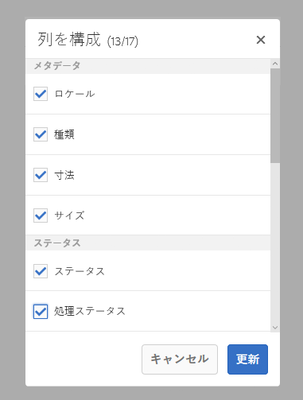

# Dynamic Mediaのビデオ {#video}

ここでは、Dynamic Media でのビデオの操作方法について説明します。

Dynamic Mediaの現在のビデオ再生の問題：

* 

   <!-- CQDOC-18116 -->You cannot play video renditions from the asset's Details page on Experience Manager - Dynamic Media running in hybrid mode.

* 

   <!-- CQDOC-18116 -->You cannot stream videos on Experience Manager - Dynamic Media running in hybrid mode.

## クイックスタート：ビデオ {#quick-start-videos}

次のワークフローの手順説明は、Dynamic Media 内のアダプティブビデオセットをすぐに使い始めることを目的としたものです。各手順の後に、トピックの見出しへの相互参照があり、詳細を確認できます。

>[!NOTE]
>
>Dynamic Mediaのビデオを操作する前に、Adobe Experience Manager管理者がDynamic Media - Scene7モードまたはDynamic Media — ハイブリッドモードでDynamic MediaCloud Servicesを既に有効にして設定していることを確認してください。
>
>* Dynamic Media - Scene7Cloud Servicesの設定の[Dynamic Mediaモードの設定](/help/assets/config-dms7.md#configuring-dynamic-media-cloud-services)および[Dynamic Media - Scene7モードのトラブルシューティング](/help/assets/troubleshoot-dms7.md)を参照してください。
   >
   >
* Dynamic Media — ハイブリッドモードの設定の[Dynamic MediaCloud Servicesの設定](/help/assets/config-dynamic.md#configuring-dynamic-media-cloud-services)を参照してください。

>


1. 次の手順を実行して、**Dynamic Media ビデオをアップロード**&#x200B;します。

   * 独自のビデオエンコーディングプロファイルを作成します。または、Dynamic Media に付属している事前定義済みの&#x200B;_アダプティブビデオエンコーディング_（AVE）プロファイルを使用してもかまいません。

      * [ビデオエンコーディングプロファイルの作成](/help/assets/video-profiles.md#creating-a-video-encoding-profile-for-adaptive-streaming)を参照してください。
      * [ビデオエンコーディングのベストプラクティス](#best-practices-for-encoding-videos)に関する詳細
   * ビデオ処理プロファイルを、プライマリソースビデオのアップロード先となる 1 つ以上のフォルダーに関連付けます。

      * [ビデオプロファイルをフォルダーに適用します](/help/assets/video-profiles.md#applying-a-video-profile-to-folders)。
      * [処理プロファイルを使用するためのデジタルアセットの整理におけるベストプラクティス](/help/assets/organize-assets.md)に関する詳細
      * [デジタルアセットの整理](/help/assets/organize-assets.md)の詳細をご覧ください。
   * フォルダーにプライマリソースビデオをアップロードします。15 GB までのビデオファイルをアップロードできます。フォルダーにビデオを追加すると、そのフォルダーに割り当てたビデオ処理プロファイルに従ってビデオがエンコードされます。

      * [ビデオのアップロード](/help/assets/managing-video-assets.md#upload-and-preview-video-assets)
      * [サポートされる入力ファイル形式](/help/assets/assets-formats.md#supported-multimedia-formats)に関する詳細
   * アセットまたはワークフロー表示から[ビデオ処理の進行状況](#monitoring-video-encoding-and-youtube-publishing-progress)を監視します。


1. 次のいずれかの操作をおこなって、**Dynamic Media ビデオを管理**&#x200B;します。

   * ビデオアセットを整理、参照および検索します。

      * [デジタルアセッ](/help/assets/organize-assets.md)
トの整理処理プロファ [イルを使用するためのデジタルアセットの整理のベストプラクティスに関する詳細](organize-assets.md)

      * [ビデオアセットの検](search-assets.md#custompredicates) 索またはア [セットの検索](/help/assets/search-assets.md)
   * ビデオアセットをプレビューして公開します。

      * ソースビデオとビデオのエンコードされたレンディションを、関連するサムネールと共に表示します。
         [ビデオのプレ](managing-video-assets.md#upload-and-preview-video-assets) ビューまた [はアセットのプレビュー](previewing-assets.md)
         [ビデオレンディションの表示](video-renditions.md)
         [ビデオレンディションの管理](manage-assets.md#managing-renditions)

      * [ビューアプリセットの管理](managing-viewer-presets.md)
      * [アセットの公開](publishing-dynamicmedia-assets.md)
   * ビデオのメタデータを操作します。

      * フレームレート、オーディオおよびビデオのビットレート、コーデックなど、エンコードされたビデオレンディションのプロパティを表示します。
         [ビデオレンディションのプロパティの表示](video-renditions.md)

      * タイトル、説明、タグ、カスタムメタデータフィールドなど、ビデオのプロパティを編集します。
         [ビデオプロパティの編集](manage-assets.md#editing-properties)

      * [デジタルアセットのメタデータの管理](metadata.md)
      * [メタデータスキーマ](metadata-schemas.md)
   * ビデオをレビューおよび承認し、注釈を付け、完全なバージョン管理を維持します。

      * [ビデオに注釈](managing-video-assets.md#annotate-video-assets) を付ける [か、アセットに注釈を付ける](manage-assets.md#annotating)

      * [バージョンを作成](manage-assets.md#asset-versioning)
      * [アセットへのワークフ](assets-workflow.md) ローの適用、また [はアセットでのワークフローの開始を参照](manage-assets.md#starting-a-workflow-on-an-asset)

      * [フォルダーのアセットのレビュー](bulk-approval.md)
      * [プロジェクト](../sites-authoring/projects.md)


1. 次のいずれかの操作をおこなって、**Dynamic Media ビデオを公開します。**

   * Adobe Experience ManagerをWebコンテンツ管理システムとして使用する場合、Webページに直接ビデオを追加できます。

      * [Webページにビデオを追加します](adding-dynamic-media-assets-to-pages.md)。
   * サードパーティの Web コンテンツ管理システムを使用している場合、Web ページにビデオをリンクするか、ビデオを埋め込むことができます。

      * URL を使用したビデオの統合：
         [WebアプリケーションへのURLのリンク](linking-urls-to-yourwebapplication.md)を参照してください。

      * Web ページの埋め込みコードを使用したビデオの統合：
         [Webページにビデオビューアを埋め込みます](embed-code.md)。
   * [YouTubeへのビデオの公開](#publishing-videos-to-youtube)を参照してください。
   * [ビデオレポートを生成します](#viewing-video-reports)。

   * [ビデオへのキャプションの追加](#adding-captions-to-video)


## Dynamic Mediaでのビデオの操作 {#working-with-video-in-dynamic-media}

Dynamic Mediaのビデオは、デスクトップ、iOS、Android™、BlackBerry®、Windowsモバイルデバイスなど、複数の画面にストリーミング用の高品質なアダプティブビデオを簡単に公開できるエンドツーエンドのソリューションです。アダプティブビデオセットは、同じビデオのバージョンを、400 kbps、800 kbps、1000 kbpsなど、異なるビットレートおよび形式でエンコードしてグループ化します。デスクトップコンピューターまたはモバイルデバイスが、使用可能な帯域幅を検出します。

例えば、iOS モバイルデバイスでは、3G、4G、Wi-Fi などの帯域幅が検出されます。次に、アダプティブビデオセット内の様々なビデオのビットレートの中から、適切なエンコード済みビデオが自動的に選択されます。そのビデオが、デスクトップ、モバイルデバイスまたはタブレットにストリーミングされます。

さらに、デスクトップまたはモバイルデバイスでネットワーク状況が変化した場合に、ビデオ品質が自動的に、動的に切り替えられます。また、顧客がデスクトップでフルスクリーンモードに切り替えると、アダプティブビデオセットはより高い解像度を使用して応答し、顧客の表示エクスペリエンスが向上します。 アダプティブビデオセットを使用すると、Dynamic Media ビデオを複数の画面とデバイスで再生するユーザーにとって最適な再生方法が提供されます。

再生または再生時に選択するエンコード済みビデオの決定に、ビデオプレーヤーが使用するロジックは、次のアルゴリズムに基づきます。

1. ビデオプレーヤーは、プレーヤー自体の「初期ビットレート」に設定されている値に最も近いビットレートで、初期ビデオフラグメントを読み込みます。
1. ビデオプレーヤーは、帯域幅の速度の変化に応じて、次の条件に従って切り替わります。

   1. プレーヤーは、見積もり帯域幅を超えない範囲内で、最も高い帯域幅でのストリームを選択します。
   1. プレーヤーは、使用可能な帯域幅の 80％ほどを見積もります。ただし、使用可能な帯域幅が上昇した場合は、帯域幅を大きく見積もりすぎてすぐに元の帯域幅に戻ることを防ぐために、より控えめな 70％ほどの見積もりとなります。

アルゴリズムの技術情報について詳しくは、[https://android.googlesource.com/platform/frameworks/av/+/master/media/libstagefright/httplive/LiveSession.cpp](https://android.googlesource.com/platform/frameworks/av/+/master/media/libstagefright/httplive/LiveSession.cpp) を参照してください。

1 つのビデオおよびアダプティブビデオセットの管理では、次の方法がサポートされています。

* サポートされる各種ビデオ形式およびオーディオ形式のビデオをアップロードして、複数の画面での再生用にビデオを MP4 H.264 形式へとエンコードすること。事前定義済みのアダプティブビデオセット、1 つのビデオのエンコーディングプリセットを使用するか、独自のエンコーディングをカスタマイズしてビデオの品質とサイズを制御することができます。

   * アダプティブビデオセットが生成される場合、そのセットには MP4 ビデオが含まれます。
   * **注意**：マスター／ソースビデオはアダプティブビデオセットには追加されません。

* すべての HTML5 ビデオビューアでのビデオキャプション。
* 効率的なビデオアセット管理のための、メタデータが完全にサポートされたビデオの整理、参照および検索。
* アダプティブビデオセットをWebやデスクトップ、およびiPhone、iPad、Android™、BlackBerry®、Windows Phoneなどのモバイルデバイスに配信します。

アダプティブビデオのストリーミングは、様々なiOSプラットフォームでサポートされています。 詳しくは、[Dynamic Media ビューアリファレンスガイド](https://experienceleague.adobe.com/docs/dynamic-media-developer-resources/library/viewers-aem-assets-dmc/video/c-html5-video-reference.html?lang=ja#ビデオ)を参照してください。

Dynamic Mediaは、MP4 H.264ビデオのモバイルビデオ再生をサポートしています。このビデオ形式をサポートするBlackBerry®デバイスは、次の場所にあります。[BlackBerry®](https://support.blackberry.com/kb/articleDetail?ArticleNumber=000005482)でサポートされているビデオ形式。

このビデオ形式をサポートするWindowsデバイスは、次の場所にあります。[Windows Phone 8](https://docs.microsoft.com/en-us/previous-versions/windows/apps/ff462087(v=vs.105))でサポートされているメディアコーデック

* Dynamic Media ビデオビューアプリセットを使用してビデオを再生します。このビューアプリセットには、次のビューアが含まれます。

   * 1 つのビデオのビューア
   * ビデオコンテンツと画像コンテンツの両方を組み合わせた混在メディアビューア

* 自社ブランドのニーズに合わせてビデオプレーヤーを設定します。
* 単純な URL か埋め込みコードを使用して、ビデオを Web サイト、モバイルサイトまたはモバイルアプリケーションに統合します。

<!-- See [Dynamic video playback](https://s7d9.scene7.com/s7/uvideo.jsp?asset=GeoRetail/Mop_AVS&config=GeoRetail/Universal_Video1&stageSize=640,480) sample. -->

[Experience ManagerアセットのビューアとDynamic Media Classic](https://experienceleague.adobe.com/docs/dynamic-media-developer-resources/library/viewers-aem-assets-dmc/c-html5-s7-aem-asset-viewers.html?lang=ja#viewers-aem-assets-dmc)および[Experience Managerアセットのビューアのみ](https://experienceleague.adobe.com/docs/dynamic-media-developer-resources/library/viewers-for-aem-assets-only/c-html5-aem-asset-viewers.html?lang=ja#viewers-for-aem-assets-only)も参照してください。

## ベストプラクティス：HTML5 ビデオビューアの使用 {#best-practice-using-the-html-video-viewer}

Dynamic Media HTML5ビデオビューアプリセットは堅牢なビデオプレーヤーです。HTML5ビデオ再生に関連する多くの一般的な問題を回避するために使用できます。また、アダプティブストリーミング配信の不足やデスクトップブラウザーのリーチ制限など、モバイルデバイスに関連する問題についても説明します。

プレーヤーのデザイン側では、標準のWeb開発ツールを使用してビデオプレーヤーの機能をデザインできます。 例えば、HTML5 と CSS を使用して、ボタン、コントロールおよびカスタムのポスター画像背景をデザインして、カスタマイズした表示によって顧客に対応することができます。

ビューアの再生側から見れば、ビューアによってブラウザーのビデオ機能が自動的に検出されます。その後、HLS（HTTP ライブストリーミング）を使用してビデオが配信されます。HLS はアダプティブビデオストリーミングとも呼ばれます。または、これらの配信方法が使用できない場合は、HTML5 プログレッシブが代わりに使用されます。

を1つのプレーヤーに組み合わせることで、次の操作をおこないます。

* HTML5とCSSを使用して再生コンポーネントを設計する機能
* 埋め込み再生がある
* ブラウザーの機能に応じて、アダプティブストリーミングとプログレッシブストリーミングを使用する

リッチメディアコンテンツの提供先をデスクトップユーザーとモバイルユーザーの両方に広げ、ビデオエクスペリエンスを合理化します。

[HTML5ビューアについて](https://experienceleague.adobe.com/docs/dynamic-media-developer-resources/library/viewers-for-aem-assets-only/c-html5-aem-asset-viewers.html#viewers-for-aem-assets-only)も参照してください。

### HTML5 ビデオビューアを使用した、デスクトップコンピューターおよびモバイルデバイス上でのビデオ再生 {#playback-of-video-on-desktop-computers-and-mobile-devices-using-the-html-video-viewer}

デスクトップおよびモバイルへのアダプティブビデオストリーミングの場合、ビットレートの切り替えに使用されるビデオは、アダプティブビデオセット内のすべての MP4 ビデオに基づいています。

ビデオ再生は、HLS（HTTP ライブストリーミング）かプログレッシブビデオダウンロードを使用しておこなわれます。6.0、6.1、6.2など、Experience Managerの以前のバージョンでは、ビデオはHTTP経由でストリーミングされていました。

ただし、Experience Manager6.3以降では、DMゲートウェイサービスのURLも常にHTTPSを使用するので、ビデオはHTTPS(HLS)を使用してストリーミングされるようになりました。 このデフォルトの動作には、お客様への影響はありません。 つまり、ブラウザーでサポートされていない場合を除き、ビデオストリーミングは常に HTTPS 上でおこなわれます（以下の表を参照してください）。したがって、次のようになります。

* HTTPS Web サイトが HTTPS ビデオストリーミングに対応している場合は、ストリーミングが適しています。
* HTTP Web サイトが HTTPS ビデオストリーミングに対応している場合は、ストリーミングが適しており、Web ブラウザーから混合コンテンツに関する問題は発生しません。

HLS は、アダプティブビデオストリーミングの Apple 標準で、ネットワーク帯域幅のキャパシティに応じて再生を自動的に調整します。また、HLS では、ビデオの残りのダウンロードを待たずに、ビデオ内の任意のポイントを「シーク」できます。

プログレッシブビデオは、ユーザーのデスクトップシステムやモバイルデバイスにダウンロードしてローカルに保存することで配信されます。

デバイス、ブラウザー、およびデスクトップコンピューターやモバイルデバイスでの Dynamic Media ビデオビューアによるビデオの再生方法を次の表に示します。

<table>
 <tbody>
  <tr>
   <td><strong>デバイス</strong></td>
   <td><strong>ブラウザー</strong></td>
   <td><strong>ビデオ再生モード</strong></td>
  </tr>
  <tr>
   <td>デスクトップ</td>
   <td>Internet Explorer 9 および 10</td>
   <td>プログレッシブダウンロード。</td>
  </tr>
  <tr>
   <td>デスクトップ</td>
   <td>Internet Explorer 11+</td>
   <td>Windows 8 および Windows 10 では、HLS が要求されるたびに HTTPS を強制的に使用します。既知の制約事項：このブラウザー／オペレーティングシステムの組み合わせでは、HLS での HTTP は機能しません。<br /> <br /> Windows 7 - プログレッシブダウンロード。HTTP プロトコルと HTTPS プロトコルの選択には標準的なロジックが使用されます。</td>
  </tr>
  <tr>
   <td>デスクトップ</td>
   <td>Firefox 23～44</td>
   <td>プログレッシブダウンロード。</td>
  </tr>
  <tr>
   <td>デスクトップ</td>
   <td>Firefox 45 以降</td>
   <td>HLS</td>
  </tr>
  <tr>
   <td>デスクトップ</td>
   <td>Chrome</td>
   <td>HLS</td>
  </tr>
  <tr>
   <td>デスクトップ</td>
   <td>Safari（Mac）</td>
   <td>HLS</td>
  </tr>
  <tr>
   <td>モバイル</td>
   <td>Chrome(Android™ 6以前)</td>
   <td>プログレッシブダウンロード。</td>
  </tr>
  <tr>
   <td>モバイル</td>
   <td>Chrome(Android™ 7以降)</td>
   <td>HLS</td>
  </tr>
  <tr>
   <td>モバイル</td>
   <td>Android™（デフォルトのブラウザー）</td>
   <td>プログレッシブダウンロード。</td>
  </tr>
  <tr>
   <td>モバイル</td>
   <td>Safari（iOS）</td>
   <td>HLS</td>
  </tr>
  <tr>
   <td>モバイル</td>
   <td>Chrome（iOS）</td>
   <td>HLS</td>
  </tr>
  <tr>
   <td>モバイル</td>
   <td>BlackBerry®</td>
   <td>HLS</td>
  </tr>
 </tbody>
</table>

## Dynamic Media ビデオソリューションのアーキテクチャ {#architecture-of-dynamic-media-video-solution}

次の図に、アップロード後、（Dynamic Media Hybrid モードの）DMGateway によってエンコードされ、公開されるビデオのオーサリングワークフローの全体像を示します。


## ビデオのハイブリッド公開アーキテクチャ {#hybrid-publishing-architecture-for-videos}


## ビデオエンコーディングのベストプラクティス {#best-practices-for-encoding-videos}

Dynamic Media を有効にし、ビデオクラウドサービスを設定済みの場合、**Dynamic Media エンコードビデオ**&#x200B;ワークフローがビデオをエンコードします。このワークフローは、ワークフローの処理履歴とエラー情報を取り込みます。[ビデオエンコーディングとYouTubeの公開の進行状況の監視](#monitoring-video-encoding-and-youtube-publishing-progress)を参照してください。 Dynamic Media を有効にし、ビデオ Cloud Services を設定してある場合は、ビデオをアップロードすると、**[!UICONTROL Dynamic Media エンコーディングビデオ]**&#x200B;ワークフローが自動的に有効になります（Dynamic Media を使用していない場合は、**[!UICONTROL DAM アセットの更新]**&#x200B;ワークフローが有効になります）。

<!-- DEAD The following are best-practice tips for encoding source video files.

For advice about video encoding, see [Video Encoding Basics](https://www.adobe.com/go/learn_s7_encoding_en).

* [Streaming 101: The Basics — Codecs, Bandwidth, Data Rate, and Resolution](https://www.adobe.com/go/learn_s7_streaming101_en). -->

### ソースビデオファイル {#source-video-files}

ビデオファイルをエンコードするときは、可能な限り最高品質のソースビデオファイルを使用します。以前にエンコードされたビデオファイルの使用は避けてください。そのようなファイルは既に圧縮済みで、さらにエンコードすると標準を下回る品質のビデオが作成されるからです。

次の表に、ソースビデオファイルをエンコードする前に推奨されるサイズ、縦横比、最小ビットレートを示します。

| サイズ | 縦横比 | 最小ビットレート |
|--- |--- |--- |
| 1,024 X 768 | 4:3 | 4,500 kbps（ほとんどのビデオ） |
| 1,280 X 720 | 16:9 | 3,000～6,000 kbps（ビデオ内のモーションの量に応じて調整） |
| 1,920 X 1,080 | 16:9 | 6,000～8,000 kbps（ビデオ内のモーションの量に応じて調整） |

### ファイルのメタデータの取得 {#obtaining-a-file-s-metadata}

ビデオ編集ツールを使用してメタデータを参照するか、メタデータ取得用のアプリケーションを使用して、ファイルのメタデータを取得することができます。以下は、サードパーティアプリケーションの MediaInfo を使用してビデオファイルのメタデータを取得する手順です。

1. 次の Web ページにアクセスします。[https://mediainfo.sourceforge.net/en/Download](https://mediainfo.sourceforge.net/en/Download)
1. GUI バージョンのインストーラーを選択してダウンロードし、インストール手順に従って操作します。
1. インストールの完了後、ビデオファイルを右クリックして（Windows のみ）MediaInfo を選択するか、MediaInfo を開いてビデオファイルをアプリケーションにドラッグします。ビデオの幅、高さ、fps を含む、ビデオファイルに関連するすべてのメタデータが表示されます。

### 縦横比 {#aspect-ratio}

プライマリソースビデオファイルのビデオエンコーディングプリセットを選択または作成するときには、プライマリソースビデオファイルと同じ縦横比をプリセットに使用してください。縦横比とは、ビデオの高さに対する幅の比率のことです。

ビデオファイルの縦横比を求めるには、ファイルのメタデータを取得し、そのファイルの幅と高さを記録します（前述のファイルのメタデータの取得を参照してください）。さらに、次の式を使用して縦横比を計算します。

幅/高さ = 縦横比

次の表に、この式の解を一般的な縦横比に変換した結果を示します。

| 式の解 | 縦横比 |
|--- |--- |
| 1.33 | 4:3 |
| 0.75 | 3:4 |
| 1.78 | 16:9 |
| 0.56 | 9:16 |

例えば、幅1440 x 1080のビデオの縦横比は1440/1080(1.33)です。この場合、縦横比が4:3のビデオエンコーディングプリセットを選択してビデオファイルをエンコードします。

### ビットレート {#bitrate}

ビットレートとは、1 秒間のビデオ再生を作成するためにエンコードされるデータの量です。ビットレートは、1 秒あたりのキロビット数（Kbps）の単位で測定します。

>[!NOTE]
>
>すべてのコーデックで非可逆圧縮が使用されるので、ビットレートは、ビデオ品質における最も重要な要素となります。非可逆圧縮では、ビデオファイルの圧縮率が高いほど、ビデオの品質は低下します。したがって、他の特性（解像度、フレームレートおよびコーデック）がすべて等しい場合は、ビットレートが低いほど、圧縮ファイルの品質は低下します。

ビットレートエンコーディングは 2 種類あり、そのどちらかを選択できます。

* **[!UICONTROL Constant Bitrate Encoding]** (CBR) - CBRエンコーディング中、ビットレートまたは1秒あたりのビット数は、エンコーディングプロセス全体で同じになります。CBR エンコーディングでは、設定されているデータレートが、ビデオ全体での設定値として使用されます。また、CBR エンコーディングでは、メディアファイルの品質は最適化されませんが、その分、空き容量の節約になります。ビデオ全体に同じようなモーションレベルが含まれている場合は、CBR を使用します。CBR は、ビデオコンテンツのストリーミングに最も一般的に使用されています。[カスタムで追加するビデオエンコーディングパラメーター](/help/assets/video-profiles.md#using-custom-added-video-encoding-parameters)の使用も参照してください。

* **[!UICONTROL 可変ビットレートエンコーディング]**（VBR） - VBR エンコーディングでは、圧縮形式で必要となるデータに基づいて、データのレートが設定した下限から上限の範囲内で調整されます。この機能は、VBRエンコーディングプロセス中に、メディアファイルのビットレートが、必要なメディアファイルに応じて動的に増減することを意味します。
VBR は、CBR よりエンコードに時間がかかりますが、生成されるメディアファイルは最高品質となります。VBR は、ビデオコンテンツの HTTP プログレッシブ配信に最も一般的に使用されます。

VBRとCRBのどちらを使用するか
VBRとCBRを選択する場合、ほとんどの場合、メディアファイルにVBRを使用することをお勧めします。 VBRは、競争の激しいビットレートで高品質のファイルを提供します。 VBR を使用するときは、2 パスエンコーディングを使用し、最大ビットレートをターゲットビデオのビットレートの 1.5 倍に設定してください。

ビデオエンコーディングプリセットを選択する際には、対象となるエンドユーザーの接続速度を記憶しておきます。 その速度の80%のデータレートのプリセットを選択します。 例えば、ターゲットエンドユーザーの接続速度が1,000 Kbpsの場合、ビデオデータレートが800 Kbpsのプリセットが最適です。

次の表に、一般的な接続速度のデータレートを示します。

| 速度（Kbps） | 接続タイプ |
|--- |--- |
| 256 | ダイアルアップ接続。 |
| 800 | 一般的なモバイル接続。この接続では、3G エクスペリエンス向けに 400～800 の範囲のデータレートがターゲットとなります。 |
| 2,000 | 一般的なブロードバンドデスクトップ接続。この接続では、800～2,000 Kbps の範囲のデータレートがターゲットとなります。大部分のターゲットは、平均 1,200～1,500 Kbps です。 |
| 5,000 | 一般的な高帯域幅接続。この高帯域幅の範囲でのエンコードは推奨されません。ほとんどのユーザーに対して、この速度でビデオを配信することはできません。 |

### 解決方法 {#resolution}

**解像度**&#x200B;は、ビデオファイルの高さと幅をピクセル単位で表したものです。ほとんどのソースビデオは、1,920 x 1,080 などの高解像度で保存されます。ストリーミング用のソースビデオは、比較的低い解像度（640 x 480 以下）に圧縮されます。

解像度とデータレートは、ビデオの品質を決める、一体的な関連を持つ 2 つの要素です。同じビデオ品質を維持するには、ビデオファイル内のピクセル数が多いほど（解像度が高いほど）、データレートを高くする必要があります。例えば、320 x 240 の解像度と 640 x 480 の解像度のビデオファイルにおけるフレームあたりピクセル数を考察すると、次のようになります。

| 解像度 | フレームあたりピクセル数 |
|--- |--- |
| 320 x 240 | 76,800 |
| 640 x 480 | 307,200 |

640 x 480 のファイルのフレームあたりピクセル数は 4 倍あります。これら 2 つの解像度例で同じデータレートを達成するには、640 x 480 のファイルに対して 4 倍の圧縮率を適用します。その結果、ビデオの品質が低下する可能性があります。つまり、250 Kbps のビデオデータレートの場合、320 x 240 の解像度では高品質の表示が可能ですが、640 x 480 の解像度では高品質の表示は期待できません。

一般に、使用するデータレートが高いほど、ビデオの画質が良くなり、使用する解像度が高いほど、（解像度が低い場合と比べて）視聴品質を維持する必要があります。

解像度とデータレートには関連があるので、ビデオをエンコードする際には次の 2 つの方法から選択できます。

* データレートを選択してから、選択したデータレートできれいに表示される最高の解像度でエンコードします。
* 解像度を選択してから、選択した解像度で高品質のビデオを配信するために必要になるデータレートでエンコードします。

プライマリソースビデオファイルのビデオエンコーディングプリセットを選択（または作成）する場合は、次の表を使用して正しい解像度をターゲットにします。

| 解像度 | 高さ（ピクセル） | 画面サイズ |
|--- |--- |--- |
| 240p | 240 | ごく小さな画面 |
| 300p | 300 | 小型の画面（一般にモバイルデバイス用） |
| 360p | 360 | 小型の画面 |
| 480p | 480 | 中型の画面 |
| 720p | 720 | 大型の画面 |
| 1080p | 1080 | 高画質の大型の画面 |

### Fps（1 秒あたりのフレーム数）  {#fps-frames-per-second}

日本および米国では、ほとんどのビデオは 1 秒あたりのフレーム数（fps）が 29.97 で撮影されます。また、ヨーロッパでは、ほとんどのビデオが 25 fps で撮影されます。映画は 24 fps で撮影されます。

プライマリソースビデオファイルの fps レートに一致するビデオエンコーディングプリセットを選択します。例えば、プライマリソースビデオが 25 fps の場合は、25 fps のエンコーディングプリセットを選択します。デフォルトでは、すべてのカスタムエンコーディングでプライマリソースビデオファイルの fps が使用されます。そのため、ビデオエンコーディングプリセットを作成するときに、fps 設定を明示的に指定する必要はありません。

### ビデオエンコーディングのサイズ {#video-encoding-dimensions}

最適化の理由で、ソースビデオのサイズがエンコードされるすべてのビデオの整数倍になるようなエンコーディングのサイズを選択してください。

この比率を計算するために、ソースの幅をエンコードの幅で割って幅の比率を求めます。次に、ソースの高さをエンコードの高さで割って高さの比率を求めます。

結果の比率が整数の場合は、ビデオが最適なサイズで縮小されます。結果の比率が整数でない場合は、ディスプレイに圧縮による副作用のピクセルが残存して、ビデオの品質に影響を及ぼします。この影響は、ビデオにテキストが含まれる場合に特に目立ちます。

例として、1,920 x 1,080 のソースビデオを取り上げます。次の表の 3 つのエンコードされたビデオは、使用すべき最適なエンコーディング設定です。

| ビデオタイプ | 幅 x 高さ | 幅の比率 | 高さの比率 |
|--- |--- |--- |--- |
| ソース | 1,920 x 1,080 | 1 | 1 |
| エンコード | 960 x 540 | 2 | 2 |
| エンコード | 640 x 360 | 3 | 1 |
| エンコード | 480 x 270 | 4 | 4 |

### エンコードされたビデオのファイル形式 {#encoded-video-file-format}

Dynamic Media では、MP4 H.264 ビデオエンコーディングプリセットの使用を推奨しています。MP4 ファイルでは H.264 ビデオコーデックが使用されるので、高品質のビデオを圧縮されたファイルサイズで作成することができます。

## YouTubeへのビデオの公開 {#publishing-videos-to-youtube}

オンプレミスのExperience Managerビデオアセットは、以前に作成したYouTubeチャネルに直接公開できます。

ビデオアセットを YouTube に公開するには、タグを使用して Experience Manager Assets をセットアップします。これらのタグを YouTube チャンネルに関連付けます。ビデオアセットのタグが YouTube チャンネルのタグと一致する場合、ビデオが YouTube に公開されます。YouTube への公開は、関連するタグが使用されている限り、ビデオの通常公開と一緒におこなわれます。

YouTube は独自のエンコーディングをおこないます。そのため、Experience Managerにアップロードされた元のビデオファイルは、Dynamic Mediaのエンコーディングで作成されたビデオレンディションの代わりにYouTubeに公開されます。 Dynamic Mediaを使用してビデオを処理する必要はありませんが、再生にビューアプリセットが必要な場合は処理する必要があります。

ビデオ処理プロファイルをスキップしてYouTubeに直接公開する場合、Experience Managerアセット内のビデオアセットには表示可能なサムネールが表示されません。 また、`dynamicmedia`または`dynamicmedia_scene7`の実行モードで実行する場合、エンコードされていないビデオは、Dynamic Mediaのアセットタイプのいずれでも機能しません。

ビデオアセットの YouTube サーバーへの公開において、YouTube との安全でセキュアなサーバー間認証をおこなうには、次のタスクを実行する必要があります。

1. [Google Cloud設定](#configuring-google-cloud-settings)
1. [YouTubeチャネルの作成](#creating-a-youtube-channel)
1. [公開用タグの追加](#adding-tags-for-publishing)
1. [YouTube Publishレプリケーションエージェントの有効化](#enabling-the-youtube-publish-replication-agent)
1. [Experience ManagerでのYouTubeの設定](#setting-up-youtube-in-aem)
1. [（オプション）アップロードしたビデオのデフォルトのYouTubeプロパティ設定を自動化します](#optional-automating-the-setting-of-default-youtube-properties-for-your-uploaded-videos)
1. [YouTubeチャネルへのビデオの公開](#publishing-videos-to-your-youtube-channel)
1. [（オプション）YouTubeで公開済みビデオを確認する](/help/assets/video.md#optional-verifying-the-published-video-on-youtube)
1. [YouTube URLのWebアプリケーションへのリンク](#linking-youtube-urls-to-your-web-application)

また、[ビデオを非公開にして YouTube から削除する](#unpublishing-videos-to-remove-them-from-youtube)こともできます。

### Google Cloud設定 {#configuring-google-cloud-settings}

YouTubeに公開するには、Googleアカウントが必要です。GMAILアカウントを持っている場合は、既にGoogleアカウントを持っている。Googleアカウントを持っていない場合は、簡単に作成できます。ビデオアセットをYouTubeに公開するための資格情報が必要なので、アカウントが必要です。 既にアカウントを作成済みの場合は、このタスクをスキップして [YouTube チャンネルの作成](#creating-a-youtube-channel)タスクに進んでください。

Google Cloud で使用するアカウントと YouTube に使用する Google アカウントは、必ずしも同じである必要はありません。

Googleはユーザーインターフェイスを定期的に変更します。 そのため、ビデオをYouTubeに公開する手順は、以下に説明する手順とは少し異なる場合があります。 これは、ビデオが YouTube にアップロードされるかどうかを確認する場合にも当てはまります。

>[!NOTE]
>
>以下の手順は、このドキュメントを執筆している時点で正確なものです。Google は、Web サイトを予告なく定期的に更新します。したがって、これらの手順は少し異なる場合があります。

Google Cloud を設定するには：

1. Googleアカウントを作成します。
   [https://accounts.google.com/SignUp?service=mail](https://accounts.google.com/SignUp?service=mail)

   既に Google アカウントを持っている場合は、次のステップに進んでください。

1. [https://cloud.google.com/](https://cloud.google.com/) にアクセスします。
1. Google Cloud ページの右上隅付近にある、「**[!UICONTROL コンソール]**」をクリックします。

   必要に応じて、**[!UICONTROL Googleアカウントの資格情報を使用して]**&#x200B;ログインし、**[!UICONTROL コンソール]**&#x200B;オプションを表示します。

1. ダッシュボードページで、**[!UICONTROL Google Cloud Platform]** の右側にある「プロジェクト」ドロップダウンリストをクリックして、プロジェクトの選択ダイアログボックスを開きます。
1. プロジェクトの選択ダイアログボックスで、「**[!UICONTROL 新しいプロジェクト]**」をタップします。

   

1. 新しいプロジェクトダイアログボックスで、「プロジェクト名」フィールドに新しいプロジェクトの名前を入力します。

   プロジェクトIDは、プロジェクト名に基づいています。 そのため、プロジェクト名は慎重に選んでください。プロジェクト名を後で変更することはできません。また、後でYouTubeをExperience Managerで設定する際には、同じプロジェクトIDを再度入力する必要があります。書き留めてみよう

1. 「**[!UICONTROL 作成]**」をクリックします。

1. 次のいずれかの操作をおこないます。

   * プロジェクトのダッシュボードの「スタートガイド」カードで、「**[!UICONTROL API を探索して有効にする]**」をタップします。
   * プロジェクトのダッシュボードの「API」カードで「**[!UICONTROL API の概要に移動]**」をタップします。

   

1. API とサービスページの上部にある「**[!UICONTROL API とサービスを有効にする]**」をタップします。
1. API ライブラリページの左側の「**[!UICONTROL カテゴリ]**」で、「**[!UICONTROL YouTube]**」をタップします。ページの右側で、「**[!UICONTROL YouTube Data API]**」をタップします。
1. YouTube Data API v3 ページで、「**[!UICONTROL 有効にする]**」をタップします。

   

1. APIを使用するには、資格情報が必要です。 その場合は、「**[!UICONTROL 認証情報を作成]**」をクリックします。

   

1. **[!UICONTROL プロジェクトへの認証情報の追加]**&#x200B;ページの手順 1 で以下をおこないます。

   * 「**[!UICONTROL 使用する API]**」ドロップダウンリストから、「**[!UICONTROL YouTube Data API v3]**」を選択します。

   * 「**[!UICONTROL API を呼び出す場所]**」ドロップダウンリストから、「**[!UICONTROL ウェブサーバー（node.js、Tomcat など）]**」を選択します。

   * 「**[!UICONTROL アクセスするデータの種類]**」ドロップダウンリストから、「**[!UICONTROL ユーザーデータ]**」を選択します。

   

1. 「**[!UICONTROL 必要な認証情報]**」をタップします。
1. **[!UICONTROL プロジェクトへの認証情報の追加]**&#x200B;ページの手順 2 で、「**[!UICONTROL OAuth 2.0 クライアント ID を作成する]**」の下の「名前」フィールドに、必要に応じて一意の名前を入力します。または、Google で指定されるデフォルトの名前を使用することもできます。
1. 「**[!UICONTROL 承認済みのJavaScriptオリジン]**」の下にあるテキストフィールドに、次のパスに従って、実際に使用するドメインとポート番号を入力します。入力が終わったら、**[!UICONTROL Enter]**&#x200B;キーを押して、パスをリストに追加します。

   `https://<servername.domain>:<port_number>`

   例：`https://1a2b3c.mycompany.com:4321`

   **注意**:上記のパスの例は、デモ目的でのみ使用されています。

   

1. 「**[!UICONTROL 承認済みのリダイレクト URI]**」の下にあるテキストフィールドに、次のように、実際に使用するドメインとポート番号を入力します。入力が終わったら、**[!UICONTROL Enter]** キーを押して、パスをリストに追加します。

   `https://<servername.domain>:<port_number>/etc/cloudservices/youtube.youtubecredentialcallback.json`

   例：`https://1a2b3c.mycompany.com:4321/etc/cloudservices/youtube.youtubecredentialcallback.json`

   **注意**:上記のパスの例は、デモ目的でのみ使用されています。

1. 「**[!UICONTROL OAuth クライアント ID の作成]**」をクリックします。
1. **[!UICONTROL プロジェクトへの認証情報の追加]**&#x200B;ページの手順 3 で、「**[!UICONTROL OAuth 2.0 同意画面を設定する]**」の下で、現在使用している Gmail 電子メールアドレスを選択します。

   

1. 「**[!UICONTROL ユーザーに表示される製品名]**」の下のテキストフィールドに、同意画面に表示する内容を入力します。

   同意画面は、YouTubeへの認証時にExperience Manager管理者に表示されます。Experience ManagerがYouTubeにアクセスし、許可を求めます。

1. 「**[!UICONTROL 続行]**」をクリックします。
1. プロジェクトへの認証情報の追加ページの手順 4 で、「**[!UICONTROL 認証情報をダウンロードする]**」の下の「**[!UICONTROL ダウンロード]**」をタップします。

   

1. `client_id.json` ファイルを保存します。

   後でAdobe Experience ManagerでYouTubeを設定する際に、このダウンロードしたjsonファイルが必要になります。

1. 「**[!UICONTROL 完了]**」をクリックします。

   Google アカウントからログアウトします。次に、YouTubeチャネルを作成します。

### YouTubeチャネルの作成 {#creating-a-youtube-channel}

YouTube にビデオを公開するには、1 つ以上のチャネルが必要です。既にYouTubeチャネルを作成している場合は、このタスクをスキップして、[公開用タグの追加](/help/assets/video.md#adding-tags-for-publishing)に移動できます。

>[!WARNING]
>
>Experience Managerの「YouTube設定」にチャネルを追加する前に、YouTube *に1つ以上のチャネルを既に設定していることを確認してください(下記の[Experience ManagerでのYouTubeの設定](#setting-up-youtube-in-aem)を参照)。* 1つ以上のチャネルを設定しなかった場合、存在しないチャネルに関する警告は表示されません。 ただし、それでも、チャネルを追加する際に Google 認証がおこなわれますが、ビデオの送信先となるチャネルを選択するオプションがありません。

**YouTube チャンネルを作成するには：**

1. [https://www.youtube.com](https://www.youtube.com/) にアクセスし、Google アカウントの資格情報を使用してログインします。
1. YouTubeページの右上隅にあるプロフィール画像（内側に文字が表示された、べた塗りの円が表示されている場合）をクリックし、**[!UICONTROL YouTube設定]**（丸い歯車アイコン）をクリックします。
1. 概要ページの「その他の機能」で、「**[!UICONTROL チャネルをすべて表示するか、新しいチャネルを作成する]**」をクリックします。
1. チャネルページで、「**[!UICONTROL 新しいチャネルを作成]**」をクリックします。
1. ブランドアカウントページで、「ブランドアカウント名」フィールドに、ビジネス名や、ビデオアセットの公開先となる他のチャネル名を入力し、「**[!UICONTROL 作成]**」をクリックします。

   ここに入力した名前は覚えておいてください。これは、Experience ManagerでYouTubeを設定する際に再度入力する必要があるからです。

1. （オプション）必要に応じて、さらにチャネルを追加します。

   公開用のタグを追加します。

### 公開用タグの追加 {#adding-tags-for-publishing}

ビデオをYouTubeに公開するために、Experience Managerはタグを1つ以上のYouTubeチャネルに関連付けます。 公開用のタグを追加するには、[タグの管理](/help/sites-administering/tags.md)を参照してください。

または、Experience Managerでデフォルトのタグを使用する場合は、このタスクをスキップして、「[YouTube発行レプリケーションエージェントの有効化](#enabling-the-youtube-publish-replication-agent)」に進みます。

### YouTube Publishレプリケーションエージェントの有効化 {#enabling-the-youtube-publish-replication-agent}

YouTube への公開のレプリケーションエージェントを有効化した後、Google Cloud アカウントへの接続をテストする場合は、「**[!UICONTROL 接続をテスト]**」をタップします。ブラウザーのタブに接続結果が表示されます。YouTubeチャネルを追加した場合は、その一覧がテストの一部として表示されます。

1. Experience Managerの左上隅にあるExperience Managerロゴをクリックし、左側のレールで&#x200B;**[!UICONTROL ツール]** / **[!UICONTROL デプロイ]** / **[!UICONTROL レプリケーション]** / **[!UICONTROL 作成者のエージェント]**&#x200B;をクリックします。
1. オーサーのエージェントページで、「**[!UICONTROL YouTubeパブリッシュ]**」をクリックします。
1. ツールバーで、「設定」の右側にある「**[!UICONTROL 編集]**」をクリックします。
1. 「**[!UICONTROL 有効]**」チェックボックスをオンにして、レプリケーションエージェントをオンにします。
1. 「**[!UICONTROL OK]**」をクリックします。

   次に、Experience ManagerでYouTubeを設定します。

### Experience ManagerでのYouTubeの設定 {#setting-up-youtube-in-aem}

Experience Manager6.4以降、YouTubeをExperience Managerで設定するための新しいタッチユーザーインターフェイス方法が導入されました。 使用しているExperience Managerのインストール済みインスタンスに応じて、次のいずれかの操作を行います。

* 6.4より前のExperience ManagerでYouTubeを設定するには、「 6.4](/help/assets/video.md#setting-up-youtube-in-aem-before)より前のExperience ManagerでのYouTubeの設定」を参照してください。[
* Experience Manager6.4以降でYouTubeを設定するには、[Experience Manager6.4以降でのYouTubeの設定](#setting-up-youtube-in-aem-and-later)を参照してください。

#### Experience Manager6.4以降でのYouTubeのセットアップ {#setting-up-youtube-in-aem-and-later}

1. Dynamic Media のインスタンスに管理者としてログインしてください。
1. 左上隅のExperience Managerロゴをタップし、左側のレールで&#x200B;**[!UICONTROL ツール]**（ハンマーのアイコン）/**[!UICONTROL Cloud Services]**/**[!UICONTROL YouTube Publishing Configuration]**&#x200B;をタップします。
1. 「**[!UICONTROL グローバル]**」をタップします（選択しないでください）。

1. グローバルページの右上隅にある「**[!UICONTROL 作成]**」をタップします。
1. YouTube 設定を作成ページの「Google Cloud Platform 設定」で、「**[!UICONTROL アプリケーション名]**」フィールドに Google プロジェクト ID を入力します。

   このプロジェクト ID は、先ほど Google Cloud 設定をおこなったときに指定したものです。「 YouTube設定を作成」ページを開いたままにします。すぐに戻ってきます

   

1. プレーンテキストエディターを使用して、[Google Cloud設定](/help/assets/video.md#configuring-google-cloud-settings)のタスクでダウンロードして保存したJSONファイルを開きます。
1. この JSON テキスト全体を選択してコピーします。
1. YouTube アカウント設定ダイアログボックスに戻ります。「**[!UICONTROL JSON 設定]**」フィールドに JSON テキストを貼り付けます。
1. ページの右上隅にある「**[!UICONTROL 保存]**」をタップします。

   次に、Experience ManagerでYouTubeチャネルを設定します。

1. 「**[!UICONTROL チャンネルを追加]**」をタップします。
1. 「チャネル名」フィールドに、前に「**[!UICONTROL YouTube への 1 つ以上のチャネルの追加]**」タスクで作成したチャネルの名前を入力します。

   オプションで、必要に応じて説明を追加できます。

1. 「**[!UICONTROL 追加]**」をタップします。
1. YouTube／Google 認証が表示されます。Google Cloud アカウントにまだログインしていない場合は、この手順をスキップしてください。

   * 前述の Google プロジェクト ID と JSON テキストに関連付けられた Google ユーザー名とパスワードを入力します。
   * アカウントに存在するチャネルの数によっては、2 つ以上の項目が表示されます。チャネルを選択してください。電子メールアドレスはチャネルではないので、選択しないでください。
   * 次のページで、「**[!UICONTROL 確定]**」をタップして、このチャネルへのアクセスを許可します。

1. 「**[!UICONTROL 許可]**」をタップします。

   次に、公開用のタグを設定します。

1. **[!UICONTROL 公開用タグの設定]** - Cloud Services／YouTube ページで、鉛筆アイコンをタップして、使用するタグのリストを編集します。
1. ドロップダウンリストアイコン（上下逆のキャレット）をタップして、使用可能なタグのリストをExperience Managerで表示できます。
1. 1つ以上のタグをタップして追加できます。

   追加したタグを削除するには、そのタグを選択して、「**[!UICONTROL X]**」をタップします。

1. 使用するタグの追加が終了したら、「**[!UICONTROL 保存]**」をタップします。

   次は、YouTube チャンネルにビデオを公開します。

#### 6.4以前のExperience ManagerでのYouTubeの設定 {#setting-up-youtube-in-aem-before}

1. Dynamic Media のインスタンスに管理者としてログインしてください。

1. 左上隅にあるExperience Managerのロゴをタップし、左側のレールで&#x200B;**[!UICONTROL ツール]**（ハンマーのアイコン）/**[!UICONTROL デプロイメント]**/**[!UICONTROL Cloud Services]**&#x200B;をタップします。
1. 「サードパーティのサービス」見出しの下の「YouTube」で、「**[!UICONTROL 今すぐ設定]**」をタップします。
1. 設定を作成ダイアログボックスで、タイトル（必須）と名前（オプション）をそれぞれのフィールドに入力します。
1. 「**[!UICONTROL 作成]**」をタップします。
1. YouTube アカウント設定ダイアログボックスで、「**[!UICONTROL アプリケーション名]**」フィールドに Google プロジェクト ID を入力します。

   このプロジェクト ID は、先ほど [Google Cloud 設定をおこなった](/help/assets/video.md#configuring-google-cloud-settings)ときに指定したものです。YouTubeアカウント設定ダイアログボックスを開いたままにします。すぐに戻る

1. 任意のテキストエディターを使用して、「Google Cloud 設定」のタスクでダウンロードして保存しておいた JSON ファイルを開きます。
1. この JSON テキスト全体を選択してコピーします。
1. YouTube アカウント設定ダイアログボックスに戻ります。「**[!UICONTROL JSON 設定]**」フィールドに JSON テキストを貼り付けます。
1. 「**[!UICONTROL OK]**」をタップします。

   次に、Experience ManagerでYouTubeチャネルを設定します。

1. 「**[!UICONTROL 利用可能なチャネル]**」の右にある「**+**」（プラス記号のアイコン）をタップします。
1. YouTube チャンネル設定ダイアログボックスの「タイトル」フィールドに、前の「**[!UICONTROL YouTube への 1 つ以上のチャネルの追加]**」タスクで作成したチャネルの名前を入力します。

   オプションで、必要に応じて説明を追加できます。

1. 「**[!UICONTROL OK]**」をタップします。
1. YouTube／Google 認証が表示されます。Google Cloud アカウントにまだログインしていない場合は、この手順をスキップしてください。

   * 前述の Google プロジェクト ID と JSON テキストに関連付けられた Google ユーザー名とパスワードを入力します。
   * アカウントに存在するチャネルの数によっては、2 つ以上の項目が表示されます。チャネルを選択してください。電子メールアドレスはチャネルではないので、選択しないでください。
   * 次のページで、「**[!UICONTROL 確定]**」をタップして、このチャネルへのアクセスを許可します。

1. 「**[!UICONTROL 許可]**」をタップします。

   次に、公開用のタグを設定します。

1. **[!UICONTROL 公開用タグの設定]** - Cloud Services／YouTube ページで、鉛筆アイコンをタップして、使用するタグのリストを編集します。
1. ドロップダウンリストアイコン（上下逆のキャレット）をタップして、使用可能なタグのリストをExperience Managerで表示できます。
1. 1つ以上のタグをタップして追加できます。

   追加したタグを削除するには、そのタグを選択して、「**X**」をタップします。

1. 使用するタグの追加が終了したら、「**[!UICONTROL OK]**」をタップします。

   次は、YouTube チャンネルにビデオを公開します。

### （オプション）アップロードしたビデオのデフォルトのYouTubeプロパティ設定を自動化します {#optional-automating-the-setting-of-default-youtube-properties-for-your-uploaded-videos}

オプションで、Experience Managerでメタデータ処理プロファイルを作成することで、ビデオのアップロード時にYouTubeプロパティを自動設定できます。

メタデータ処理プロファイルを作成するには、まず「**[!UICONTROL フィールドラベル]**」、「**[!UICONTROL プロパティにマッピング]**」、「**[!UICONTROL 選択肢]**」の各フィールドの値をコピーします。これらはすべてビデオのメタデータスキーマで見つかります。次に、これらの値を追加して、YouTubeビデオメタデータ処理プロファイルを作成します。

アップロードしたビデオのデフォルト YouTube プロパティの設定を自動化するには：

1. 左上隅にあるExperience Managerのロゴをタップし、左側のレールで&#x200B;**[!UICONTROL ツール]**（ハンマーのアイコン）/**[!UICONTROL アセット]**/**[!UICONTROL メタデータスキーマ]**&#x200B;をクリックします。
1. 「**[!UICONTROL デフォルト値]**」をクリックします（「デフォルト値」の左側にある選択ボックスにチェックマークを追加しないでください）。
1. **[!UICONTROL デフォルトの]**&#x200B;ページで、「**[!UICONTROL ビデオ]**」の左側にあるボックスをオンにし、「**[!UICONTROL 編集]**」をタップします。
1. メタデータスキーマエディターページで、「**[!UICONTROL 詳細]**」タブをタップします。
1. 「YouTube への公開」の下で、「**[!UICONTROL YouTube カテゴリ]**」をクリックします。
1. ページの右側の「**[!UICONTROL 設定]**」タブで次の手順を実行します。

   * 「**[!UICONTROL プロパティにマッピング]**」テキストフィールドで、値を選択してコピーします。コピーした値を、開いているテキストエディターに貼り付けます。後でメタデータ処理プロファイルを作成するときにこの値が必要になります。テキストエディターは開いたままにしておきます。

   * 「**[!UICONTROL 選択肢]**」の下で、使用するデフォルト値（「人とブログ」または「科学と技術」など）を選択してコピーします。コピーした値を、開いているテキストエディターに貼り付けます。後でメタデータ処理プロファイルを作成するときにこの値が必要になります。テキストエディターは開いたままにしておきます。

1. 「YouTubeパブリッシング」の見出しの下にある「**[!UICONTROL YouTubeプライバシー]**」をタップします。
1. ページの右側の「**[!UICONTROL 設定]**」タブで次の手順を実行します。

   * 「**[!UICONTROL プロパティにマッピング]**」テキストフィールドで、値を選択してコピーします。コピーした値を、開いているテキストエディターに貼り付けます。後でメタデータ処理プロファイルを作成するときにこの値が必要になります。テキストエディターは開いたままにしておきます。

   * 「**[!UICONTROL 選択肢]**」の下で、使用するデフォルト値を選択してコピーします。選択肢は 2 つが 1 組になっています。1 組の下のフィールドは、コピーするデフォルト値（公開、非公開またはプライベート）です。コピーした値を、開いているテキストエディターに貼り付けます。後でメタデータ処理プロファイルを作成するときにこの値が必要になります。テキストエディターは開いたままにしておきます。

1. メタデータスキーマエディターページの右上隅にある「**[!UICONTROL キャンセル]**」をクリックします。
1. Experience Managerの左上隅にあるExperience Managerロゴをタップし、左側のレールで&#x200B;**[!UICONTROL ツール]**（ハンマーのアイコン）/**[!UICONTROL アセット]**/**[!UICONTROL メタデータプロファイル]**&#x200B;をクリックします。

1. メタデータプロファイルページの右上隅にある「**[!UICONTROL 作成]**」をクリックします。
1. メタデータプロファイルを追加ダイアログボックスの「**[!UICONTROL プロファイルのタイトル]**」テキストフィールドに、「`YouTube Video`」と入力した後、「**[!UICONTROL 作成]**」をクリックします。
1. メタデータプロファイルエディターページで、「**[!UICONTROL 詳細]**」タブをクリックします。
1. 次の手順を実行して、コピーした「YouTube への公開」の値を、プロファイルに追加します。

   * ページの右側にある「**[!UICONTROL フォームを作成]**」タブをクリックします。
   * （オプション）**[!UICONTROL セクションヘッダー]**&#x200B;というラベルのコンポーネントを左にドラッグして、フォーム領域にドロップします。
   * （オプション）「**[!UICONTROL フィールドラベル]**」をクリックして、コンポーネントを選択します。
   * （オプション）ページの右側にある「設定」タブで、「フィールドラベル」テキストフィールドに「`YouTube Publishing`」と入力します。
   * 「**[!UICONTROL フォームを作成]**」タブをクリックし、「**[!UICONTROL 複数値テキスト]**」というラベルのコンポーネントをドラッグして、作成した「**[!UICONTROL YouTube Publishing]**」の見出しの下にドロップします。

   * 「**[!UICONTROL フィールドラベル]**」をクリックして、コンポーネントを選択します。
   * ページの右側にある「設定」タブで、先ほどコピーした「YouTube への公開」の値（フィールドラベル値と、プロパティにマッピング値）をフォームのそれぞれのフィールドに貼り付けます。選択肢値を「デフォルト値」フィールドに貼り付けます。

1. 次の手順を実行して、コピーした「YouTube のプライバシー」の値を、プロファイルに追加します。

   * ページの右側にある「**[!UICONTROL フォームを作成]**」タブをクリックします。
   * （オプション）**[!UICONTROL セクションヘッダー]**&#x200B;というラベルのコンポーネントを左にドラッグして、フォーム領域にドロップします。
   * （オプション）「**[!UICONTROL フィールドラベル]**」をクリックして、コンポーネントを選択します。
   * （オプション）ページの右側にある「設定」タブで、「フィールドラベル」テキストフィールドに「`YouTube Privacy`」と入力します。
   * 「**[!UICONTROL フォームを作成]**」タブをクリックし、「**[!UICONTROL 複数値テキスト]**」というラベルのコンポーネントをドラッグして、作成した「**[!UICONTROL YouTubeプライバシー]**」の見出しの下にドロップします。

   * 「**[!UICONTROL フィールドラベル]**」をクリックして、コンポーネントを選択します。
   * ページの右側にある「設定」タブで、先ほどコピーした「YouTube への公開」の値（フィールドラベル値と、プロパティにマッピング値）をフォームのそれぞれのフィールドに貼り付けます。選択肢値を「デフォルト値」フィールドに貼り付けます。

1. ページの右上隅にある「**[!UICONTROL 保存]**」をクリックします。
1. YouTube への公開メタデータプロファイルを、ビデオのアップロード先フォルダーに適用します。メタデータプロファイルとビデオプロファイルの両方を設定する必要があります。

   詳しくは、[メタデータプロファイル](/help/assets/metadata-config.md#metadata-profiles)と[ビデオプロファイル](/help/assets/video-profiles.md)を参照してください。

### YouTubeチャネルへのビデオの公開 {#publishing-videos-to-your-youtube-channel}

次は、前の手順で追加したタグを、ビデオアセットに関連付けます。このプロセスにより、Experience Managerは、YouTubeチャネルに公開するアセットを把握できます。

>[!NOTE]
>
>Dynamic Media - Scene7モードで実行している場合、即座に公開しても、YouTubeに自動的には公開されません。 Dynamic Media - Scene7 モードが設定されている場合は、**[!UICONTROL 即時]**&#x200B;と&#x200B;**[!UICONTROL アクティベーション時]**&#x200B;の 2 つの公開オプションがあります。 
>
>**[!UICONTROL 即時公開する]**&#x200B;の場合、アップロードされたアセットは、IPS と同期された後、配信システムに自動的に公開されます。これは Dynamic Media には当てはまりますが、YouTube には当てはまりません。YouTubeに公開するには、Experience Manager作成者を通じて公開する必要があります。

>[!NOTE]
>
>YouTubeからコンテンツを公開するために、Experience Managerでは、**[!UICONTROL YouTubeに公開]**&#x200B;ワークフローを使用します。このワークフローでは、進行状況を監視し、エラー情報を表示できます。
>
>[ビデオエンコーディングとYouTubeの公開の進行状況の監視](#monitoring-video-encoding-and-youtube-publishing-progress)を参照してください。
>
>詳細な進行状況については、レプリケーション下の YouTube ログを監視できます。ただし、このような監視には管理者アクセスが必要です。

**YouTube チャンネルにビデオを公開するには：**

1. Experience Managerで、YouTubeチャネルに公開するビデオアセットに移動します。
1. ビデオアセット（アダプティブビデオセット）を選択します。
1. ツールバーの「**[!UICONTROL プロパティ]**」をクリックします。
1. 「基本」タブの「メタデータ」で、「タグ」フィールドの右側にある「**[!UICONTROL 選択ダイアログを開く]**」をクリックします。
1. タグを選択ページで、使用するタグに移動し、1 つ以上のタグを選択します。

   タグは YouTube チャンネルに関連付ける必要があります。

1. ページの右上隅にある「**[!UICONTROL 選択]**」をクリックします。
1. ビデオのプロパティページの右上隅にある「**[!UICONTROL 保存して閉じる]**」をクリックします。
1. ツールバーの「**[!UICONTROL クイック公開]**」をクリックします。

   [Experience Managerサイトでの公開管理の使用](https://experienceleague.adobe.com/docs/experience-manager-learn/sites/page-authoring/publication-management-feature-video-use.html)も参照してください。

   オプションで、YouTube チャンネルで公開済みビデオを確認できます。

### （オプション）YouTubeで公開済みビデオを確認する {#optional-verifying-the-published-video-on-youtube}

オプションで、YouTube への公開（または非公開）の進行状況を監視できます。

[ビデオエンコーディングとYouTubeの公開の進行状況の監視](#monitoring-video-encoding-and-youtube-publishing-progress)を参照してください。

公開にかかる時間は、プライマリソースビデオの形式、ファイルサイズ、アップロードトラフィックなどの多数の要因により左右されます。公開プロセスにかかる時間は、数分から数時間までの幅があります。また、高解像度の形式の方が、レンダリング時間が長くなります。 例えば、720pと1080pは、480pよりも表示に時間がかかります。

8時間後に、「**[!UICONTROL アップロード済み（処理中、お待ちください）]**」というステータスメッセージが表示された場合は、Adobeのサイトからビデオを削除して、もう一度アップロードしてみてください。

### YouTube URLのWebアプリケーションへのリンク {#linking-youtube-urls-to-your-web-application}

ビデオの公開後、Dynamic Media によって生成された YouTube URL 文字列を取得できます。YouTube URL をコピーしたらクリップボードに配置されるので、必要に応じて Web サイトのページまたはアプリケーションに貼り付けることができます。

>[!NOTE]
>
>YouTube URL は、ビデオアセットを YouTube に公開するまではコピーできません。

**Web アプリケーションに YouTube URL をリンクするには：**

1. URL のコピー先となる、*YouTube への公開済み*&#x200B;ビデオアセットの場所に移動して選択します。

   YouTube URL をコピーするには、*その前に*&#x200B;ビデオアセットを YouTube に&#x200B;*公開しておく*&#x200B;必要があります。

1. ツールバーの「**[!UICONTROL プロパティ]**」をクリックします。
1. 「**[!UICONTROL 詳細]**」タブをクリックします。
1. 「 YouTube Publishing 」見出しの下にある「 YouTube URLリスト」で、URLテキストを選択し、Webブラウザーにコピーしてアセットをプレビューするか、Webコンテンツページに追加します。

### ビデオを非公開にして、YouTubeから削除できるようにする {#unpublishing-videos-to-remove-them-from-youtube}

 Experience Manager のビデオアセットを非公開にすると、そのビデオは YouTube から削除されます。

>[!CAUTION]
>
>YouTube内から直接ビデオを削除した場合、Experience Managerは気づかず、ビデオがまだYouTubeに公開されているかのように動作し続けます。 ビデオアセットを常にYouTubeから非公開にするには、Experience Managerを使用します。

>[!NOTE]
>
>YouTubeからコンテンツを削除するには、Experience Managerで&#x200B;**[!UICONTROL YouTubeから非公開]**&#x200B;ワークフローを使用します。このワークフローでは、進行状況を監視し、エラー情報を表示できます。
>
>[ビデオエンコーディングとYouTubeの公開の進行状況の監視](#monitoring-video-encoding-and-youtube-publishing-progress)を参照してください。

**ビデオを非公開にして YouTube から削除するには：**

1. YouTube チャンネルで非公開にするビデオアセットの場所に移動します。
1. アセット選択モードで、1 つ以上の公開済みビデオアセットを選択します。
1. ツールバーで「**[!UICONTROL 公開を管理]**」をクリックします。3つのドットアイコン(..) をツールバーに表示して、「公開を管理」]**を開きます。**[!UICONTROL 
1. 「公開を管理」ページで、「**[!UICONTROL 非公開]**」をタップします。
1. ページの右上隅にある「**[!UICONTROL 次へ]**」をタップします。
1. ページの右上隅にある「**[!UICONTROL 非公開]**」をタップします。

## ビデオエンコーディングとYouTube公開の進行状況の監視 {#monitoring-video-encoding-and-youtube-publishing-progress}

ビデオエンコーディングが適用されているフォルダーに新しいビデオをアップロードする場合、またはYouTubeにビデオを公開する場合、ビデオエンコーディング/YouTubeへの公開の進行状況を監視できます。 実際のYouTubeの公開の進行状況は、ログでのみ確認できます。 ただし、失敗または成功は、次の手順で説明するその他の方法で表示されます。 さらに、YouTubeの公開ワークフローまたはビデオエンコーディングが完了または中断されると、電子メール通知を受け取ります。

### 進行状況の監視 {#monitoring-progress}

1. アセットフォルダー内のビデオエンコーディングの進行状況を表示します。

   * カード表示では、ビデオエンコーディングの進行状況は、アセットにパーセントで表示されます。エラーがある場合、エラー情報はアセットにも表示されます。

   

   * リスト表示では、ビデオエンコーディングの進行状況は、「**[!UICONTROL 処理ステータス]**」列に表示されます。エラーがある場合は、そのメッセージも同じ列に表示されます。

   

   この列は、デフォルトでは表示されません。この列を有効にするには、ビュードロップダウンメニューから「**[!UICONTROL 設定を表示]**」を選択し、「**[!UICONTROL 処理ステータス]**」列を追加して、「**[!UICONTROL 更新]**」をタップまたはクリックします。

   

1. アセット詳細の進行状況を表示します。アセットをタップまたはクリックしたら、ドロップダウンメニューを開き、「**[!UICONTROL タイムライン]**」を選択します。タイムラインを、エンコーディングや YouTube への公開などのワークフローアクティビティに絞り込むには、「**[!UICONTROL ワークフロー]**」を選択します。

   

   エンコーディングなどのワークフロー情報がタイムラインに表示されます。 YouTube の公開の場合、ワークフロータイムラインには、YouTube チャンネルの名前と YouTube ビデオの URL も含まれます。さらに、パブリッシュが完了すると、ワークフロータイムラインには、エラー通知も表示されます。

   >[!NOTE]
   >
   >[https://localhost:4502/system/console/configMgr](https://localhost:4502/system/console/configMgr)からの&#x200B;**[!UICONTROL retries]**、**[!UICONTROL retry delay]**、**[!UICONTROL timeout]**&#x200B;に複数のワークフロー設定があるので、失敗/エラーメッセージが最後に記録されるまでには長い時間がかかる場合があります。
   >
   >    * Apache Sling Job Queue Configuration
   >    * Adobe Granite Workflow External Process Job Handler
   >    * Granite Workflow Timeout Queue

   >
   >これらの設定で、 **[!UICONTROL 再試行]**、 **[!UICONTROL 再試行遅延]**&#x200B;および&#x200B;**[!UICONTROL タイムアウト]**&#x200B;の各プロパティを調整できます。

1. 進行中のワークフローについては、**[!UICONTROL ツール]**／**[!UICONTROL ワークフロー]**／**[!UICONTROL インスタンス]**&#x200B;からワークフローインスタンスを表示します。

   >[!NOTE]
   >
   >**[!UICONTROL ツール]**&#x200B;メニューにアクセスするには、管理者権限が必要です。

   

   インスタンスを選択し、「**[!UICONTROL 履歴を開く]**」をタップします。

   

   ワークフローインスタンス領域から、ワークフローを休止、終了または名前変更できます。詳しくは、[ワークフローの管理](/help/sites-administering/workflows-administering.md)を参照してください。

1. エラーが発生したジョブについては、**[!UICONTROL ツール]**／**[!UICONTROL ワークフロー]**／**[!UICONTROL エラー]**&#x200B;からワークフローエラーを表示します。**[!UICONTROL ワークフローエラー]**&#x200B;に、エラーが発生したすべてのワークフローアクティビティが表示されます。

   >[!NOTE]
   >
   >**[!UICONTROL ツール]**&#x200B;メニューにアクセスするには、管理者権限が必要です。

   

   >[!NOTE]
   >
   >[https://localhost:4502/system/console/configMgr](https://localhost:4502/system/console/configMgr)からの&#x200B;**[!UICONTROL retries]**、**[!UICONTROL retry delay]**、**[!UICONTROL timeout]**&#x200B;に複数のワークフロー設定があるので、エラーメッセージが最終的に記録されるまでには長い時間がかかる場合があります。
   >
   >
   >
   >    * Apache Sling Job Queue Configuration
   >    * AdobeGranite Workflow External Process Job Handler
   >    * Graniteのワークフロータイムアウトキュー

   >
   >
   >これらの設定で、 **[!UICONTROL 再試行]**、 **[!UICONTROL 再試行遅延]**&#x200B;および&#x200B;**[!UICONTROL タイムアウト]**&#x200B;の各プロパティを調整できます。

1. 完了したワークフローについては、**[!UICONTROL ツール]**／**[!UICONTROL ワークフロー]**／**[!UICONTROL アーカイブ]**&#x200B;からワークフローアーカイブを表示します。**[!UICONTROL ワークフローアーカイブ]**&#x200B;に、完了したすべてのワークフローアクティビティが表示されます。

   >[!NOTE]
   >
   >**[!UICONTROL ツール]**&#x200B;メニューにアクセスするには、管理者権限が必要です。

   

1. 中止または失敗したワークフロージョブに関する電子メール通知を受け取ります。 これらの電子メール通知は、管理者が設定できます。[電子メール通知の設定](#configuring-e-mail-notifications)を参照してください。

#### 電子メール通知の設定 {#configuring-e-mail-notifications}

>[!NOTE]
>
>**[!UICONTROL ツール]**&#x200B;メニューにアクセスするには、管理者権限が必要です。

通知の設定方法は、エンコーディングジョブに関する通知と、YouTube への公開ジョブに関する通知のどちらを希望しているかによって異なります。

* エンコーディングジョブの場合、**[!UICONTROL ツール]** > **[!UICONTROL 操作]** > **[!UICONTROL Webコンソール]**&#x200B;で、**[!UICONTROL Day CQ Workflow Email Notification Service]**&#x200B;を検索すると、すべてのExperience Managerワークフロー電子メール通知の設定ページにアクセスできます。 [Experience Manager](/help/sites-administering/notification.md)での電子メール通知の設定を参照してください。 「**[!UICONTROL 中止時に通知]**」または「**[!UICONTROL 完了時に通知]**」のチェックボックスをオンまたはオフにできます。

* YouTube への公開ジョブの場合、次の手順に従います。

1. Experience Managerで、**[!UICONTROL ツール]** / **[!UICONTROL ワークフロー]** / **[!UICONTROL モデル]**&#x200B;をタップします。
1. ワークフローモデルページで、「]**YouTube に公開**[!UICONTROL 」を選択して、ツールバーの「]**編集**[!UICONTROL 」をタップします。
1. YouTube に公開ワークフローページの右上隅にある「**[!UICONTROL 編集]**」をタップします。
1. 「YouTube のアップロード」コンポーネントにマウスポインターを置き、1 回タップしてインラインツールバーを表示します。

   

1. インラインツールバーで、設定アイコン（レンチ）をタップします。「**[!UICONTROL 引数]**」タブをクリックします。

   

1. YouTube のアップロードプロセス - ステップのプロパティダイアログボックスで、「**[!UICONTROL 引数]**」タブをタップします。

   

1. 次のチェックボックスをオンまたはオフにできます。

   * 公開開始
   * 公開の失敗
   * 公開の完了（チャネルと URL に関する情報を含む）

   チェックボックスをオフにすると、YouTubeのパブリッシュワークフローから、指定した電子メール通知が受け取らなくなります。

   >[!NOTE]
   >
   >これらの電子メールは YouTube に固有で、かつ一般的なワークフロー電子メール通知です。その結果、2組の電子メール通知を受け取ることができます。**[!UICONTROL Day CQ Workflow Email Notification Service]**&#x200B;で使用できる一般的な通知と、設定に応じてYouTube専用の通知です。

1. 作業が終了したら、ダイアログボックスの右上隅にある&#x200B;]**完了**[!UICONTROL &#x200B;アイコン（チェックマーク）をタップします。
1. YouTube に公開ワークフローページで、右上隅にある「**[!UICONTROL 同期]**」をタップします。

## ビデオレポートの表示 {#viewing-video-reports}

>[!NOTE]
>
>ビデオレポートを使用できるのは、Dynamic Media - ハイブリッドモードを実行している場合のみです。

ビデオレポートには、指定した時間にわたって複数の集計指標が表示され、個々のビデオと集計ビデオのパフォーマンスが期待どおりであるかを監視するのに役立ちます。 次の上位の指標データは、Webサイト全体で公開されているすべてのビデオに関して集計されます。

* ビデオ開始
* 完了率
* ビデオの平均視聴時間
* ビデオの合計視聴時間
* 訪問別ビデオ数

すべての&#x200B;*公開済み*&#x200B;ビデオの表も表示されるので、ビデオ開始数の合計に基づいて、Web サイトで視聴された上位のビデオを追跡できます。

リスト内のビデオ名をタップすると、ビデオのオーディエンス保持（ドロップオフ）レポートが折れ線グラフの形式で表示されます。グラフには、ビデオの再生中の特定の瞬間のビュー数が表示されます。ビデオを再生すると、縦棒はプレーヤーの時間インジケーターと同期して追跡されます。折れ線グラフのデータのドロップは、オーディエンスが興味を失った場所を示します。

ビデオが Adobe Experience Manager Dynamic Media 以外でエンコードされた場合、オーディエンス保持（ドロップオフ）グラフおよび表内の再生率データは利用できません。

[Dynamic MediaCloud Servicesの設定](/help/assets/config-dynamic.md)も参照してください。

>[!NOTE]
>
>トラッキングおよびレポートのデータは、Dynamic Media 独自のビデオプレーヤーと関連するビデオプレーヤープリセットの使用状況のみに基づいています。そのため、他のビデオプレーヤーによって再生されたビデオを追跡およびレポートすることはできません。

デフォルトでは、ビデオレポートを最初に開いたときに、今月初めから今月の今日の日付までのビデオデータが表示されます。ただし、このデフォルトの日付範囲を上書きして、独自の日付範囲を指定することができます。次回ビデオレポートを開くと、指定した日付範囲が使用されます。

ビデオレポートの正常動作のために、Dynamic Media Cloud Services の設定時に、レポートスイート ID が自動的に作成されます。そのときに、そのレポートスイート ID がパブリッシュサーバーにプッシュされ、アセットのプレビューの際に URL のコピー機能で使用できるようになります。ただし、この機能を使用するには、パブリッシュサーバーが既に設定されている必要があります。 パブリッシュサーバーが設定されていない場合でも、公開してビデオレポートを表示できます。 ただし、Dynamic Media Cloud Configurationに戻って「**[!UICONTROL OK]**」をタップする必要があります。

**ビデオレポートを表示するには：**

1. Experience Managerの左上隅にあるExperience Managerロゴをタップし、左側のレールで&#x200B;**[!UICONTROL ツール]**（ハンマーのアイコン）/**[!UICONTROL アセット]**/**[!UICONTROL ビデオレポート]**&#x200B;をタップします。
1. ビデオレポートページで、次のいずれかの操作をおこないます。

   * 右上付近にある&#x200B;**ビデオレポートを更新**&#x200B;アイコンをタップします。「更新」は、レポートの終了日が現在の日付の場合にのみ使用します。 これにより、前回のレポート実行以降に発生したビデオトラッキングが確実に表示されます。

   * 右上付近にある&#x200B;**日付選択**アイコンをタップします。
ビデオデータを表示する開始日と終了日の範囲を指定し、「**[!UICONTROL レポートを実行]**」をタップします。

   「トップの指標」グループボックスに、サイト全体にわたるすべての公開済みビデオに関する様々な集計値が表示されます。**

1. 上位の公開済みビデオを示した表で、ビデオ名をタップしてビデオを再生し、そのビデオのオーディエンス保持（ドロップオフ）レポートを表示します。

### Dynamic Media HTML5ビューアSDKを使用して作成したビデオビューアに基づいてビデオレポートを表示する {#viewing-video-reports-based-on-a-video-viewer-that-you-created-using-the-scene-hmtl-viewer-sdk}

Dynamic Mediaが提供する標準提供のビデオビューアを使用する場合、または標準提供のビデオビューアに基づいてカスタムビューアプリセットを作成した場合、ビデオレポートを表示するための追加手順は必要ありません。 ただし、HTML5ビューアSDK APIをベースとして独自のビデオビューアを作成した場合は、次の手順に従って、ビデオビューアがDynamic Mediaビデオレポートにトラッキングイベントを送信していることを確認します。

独自のビデオビューアを作成するには、『 Dynamic Mediaビューアリファレンスガイド](https://experienceleague.adobe.com/docs/dynamic-media-developer-resources.html)Adobe』と『HTML5ビューアSDK API](https://s7d1.scene7.com/s7sdk/3.10/docs/jsdoc/index.html)』を使用します。[[

**Dynamic Media HTML5ビューアSDKを使用して作成したビデオビューアに基づくビデオレポートを表示するには：**

1. 公開済みビデオアセットの場所に移動します。
1. アセットのページの左上隅付近にある、ドロップダウンリストで「**[!UICONTROL ビューア]**」を選択します。
1. 任意のビデオビューアプリセットを選択し、埋め込みコードをコピーします。
1. 埋め込みコード内の次の行を探します。

   `videoViewer.setParam("config2", "<value>");`

   `config2` パラメーターは、HTML5 ビューアでの追跡を有効にします。また、ビデオレポートの設定情報や、お客様固有の Adobe Analytics 設定を含む、会社固有のプリセットでもあります。

   config2 パラメーターの正しい値は、**[!UICONTROL 埋め込みコード]**&#x200B;のコピー機能と **[!UICONTROL URL]** のコピー機能のどちらでも検索できます。**[!UICONTROL URL]** コピーコマンドから取得した URL 内で探すべきパラメーターは、`&config2=<value>` です。この値はほぼ常に `companypreset` ですが、一部のケースでは `companypreset-1`、`companypreset-2` などとなっていることもあります。

1. カスタムのビデオビューアコードで、次の操作をおこなって、ビューアページに AppMeasurementBridge.jsp を追加します。

   * 最初に、`&preset` パラメーターが必要かどうかを判断します。


      `config2`パラメーターが`companypreset`の場合、**&#x200B;に`&preset=parameter`は必要ありません。

      `config2` がその他の場合は、プリセットパラメーターを `config2` パラメーターと同じに設定します。例えば、`config2=companypreset-2` の場合、`&param2=companypreset-2` を AppMeasurmentBridge.jsp の URL に追加します。

   * 次に、AppMeasurementBridge.jsp にスクリプトを追加します。

      `<script language="javascript" type="text/javascript" src="https://s7d1.scene7.com/s7viewers/AppMeasurementBridge.jsp?company=robindallas&preset=companypreset-2"></script>`

1. 次の操作をおこなって、TrackingManager コンポーネントを作成します。

   * `s7sdk.Util.init();`を呼び出した後に、以下を追加して、TrackingManagerインスタンスを作成し、イベントを追跡します。

      `var trackingManager = new s7sdk.TrackingManager();`

   * 次の手順を実行して、コンポーネントをTrackingManagerに接続します。

      `s7sdk.Event.SDK_READY`イベントハンドラーで、追跡するコンポーネントをTrackingManagerにアタッチします。

      例えば、コンポーネントが `videoPlayer` の場合、

      `trackingManager.attach(videoPlayer);`

       を追加して、コンポーネントを trackingManager にアタッチします。ページ上の複数のビューアを追跡するには、複数のトラッキングマネージャーコンポーネントを使用します。

   * 次のコードを追加して、AppMeasurementBridge オブジェクトを作成します。

      ```
      var appMeasurementBridge = new AppMeasurementBridge(); appMeasurementBridge.setVideoPlayer(videoPlayer);
      ```

   * 次のコードを追加して、トラッキング関数を追加します。

      ```
      trackingManager.setCallback(appMeasurementBridge.track, 
       appMeasurementBridge);
      ```
   appMeasurementBridge オブジェクトには組み込みのトラッキング関数があります。ただし、複数のトラッキングシステムやその他の機能をサポートするために、独自のトラッキング関数を作成することもできます。

<!--    For more information, see *Using the TrackingManager Component* in the *Scene7 HTML5 Viewer SDK User Guide* available for download from [Adobe Developer Connection](https://help.adobe.com/en_US/scene7/using/WSef8d5860223939e2-43dedf7012b792fc1d5-8000.html). -->

## ビデオへのキャプションまたはサブタイトルの追加 {#adding-captions-to-video}

キャプションを 1 つのビデオまたはアダプティブビデオセットに追加することにより、ビデオの提供先をグローバルマーケットまで広げることができます。キャプションを追加すると、言語ごとの音声の吹き替えの必要性、つまりネイティブスピーカーを使って音声を再録音する必要性がなくなります。ビデオは録画された言語で再生されます。外国語のサブタイトルが表示されるので、違う言語の視聴者も音声部分を理解できます。

聴覚障害者のためのクローズドキャプションを使用することで、キャプションによってアクセシビリティを大幅に向上させることもできます。

>[!NOTE]
>
>使用するビデオプレーヤーがキャプションの表示に対応する必要があります。

Dynamic Mediaは、キャプションファイルをJSON(JavaScript Object Notation)形式に変換します。 このように変換できるので、JSON テキストを、ビデオの完全なトランスクリプトとして表示せずに Web ページに埋め込むことができます。この後、検索エンジンがコンテンツをクロールしてインデックスを作成できます。これにより、ビデオを検索しやすくなり、ビデオコンテンツの詳細がユーザーに提供されます。

URLでJSON関数を使用する方法について詳しくは、 *Dynamic Media画像サービングおよびレンダリングAPIのヘルプ*&#x200B;の「静的（画像以外）コンテンツを提供する[ 」を参照してください。](https://experienceleague.adobe.com/docs/dynamic-media-developer-resources/image-serving-api/image-serving-api/c-serving-static-nonimage-contents.html?lang=ja#image-serving-api)

**ビデオにキャプションまたはサブタイトルを追加するには:**

1. サードパーティアプリケーションまたはサービスを使用して、ビデオキャプション／サブタイトルのファイルを作成します。

   WebVTT（Web Video Text Tracks）標準に従ってファイルを作成してください。キャプションファイルの拡張子は .vtt です。WebVTT キャプション標準をよく確認してください。

   [WebVTT：Web Video Text Tracks 形式（英語）](https://w3c.github.io/webvtt/)を参照してください。

   Dynamic Media の外部でキャプション／サブタイトルのファイルを作成するための無料ツールや有料ツールがあります。例えば、スタイル設定なしの単純なビデオキャプションファイルを作成するには、次に示すキャプションの作成および編集用の無償オンラインツールを使用できます。

   [WebVTT Caption Maker](https://testdrive-archive.azurewebsites.net/Graphics/CaptionMaker/Default.html)

   良い結果を得るためには、このツールを Explorer 9 以上、Google Chrome、または Safari で使用してください。

   ツールの「**[!UICONTROL ビデオファイルの URL を入力]**」フィールドにビデオファイルの URL をコピーして貼り付け、「**[!UICONTROL 読み込み]**」をクリックします。[アセットのURLを取得](/help/assets/linking-urls-to-yourwebapplication.md#obtaining-a-url-for-an-asset)を参照して、ビデオファイル自体のURLを取得し、それを&#x200B;**[!UICONTROL ビデオファイルのURLを入力フィールド]**&#x200B;に貼り付けます。 その後、Internet Explorer、Chrome、または Safari で、ビデオを再生できます。

   ここで、サイトの画面に表示される指示に従って、WebVTT ファイルを作成して保存します。完了したら、キャプションファイルの内容をコピーしてプレーンテキストエディターに貼り付け、ファイル名の拡張子`.vtt`を付けて保存します。

   >[!NOTE]
   >
   >複数の言語のビデオサブタイトルをグローバルにサポートするために、WebVTT標準では、サポートする言語ごとに個別の.vttファイルを作成し、呼び出しをおこなう必要があります。

   通常、キャプションVTTファイルにはビデオファイルと同じ名前を付け、-EN、-FR、-DEなどの言語ロケールを付けます。 そうしておくと、既存の Web コンテンツ管理システムを使用してビデオの URL を自動的に生成する際に役立ちます。

1. Experience Managerで、WebVTTキャプションファイルをDAMにアップロードします。
1. アップロードしたキャプションファイルを関連付ける、*公開済み*&#x200B;ビデオアセットに移動します。

   URL をコピーするには、その&#x200B;*前に*&#x200B;アセットを&#x200B;*公開*&#x200B;しておく必要があります。

   [アセットの公開](/help/assets/publishing-dynamicmedia-assets.md)を参照してください。

1. 次のいずれかの操作をおこないます。

   * ポップアップビデオビューアエクスペリエンスの場合、「**[!UICONTROL URL]**」をタップします。URL ダイアログボックスで、URL を選択してクリップボードにコピーし、その URL を単純なテキストエディターに貼り付けます。コピーしたビデオの URL を次の構文で追加します。

      `&caption=<server_path>/is/content/<path_to_caption.vtt_file,1>`

      キャプションパスの末尾にある `,1` に注意します。パスの`.vtt`ファイル名拡張子の直後で、オプションでビデオプレーヤーバーのクローズドキャプションボタンの有効（オン）と無効（オフ）を切り替えることができます。それぞれ`,1`または`,0`に設定します。

   * 埋め込みビデオビューアエクスペリエンスの場合、「**[!UICONTROL 埋め込みコード]**」をタップします。埋め込みコードダイアログボックスで、を選択して埋め込みコードをクリップボードにコピーし、そのコードを単純なテキストエディターに貼り付けます。 コピーした埋め込みコードを次の構文で追加します。

      `videoViewer.setParam("caption","<path_to_caption.vtt_file,1>");`

      キャプションパスの末尾にある `,1` に注意します。パスの`.vtt`ファイル名拡張子の直後で、オプションでビデオプレーヤーバーのクローズドキャプションボタンの有効（オン）と無効（オフ）を切り替えることができます。それぞれ`,1`または`,0`に設定します。

## ビデオへのチャプターマーカーの追加 {#adding-chapter-markers-to-video}

1 つのビデオまたはアダプティブビデオセットにチャプターマーカーを追加すると、長編ビデオの視聴と操作が簡単になります。ユーザーがビデオを再生する際に、ビデオタイムライン（ビデオスクラバーとも呼ばれます）のチャプターマーカーをクリックすると、目標地点に簡単に移動できます。 または、新しいコンテンツ、デモ、チュートリアルにすぐに移動することもできます。

>[!NOTE]
>
>ビデオプレーヤーが、チャプターマーカーの使用をサポートしている必要があります。Dynamic Mediaビデオプレーヤーは、チャプターマーカーをサポートしていますが、サードパーティのビデオプレーヤーは、チャプターマーカーをサポートしていない可能性があります。

必要であれば、ビデオビューアプリセットを使用するのではなく、チャプター機能を備えた独自のカスタムビデオビューアを作成して、ブランディングできます。チャプターナビゲーション機能を備えた独自のHTML5ビューアを作成する手順については、AdobeHTML5ビューアSDK APIで、`s7sdk.video.VideoPlayer`クラスと`s7sdk.video.VideoScrubber`クラスの見出し「Customizing Behavior Using Modifiers」を参照してください。 [HTML5ビューアSDK API](https://s7d1.scene7.com/s7sdk/3.10/docs/jsdoc/index.html)のドキュメントを参照してください。

<!-- If desired, you can create and brand your own custom video viewer with chapters instead of using a video viewer preset. For instructions on creating your own HTML5 viewer with chapter navigation, in the Adobe Scene7 Viewer SDK for HTML5 guide, reference the heading “Customizing Behavior Using Modifiers” under the classes `s7sdk.video.VideoPlayer` and `s7sdk.video.VideoScrubber`. The Adobe Scene7 Viewer SDK is available as a download from [Adobe Developer Connection](https://help.adobe.com/en_US/scene7/using/WSef8d5860223939e2-43dedf7012b792fc1d5-8000.html). -->

 ビデオのチャプターリストを作成する方法は、キャプションを作成する方法とほとんど同じです。つまり、WebVTT ファイルを作成します。ただし、このファイルは、同時に使用するWebVTTキャプションファイルとは別のファイルにする必要があります。キャプションとチャプターを1つのWebVTTファイルに組み合わせることはできません。

 チャプターナビゲーション機能を備えた WebVTT ファイルを作成する際に使用するフォーマットの例として、次のサンプルを使用できます。

### ビデオチャプターナビゲーション機能を備えた WebVTT ファイル {#webvtt-file-with-video-chapter-navigation}

```xml
WEBVTT
Chapter 1
00:00.000 --> 01:04.364
The bicycle store behind it all.
Chapter 2
01:04.364 --> 02:00.944
Creative Cloud.
Chapter 3
02:00.944 --> 03:02.937
Ease of management for a working solution.
Chapter 4
03:02.937 --> 03:35.000
Cost-efficient access to rapidly evolving technology.
```

上記の例では、`Chapter 1` はキュー識別子で、オプションです。`00:00:000 --> 01:04:364` のキュー時間は、チャプターの開始時間と終了時間を、`00:00:000` という形式で指定しています。最後の 3 桁はミリ秒で、`000` のまま残しておくこともできます。チャプタータイトルの `The bicycle store behind it all` は、チャプターの内容を示す実際の説明です。ユーザーがビデオのタイムライン内のビジュアルキューポイントにマウスポインターを置くと、キュー識別子、開始キュー時間およびチャプタータイトルがすべてビデオプレーヤーポップアップに表示されます。

 HTML5 ビデオビューアを使用するので、作成するチャプターファイルが WebVTT（Web Video Text Tracks）標準に準拠していることを確認してください。チャプターファイル名の拡張子は`.vtt`です。 WebVTT キャプション標準をよく確認してください。

 詳しくは、[WebVTT: The Web Video Text Tracks Format](https://w3c.github.io/webvtt/) を参照してください。

**ビデオにチャプターマーカーを追加するには：**

1. `.vtt`ファイルをUTF8エンコーディングで保存して、チャプタータイトルテキストの文字レンディションの問題を回避します。

    一般に、チャプター VTT ファイルの名前には、ビデオファイルと同じ名前を付けて、名前の末尾にチャプターを追加します。そうしておくと、既存の Web コンテンツ管理システムを使用してビデオの URL を自動的に生成する際に役立ちます。
1. Experience Managerで、WebVTTチャプターファイルをアップロードします。

   [アセットのアップロード](/help/assets/manage-assets.md#uploading-assets)を参照してください。

1. 次のいずれかの操作をおこないます。

   <table>
     <tbody>
      <tr>
       <td>ポップアップビデオビューアエクスペリエンスの場合</td>
       <td>
       <ol>
       <li>アップロードしたチャプターファイルを関連付ける、<i>公開済み</i>ビデオアセットに移動します。URL をコピーするには、その<i>前に</i>アセットを<i>公開</i>しておく必要があります。<a href="/help/assets/publishing-dynamicmedia-assets.md">アセットの公開</a>を参照してください。</li>
       <li>ドロップダウンメニューで「<strong>ビューア</strong>」をクリックまたはタップします。</li>
       <li>左側のレールで、ビデオビューアプリセット名をタップまたはクリックします。ビデオのプレビューが別のページで開きます。</li>
       <li>左側のレールの下部にある「<strong>URL</strong>」をクリックします。</li>
       <li>URL ダイアログボックスで、URL を選択してクリップボードにコピーし、その URL を単純なテキストエディターに貼り付けます。</li>
       <li>コピーしたビデオのURLに次の構文を追加し、コピーしたURLにチャプターファイルを関連付けられるようにします。<br /> <br /> <code>&navigation=<<i>full_copied_URL_path_to_chapter_file</i>.vtt></code><br /> </li>
       </ol> </td>
      </tr>
      <tr>
       <td>埋め込みビデオビューアエクスペリエンスの場合<br /> </td>
       <td>
       <ol>
       <li>アップロードしたチャプターファイルを関連付ける、<i>公開済み</i>ビデオアセットに移動します。URL をコピーするには、その<i>前に</i>アセットを<i>公開</i>しておく必要があります。<a href="/help/assets/publishing-dynamicmedia-assets.md">アセットの公開</a>を参照してください。</li>
       <li>ドロップダウンメニューで「<strong>ビューア</strong>」をクリックまたはタップします。</li>
       <li>左側のレールで、ビデオビューアプリセット名をタップまたはクリックします。ビデオのプレビューが別のページで開きます。</li>
       <li>左側のレールの下部にある「<strong>埋め込み</strong>」をクリックします。</li>
       <li>埋め込みコードダイアログボックスで、を選択して、コード全体をクリップボードにコピーし、単純なテキストエディターに貼り付けます。</li>
       <li>ビデオの埋め込みコードを次の構文と共に追加し、コピーしたURLにチャプターファイルを関連付けることができます。<br /> <br /> <code>videoViewer.setParam("navigation","&lt;<i>full_copied_URL_path_to_chapter_file</i>.vtt&gt;"</code></li>
       </ol> </td>
      </tr>
     </tbody>
   </table>

## Dynamic Media - Scene7モードのビデオサムネールについて {#about-video-thumbnails-in-dynamic-media-scene-mode}

ビデオサムネールは、ビデオフレームまたは画像アセットの縮小バージョンで、顧客向けのビデオを表すものです。サムネールは、顧客がビデオをクリックするよう促すのに役立ちます。

Experience Manager内のすべてのビデオには、関連するサムネールが必要です。サムネールは、置き換えずに削除できません。 デフォルトでは、ビデオをExperience Managerにアップロードする場合、最初のフレームがサムネールとして使用されます。 例えば、ブランド設定やビジュアル検索用にサムネールをカスタマイズできます。ビデオサムネールをカスタマイズする場合は、ビデオを再生し、使用するフレームで一時停止できます。 または、既にアップロードして&#x200B;*公開済み*&#x200B;の画像アセットをDigital Asset Managerで選択することもできます。

ビデオから選択したカスタムビデオサムネール画像は、抽出されず、個別のアセットとしてDAMに保存されません。 ただし、既存の画像アセットから選択したカスタムビデオサムネールは JCR に保存されます。次のサンプルパスのように、選択したアセットのパスがビデオアセットのノードの下に保存されます。

`/content/dam/*<folder_name*>/<*video_name*>/jcr:content/manualThumbnail`

ビデオのサムネールをカスタマイズできるのは、ビデオが格納されているフォルダーにビデオプロファイルを適用した後だけです。

また、[Dynamic Media - ハイブリッドモードのビデオサムネールについて](#about-video-thumbnails-in-dynamic-media-hybrid-mode)も参照してください。

### カスタムビデオサムネールの追加 {#adding-a-custom-video-thumbnail}

これらの手順は、「Dynamicmedia_Scene7」モードで動作している Dynamic Media にのみ適用されます。

**カスタムビデオサムネールを追加するには：**

1. 次の操作を既に完了していることを確認します。

   * ビデオアセットのフォルダーを作成。
   * [ビデオプロファイルをフォルダーに適用](/help/assets/video-profiles.md#applying-a-video-profile-to-folders)。

   * [フォルダーにビデオをアップロード](/help/assets/managing-video-assets.md#upload-and-preview-video-assets)。

1. サムネール画像を変更するアップロード済みビデオアセットに移動します。
1. **[!UICONTROL リスト表示]**&#x200B;または&#x200B;**[!UICONTROL カード表示]**&#x200B;のアセット選択モードで、ビデオアセットをタップします。
1. ツールバーの&#x200B;**[!UICONTROL プロパティ]**&#x200B;アイコン（丸で囲まれた「i」）をタップします。
1. ビデオのプロパティページで、「**[!UICONTROL サムネールを変更]**」をタップします。
1. サムネールを変更ページで、次のいずれかの操作をおこないます。

   * ビデオのフレームを新しいサムネールとして使用するには：

      * ツールバーで、「]**ビデオからフレームを選択**[!UICONTROL 」をタップします。
      * 「再生」ボタンをタップし、ビデオの新しいサムネールとしてキャプチャするフレームの「一時停止」ボタンをタップします。
   * 画像アセットを新しいサムネールとして使用するには：

      * ツールバーで、「]**アセットからサムネールを選択**[!UICONTROL 」をタップします。
      * 「**[!UICONTROL サムネールを選択]**」をタップします。
      * 既にアップロードして公開した画像アセットのうち、使用するものを選択します。アセットはビデオのサムネール画像として使用されるように自動的にサイズ変更されます。
      * 画像アセットを選択し、「**[!UICONTROL 選択]**」をタップします。


1. サムネールを変更ページで、「]**変更を保存**[!UICONTROL 」をタップします。
1. ビデオのプロパティページで、右上隅にある「]**保存して閉じる**[!UICONTROL 」をタップします。

## Dynamic Media - ハイブリッドモードのビデオサムネールについて {#about-video-thumbnails-in-dynamic-media-hybrid-mode}

Dynamic Media によって自動的に生成される 10 個のサムネール画像の中から、ビデオに追加する画像を 1 つ選択できます。Experience Managerサイト、Experience ManagerモバイルまたはExperience Manager Screensのオーサリング環境でビデオアセットがDynamic Mediaコンポーネントで使用されると、ビデオプレーヤーに選択したサムネールが表示されます。 このサムネールは、ビデオの内容を最も適切に表し、かつユーザーが再生ボタンをクリックしたくなるような静的画像として提供されます。

ビデオの合計時間に基づいて、Dynamic Mediaは10個のサムネール画像をキャプチャします（デフォルト）。 画像は、1%、11%、21%、31%、41%、51%、61%、71%、81%および91%でビデオにキャプチャされます。 10 個のサムネールは維持されます。つまり、後で別のサムネールを選択することになっても、一連のサムネールを再生成する必要はありません。10 個のサムネール画像をプレビューした後、ビデオで使用する画像を選択します。デフォルトの画像に変更する場合は、CRXDE Liteを使用して、サムネール画像の生成間隔を設定できます。 例えば、等間隔の 4 つのサムネール画像をビデオから生成するだけの場合は、間隔時間を 24％、49％、74％および 99％に設定できます。

理論上、ビデオをアップロードしてから Web サイトで公開するまでの間は、ビデオサムネールをいつでも追加できます。

必要であれば、Dynamic Media によって生成されるサムネールを使用するのではなく、カスタムサムネールをアップロードしてビデオを表すことも可能です。例えば、ビデオのタイトルを持つカスタムのサムネール画像や、目を引く開封画像、ビデオからキャプチャした特定の画像を作成できます。 アップロードするカスタムビデオサムネール画像の最大解像度は1280 x 720ピクセル（最小幅は640ピクセル）で、2 MB以下である必要があります。

また、[Dynamic Media - Scene7 モードのビデオサムネールについて](/help/assets/video.md#about-video-thumbnails-in-dynamic-media-scene-mode)も参照してください。

### ビデオサムネールの追加 {#adding-a-video-thumbnail}

これらの手順は、ハイブリッドモードで動作している Dynamic Media にのみ適用されます。

**ビデオサムネールを追加するには：**

1. ビデオサムネールを追加する、アップロードされたビデオアセットに移動します。
1. リスト表示またはカード表示のアセット選択モードで、ビデオアセットをタップします。
1. ツールバーの&#x200B;**[!UICONTROL プロパティを表示]**&#x200B;アイコン（丸で囲まれた「i」）をタップします。
1. ビデオのプロパティページで、「**[!UICONTROL サムネールを変更]**」をタップします。
1. サムネールを変更ページで、ツールバーの「**[!UICONTROL フレームを選択]**」をタップします。

   Dynamic Mediaは、カスタマイズしたデフォルトの時間間隔または時間間隔に基づいて、ビデオから一連のサムネール画像を生成します。

1. 生成されたサムネール画像をプレビューした後、ビデオに追加する画像を選択します。
1. 「**[!UICONTROL 変更を保存]**」をタップします。

   ビデオのサムネール画像が更新され、選択したサムネールが使用されます。後で、サムネール画像を変更する場合は、**[!UICONTROL サムネールを変更]**&#x200B;ページに戻って、新しい画像を選択できます。

   新しいデフォルトの時間間隔を設定した場合、または新しいビデオをアップロードして既存のビデオを置き換えた場合、Dynamic Mediaでサムネールを再生成するように設定します。

   [ビデオサムネールが生成されるデフォルトの時間間隔の設定](#configuring-the-default-time-interval-that-video-thumbnails-are-generated)を参照してください。

#### ビデオサムネールが生成されるデフォルトの時間間隔の設定 {#configuring-the-default-time-interval-that-video-thumbnails-are-generated}

新しいデフォルトの時間間隔を設定して保存すると、この変更は、今後アップロードするビデオに対してのみ自動的に反映されます。以前にアップロードしたビデオには、新しいデフォルトは自動的に適用されません。既存のビデオについては、サムネールを再生成する必要があります。

[ビデオサムネールの追加](#adding-a-video-thumbnail)を参照してください。

**ビデオサムネールが生成されるデフォルトの時間間隔を設定するには：**

1. Experience Managerで、**[!UICONTROL ツール]** / **[!UICONTROL 一般]** / **[!UICONTROL CRXDE Lite]**&#x200B;をタップします。

1. CRXDE Liteページの左側のディレクトリパネルで、 `o etc/dam/imageserver/configuration/jcr:content/settings.`に移動します。

   ディレクトリパネルが表示されない場合は、「ホーム」タブの左側にある「>>」アイコンをタップします。

1. 右下のパネルにある「プロパティ」タブで、「`thumbnailtime`」をダブルタップします。
1. **[!UICONTROL thumbnailtime]**&#x200B;を編集ダイアログボックスで、間隔の値をパーセンテージで入力します。

   * 1つ以上の間隔値フィールドを追加する場合は、プラス記号(+)アイコンをタップします。 必要に応じて、ダイアログボックスの下部までスクロールしてアイコンを表示します。
   * リストから削除する場合は、間隔値フィールドの右側にあるマイナス記号(-)アイコンをタップします。
   * 間隔の値を並べ替えるには、上向き矢印アイコンを、下向き矢印アイコンをタップします。

1. 「**[!UICONTROL OK]**」をタップし、「プロパティ」タブに戻ります。
1. CRXDE Liteページの左上隅付近にある「**[!UICONTROL すべて保存]**」をタップし、左上隅にある「ホームに戻る」アイコンをタップしてExperience Managerに戻ります。

   [ビデオサムネールの追加](#adding-a-video-thumbnail)を参照してください。

### カスタムビデオサムネールの追加 {#adding-a-custom-video-thumbnail-1}

これらの手順は、ハイブリッドモードで動作している Dynamic Media にのみ適用されます。

**カスタムビデオサムネールを追加するには：**

1. カスタムビデオサムネールを追加する、アップロードされたビデオアセットに移動します。
1. リスト表示またはカード表示のアセット選択モードで、ビデオアセットをタップします。
1. ツールバーの&#x200B;**[!UICONTROL プロパティを表示]**&#x200B;アイコン（丸で囲まれた「i」）をタップします。
1. ビデオのプロパティページで、「**[!UICONTROL サムネールを変更]**」をタップします。
1. サムネールを変更ページで、ツールバーの「**[!UICONTROL 新しいサムネールをアップロード]**」をタップします。
1. 使用するサムネール画像に移動して選択し、「**[!UICONTROL 開く]**」をタップして、Experience Managerへの画像のアップロードを開始します。 アップロード後に、必ず画像を公開してください。
1. 画像をアップロードして公開したら、サムネールを変更ページで、「]**変更を保存**[!UICONTROL 」をタップします。

   カスタムサムネールがビデオに追加されます。
