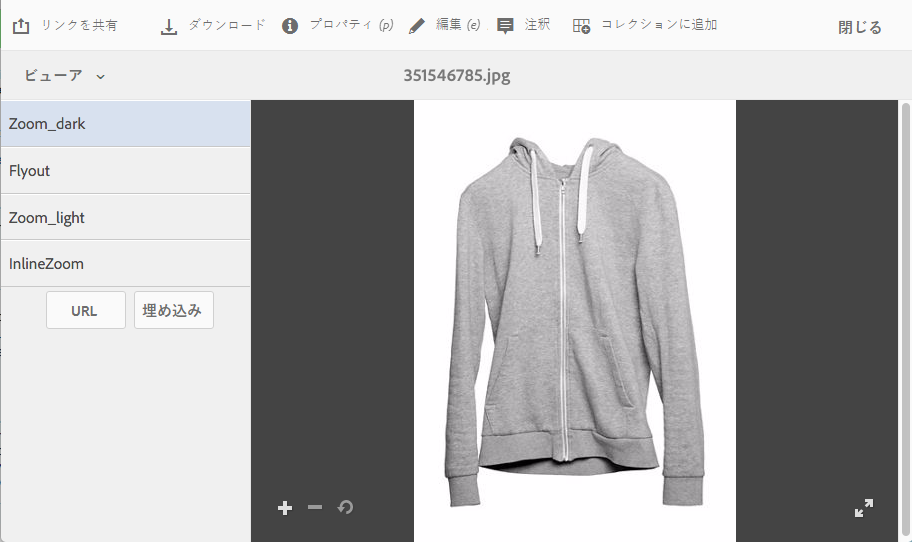

# Dynamic Media ビューアプリセットの適用 {#applying-viewer-presets}

ビューアプリセットは、ユーザーがコンピューターの画面とモバイルデバイスでリッチメディアアセットをどのように表示するかを決定する設定のコレクションです。 管理者が作成したビューアプリセットをアセットに適用できます。

管理者がビューアプリセットの管理、作成、並べ替え、削除を行う必要がある場合は、[ビューアプリセットの管理](managing-viewer-presets.md)を参照してください。

[ビューアプリセットの公開](managing-viewer-presets.md#publishing-viewer-presets)も参照してください。

使用している公開モードに応じて、ビューアプリセットを公開する必要はありません。
ビューアプリセットに関する問題については、[Dynamic Media - Scene7](troubleshoot-dms7.md#viewers)のトラブルシューティングを参照してください。

## アセットへの Dynamic Media ビューアプリセットの適用 {#applying-a-viewer-preset-to-an-asset}

1. アセットを開き、左パネルで「**[!UICONTROL ビューア]**」を選択します。

   

   * 「**[!UICONTROL URL]**」ボタンと「**[!UICONTROL 埋め込み]**」ボタンは、ビューアプリセットの選択後に表示されます。
   * アセットの&#x200B;**[!UICONTROL 詳細表示]**&#x200B;で「ビューア」を選択すると、多数のビューアプリセットが表示されます。 表示されるプリセットの数を増やすことができます。 [表示されるビューアプリセットの数の増減](managing-viewer-presets.md)を参照してください。

1. 左側のウィンドウからビューアを選択してアセットに適用します。結果が右側のウィンドウに表示されます。 [この URL を共有用にコピー](linking-urls-to-yourwebapplication.md)して、他のユーザーと共有することもできます。

## ビューアプリセットの URL の取得 {#obtaining-viewer-preset-urls}

ビューアプリセットの URL を取得する方法については、[Web アプリケーションへの URL のリンク](linking-urls-to-yourwebapplication.md)を参照してください。
