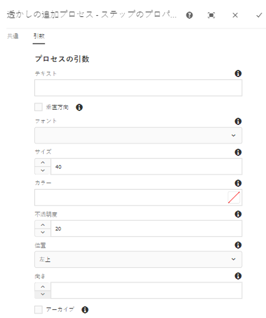

# デジタルアセットの透かし {#watermarking}

[!DNL Adobe Experience Manager Assets] アセットに電子透かしを追加し、アセットの信頼性と著作権の所有権をユーザーが確認できるようにします。 [!DNL Experience Manager Assets] では、PNG および JPEG ファイル上の透かしとしてテキストを使用できます。

To be able to apply watermark on assets, add the watermarking step in the [!UICONTROL DAM Update Asset] workflow.

1. ユーザーイン [!DNL Experience Manager] ターフェイスにアクセスし、ツ **[!UICONTROL ール]** /ワ **[!UICONTROL ークフ]** ロー **[!UICONTROL /モデルに移動]**&#x200B;します。
1. From the **[!UICONTROL Workflow Models]** page, select the **[!UICONTROL DAM Update Asset]** workflow and click **[!UICONTROL Edit]**.

1. From the side panel, drag the **[!UICONTROL Add Watermark]** step to the [!UICONTROL DAM Update Asset] workflow.

   ![透かしステ [!UICONTROL 追加ップをドラッグし] 、 [!UICONTROL DAM Update Assetワークフロー]](assets/add_watermark_step_aem_assets.png)2に追加します。
   *図：透かしステ[!UICONTROL 追加ップをドラッグし]、[!UICONTROL DAM Update Assetワークフローに追加します]。*

   >[!NOTE]
   >
   >Place the [!UICONTROL Add Watermark] step anywhere before the [!UICONTROL Process Thumbnail] step.

1. 「**[!UICONTROL 透かしを追加]**」ステップを開いて、プロパティを表示します。
1. 「**[!UICONTROL 引数]**」タブで、各種フィールド（テキスト、フォントタイプ、サイズ、カラー、位置、向きなど）に有効な値を指定します。変更を確認するには、「完了」をクリ **[!UICONTROL ックしま]**&#x200B;す。

   

   *図：の透かしの追加手順で引数を指定します[!DNL Assets]。*

1. Save the **[!UICONTROL DAM Update Asset]** workflow with the watermark step.
1. From the [!DNL Assets] user interface, upload a sample asset. 透かしがフォントサイズやカラーなどと共に、上記手順で設定した位置に表示されます。
