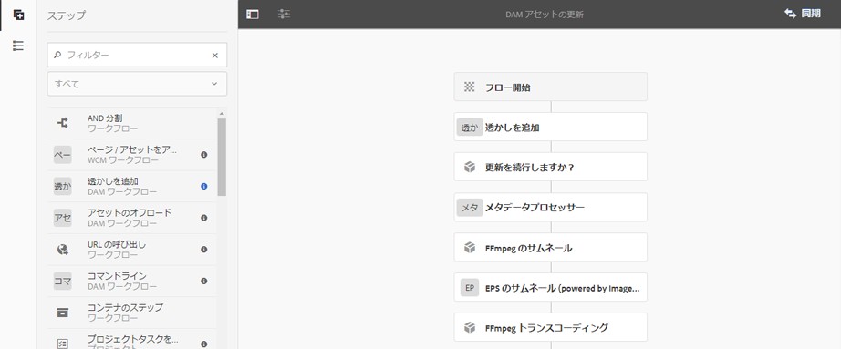

# デジタルアセットの透かし {#watermarking}

Adobe Experience Manager (AEM)Assetsを使用すると、アセットの信頼性と著作権の所有権をユーザーが確認できるように、アセットに電子透かしを追加できます。 AEM Assets では、PNG および JPEG ファイル上の透かしとしてテキストを使用できます。

To be able to apply watermark on assets, add the watermarking step in the [!UICONTROL DAM Update Asset] workflow.

1. AEMユーザーインターフェイスにアクセスし、ツール/ワ **[!UICONTROL ークフ]** ロー **[!UICONTROL /モデ]** ルに移動し **[!UICONTROL ます]**。
1. From the **[!UICONTROL Workflow Models]** page, select the **[!UICONTROL DAM Update Asset]** workflow and click **[!UICONTROL Edit]**.

1. From the side panel, drag the **[!UICONTROL Add Watermark]** step to the [!UICONTROL DAM Update Asset] workflow.

   

   >[!NOTE]
   >
   >Place the [!UICONTROL Add Watermark] step anywhere before the [!UICONTROL Process Thumbnail] step.

1. 「**[!UICONTROL 透かしを追加]**」ステップを開いて、プロパティを表示します。
1. 「**[!UICONTROL 引数]**」タブで、各種フィールド（テキスト、フォントタイプ、サイズ、カラー、位置、向きなど）に有効な値を指定します。変更を確定するために、完了アイコンをタップまたはクリックします。

   

1. Save the **[!UICONTROL DAM Update Asset]** workflow with the watermark step.
1. アセットユーザーインターフェイスから、サンプルアセットをアップロードします。 透かしがフォントサイズやカラーなどと共に、上記手順で設定した位置に表示されます。
