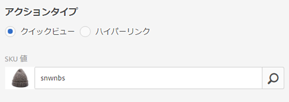
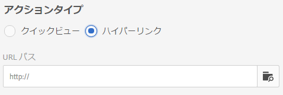

# セレクターを操作する {#working-with-selectors}

インタラクティブ画像、インタラクティブビデオ、カルーセルバナーを操作するときは、アセットを選択し、ホットスポットや画像マップのリンク先となるサイトや商品を選択します。画像セット、スピンセット、マルチメディアセットを操作するときは、アセットセレクターでアセットも選択します。

ここでは、商品、サイト、アセットのセレクターの使用方法について説明し、セレクターでの参照、フィルター処理、ソートの機能についても説明します。

セレクターを使用するのは、カルーセルセットを作成し、ホットスポットと画像マップを追加し、インタラクティブビデオとインタラクティブ画像を作成するときです。

例えば、このカルーセルバナーでは、ホットスポットまたは画像マップをクイックビューページにリンクする場合に、製品セレクターを使用します。ホットスポットまたは画像マップをハイパーリンクにリンクする場合は、サイトセレクターを使用します。スライドを作成する場合は、アセットセレクターを使用します。

ホットスポットまたは画像マップのリンク先を（手動で入力せずに）選択するときに、セレクターを使用します。サイトセレクターを使用できるのは Experience Manager Sites のお客様のみです。商品セレクターには Experience Manager Commerce も必要です。

## 製品セレクターを使用する {#selecting-products}

商品セレクターを使用して商品を選択するのは、ホットスポットまたは画像マップで商品カタログの特定の商品のクイックビューを提供しようとするときです。

1. カルーセルセット、インタラクティブ画像、インタラクティブビデオのいずれかに移動し、「**[!UICONTROL アクション]**」タブ（ホットスポットまたは画像マップを定義した場合のみ使用可能）を選択します。

   製品セレクターは、「**[!UICONTROL アクションタイプ]**」領域にあります。

   

1. **[!UICONTROL 商品セレクター]**&#x200B;アイコン（虫眼鏡）を選択し、カタログで商品に移動します。

   

   キーワードまたはタグでフィルターするには、「**[!UICONTROL フィルター]**」をタップしてキーワードを入力したりタグを選択したりします。

   

   Experience Manager で商品データを参照する場所を変更するには、「**[!UICONTROL 参照]**」をタップして別のフォルダーに移動します。

   

   「**[!UICONTROL ソート順]**」を選択すると、Experience Manager で新しい順に表示するか古い順に表示するかを変更できます。

   

   「**[!UICONTROL 表示形式]**」を選択して、商品の表示形式（**[!UICONTROL リスト表示]**&#x200B;または&#x200B;**[!UICONTROL カード表示]**）を変更します。

   

1. 商品が選択されると、商品のサムネールと名前がフィールドに設定されます。

   

1. **[!UICONTROL プレビュー]**&#x200B;モードでは、ホットスポットまたは画像マップを選択すると、クイックビューの表示内容を確認できます。

   

## サイトセレクターを使用する {#selecting-sites}

ホットスポットまたは画像マップを、Experience Manager Sites で管理する web ページにリンクするには、サイトセレクターを使用して web ページを選択します。

1. カルーセルセット、インタラクティブ画像、インタラクティブビデオのいずれかに移動し、「**[!UICONTROL アクション]**」タブ（ホットスポットまたは画像マップを定義した場合のみ使用可能）を選択します。

   サイトセレクターは、「**[!UICONTROL アクションタイプ]**」領域にあります。

   

1. 「**[!UICONTROL サイトセレクター]**」アイコン（フォルダーと虫眼鏡）を選択して、ホットスポットまたは画像マップのリンク先となる Experience Manager Sites 内のページに移動します。

   

1. サイトが選択されると、そのパスがフィールドに設定されます。

   

1. **[!UICONTROL プレビュー]**&#x200B;モードでは、ホットスポットまたは画像マップを選択すると、指定した Experience Manager サイトのページに移動します。

## アセットセレクターを使用する {#selecting-assets}

このセレクターで、カルーセルバナー、インタラクティブビデオ、画像セット、混在メディアセット、スピンセットで使用する画像を選択します。インタラクティブビデオでは、「**[!UICONTROL コンテンツ]**」タブの「**[!UICONTROL アセットを選択]**」を選択すると、アセットセレクターを使用できます。カルーセルセットでは、スライドを作成するときにアセットセレクターを使用できます。画像セット、混在メディアセット、スピンセットでは、画像セット、混在メディアセット、スピンセットをそれぞれ作成するときに、アセットセレクターを使用できます。

詳しくは、[アセットピッカー](search-assets.md#assetpicker)を参照してください。

1. カルーセルセットに移動して、新しいスライドを作成します。または、インタラクティブビデオに移動して、「**[!UICONTROL コンテンツ]**」タブでアセットを選択します。あるいは、混在メディアセット、画像セット、スピンセットのいずれかを作成します。
1. **[!UICONTROL アセットセレクター]**&#x200B;アイコン（フォルダーと虫眼鏡）を選択し、アセットに移動します。

   

   「**[!UICONTROL フィルター]**」をタップして、キーワードを入力したり条件を追加したりして、キーワードまたはタグでフィルター処理します。

   

   「**[!UICONTROL パス]**」フィールドで別のフォルダーに移動して、Experience Manager がアセットを参照する場所を変更します。

   コレクション内のアセットのみを検索するには、「**[!UICONTROL コレクション]**」を選択します。

   

   「**[!UICONTROL 表示形式]**」を選択して、商品の表示形式（**[!UICONTROL リスト表示]**、**[!UICONTROL 列表示]**、**[!UICONTROL カード表示]**&#x200B;のいずれか）を変更します。

   

1. チェックマークをタップしてアセットを選択します。アセットが表示されます。

   
