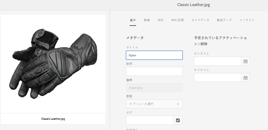
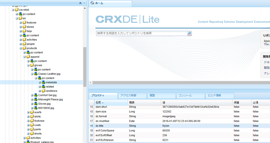
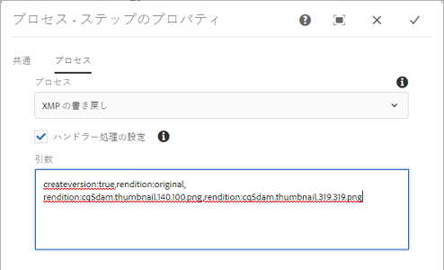

# レンディションへの XMP の書き戻し {#xmp-writeback-to-renditions}

のXMP書き戻し機能は、アセットのメタデータの変更をアセットのレンディションに [!DNL Adobe Experience Manager Assets] 複製します。 When you change the metadata for an asset from within [!DNL Experience Manager Assets] or while uploading the asset, changes are initially stored within the asset node in CRXDe. XMPの書き戻し機能は、アセットのすべてのレンディションまたは特定のレンディションにメタデータの変更を反映します。

「`Classic Leather`」というタイトルのアセットの「[!UICONTROL タイトル]」プロパティを「`Nylon`」に変更するシナリオについて考えます。

In this case, the [!DNL Experience Manager Assets] saves the changes to the **[!UICONTROL Title]** property in the `dc:title` parameter for the asset metadata stored in the asset hierarchy.

However, [!DNL Experience Manager Assets] does not automatically propagate any metadata changes to the renditions of an asset.

XMPの書き戻し機能を使用すると、メタデータの変更をアセットのすべてのレンディションまたは特定のレンディションに反映できます。 ただし、変更はアセット階層の metadata ノード以下には保存されません。代わりに、この機能によって、レンディションのバイナリファイル内に変更内容が埋め込まれます。

## XMP の書き戻しの有効化 {#enabling-xmp-writeback}

アセットのアップロード時にメタデータの変更をアセットのレンディションに反映させるには、設定マネージャーで「**[!UICONTROL Adobe CQ DAM Rendition Maker]**」の設定を変更します。

1. Configuration Manager を開くには、`https://[aem_server]:[port]/system/console/configMgr` にアクセスします。
1. 「**[!UICONTROL Adobe CQ DAM Rendition Maker]**」設定を開きます。
1. **[!UICONTROL Propagate XMP[!UICONTROL **]オプションを選択し、変更を保存します。

   

## 特定のレンディションに対する XMP の書き戻しの有効化 {#enabling-xmp-writeback-for-specific-renditions}

To let the XMP Writeback feature propagate metadata changes to select renditions, specify these renditions to the XMP Writeback Process workflow step of [!UICONTROL DAM Metadata WriteBack] workflow. デフォルトでは、このステップには元のレンディションが設定されています。

XMP の書き戻し機能でメタデータをレンディションサムネール 140.100.png および 319.319.png に反映するには、次の手順を実行します。

1. Experience Managerインターフェイスで、 **[!UICONTROL ツール]** / **[!UICONTROL ワークフロー]** / **[!UICONTROL モデルに移動します]**。
1. モデルページで、「**[!UICONTROL DAM メタデータの書き戻し]**」ワークフローモデルを開きます。
1. **[!UICONTROL DAM メタデータの書き戻し]**&#x200B;ページで、「**[!UICONTROL XMP の書き戻しプロセス]**」ステップを開きます。
1. In the [!UICONTROL Step Properties] dialog box, click the **[!UICONTROL Process]** tab.
1. In the **Arguments** box, add `rendition:cq5dam.thumbnail.140.100.png,rendition:cq5dam.thumbnail.319.319.png`, andd then click **OK**.

   

1. 変更内容を保存します。
1. To regenerate the pyramid TIFF renditions for [!DNL Dynamic Media] images with the new attributes, add the **[!UICONTROL Dynamic Media Process Image Assets]** step to the [!UICONTROL DAM Metadata Writeback] workflow.

   PTIFF レンディションは、Dynamic Media Hybrid 実装でのみ、ローカルで作成および格納されます。

1. ワークフローを保存します。

メタデータの変更がアセットのレンディション thumbnail.140.100.png と thumbnail.319.319.png のみに反映され、他のレンディションには反映されなくなります。

>[!NOTE]
>
>For XMP writeback issues in 64 bit Linux, see [How to enable XMP write-back on 64-bit RedHat Linux](https://helpx.adobe.com/experience-manager/kb/enable-xmp-write-back-64-bit-redhat.html).
>
>For more information about supported platforms, see [XMP metadata write-back prerequisites](/help/sites-deploying/technical-requirements.md#requirements-for-aem-assets-xmp-metadata-write-back).

## XMP メタデータのフィルタリング {#filtering-xmp-metadata}

[!DNL Experience Manager Assets] は、アセットバイナリから読み取られ、アセットが取り込まれる際にJCRに保存されるXMPメタデータのプロパティ/ノードのブロックリストと許可リストの両方のフィルタリングをサポートしています。

ブロックリストを使用してフィルタリングすると、除外用に指定したプロパティを除く、すべてのXMPメタデータプロパティを読み込むことができます。 ただし、膨大な量の XMP メタデータ（例えば、10,000 個のプロパティを持つ 1,000 個のノード）を含む INDD ファイルなどのアセットタイプの場合、フィルタリングするノードの名前が必ずしも事前にわかるわけではありません。ブロックリストを使用してフィルタリングを行うと、多数のXMPメタデータを持つ多数のアセットを読み込める場合、AEMインスタンス/クラスターでは、ログに記録された監視キューなど、安定性の問題が発生する可能性があります。

許可リストを介したXMPメタデータのフィルタリングにより、読み込むXMPプロパティを定義できるので、この問題は解決されます。 この方法では、その他のXMPプロパティや不明なXMPプロパティは無視されます。 下位互換性を確保するために、ブロックリストを使用するフィルターにこれらのプロパティの一部を追加できます。

>[!NOTE]
>
>フィルタリングは、アセットバイナリの XMP ソースから派生したプロパティに対してのみ機能します。EXIF 形式や IPTC 形式などの XMP 以外のソースから派生したプロパティについては、フィルタリングは機能しません。例えば、アセットの作成日は、`CreateDate` という名前のプロパティに EXIF TIFF 形式で格納されています。Experience Managerは、この値をという名前のメタデータフィールドに格納し `exif:DateTimeOriginal`ます。 この場合は XMP 以外のソースなので、このプロパティにはフィルタリングは機能しません。

1. Configuration Manager を開くには、`https://[aem_server]:[port]/system/console/configMgr` にアクセスします。
1. 「**[!UICONTROL Adobe CQ DAM XmpFilter]**」設定を開きます。
1. To apply filtering via an allowed list, select **[!UICONTROL Apply Allowlist to XMP Properties]**, and specify the properties to be imported in the **[!UICONTROL Allowed XML Names for XMP filtering]** box.

   

1. 許可リストを介したフィルタリングを適用した後にブロックされたXMPプロパティをフィルタリングするには、「 **[!UICONTROL Blocked XML Names for XMP filtering]** 」ボックスでプロパティを指定します。

   >[!NOTE]
   >
   >The **[!UICONTROL Apply Blocklist to XMP Properties]** option is selected by default. つまり、ブロックリストを使用したフィルタリングは、デフォルトで有効になっています。 To disable such filtering, deselect the **[!UICONTROL Apply Blocklist to XMP Properties]** option.

1. 変更内容を保存します。
