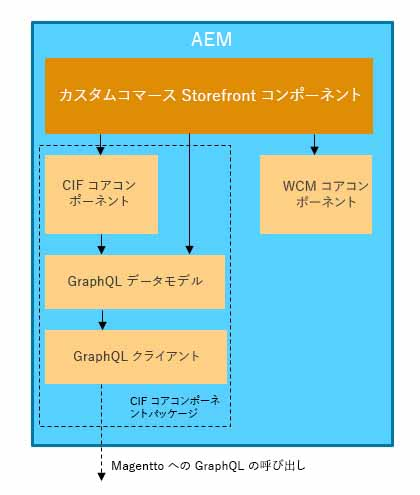

# コマース統合フレームワークを使用したAEMとAdobeのコマース(Magento)の統合{#aem-magento-framework}

Experience ManagerとAdobeコマース(Magento)は、コマース統合フレームワーク(CIF)を使用してシームレスに統合されます。 CIFを使用すると、AEMはAdobeコマースの[GraphQL API](https://devdocs.magento.com/guides/v2.4/graphql/)を使用して、コマースインスタンスに直接アクセスし、通信できます。

## アーキテクチャの概要 {#overview}

全体的なアーキテクチャは次のとおりです。

CIF内では、サーバー側とクライアント側の通信パターンがサポートされます。
サーバー側API呼び出しは、組み込みの汎用[GraphQLクライアント](https://github.com/adobe/commerce-cif-graphql-client)と、コマースGraphQLスキーマ用に生成されたデータモデルの[セット](https://github.com/adobe/commerce-cif-magento-graphql)を組み合わせて使用して実装されます。 また、GraphQL クエリや GQL 形式のミューテーションも使用できます。

[React](https://reactjs.org/) を使用して構築されるクライアントサイドコンポーネントの場合は、[Apollo Client](https://www.apollographql.com/docs/react/) が使用されます。

## AEM CIF コアコンポーネントのアーキテクチャ {#cif-core-components}

[AEM CIFコアコンポー](https://github.com/adobe/aem-core-cif-components) ネントは、 [AEM WCMコアコンポーネント](https://github.com/adobe/aem-core-wcm-components)と同様のデザインパターンとベストプラクティスに従っています。

AEM CIFコアコンポーネントのAdobeコマースとのビジネスロジックおよびバックエンド通信は、Slingモデルに実装されています。 プロジェクト固有の要件を満たすためにこのロジックをカスタマイズする必要がある場合は、Slingモデルの委任パターンを使用できます。

>[!TIP]
>
>[AEM CIF コアコンポーネントのカスタマイズ](../customizing/customize-cif-components.md)ページには、CIF コアコンポーネントのカスタマイズ方法に関する詳細な例とベストプラクティスが記載されています。

プロジェクト内では、AEM CIFコアコンポーネントとカスタムプロジェクトコンポーネントは、Slingのコンテキスト対応設定を使用して、AEMページに関連付けられたAdobeコマースストア用に設定されたクライアントを簡単に取得できます。
