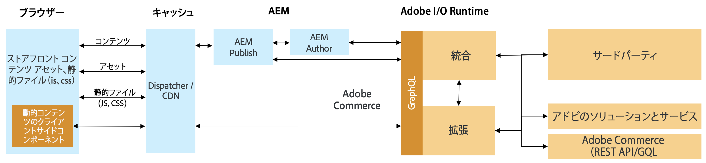

# コマース統合フレームワークを使用したAEMとサードパーティのコマース統合{#aem-third-party}

非Adobeコマースソリューションの統合は、CIFの一般的なシナリオです。 様々なAPIやスキーマを持つサードパーティソリューションは、統合レイヤーを介して接続できます。

## アーキテクチャ {#architecture}

全体的なアーキテクチャは次のとおりです。

この統合レイヤーの目的は、サードパーティのAPIとスキーマを、サポートされるAdobeコマースGraphQL APIとExperience Manager外のスキーマにマッピングすることです。 このカプセル化により、統合のロジックとシステムを、Experience Manager内のコードを変更することなく更新できます。

## 統合のソリューション要件

Experience Managerがデータをオンデマンドで取得するので、製品カタログのリアルタイムAPIが必要です。

>[!TIP]
>
>リアルタイムAPIが使用できない場合は、APIを使用した外部製品キャッシュを統合に使用する必要があります。 例：[Magentoオープンソース](https://magento.com/products/magento-open-source)

完全なGraphQLスキーマを実装する必要はありません。必要なユースケースを有効にするには、スキーマのオブジェクトだけを実装します。

## バックエンドの使用例

CIFは、製品カタログへのリアルタイムアクセスおよびExperience Managerエクスペリエンス管理ツールを使用して製品を拡張します。 このシームレスな統合により、作成者は、必要に応じて、コンテンツのコンテキストを離れることなく、埋め込みUIを使用してコマースデータにアクセスできます。

これらのユースケースのロックを解除するには、製品カタログAPIの統合が必要です。

## フロントエンドの使用例

[AEM CIFコアコンポーネ](https://github.com/adobe/aem-core-cif-components) ントは、CIFでサポートされているAdobeコマースAPIを使用してデータを取得し、交換します。コンポーネントを再利用するには、それぞれのAPIを実装する必要があります。

パフォーマンスに関する重要なクライアント側コンポーネントの推奨事項は、遅延を避けるために、サードパーティのソリューションと直接通信することです。

## 統合の開発{#develop-integration}

統合レイヤーには[Adobe I/O Runtime](https://www.adobe.io/apis/experienceplatform/runtime.html)を使用することをお勧めします。 サードパーティのCIFアドオンに含まれます。 マイクロサービスに似たアプローチと連携するので、簡単に複数のソリューションを統合するのに適しています。

[参照実装](https://github.com/adobe/commerce-cif-graphql-integration-reference)は、コマースソリューションへの統合を構築するための出発点として最適です。 GraphQLをサポートしていますが、RESTなどの他のタイプのAPIと統合することもできます。

この統合レイヤーは、サードパーティのレイヤー（Mulesoftなど）が使用可能な場合や、統合がサードパーティのソリューションの上に構築される場合には必要ありません。
