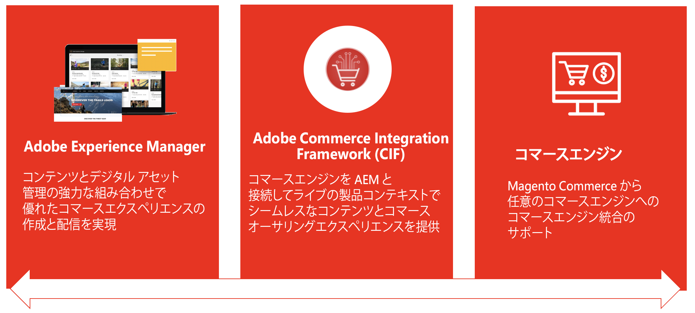
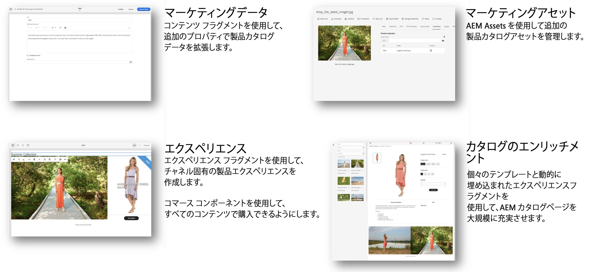

# コンテンツとコマース{#content-commerce}

Adobe Experience Managerのコンテンツとコマースを活用すれば、ブランドはより迅速に拡大・革新を行い、コマース体験を差別化し、加速するオンライン投資を獲得できます。 AEMコンテンツとコマースは、Experience Managerでのイマーシブ、オムニチャネル、パーソナライズされたエクスペリエンスを様々なコマースソリューションと組み合わせて、ショッピングジャーニーのあらゆる部分に差別化されたエクスペリエンスを提供し、価値を引き上げ、高いコンバージョンを推進します。

## コンテンツとコマースが顧客の成功にどのように貢献するか

オンラインコマースのエクスペリエンスに対する顧客の期待が高まる中で、ブランドは、差別化されたエクスペリエンスやより多くのコンテンツをより迅速に提供するように迫られています。 ただし、コンテンツ管理プラットフォームの導入には、カスタムコンポーネントやオーサリングツールなどの基盤的な要素の開発に多大な時間と予算を費やす必要があり、メンテナンスやアップグレードに費用をかけることがよくあります。 Experience Managerサイトオファーコンテンツとコマースは、すぐに使えるコマースコアコンポーネント、オーサリングツール、リファレンスストアフロントを提供するExperience Managerのアドオンモジュールとして提供され、Go Liveの迅速化、チーム間のシームレスなコラボレーションの実現、コンバージョンの促進を実現します。

ブランドは、Adobe Experience Cloudの一部であるAdobeコマースや、選択した任意のコマースエンジンとExperience Managerを統合できます。 Experience Managerコンテンツとコマースでは、ブランドは次のことができます。

* 迅速な拡張と革新
* エクスペリエンスをパーソナライズしてコンバージョンを促進
* 一度作成し、あらゆる場所に公開
* 顧客体験の拡充と差別化
* コマースデータアクセスによるオーサリングの合理化

## AEM Commerce Integration Framework (CIF)の概要{#cif-intro}

これらのプロジェクトでは、コマースソリューションの統合の複雑さに対処する必要があります。 コマースソリューションは、Adobeコマースなどの商用ソリューションから、一連のカスタムコマースサービスに至るまで、あらゆるものにすることができます。 統合は、ユースケースとエコシステムに大きく依存しています。 ふつうはいろんな所にふれ、いろんな味がします。

* 複雑で動的なエコシステムの統合（例：製品カタログ）
* ビジネスは、効率的でコンチネルな方法で、独自のライフサイクルを使用して製品コンテンツを管理する必要がある
* 様々なヘッド向けに複雑でパーソナライズされた買い物ジャーニーを構築
* バックエンドとフロントエンドでの迅速な適応と革新
* 最高のパフォーマンスを実現するために構築された、拡張性の高い安定したE2Eインフラストラクチャの実行(Flashセール、ブラックフライデーなど) これには、統合検索とキャッシュ管理が含まれます。

この複雑さにより、障害発生時点、TCO（総所有コスト）の増加、遅延、価値の向上を実現できます。 このような理由から、Experience ManagerのアドオンであるCommerce Integration Framework(CIF)の開発が進められています。 CIFは、Experience Managerをコマース機能と拡張し、コマースエンジンとの統合を標準化します。 その結果、TCOを削減し、将来の配達確認、安定性、拡張性に優れたソリューションが実現します。 高度なコマースエクスペリエンスを構築するため、機敏なツールとシームレスな統合機能により、技術的およびビジネス的な革新を解放します。

## 2013年以降、CIFがお客様をサポート

200人を超える顧客を抱えるCIFは、コンテンツとコマースを成功に導くための成功の要素として自らを確立しました。 これは、現在および将来のITとビジネスに対する価値を提供します。 最近のお客様向けプロジェクトでは、CIFは「優れたアクセラレーターと非常に時間を節約し、大きな価値を持つ」と説明しています。

## CIF の利点 {#cif-benefits}

CIFは、すぐに使用できるコマースコアコンポーネントを提供し、カスタムコードの必要性を減らし、ブランドのマーケティングに要する時間を短縮します。 すべてのコアコンポーネントは、Adobeのクライアント側のデータレイヤーに追加設定なしで統合され、統合プロファイルなどの顧客プロファイルをハイドレートします。 このプロファイルは、訪問者の行動を詳細にキャプチャします。これを使用して、顧客のジャーニーをリアルタイムで予測し、パーソナライズすることができます。

CIFアドオンは、製品のコンテキストをExperience Managerに組み込み、マーケティング担当者が開発者に頼らずにExperience Managerで買い物かご体験を作成し配信できるようにする、製品コンソールや製品/カテゴリの選択者などのオーサリングツールを提供します。 次のような利点があります。

### エクスペリエンス

AEMの強力なCIFツールを使用すると、コンテンツ作成者は、拡張性と配信にとらわれない方法で、豊富でパーソナライズされたコマースエクスペリエンスを迅速に構築し、ビジネスチャンスをフルに活用できます。

### Time-To-Value(TTV)

[AEMコアコンポーネント](https://www.aemcomponents.dev/)、[AEM Veniaリファレンスストアフロント](https://github.com/adobe/aem-cif-guides-venia)、[AEMプロジェクトのアーキタイプ](https://docs.adobe.com/content/help/ja-JP/experience-manager-core-components/using/developing/archetype/overview.html)、PWAの統合パターン（ヘッドレスコンテンツとコマース）で、プロジェクトの開発を加速します。

CIFは、常に最新のアドオンを備えた継続的な革新を目的として構築されており、お客様は新機能や改善された機能にアクセスできます。

### 統合

[Adobe I/O Runtime](https://www.adobe.io/apis/experienceplatform/runtime.html)、マイクロサービスベースのサーバレスPaaS、[CIFのリファレンス実装](https://github.com/adobe/commerce-cif-graphql-integration-reference)を使用して、エコシステム（例えばコマースソリューション）をExperience Cloudと接続します。

## 実証済みのパターンとベストプラクティス

CIFは、ベストプラクティスに基づいて統合パターンを標準化した顧客をサポートします。 これにより、お客様は現在の成功を享受でき、お客様の成長に合わせて柔軟に対応し、将来の要件に対応できます。

* 発生する可能性のある製品カタログ統合に関する一般的な課題を解消します。 例：
   * カタログの容量や複雑さが増すパフォーマンスの問題
   * ステージデータにアクセスできない
   * 製品のデータとエクスペリエンスをリアルタイムで取得する必要がある
* デジタルの成熟度が高まるにつれ、エクスペリエンス管理が必要になります。 CIFには、ITの手間をかけずに段階的に組み込むことのできる製品体験管理機能が付属しています。
* オムニチャネルの準備完了：CIFは、パターン、アクセラレーター、およびコアコンポーネントを備えた様々なタッチポイントテクノロジー（サーバー側、ハイブリッド、クライアント側）をサポートしています。
