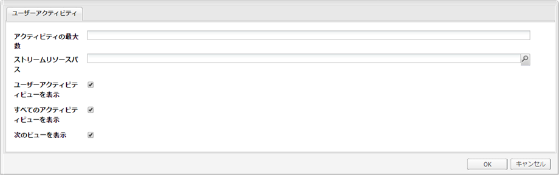
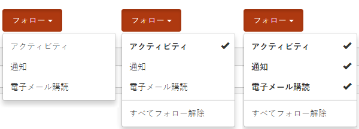

# アクティビティストリーム機能 {#activity-streams-feature}

## 概要 {#introduction}

フォーラムやブログへの投稿など、ログインしたコミュニティメンバーのアクティビティは、`Activity Streams`コンポーネントの設定を通じて、様々な方法でフィルタリングおよび表示できるストリームに収集されます。

コミュニティメンバーが関心のある投稿をフォローしたり、他のコミュニティメンバーのアクティビティをフォローしているときは、フォロー機能によって、アクティビティを別の見方で捉えることができます。

このドキュメントでは、次の内容を説明します。

* AEMサイトへのアクティビティストリームコンポーネントの追加
* アクティビティストリームコンポーネントの構成設定

### アクティビティストリームをページに追加 {#adding-activity-streams-to-a-page}

作成者モードで`Activity Streams`コンポーネントをページに追加する場合は、コンポーネントブラウザーを使用して

* `Communities / Activity Streams`

コンポーネントを探し、ページ上のアクティビティストリームを表示したい位置にドラッグします。

必要な情報については、[Communities Components Basics](/help/communities/basics.md)を参照してください。

[必要なクライアント側ライブラリ](/help/communities/essentials-activities.md#essentials-for-client-side)が含まれる場合、`Activity Streams`コンポーネントは次のように表示されます。

### アクティビティストリームの設定 {#configuring-activity-streams}

アクセスする配置済みの`Activity Streams`コンポーネントを選択し、編集ダイアログを開く`Configure`アイコンを選択します。

「**ユーザーアクティビティ**」タブでは、表示するアクティビティを指定します。

* **アクティビティの最大数**

   表示するアクティビティ数

* **ストリームリソースパス**

   コミュニティサイトまたはコミュニティグループをデフォルトにする場合は、空白のままにします。 ストリームリソースパスは、アクティビティのソースを識別します。 初期設定は空白です。

* **ユーザーアクティビティビューを表示**

   このオプションを選択すると、アクティビティページに、現在のメンバーによってコミュニティ内で生成されたアクティビティに基づいてフィルターがするタブが含まれます。 初期設定はオンです。

* **すべてのアクティビティビューを表示**

   このオプションを選択すると、アクティビティページにタブが含まれ、現在のアクティビティがアクセス権を持つコミュニティ内で生成されたすべてのメンバーが含まれます。 初期設定はオンです。

* **次のビューを表示**

   オンにすると、アクティビティページに、現在のメンバーに基づくフィルターアクティビティがたどっているタブが含まれます。 初期設定はオンです。

### フォロービュー {#following-view}

フォローを有効にするようにコンポーネントを設定する必要があります。次の機能を使用できるのは、[blog](/help/communities/blog-feature.md)、[フォーラム](/help/communities/forum.md)、[QnA](/help/communities/working-with-qna.md)、[カレンダー](/help/communities/calendar.md)、[ファイルライブラリ](/help/communities/file-library.md)、[コメント](/help/communities/comments.md)です。

「**フォロー**」ボタンを使用すると、アクティビティ、[通知](/help/communities/notifications.md)、[購読](/help/communities/subscriptions.md)のエントリをフォローできます。 「**フォロー**」ボタンを選択するたびに、選択のオン/オフを切り替えることができます。 `Email Subscriptions`選択は、設定時にのみ存在します。

フォロー方法が選択されると、ボタンのテキストが「**フォロー中**」に変わります。 便宜上、`Unfollow All`を選択して、すべてのメソッドをオフにすることができます。

「**フォロー**」ボタンが表示されます。

* 別のメンバーのプロファイルを表示するとき。
* フォーラム、QnA、ブログなど、メイン機能ページ。

   * その一般的な機能のすべてのアクティビティに従います。

* フォーラムトピック、QnA質問、ブログ記事など、特定のエントリに対して使用します。

   * 特定のエントリのすべてのアクティビティに従います。

### 追加情報 {#additional-information}

開発者向けの詳細情報は、[アクティビティストリームの基本事項](/help/communities/essentials-activities.md)ページを参照してください。
