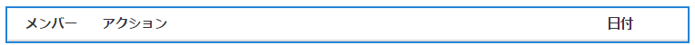

# アクティビティストリーム機能 {#activity-streams-feature}

## はじめに {#introduction}

フォーラムやブログへの投稿など、ログインしたコミュニティメンバーのアクティビティは、の設定を通じて様々な方法でフィルタリングおよび表示されるストリームに収集されます。 `Activity Streams` コンポーネント。

フォローする機能により、コミュニティメンバーが興味のある投稿をフォローしたり、他のコミュニティメンバーのアクティビティをフォローしたりする場合の、アクティビティの別のビューが追加されます。

このドキュメントでは、次の内容について説明します。

* AEM サイトへのアクティビティストリーム コンポーネントの追加
* アクティビティストリームコンポーネントの設定

### ページへのアクティビティストリームの追加 {#adding-activity-streams-to-a-page}

を追加する場合 `Activity Streams` オーサーモードのページにコンポーネントを追加する場合は、コンポーネントブラウザーを使用して次を見つけます

* `Communities / Activity Streams`

そして、アクティビティストリームが表示されるページの上にドラッグします。

詳細については、 [Communities コンポーネントの基本](/help/communities/basics.md).

いつ [必要なクライアントサイドライブラリ](/help/communities/essentials-activities.md#essentials-for-client-side) が含まれる場合、このようにして `Activity Streams` コンポーネントが表示されます。

### アクティビティストリームの設定 {#configuring-activity-streams}

配置されたを選択します。 `Activity Streams` にアクセスして選択できるコンポーネント `Configure` アイコンをクリックします。このアイコンをクリックすると、編集ダイアログが開きます。

の下 **ユーザーアクティビティ** タブで、表示するアクティビティを指定します。

* **アクティビティの最大数**

  表示するアクティビティ数

* **ストリームリソースパス**

  空白のままにすると、デフォルトでコミュニティサイトまたはコミュニティグループに設定されます。 ストリームリソースパスは、アクティビティのソースを識別します。 デフォルトは空白です。

* **ユーザーアクティビティビューを表示**

  オンにした場合、アクティビティ ページにはタブが含まれ、現在のメンバーによってコミュニティ内で生成されたアクティビティに基づいてアクティビティをフィルタリングします。 デフォルトではオンになっています。

* **すべてのアクティビティを表示ビュー**

  オンにすると、アクティビティページにはタブが含まれます。このタブには、現在のメンバーがアクセス権を持つ、コミュニティ内で生成されたすべてのアクティビティが含まれます。 デフォルトではオンになっています。

* **次のビューを表示**

  オンにすると、アクティビティページにはタブが含まれ、現在のメンバーがフォローしているものに基づいてアクティビティがフィルタリングされます。 デフォルトではオンになっています。

### 次のビュー {#following-view}

コンポーネントは、以下を有効にするように設定する必要があります。 次の機能を使用できます [ブログ](/help/communities/blog-feature.md), [フォーラム](/help/communities/forum.md), [QnA](/help/communities/working-with-qna.md), [カレンダー](/help/communities/calendar.md), [ファイルライブラリ](/help/communities/file-library.md)、および [コメント](/help/communities/comments.md).

この **フォロー** ボタンを使用すると、エントリをアクティビティとして追跡できます。 [通知](/help/communities/notifications.md)、または [subscriptions](/help/communities/subscriptions.md). 毎回 **フォロー** ボタンが選択されている場合、選択のオンとオフを切り替えることができます。 この `Email Subscriptions` 選択は、設定されている場合にのみ存在します。

次のいずれかの方法を選択した場合、ボタンのテキストは **次の**. 便宜上、以下を選択できます。 `Unfollow All` すべてのメソッドの表示/非表示を切り替えます。

この **フォロー** ボタンが表示されます。

* 別のメンバーのプロファイルを表示する場合。
* フォーラム、QnA、ブログなどのメイン機能ページ

   * その一般的な機能のすべてのアクティビティに従います。

* フォーラムのトピック、QnA の質問、ブログ記事など、特定のエントリの場合。

   * その特定のエントリのすべてのアクティビティに従います。

### 追加情報 {#additional-information}

詳しくは、 [アクティビティストリームの基本事項](/help/communities/essentials-activities.md) 開発者向けのページです。
