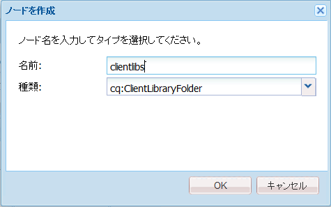
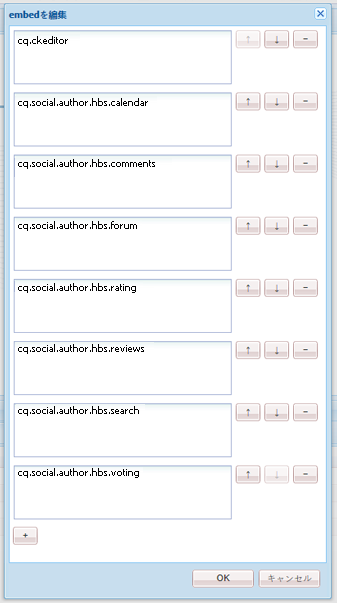
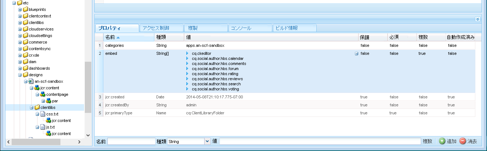
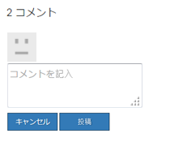
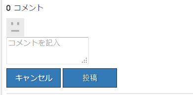

# clientlib の追加 {#add-clientlibs}

## Add a ClientLibraryFolder (clientlibs) {#add-a-clientlibraryfolder-clientlibs}

`clientlibs` という名前の ClientLibraryFolder を作成し、ここに、サイトのページをレンダリングするために使用される JS および CSS を格納します。

このクライアントライブラリに指定する `categories` プロパティの値は、clientlib をコンテンツページから直接含めたり、その他の clientlib に埋め込んだりする場合に使用される識別子です。

1. **CRXDE Liteを使用する場合**、展開します `/etc/designs`

1. 右クリックし `an-scf-sandbox` て「 `Create Node`

   * 名前：`clientlibs`
   * 型：`cq:ClientLibraryFolder`

1. 「**OK**」をクリックします。



新しい **ノードの「**&#x200B;プロパティ`clientlibs`」タブで、**categories** プロパティを入力します。

* 名前：**categories**
* タイプ：**String**
* 値：**apps.an-scf-sandbox**
* Click **Add**
* Click **Save All**

注意：categories 値の前に「apps.」を付けるのは、「所有アプリケーション」が /libs ではなく、/apps フォルダー内にあることを示すための規則です。重要：プ追加レースホルダー `js.tx`tと **`css.txt`** ファイル （正式には、cq:ClientLibraryFolderが存在しない場合は除きます）。

1. Right-click **`/etc/designs/an-scf-sandbox/clientlibs`**
1. Select **Create File...**
1. Enter **Name:** `css.txt`
1. Select **Create File...**
1. Enter **Name:** `js.txt`
1. Click **Save All**


css.txt および js.txt の最初の行によって、後述のファイルのリストが見つかる基本の場所が特定されます。

css.txt の内容を次のように設定します。

```
#base=.
 style.css
```

次に、clientlibsにstyle.cssという名前のファイルを作成し、内容を

`body {`

`background-color: #b0c4de;`

`}`

### SCF clientlib の埋め込み {#embed-scf-clientlibs}

**ノードの「**&#x200B;プロパティ`clientlibs`」タブで、複数値の String プロパティ **embed** を入力します。This embeds the necessary [client-side libraries (clientlibs) for SCF components](/help/communities/client-customize.md#clientlibs-for-scf). このチュートリアルでは、Communitiesコンポーネントに必要なclientlibの多くが追加されます。

ページごとにダウンロードされる clientlib の利点とサイズ／スピードに関する考慮事項があるので、このアプローチが実稼動サイトでの使用に適している場合もあれば、そうでない場合もある点に&#x200B;**注意してください**。

1つのページで1つの機能しか使用しない場合は、その機能の完全なclientlibを直接ページに含めることができます。例えば、

`% ui:includeClientLib categories=cq.social.hbs.forum" %`

この場合は、すべてを含め、より基本的なSCFクライアントライブラリを作成者のclientlibとして扱うことをお勧めします。

* 名前：**`embed`**
* 型：**`String`**
* クリック **`Multi`**
* 値：**`cq.social.scf`**

   * It will pop up a dialog,
click **`+`** after each entry to add the following clientlib categories:

      * **`cq.ckeditor`**
      * **`cq.social.author.hbs.comments`**
      * **`cq.social.author.hbs.forum`**
      * **`cq.social.author.hbs.rating`**
      * **`cq.social.author.hbs.reviews`**
      * **`cq.social.author.hbs.voting`**
      * 「**OK**」をクリックします。

* Click **Save All**



This is how `/etc/designs/an-scf-sandbox/clientlibs` should now appear in the repository :



### playpage テンプレートに clientlibs を含める {#include-clientlibs-in-playpage-template}

Without including the `apps.an-scf-sandbox` ClientLibraryFolder category on the page, the SCF components will not be functional nor styled as the necessary Javascript(s) and style(s) will not be available.

例えば、clientlibs を挿入しなかった場合、SCF コメントコンポーネントは、スタイルが設定されていない状態で表示されます。



apps.an-scf-sandbox clientlibs を含めると、SCF コメントコンポーネントは、スタイルが設定された状態で表示されます。



The include statement belongs in the `head` section of the `html` script. The default **`foundation head.jsp`** includes a script that can be overlaid : **`headlibs.jsp`**.

**headlibs.jsp をコピーし、clientlibs を含めます。**

1. Using **CRXDE Lite**, select **`/libs/foundation/components/page/headlibs.jsp`**

1. 右クリックして「 **コピー** 」を選択します（または、ツールバーから「コピー」を選択します）。
1.  **`/apps/an-scf-sandbox/components/playpage`**
1. 右クリックして「 **貼り付け** 」を選択します（または、ツールバーから「貼り付け」を選択します）。
1. 重複をクリック **`headlibs.jsp`** して開きます
1. ファイルの末尾に次の行を追加します。
   **`<ui:includeClientLib categories="apps.an-scf-sandbox"/>`**

1. Click **Save All**

```xml
<%@ page session="false" %><%
%><%@include file="/libs/foundation/global.jsp" %><%
%><ui:includeClientLib categories="cq.foundation-main"/><%
%>
<cq:include script="/libs/cq/cloudserviceconfigs/components/servicelibs/servicelibs.jsp"/>
<% currentDesign.writeCssIncludes(pageContext); %>
<ui:includeClientLib categories="apps.an-scf-sandbox"/>
```

Web サイトをブラウザーに読み込み、背景が青の網掛けでないかどうかを確認します。

[https://localhost:4502/content/an-scf-sandbox/en/play.html](https://localhost:4502/content/an-scf-sandbox/en/play.html)


### これまでの作業内容の保存 {#saving-your-work-so-far}

この時点では、最小限のサンドボックスが存在し、再生中にリポジトリが破損し、開始し直したい場合に、サーバーのオフ、crx-quickstart/フォルダーの名前の変更や削除、サーバーのオン、アップロード、インストールを行う際に、最も基本的な手順を繰り返す必要がない。

すぐに操作してみたい場合は、[サンプルページの作成](/help/communities/create-sample-page.md)チュートリアルにこのパッケージがあります。

パッケージを作成するには：

* From CRXDE Lite click the [Package icon](https://localhost:4502/crx/packmgr/)
* Click **Create Package**

   * パッケージ名：an-scf-sandbox-minimal-pkg
   * バージョン：0.1
   * グループ: `leave as default`
   * 「**OK**」をクリックします。

* 「**編集**」をクリックします。

   * Select **Filters** tab

      * Click **Add filter**
      * Root Path: browse to `/apps/an-scf-sandbox`
      * Click **Done**
      * Click **Add filter**
      * Root Path: browse to `/etc/designs/an-scf-sandbox`
      * Click **Done**
      * Click **Add filter**
      * Root Path: browse to `/content/an-scf-sandbox**`
      * Click **Done**
   * 「**保存**」をクリックします。


* Click **Build**

Now you can select **Download** to save it to disk and **Upload Package** elsewhere, as well as select **More > Replicate** in order to push the sandbox to a localhost publish instance to expand the realm of your sandbox.