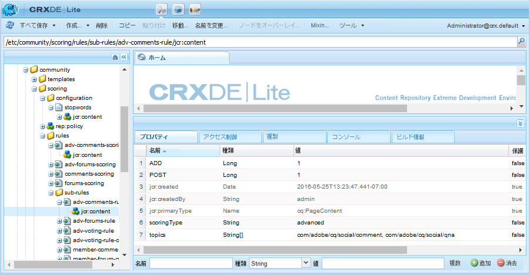

# 高度なスコアとバッジ{#advanced-scoring-and-badges}

## 概要 {#overview}

高度なスコアを使用すると、メンバーをエキスパートとして識別するバッジを授与できます。高度スコアリングは、メンバーが作成したコンテンツの数量&#x200B;*と*&#x200B;に基づいてポイントを割り当てますが、基本スコアリングは、作成したコンテンツの数量に基づいてポイントを割り当てます。

この違いは、スコアの計算に使用されるスコアエンジンによるものです。基本スコアリングエンジンは、単純な計算を適用します。 高度なスコアリングエンジンは、トピックの自然言語処理(NLP)を通じて導き出された、価値の高い関連コンテンツに貢献するアクティブメンバーに報酬を与えるアダプティブアルゴリズムです。

このスコアアルゴリズムでは、コンテンツの関連度に加え、投票や回答の割合など、メンバーのアクティビティが考慮されます。基本的なスコアリングには定量的なものが含まれますが、高度なスコアリングではアルゴリズム的に使用します。

したがって、高度なスコアエンジンの分析を意味あるものにするには、十分なデータが必要です。エキスパートになるための達成のしきい値は、作成されたコンテンツの量と品質にアルゴリズムが継続的に調整されるので、常に再評価されます。 メンバーの古い投稿の&#x200B;*decay*&#x200B;という概念もあります。 エキスパートメンバーが、エキスパートのステータスを得たサブジェクトの参加を停止した場合、事前に決められた時点で（[スコアリングエンジン設定](#configurable-scoring-engine)を参照）、エキスパートとしてのステータスを失う可能性があります。

高度なスコアの設定方法は、基本スコアとほとんど同じです。

* 基本的なスコアおよび高度なスコアおよびバッジルールは、同様に、コンテンツ](/help/communities/implementing-scoring.md#apply-rules-to-content)にも[適用されます。

   * 基本的なスコアおよび高度なスコアおよびバッジルールは、同じコンテンツに適用できます。

* [コンポー](/help/communities/implementing-scoring.md#enable-badges-for-component) ネントのバッジを有効にするのは汎用です。

スコアルールおよびバッジルールの設定では、以下の点が異なります。

* 設定可能な高度なスコアリングエンジン
* 高度なスコアリングルール：

   * `scoringType` を `advanced` に設定
   * 次を必要とする `stopwords`

* 高度なバッジルール：

   * `badgingType` を `advanced` に設定
   * `badgingLevels`**を授与するエキスパートレベルの数に設定**
   * しきい値配列マッピングポイントをバッジにマッピングする代わりに、`badgingPaths`配列のバッジが必要です。

>[!NOTE]
>
>高度なスコアリング機能とバッジング機能を使用するには、[エキスパートIDパッケージ](https://www.adobeaemcloud.com/content/marketplace/marketplaceProxy.html?packagePath=/content/companies/public/adobe/packages/cq640/social/cq-social-expert-identification-pkg)をインストールします。

## 設定可能なスコアエンジン {#configurable-scoring-engine}

この高度なスコアエンジンには OSGi 設定が用意されており、パラメーターを設定して高度なスコアアルゴリズムを調整できます。

* **スコア重み付け**

   特定のトピックについて、スコア計算時に最も高い優先度を与える動詞を指定します。1つ以上のトピックを入力できますが、トピック&#x200B;**ごとに**&#x200B;動詞が1つに限られます。 [トピックと動詞](/help/communities/implementing-scoring.md#topics-and-verbs)を参照してください。
コンマをエスケープして`topic,verb`と入力します。 次に例を示します。
   `/social/forum/hbs/social/forum\,ADD`
デフォルトは、QnAおよびフォーラムコンポーネント追加の動詞に設定されます。

* **スコアリング範囲**

   高度なスコアの範囲は、この値（可能な最大スコア）と0（可能な最小スコア）で定義されます。

   デフォルト値は 100 であり、スコア範囲は 0 ～ 100 となります。

* **エンティティ減衰時間間隔**

   このパラメーターは、すべてのエンティティスコアが計算されなくなった時間数を表します。 これは、コミュニティサイト上にある古いコンテンツをスコアに含めないようにするために必要な設定です。

   デフォルト値は 216000 時間（約 24 年）です。

* **スコアの増加**
率：0 ～スコアの範囲でスコアを指定します。この範囲を超えると、成長の速度が低下し、エキスパートの数が制限されます。

   デフォルト値は 50 です。

## 高度なスコアルール {#advanced-scoring-rules}

基本スコアでは、バッジ獲得に必要な量はあらかじめ決まっています。

高度なスコアでは、システム内の上質なデータの量に基づいて、バッジ獲得に必要な量が継続的に調整されます。スコアリングは、ベルカーブと同じ方法で連続的に計算されます。

会員が、もはや活動していないトピックに関するエキスパートバッジを獲得した場合、時間の経過と共に減衰するためにバッジを失う可能性があります。

### scoringType {#scoringtype}

スコアルールは、スコアサブルールの集まりです。各サブルールは、それぞれ `scoringType` を宣言します。

高度なスコアエンジンを呼び出すには、`scoringType` を `advanced` に設定する必要があります。

[スコアサブルール](/help/communities/implementing-scoring.md#scoring-sub-rules)を参照してください。

### ストップワード{#stopwords}

高度なスコアパッケージでは、ストップワードファイルを含む設定フォルダーがインストールされます。

* `/libs/settings/community/scoring/configuration/stopwords`

高度なスコアのアルゴリズムは、ストップワードファイルに含まれる単語のリストに基づいて、コンテンツ処理中に無視して構わない一般的な英単語を識別します。

このファイルが変更されることはありません。

ストップワードファイルが存在しない場合は、スコアエンジンによりエラーがスローされます。

## 高度なバッジルール  {#advanced-badging-rules}

高度なバッジルールのプロパティは、[基本バッジルールのプロパティ](/help/communities/implementing-scoring.md#badging-rules)とは異なります。

ポイントとバッジ画像を関連付ける必要はなく、許可するエキスパートの数と、授与するバッジ画像を指定するだけで十分です。

<table>
 <tbody>
  <tr>
   <th>プロパティ</th>
   <th>型</th>
   <th>値 説明</th>
  </tr>
  <tr>
   <td>badgingPath</td>
   <td>String[]</td>
   <td><em>（必須）</em> バッジ画像の複数値の文字列。badgingLevelsの数まで対応します。バッジ画像のパスを指定するときは、最も高いレベルのエキスパートに授与するものを最初に指定する必要があります。badgingLevels で指定された値よりもバッジの数が少ない場合、足りない部分には配列内の最終要素のバッジが使用されます。入力例：  <code>/libs/settings/community/badging/images/expert-badge/jcr:content/expert.png</code></td>
  </tr>
  <tr>
   <td>badgingLevels</td>
   <td>Long</td>
   <td><em>（オプション）</em> 与える専門知識のレベルを指定します。例えば、<code>expert </code>と<code>almost expert</code> （2つのバッジ）がある場合、値は2に設定する必要があります。 badgingLevelは、badgingPathプロパティに対してリストされているエキスパート関連のバッジ画像の数に対応する必要があります。 初期設定は 1 です。</td>
  </tr>
  <tr>
   <td>badgingType</td>
   <td>String</td>
   <td><em>（必須）</em> スコアリングエンジンを「基本」または「詳細」として識別します。"advanced"に設定されている場合、デフォルトは"basic"です。</td>
  </tr>
  <tr>
   <td>scoringRules</td>
   <td>String[]</td>
   <td><em>（オプション）</em> バッジルールを、リストに表示されたスコアリングルールで識別されるスコアリングイベントに制限する複数値の文字列。  例のエントリ：  <code>/libs/settings/community/scoring/rules/adv-comments-scoring</code>  デフォルトは制限なし。</td>
  </tr>
 </tbody>
</table>

## このリリースに含まれるルールとバッジ {#included-rules-and-badge}

### このリリースに含まれるバッジ {#included-badge}

このベータリリースには、以下の報奨ベースのエキスパートバッジが含まれています。

* `expert`

   `/libs/settings/community/badging/images/expert-badge/jcr:content/expert.png`

エキスパートバッジがアクティビティへのご褒美として表示されるように、以下を確認します。

* `Badges` は、フォーラムやQnAコンポーネントなどの機能に対して有効になっています。

* 高度なスコアリングルールとバッジルールは、コンポーネントが配置されているページ（または親）に適用されます

次の基本情報を参照してください。

* [コンポーネントのバッジングの有効化](/help/communities/implementing-scoring.md#enableforcomponent)
* [ルールの適用](/help/communities/implementing-scoring.md#applytopage)

### このリリースに含まれているスコアルールとサブルール {#included-scoring-rules-and-sub-rules}

ベータ版リリースには、[フォーラム関数](/help/communities/functions.md#forum-function)の2つの高度なスコアリングルールが含まれています（各フォーラム関数用のルールと、フォーラム機能のコメントコンポーネント用のルール）。

1. `/libs/settings/community/scoring/rules/adv-comments-scoring`

   * `subRules[] =
/libs/settings/community/scoring/rules/sub-rules/adv-comments-rule
/libs/settings/community/scoring/rules/sub-rules/adv-voting-rule-owner
/libs/settings/community/scoring/rules/sub-rules/adv-voting-rule`

1. `/libs/settings/community/scoring/rules/adv-forums-scoring`

   * `subRules[] =
/libs/settings/community/scoring/rules/sub-rules/adv-forums-rule
/libs/settings/community/scoring/rules/sub-rules/adv-comments-rule
/libs/settings/community/scoring/rules/sub-rules/adv-voting-rule-owner`

**備考:**

* `rules`ノードと`sub-rules`ノードの両方が`cq:Page`型です。

* `subRules` は、ルールの[] ノード上の `jcr:content` String型の属性です。

* `sub-rules` は、様々なスコアリングルール間で共有できます。

* `rules` は、全員に対して読み取り権限を持つリポジトリの場所に配置する必要があります。

* ルール名は、場所に関係なく一意にする必要があります。

### このリリースに含まれるバッジルール {#included-badging-rules}

このリリースには、[アドバンスフォーラムとコメントスコアルール](#included-scoring-rules-and-sub-rules)に対応する2つのアドバンスバッジルールが含まれています。

* `/libs/settings/community/badging/rules/adv-comments-badging`
* `/libs/settings/community/badging/rules/adv-forums-badging`

**備考:**

* `rules` ノードのタイプはcq:Pageです。
* `rules` は、全員に対して読み取り権限を持つリポジトリの場所に配置する必要があります。
* ルール名は、場所に関係なく一意にする必要があります。

