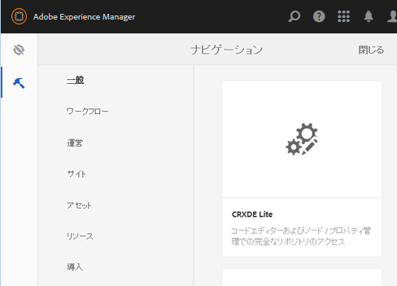
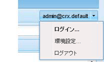

# SCF サンドボックスの作成   {#create-an-scf-sandbox}

AEM 6.1 Communities 以降では、サンドボックスをすばやく作成するのに最も簡単な方法は、コミュニティサイトを作成することです。[AEM Communitiesの使い始めに](getting-started.md)を参照してください。

開発者にとっても役に立つツールは、[コミュニティコンポーネントガイド](components-guide.md)です。コミュニティのコンポーネントや機能の調査と迅速なプロトタイプを可能にします。

Webサイトの作成の演習は、Communitiesの機能を含むAEM Webサイトの構造を理解するのに役立ちます。また、[ソーシャルコンポーネントフレームワーク(SCF)](scf.md)の操作を調査する簡単なページも提供します。

このチュートリアルは、AEM の知識がなく、SCF コンポーネントの使用に興味を持っている開発者を主な対象としています。手順に従いながら SCF サンドボックスサイトの作成を進めることができます[How to Create a Fully Featured Internet Webサイト](../../help/sites-developing/website.md) （ナビゲーション、ロゴ、検索、ツールバー、子ページのリスト表示など、サイト構造に重点を置いた方法）のチュートリアルに似ています。

オーサーインスタンスで開発を行い、パブリッシュインスタンスでサイトを試してみるのがベストです。

このチュートリアルは次の手順で構成されています。

* [Web サイト構造のセットアップ](setup-website.md)
* [初期サンドボックスアプリケーション](initial-app.md)
* [初期サンドボックスコンテンツ](initial-content.md)
* [サンドボックスアプリケーションの開発](develop-app.md)
* [clientlib の追加](add-clientlibs.md)
* [サンドボックスコンテンツの開発](develop-content.md)

>[!CAUTION]
>
>このチュートリアルでは、[コミュニティサイトコンソール](sites-console.md)を使用して作成するような機能を持つコミュニティサイトは作成しません。例えば、このチュートリアルでは、ログイン、自己登録、[ソーシャルログイン](social-login.md)、メッセージ、プロファイルなどの設定方法については説明しません。
>
>単純なコミュニティサイトが必要な場合は、[サンプルページの作成](create-sample-page.md)のチュートリアルに従ってください。

## 前提条件 {#prerequisites}

このチュートリアルでは、[最新リリース](deploy-communities.md#latest-releases)の Communities を備えた 1 つの AEM オーサーと 1 つの AEM パブリッシュインスタンスがインストールされていることを前提としています。

次に、AEM プラットフォームを初めて使用する開発者にとって役立つリンクをいくつか紹介します。

* [はじめに](../../help/sites-deploying/deploy.md#getting-started):aemインスタンスをデプロイする場合。

   * [基本事項](../../help/sites-developing/the-basics.md):を参照してください。
   * [作成者の最初の手順](../../help/sites-authoring/first-steps.md):」をクリックします。

## CRXDE Lite 開発環境の使用 {#using-crxde-lite-development-environment}

AEM 開発者は、オーサーインスタンス上の [CRXDE Lite](../../help/sites-developing/developing-with-crxde-lite.md) 開発環境で多くの時間を費やすことになります。CRXDE Liteは、CRXリポジトリへのアクセスに制限が少ない。 従来のUIツールとタッチ対応のUIコンソールは、CRXリポジトリの特定の部分に対して、より構造化されたアクセスを提供します。

管理者権限でサインインした後、さまざまな方法で CRXDE Lite にアクセスできます。

1. グローバルナビゲーションから、ナビゲーション&#x200B;**[!UICONTROL ツール/CRXDE Lite]**&#x200B;を選択します。

   

2. [従来のUIのようこそページ](http://localhost:4502/welcome.html)から下にスクロールし、右側のパネルの&#x200B;**[!UICONTROL CRXDE Lite]**&#x200B;をクリックします。

   

3. 直接`CRXDE Lite`を参照：`<server>:<port>/crx/de`

   ローカルのオーサーインスタンス上にある場合の例：[http://localhost:4502/crx/de](http://localhost:4502/crx/de)

CRXDE Lite を使用するには、開発者または管理者権限でサインインする必要があります。デフォルトのlocalhostインスタンスの場合、

* `username: admin`
* `password: admin`

**このログインがタイムアウトにな** り、CRXDe Liteツールバーの右端にあるプルダウンを使用して定期的に再ログインする必要があることに注意してください。

ログインしていない状態では、JCR リポジトリをナビゲートしたり、編集／保存操作を実行したりすることはできません。

******&#x200B;疑わしい場合は、ログインし直してください。

