# コミュニティ機能のための Analytics の設定 {#analytics-configuration-for-communities-features}

## 概要 {#overview}

Adobe Analytics と Adobe Experience Manager（AEM）は、どちらも Adobe Marketing Cloud のソリューションです。

Adobe Analytics を AEM Communities と連携させ、サポートされるコミュニティ機能をメンバーが操作した際にイベントが Adobe Analytics に送信され、レポートが生成されるように設定することができます。

例えば、イネーブルメントコミュニティサイトのメンバーが自分に割り当てられているビデオリソースを再生すると、リソースプレイヤーによって、イベント（ビデオハートビートのデータを含む）が自動的に Analytics に送信されます。コミュニティサイトから、管理者はビデオの再生に関する様々なレポートを表示できます。

さらに、Analytics は以下の処理のために必要です。

* パブリッシュ環境では、次の操作を実行します。

   * コミュニティ[トレンド](/help/communities/trends.md)のレポート
   * サイト訪問者に対し、「最も多く閲覧された」、「最もアクティブ」、「最も「いいね！」が多い」で並べ替えを許可する
   * UGCリストの表示回数

* オーサー環境では、次の操作を実行します。

   * [メンバー管理コンソール](/help/communities/members.md)での参加データの表示（閲覧、投稿、フォロー、「いいね！」）
   * トレンドの概要、イネーブルメントリソース[レポート](/help/communities/reports.md)のビデオハートビートおよびビデオデバイス

サポートされるコミュニティ機能は以下のとおりです。

* [イネーブルメントリソース](/help/communities/resources.md)
* [フォーラム](/help/communities/forum.md)
* [Q&amp;A](/help/communities/working-with-qna.md)
* [ブログ](/help/communities/blog-feature.md)
* [ファイルライブラリ](/help/communities/file-library.md)
* [Calendar](/help/communities/calendar.md)

ドキュメントのこのセクションでは、Analytics のレポートスイートとコミュニティ機能を接続する方法について説明します。基本的な手順は以下のとおりです。

1. すべての AEM インスタンス上で暗号化や復号化が正しく実行されるよう、[暗号鍵をレプリケート](#replicate-the-crypto-key)する
1. Adobe Analytics の[レポートスイート](#adobe-analytics-report-suite-for-video-reporting)を準備する
1. AEM Analytics [クラウドサービス](#aem-analytics-cloud-service-configuration)と[フレームワーク](#aem-analytics-framework-configuration)を作成する

1. [コミュニティ](#enable-analytics-for-a-community-site) サイトでのAnalyticsの有効化
1. Analytics と AEM 変数との間のマッピングを&#x200B;[**検証**](#verify-analytics-to-aem-variable-mapping)&#x200B;する
1. [プライマリパブリッシャー](#primary-publisher)を識別します。
1. [](#publish-community-site-and-analytics-cloud-service) コミュニティサイトの公開
1. Adobe Analyticsからコミュニティサイトへの[レポートデータ](#obtaining-reports-from-analytics)のインポートを設定します

## 前提条件 {#prerequisites}

Analytics をコミュニティ機能と連携するよう設定するには、アカウント担当者と協力して Adobe Analytics アカウントと[レポートスイート](#adobe-analytics-report-suite-for-video-reporting)をセットアップする必要があります。確立後は、次の情報を使用できるようになります。

* **name**

   Adobe Analyticsアカウントに関連付けられている会社。

* **User Name**

   Analyticsアカウントを管理する権限を持つユーザーのログインユーザー名
（Webサービスアクセス権限を含む）。

* **パスワード**

   認証済みユーザーのログインパスワード。

* **Analyticsデータセンター**

   アカウントのAnalyticsデータセンターのURL。

* **レポートスイート**

   使用する Analytics レポートスイートの名前。

## Adobe Analytics Report Suite for Video Reporting {#adobe-analytics-report-suite-for-video-reporting}

Adobe Marketing Cloudの[Report Suite Manager](https://docs.adobe.com/content/help/en/analytics/admin/manage-report-suites/new-report-suite/new-report-suite.html)を使用して、コミュニティサイトでコミュニティ機能のレポートを提供できるようにAnalyticsレポートスイートを設定できます。

[Adobe Experience Cloud](https://docs.adobe.com/content/help/en/analytics/analyze/analysis-workspace/home.html)に[会社名とユーザー名](/help/communities/analytics.md#prerequisites)でサインインすると、以下を含む新しいレポートスイートや既存のレポートスイートを設定できます。

* [11コンバージョン変数](https://docs.adobe.com/content/help/en/analytics/admin/admin-tools/conversion-variables/conversion-var-admin.html) (eVar)

   * **`evar1`** 有効な **`evar11`** 方法

   * 既存のeVarを再利用（名前変更）したり、新しいeVarを作成してコミュニティ機能に使用したりできます。

* [7 個の成功イベント](https://docs.adobe.com/content/help/en/analytics/admin/admin-tools/success-events/success-event.html)（event）

   * **`event1`** 有効な **`event7`** 方法

   * type **`Counter`**

      * **string not required****`Counter (no subrelations)`**
   * 既存のイベントを再利用（名前変更）したり、コミュニティ機能で使用する新しいイベントを作成できます。


* [ビデオ管理](https://docs.adobe.com/content/help/en/media-analytics/using/media-overview.html)

   * ビデオレポートコンソール

      * Enable `Video Core`
      * 「保存」を選択します。
   * ビデオコア測定コンソール

      *  `Use Solution Variables`
      * 「保存」を選択します。


**新しいレポートスイート**&#x200B;を使用する場合、新しいレポートスイートには、4 個の evar と 6 個の event 変数しかないことに注意してください。コミュニティサイトでは 11 個の ever と 7 個の event 変数が必要です。

**既存のレポートスイート**&#x200B;を使用する場合は、コミュニティサイト用の Analytics フレームワークをアクティベートする前に、[変数マッピングを変更](#modifying-analytics-variable-mapping)する必要があります。

コミュニティ専用の変数に関するご不明な点は、アカウント担当者にお問い合わせください。

>[!CAUTION]
>
>**以下の範囲内の変数を使用している既存のレポートスイートを使用する場合は、**
>
>* **`evar1`** から **`evar11`** まで
   >
   >
* **`event1`** から **`event7`** まで
>
>
**その後、コミュニティサイトが公開される前に、** コミュニティサイトに対してAnalyticsが有効になっている場合に、自動的にマッピングされたAEM変数をAnalytics変数に移動して、既存のマッピングを復元することが重要です。
>
>既存のマッピングを復元し、AEM変数を他のAnalytics変数に移動するには、[Analytics変数のマッピングの変更](#modifying-analytics-variable-mapping)の節を参照してください。
>
>この作業をしておかないと、修復不可能なデータ損傷が発生することがあります。

### Video Heartbeat Analytics  {#video-heartbeat-analytics}

Video Heartbeat Analyticsのライセンスを取得すると、`Marketing Cloud Org Id`が割り当てられます。

[ビデオレポート用にAnalyticsレポートスイートを設定した後にビデオハートビートレポートを有効にするには、次の手順を実行します。](#adobe-analytics-report-suite-for-video-reporting)

* [Analyticsクラウドサービス](#aem-analytics-cloud-service-configuration)を作成します。
* コミュニティサイトの[Analyticsを有効にする](#enable-analytics-for-a-community-site)
* `Marketing Cloud Org Id`をコミュニティサイトに関連付けます。

`Marketing Cloud Org Id`は、[コミュニティサイトの作成時](/help/communities/sites-console.md#enablement)以降に、[コミュニティサイトのプロパティを変更](/help/communities/sites-console.md#modifying-site-properties)することで入力できます。[](#aem-analytics-cloud-service-configuration)

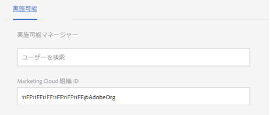

ビデオハートビート分析が有効な場合、ビデオプレーヤーのJavaScript(JS)コードがビデオハートビートライブラリコード（JSも含む）をインスタンス化し、10秒ごと（設定不可）にビデオステータスの更新を送信し、最終的にビデオセッションの累積レポートをメインAnalyticsサーバーに送信します。

有効にしない場合、Video Heartbeat コードはインスタンス化されず、ビデオの再生状況と再開位置の追跡のみが報告のために SRP に維持されます。

## AEM Analytics クラウドサービス設定  {#aem-analytics-cloud-service-configuration}

オーサーインスタンスの標準UIを使用してAdobe AnalyticsとAEMコミュニティサイトを統合する、新しいAnalytics統合を作成するには：

* グローバルナビゲーションから：**[!UICONTROL ツール]** > **[!UICONTROL デプロイ]** > **[!UICONTROL Cloud Services]**
* **[!UICONTROL Adobe Analytics]**&#x200B;までスクロールします。
* 「**[!UICONTROL 今すぐ設定]**」または「**[!UICONTROL 設定を表示]**」を選択します。

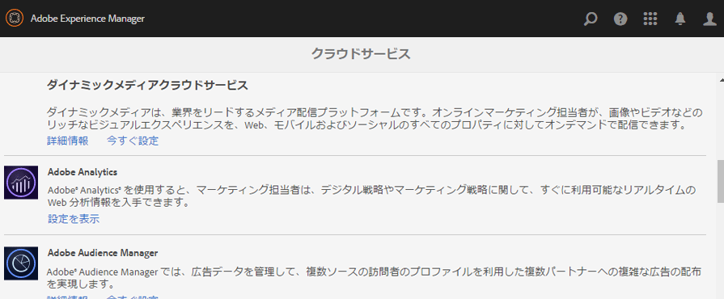

### 設定を作成ダイアログ {#create-configuration-dialog}

* 「**[!UICONTROL 利用可能な設定]**」の横にある`[+]`アイコンを選択して、新しい設定を作成します。

設定を作成ダイアログでは、設定を識別するための値を入力します。

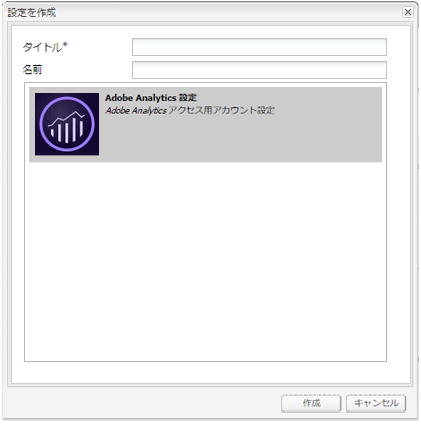

* **タイトル**

   （必須）設定の表示タイトル。
例えば、*Enablement Community Analytics*&#x200B;と入力します。

* **Name**

   （オプション）指定しない場合、名前はデフォルトでタイトルから派生した有効なノード名になります。
例えば、「communities」と入力します。**

* **テンプレート**

    `Adobe Analytics Configuration`

* 「**作成**」を選択します。

   * 設定ページを起動し、`Analytics Settings`ダイアログを開きます

### Analytics 設定ダイアログ {#analytics-settings-dialog}

新しい Analytics 設定を初めて作成したときには、その設定と、Analytics 設定を入力するための新しいダイアログが表示されます。このダイアログには、アカウント担当者から取得した前提条件のアカウント情報[が必要です。](#prerequisites)

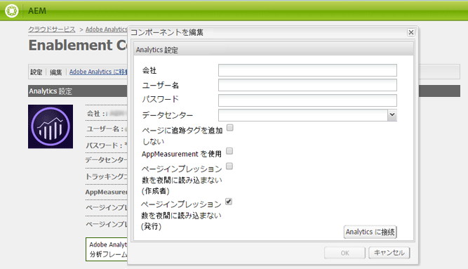

* **Company**

   Adobe Analyticsアカウントに関連付けられている会社。

* **ユーザー名**

   Analyticsアカウントを管理する権限を持つユーザーのログインユーザー名。

* **パスワード**

   認証済みユーザーのログインパスワード。

* **データセンター**

   レポートスイートをホストしているAnalyticsデータセンターを選択します。

* **ページに追跡タグを追加しない**

   デフォルトのままにします（選択解除）。

* **AppMeasurement を使用**

   デフォルトのままにします（選択解除）。

* **ページインプレッション数を夜間に読み込まない (作成者)**

   デフォルトのままにします（選択解除）。

* **ページインプレッション数を夜間に読み込まない (発行)**

   デフォルトのままにします（選択解除）。

設定を保存するには：

* 「**Analyticsに接続**」を選択します。

   * 成功しない場合は、

      * エントリの先頭にスペースが含まれていないことを確認します。
      * 別のデータセンターを試してみてください。

* 「**OK**」を選択します。

   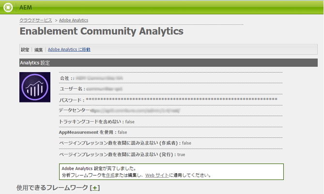

### フレームワークの作成 {#create-framework}

Adobe Analytics への基本的な接続を正しく設定したら、コミュニティサイトのフレームワークを作成または編集する必要があります。このフレームワークの目的は、コミュニティ機能(AEM)変数をAnalytics（レポートスイート）変数にマッピングすることです。

* 「**[!UICONTROL 使用可能なフレームワーク]**」の横にある`[+]`アイコンを選択して、新しいフレームワークを作成します。

   

* **タイトル**

   （必須）フレームワークの表示タイトル
例えば、*Enablement Community Framework*&#x200B;と入力します。

* **名前**

   （オプション）指定しない場合、名前はデフォルトでタイトルから派生した有効なノード名になります。
例えば、*communities*&#x200B;と入力します。

* *テンプレート*

    `Adobe Analytics Framework`.

* 「**作成**」を選択します。

Analytics フレームワークを作成すると、フレームワークを設定するための画面が開きます。

## AEM Analytics フレームワーク設定  {#aem-analytics-framework-configuration}

このフレームワークの目的は、AEM変数をAnalytics変数（eVarおよびイベント）にマッピングすることです。 マッピングに使用できるAnalytics変数は、[レポートスイート](#adobe-analytics-report-suite-for-video-reporting)で定義されます。

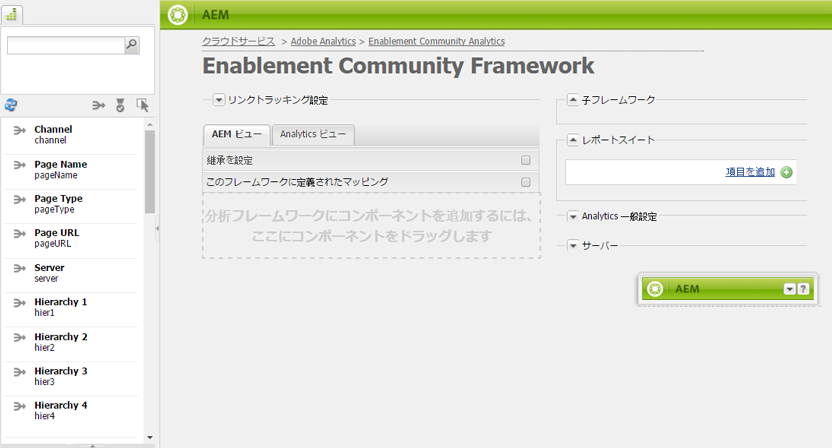

### レポートスイートの選択 {#select-report-suite}

ビデオレポート用にセットアップされているレポートスイートを選択します。

レポートスイートがまだ作成されていない、または適切に設定されていない場合は、前の節を参照してください。
[Adobe Analytics Report Suite for Video Reporting](#adobe-analytics-report-suite-for-video-reporting)

サイドキックは必要ないので、レポートスイート設定にアクセスするときの邪魔にならないよう最小化しておくことができます。

#### 「項目を追加」選択前および選択後のレポートスイートダイアログ  {#report-suites-dialog-before-and-after-selecting-add-item}

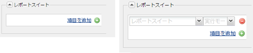

1. 「**項目を追加+**」を選択します。

   2つのドロップダウンボックスが表示されます。

1. `Report suite.`を選択します。

   会社アカウントに関連付けられたレポートスイートを選択できます。

1. 開いたダイアログで「**はい**」を選択します。

   ```
   Load default server settings?
    Do you want to load the default server settings and overwrite current values in the Server section?
   ```

1. `Run Mode`を選択します。

1. 「**発行**」を選択します。

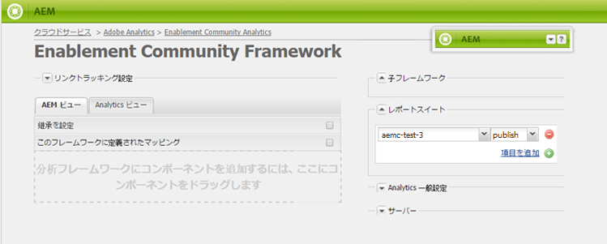

これで Analytic クラウドサービスとフレームワークの準備が完了しました。マッピングは、このAnalyticsサービスを有効にしてコミュニティサイトを作成した後に定義されます。

## コミュニティサイトに対する Analytics の有効化 {#enable-analytics-for-a-community-site}

### 新しいコミュニティサイトに対する有効化 {#enable-for-new-community-site}

[新しいコミュニティサイトの作成](/help/communities/sites-console.md)中に Analytics クラウドサービスを追加するには：

* 手順3で、[「ANALYTICS」タブ](/help/communities/sites-console.md#analytics)で次の操作を実行します。
   * 「**Analytics**&#x200B;を有効にする」チェックボックスをオンにします。
   * ドロップダウンボックスからフレームワークを選択します。

* Analytics フレームワーク設定に戻り、変数マッピングを調整します（オプション）。

### 既存のコミュニティサイトに対する有効化  {#enable-for-existing-community-site}

Analytics クラウドサービスを[既存のコミュニティサイト](/help/communities/sites-console.md#modifying-site-properties)に追加するには：

* **コミュニティ/サイト**&#x200B;コンソールに移動します。
* コミュニティサイトのサイトを編集アイコンを選択します。
* 設定を選択します。
* Analyticsセクションで、以下の操作をおこないます。
   * 「**Analytics**&#x200B;を有効にする」チェックボックスをオンにします。
   * ドロップダウンボックスからフレームワークを選択します。

* Analytics フレームワーク設定に戻り、変数マッピングを調整します（オプション）。

### カスタマイズされたサイトに対する有効化  {#enable-for-customized-sites}

コミュニティサイトで Analytics の追跡とインポートが正常に機能するようにするには、`scf-js-site-title` クラスと href 属性のページ要素が存在する必要があります。コミュニティサイト用の変更されていない`sitepage.hbs`スクリプトなど、ページ上には1つの要素のみが存在する必要があります。 `siteUrl`の値が抽出され、*サイトパス*&#x200B;としてAdobe Analyticsに送信されます。

```xml
# present in default sitepage.hbs
# only one scf-js-site-title class should be included
# this example sets it to be hidden as it serves no visual purpose
<div
    class="navbar-brand scf-js-site-title"
    href="{{siteUrl}}.html"
    style="visibility: hidden;"
>
</div>
```

`sitepage.hbs`スクリプトをオーバーレイする&#x200B;**カスタマイズされたコミュニティサイト**&#x200B;の場合は、要素が存在することを確認します。 `siteUrl`変数は、クライアントに提供される前にサーバーでレンダリングされる際に設定されます。

Communities コンポーネントが含まれているが[サイト作成ウィザード](/help/communities/sites-console.md)で作成されていない&#x200B;**一般的な AEM サイト**&#x200B;の場合は、要素を追加する必要があります。hrefの値は、サイトへのパスにする必要があります。 例えば、サイトパスが`/content/my/company/en`の場合は、次を使用します。

```xml
<div
    class="navbar-brand scf-js-site-title"
    href="/content/my/company/en.html"
    style="visibility: hidden;"
>
</div>
```

## コミュニティ機能のための Analytics {#analytics-for-communities-features}

Analytics は複数のコミュニティ機能で自動的に使用されます。

オーサー環境の[OSGi設定](/help/sites-deploying/configuring-osgi.md)`AEM Communities Analytics Component Configuration`は、Analytics用に実装されたコンポーネントのリストを提供します。 変数の自動マッピングは、リストされたコンポーネントによって決定されます。

Analytics 用の新しいカスタムコンポーネントを作成した場合は、この設定済みコンポーネントのリストに追加する必要があります。

### コンポーネントの設定 {#component-configuration}


>[!NOTE]
>
>ジャーナルコンポーネントは、ブログ機能の実装に使用されます。

### Analytics と AEM 変数とのマッピング {#mapped-analytics-to-aem-variables}

Analyticsが有効でクラウド設定フレームワークを選択した状態でコミュニティサイトを保存すると、AEM変数はevar1とevent1で始まるAnalytics eVarおよびイベントに自動的にマッピングされ、1ずつ増分されます。

evar1 ～ evar11 および event1 ～ event7 の範囲内のいずれかの変数がマップされた既存のレポートスイートを使用する場合は、[AEM 変数を再マップ](#modifying-analytics-variable-mapping)して、元のマッピングを復元する必要があります。

[使用の手引きのチュートリアル](/help/communities/getting-started-enablement.md)に従った場合のデフォルトのマッピング例を以下に示します。

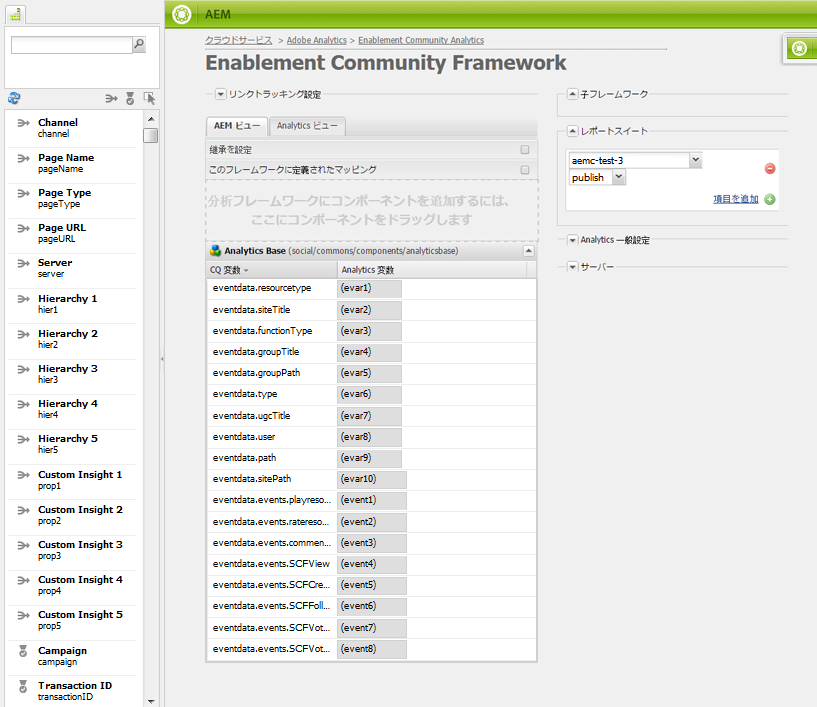

#### 各イベントと共に送信される eVars のマップ {#map-of-evars-sent-with-each-event}

<table>
 <tbody>
  <tr>
   <td><strong> </strong></td>
   <td><strong>イネーブルメント<br />リソース<br />のタイプ</strong></td>
   <td><strong><br />サイトのタイトル</strong></td>
   <td><strong>機能<br />のタイプ</strong></td>
   <td><strong>グループ<br />のタイトル</strong></td>
   <td><strong><br />グループのパス</strong></td>
   <td><strong>UGC<br />のタイプ</strong></td>
   <td><strong>UGC<br />のタイトル</strong></td>
   <td><strong>ユーザー<br />（メンバー）</strong></td>
   <td><strong>UGC<br />のパス</strong></td>
   <td><strong><br />サイトのパス</strong></td>
  </tr>
  <tr>
   <td><strong> </strong></td>
   <td><strong>eVar1</strong></td>
   <td><strong>eVar2</strong></td>
   <td><strong>eVar3</strong></td>
   <td><strong>eVar4</strong></td>
   <td><strong>eVar5</strong></td>
   <td><strong>eVar6</strong></td>
   <td><strong>eVar7</strong></td>
   <td><strong>eVar8</strong></td>
   <td><strong>eVar9</strong></td>
   <td><strong>eVar10</strong></td>
  </tr>
  <tr>
   <td><strong>event1<br /> リソース再生</strong></td>
   <td><em>(a)</em></td>
   <td><em>-</em></td>
   <td><em>-</em></td>
   <td><em>-</em></td>
   <td><em>-</em></td>
   <td><em>-</em></td>
   <td><em>-</em></td>
   <td><em>-</em></td>
   <td><em>(i)</em></td>
   <td><em>-</em></td>
  </tr>
  <tr>
   <td><strong>event2<br /> SCFView</strong></td>
   <td><em>イ</em></td>
   <td><em>(b)</em></td>
   <td><em>(c)</em></td>
   <td><em>(d)</em></td>
   <td><em>(E)</em></td>
   <td><em>（f）</em></td>
   <td><em>（g）</em></td>
   <td><em>（h）</em></td>
   <td><em>一</em></td>
   <td><em>（j）</em></td>
  </tr>
  <tr>
   <td><strong>event3<br /> SCFCreate（投稿）</strong></td>
   <td><em>-</em></td>
   <td><em>(b)</em></td>
   <td><em>(c)</em></td>
   <td><em>ニ</em></td>
   <td><em>(E)</em></td>
   <td><em>（f）</em></td>
   <td><em>（g）</em></td>
   <td><em>（h）</em></td>
   <td><em>一</em></td>
   <td><em>（j）</em></td>
  </tr>
  <tr>
   <td><strong>event4<br /> SCFFollow</strong></td>
   <td><em>-</em></td>
   <td><em>(b)</em></td>
   <td><em>(c)</em></td>
   <td><em>ニ</em></td>
   <td><em>(E)</em></td>
   <td><em>（f）</em></td>
   <td><em>（g）</em></td>
   <td><em>（h）</em></td>
   <td><em>一</em></td>
   <td><em>（j）</em></td>
  </tr>
  <tr>
   <td><strong>event5<br /> SCFVoteUp</strong></td>
   <td><em>-</em></td>
   <td><em>(b)</em></td>
   <td><em>(c)</em></td>
   <td><em>ニ</em></td>
   <td><em>(E)</em></td>
   <td><em>（f）</em></td>
   <td><em>（g）</em></td>
   <td><em>（h）</em></td>
   <td><em>一</em></td>
   <td><em>（j）</em></td>
  </tr>
  <tr>
   <td><strong>event6<br /> SCFVoteDown</strong></td>
   <td><em>-</em></td>
   <td><em>(b)</em></td>
   <td><em>(c)</em></td>
   <td><em>ニ</em></td>
   <td><em>(E)</em></td>
   <td><em>（f）</em></td>
   <td><em>（g）</em></td>
   <td><em>（h）</em></td>
   <td><em>一</em></td>
   <td><em>（j）</em></td>
  </tr>
  <tr>
   <td><strong>event7<br /> SCFRate</strong></td>
   <td><em>-</em></td>
   <td><em>(b)</em></td>
   <td><em>(c)</em></td>
   <td><em>ニ</em></td>
   <td><em>(E)</em></td>
   <td><em>（f）</em></td>
   <td><em>（g）</em></td>
   <td><em>（h）</em></td>
   <td><em>一</em></td>
   <td><em>（j）</em></td>
  </tr>
 </tbody>
</table>

**eVar の値の例：**

* *[MIMEタイプ](https://www.iana.org/assignments/media-types)*:video/mp4
* *[コミュニティサイトのタイトル](/help/communities/sites-console.md#step13asitetemplate)*:Geometrixxコミュニティ
* *[コミュニティ関数名](/help/communities/functions.md)*:フォーラム
* *[コミュニティグループ名](/help/communities/creating-groups.md#creating-a-new-group)*:ハイキング
* *コミュニティグループコンテンツへのパス*:  `/content/sites/<site name>/en/groups/hiking`
* *[UGCコンポーネントのresourceType](/help/communities/essentials.md)*:  `social/forum/components/hbs/topic`
* *UGCコンポーネントのタイトル*:ハイキングトピック
* *login (authorizableId)*:  `aaron.mcdonald@mailinator.com`
* *UGCへのSRPパス*: `/content/usergenerated/asi/.../forum/jmtz-topic3`
または 
*フォローするコンポーネントのパス*:  `/content/sites/<site name>/en/jcr:content/content/primary/forum`

* *コミュニティサイトコンテンツへのパス*:  `/content/sites/<site name>/en`

### Analytics 変数のマッピングの変更 {#modifying-analytics-variable-mapping}

AnalyticsのeVarおよびイベントのAEM変数へのマッピングは、Analyticsがコミュニティサイトに対して有効になった後、フレームワーク設定から表示されます。

Analytics を有効にした後、コミュニティサイトを公開する前に、フレームワーク内で必要な Analytics の evar または event を左のレールからマッピングテーブルの適切な行にドラッグ＆ドロップすることで、マッピングを変更できます。

マッピングの重複を避けるために、置き換えられた Analytics の evar または event は列から削除するようにしてください（削除するには、カーソルを合わせたときに Analytics 変数要素の右に表示される「X」を選択します）。

コミュニティのeVarおよびイベントがレポートスイートに以前存在したマッピングを上書きする場合、データの損失を防ぐために、Communities機能のAEM変数を他のAnalytics eVarまたはイベントに割り当て、元のマッピングを復元します。

>[!CAUTION]
>
>Analytics を有効にしたコミュニティサイトを[公開](#publishing-the-community-site)する前に再マップすることが重要です。そうしないと、データが損失するおそれがあります。

#### 手順 1 の例：Analytics の evar14 をマッピングテーブルにドラッグ {#example-step-dragging-analytics-evar-into-mapping-table}


#### 手順 2 の例：「x」を選択し、置き換える evar11 を削除 {#example-step-selecting-x-to-remove-replaced-evar}

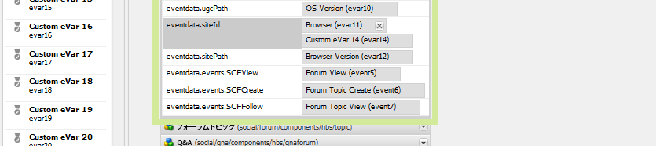

#### 手順 3 の例：AEM 変数 eventdata.siteId を Analytics の evar14 に再マップ {#example-step-aem-var-eventdata-siteid-remapped-to-analytics-evar}

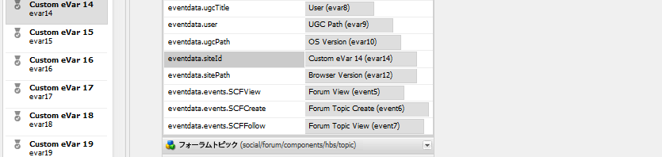

## コミュニティサイトの公開 {#publishing-the-community-site}

### Analytics と AEM 変数とのマッピングの検証 {#verify-analytics-to-aem-variable-mapping}

コミュニティサイトの公開前に、変数マッピングを確認することを推奨します。サイトの公開時には、Analytics クラウドサービスとフレームワークも公開されます。

以下の節を参照してください。

* [Analytics と AEM 変数とのマッピング](#mapped-analytics-to-aem-variables)
* [Analytics 変数のマッピングの変更](#modifying-analytics-variable-mapping)

>[!CAUTION]
>
>**以下の範囲内の変数を使用している既存のレポートスイートを使用する場合は、**
>
>* **`evar1`** から **`evar11`** まで
   >
   >
* **`event1`** から **`event7`** まで
>
>
**その後、コミュニティサイトを公開する前に、** 既存のマッピングを復元し、自動的にマッピングされたCommunities AEM変数を（コミュニティサイトに対してAnalyticsが有効になっている場合）他のAnalytics変数に移動することが重要です。この再マッピングは、すべてのコミュニティコンポーネントで一貫している必要があります。
>
>この作業をしておかないと、修復不可能なデータ損傷が発生することがあります。

### プライマリパブリッシャー  {#primary-publisher}

選択したデプロイメントが[パブリッシュファーム](/help/communities/topologies.md#tarmk-publish-farm)の場合は、レポートデータのポーリングをおこなう Adobe Analytics が [SRP](/help/communities/working-with-srp.md) に書き込めるよう、1 つの AEM パブリッシュインスタンスをプライマリパブリッシャーに指定する必要があります。

デフォルトでは、 `AEM Communities Publisher Configuration` OSGi設定は、そのパブリッシュインスタンスをプライマリパブリッシャーとして識別し、パブリッシュファーム内のすべてのパブリッシュインスタンスがプライマリとして自己識別されるようにします。

したがって、「**プライマリパブリッシャー**」チェックボックスの選択を解除するには、すべてのセカンダリパブリッシュインスタンスの設定を編集する必要があります。

具体的な手順については、[Communities](/help/communities/deploy-communities.md#primary-publisher)のデプロイのプライマリパブリッシャーの節を参照してください。

>[!CAUTION]
>
>複数のパブリッシュインスタンスからのポーリングを防ぐように、プライマリパブリッシャーを設定することが重要です。

### 暗号鍵のレプリケーション {#replicate-the-crypto-key}

Adobe Analytics の資格情報は暗号化されます。オーサーとパブリッシャー間で暗号化された分析資格情報のレプリケーションまたは送信を容易にするには、すべてのAEMインスタンスが同じプライマリ暗号化キーを共有する必要があります。

そのためには、[暗号鍵のレプリケーション](/help/communities/deploy-communities.md#replicate-the-crypto-key)の手順に従います。

### コミュニティサイトと Analytics クラウドサービスの公開 {#publish-community-site-and-analytics-cloud-service}

Analytics クラウドサービスをコミュニティサイトに対して有効にし、また必要に応じて [Analytics 変数と AEM 変数とのマッピングを調整](#mapped-analytics-to-aem-variables)したら、[コミュニティサイトの（再）公開](/help/communities/sites-console.md#publishing-the-site)をおこない、設定をパブリッシュ環境にレプリケートする必要があります。

## Analytics からのレポートの取得 {#obtaining-reports-from-analytics}

### レポート管理 {#report-management}

作成者とプライマリパブリッシャーの[OSGi設定](/help/sites-deploying/configuring-osgi.md)`AEM Communities Analytics Report Management`は、Analyticsに対するクエリに使用されます。

オーサー環境では、リアルタイムレポートを入手するにはクエリを使用します。

プライマリパブリッシャーでは、レポートインポーターの分析データ読み込みに備えた情報提供のためにクエリを使用します。

クエリの間隔は、デフォルトで 10 秒間です。

### レポートインポーター  {#report-importer}

Analyticsが有効なコミュニティサイトが公開されると、プライマリパブリッシャーの[OSGi設定](/help/sites-deploying/configuring-osgi.md)`AEM Communities Analytics Report Importer`を設定して、CRXDEで個別に設定されない設定のデフォルトのポーリング間隔を設定できます。

ポーリング間隔は、[SRP](/help/communities/working-with-srp.md)に保存するデータのAdobe Analyticsへの要求の頻度を制御します。

データが「ビッグデータ」に類するものである場合は、ポーリングの頻度を上げるとコミュニティサイトに大きな負荷がかかる場合があります。

デフォルトのポーリングの&#x200B;**読み込みインターバル**&#x200B;は、12 時間に設定されています。


### コンポーネントレポートのカスタマイズ {#component-report-customization}

現在、追跡する指標をカスタマイズするには、リポジトリ内にノードを作成し、その指標に関するレポートを生成する期間を定義します。

現在、このカスタマイズの例を確認できるのはフォーラムトピックのみです。

* プライマリパブリッシャーで、管理者権限でログインします。
* [CRXDE Lite](/help/sites-developing/developing-with-crxde-lite.md)に移動します。 例えば、[https://localhost:4503/crx/de](https://localhost:4503/crx/de)のようにします。

* 言語ルートのjcr:contentノード（例えば、`/content/sites/engage/en/jcr:content),`）の下で、Analyticsレポート用に設定されたコンポーネントに移動します。
例：**`analytics/reportConfigs/social_forum_components_hbs_topic`**

* 作成された期間に注意してください。

   * `last30Days`
   * `last90Days`
   * `thisYear`

* `total`ノードに注目してください。

   * **`interval`**&#x200B;プロパティを変更すると、レポートインポーターの間隔が上書きされます。
   * 値は秒単位で、4時間(14400秒)に設定します。

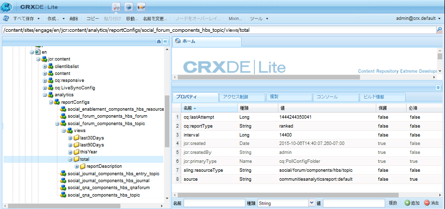

## Analytics でのユーザーデータの管理 {#manage-user-data-in-analytics}

Adobe Analytics は、ユーザーデータのアクセス、書き出し、削除をおこなう API を提供しています。詳しくは、[アクセス要求および削除要求の送信](https://docs.adobe.com/content/help/en/analytics/admin/data-governance/gdpr-submit-access-delete.html)を参照してください。

## リソース {#resources}

* Adobe Experience Cloud:[Analyticsヘルプとリファレンス](https://docs.adobe.com/content/help/en/analytics/landing/home.html)
* AEM:[Adobe Analyticsとの統合](/help/sites-administering/adobeanalytics.md)
* AEM:[外部プロバイダーを使用したAnalytics](/help/sites-administering/external-providers.md)
