# コミュニティ機能のための Analytics の設定 {#analytics-configuration-for-communities-features}

## 概要 {#overview}

Adobe AnalyticsとAdobe Experience Manager （AEM）はどちらも、Adobe Experience Cloudのソリューションです。

AEM Communities用にAdobe Analyticsを設定すると、サポートされているコミュニティ機能を利用するメンバーが、レポートの生成元となるイベントをAdobe Analyticsに送信できるようになります。

例えば、コミュニティサイトでは、管理者はビデオの再生に関するさまざまなレポートを確認できます。

さらに、分析は次のために必要です。

* パブリッシュ環境で、次の操作を行います。

  * コミュニティ [&#x200B; トレンド &#x200B;](/help/communities/trends.md)に関するレポート
  * サイト訪問者が「最も閲覧された」、「最もアクティブな」、「最も気に入った」などの基準でソートできるようにする
  * UGC （ユーザー生成コンテンツ）リストの数の表示

* オーサー環境では、次の操作を行います。

  * [&#x200B; メンバー管理コンソール &#x200B;](/help/communities/members.md)での参加データの表示（ビュー、投稿、フォロー、いいね）
  * イネーブルメント リソース [&#x200B; レポート &#x200B;](/help/communities/reports.md)のトレンド サマリー、ビデオ ハートビート、ビデオ デバイス

サポートされるコミュニティ機能は次のとおりです。

* [フォーラム](/help/communities/forum.md)
* [Q&amp;A](/help/communities/working-with-qna.md)
* [ブログ](/help/communities/blog-feature.md)
* [ファイルライブラリ](/help/communities/file-library.md)
* [Calendar](/help/communities/calendar.md)

この節では、Analytics レポートスイートをコミュニティ機能に接続する方法について説明します。 基本的な手順は次のとおりです。

1. [暗号化キー](#replicate-the-crypto-key)をレプリケートして、すべてのAEM インスタンスで暗号化/復号化が正しく行われるようにします
1. Adobe Analytics [&#x200B; レポートスイート &#x200B;](#adobe-analytics-report-suite-for-video-reporting)の準備
1. AEM Analytics [Cloud Service](#aem-analytics-cloud-service-configuration)と[framework](#aem-analytics-framework-configuration)を作成します

1. コミュニティサイトの[Analytics](#enable-analytics-for-a-community-site)を有効にする
1. [**AnalyticsからAEMへのバリアブルマッピングを確認**](#verify-analytics-to-aem-variable-mapping)
1. [&#x200B; プライマリパブリッシャー](#primary-publisher)を特定
1. [&#x200B; コミュニティサイトを公開](#publish-community-site-and-analytics-cloud-service)
1. Adobe Analyticsからコミュニティサイトへのレポートデータ [&#128279;](#obtaining-reports-from-analytics)の読み込みを設定

## 前提条件 {#prerequisites}

Analytics for Communitiesの機能を設定するには、アカウント担当者と協力してAdobe Analytics アカウントと[&#x200B; レポートスイート &#x200B;](#adobe-analytics-report-suite-for-video-reporting)を設定する必要があります。 確立が完了したら、次の情報を入手できるようにする必要があります。

* **会社名**

  Adobe Analytics アカウントに関連付けられている会社。

* **ユーザー名**

  Analytics アカウントの管理を許可されたユーザーのログインユーザー名
  （Web サービスアクセス権限を含める必要があります）。

* **パスワード**

  承認済みユーザーのログインパスワード。

* **Analytics データセンター**

  アカウントのAnalytics データセンターのURL。

* **レポートスイート**

  使用するAnalytics レポートスイートの名前。

## ビデオレポート用Adobe Analytics Report Suite {#adobe-analytics-report-suite-for-video-reporting}

Adobe Experience Cloudの[&#x200B; レポートスイートマネージャー](https://experienceleague.adobe.com/docs/analytics/admin/admin-tools/manage-report-suites/c-new-report-suite/new-report-suite.html?lang=ja)を使用して、Analytics レポートスイートを設定し、コミュニティサイトでコミュニティ機能のレポートを提供できるようにすることができます。

[会社名とユーザー名](/help/communities/analytics.md#prerequisites)を使用して[Adobe Experience Cloud](https://experienceleague.adobe.com/docs/analytics/analyze/analysis-workspace/home.html?lang=ja)にログインすると、次の機能を持つように新規または既存のレポートスイートを設定できます。

* [11個のコンバージョン変数](https://experienceleague.adobe.com/docs/analytics/admin/admin-tools/manage-report-suites/edit-report-suite/conversion-variables/conversion-var-admin.html?lang=ja) （eVar）

  * **`evar1`** ～ **`evar11`**&#x200B;が有効です

  * 既存のeVarを再利用（名前を変更）したり、コミュニティ機能に使用するeVarを作成したりできます

* [7件の成功イベント &#x200B;](https://experienceleague.adobe.com/docs/analytics/admin/admin-tools/manage-report-suites/edit-report-suite/conversion-variables/success-events/success-event.html?lang=ja) （イベント）

  * **`event1`** ～ **`event7`**&#x200B;が有効です

  * type **`Counter`**

    * **`Counter (no subrelations)`**&#x200B;ではありません

  * 既存のイベントを再利用（名前変更）したり、コミュニティ機能で使用するイベントを作成したりできます

* [ビデオ管理](https://experienceleague.adobe.com/docs/media-analytics/using/media-overview.html?lang=ja)

  * ビデオレポートコンソール

    * `Video Core`を有効にする
    * 「保存」を選択します。

  * ビデオコア測定コンソール

    * `Use Solution Variables` を選択します。
    * 「保存」を選択します。

**新しいレポートスイート**&#x200B;を使用する場合、新しいレポートスイートには4つのeVarと6つのイベント変数しか含まれず、コミュニティには11のeVarと7つのイベント変数が必要です。

**既存のレポートスイート**&#x200B;を使用している場合、コミュニティサイトのAnalytics フレームワークをアクティブ化する前に[変数マッピング &#x200B;](#modifying-analytics-variable-mapping)を変更する必要がある場合があります。

コミュニティ専用の変数に関する懸念事項については、アカウント担当者にお問い合わせください。

>[!CAUTION]
>
>**既に**&#x200B;内の変数を使用している既存のレポートスイートを使用する場合
>
>* **`evar1`** から **`evar11`** まで
>
>* **`event1`** から **`event7`** まで
>
>**次に、コミュニティサイトが公開される前に、Analyticsがコミュニティサイトに対して有効になったときにAnalytics変数に自動的にマッピングされたAEM変数を移動して、**&#x200B;既存のマッピングを復元することが重要です。
>
>既存のマッピングを復元し、AEM変数を他のAnalytics変数に移動するには、[Analytics変数マッピングの変更](#modifying-analytics-variable-mapping)の節を参照してください。
>
>これを行わないと、回復不能なデータ損失が発生する可能性があります。

### ビデオハートビート分析 {#video-heartbeat-analytics}

ビデオハートビート分析のライセンスが付与されると、`Marketing Cloud Org Id`が割り当てられます。

ビデオレポート用のAnalytics レポートスイートを[設定](#adobe-analytics-report-suite-for-video-reporting)した後にビデオハートビートレポートを有効にするには：

* [Analytics Cloud サービス &#x200B;](#aem-analytics-cloud-service-configuration)を作成します
* コミュニティサイトの[Analyticsを有効にする](#enable-analytics-for-a-community-site)
* `Marketing Cloud Org Id`をコミュニティサイトに関連付ける

`Marketing Cloud Org Id`は、[&#x200B; コミュニティサイトの作成時](/help/communities/sites-console.md)以降に、[&#x200B; コミュニティサイトのプロパティを](/help/communities/sites-console.md#modifying-site-properties)変更することで入力できます。

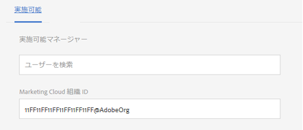

ビデオハートビート分析が有効になっている場合、ビデオプレーヤーのJavaScript（JS）コードによって、ビデオハートビートライブラリコード（JSでも）がインスタンス化されます。 このコードは、10秒ごとにAnalytics ビデオトラッキングサーバーにビデオステータスの更新を送信するためのロジックをすべて処理します（設定不可）。 最終的に、ビデオセッションの累積レポートをメインのAnalytics サーバーに送信します。

有効になっていない場合、ビデオハートビートコードはインスタンス化されず、ビデオの進行状況と履歴位置の追跡のみがレポート用にSRPに保持されます。

## AEM Analytics Cloud サービス設定 {#aem-analytics-cloud-service-configuration}

>[!CAUTION]
>
>[Adobe Analytics 1.4 APIが提供終了に達しました](https://developer.adobe.com/analytics-apis/docs/1.4/guides/eol/)。 その結果、ユーザー資格情報（ユーザー名とパスワード）を使用するAdobe Analytics設定はサポートされなくなりました。

オーサーインスタンスの標準UIを使用して、Adobe AnalyticsとAEM コミュニティサイトを統合するAnalytics統合を作成するには、次の手順を実行します。

* グローバルナビゲーションから：**[!UICONTROL ツール]** > **[!UICONTROL デプロイメント]** > **[!UICONTROL クラウドサービス]**
* **[!UICONTROL Adobe Analytics]**&#x200B;までスクロールダウン
* **[!UICONTROL 今すぐ設定]**&#x200B;または&#x200B;**[!UICONTROL 設定を表示]**&#x200B;を選択

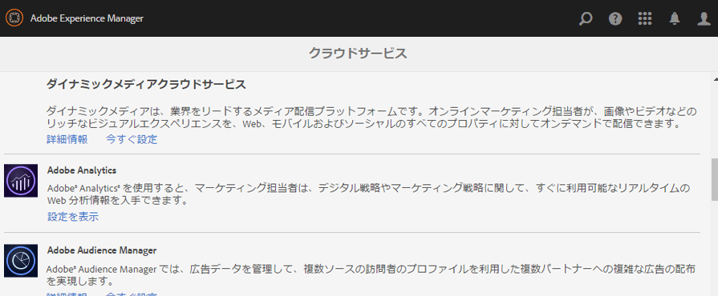

### 設定を作成ダイアログ {#create-configuration-dialog}

* **[!UICONTROL 使用可能な設定]**&#x200B;の横にある`[+]` アイコンを選択して、設定を作成します。

設定を作成ダイアログで、入力する値によって設定が識別されます。

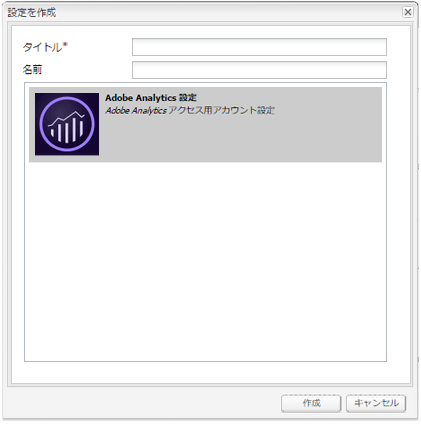

* **タイトル**

  （必須）設定の表示タイトル。
  例えば、*Community Analytics*&#x200B;と入力します

* **名前**

  （オプション）指定しない場合、名前はデフォルトでタイトルから派生した有効なノード名になります。
  例えば、*communities*&#x200B;と入力します

* **テンプレート**

  `Adobe Analytics Configuration` を選択します。

* 「**作成**」を選択します。

  * 設定ページを起動し、`Analytics Settings` ダイアログを開きます

### Analytics設定ダイアログ {#analytics-settings-dialog}

新しいAnalytics設定を最初に作成すると、設定が表示され、Analytics設定を入力するための新しいダイアログが表示されます。 このダイアログでは、アカウント担当者から取得した[前提条件のアカウント情報](#prerequisites)が必要です。

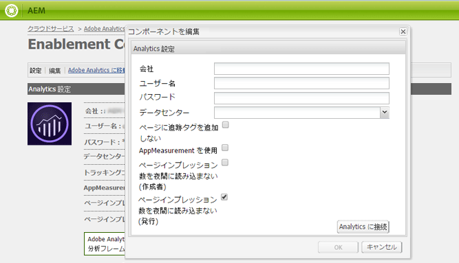

* **会社**

  Adobe Analytics アカウントに関連付けられている会社。

* **ユーザー名**

  Analytics アカウントの管理を許可されたユーザーのログインユーザー名。

* **パスワード**

  承認済みユーザーのログインパスワード。

* **データセンター**

  レポートスイートをホストするAnalytics データセンターを選択します。

* **トラッキングタグをページに追加しません**

  デフォルトのままにします（選択解除）。

* **AppMeasurementを使用**

  デフォルトのままにします（選択解除）。

* **毎晩ページインプレッションを読み込まない（作成者）**

  デフォルトのままにします（選択解除）。

* **毎晩ページインプレッションを読み込まない（公開）**

  デフォルトのままにします（選択解除）。

設定を保存するには：

* 「**Analyticsに接続**」を選択

  * 成功しなかった場合，

    * エントリに先頭スペースが含まれていないことを確認します。
    * 別のデータセンターを試してください。

* 「**OK**」を選択します。

  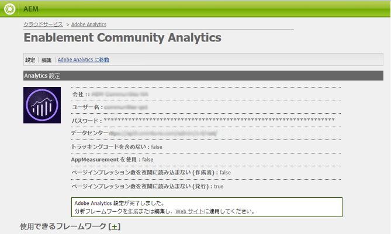

### フレームワークを作成 {#create-framework}

Adobe Analyticsへの基本接続の設定が正常に完了したら、コミュニティサイト用のフレームワークを作成または編集する必要があります。 このフレームワークの目的は、コミュニティ機能（AEM）変数をAnalytics （レポートスイート）変数にマッピングすることです。

* フレームワークを作成できるように、**[!UICONTROL 利用可能なフレームワーク]**&#x200B;の横にある`[+]` アイコンを選択します。

  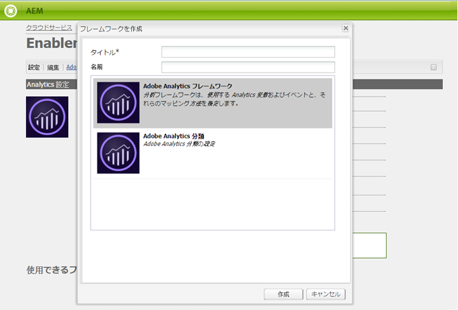

* **タイトル**

  （必須）フレームワークの表示タイトル
  例えば、*Community Framework*&#x200B;と入力します。

* **名前**

  （オプション）指定しない場合、名前はデフォルトでタイトルから派生した有効なノード名になります。
  例えば、*communities*&#x200B;と入力します。

* *テンプレート*

  `Adobe Analytics Framework` を選択します。

* 「**作成**」を選択します。

Analytics フレームワークを作成すると、設定のフレームワークが開きます。

## AEM Analytics Frameworkの設定 {#aem-analytics-framework-configuration}

このフレームワークの目的は、AEM変数をAnalytics変数（eVarおよびイベント）にマッピングすることです。 マッピングに使用できるAnalytics変数は、レポートスイート [&#128279;](#adobe-analytics-report-suite-for-video-reporting)で定義されています。

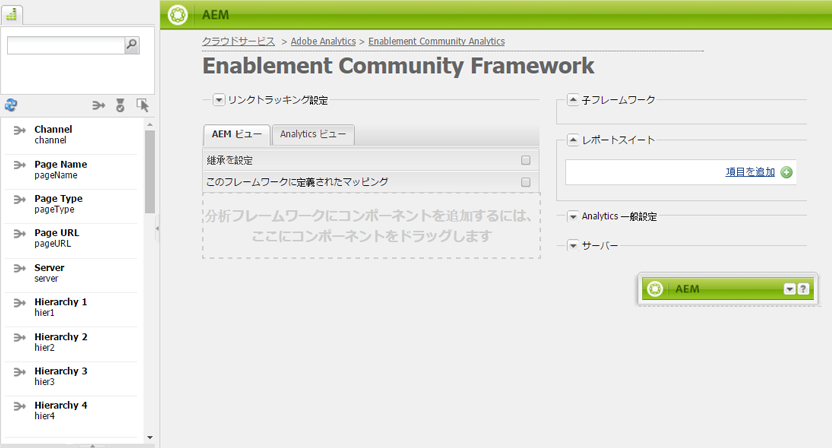

### レポートスイートを選択 {#select-report-suite}

ビデオレポート用に設定されているレポートスイートを選択します。

レポートスイートがまだ作成されていないか、正しく設定されていない場合は、前の節を参照してください。
[&#x200B; ビデオ用Adobe Analytics レポートスイート &#x200B;](#adobe-analytics-report-suite-for-video-reporting)

Sidekickは不要で、レポートスイートの設定へのアクセスを妨げないように最小化できます。

#### 「アイテムを追加」を選択する前後のレポートスイートダイアログ {#report-suites-dialog-before-and-after-selecting-add-item}

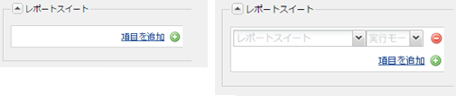

1. 「**項目を追加+**」を選択します。

   2つのドロップダウンボックスが表示されます。

1. `Report suite.`を選択

   会社アカウントに関連付けられているレポートスイートを選択できます。

1. 開いたダイアログで「**はい**」を選択します。

   ```
   Load default server settings?
    Do you want to load the default server settings and overwrite current values in the Server section?
   ```

1. `Run Mode`を選択してください。

1. 「**公開**」を選択します。

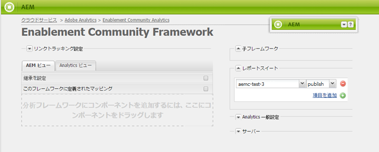

Analytics クラウドサービスとフレームワークが完了しました。 マッピングは、このAnalytics サービスを有効にしてコミュニティサイトを作成した後に定義されます。

## コミュニティサイトのAnalyticsを有効にする {#enable-analytics-for-a-community-site}

### 新しいコミュニティサイトを有効にする {#enable-for-new-community-site}

[&#x200B; コミュニティサイトの作成中](/help/communities/sites-console.md)にAnalytics Cloud サービスを追加するには：

* 手順3の[分析タブ &#x200B;](/help/communities/sites-console.md#analytics)で、次の操作を行います。
  * 「**Analyticsを有効にする**」チェックボックスをオンにします。
  * ドロップダウンボックスからフレームワークを選択します。

* 必要に応じて、Analytics フレームワーク設定に戻り、変数マッピングを調整します。

### 既存のコミュニティサイトで有効にする {#enable-for-existing-community-site}

Analytics Cloud サービスを[既存のコミュニティサイト &#x200B;](/help/communities/sites-console.md#modifying-site-properties)に追加するには：

* **Communities > Sites** コンソールに移動します。
* コミュニティサイトのサイト編集アイコンを選択します。
* 設定を選択します。
* 「分析」セクションで、次の操作を行います。
  * 「**Analyticsを有効にする**」チェックボックスをオンにします。
  * ドロップダウンボックスからフレームワークを選択します。

* 必要に応じて、Analytics フレームワーク設定に戻り、変数マッピングを調整します。

### カスタマイズされたサイト用に有効にする {#enable-for-customized-sites}

Analytics トラッキングと読み込みがコミュニティサイトで適切に機能するには、`scf-js-site-title` クラスとhref属性を持つページ要素が存在する必要があります。 そのような要素は、コミュニティサイトの未変更の`sitepage.hbs` スクリプトのように、ページ上に1つだけ存在する必要があります。 `siteUrl`の値が抽出され、*サイトパス*&#x200B;としてAdobe Analyticsに送信されます。

```xml
# present in default sitepage.hbs
# only one scf-js-site-title class should be included
# this example sets it to be hidden as it serves no visual purpose
<div
    class="navbar-brand scf-js-site-title"
    href="{{siteUrl}}.html"
    style="visibility: hidden;"
>
</div>
```

`sitepage.hbs` スクリプトをオーバーレイする&#x200B;**カスタマイズされたコミュニティ サイト**&#x200B;の場合、要素が存在することを確認してください。 `siteUrl`変数は、クライアントにサービスを提供する前にサーバー上でレンダリングされたときに設定されます。

Communities コンポーネントを含んでいるが、[&#x200B; サイト作成ウィザード &#x200B;](/help/communities/sites-console.md)で作成されていない&#x200B;**汎用AEM サイト**&#x200B;の場合は、要素を追加する必要があります。 hrefの値は、サイトへのパスである必要があります。 例えば、サイトパスが`/content/my/company/en`の場合、次を使用します。

```xml
<div
    class="navbar-brand scf-js-site-title"
    href="/content/my/company/en.html"
    style="visibility: hidden;"
>
</div>
```

## Analytics for Communitiesの機能 {#analytics-for-communities-features}

Analyticsは、複数のコミュニティ機能に対して自動的に使用されます。

オーサー環境の[OSGi設定](/help/sites-deploying/configuring-osgi.md)、`AEM Communities Analytics Component Configuration`には、Analytics用に実装されたコンポーネントのリストが表示されます。 変数の自動マッピングは、リストされたコンポーネントによって決まります。

Analytics用に実装された新しいカスタムコンポーネントが作成された場合は、設定されたコンポーネントのリストに追加する必要があります。

### コンポーネント設定 {#component-configuration}

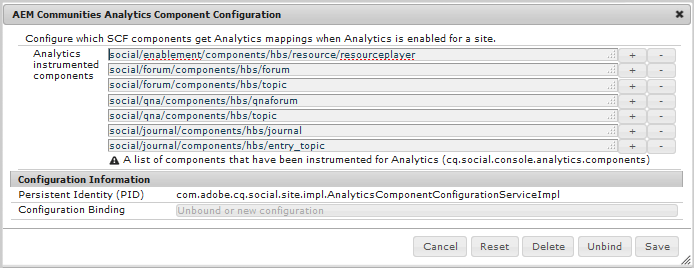

>[!NOTE]
>
>ジャーナルコンポーネントは、ブログ機能の実装に使用されます。

### AEM変数へのマッピング済み分析 {#mapped-analytics-to-aem-variables}

コミュニティサイトを保存し、Analyticsを有効にしてクラウド設定フレームワークを選択すると、AEM変数がAnalytics eVarとイベントに自動的にマッピングされます。 それぞれevar1とevent1で始まり、1ずつ増加します。

evar1 ～ evar11およびevent1 ～ event7のいずれかの変数をマッピングした既存のレポートスイートを使用する場合、[AEM変数](#modifying-analytics-variable-mapping)を再マッピングし、元のマッピングを復元する必要があります。

デフォルトマッピングの例を次に示します。

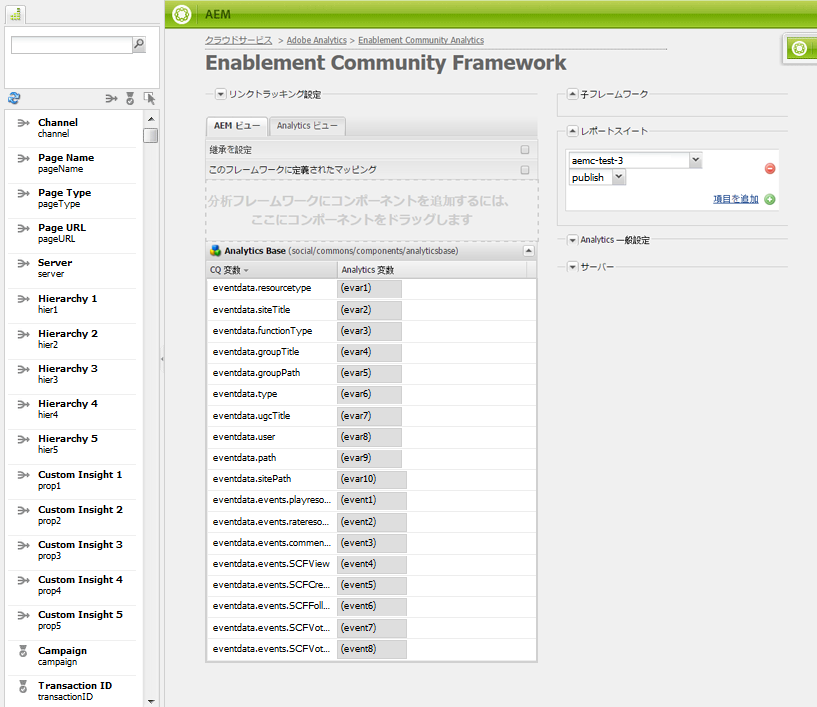

#### 各イベントで送信されるeVarのマップ {#map-of-evars-sent-with-each-event}

<table>
 <tbody>
  <tr>
   <td><strong> </strong></td>
   <td><strong>有効化<br /> リソース <br /> タイプ</strong></td>
   <td><strong>サイト <br /> タイトル</strong></td>
   <td><strong>関数<br /> タイプ</strong></td>
   <td><strong>グループ <br /> タイトル</strong></td>
   <td><strong>グループ <br /> パス</strong></td>
   <td><strong>UGC<br /> タイプ</strong></td>
   <td><strong>UGC<br /> タイトル</strong></td>
   <td><strong>ユーザー<br /> （メンバー）</strong></td>
   <td><strong>UGC<br /> パス</strong></td>
   <td><strong>サイト <br /> パス</strong></td>
  </tr>
  <tr>
   <td><strong> </strong></td>
   <td><strong>eVar1</strong></td>
   <td><strong>eVar2</strong></td>
   <td><strong>eVar3</strong></td>
   <td><strong>EVAR4</strong></td>
   <td><strong>EVAR5</strong></td>
   <td><strong>EVAR6</strong></td>
   <td><strong>EVAR7</strong></td>
   <td><strong>EVAR8</strong></td>
   <td><strong>EVAR9</strong></td>
   <td><strong>eVar10</strong></td>
  </tr>
  <tr>
   <td><strong>event1<br /> リソース再生</strong></td>
   <td><em>(a)</em></td>
   <td><em>-</em></td>
   <td><em>-</em></td>
   <td><em>-</em></td>
   <td><em>-</em></td>
   <td><em>-</em></td>
   <td><em>-</em></td>
   <td><em>-</em></td>
   <td><em>(i)</em></td>
   <td><em>-</em></td>
  </tr>
  <tr>
   <td><strong>event2<br /> SCFView</strong></td>
   <td><em>(a)</em></td>
   <td><em>(b)</em></td>
   <td><em>(c)</em></td>
   <td><em>(d)</em></td>
   <td><em>(e)</em></td>
   <td><em>(f)</em></td>
   <td><em>(g)</em></td>
   <td><em>(h)</em></td>
   <td><em>(i)</em></td>
   <td><em>(j)</em></td>
  </tr>
  <tr>
   <td><strong>event3<br /> SCFCreate （Post）</strong></td>
   <td><em>-</em></td>
   <td><em>(b)</em></td>
   <td><em>(c)</em></td>
   <td><em>(d)</em></td>
   <td><em>(e)</em></td>
   <td><em>(f)</em></td>
   <td><em>(g)</em></td>
   <td><em>(h)</em></td>
   <td><em>(i)</em></td>
   <td><em>(j)</em></td>
  </tr>
  <tr>
   <td><strong>event4<br /> SCFFollow</strong></td>
   <td><em>-</em></td>
   <td><em>(b)</em></td>
   <td><em>(c)</em></td>
   <td><em>(d)</em></td>
   <td><em>(e)</em></td>
   <td><em>(f)</em></td>
   <td><em>(g)</em></td>
   <td><em>(h)</em></td>
   <td><em>(i)</em></td>
   <td><em>(j)</em></td>
  </tr>
  <tr>
   <td><strong>event5<br /> SCFVoteUp</strong></td>
   <td><em>-</em></td>
   <td><em>(b)</em></td>
   <td><em>(c)</em></td>
   <td><em>(d)</em></td>
   <td><em>(e)</em></td>
   <td><em>(f)</em></td>
   <td><em>(g)</em></td>
   <td><em>(h)</em></td>
   <td><em>(i)</em></td>
   <td><em>(j)</em></td>
  </tr>
  <tr>
   <td><strong>event6<br /> SCFVoteDown</strong></td>
   <td><em>-</em></td>
   <td><em>(b)</em></td>
   <td><em>(c)</em></td>
   <td><em>(d)</em></td>
   <td><em>(e)</em></td>
   <td><em>(f)</em></td>
   <td><em>(g)</em></td>
   <td><em>(h)</em></td>
   <td><em>(i)</em></td>
   <td><em>(j)</em></td>
  </tr>
  <tr>
   <td><strong>event7<br /> SCFRate</strong></td>
   <td><em>-</em></td>
   <td><em>(b)</em></td>
   <td><em>(c)</em></td>
   <td><em>(d)</em></td>
   <td><em>(e)</em></td>
   <td><em>(f)</em></td>
   <td><em>(g)</em></td>
   <td><em>(h)</em></td>
   <td><em>(i)</em></td>
   <td><em>(j)</em></td>
  </tr>
 </tbody>
</table>

**eVar値の例：**

* *[MIME タイプ &#x200B;](https://www.iana.org/assignments/media-types/media-types.xhtml)*:video/mp4
* *[コミュニティサイトのタイトル](/help/communities/sites-console.md#step13asitetemplate)*: Geometrixx Communities
* *[コミュニティ関数名](/help/communities/functions.md)*: フォーラム
* *[コミュニティグループ名](/help/communities/creating-groups.md#creating-a-new-group)*：ハイキング
* *コミュニティグループコンテンツへのパス*: `/content/sites/<site name>/en/groups/hiking`
* *[UGC コンポーネント resourceType](/help/communities/essentials.md)*: `social/forum/components/hbs/topic`
* *UGC コンポーネントのタイトル*: ハイキング トピック
* *ログイン （authorizableId）*: `aaron.mcdonald@mailinator.com`
* *UGC*&#x200B;へのSRP パス： `/content/usergenerated/asi/.../forum/jmtz-topic3`
または*フォローするコンポーネントのパス*: `/content/sites/<site name>/en/jcr:content/content/primary/forum`

* *コミュニティサイトコンテンツへのパス*: `/content/sites/<site name>/en`

### Analytics変数マッピングの変更 {#modifying-analytics-variable-mapping}

AnalyticsのeVarとイベントのAEM変数へのマッピングは、Analyticsがコミュニティサイトに対して有効になった後、フレームワーク設定から表示されます。

Analyticsを有効にし、コミュニティサイトを公開する前に、マッピングがフレームワークで変更される場合があります。 左側のパネルから目的のAnalytics evarまたはイベントをドラッグし、マッピングテーブルの関連する行にドロップするだけです。

マッピングが重複しないように、置き換えられたAnalytics evarまたはイベントを行から削除し、その上にカーソルを合わせて、Analytics変数要素の右側に表示される「X」を選択してください。

Communities eVarとイベントがレポートスイートに存在していたマッピングを上書きする場合は、データの損失を避けるために、Communities機能のAEM変数を他のAnalytics eVarまたはイベントに割り当てて、元のマッピングを復元します。

>[!CAUTION]
>
>Analyticsを有効にして[公開](#publishing-the-community-site)する前に、コミュニティサイトを再マップすることが重要です。そうしないと、データが失われるリスクがあります。

#### 例ステップ 1:Analytics evar14をマッピングテーブルにドラッグする {#example-step-dragging-analytics-evar-into-mapping-table}

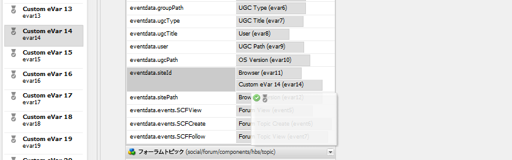

#### 例ステップ 2：置き換えられたevar11を削除するために「x」を選択する {#example-step-selecting-x-to-remove-replaced-evar}

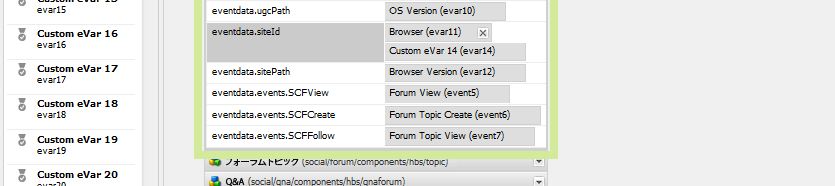

#### 例ステップ 3: Analytics evar14にリマップされたAEM var eventdata.siteId {#example-step-aem-var-eventdata-siteid-remapped-to-analytics-evar}

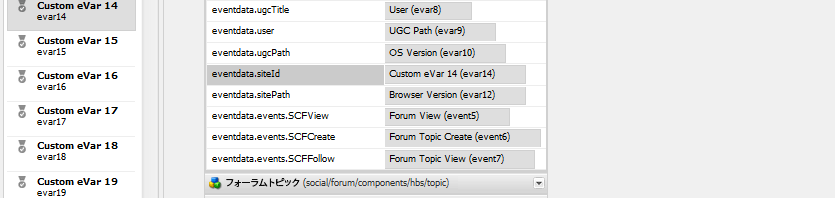

## コミュニティサイトの公開 {#publishing-the-community-site}

### AnalyticsからAEMへのバリアブルマッピングの検証 {#verify-analytics-to-aem-variable-mapping}

Analytics Cloud サービスとフレームワークも公開するコミュニティサイトを公開する前に、バリアブルマッピングを検証することをお勧めします。

セクションを見る：

* [AEM変数へのマッピング済み分析](#mapped-analytics-to-aem-variables)
* [Analytics変数マッピングの変更](#modifying-analytics-variable-mapping)

>[!CAUTION]
>
>**既に**&#x200B;内の変数を使用している既存のレポートスイートを使用する場合
>
>* **`evar1`** から **`evar11`** まで
>
>* **`event1`** から **`event7`** まで
>
>**次に、コミュニティサイトが公開される前に、**&#x200B;既存のマッピングを復元します。 （コミュニティサイトでAnalyticsが有効になっている場合）自動的にマッピングされたCommunities AEM変数を他のAnalytics変数に移動します。 このリマッピングは、すべてのコミュニティコンポーネントで一貫している必要があります。
>
>これを行わないと、回復不能なデータ損失が発生する可能性があります。

### プライマリ発行者 {#primary-publisher}

選択したデプロイメントが[&#x200B; パブリッシュファーム &#x200B;](/help/communities/topologies.md#tarmk-publish-farm)の場合、レポート データを[SRP](/help/communities/working-with-srp.md)に書き込むためにAdobe Analyticsをポーリングするプライマリ パブリッシャーとして1つのAEM パブリッシュ インスタンスを識別する必要があります。

デフォルトでは、`AEM Communities Publisher Configuration` OSGi設定は、パブリッシュファーム内のすべてのパブリッシュインスタンスがプライマリとして自己識別するように、パブリッシュインスタンスをプライマリパブリッシャーとして識別します。

そのため、すべてのセカンダリパブリッシュインスタンスで設定を編集して、**プライマリパブリッシャー** チェックボックスの選択を解除する必要があります。

具体的な手順については、[&#x200B; コミュニティのデプロイ &#x200B;](/help/communities/deploy-communities.md#primary-publisher)のプライマリパブリッシャーの節を参照してください。

>[!CAUTION]
>
>複数のパブリッシュインスタンスからのポーリングを防ぐには、プライマリパブリッシャーを設定することが重要です。

### 暗号化キーのレプリケート {#replicate-the-crypto-key}

Adobe Analyticsの資格情報は暗号化されています。 作成者とパブリッシャー間で暗号化されたAnalytics資格情報のレプリケーションまたは転送を容易にするには、すべてのAEM インスタンスが同じプライマリ暗号化キーを共有する必要があります。

これを行うには、[暗号化キーのレプリケート &#x200B;](/help/communities/deploy-communities.md#replicate-the-crypto-key)の手順に従います。

### コミュニティサイトとAnalytics Cloud サービスの公開 {#publish-community-site-and-analytics-cloud-service}

Analytics Cloud サービスをコミュニティサイトに対して有効にし、必要に応じて、AnalyticsのAEM変数への[&#x200B; マッピングを調整した後](#mapped-analytics-to-aem-variables)、コミュニティサイト [&#128279;](/help/communities/sites-console.md#publishing-the-site)を再公開することによってパブリッシュ環境に設定をレプリケートします。

## Analyticsからのレポートの取得 {#obtaining-reports-from-analytics}

### レポート管理 {#report-management}

オーサーおよびプライマリ発行者の[OSGi設定](/help/sites-deploying/configuring-osgi.md)、`AEM Communities Analytics Report Management`は、Analyticsのクエリに使用されます。

作成者は、リアルタイムレポート用にクエリを作成します。

プライマリパブリッシャーでは、レポートインポーターの分析データのインポートに備えて、クエリを使用して情報を提供します。

クエリ間隔はデフォルトで10秒になります。

### レポートインポーター {#report-importer}

Analyticsが有効になっているコミュニティサイトが公開されると、プライマリパブリッシャーの[OSGi設定](/help/sites-deploying/configuring-osgi.md), `AEM Communities Analytics Report Importer`は、CRXDEで個別に設定されていない設定のデフォルトのポーリング間隔を設定するように設定できます。

ポーリング間隔は、[SRP](/help/communities/working-with-srp.md)に引き出して保存するデータに対するAdobe Analyticsへのリクエストの頻度を制御します。

データが「ビッグデータ」として分類される場合、より頻繁なポーリングは、コミュニティサイトに大きな負荷がかかる可能性があります。

デフォルトのポーリング **インポート間隔**&#x200B;は12時間に設定されています。

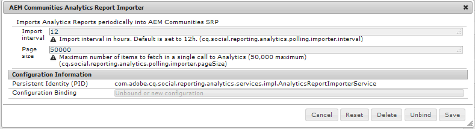

### コンポーネントレポートのカスタマイズ {#component-report-customization}

現在、追跡する指標をカスタマイズするために、その指標に関するレポートを生成する期間を定義するノードがリポジトリに作成されます。

フォーラムのトピックは、現在、このカスタマイズの唯一の例です。

* プライマリパブリッシャーで、管理者権限でログインします。
* [CRXDE Lite](/help/sites-developing/developing-with-crxde-lite.md) に移動します。 例：[https://localhost:4503/crx/de](https://localhost:4503/crx/de)。

* 言語ルートの`jcr:content` ノード （例：`/content/sites/engage/en/jcr:content`）で、Analytics レポート用に設定されたコンポーネントに移動します。
例えば、**`analytics/reportConfigs/social_forum_components_hbs_topic`** のように指定します。

* 作成された期間に注目してください。

  * `last30Days`
  * `last90Days`
  * `thisYear`

* `total` ノードに注意してください。

  * **`interval`** プロパティを変更すると、レポートインポーター間隔が上書きされます。
  * 値は秒単位で、4時間（14400秒）に設定されます。

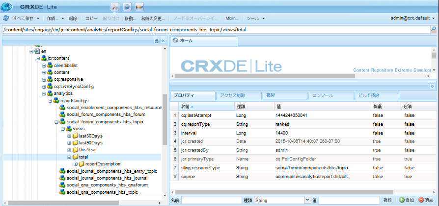

## Analyticsでのユーザーデータの管理 {#manage-user-data-in-analytics}

Adobe Analyticsには、ユーザーデータにアクセス、書き出し、削除できるAPIが用意されています。 詳細については、[&#x200B; アクセス要求と削除要求の送信](https://experienceleague.adobe.com/docs/analytics/admin/admin-tools/data-governance/an-gdpr-workflow.html?lang=ja)を参照してください。

## リソース {#resources}

* Adobe Experience Cloud: [Analytics ヘルプと参照](https://experienceleague.adobe.com/docs/analytics.html)
* AEM: [Adobe Analyticsとの統合](/help/sites-administering/adobeanalytics.md)
* AEM: [外部プロバイダーを使用したAnalytics](/help/sites-administering/external-providers.md)
