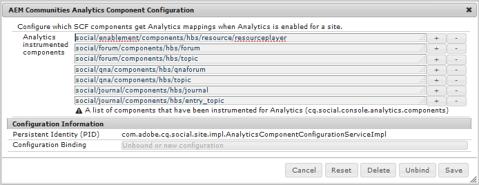

# コミュニティ機能のための Analytics の設定 {#analytics-configuration-for-communities-features}

## 概要 {#overview}

Adobe AnalyticsとAdobe Experience Manager（AEM）は、どちらもAdobe Experience Cloudのソリューションです。

Adobe AnalyticsをAEM Communities用に設定すると、メンバーがサポートされている Communities の機能を操作する際に、イベントがAdobe Analyticsに送信され、そこからレポートが生成されるようになります。

例えば、コミュニティサイトから、管理者はビデオの再生に関する様々なレポートを表示できます。

さらに、以下を行うには分析が必要です。

* Publish環境で、次の操作を行います。

   * コミュニティ [ トレンド ](/help/communities/trends.md) のレポート
   * サイト訪問者が「最も多く閲覧」、「最もアクティブ」、「最も高評価」で並べ替えられるようにする
   * UGC （ユーザー生成コンテンツ）リストの表示数

* オーサー環境で、次の操作を行います。

   * [ メンバー管理コンソール ](/help/communities/members.md) のパーティシペーション データの表示（表示、投稿、フォロー、いいね）
   * イネーブルメントリソースのトレンドサマリ、ビデオハートビートおよびビデオデバイス [ レポート ](/help/communities/reports.md)

次の Communities 機能がサポートされています。

* [フォーラム](/help/communities/forum.md)
* [Q&amp;A](/help/communities/working-with-qna.md)
* [ブログ](/help/communities/blog-feature.md)
* [ファイルライブラリ](/help/communities/file-library.md)
* [Calendar](/help/communities/calendar.md)

この節では、Analytics レポートスイートを Communities 機能と接続する方法について説明します。 基本的な手順は次のとおりです。

1. [ 暗号キーをレプリケートする ](#replicate-the-crypto-key) と、すべてのAEM インスタンスで暗号化/復号化が正しく行われることを確認できます
1. Adobe Analyticsの準備 [ レポートスイート ](#adobe-analytics-report-suite-for-video-reporting)
1. AEM Analytics [Cloud Service](#aem-analytics-cloud-service-configuration) および [ フレームワーク ](#aem-analytics-framework-configuration) を作成

1. コミュニティサイトの [Analytics を有効にする ](#enable-analytics-for-a-community-site)
1. [**検証**](#verify-analytics-to-aem-variable-mapping) Analytics からAEMへの変数マッピング
1. [ プライマリ パブリッシャー ](#primary-publisher) の特定
1. [Publish](#publish-community-site-and-analytics-cloud-service) コミュニティサイト
1. Adobe Analyticsからコミュニティサイトへの [ レポートデータのインポート ](#obtaining-reports-from-analytics) の設定

## 前提条件 {#prerequisites}

Analytics for Communities 機能を設定するには、アカウント担当者と協力してAdobe Analytics アカウントおよび [ レポートスイート ](#adobe-analytics-report-suite-for-video-reporting) を設定する必要があります。 設定が完了すると、次の情報が利用できるようになります。

* **会社名**

  Adobe Analytics アカウントに関連付けられている会社。

* **ユーザー名**

  Analytics アカウントの管理を許可されたユーザーのログインユーザー名
（Web サービスへのアクセス権限を含める必要があります）。

* **パスワード**

  許可されたユーザーのログインパスワード。

* **Analytics データセンター**

  アカウントの Analytics データセンターの URL。

* **レポートスイート**

  使用する Analytics レポートスイートの名前。

## ビデオレポート用のAdobe Analytics レポートスイート {#adobe-analytics-report-suite-for-video-reporting}

Adobe Experience Cloud [Report Suite Manager](https://experienceleague.adobe.com/docs/analytics/admin/admin-tools/manage-report-suites/c-new-report-suite/new-report-suite.html?lang=ja) を使用すると、Analytics レポートスイートを設定して、コミュニティサイトで Communities 機能のレポートを提供できるようになります。

[ 会社名とユーザー名 ](/help/communities/analytics.md#prerequisites) を使用して [Adobe Experience Cloud](https://experienceleague.adobe.com/docs/analytics/analyze/analysis-workspace/home.html?lang=ja) にログインすることにより、新規または既存のレポートスイートに以下を設定することができます。

* [11 コンバージョン変数 ](https://experienceleague.adobe.com/docs/analytics/admin/admin-tools/manage-report-suites/edit-report-suite/conversion-variables/conversion-var-admin.html?lang=ja) （eVars）

   * **`evar1`** ～ **`evar11`** が有効

   * 既存の eVar の再利用（名前変更）や、Communities 機能に使用する eVar の作成が可能

* [7 成功イベント ](https://experienceleague.adobe.com/docs/analytics/admin/admin-tools/manage-report-suites/edit-report-suite/conversion-variables/success-events/success-event.html?lang=ja) （イベント）

   * **`event1`** ～ **`event7`** が有効

   * type **`Counter`**

      * **`Counter (no subrelations)`** でない

   * 既存のイベントを再利用（名前変更）したり、コミュニティ機能に使用するイベントを作成したりできます。

* [ ビデオ管理 ](https://experienceleague.adobe.com/docs/media-analytics/using/media-overview.html?lang=ja)

   * ビデオレポートコンソール

      * Enable `Video Core`
      * 「保存」を選択します。

   * ビデオコア測定コンソール

      * `Use Solution Variables` を選択します。
      * 「保存」を選択します。

**新しいレポートスイート** を使用する場合、新しいレポートスイートには 4 つの eVar と 6 つのイベント変数のみ含まれ、コミュニティには 11 つの eVar と 7 つのイベント変数が必要です。

**既存のレポートスイート** を使用する場合、コミュニティサイトの Analytics フレームワークをアクティブ化する前に、[ 変数のマッピングを変更 ](#modifying-analytics-variable-mapping) する必要が生じる場合があります。

Communities 専用の変数に関するご懸念は、アカウント担当者にお問い合わせください。

>[!CAUTION]
>
>**内で変数を既に使用している既存のレポートスイートを使用する場合**
>
>* **`evar1`** から **`evar11`** まで
>
>* **`event1`** から **`event7`** まで
>
>**次に、コミュニティサイトを公開する前に** コミュニティサイトに対して Analytics が有効になっている場合にAEM変数に自動的にマッピングされた Analytics 変数を移動して、既存のマッピングを復元することが重要です。
>
>既存のマッピングを復元し、AEM変数を他の Analytics 変数に移動するには、[Analytics 変数マッピングの変更 ](#modifying-analytics-variable-mapping) に関する節を参照してください。
>
>これに従わないと、回復不可能なデータ損失が発生する可能性があります。

### Video Heartbeat Analytics {#video-heartbeat-analytics}

Video Heartbeat Analytics のライセンスが取得されると、`Marketing Cloud Org Id` が割り当てられます。

[ ビデオレポート用の Analytics レポートスイートの設定 ](#adobe-analytics-report-suite-for-video-reporting) 後にビデオハートビートレポートを有効にするには：

* [Analytics Cloud サービス ](#aem-analytics-cloud-service-configuration) を作成
* コミュニティサイトの [Analytics](#enable-analytics-for-a-community-site) を有効にする
* `Marketing Cloud Org Id` をコミュニティサイトに関連付けます

`Marketing Cloud Org Id` は、[ コミュニティサイトの作成時 ](/help/communities/sites-console.md) または後でコミュニティサイトのプロパティを [ 変更 ](/help/communities/sites-console.md#modifying-site-properties) して入力できます。


Video Heartbeat Analytics が有効な場合、ビデオプレーヤーのJavaScript（JS）コードがビデオハートビートライブラリコード（これも JS に含まれる）をインスタンス化します。 このコードは、10 秒ごとに Analytics ビデオトラッキングサーバーにビデオステータスの更新を送信するすべてのロジックを処理します（設定はできません）。 最終的には、ビデオセッションの累積レポートがメインの Analytics サーバーに送信されます。

有効にしない場合、ビデオハートビートコードはインスタンス化されず、ビデオの進行状況と再開位置のトラッキングのみがレポート用に SRP に保持されます。

## AEM Analytics Cloud サービスの設定 {#aem-analytics-cloud-service-configuration}

オーサーインスタンスの標準 UI を使用して、Adobe AnalyticsをAEM コミュニティサイトと統合する Analytics 統合を作成するには、次のようにします。

* グローバルナビゲーションから：**[!UICONTROL ツール]**/**[!UICONTROL 導入]**/**[!UICONTROL Cloud Service]**
* **[!UICONTROL Adobe Analytics]** まで下にスクロール
* **[!UICONTROL 今すぐ設定]** または **[!UICONTROL 設定を表示]** を選択します


### 設定を作成ダイアログ {#create-configuration-dialog}

* **[!UICONTROL 利用可能 `[+]` 設定]** の横にあるアイコンを選択して、設定を作成できます。

設定を作成ダイアログで、入力する値が設定を識別します。


* **タイトル**

  （必須）設定の表示タイトル。
例えば、「コミュニティ分析 *と入力しま*。

* **名前**

  （オプション）指定しない場合、名前はデフォルトでタイトルから派生した有効なノード名になります。
例えば、「communities*と入力しま*。

* **テンプレート**

  `Adobe Analytics Configuration` を選択します。

* 「**作成**」を選択します。

   * 設定ページを起動し、ダイアログ `Analytics Settings` 開きます

### Analytics 設定ダイアログ {#analytics-settings-dialog}

新しい Analytics 設定を最初に作成すると、設定が表示され、Analytics 設定を入力するための新しいダイアログが表示されます。 このダイアログには、アカウント担当者から取得した [ 前提条件のアカウント情報 ](#prerequisites) が必要です。


* **会社**

  Adobe Analytics アカウントに関連付けられている会社。

* **ユーザー名**

  Analytics アカウントの管理を許可されたユーザーのログインユーザー名。

* **パスワード**

  許可されたユーザーのログインパスワード。

* **データセンター**

  レポートスイートをホストする Analytics データセンターを選択します。

* **ページにトラッキングタグを追加しない**

  デフォルトのままにします（選択解除）。

* **AppMeasurementを使用**

  デフォルトのままにします（選択解除）。

* **夜間にページインプレッションをインポートしない（オーサー）**

  デフォルトのままにします（選択解除）。

* **夜間にページインプレッションを読み込まない（公開）**

  デフォルトのままにします（選択解除）。

設定を保存するには：

* 「**Analytics に接続**」を選択します。

   * 成功しなかった場合、

      * エントリの先頭にスペースが含まれていないことを確認します。
      * 別のデータセンターを試してください。

* 「**OK**」を選択します。

  

### フレームワークを作成 {#create-framework}

Adobe Analyticsへの基本的な接続が正常に設定されたら、コミュニティサイトのフレームワークを作成または編集する必要があります。 フレームワークの目的は、Communities 機能（AEM）変数を Analytics （レポートスイート）変数にマッピングすることです。

* 使用可能 `[+]` フレームワークの横 **[!UICONTROL あるアイコンを選択して]** フレームワークを作成できるようにします。

  

* **タイトル**

  （必須） フレームワークの表示タイトル
例えば、「コミュニティフレームワーク *と入力し* す。

* **名前**

  （オプション）指定しない場合、名前はデフォルトでタイトルから派生した有効なノード名になります。
例えば、「communities*と入力し* す。

* *テンプレート*

  `Adobe Analytics Framework` を選択します。

* 「**作成**」を選択します。

Analytics フレームワークを作成すると、設定用のフレームワークが開きます。

## AEM Analytics フレームワークの設定 {#aem-analytics-framework-configuration}

フレームワークの目的は、AEM変数を Analytics 変数（eVar とイベント）にマッピングすることです。 マッピングに使用できる Analytics 変数は [ レポートスイートで定義 ](#adobe-analytics-report-suite-for-video-reporting) されます。


### レポートスイートの選択 {#select-report-suite}

ビデオレポート用に設定されたレポートスイートを選択します。

レポートスイートがまだ作成されていない場合や、適切に設定されていない場合は、前の節を参照してください。
[ ビデオレポート用Adobe Analytics レポートスイート ](#adobe-analytics-report-suite-for-video-reporting)

Sidekickは不要で、レポートスイート設定へのアクセスの妨げにならないように最小化できます。

#### 「項目を追加」を選択する前後のレポートスイートダイアログ {#report-suites-dialog-before-and-after-selecting-add-item}


1. 「**項目を追加+**」を選択します。

   2 つのドロップダウンボックスが表示されます。

1. Choose a `Report suite.`

   会社アカウントに関連付けられているレポートスイートを選択できます。

1. 開いたダイアログで **はい** を選択します。

   ```
   Load default server settings?
    Do you want to load the default server settings and overwrite current values in the Server section?
   ```

1. `Run Mode` を選択してください。

1. 「**公開**」を選択します。


これで、Analytic Cloud サービスとフレームワークが完了しました。 マッピングは、この Analytics サービスを有効にしてコミュニティサイトを作成した後に定義されます。

## コミュニティサイトに対して Analytics を有効にする {#enable-analytics-for-a-community-site}

### 新しいコミュニティサイトを有効にする {#enable-for-new-community-site}

[ コミュニティサイトの作成 ](/help/communities/sites-console.md) 中にAnalytics Cloud サービスを追加するには：

* 手順 3 の [ 「ANALYTICS」タブ ](/help/communities/sites-console.md#analytics) で、次の操作を行います。
   * 「**Analytics を有効にする**」チェックボックスを選択します。
   * ドロップダウンボックスからフレームワークを選択します。

* オプションで、Analytics フレームワーク設定に戻って変数のマッピングを調整します。

### 既存のコミュニティサイトに対して有効にする {#enable-for-existing-community-site}

[ 既存のコミュニティサイト ](/help/communities/sites-console.md#modifying-site-properties) にAnalytics Cloud サービスを追加するには：

* **コミュニティ/サイト** コンソールに移動します。
* コミュニティサイトのサイトを編集アイコンを選択します。
* 設定を選択します。
* 「Analytics」セクションで、
   * 「**Analytics を有効にする**」チェックボックスを選択します。
   * ドロップダウンボックスからフレームワークを選択します。

* オプションで、Analytics フレームワーク設定に戻って変数のマッピングを調整します。

### カスタマイズされたサイトで有効にする {#enable-for-customized-sites}

Analytics のトラッキングと読み込みがコミュニティサイトで正しく機能するには、`scf-js-site-title` class 属性と href 属性を持つページ要素が存在する必要があります。 コミュニティサイトの未変更の `sitepage.hbs` スクリプトのように、ページ上にこのような要素が 1 つだけ存在する必要があります。 `siteUrl` の値が抽出され、*サイトパス* としてAdobe Analyticsに送信されます。

```xml
# present in default sitepage.hbs
# only one scf-js-site-title class should be included
# this example sets it to be hidden as it serves no visual purpose
<div
    class="navbar-brand scf-js-site-title"
    href="{{siteUrl}}.html"
    style="visibility: hidden;"
>
</div>
```

`sitepage.hbs` スクリプトをオーバーレイする **カスタマイズされたコミュニティサイト** の場合は、要素が存在することを確認します。 `siteUrl` 変数は、クライアントに提供する前にサーバーでレンダリングされるときに設定されます。

Communities コンポーネントが含まれているが **サイト作成ウィザード [ を使用して作成されていない ](/help/communities/sites-console.md) 汎用AEM サイト** の場合、要素を追加する必要があります。 href の値は、サイトへのパスである必要があります。 例えば、サイトパスが `/content/my/company/en` の場合は、次を使用します。

```xml
<div
    class="navbar-brand scf-js-site-title"
    href="/content/my/company/en.html"
    style="visibility: hidden;"
>
</div>
```

## Analytics for Communities の機能 {#analytics-for-communities-features}

Analytics は、複数の Communities 機能で自動的に使用されます。

オーサー環境の [OSGi 設定 ](/help/sites-deploying/configuring-osgi.md) には、Analytics 用に実装されたコンポ `AEM Communities Analytics Component Configuration` ネントのリストが表示されます。 変数の自動マッピングは、リストされるコンポーネントによって決まります。

Analytics 用に実装された新しいカスタムコンポーネントが作成された場合は、設定済みコンポーネントのこのリストに追加してください。

### コンポーネント設定 {#component-configuration}



>[!NOTE]
>
>ジャーナルコンポーネントは、ブログ機能を実装するために使用されます。

### Analytics からAEMへのマッピング変数 {#mapped-analytics-to-aem-variables}

Analytics を有効にし、クラウド設定フレームワークを選択して、コミュニティサイトを保存すると、AEM変数が Analytics の eVar とイベントに自動的にマッピングされます。 evar1 と event1 で始まり、それぞれ 1 ずつ増分されます。

evar1 から evar11 まで、および event1 から event7 までの変数をマッピングした既存のレポートスイートを使用している場合、[AEM変数を再マッピング ](#modifying-analytics-variable-mapping) し、元のマッピングを復元する必要が生じます。

デフォルトのマッピングの例を次に示します。


#### 各イベントで送信された eVar のマップ {#map-of-evars-sent-with-each-event}

<table>
 <tbody>
  <tr>
   <td><strong> </strong></td>
   <td><strong>イネーブルメント <br /> リソース <br /> タイプ</strong></td>
   <td><strong>サイト <br /> タイトル</strong></td>
   <td><strong>関数 <br /> 型</strong></td>
   <td><strong>グループ <br /> タイトル</strong></td>
   <td><strong>グループ <br /> パス</strong></td>
   <td><strong>UGC<br /> タイプ</strong></td>
   <td><strong>UGC<br /> タイトル</strong></td>
   <td><strong>ユーザー <br /> （メンバー）</strong></td>
   <td><strong>UGC<br /> パス</strong></td>
   <td><strong>サイト <br /> パス</strong></td>
  </tr>
  <tr>
   <td><strong> </strong></td>
   <td><strong>eVar1</strong></td>
   <td><strong>eVar2</strong></td>
   <td><strong>eVar3</strong></td>
   <td><strong>EVAR4</strong></td>
   <td><strong>EVAR5</strong></td>
   <td><strong>EVAR6</strong></td>
   <td><strong>EVAR7</strong></td>
   <td><strong>EVAR8</strong></td>
   <td><strong>EVAR9</strong></td>
   <td><strong>eVar10</strong></td>
  </tr>
  <tr>
   <td><strong>event1<br /> リソース再生</strong></td>
   <td><em>イ</em></td>
   <td><em>-</em></td>
   <td><em>-</em></td>
   <td><em>-</em></td>
   <td><em>-</em></td>
   <td><em>-</em></td>
   <td><em>-</em></td>
   <td><em>-</em></td>
   <td><em>（1）</em></td>
   <td><em>-</em></td>
  </tr>
  <tr>
   <td><strong>event2<br /> SCFView</strong></td>
   <td><em>イ</em></td>
   <td><em>ロ</em></td>
   <td><em>ハ</em></td>
   <td><em>ニ</em></td>
   <td><em>ホ</em></td>
   <td><em>（へ）</em></td>
   <td><em>（g）</em></td>
   <td><em>（チ）</em></td>
   <td><em>（1）</em></td>
   <td><em>（ヌ）</em></td>
  </tr>
  <tr>
   <td><strong>event3<br /> SCFCreate （Post）</strong></td>
   <td><em>-</em></td>
   <td><em>ロ</em></td>
   <td><em>ハ</em></td>
   <td><em>ニ</em></td>
   <td><em>ホ</em></td>
   <td><em>（へ）</em></td>
   <td><em>（g）</em></td>
   <td><em>（チ）</em></td>
   <td><em>（1）</em></td>
   <td><em>（ヌ）</em></td>
  </tr>
  <tr>
   <td><strong>event4<br /> SCFFollow</strong></td>
   <td><em>-</em></td>
   <td><em>ロ</em></td>
   <td><em>ハ</em></td>
   <td><em>ニ</em></td>
   <td><em>ホ</em></td>
   <td><em>（へ）</em></td>
   <td><em>（g）</em></td>
   <td><em>（チ）</em></td>
   <td><em>（1）</em></td>
   <td><em>（ヌ）</em></td>
  </tr>
  <tr>
   <td><strong>event5<br /> SCFVoteUp</strong></td>
   <td><em>-</em></td>
   <td><em>ロ</em></td>
   <td><em>ハ</em></td>
   <td><em>ニ</em></td>
   <td><em>ホ</em></td>
   <td><em>（へ）</em></td>
   <td><em>（g）</em></td>
   <td><em>（チ）</em></td>
   <td><em>（1）</em></td>
   <td><em>（ヌ）</em></td>
  </tr>
  <tr>
   <td><strong>event6<br /> SCFVoteDown</strong></td>
   <td><em>-</em></td>
   <td><em>ロ</em></td>
   <td><em>ハ</em></td>
   <td><em>ニ</em></td>
   <td><em>ホ</em></td>
   <td><em>（へ）</em></td>
   <td><em>（g）</em></td>
   <td><em>（チ）</em></td>
   <td><em>（1）</em></td>
   <td><em>（ヌ）</em></td>
  </tr>
  <tr>
   <td><strong>event7<br /> SCFRate</strong></td>
   <td><em>-</em></td>
   <td><em>ロ</em></td>
   <td><em>ハ</em></td>
   <td><em>ニ</em></td>
   <td><em>ホ</em></td>
   <td><em>（へ）</em></td>
   <td><em>（g）</em></td>
   <td><em>（チ）</em></td>
   <td><em>（1）</em></td>
   <td><em>（ヌ）</em></td>
  </tr>
 </tbody>
</table>

**eVar値の例：**

* *[MIME タイプ ](https://www.iana.org/assignments/media-types/media-types.xhtml)*:video/mp4
* *[コミュニティサイトのタイトル](/help/communities/sites-console.md#step13asitetemplate)*:Geometrixxコミュニティ
* *[コミュニティ機能名](/help/communities/functions.md)*：フォーラム
* *[コミュニティグループ名](/help/communities/creating-groups.md#creating-a-new-group)*：ハイキング
* *コミュニティグループコンテンツへのパス*: `/content/sites/<site name>/en/groups/hiking`
* *[UGC コンポーネント resourceType](/help/communities/essentials.md)*: `social/forum/components/hbs/topic`
* *UGC コンポーネントタイトル*：ハイキングトピック
* *ログイン （authorizableId）*: `aaron.mcdonald@mailinator.com`
* *UGC への SRP パス*: `/content/usergenerated/asi/.../forum/jmtz-topic3`
または *フォローするコンポーネントのパス*: `/content/sites/<site name>/en/jcr:content/content/primary/forum`

* *コミュニティサイトコンテンツへのパス*: `/content/sites/<site name>/en`

### Analytics 変数マッピングの変更 {#modifying-analytics-variable-mapping}

コミュニティサイトに対して Analytics を有効にすると、Analytics eVar とイベントのAEM変数へのマッピングがフレームワーク設定に表示されます。

Analytics を有効にした後、コミュニティサイトを公開する前に、フレームワークでマッピングを変更できます。 目的の Analytics eVar またはイベントを左パネルからドラッグし、マッピングテーブルの関連する行にドロップするだけです。

マッピングの重複を避けるには、置き換えた Analytics evar またはイベントにカーソルを合わせ、Analytics 変数要素の右側に表示される「X」を選択して、その行から削除してください。

Communities の eVar とイベントで、レポートスイートに以前に存在したマッピングが上書きされる場合、データの損失を避けるために、Communities の機能のAEM変数を他の Analytics eVar またはイベントに割り当て、元のマッピングを復元します。

>[!CAUTION]
>
>Analytics を有効にしてコミュニティサイトを [ 公開 ](#publishing-the-community-site) する前に再マッピングすることが重要です。さもないと、データ損失のリスクが生じます。

#### 例 1:Analytics evar14 のマッピングテーブルへのドラッグ {#example-step-dragging-analytics-evar-into-mapping-table}


#### 例ステップ 2:「x」を選択して、置き換えられた evar11 を削除 {#example-step-selecting-x-to-remove-replaced-evar}


#### 例 3:AEM var eventdata.siteId が Analytics evar14 に再マッピングされる {#example-step-aem-var-eventdata-siteid-remapped-to-analytics-evar}


## コミュニティサイトの公開 {#publishing-the-community-site}

### Analytics からAEMへの変数マッピングの検証 {#verify-analytics-to-aem-variable-mapping}

コミュニティサイトでは、Analytics Cloud サービスおよびフレームワークも公開します。その前に、変数マッピングを確認することをお勧めします。

セクションを参照：

* [Analytics からAEMへのマッピング変数](#mapped-analytics-to-aem-variables)
* [Analytics 変数マッピングの変更](#modifying-analytics-variable-mapping)

>[!CAUTION]
>
>**内で変数を既に使用している既存のレポートスイートを使用する場合**
>
>* **`evar1`** から **`evar11`** まで
>
>* **`event1`** から **`event7`** まで
>
>**次に、コミュニティサイトを公開する前に** 既存のマッピングを復元します。 （コミュニティサイトに対して Analytics が有効になっている場合に）自動的にマッピングされた Communities AEM変数を他の Analytics 変数に移動します。 この再マッピングは、すべてのコミュニティコンポーネントで一貫している必要があります。
>
>これに従わないと、回復不可能なデータ損失が発生する可能性があります。

### プライマリ発行者 {#primary-publisher}

選択したデプロイメントが [ パブリッシュファーム ](/help/communities/topologies.md#tarmk-publish-farm) であるとき、レポートデータを [SRP](/help/communities/working-with-srp.md) に書き込むためにAdobe Analyticsをポーリングするには、1 つのAEM パブリッシュインスタンスをプライマリパブリッシャーとして識別する必要があります。

デフォルトでは、`AEM Communities Publisher Configuration` の OSGi 設定は、そのパブリッシュインスタンスをプライマリパブリッシャーとして識別します。これにより、パブリッシュファーム内のすべてのパブリッシュインスタンスがプライマリとして自己識別されます。

したがって、「**プライマリパブリッシャー**」チェックボックスを選択解除するには、すべてのセカンダリパブリッシュインスタンスの設定を編集する必要があります。

詳しい手順については、[Communities のデプロイ ](/help/communities/deploy-communities.md#primary-publisher) のプライマリパブリッシャーの節を参照してください。

>[!CAUTION]
>
>複数のパブリッシュインスタンスからのポーリングを防ぐようにプライマリパブリッシャーを設定することが重要です。

### 暗号鍵をレプリケート {#replicate-the-crypto-key}

Adobe Analyticsの資格情報は暗号化されます。 暗号化された分析資格情報のオーサーとパブリッシャー間でのレプリケーションまたは転送を容易にするために、すべてのAEM インスタンスは同じプライマリ暗号化キーを共有する必要があります。

これを行うには、[ 暗号鍵をレプリケート ](/help/communities/deploy-communities.md#replicate-the-crypto-key) の手順に従います。

### Publish コミュニティサイトとAnalytics Cloud サービス {#publish-community-site-and-analytics-cloud-service}

コミュニティサイトに対してAnalytics Cloud サービスを有効にし、必要に応じて [Analytics とAEM変数のマッピングを調整 ](#mapped-analytics-to-aem-variables) した後、コミュニティサイトを [ （再）公開 ](/help/communities/sites-console.md#publishing-the-site) して設定をパブリッシュ環境にレプリケートします。

## Analytics からのレポートの取得 {#obtaining-reports-from-analytics}

### レポート管理 {#report-management}

Analytics のクエリには、オーサーとプライマリのパブリッシャーの [OSGi 設定 ](/help/sites-deploying/configuring-osgi.md)、`AEM Communities Analytics Report Management` が使用されます。

オーサー環境では、クエリはリアルタイムレポート用です。

プライマリ・パブリッシャでは、Report Importer の分析データ・インポートに備えて、クエリーを使用して情報を提供します。

クエリ間隔のデフォルトは 10 秒です。

### レポートインポーター {#report-importer}

Analytics が有効なコミュニティサイトが公開されると、CRXDE で個別に設定されていない設定に対してデフォルトのポーリング間隔を設定するように、プライマリ発行者の [OSGi 設定 ](/help/sites-deploying/configuring-osgi.md)`AEM Communities Analytics Report Importer` が設定される場合があります。

ポーリングインターバルは、データを [SRP](/help/communities/working-with-srp.md) に取り込んで保存するためにAdobe Analyticsに対するリクエストの頻度を制御します。

データが「ビッグデータ」に分類される場合、ポーリングの頻度が増えると、コミュニティサイトに大きな負荷がかかる可能性があります。

デフォルトのポーリング **インポート間隔** は 12 時間に設定されています。


### コンポーネントのレポートのカスタマイズ {#component-report-customization}

現在、追跡する指標をカスタマイズするために、その指標に関するレポートを生成する期間を定義するノードがリポジトリーに作成されています。

現在、このカスタマイズの唯一の例は、フォーラムトピックです。

* プライマリパブリッシャーで、管理者権限でログインします。
* [CRXDE Lite](/help/sites-developing/developing-with-crxde-lite.md) に移動します。例えば、[https://localhost:4503/crx/de](https://localhost:4503/crx/de) です。

* 言語ルートの `jcr:content` ノード（例：`/content/sites/engage/en/jcr:content`）の下で、Analytics レポート用に設定されたコンポーネントに移動します。
例えば、**`analytics/reportConfigs/social_forum_components_hbs_topic`** のように指定します。

* 期間が作成されていることに注意してください。

   * `last30Days`
   * `last90Days`
   * `thisYear`

* `total` ノードに注目してください。

   * **`interval`** プロパティを変更すると、Report Importer の間隔が上書きされます。
   * 値は秒単位で、4 時間（14400 秒）に設定されます。


## Analytics でのユーザーデータの管理 {#manage-user-data-in-analytics}

Adobe Analyticsは、ユーザーデータへのアクセス、ユーザーデータの書き出し、ユーザーデータの削除を可能にする API を提供します。 詳しくは、[ アクセスリクエストと削除リクエストの送信 ](https://experienceleague.adobe.com/docs/analytics/admin/admin-tools/data-governance/an-gdpr-workflow.html?lang=ja) を参照してください。

## リソース {#resources}

* Adobe Experience Cloud: [Analytics ヘルプおよびリファレンス ](https://experienceleague.adobe.com/docs/analytics.html?lang=ja)
* AEM:[Adobe Analyticsとの統合 ](/help/sites-administering/adobeanalytics.md)
* AEM: [Analytics と外部プロバイダー ](/help/sites-administering/external-providers.md)
