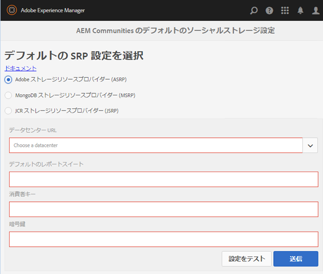

# ASRP - Adobe ストレージリソースプロバイダー {#asrp-adobe-storage-resource-provider}

## ASRP について {#about-asrp}

AEM Communitiesが共通ストアとしてASRPを使用するように設定されている場合、ユーザー生成コンテンツ(UGC)は、すべてのオーサーインスタンスとパブリッシュインスタンスからアクセスでき、同期や複製は不要です。

[SRP オプションの特性](/help/communities/working-with-srp.md#characteristics-of-srp-options)と[推奨されるトポロジ](/help/communities/topologies.md)も参照してください。

## 要件 {#requirements}

ASRP の使用には追加ライセンスが必要です。

UGCにASRPを使用するようにAEM Communitiesサイトを設定するには、次の点についてアカウント担当者にお問い合わせください。

* データセンター URL（ASRP エンドポイントのアドレス）
* 消費者キー
* 秘密鍵
* レポートスイート ID

消費者キーと秘密鍵は、企業の全レポートスイート間で共通です。テナントごとに1つのレポートスイートがあります。

## 設定 {#configuration}

### ASRP の選択 {#select-asrp}

[ストレージ設定コンソール](/help/communities/srp-config.md) では、デフォルトのストレージ設定を選択できます。これにより、使用するSRPの実装が識別されます。

**AEM作成者インスタンスで：**

* グローバルナビゲーションから、 **[!UICONTROL ツール/コミュニティ/ストレージ設定]** に移動し、 **[!UICONTROL Adobeストレージリソースプロバイダ(ASRP)を選択し]**&#x200B;ます。

次の情報は、プロビジョニングプロセスから得られます。

* **データセンターURL**:プルダウンから、アカウント担当者が識別する本番データセンターを選択します。
* **デフォルトのレポートスイート**:デフォルトのレポートスイート名を入力します。
* **Consumer key**:Consumer keyを入力します。
* **シークレット**:シークレットを入力します。
* 「**送信**」を選択します。

以下を実行してパブリッシュインスタンスを用意します。

* [暗号化キーを複製します](#replicate-the-crypto-key)
* [設定を複製する](#publishing-the-configuration)

設定を送信したら、以下の手順で接続をテストします。

* 「 **Test Config**」を選択します。

   作成者インスタンスと発行インスタンスごとに、ストレージ設定コンソールからデータセンターへの接続をテストします。

* Ensure that the site URLs for profile data are routable from the Data Center by [externalizing links](#externalize-links).

### 暗号鍵のレプリケーション {#replicate-the-crypto-key}

消費者キーと秘密鍵は暗号化されます。キーを正しく暗号化/復号化するためには、すべてのAEMインスタンスでプライマリGranite Cryptoキーが同じである必要があります。

Follow the instructions at [Replicate the Crypto Key](/help/communities/deploy-communities.md#replicate-the-crypto-key).

### リンクの外部向け変換 {#externalize-links}

For correct profile and profile image links, be sure to properly [Configure the Link Externalizer](/help/sites-developing/externalizer.md).

ドメインは、データセンターURL（ASRPエンドポイント）からルーティング可能なURLに設定してください。

### 時刻の同期 {#time-synchronization}

ASRP エンドポイントでの認証を正常におこなうには、[ネットワークタイムプロトコル（NTP）](https://www.ntp.org/)などを使用して、AEM Communities を実行しているマシンの時刻を同期する必要があります。

### 設定の公開 {#publishing-the-configuration}

すべてのオーサーインスタンスとパブリッシュインスタンスで、ASRP が共通ストアとして指定されている必要があります。

パブリッシュ環境で同一の設定を使用できるようにするには：

AEM作成者インスタンスで：

* Navigate from main menu to **[!UICONTROL Tools > Operations > Replication]**.
* Select **Activate Tree**
* **開始パス**:参照 `/etc/socialconfig/srpc/`
* 「変更 **済みのみ」の選択を解除**
* Select **Activate**

## AEM 6.0 からのアップグレード {#upgrading-from-aem}

>[!CAUTION]
>
>If you enable ASRP on a published community site, any UGC already stored in [JCR](/help/communities/jsrp.md) is no longer visible, as there is no synchronization of data between on-premise storage and cloud storage.

**`AEM Communities Extension`** は、AEM 6.0のソーシャルコミュニティでクラウドサービスとして以前に導入されています。 As of AEM 6.1 Communities, no cloud configuration is necessary, simply select ASRP from the [storage configuration console](/help/communities/srp-config.md).

新しいストレージ構造により、ソーシャルコミュニティからコミュニティにアップグレードするときは、[アップグレード](/help/communities/upgrade.md#adobe-cloud-storage)手順に従う必要があります。

## ユーザーデータの管理 {#managing-user-data}

パブリッシュ環境で頻繁に入力されるユーザー、ユーザープロファイルおよびユーザーグループについては、以下を参照してください。******

* [ユーザーの同期](/help/communities/sync.md)
* [ユーザーとユーザーグループの管理](/help/communities/users.md)

## トラブルシューティング {#troubleshooting}

### アップグレード後に UGC が表示されない {#ugc-disappears-after-upgrade}

If upgrading from an existing AEM 6.0 social community site, be sure to follow the [upgrade instructions](/help/communities/upgrade.md#adobe-cloud-storage), else UGC appears to be lost.

### 認証エラー {#authentication-errors}

データセンター URL に対する認証エラーを受け取り、また AEM error.log に古いタイムスタンプに関するメッセージが含まれている場合は、時刻の同期がおこなわれているかを確認してください。

Use a tool such as the [Network Time Protocol (NTP)](https://www.ntp.org/) to time synchronize all AEM author and publish servers.

### 新しいコンテンツが検索結果に表示されない {#new-content-does-not-appear-in-searches}

The Adobe cloud storage infrastructure uses *eventual consistency* to achieve its scaling and performance goals. このため、新しいコンテンツはすぐには利用できず、検索結果に表示されるまで数秒かかります。

最終的な一貫性に影響する間隔は監視されますが、新しいコンテンツが検索に表示されるまでに数秒以上かかる場合は、アカウント担当者にお問い合わせください。

### UGC が ASRP で表示されない {#ugc-not-visible-in-asrp}

ストレージオプションの設定を確認して、ASRPがデフォルトプロバイダーに設定されていることを確認します。 デフォルトでは、ストレージリソースプロバイダーはASRPではなくJSRPです。

すべての作成者および発行AEMインスタンスで、ストレージ設定コンソールに再度アクセスするか、AEMリポジトリを確認します。

In JCR, if [/etc/socialconfig](https://localhost:4502/crx/de/index.jsp#/etc/socialconfig/):

* Does not contain an [srpc](https://localhost:4502/crx/de/index.jsp#/etc/socialconfig/srpc) node, it means that the storage provider is JSRP.
* If the srpc node exists and contains node [defaultconfiguration](https://localhost:4502/crx/de/index.jsp#/etc/socialconfig/srpc/defaultconfiguration), the defaultconfiguration&#39;s properties define ASRP to be the default provider.

