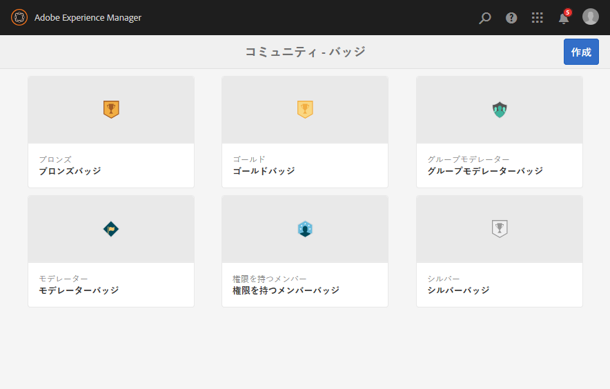
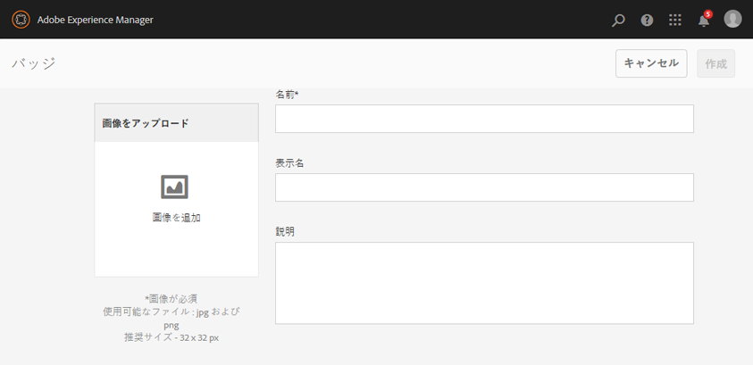

# バッジコンソール  {#badges-console}

## バッジについて {#about-badges}

Communities のバッジコンソールでは、バッジを獲得（授与された）したとき、またはコミュニティで特定の役割についた（割り当てられた）ときにメンバーに表示できるカスタムバッジを追加できます

### バッジの表示  {#badge-visibility}

現在、コミュニティメンバーが獲得するバッジ、またはコミュニティメンバーに割り当てられるバッジは、次の場所にメンバーの名前とアバターとともに表示されます。

* プロファイル
* [フォーラム](/help/communities/forum.md)
* [Q&amp;A](/help/communities/working-with-qna.md)
* [リーダーボード](/help/communities/enabling-leaderboard.md)
* [アイディエーション](/help/communities/ideation-feature.md)

作成者環境で、バッジコンソールに移動します。

* グローバルナビゲーションから：**[!UICONTROL ツール]** > **[!UICONTROL コミュニティ]** > **[!UICONTROL バッジ]**

このコンソールでは、現在利用可能なバッジが表示され、新しいバッジを追加できます。

## バッジを作成 {#create-badge}

バッジを作成するには、適度に小さい画像（高さが 26 から 32 ピクセルの 72 dpi）をアップロードし、名前を入力します。バッジ画像は`/libs/settings/community/badging/images`のリポジトリに保存され、自動的に公開環境に複製されます。

パブリッシュ環境がパブリッシャーのファームである場合、[ユーザーの同期](/help/communities/sync.md)を設定する必要があります。

* **画像をアップロード**

   （*必須*）JPEGまたはPNG形式で、推奨サイズが32 x 32ピクセル、72 dpiのバッジ画像。

* **名前**

   （*必須*）バッジ名。 これはデフォルトの`Display Name`とリポジトリノード名です。 `Name`が有効なリポジトリノード名でない場合は、変更されます。

* **表示名**

   （*オプション*） UIにバッジとして表示する名前。 デフォルトは、`Name`に対して入力された変更なしのテキストです。

* **説明**

   （*オプション*）バッジの説明。

## 追加情報 {#additional-information}

スコアリングルールとバッジルールの設定について詳しくは、[スコアリングとバッジ](/help/communities/implementing-scoring.md)を参照してください。

メンバーのバッジの管理については、[メンバーコンソール](/help/communities/members.md)を参照してください。
