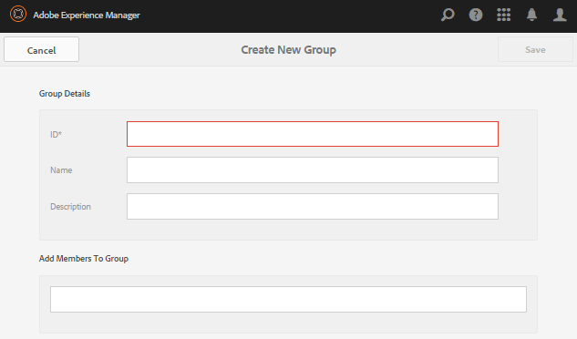

# バッジコンソール {#badges-console}

## バッジについて {#about-badges}

Communities のバッジコンソールでは、バッジを獲得（授与された）したとき、またはコミュニティで特定の役割についた（割り当てられた）ときにメンバーに表示できるカスタムバッジを追加できます

### バッジの表示 {#badge-visibility}

現在、コミュニティメンバーが獲得するバッジ、またはコミュニティメンバーに割り当てられるバッジは、次の場所にメンバーの名前とアバターとともに表示されます。

* プロファイル
* [フォーラム](/help/communities/forum.md)
* [Q&amp;A](/help/communities/working-with-qna.md)
* [リーダーボード](/help/communities/enabling-leaderboard.md)
* [アイディエーション](/help/communities/ideation-feature.md)

作成者環境で、バッジコンソールに移動します。

* From global navigation: **[!UICONTROL Tools]** > **[!UICONTROL Communities]** > **[!UICONTROL Badges]**

このコンソールでは、現在利用可能なバッジが表示され、新しいバッジを追加できます。

## バッジを作成 {#create-badge}

バッジを作成するには、適度に小さい画像（高さが 26 から 32 ピクセルの 72 dpi）をアップロードし、名前を入力します。The badge image is stored in the repository at `/libs/settings/community/badging/images` and is automatically replicated to the publish environment.

パブリッシュ環境がパブリッシャーのファームである場合、[ユーザーの同期](/help/communities/sync.md)を設定する必要があります。

* **画像をアップロード**

   (*Required*) A badge image with a recommended size of 32 x 32 pixels at 72dpi in either the JPEG or PNG format.

* **名前**

   (*Required*) The badge name. It is the default `Display Name` as well as the repository node name. If the `Name` is not a valid repository node name, it will be modified.

* **表示名**

   (*Optional*) The name to display for the badge in the UI. Default is the unaltered text entered for the `Name`.

* **説明**

   (*Optional*) A description for the badge.

## 追加情報 {#additional-information}

For details on setting up scoring and badging rules, see [Scoring and Badges](/help/communities/implementing-scoring.md).

メンバーのバッジの管理については、[メンバーコンソール](/help/communities/members.md)を参照してください。
