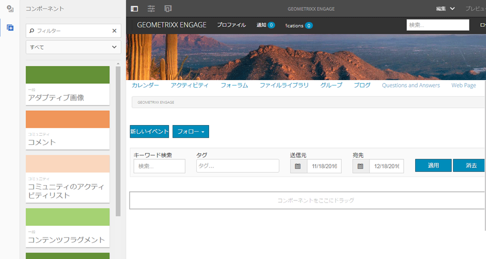
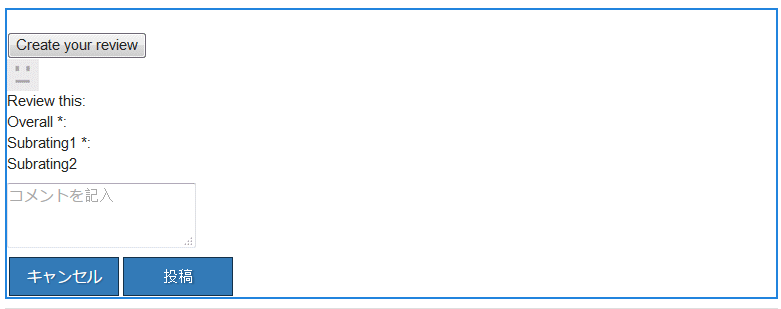

# コミュニティコンポーネントの基本 {#communities-components-basics}

## 概要 {#overview}

このドキュメントのオーサリングセクションでは、オーサリング編集モードでの  AEM sites へのコミュニティ機能の付加や、コンポーネント設定の記述について説明します。

Components may be explored using an AEM instance and the interactive [Community Components guide](components-guide.md).

## コミュニティコンポーネントへのアクセス {#accessing-communities-components}

ページコンテンツをオーサリングするときに、基になるテンプレートがページのデザイン変更を許可している場合は、コンポーネントブラウザーにまだ表示されていないコンポーネントをサイトデザインの一部として有効にできます。

使用可能なコミュニティコンポーネントは[こちら](author-communities.md#available-communities-components)を参照してください。

>[!NOTE]
>
>For general authoring information, view the [quick guide to authoring pages](../../help/sites-authoring/qg-page-authoring.md).
>
>AEM に精通していない場合は、[基本操作](../../help/sites-authoring/basic-handling.md)に関するドキュメントを参照してください。

### デザインモードの開始 {#entering-design-mode}

If a **Communities** component is not found in the components browser (sidekick), it will be necessary to enter `Design Mode` to add other Communities components. [必要なクライアント側ライブラリ](#required-clientlibs) (clientlibs)も追加する必要がある場合があります。

For details, see [Configuring Components in Design Mode](../../help/sites-authoring/default-components-designmode.md).

次の図に、いくつかのコミュニティコンポーネントを選択して、コンポーネントブラウザーに表示する操作を示します。

選択したコンポーネントがコンポーネントブラウザーに表示されるようになりました。

## 必須の clientlibs {#required-clientlibs}

コンポーネントを正しく機能させ（JavaScript）、スタイル設定する（CSS）には、[クライアント側ライブラリ](../../help/sites-developing/clientlibs.md)（clientlibs）が必要です。

コミュニティコンポーネントをページに追加して、結果がエラーまたは予期せぬ表示になった場合は、まずコミュニティコンポーネントに必須の clientlibs の追加を試みてください。For details, see [Clientlibs for Communities Components](clientlibs.md).

### Example: Initially placed reviews without client libraries... {#example-initially-placed-reviews-without-client-libraries}

### ... And with client libraries {#and-with-client-libraries}

## タグ付け {#tagging}

パブリッシュ環境に入力（投稿）されたコンテンツへのタグ付けを許可するために、多くのコミュニティ機能を設定できます。

タグ付けが許可されている場合は、パブリッシュ環境でメンバーに表示する名前空間を制限するようにコミュニティサイトを設定できます。See the [Community Sites console](sites-console.md#tagging).

Features which allow tagging: [blog](blog-feature.md), [calendar](calendar.md), [file library](file-library.md), [forum](forum.md)

Features which use tags: [catalog](catalog.md), [search](search.md), [social tag cloud](tagcloud.md)

オーサリングに関する情報：

* [タグの使用](../../help/sites-authoring/tags.md)

管理に関する情報：

* Creating tag namespaces (taxonomy): [Administering Tags](../../help/sites-administering/tags.md)
* Community Site configuration: see [TAGGING](sites-console.md#tagging)
* [ユーザー生成コンテンツのタグ付け](../../help/sites-authoring/tags.md)
* [イネーブルメントリソースのタグ付け](tag-resources.md)

開発者向けの情報：

* [AEM タグ付けフレームワーク](../../help/sites-developing/framework.md)
* [タグ付けの基本事項](tag.md)

