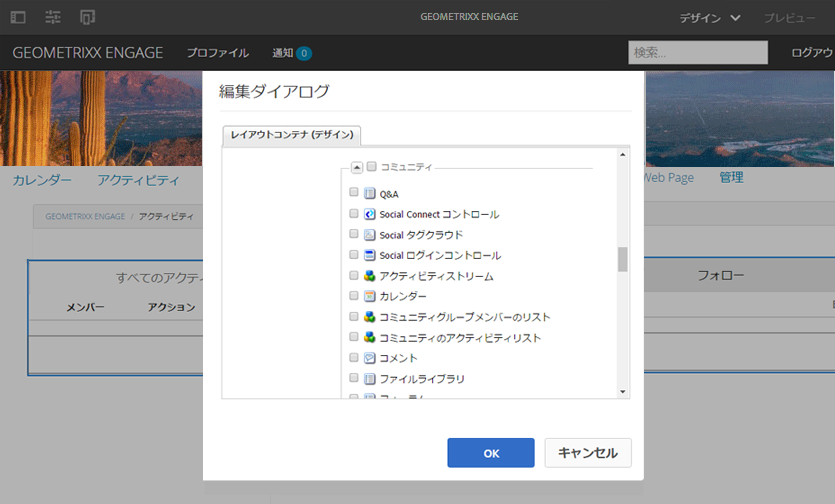

# コミュニティコンポーネントの基本 {#communities-components-basics}

## 概要 {#overview}

このドキュメントのオーサリングセクションでは、オーサリング編集モードでの  AEM sites へのコミュニティ機能の付加や、コンポーネント設定の記述について説明します。

コンポーネントは、AEMインスタンスとインタラクティブな[コミュニティコンポーネントガイド](components-guide.md)を使用して確認できます。

## コミュニティコンポーネントへのアクセス {#accessing-communities-components}

ページコンテンツをオーサリングするときに、基になるテンプレートがページのデザイン変更を許可している場合は、コンポーネントブラウザーにまだ表示されていないコンポーネントをサイトデザインの一部として有効にできます。

使用可能なコミュニティコンポーネントは[こちら](author-communities.md#available-communities-components)を参照してください。

>[!NOTE]
>
>一般的なオーサリング情報については、[オーサリングページのクイックガイド](../../help/sites-authoring/qg-page-authoring.md)を表示してください。
>
>AEM に精通していない場合は、[基本操作](../../help/sites-authoring/basic-handling.md)に関するドキュメントを参照してください。

### デザインモードの開始  {#entering-design-mode}

**Communities**&#x200B;コンポーネントがコンポーネントブラウザー（サイドキック）に見つからない場合は、`Design Mode`と入力して、他のCommunitiesコンポーネントを追加する必要があります。 [必要なクライアント側ライブラリ](#required-clientlibs) (clientlibs)も追加する必要がある場合があります。

詳しくは、「[デザインモードでのコンポーネントの設定](../../help/sites-authoring/default-components-designmode.md)」を参照してください。

次の図に、いくつかのコミュニティコンポーネントを選択して、コンポーネントブラウザーに表示する操作を示します。

選択したコンポーネントがコンポーネントブラウザーに表示されるようになりました。

## 必須の clientlibs {#required-clientlibs}

コンポーネントを正しく機能させ（JavaScript）、スタイル設定する（CSS）には、[クライアント側ライブラリ](../../help/sites-developing/clientlibs.md)（clientlibs）が必要です。

コミュニティコンポーネントをページに追加して、結果がエラーまたは予期せぬ表示になった場合は、まずコミュニティコンポーネントに必須の clientlibs の追加を試みてください。詳しくは、[CommunitiesのClientlibs ](clientlibs.md)を参照してください。

### 例：最初に配置されたレビューにクライアントライブラリはありません… {#example-initially-placed-reviews-without-client-libraries}

### ...クライアントライブラリ{#and-with-client-libraries}

## タグ付け {#tagging}

パブリッシュ環境に入力（投稿）されたコンテンツへのタグ付けを許可するために、多くのコミュニティ機能を設定できます。

タグ付けが許可されている場合は、パブリッシュ環境でメンバーに表示する名前空間を制限するようにコミュニティサイトを設定できます。[コミュニティサイトコンソール](sites-console.md#tagging)を参照してください。

タグ付けが可能な機能：[ブログ](blog-feature.md)、[カレンダー](calendar.md)、[ファイルライブラリ](file-library.md)、[フォーラム](forum.md)

タグを使用する機能：[カタログ](catalog.md)、[検索](search.md)、[ソーシャルタグcloud](tagcloud.md)

オーサリングに関する情報：

* [タグの使用](../../help/sites-authoring/tags.md)

管理に関する情報：

* タグ名前空間（分類）の作成：[タグの管理](../../help/sites-administering/tags.md)
* コミュニティサイトの設定：[タグ付け](sites-console.md#tagging)を参照
* [ユーザー生成コンテンツのタグ付け](../../help/sites-authoring/tags.md)
* [イネーブルメントリソースのタグ付け](tag-resources.md)

開発者向けの情報：

* [AEM タグ付けフレームワーク](../../help/sites-developing/framework.md)
* [タグ付けの基本事項](tag.md)

