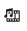

# ブログの基本事項 {#blog-essentials}

AEM 6.1 Communitiesの時点で、ブログはコミュニティアクティビティです。 ブログ記事は公開環境から投稿されるようになりました。以前は、ブログ記事は作成者環境でのみ作成され、公開できました。

特権を持つメンバーに制限されない限り、どのコミュニティのメンバーでもブログ記事が作成できるようになりました。

このページでは、ブログ機能の操作に関する基本情報をまとめています。

>[!NOTE]
>
>ブログ機能の基礎となるインフラストラクチャはジャーナル機能です。

## クライアント側の基本事項 {#essentials-for-client-side}

ブログ機能は 2 つの主要コンポーネントで構成されます。これらのコンポーネントは、[ブログ機能](/help/communities/functions.md#blog-function)を追加するか、オーサーインスタンスの編集モードでページに追加することによって使用可能になります。

### ブログ {#blog}

<table>
 <tbody>
  <tr>
   <td> <strong>resourceType</strong></td>
   <td>social/journal/components/hbs/journal</td>
  </tr>
  <tr>
   <td> <a href="/help/communities/scf.md#add-or-include-a-communities-component"><strong>インクルード可能</strong></a></td>
   <td>不可</td>
  </tr>
  <tr>
   <td> <a href="/help/communities/clientlibs.md"><strong>clientllibs</strong></a></td>
   <td>cq.ckeditor  cq.social.hbs.voting  cq.social.hbs.journal</td>
  </tr>
  <tr>
   <td> <strong>テンプレート</strong></td>
   <td> /libs/social/journal/components/hbs/journal/journal.hbs  /libs/social/journal/components/hbs/entry_topic/list-item.hbs</td>
  </tr>
  <tr>
   <td> <strong>css</strong></td>
   <td> /libs/social/journal/components/hbs/journal/clientlibs/journal.css</td>
  </tr>
  <tr>
   <td><strong> properties</strong></td>
   <td>see <a href="/help/communities/blog-feature.md">Blog Feature</a></td>
  </tr>
 </tbody>
</table>

### ブログのサイドバー {#blog-sidebar}

| **resourceType** | social/journal/components/hbs/sidebar |
|---|---|
| [**インクルード可能**](/help/communities/scf.md#add-or-include-a-communities-component) | 不可 |
| [**clientllibs**](/help/communities/clientlibs.md) | cq.social.hbs.journal_sidebar |
| **テンプレート** | /libs/social/journal/components/hbs/sidebar/sidebar.hbs |
| **css** | /libs/social/journal/components/hbs/sidebar/clientlibs/sidebar.css |
| **プロパティ** | see [Blog Feature](/help/communities/blog-feature.md) |

* [クライアント側のカスタマイズ](/help/communities/client-customize.md)

## サーバー側の基本事項 {#essentials-for-server-side}

* [ブログ API](https://helpx.adobe.com/experience-manager/6-5/sites/developing/using/reference-materials/javadoc/com/adobe/cq/social/journal/client/api/package-summary.html)

* [ブログエンドポイント](https://helpx.adobe.com/experience-manager/6-5/sites/developing/using/reference-materials/javadoc/com/adobe/cq/social/journal/client/endpoints/package-summary.html)

* [サーバー側のカスタマイズ](/help/communities/server-customize.md)

### ブログ機能 {#blog-function}

A community site structure that includes the [Blog function](/help/communities/functions.md#blog-function) will have configured `Blog` and `Blog Sidebar` components. The Blog function supports identifying a [privileged member user group](/help/communities/users.md#privileged-members-group).

### Accessing Blog Entries (UGC) {#accessing-blog-entries-ugc}

UGC は、標準モデレート方法のいずれかを使用してモデレートする必要があります。[ユーザー生成コンテンツのモデレート](/help/communities/moderate-ugc.md)を参照してください。

AEM 6.1 Communities 以降では、UGC の[共通ストア](/help/communities/working-with-srp.md)を使用する際に、選択されたストレージオプション（ASRP、MSRP、JSRP など）に関係なく、プログラムによって UGC にアクセスする必要があります。

**リポジトリ内の UGC の場所と形式は予告なく変更されることがあります**。

次のページを参照してください。

* [ストレージリソースプロバイダーの概要](/help/communities/srp.md) - 序論とリポジトリの使用方法の概要.
* [SRPとUGC Essentials](/help/communities/srp-and-ugc.md) - SRPユーティリティのメソッドと例。
* [SRPを使用したUGCへのアクセス](/help/communities/accessing-ugc-with-srp.md) — コーディングガイドライン。
* [SocialUtils のリファクタリング](/help/communities/socialutils.md) - 廃止されたユーティリティメソッドと現在の SRP ユーティリティメソッドの対応関係.

## プライマリパブリッシャー {#primary-publisher}

デプロイメントがパブリッシュファームである場合、公開予定の記事をポーリングするプライマリパブリッシャーを識別する必要があります。

詳しくは、[プライマリパブリッシャー](/help/communities/deploy-communities.md#primary-publisher)を参照してください。

## リッチメディアの許可 {#allowing-rich-media}

AEM プラットフォームでは、次に説明するように、XSS 攻撃を防止する目的でその他の Web サイトからのリンクがブロックされます。

* [クロスサイトスクリプティング（XSS）に対する保護](/help/sites-developing/security.md#protect-against-cross-site-scripting-xss)

AEM 6.2以降、手動で行う必要があった変更は、デフォルトのAntiSamy設定ファイルに含まれます。

リッチメディアは、次のアイコンを選択してブログ記事に埋め込まれ `Embed Media from External Sites` ます。

