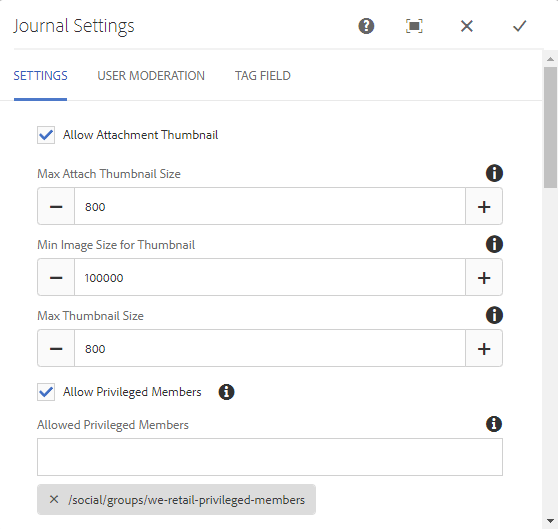

# ブログ機能{#blog-feature}

## 概要 {#introduction}

AEM Communities のブログ機能は、オーサリングアクティビティから、パブリッシュ環境でおこなわれるコミュニティアクティビティへと変わりました。

ブログ機能は、ジャーナル形式でのコミュニティ情報の提供をサポートします。ブログエントリは、公開環境で、許可されたメンバー（登録されたログインユーザー）によって作成されます。

ブログ機能では以下のことが可能です。

* パブリッシュ側でのブログ記事とコメントの作成
* リッチテキスト編集
* インライン画像（ドラッグアンドドロップのサポートあり）
* 埋め込みソーシャルネットワーキングコンテンツ（[oEmbed のサポート](/help/communities/blog-developer-basics.md#allowing-rich-media)）
* ドラフトモード
* 日時指定公開
* 代理作成（[権限を持つメンバー](/help/communities/users.md#privileged-members-group)が他のコミュニティメンバーの代わりにコンテンツを作成できる）
* ブログ記事やコメントの[コンテキスト内モデレートと一括モデレート](/help/communities/moderate-ugc.md)

ドキュメントのこのセクションでは、以下の内容について説明します。

* AEM サイトへのブログ機能の追加
* ブログコンポーネントの設定

>[!NOTE]
>
>コンポーネン `Journal`トとタ `Journal Sidebar` イトルはと `Blog` になりま `Blog Sidebar`す。
>
>AEM 6.0 以前のリリースのブログ機能は、現在は削除されています。テンプレートに基づいており、作成者のみが作成者環境でコンテンツを作成できました。

## ブログコンポーネントをページに追加 {#adding-blog-components-to-a-page}

作成者モードでページにブログを追加する場合は、コンポーネントブラウザを使用して、

* `Communities / Blog`
* `Communities / Blog Sidebar`

ページ上のブログを表示したい位置にドラッグします。

For necessary information, visit [Communities Components Basics](/help/communities/basics.md).

When the [required client-side libraries](/help/communities/blog-developer-basics.md#essentials-for-client-side) are included, this is how the `Blog`component will appear :

そして、どのよう `Blog Sidebar` に表示されるか。

### ブログの設定 {#configuring-blog}

Select the placed `Blog` component to access and select the `Configure` icon which opens the edit dialog.

 

#### 「設定」タブ{#settings-tab}

「**設定**」タブでは、以下に示すブログの基本機能を指定します。

* **添付サムネールを許可** オンにすると、添付された画像のサムネールが作成されます。

* **添付サムネールの最大サイズ** 添付サムネール画像の最大サイズ（ピクセル単位）です。デフォルト値は、800 x 800 です。
* **サムネールの最小画像サイズ**&#x200B;インライン画像のサムネールを生成するための画像の最小サイズ（バイト単位）。 デフォルト値は100000バイト(100 KB)です。
* **Max Thumbnail Sizeインラ**&#x200B;イン画像のサムネール画像の最大サイズ（ピクセル単位）。 デフォルト値は、800 x 800 です。
* **「Allow Privileged Members**」を選択すると、「Privileged Members」のみがコンテンツの作成を許可されます。
* **許可された権限を持つメンバー**&#x200B;コンテンツの作成を許可された、権限を持つメンバーを追加します。
* **作成者編集モードでのユーザー生成コンテンツのブロック**&#x200B;有効な場合、作成者モードでの編集中にユーザー生成コンテンツがブロックされます。

* **ジャーナルタイトル**&#x200B;ページに表示されるブログのタイトルです。

>[!NOTE]
>
>ジャーナルタイトルは、ブログ用の URL を自動的に作成するために使用されます。
>ここで指定するジャーナルタイトルから、ブログのURLを作成する際に使用する最大50文字（一意性を確保するために5文字を含む）。

* **ジャーナルの説明**ブログの説明。
* **1 ページのトピック数** 1 ページに表示されるブログエントリまたはコメントの数を定義します。デフォルトは、10 です。

* **モデレート**&#x200B;オンにすると、公開したサイトにブログエントリおよびコメントの投稿を表示する前に承認が必要になります。デフォルトはオフです。

* **閉じる**&#x200B;オンにすると、ブログは新しいブログエントリやコメントを受け付けなくなります。初期設定はオフです。

* **リッチテキストエディター**&#x200B;オンにすると、マークアップを使用してブログエントリおよびコメントを入力できます。初期設定はオンです。

* **タグ付けを許可**&#x200B;オンにすると、メンバーは自分の投稿にタグラベルを付加できます（「**タグフィールド**」タブを参照）。初期設定はオフです。

* **ファイルのアップロードを許可**&#x200B;オンにすると、ブログエントリまたはコメントに添付ファイルを付加できます。初期設定はオフです。

* **「Max File Size** Relevant only if `Allow File Uploads` is」をオンにした場合。 このフィールドは、アップロードするファイルのサイズ（バイト単位）を制限します。 初期設定は104857600(10 Mb)です。

* **「Allowed File Types** Relevant only if `Allow File Uploads` 」がオンの場合。 ドット付きのファイル拡張子をコンマ区切りで指定します（例：.jpg, .jpeg, .png, .doc, .docx, .pdf）。ファイルタイプを指定した場合、指定しなかったファイルはアップロードできません。 初期設定は、** **すべてのファイルタイプを許可するように指定されていない。

* **「ファイルのアップロードを許可」がオン**&#x200B;になっている場合にのみ、「添付画像ファイルの最大サイズ」が関連します。 アップロードされた画像ファイルの最大バイト数。 初期設定は2097152** **(2 Mb)です。

* **応答を許可**&#x200B;オンにすると、ブログエントリに投稿されたコメントに返信できます。初期設定はオフです。

* **投票を許可**&#x200B;オンにすると、ブログエントリに投票機能が含められます。初期設定はオフです。

* **ユーザーによるコメントおよびトピックの削除を許可**&#x200B;オンにすると、メンバーは自分が投稿したコメントおよびブログエントリを削除できます。初期設定は** **オフです。

* **フォローを許可**&#x200B;オンにすると、ブログ記事にフォロー機能が追加され、新しい投稿があった場合にメンバーに[通知](/help/communities/notifications.md)できるようになります。初期設定はオフです。

* **電子メール購読を許可**&#x200B;オンにすると、新しい投稿があった場合にメンバーに電子メールで通知できるようになります（[購読](/help/communities/subscriptions.md)）。Requires `Allow Following` to be checked and [email configured](/help/communities/email.md). 初期設定はオフです。

* **バッジを表示**&#x200B;オンにすると、獲得した[バッジ](/help/communities/implementing-scoring.md)と割り当てられたバッジがメンバーのブログエントリに表示されます。初期設定はオフです。

* **リストページで返信を取得しない**
* **おすすめコンテンツを許可**&#x200B;オンにすると、アイデアを[おすすめコンテンツ](/help/communities/featured.md)として指定できます。初期設定はオフです。

* **「メンション**&#x200B;を有効にする」を有効にすると、登録済みコミュニティユーザーは、他の登録済みメンバー（名、姓、ユーザー名を使用）を識別し、共通の@user-name構文を使用してタグ付けできます。 タグ付きユーザーは、メンションに関する通知を受信します。

* **最大メンション**：投稿で許可されるメンションの最大数を制限します。 初期設定は 10 です。

* **UIメンションパターン**：投稿内の登録ユーザーにタグ付け(@mention)するために許可されたパターン文字列を指定します。 例：～{{familyName}}{{givenName}}

#### 「ユーザーモデレート」タブ{#user-moderation-tab}

「**ユーザーモデレート**」タブでは、以下のモデレート設定を指定します。

* **投稿を拒否**&#x200B;オンにすると、信頼されているメンバーモデレーターが投稿を拒否して、公開フォーラムへの表示を止めることができます。初期設定はオフです。

* **トピックを閉じる／再度開く**&#x200B;オンにすると、信頼されているメンバーモデレーターが、トピックをそれ以上編集およびコメントできないように閉じたり、再度開いたりすることができます。初期設定はオフです。

* **投稿にフラグを設定**&#x200B;オンにすると、メンバーは他のメンバーのトピックまたはコメントに「不適切」のフラグを設定できます。初期設定はオフです**.**

* **フラグ設定理由リスト**&#x200B;オンにすると、メンバーはトピックまたはコメントに「不適切」のフラグを設定した理由をドロップダウンリストから選択できます。初期設定はオフです。

* **カスタムフラグ設定理由**&#x200B;オンにすると、メンバーはトピックまたはコメントに「不適切」のフラグを設定した独自の理由を入力できます。初期設定はオフです**.**

* **モデレートのしきい値**&#x200B;メンバーがトピックまたはコメントに何回フラグを設定したらモデレーターに通知するかを指定します。初期設定は1（1回）です。

* **フラグ付けの制限**&#x200B;トピックまたはコメントに何回フラグが設定されたら、公開表示から非表示にするかを指定します。-1に設定した場合、フラグ付けされたトピックまたはコメントは公開ビューで非表示になりません。 そうでない場合、この数値はモデレートのしきい値以上にする必要があります。 初期設定は 5 です。

#### 「タグフィールド」タブ{#tag-field-tab}

「**タグフィールド**」タブでは、「**設定**」タブで「**タグ付けを許可**」がオンの場合に適用できるタグを指定します。

* ****Settings ****&#x200B;タブでチェ `Allow Tagging` ック済みの場合は、「Namespaces Relevant」を使用できます。 適用できるタグは、チェックされた名前空間カテゴリ内のタグに制限されます。 名前空間のリストには、「Standard Tags」（デフォルトの名前空間）と「Include All Tags」が含まれます。 初期設定はnoneで、すべての名前空間が許可されます。

* **推奨の制限**&#x200B;フォーラムに投稿するメンバーに表示する推奨タグの数を入力します。-1 は無制限を意味します。初期設定は 0 です。

### ブログのサイドバーの設定 {#configuring-blog-sidebar}

When you double-click the `Blog Sidebar` component, an edit dialog opens up.

「**ジャーナルサイドバー設定**」タブでは、アーカイブの日付の形式と、サイドバーに表示するエントリのタイプを指定します。

* **日付の形式**&#x200B;ブログエントリのアーカイブの表示に使用する形式です。Java 表記法に従って、プレースホルダーを使用します。

   * yyyy：4 桁の西暦（例：2015）
   * yy：西暦の下 2 桁（例：15）
   * MMMMM：月の正式名（例：June）
   * MMM：月の短縮名（例：Jun）
   * MM：月の数字（例：06）
   初期設定は「yyyy MMMMM」です。これは「2015 June」のように表示されます。

* **表示タイプ**&#x200B;サイドバーに表示するブログエントリのタイトルとタイプです。選択肢は次のとおりです。

   * 作成者
   * カテゴリ
   * アーカイブ

* **ブロッグコンポーネントパス**
   *(オプション* )ブログ記事のリスト元となるブログリソースの場所。 If left blank, will use the component of resourceType `social/journal/components/hbs/journal` that appears on the same page.

   * for example, `/content/sites/engage/en/blog/jcr:content/content/primary/blog`

* **推奨の制限**&#x200B;表示するブログ記事の数。-1 は無制限を意味します。初期設定は -1 です。

## サイト訪問者のエクスペリエンス {#site-visitor-experience}

パブリッシュ環境では、ブログ記事は作成の降順に表示されます（最新のブログ記事の後に、古いブログ記事が表示されます）。ブログのサイドバーを使用すると、サイトの訪問者はフィルタを適用して、表示されるブログ記事の選択を制限できます。

ブログ記事の下には、コメントを投稿または表示するためのリンクが表示されます。

ブログ記事を選択すると、そのブログ記事とコメントが表示されます（有効な場合）。

その他の機能は、サイト訪問者がモデレーターか、管理者か、コミュニティメンバーか、権限を持つメンバーか、匿名かによって異なります。

### 記事の操作 {#working-with-articles}

新しいブログ記事を作成するときには、公開方法を以下の中から選択できます。

1. 即時公開する
1. ドラフトを公開する
1. 指定された日時に公開する

ブログ記事は、それぞれ適切なタブ（公開済み、ドラフト、スケジュール済み）で、パブリッシュ環境でオーサリングできるメンバー向けに表示されます。

#### モデレーターおよび管理者 {#moderators-and-administrators}

サインインしているユーザーがモデレーター権限または管理者権限を持っている場合、そのユーザーは、すべてのブログ記事およびブログに投稿されたコメントに対して[モデレートタスク](/help/communities/moderate-ugc.md)を実行できます（実行可能な操作はコンポーネントの設定に従います）。

#### メンバー {#members}

When the signed in user is a community member or [privileged member](/help/communities/users.md#privileged-members-group) (depending on configuration), they are able to select `New Article` to create and post a new blog article.

具体的には、次のことが可能です。

* 新しいブログ記事を作成する
* 別のメンバーの代わりに新しいブログ記事を投稿する
* ブログ記事にコメントを投稿する
* 自分のブログ記事またはコメントを編集する
* 自分のブログ記事またはコメントを削除する
* 他のメンバーのブログ記事またはコメントにフラグを設定する

 

#### 匿名 {#anonymous}

サインインしていないサイト訪問者は、投稿されたブログ記事やコメントを閲覧することしかできず（サポートされている場合は翻訳も可）、ブログ記事やコメントを追加したり、他人の記事やコメントにフラグを設定することはできません。

## 追加情報 {#additional-information}

開発者向けの詳細情報は、[ブログの基本事項](/help/communities/blog-developer-basics.md)ページを参照してください。

ブログエントリとコメントのモデレートについては、[ユーザー生成コンテンツのモデレート](/help/communities/moderate-ugc.md)を参照してください。

ブログエントリとコメントのタグ付けについては、[ユーザー生成コンテンツのタグ付け](/help/communities/tag-ugc.md)を参照してください。

ブログエントリとコメントの翻訳については、[ユーザー生成コンテンツの翻訳](/help/communities/translate-ugc.md)を参照してください。
