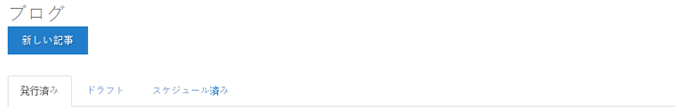
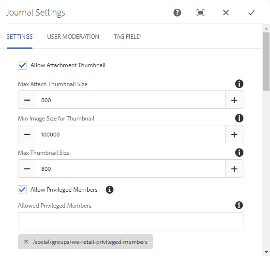
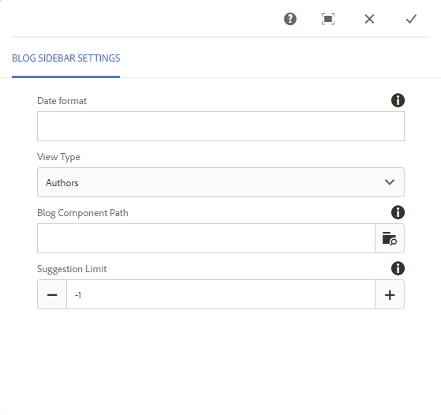
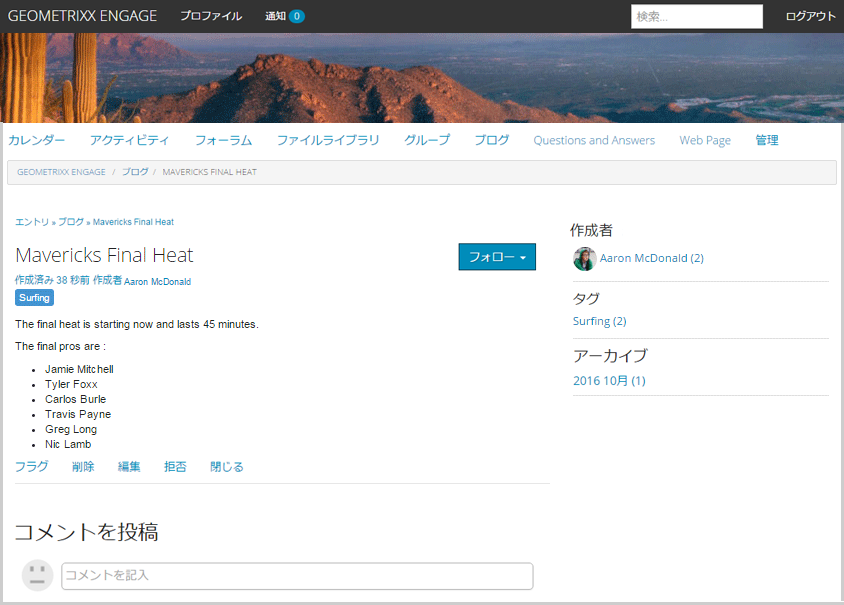
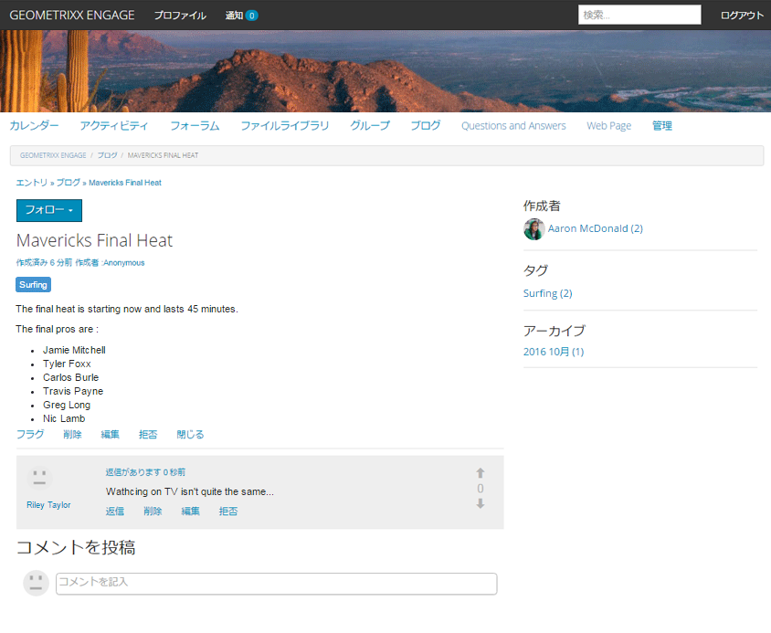
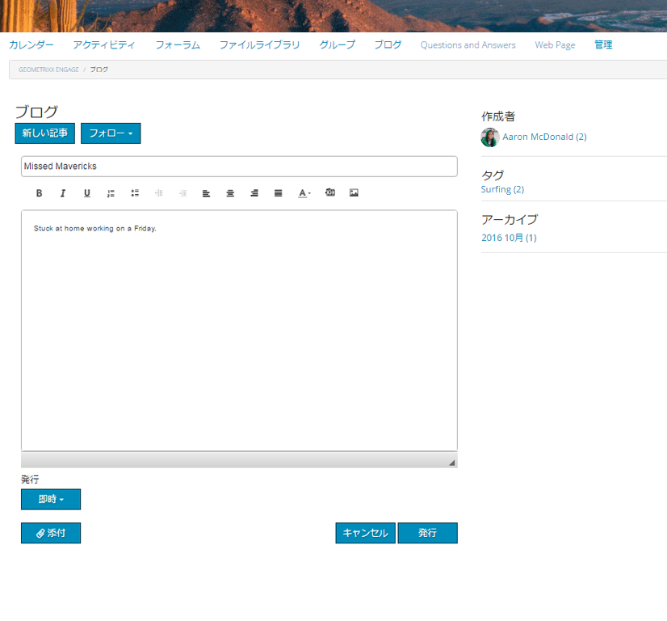
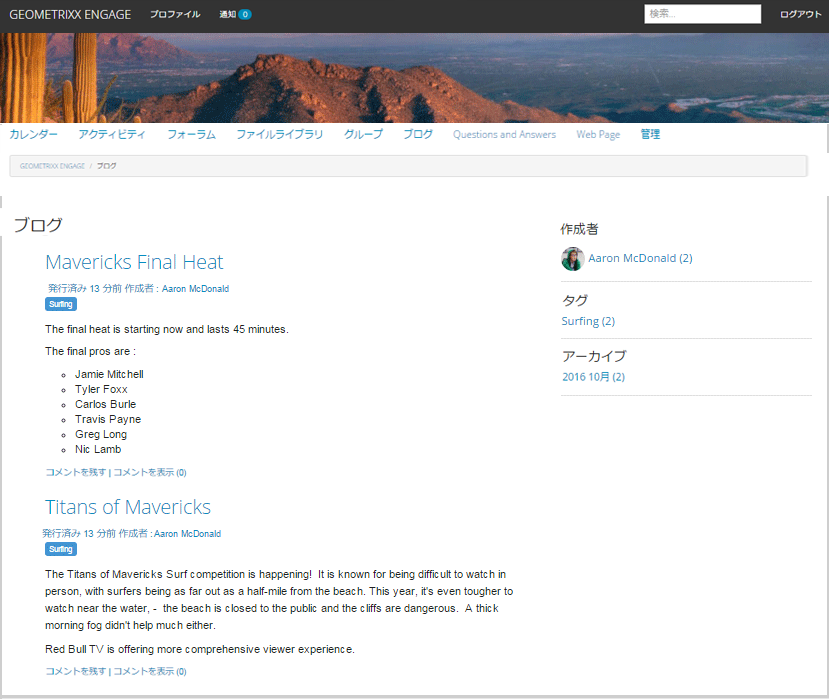

# ブログ機能 {#blog-feature}

## はじめに {#introduction}

AEM Communitiesのブログ機能は、オーサリングアクティビティから、パブリッシュ環境で行われる真のコミュニティアクティビティへと変化しました。

このブログ機能は、ジャーナリング形式でのコミュニティ情報の提供をサポートしています。 ブログエントリは、承認済みメンバー（登録ユーザー、サインインユーザー）がパブリッシュ環境で作成します。

ブログ機能では、次の機能を提供しています。

* ブログ記事やコメントのパブリッシュ側での作成
* リッチテキスト編集
* インライン画像（ドラッグ&amp;ドロップ対応）
* 埋め込みソーシャルネットワーキングコンテンツ （[埋め込みサポート ](/help/communities/blog-developer-basics.md#allowing-rich-media)）
* ドラフトモード
* スケジュール済み公開
* 代理で作成（権限を持つ[ メンバー](/help/communities/users.md#privileged-members-group)は、別のコミュニティメンバーの代理でコンテンツを作成できます）
* ブログ記事とコメントの[ インコンテクストおよび一括モデレーション ](/help/communities/moderate-ugc.md)

この節では、次の内容について説明します。

* AEM サイトへのブログ機能の追加
* ブログコンポーネントの設定設定

>[!NOTE]
>
>コンポーネント `Journal`および`Journal Sidebar`のタイトルは`Blog`および`Blog Sidebar`です。
>
>AEM 6.0以前のリリースで見つかったブログ機能が削除されました。 テンプレートに基づいており、作成者が作成者環境でコンテンツを作成できるのは作成者のみでした。

## ページへのブログコンポーネントの追加 {#adding-blog-components-to-a-page}

オーサーモードでページにブログを追加する場合は、コンポーネントブラウザーを使用して

* `Communities / Blog`
* `Communities / Blog Sidebar`

ブログを表示するページにドラッグします。

必要な情報については、[ コミュニティコンポーネントの基本](/help/communities/basics.md)を参照してください。

[必要なクライアントサイドライブラリ ](/help/communities/blog-developer-basics.md#essentials-for-client-side)が含まれている場合、`Blog` コンポーネントは次のように表示されます。

### ブログの設定 {#configuring-blog}

配置された`Blog` コンポーネントを選択して、編集ダイアログボックスを開く`Configure` アイコンにアクセスして選択します。

#### 「設定」タブ {#settings-tab}

「**設定**」タブで、ブログの基本機能を指定します。

* **添付ファイルのサムネールを許可**

  オンにすると、添付された画像のサムネールが作成されます。

* **最大添付サムネールサイズ**

  添付ファイルのサムネール画像の最大サイズ（ピクセル単位）。 デフォルト値は800 x 800です。

* サムネール **の**&#x200B;最小イメージ サイズ

  インライン画像のサムネールを生成するための画像の最小サイズ（バイト単位）。 デフォルト値は100000 バイト（100 kb）です。

* **サムネールの最大サイズ**

  インライン画像のサムネール画像の最大サイズ（ピクセル単位）。 デフォルト値は800 x 800です。

* **特権メンバーを許可**

  オンにした場合、コンテンツの作成が許可されるのは特権メンバーのみです。

* **許可された特権メンバー**

  コンテンツの作成を許可する特権メンバーを追加します。

* **作成者編集モードでユーザー生成コンテンツをブロック**

  有効にすると、作成者モードでの編集中にユーザー生成コンテンツがブロックされます。

* **ジャーナルのタイトル**

  ページに表示するブログタイトル。

>[!NOTE]
>
>ジャーナルのタイトルは、ブログのURLを自動的に作成するために使用されます。
>
>ここで指定したジャーナルのタイトルから最大50文字（一意性のために5文字を追加）を使用して、ブログのURLを作成します。

* **ジャーナルの説明**

  ブログの説明です。

* **ページあたりのトピック**

  ページごとに表示されるブログエントリ/コメントの数を定義します。 デフォルトは10です。

* **モデレート**

  オンにした場合、ブログ記事とコメントの投稿は、公開サイトに表示される前に承認する必要があります。 デフォルトはオフになっています。

* **終了**

  オンにすると、新しいブログのエントリとコメントが閉じられます。 デフォルトはオフです。

* **リッチテキストエディター**

  オンにすると、ブログのエントリとコメントがマークアップを使用して入力される場合があります。 デフォルトはオンです。

* **タグ付けを許可**

  オンにした場合、メンバーが投稿にタグラベルを追加できるようにします（**タグフィールド** タブを参照）。 デフォルトはオフです。

* **ファイルのアップロードを許可**

  チェックを入れた場合は、ブログのエントリまたはコメントに添付ファイルを追加できます。 デフォルトはオフです。

* **最大ファイルサイズ**

  `Allow File Uploads`がチェックされている場合にのみ関連します。 このフィールドは、アップロードされたファイルのサイズ（バイト単位）を制限します。 デフォルトは104857600 （10 Mb）です。

* **許可されているファイル形式**

  `Allow File Uploads`がチェックされている場合にのみ関連します。 「ドット」区切り文字を持つファイル拡張子のコンマ区切りリスト。 例：.jpg、.jpeg、.png、.doc、.docx、.pdf。 任意のファイルタイプを指定した場合、指定されていないファイルタイプはアップロードできません。 デフォルトは、すべてのファイルタイプが許可されるように指定されていません。

* **最大アタッチ画像ファイル サイズ**

  「ファイルのアップロードを許可」がオンになっている場合にのみ関連します。 アップロードされた画像ファイルの最大バイト数。 デフォルトは2097152 （2 Mb）です。

* **返信を許可**

  オンにした場合、ブログエントリに投稿されたコメントへの返信を許可します。 デフォルトはオフです。

* **投票を許可**

  チェックを入れた場合は、投票機能をブログエントリに含めます。 デフォルトはオフです。

* **ユーザーによるコメントとトピックの削除を許可**

  オンにした場合、メンバーは投稿したコメントとブログエントリを削除できます。 デフォルトはオフです。

* **次を許可**

  チェックを入れた場合は、ブログ記事に次の機能を含めます。これにより、メンバーは新しい投稿を[通知](/help/communities/notifications.md)できます。 デフォルトはオフです。

* **メール配信の許可**

  チェックを入れた場合は、新しい投稿がメールでメンバーに通知されるようにします（[ サブスクリプション ](/help/communities/subscriptions.md)）。 `Allow Following`を確認し、電子メール [を設定する必要があります](/help/communities/email.md)。 デフォルトはオフです。

* **バッジの表示**

  チェックを入れた場合、メンバーのブログエントリで獲得および割り当てられた[ バッジ ](/help/communities/implementing-scoring.md)を表示します。 デフォルトはオフです。

* **リストページで返信を受け取らない**

* **おすすめのコンテンツを許可**

  チェックを入れると、アイデアは[おすすめコンテンツ ](/help/communities/featured.md)として識別されます。 デフォルトはオフです。

* **メンションを有効にする**

  有効にすると、登録コミュニティユーザーは他の登録メンバー（名、姓、ユーザー名を使用）を識別し、共通の@user-name構文を使用してタグ付けすることができます。 タグ付けされたユーザーは、自分のメンションに関する通知を受け取ります。

* **最大言及数**

  投稿で許可されるメンションの最大数を制限します。 初期設定は 10 です。

* **UI メンション パターン**

  投稿に登録されたユーザーをタグ（@mention）付けする許可されたパターン文字列を指定します。 例えば、`~{{familyName}}{{givenName}}` のように指定します。

#### 「User Moderation」タブ {#user-moderation-tab}

「**ユーザーモデレーション**」タブで、モデレーション設定を指定します。

* **投稿を拒否**

  チェックを入れると、信頼できるメンバーのモデレーターは投稿を拒否し、投稿が公開フォーラムに表示されないようにすることができます。 デフォルトはオフです。

* **トピックを閉じる/再度開く**

  チェックを入れると、信頼できるメンバーのモデレーターは、トピックを閉じてさらに編集やコメントを追加したり、トピックを再度開いたりすることができます。 デフォルトはオフです。

* **投稿にフラグを付ける**

  チェックを入れた場合、メンバーが他のユーザーのトピックやコメントに不適切なフラグを付けられるようにします。 デフォルトはオフです。

* **フラグ理由リスト**

  オンにした場合、トピックまたはコメントを不適切とフラグ付けする理由をドロップダウンリストからメンバーが選択できるようにします。 デフォルトはオフです。

* **カスタムフラグの理由**

  チェックを入れた場合は、トピックまたはコメントを不適切としてフラグ付けする独自の理由をメンバーが入力できるようにします。 デフォルトはオフです。

* **モデレーションしきい値**

  モデレーターに通知する前に、メンバーがトピックまたはコメントにフラグを付ける必要がある回数を入力します。 デフォルトは1 （1回）です。

* **フラグ設定の上限**

  トピックまたはコメントが公開ビューから非表示になる前にフラグを立てる必要がある回数を入力します。 -1に設定すると、フラグ付きのトピックまたはコメントが公開ビューから非表示になることはありません。 それ以外の場合、この数値はモデレーションしきい値以上である必要があります。 デフォルトは 5 です。

#### 「タグフィールド」タブ {#tag-field-tab}

「**タグ」フィールド** タブで、「**設定**」タブで「**タグ付けを許可**」がオンになっている場合に適用できるタグを指定します。

* **許可された名前空間**

  `Allow Tagging`が「**設定**」タブでチェックされている場合に関連します。 適用できるタグは、チェックした名前空間カテゴリ内のタグに限定されます。 名前空間のリストには、「標準タグ」（デフォルトの名前空間）と「すべてのタグを含める」が含まれます。 デフォルトは「なし」にチェックされます。つまり、すべての名前空間が許可されます。

* **推奨回数**

  フォーラムに投稿するメンバーに提案として表示するタグの数を入力します。 値が–1の場合、制限はありません。 初期設定は 0 です。

### ブログサイドバーの設定 {#configuring-blog-sidebar}

`Blog Sidebar` コンポーネントをダブルクリックすると、編集ダイアログが開きます。

「**ジャーナルサイドバー設定**」タブで、アーカイブの日付形式と、サイドバーに表示するエントリの種類を指定します。

* **日付形式**

  ブログエントリのアーカイブの表示に使用される形式。 形式は、Java™規則に従ってプレースホルダーを使用します。

   * yyyy :「2015年」など通年
   * yy :「15」のように短い年
   * MMMMM :6月と同様の月ごと
   * MMM :Junのように短い月
   * MM：月番号（06など）

  デフォルトは「yyyy MMMMM」で、例えば「2015 June」と表示されます

* **表示タイプ**

  サイドバーに表示するブログエントリのタイトルとタイプ。 選択肢は次の中から

   * 作成者
   * カテゴリ
   * アーカイブ

* **ブログコンポーネントパス**

  *（オプション）* ブログ記事を一覧表示するブログリソースの場所。 空白のままにすると、同じページに表示されるresourceType `social/journal/components/hbs/journal` コンポーネントが使用されます。

   * 例えば、`/content/sites/engage/en/blog/jcr:content/content/primary/blog` のように指定します。

* **推奨回数**

  表示されるブログ記事の数。 値が–1の場合、制限はありません。 初期設定は -1 です。

## サイト訪問者エクスペリエンス {#site-visitor-experience}

パブリッシュ環境では、ブログ機能は最新のブログ記事を表示し、その後に古いブログ記事が作成された順に表示されます。 ブログサイドバーを使用すると、サイト訪問者はフィルターを適用して、表示されるブログ記事の選択を制限できます。

ブログ記事の後には、コメントを投稿または表示するためのリンクが表示されます。

ブログ記事を選択すると、ブログ記事とコメントが表示されます（有効な場合）。

その他の機能は、サイト訪問者がモデレーター、管理者、コミュニティメンバー、特権メンバー、匿名のいずれであるかによって異なります。

### 記事の操作 {#working-with-articles}

ブログ記事を作成する際には、次の操作を行います。

1. すぐに公開
1. ドラフトの公開
1. スケジュールされた日時に公開

ブログ記事は、公開時にオーサリングできるメンバーに対して、適切なタブ（公開済み、ドラフト、またはスケジュール済み）の下に表示されます。

#### モデレーターと管理者 {#moderators-and-administrators}

ログインしたユーザーがモデレーターまたは管理者権限を持っている場合、ブログに投稿されたすべてのブログ記事とコメントに対して、[ モデレーションタスク ](/help/communities/moderate-ugc.md)を（コンポーネントの設定で許可されているように）実行できます。

#### メンバー {#members}

ログインしたユーザーがコミュニティメンバーまたは[特権メンバー](/help/communities/users.md#privileged-members-group)である場合（設定によって異なります）、`New Article`を選択して新しいブログ記事を作成および投稿できます。

具体的には、次のことが可能です。

* ブログ記事の作成
* 別のメンバーに代わって新しいブログ記事を投稿する
* ブログ記事へのコメントの投稿
* 独自のブログ記事やコメントを編集
* 自分のブログ記事やコメントを削除する
* 他のユーザーのブログ記事やコメントにフラグを付ける

#### 匿名 {#anonymous}

ログインしていないサイト訪問者は、投稿されたブログ記事やコメントを読んだり、サポートされている場合は翻訳したりすることができますが、ブログ記事やコメントを追加したり、他のユーザーの記事やコメントにフラグを立てることはできません。

## 追加情報 {#additional-information}

詳しくは、開発者向けの[Blog Essentials](/help/communities/blog-developer-basics.md) ページを参照してください。

ブログのエントリとコメントの管理については、[ ユーザー生成コンテンツの管理](/help/communities/moderate-ugc.md)を参照してください。

ブログのエントリとコメントのタグ付けについては、[ ユーザー生成コンテンツのタグ付け](/help/communities/tag-ugc.md)を参照してください。

ブログ記事とコメントの翻訳については、[ ユーザー生成コンテンツの翻訳](/help/communities/translate-ugc.md)を参照してください。
