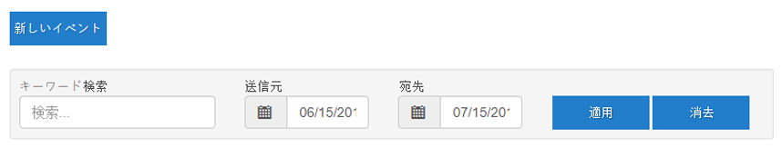
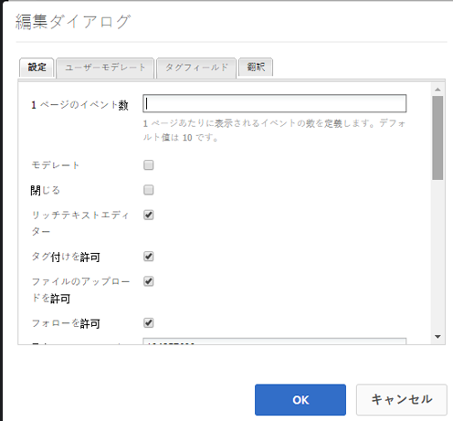
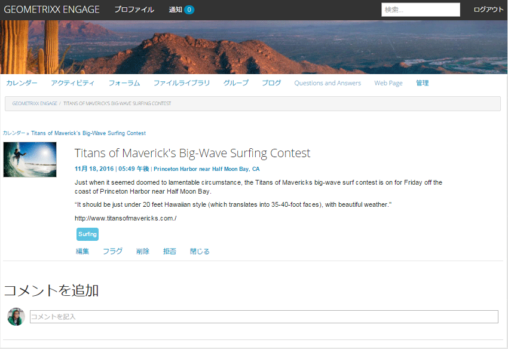
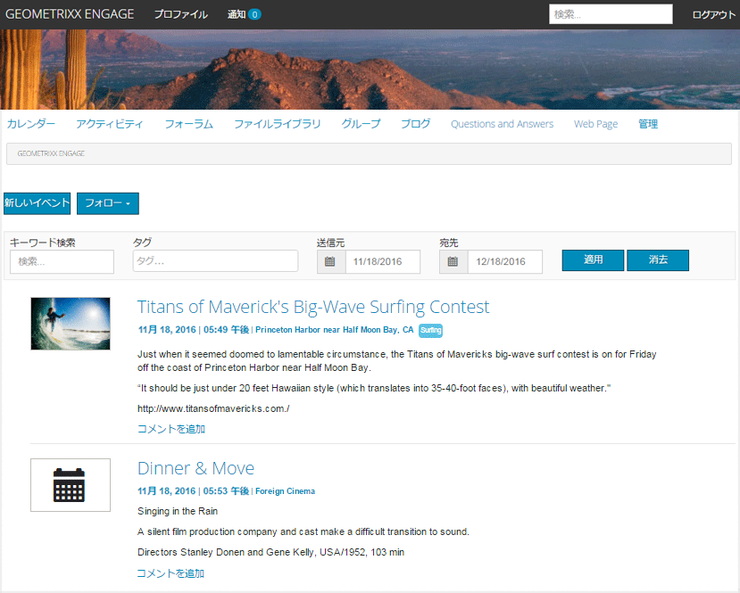
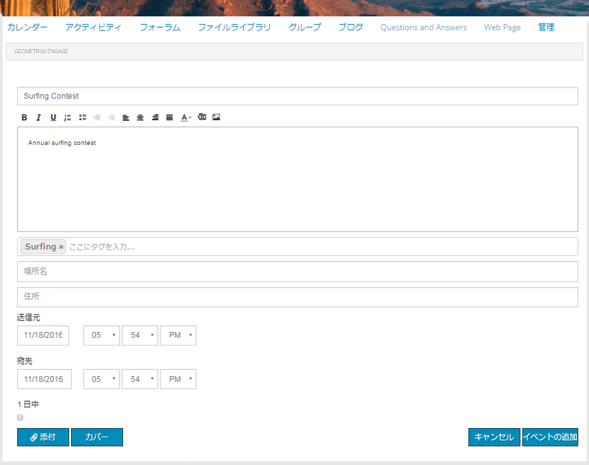

# カレンダー機能 {#calendar-feature}

## はじめに {#introduction}

カレンダー機能は、すべてのサイト訪問者またはサインインしているサイト訪問者（コミュニティメンバー）のみが閲覧できるコミュニティイベント情報をカレンダー形式で提供します。イベントを追加できるのは許可されたメンバーだけです。

ドキュメントのこのセクションでは、以下の内容について説明します。

* カレンダー機能のAEMサイトへの追加
* `Calendar`コンポーネントの設定

## カレンダーをページに追加 {#adding-a-calendar-to-a-page}

`Calendar`コンポーネントをオーサリングモードでページに追加するには、コンポーネントブラウザーを使用して

* `Communities / Calendar`

コンポーネントを探し、ページ上の適切な位置（ユーザーにレビューしてもらう機能の近くなど）にドラッグします。

必要な情報については、[コミュニティコンポーネントの基本](/help/communities/basics.md)を参照してください。

[必須のクライアント側ライブラリ](/help/communities/calendar-basics-for-developers.md#essentials-for-client-side)を含めると、`Calendar`コンポーネントは次のように表示されます。

### カレンダーの設定 {#configuring-calendar}

配置済みの`Calendar`コンポーネントを選択し、`Configure`アイコンを選択すると、編集ダイアログが開きます。

#### 「設定」タブ{#settings-tab}

「**設定**」タブで、カレンダーエントリへのタグの適用を許可するかどうかを指定します。

* **1 ページのイベント数**

   1ページに表示するイベント数を定義します。 初期設定は 10 です。

* **モデレート**

   オンにすると、カレンダーイベントとコメントの投稿を発行サイトに表示する前に承認が必要になります。 初期設定はオフです。

* **閉じる**

   オンにすると、カレンダーは新しいイベントエントリとコメントに対して閉じられます。 初期設定はオフです。

* **リッチテキストエディター**

   オンにすると、マークアップを使用してカレンダーイベントとコメントを入力できます。 初期設定はオンです。

* **タグ付けを許可**

   オンにすると、メンバーは投稿するイベントにタグラベルを追加できます（**タグフィールド**&#x200B;タブを参照）。 初期設定はオンです。

* **ファイルのアップロードを許可**

   オンにすると、カレンダーイベントまたはコメントに添付ファイルを追加できます。 初期設定はオンです。

* **フォローを許可**

   オンにすると、メンバーはカレンダーに投稿されたイベントをフォローできます。 初期設定はオンです。

* **最大ファイルサイズ**

   `Allow File Uploads`がオンの場合にのみ関連します。 このフィールドは、アップロードするファイルのサイズ（バイト単位）を制限します。 初期設定は104857600(10 Mb)です。

* **許可されるファイルタイプ**

   `Allow File Uploads`がオンの場合にのみ関連します。 ドット付きのファイル拡張子をコンマ区切りで指定します（例：.jpg, .jpeg, .png, .doc, .docx, .pdf）。ファイルタイプを指定すると、指定されていないファイルはアップロードできません。 デフォルトでは、すべてのファイルタイプが許可されるように指定されていません。

* **添付する画像ファイルの最大サイズ**

   「ファイルのアップロードを許可」がオンの場合にのみ関連します。 アップロードされた画像ファイルの最大バイト数。 初期設定は2097152** **(2 Mb)です。

* **許可されるカバー画像タイプ**

   ドット付きの画像ファイル拡張子のコンマ区切りリスト。 デフォルトは `.jpg,.jpeg,.png,.gif,.bmp` です。

* **スレッド化された返信を許可**

   オンにすると、カレンダーイベントに投稿されたコメントに対する返信を許可します。 初期設定はオンです。

* **ユーザーによるコメントおよびイベントの削除を許可**

   オンにすると、メンバーは自分が投稿したコメントやカレンダーイベントを削除できます。 初期設定は** **オンです。

* **投票を許可**

   オンにすると、カレンダーイベントに投票機能が含まれます。 初期設定はオンです。

* **パンくずリストを表示**

   イベントページのパンくずリストを表示します. 初期設定はオンです。

* **日付範囲フィルター**

   カレンダーイベントリストページフィルターの「終了日」値を計算するために、現在の日付に追加される日数を定義します。 デフォルト値は30です。

* **おすすめコンテンツを許可**

   オンにすると、アイデアを[おすすめコンテンツ](/help/communities/featured.md)として識別できます。 初期設定はオフです。

「**ユーザーモデレート**」タブで、投稿されたトピックと返信（ユーザー生成コンテンツ）の管理方法を指定します。 詳しくは、[ユーザー生成コンテンツのモデレート](/help/communities/moderate-ugc.md)を参照してください。

#### 「ユーザーモデレート」タブ{#user-moderation-tab}

* **投稿を拒否**

   オンにすると、信頼されているメンバーモデレーターは投稿を拒否し、公開フォーラムに投稿が表示されなくなります。 初期設定はオンです。

* **イベントを閉じる / 再度開く**

   オンにすると、信頼されているメンバーモデレーターがイベントを閉じてさらに編集やコメントを行ったり、イベントを再度開いたりできます。 初期設定はオンです。

* **投稿にフラグを設定**

   オンにすると、メンバーは他のユーザーのイベントやコメントに「不適切」のフラグを設定できます。 初期設定はオンです。

* **フラグ設定理由リスト**

   オンにすると、メンバーはイベントまたはコメントに「不適切」のフラグを設定した理由をドロップダウンリストから選択できます。 初期設定はオフです。

* **カスタムフラグ設定理由**

   オンにすると、メンバーはイベントまたはコメントに「不適切」のフラグを設定した独自の理由を入力できます。 初期設定はオフです。

* **モデレートのしきい値**

   メンバーがイベントまたはコメントに何回フラグを設定したらモデレーターに通知するかを指定します。 初期設定は1（1回）です。

* **フラグ付けの制限**

   イベントまたはコメントに何回フラグを設定したら、公開表示から非表示にするかを入力します。 -1に設定した場合、フラグ付きのトピックまたはコメントが公開表示で非表示になることはありません。 それ以外の場合は、この数値をモデレートのしきい値以上にする必要があります。 初期設定は 5 です。

#### 「タグフィールド」タブ{#tag-field-tab}

「**タグフィールド**」タブでは、「**設定**」タブでタグ付けが許可されている場合に、適用できるタグを名前空間に従って制限します。

* **許可された名前空間**

   「**設定**」タブで`Allow Tagging`がチェックされている場合に関連します。 適用できるタグは、チェックされた名前空間カテゴリ内のタグに限定されます。 名前空間のリストには、「標準タグ」（デフォルトの名前空間）および「すべてのタグを含む」が含まれます。 初期設定は「なし」です。これは、すべての名前空間が許可されることを意味します。

* **推奨の制限**

   フォーラムに投稿するメンバーに提案として表示するタグの数を入力します。 初期設定は**-**1です（制限なし）。

>[!NOTE]
>
>新しいタグ名前空間（分類）の追加方法については、「[タグの管理](/help/sites-administering/tags.md)」を参照してください。

#### 「翻訳」タブ  {#translation-tab}

「**翻訳**」タブでは、コミュニティサイトの翻訳が有効になっている場合に、特定の投稿だけでなくスレッド全体（イベントとコメント）を翻訳するかどうかを設定できます。

* **すべてを翻訳**

   オンにすると、イベントとコメントがユーザーの設定言語に翻訳されます。 初期設定はオンです。

## サイト訪問者のエクスペリエンス {#site-visitor-experience}

パブリッシュ環境では、カレンダー機能はデフォルトの日付範囲を持つ検索フィールドと、その範囲内に含まれるすべてのカレンダーイベントを表示します。

カレンダーイベントを選択すると、その詳細、説明およびコメントが表示されます。

その他の機能は、サイト訪問者がモデレーターか、管理者か、コミュニティメンバーか、権限を持つメンバーか、匿名かによって異なります。

### モデレーターおよび管理者  {#moderators-and-administrators}

サインインしているユーザーがモデレーター権限または管理者権限を持っている場合は、すべてのカレンダーイベントと、イベントに投稿されたコメントに対して、（コンポーネントの設定で許可されている）[モデレートタスク](/help/communities/moderate-ugc.md)を実行できます。

#### メンバー {#members}

サインインしたユーザーがコミュニティメンバーまたは[権限を持つメンバー](/help/communities/users.md#privileged-members-group)（設定に応じて）の場合、`New Event`を選択して新しいカレンダーイベントを作成し、投稿できます。

具体的には、次のような場合があります。

* 新しいカレンダーイベントの作成
* カレンダーイベントにコメントを投稿する
* 独自のカレンダーイベントまたはコメントの編集
* 独自のカレンダーイベントまたはコメントの削除
* 他のユーザーの予定表イベントまたはコメントにフラグを設定する

#### 匿名 {#anonymous}

サインインしていないサイト訪問者は、投稿されたカレンダーイベントを閲覧することしかできず（サポートされている場合は翻訳も可）、イベントまたはコメントを追加したり、他のユーザーのイベントまたはコメントにフラグを設定することはできません。

## 追加情報 {#additional-information}

詳しくは、開発者向けの[カレンダーの基本事項](/help/communities/calendar-basics-for-developers.md)ページを参照してください。

カレンダーイベントとコメントのモデレートについては、「[ユーザー生成コンテンツのモデレート](/help/communities/moderate-ugc.md)」を参照してください。

カレンダーイベントとコメントのタグ付けについては、[ユーザー生成コンテンツのタグ付け](/help/communities/tag-ugc.md)を参照してください。

カレンダーイベントとコメントの翻訳については、[ユーザー生成コンテンツの翻訳](/help/communities/translate-ugc.md)を参照してください。
