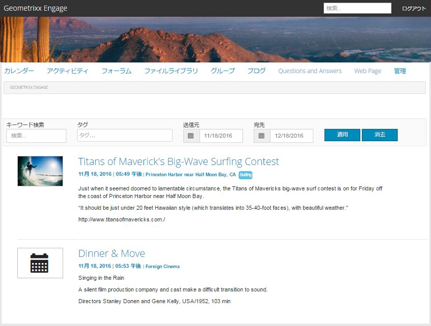

# カレンダー機能 {#calendar-feature}

## はじめに {#introduction}

カレンダー機能は、すべてのサイト訪問者またはログインしたサイト訪問者（コミュニティメンバー）にのみ、コミュニティイベント情報をカレンダー形式で提供することをサポートしており、許可されたメンバーのみがイベントを追加できます。

ドキュメントのこの節では、次について説明します

* AEM サイトへのカレンダー機能の追加
* の設定 `Calendar` components

## ページへのカレンダーの追加 {#adding-a-calendar-to-a-page}

を追加します `Calendar` オーサーモードのページにコンポーネントを追加する場合は、コンポーネントブラウザーを使用して次を見つけます

* `Communities / Calendar`

そして、ユーザーがレビューできるように、ページ上の位置（機能に対する相対的な位置など）にドラッグします。

詳細については、 [Communities コンポーネントの基本](/help/communities/basics.md).

いつ [必要なクライアントサイドライブラリ](/help/communities/calendar-basics-for-developers.md#essentials-for-client-side) が含まれる場合、このようにして `Calendar` コンポーネントが表示されます。

### カレンダーの設定 {#configuring-calendar}

配置されたを選択します。 `Calendar` にアクセスして選択できるコンポーネント `Configure` アイコンをクリックします。このアイコンをクリックすると、編集ダイアログが開きます。

#### 「設定」タブ {#settings-tab}

の下 **設定** タブで、タグをカレンダーエントリに適用できるようにするかどうかを指定します。

* **ページあたりのイベント数**

  ページごとに表示されるイベントの数を定義します。 初期設定は 10 です。

* **モデレート**

  オンにした場合、カレンダーイベントおよびコメントの投稿は、公開サイトに表示される前に承認する必要があります。 デフォルトではオフになっています。

* **クローズ**

  オンにすると、新しいイベント エントリとコメントに対してカレンダーが閉じられます。 デフォルトではオフになっています。

* **リッチテキストエディター**

  オンにすると、カレンダーイベントとコメントがマークアップ付きで入力される場合があります。 デフォルトではオンになっています。

* **タグ付けを許可**

  オンにした場合、メンバーが投稿するイベントにタグラベルを追加できるようになります（を参照） **タグフィールド** タブ）。 デフォルトではオンになっています。

* **ファイルのアップロードを許可**

  オンにした場合、添付ファイルをカレンダーのイベントまたはコメントに追加できます。 デフォルトではオンになっています。

* **フォローを許可**

  オンにすると、メンバーはカレンダーに投稿されたイベントをフォローできます。 デフォルトではオンになっています。

* **最大ファイル サイズ**

  次の場合にのみ該当： `Allow File Uploads` がチェックされます。 このフィールドでは、アップロードするファイルのサイズ（バイト単位）を制限します。 デフォルトは 104857600 （10 Mb）です。

* **許可されるファイルタイプ**

  次の場合にのみ該当： `Allow File Uploads` がチェックされます。 「ドット」区切り文字を使用したファイル拡張子のコンマ区切りリスト。 例：.jpg、.jpeg、.png、.doc、.docx、.pdf いずれかのファイルタイプを指定した場合、指定していないファイルタイプはアップロードできません。 デフォルトは、すべてのファイルタイプが許可されるように、何も指定されていません。

* **アタッチ イメージ ファイルの最大サイズ**

  「ファイルのアップロードを許可」がオンの場合にのみ関連します。 アップロードされた画像ファイルの最大バイト数。 デフォルトは 2097152** **（2 Mb）です。

* **許可されるカバー画像タイプ**

  「ドット」区切り文字を使用した画像ファイル拡張子のコンマ区切りリスト。 デフォルトは `.jpg,.jpeg,.png,.gif,.bmp` です。

* **スレッド返信を許可する**

  オンにすると、カレンダーイベントに投稿されたコメントへの返信が許可されます。 デフォルトではオンになっています。

* **ユーザーによるコメントおよびイベントの削除を許可**

  オンにした場合、メンバーが投稿したコメントおよびカレンダーイベントを削除できます。 デフォルトではオンになっています。

* **投票を許可**

  オンにした場合は、カレンダーイベントと共に投票機能を含めます。 デフォルトではオンになっています。

* **パンくずリストを表示**

  イベントページにパンくずリストを表示。 デフォルトではオンになっています。

* **日付範囲フィルター**

  カレンダーイベント一覧ページフィルターの「宛先」値を計算するために、現在の日付に追加する日数を定義します。 デフォルト値は 30 です。

* **おすすめコンテンツを許可**

  オンにした場合、アイデアは次の形で識別可能です [おすすめコンテンツ](/help/communities/featured.md). デフォルトではオフになっています。

の下 **ユーザーのモデレート** タブで、投稿されたトピックと返信（ユーザー生成コンテンツ）の管理方法を指定します。 詳しくは、を参照してください [ユーザー生成コンテンツのモデレート](/help/communities/moderate-ugc.md).

#### ユーザーモデレートタブ {#user-moderation-tab}

* **投稿を拒否**

  オンにすると、信頼されたメンバーモデレーターは、投稿を拒否し、その投稿が公開フォーラムに表示されるのを防ぐことができます。 デフォルトではオンになっています。

* **イベントを閉じる/再度開く**

  オンにすると、信頼されたメンバーモデレーターがイベントを閉じて編集やコメントを追加したり、イベントを再オープンしたりできます。 デフォルトではオンになっています。

* **フラグ投稿**

  オンにした場合、メンバーが他のメンバーのイベントやコメントに不適切なフラグを付けることを許可します。 デフォルトではオンになっています。

* **フラグの理由リスト**

  オンにすると、メンバーは、イベントまたはコメントに不適切なフラグを設定した理由をドロップダウンリストから選択できます。 デフォルトではオフになっています。

* **カスタムフラグの理由**

  オンにした場合、イベントやコメントに不適切なフラグを設定する独自の理由をメンバーが入力できるようにします。 デフォルトではオフになっています。

* **モデレートしきい値**

  モデレータに通知を送信する前に、イベントまたはコメントがメンバによってフラグ付けされる回数を入力します。 デフォルトは 1 （1 回）です。

* **フラグの上限**

  イベントまたはコメントがパブリック ビューで非表示になるまでに、そのイベントまたはコメントにフラグを付ける必要がある回数を入力します。 -1 に設定すると、フラグが設定されたトピックまたはコメントがパブリック ビューから隠されることはありません。 それ以外の場合は、この数はモデレートしきい値以上にする必要があります。 デフォルトは 5 です。

#### 「タグフィールド」タブ {#tag-field-tab}

の下 **タグフィールド** タブで、適用される可能性のあるタグ（下で許可されている場合） **設定** タブは、選択した名前空間に応じて制限されます。

* **許可された名前空間**

  次の場合に関連 `Allow Tagging` は、次の場所でチェックされます。 **設定** タブ。 適用できるタグは、オンになっている名前空間カテゴリ内のタグに制限されます。 名前空間のリストには、「標準タグ」（デフォルトの名前空間）と「すべてのタグを含める」が含まれています。 デフォルトでは、チェックされていないが、すべての名前空間が許可されていることを意味します。

* **提案の制限**

  フォーラムに投稿するメンバーに提案として表示するタグの数を入力します。 デフォルトは**-**1 （無制限）です。

>[!NOTE]
>
>訪問 [タグの管理](/help/sites-administering/tags.md) タグ名前空間（分類）の追加方法を説明します。

#### 「翻訳」タブ {#translation-tab}

の下 **翻訳** tab を使用すると、コミュニティサイトに対して翻訳が有効になっている場合、特定の投稿ではなくスレッド全体（イベントとコメント）を翻訳するように翻訳を設定できます。

* **すべて翻訳**

  オンにすると、イベントとコメントがユーザーの優先言語に翻訳されます。 デフォルトではオンになっています。

## サイト訪問者エクスペリエンス {#site-visitor-experience}

パブリッシュ環境では、カレンダー機能はデフォルトの日付範囲と、その範囲内に該当するカレンダーイベントを含む検索フィールドを表示します。

カレンダーイベントを選択すると、カレンダーイベントの詳細、説明およびコメントが表示されます。

その他の権限は、サイト訪問者がモデレーター、管理者、コミュニティメンバー、権限のあるメンバー、匿名のどれであるかによって異なります。

### モデレーターと管理者 {#moderators-and-administrators}

ログインしたユーザーがモデレーターまたは管理者権限を持っている場合、次の操作を実行できます [モデレーションタスク](/help/communities/moderate-ugc.md) （コンポーネントの設定で許可されている場合）イベントに投稿されたすべてのカレンダーイベントとコメント。

#### メンバー {#members}

サインインしたユーザーがコミュニティ メンバーである場合、または [特権メンバー](/help/communities/users.md#privileged-members-group) （設定によって異なります）次の操作を実行できます `New Event` 新しいカレンダーイベントを作成して投稿します。

具体的には、次のような場合があります。

* カレンダーイベントの作成
* カレンダーイベントへのコメントの投稿
* 独自のカレンダーイベントまたはコメントを編集する
* 独自のカレンダーイベントまたはコメントを削除する
* 他のユーザーのカレンダーイベントまたはコメントにフラグを設定する

#### 匿名 {#anonymous}

ログインしていないサイト訪問者は、投稿されたカレンダーイベントを読み取ったり、サポートされている場合は翻訳したりすることはできますが、イベントやコメントを追加したり、他のユーザーのイベントやコメントにフラグを立てたりすることはできません。

## 追加情報 {#additional-information}

詳しくは、 [カレンダーの基本事項](/help/communities/calendar-basics-for-developers.md) 開発者向けのページです。

カレンダーイベントおよびコメントのモデレートについては、以下を参照してください。 [ユーザー生成コンテンツのモデレート](/help/communities/moderate-ugc.md).

カレンダーイベントとコメントのタグ付けについては、を参照してください。 [ユーザー生成コンテンツのタグ付け](/help/communities/tag-ugc.md).

カレンダーイベントとコメントの翻訳については、を参照してください。 [ユーザー生成コンテンツの翻訳](/help/communities/translate-ugc.md).
