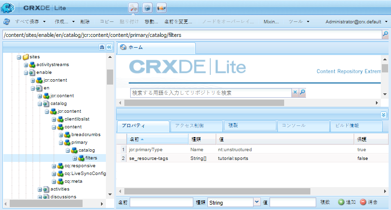
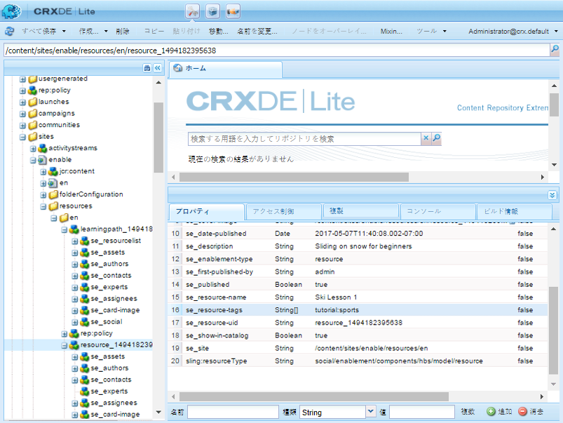

# カタログの基本事項 {#catalog-essentials}

このページでは、イネーブルメントコミュニティサイトのカタログ機能の操作に関する基本情報をまとめています。

コミュニティサイトにカタログ機能が用意されている場合、コミュニティメンバーは、その機能を使用して、カタログに一覧表示された実施可能リソースを参照および選択できます。

[ `enablement catalog`コンポーネント](catalog.md)を使用すると、コミュニティメンバーは[イネーブルメントリソース](resources.md)のカタログにアクセスできます。 AEMタグの使用は、カタログ内のイネーブルメントリソースの外観を管理する上で重要な役割を果たします。

[実施可能リソースのタグ付け](tag-resources.md)を参照してください。

## クライアント側の基本事項  {#essentials-for-client-side}

<table>
 <tbody>
  <tr>
   <td> <strong>resourceType</strong></td>
   <td>social/enablement/components/hbs/catalog</td>
  </tr>
  <tr>
   <td> <a href="scf.md#add-or-include-a-communities-component"><strong>インクルード可能</strong></a></td>
   <td>不可</td>
  </tr>
  <tr>
   <td> <a href="clientlibs.md"><strong>clientllibs</strong></a></td>
   <td>cq.social.enablement.hbs.breadcrumbs  cq.social.enablement.hbs.catalog  cq.social.enablement.hbs.resource  cq.social.enablement.hbs.learningpath</td>
  </tr>
  <tr>
   <td> <strong>テンプレート</strong></td>
   <td> /libs/social/enablement/components/hbs/catalog/catalog.hbs  </td>
  </tr>
  <tr>
   <td> <strong>css</strong></td>
   <td> /libs/social/enablement/components/hbs/catalog/clientlibs/catalog.css</td>
  </tr>
  <tr>
   <td><strong> properties</strong></td>
   <td><a href="catalog.md">カタログ機能</a>を参照</td>
  </tr>
 </tbody>
</table>

## サーバー側の基本事項 {#essentials-for-server-side}

### カタログ機能 {#catalog-function}

[カタログ機能](functions.md#catalog-function)を含むコミュニティサイト構造には、設定済みの`enablement catalog`コンポーネントが含まれます。

### 事前フィルター {#pre-filters}

コミュニティサイトにカタログ機能が追加されている場合、事前フィルターを指定することで、カタログに表示されるイネーブルメントリソースと学習パスを制限できます。これは、サイトのカタログリソースのインスタンスにプロパティを設定することでおこなわれます。

[イネーブルメントチュートリアル](getting-started-enablement.md)の例を使用します。

* 作成者
* [CRXDE](../../help/sites-developing/developing-with-crxde-lite.md)の使用

   * 例えば、[https://&lt;server>:&lt;port>/crx/de](http://localhost:4502/crx/de)

* カタログページでカタログリソースに移動します。

   * 例：`/content/sites/enable/en/catalog/jcr:content/content/primary/catalog`

* 子フィルターノードの追加

   * `catalog`ノードを選択します。
   * 「**[!UICONTROL ノードを作成]**」を選択します。

      * 名前：`filters`
      * 型：`nt:unstructured`
      * 「**[!UICONTROL すべて保存]**」を選択します。

* `se_resource-tags`プロパティを`filters`ノードに追加します。

   * `filters`ノードを選択します。
   * 複数プロパティの追加

      * 名前：`se_resource-tags`
      * タイプ：String
      * 値：&lt;*TagID[ を入力](#pre-filter-tagids)>*
         * **[!UICONTROL マルチ]**&#x200B;を選択します。
         * **[!UICONTROL 追加]**&#x200B;を選択します。

            * ポップアップダイアログで、`+`を選択して、プリフィルタータグIDを追加します

* コミュニティサイトの再公開

#### 事前フィルター TagID {#pre-filter-tagids}

プリフィルター[TagID](../../help/sites-developing/framework.md#tagid)は、イネーブルメントリソースに適用されるタグと完全に一致する必要があります。 これらは、サイトの `resources` フォルダーでプロパティ `se_resource-tags` の値として確認できます。

### リファレンス API {#reference-apis}

* [イネーブルメント API](https://helpx.adobe.com/experience-manager/6-5/sites/developing/using/reference-materials/javadoc/com/adobe/cq/social/enablement/client/api/package-summary.html)

* [レポート API](https://helpx.adobe.com/experience-manager/6-5/sites/developing/using/reference-materials/javadoc/com/adobe/cq/social/enablement/client/reporting/api/package-summary.html)

* [レポート分析 API](https://helpx.adobe.com/experience-manager/6-5/sites/developing/using/reference-materials/javadoc/com/adobe/cq/social/enablement/client/reporting/analytics/api/package-summary.html)
