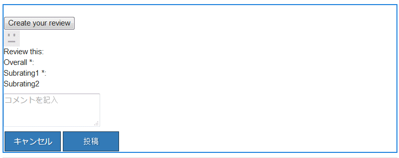
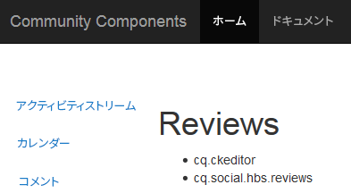
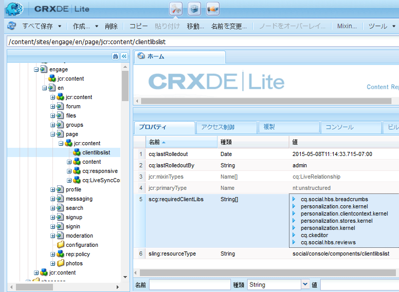

# コミュニティコンポーネントの clientlib {#clientlibs-for-communities-components}

## はじめに {#introduction}

ドキュメントのこの節では、Communities コンポーネントのページにクライアントサイドライブラリ（clientlibs）を追加する方法について説明します。

基本的な情報については、次を参照してください。

* [クライアントサイドライブラリの使用](/help/sites-developing/clientlibs.md) 使用の詳細とデバッグツールを提供します
* [SCF の clientlibs](/help/communities/client-customize.md#clientlibs) SCF コンポーネントをカスタマイズするときに役立つ情報を提供します

## Clientlibs が必要な理由 {#why-clientlibs-are-required}

Clientlib は、コンポーネントが適切に機能（JavaScript）し、スタイル設定（CSS）するために必要です。

存在する場合 [コミュニティ機能](/help/communities/functions.md) 機能に必要なすべてのコンポーネントと設定（必要な clientlib を含む）がコミュニティサイトに存在する。 作成者が追加のコンポーネントを使用できるようにする場合にのみ、clientlib を追加する必要があります。

必要な clientlib がない場合、 [ページへの Communities コンポーネントの追加](/help/communities/author-communities.md) その結果、JavaScript エラーが発生し、予期しない外観になる可能性があります。

### 例：Clientlibs を使用せずに配置したレビュー {#example-placed-reviews-without-clientlibs}

### 例：Clientlibs を使用して配置されたレビュー {#example-placed-reviews-with-clientlibs}

## 必要な Clientlibs の識別 {#identifying-required-clientlibs}

デベロッパーにとって不可欠な機能情報は、必要な clientlib を特定します。

さらに、AEM インスタンスから、を参照します。 [コミュニティコンポーネントガイド](/help/communities/components-guide.md) コンポーネントに必要な clientlib カテゴリのリストへのアクセスを提供します。

例えば、の上部 [レビューページ](https://localhost:4502/content/community-components/en/reviews.html) 次に、必要な clientlib を示します

* cq.ckeditor
* cq.social.hbs.reviews

## 必要な Clientlibs の追加 {#adding-required-clientlibs}

Communities コンポーネントをページに追加する場合、コンポーネントに必要な clientlib がまだ存在しない場合は追加する必要があります。

使用方法 [CRXDE|Lite](#using-crxde-lite) コミュニティサイトページの既存の clientlibslist を変更する場合。

を使用してコミュニティサイトのクライアントライブラリを追加するには [CRXDE Lite](/help/sites-developing/developing-with-crxde-lite.md):

* を参照 [https://&lt;server>:&lt;port>/crx/de](https://localhost:4502/crx/de).
* を見つけます。 `clientlibslist` コンポーネントを追加するページのノード：

   * `/content/sites/sample/en/page/jcr:content/clientlibslist`

* （を使用） `clientlibslist` 選択されたノード :

   * 文字列を見つけます。[] プロパティ `scg:requiredClientLibs`.
   * を選択 `Value` そのため、「文字列配列」ダイアログボックスにアクセスできます。

      * 必要に応じて下にスクロールします。
      * 「+」を選択して、新しいクライアントライブラリを入力します。

         * 繰り返して、さらにクライアントライブラリを追加します。

         * 「**OK**」を選択します。

   * 「**すべて保存**」を選択します。

>[!NOTE]
>
>サイトがコミュニティサイトでない場合は、サイトで使用されているクライアントライブラリの存在または場所を検出する必要があります。

使用， [AEM Communitiesの概要](/help/communities/getting-started.md) 例： `site-name` 等しい *従事する*、レビューコンポーネントを追加した場合の clientliblist の表示方法は次のとおりです。

