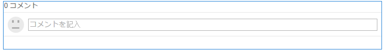
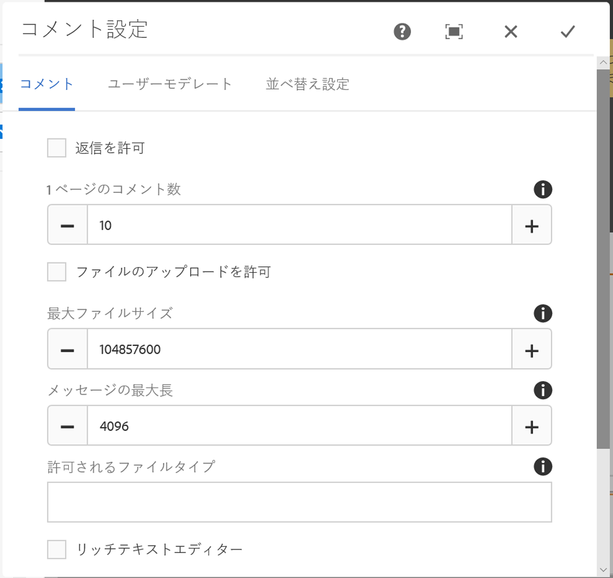
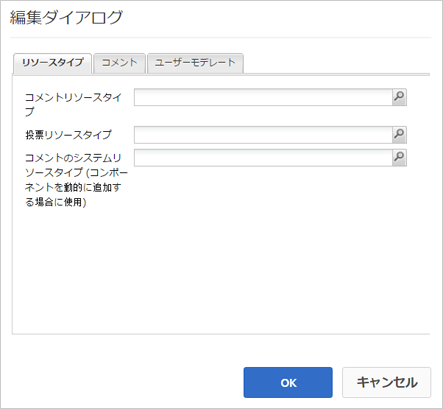

# コメントの使用 {#using-comments}

## 概要 {#introduction}

サインインしているサイト訪問者（メンバー）は、コメント機能を使用して、サイト上のコンテンツに関する意見や知識を共有できます。この機能は他の機能に既に存在する場合が多く、どのWebサイトにも追加できます。

このドキュメントでは、次の内容を説明します。

* ページ `Comments` への追加を参照してください。
* Configuration settings for the `Comments` component.

>[!NOTE]
>
>匿名でのコメント投稿はサポートされていません。サイト訪問者は参加するには、登録（会員になる）し、サインインする必要があります。

### コメントをページに追加 {#adding-comments-to-a-page}

To add a `Comments` component to a page in author mode, use the component browser to locate

* `Communities / Comments`

コンポーネントを探し、ページ上の適切な位置（ユーザーにコメントしてもらう機能の近くなど）や、単にページの下部にドラッグします。

For necessary information, visit [Communities Components Basics](/help/communities/basics.md).

[必要なクライアント側ライブラリが含まれる場合](/help/communities/essentials-comments.md#essentials-for-client-side) 、このようにコンポー `Comments` ネントが表示されます。

>[!NOTE]
>
>Only one `Comments` component may exist on a page. コミュニティの機能の中には、既にブログ、カレンダー、フォーラム、QnA、レビューなどのコメントが含まれているものもあります。

### コメントの設定 {#configuring-comments}

Select the placed `Comments` component to access and select the `Configure` icon which opens the edit dialog.

#### 「コメント」タブ{#comments-tab}

「**コメント**」タブでは、訪問者によるコメントの入力方法を指定します。

* **返信を許可**

   このオプションを選択すると、メンバーは既存のコメントに返信できます。 デフォルト値はオフです。

* **1 ページのコメント数**

   1ページに表示するコメントの数と表示する返信の数を制限します。 初期設定は 10 です。

* **ファイルのアップロードを許可**

   オンにすると、ファイルをアップロードするオプションにテキスト入力ボックスが表示されます。 デフォルト値はオフです。

* **最大ファイルサイズ**

   「ファイルのアップロードを許可」がオンになっている場合にのみ関連します。 この値は、アップロードされるファイルのサイズを制限します。 デフォルトは 10 MB です。

* **メッセージの最大長**

   テキストボックスに入力できる最大文字数。 初期設定は 4096 文字です。

* **許可されるファイルタイプ**

   「ファイルのアップロードを許可」がオンになっている場合にのみ関連します。 区切り文字「。」を含むファイル名拡張子のコンマ区切りリスト。 例：.jpg, .jpeg, .png, .doc, .docx, .pdf）。ファイルの種類を指定した場合、指定しなかったファイルは許可されません。 初期設定は、すべてのファイルタイプを許可するように指定されません。

* **リッチテキストエディター**

   オンの場合、コメントはマークアップと共に入力されます。 デフォルト値はオフです。

* **投票を許可**

   選択すると、上下に投票するオプションにテキスト入力ボックスが表示されます。 デフォルト値はオフです。

* **フォローを許可**

   このオプションを選択すると、メンバーはコメントをフォローできます。 デフォルト値はオフです。

* **バッジを表示**

   オンの場合、獲得および落札済みのバッジの表示を許可します。 デフォルト値はオフです。

#### 「ユーザーモデレート」タブ{#user-moderation-tab}

Under the **User Moderation** tab, specify how the posted comments are managed. For more information, see [Moderating User Generated Content](/help/communities/moderate-ugc.md).

* **事前モデレート**

   このオプションを選択すると、コメントが発行サイトに表示される前に、承認される必要があります。 デフォルト値はオフです。

* **コメントを削除**

   オンにすると、コメントを投稿したメンバーに、コメントを削除する機能が与えられます。 デフォルト値はオフです。

* **コメントを拒否**

   オンにした場合、モデレーターがコメントを拒否できます。 デフォルト値はオフです。

* **コメントを閉じる / 再度開く**

   このオプションを選択すると、モデレーターはコメントを閉じたり、再度開いたりできます。 デフォルト値はオフです。

* **コメントにフラグを設定**

   このオプションを選択すると、メンバーは不適切としてコメントにフラグを付けることができます。 デフォルト値はオフです。

* **フラグ設定理由リスト**

   このオプションを選択すると、メンバーは、コメントに不適切なフラグを付ける理由をドロップダウンリストから選択できます。 デフォルト値はオフです。

* **カスタムフラグ設定理由**

   このオプションを選択すると、コメントに不適切なフラグを付ける場合に、メンバーが自分の理由を入力できます。 デフォルト値はオフです。

* **モデレートのしきい値**

   モデレーターに通知する前に、メンバーがコメントにフラグを付ける必要がある回数を入力します。 初期設定は1回です。

* **フラグ付けの制限**

   コメントが公開表示に表示されなくなるまでにフラグを付ける必要がある回数を入力します。 This number must be greater than or equal to the **Moderation Threshold**. 初期設定は 5 です。

#### 「並べ替え設定」タブ{#sort-settings-tab}

Under the **Sort Settings** tab, specify how the posted comments are sorted when displayed.

* **並べ替えフィールド**

   プルダウンして、またはのいずれかを選択 `Newest, Oldest, Last Updated, Most Viewed, Most Active, Most Followed`しま `Most Liked`す。

* **並べ替え順序**

   プルダウンして、またはのいずれかを選択 `Ascending` しま `Descending`す。

### カスタムコメントタイプへの変更 {#changing-to-a-custom-comment-type}

コメントリソースタイプを変更すると、コメントシステムは、デフォルトを使用してコメントのインスタンスを生成しなくなり、開発者によってカスタマイズ（拡張）されています。

Once the custom resource types are known, enter [Design Mode](/help/sites-authoring/default-components-designmode.md) and double click the placed `Comments` component to open a dialog with an extra tab.

Under the **Resource Types** tab, specify the custom resourceType for new instances of the `Comments or Voting` components:

* **コメントリソースタイプ**

   /apps内の拡張 `comment` コンポーネント（1つのコメント）のresourceTypeに移動します。 例：`/apps/social/commons/components/hbs/comments/comment`

   このリソースは、訪問者がコメントを投稿したときに作成されたUGCのresourceTypeを識別します。

* **投票リソースタイプ**

   /apps内の拡張 `voting` コンポーネントのresourceTypeに移動します。 例：`/apps/social/components/hbs/voting`

   このリソースは、訪問者が投票を行ったときに作成されたUGCのリソースタイプを識別します。

* **コメントシステムリソースタイプ**

   /apps内の拡張 `comments`コンポーネント（コメントシステム）のresourceTypeに移動します。 Leave blank unless the page template [dynamically includes](/help/communities/scf.md#add-or-include-a-communities-component) the Comment System in the underlying script instead of being added to the page as a resource (comments node). Learn more by reading about the [{{include}} helper](/help/communities/handlebars-helpers.md#include).

### サイト訪問者のエクスペリエンス {#site-visitor-experience}

#### モデレーターおよび管理者 {#moderators-and-administrators}

サインインしているユーザーがモデレーター権限または管理者権限を持っている場合は、誰がコメントを作成したかにかかわらず、コンポーネントの設定によって許可されているモデレートタスクを実行できます。

#### メンバー {#members}

サイト訪問者がサインインすると、設定に応じて次のことができます。

* 新しいコメントの投稿
* 自分のコメントの編集
* 自分のコメントを削除する
* 他のユーザーのコメントにフラグを付ける

#### 匿名 {#anonymous}

サインインしていないサイト訪問者は、投稿されたコメントを閲覧することしかできず（サポートされている場合は翻訳も可）、コメントを追加したり、他のユーザーのコメントにフラグを設定することはできません。

### 追加情報 {#additional-information}

More information may be found on the [Comments Essentials](/help/communities/essentials-comments.md) page for developers.

For moderation of posted comments, see [Moderating User Generated Content](/help/communities/moderate-ugc.md).

投稿されたコメントの翻訳については、[ユーザー生成コンテンツの翻訳](/help/communities/translate-ugc.md)を参照してください。
