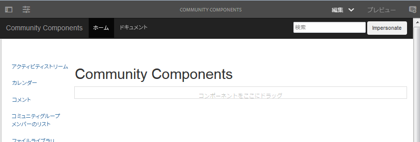
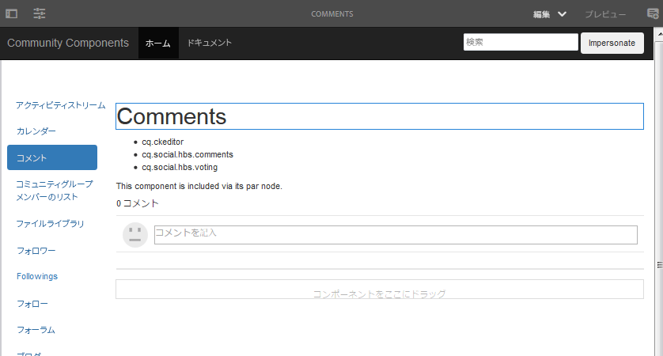
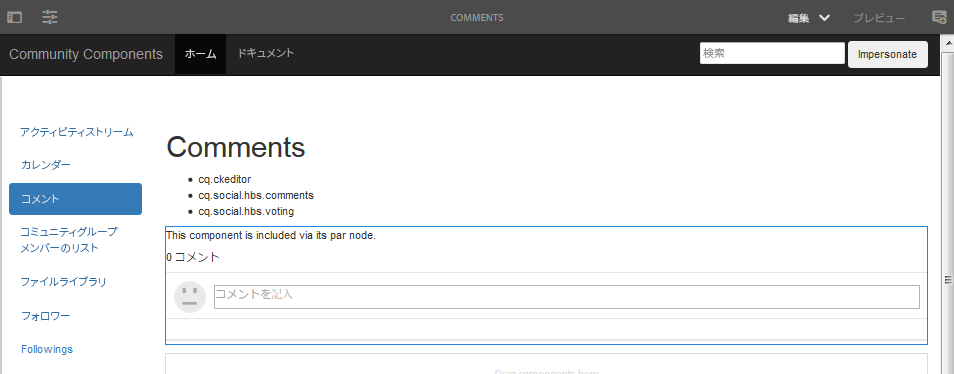
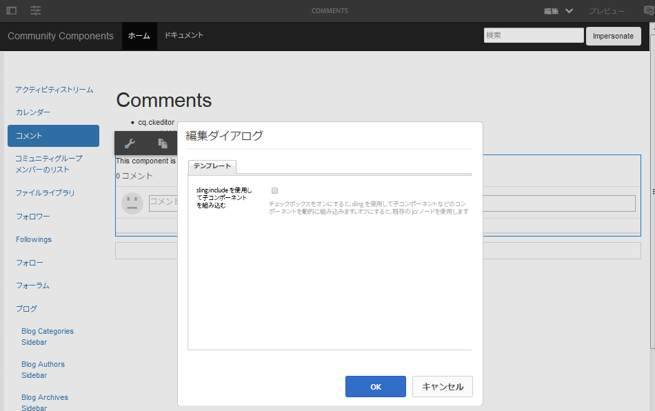
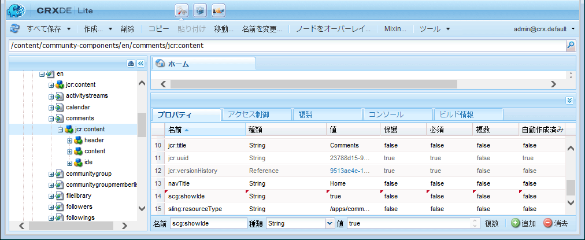
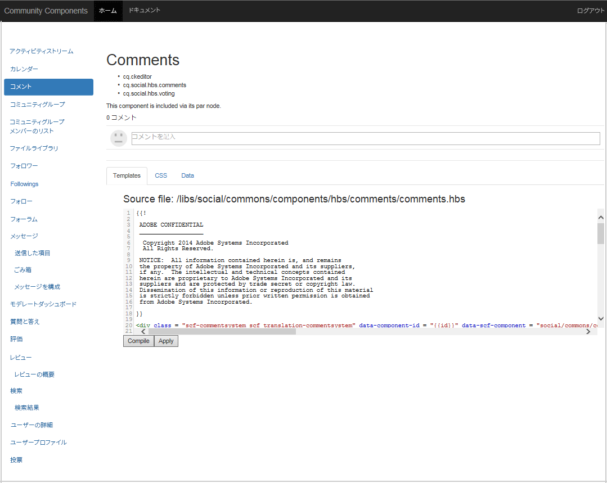

# コミュニティコンポーネントガイド  {#community-components-guide}

コミュニティコンポーネントガイドは、[ソーシャルコンポーネントフレームワーク（SCF）](scf.md)のインタラクティブ開発ツールです。これは、使用可能なAEM Communitiesコンポーネントのリストや、複数のコンポーネントで構築されたより複雑な機能を提供します。

このガイドを利用すると、各コンポーネントに関する基本情報を確認するとともに、SCF コンポーネント／機能の動作やその構成／カスタマイズ方法を試してみることができます。

各コンポーネントに関連する開発の基本事項については、[コンポーネントと機能の基本事項](essentials.md)を参照してください。

## 概要 {#getting-started}

このガイドは、オーサーインスタンス（localhost:4502）とパブリッシュインスタンス（localhost:4503）の開発用インストール環境での使用を意図しています。

コミュニティコンポーネントサイトには以下からアクセスします。

* [https://&lt;server>:&lt;port>/content/community-components/en.html](http://localhost:4502/content/community-components/en.html)

コミュニティコンポーネントとのインタラクションは次の状況によって変わります。

* サーバー（作成者または発行）。
* サイト訪問者がサインインしているかどうかを示します。
* サインインした場合、メンバーに割り当てられる権限。
* Whether or not the default SRP, [JSRP](jsrp.md), is in use.

On author, to enter edit mode, insert either `editor.html` or `cf#` as the first path segment after the server name:

* 標準 UI:

   [https://&lt;server>:&lt;port>/editor.html/content/community-components/en.html](http://localhost:4502/editor.html/content/community-components/en.html)

* クラシック UI：

   [https://&lt;サーバー>:&lt;ポート>/cf#/content/community-components/en.html](http://localhost:4502/cf#/content/community-components/en.html)

>[!NOTE]
>
>オーサーインスタンスの編集モードでは、ページ上のリンクはアクティブではありません。
>
>コンポーネントページに移動するには、最初にプレビューモードを選択してリンクをアクティブにします。
>
>コンポーネントページをブラウザーに表示した状態で、編集モードに戻し、コンポーネントの編集ダイアログを開きます。
>
>For general authoring information, view the [quick guide to authoring pages](../../help/sites-authoring/qg-page-authoring.md).
>
>AEM に精通していない場合は、[基本操作](../../help/sites-authoring/basic-handling.md)に関するドキュメントを参照してください。

### ホームページ {#home-page}

このガイドでは、プレビューおよびプロトタイピングに対応した SCF コンポーネントのリストがページの左側に沿って表示されます。

オーサーインスタンスでコンポーネントガイドを編集モードで表示した場合：

## コンポーネントページ {#component-pages}

ページの左側のリストからコンポーネントを選択します。

ガイドの本文には次の情報が表示されます。

1. タイトル：選択したコンポーネントの名前
1. [クライアント側ライブラリ](#client-side-libraries):1つ以上の必須カテゴリのリスト
1. [含める](scf.md#add-or-include-a-communities-component):コンポーネントを動的に含めることができる場合は、作成者編集モードで状態を切り替えることができます。

   * 追加した場合、表示されるテキストは次のとおりです。「このコンポーネントは、その各ノードを介して含まれます。」
   * 含める場合、表示されるテキストは次のとおりです。「このコンポーネントは動的に含まれます。」
   * 含めることができない場合、テキストは表示されません

1. サンプルコンポーネントまたは機能：コンポーネントまたは機能のアクティブインスタンスです。コンポーネントの場合は、タブセクションに表示されるテンプレート、CSS、データに対する変更を行って変更できます。

>[!NOTE]
>
>ブラウザーウィンドウが狭すぎる場合、左側のコンポーネントリストで選択したコンポーネントは、リストの横ではなく下に表示されます。

### オーサーインタラクション {#author-interactions}

オーサーインスタンスでガイドを使用する場合、コンポーネントの設定時にダイアログが開くことがあります。Information for developers is provided in the [Component and Feature Essentials](essentials.md) section of the documentation, while the dialog settings are described in [Communities Components](author-communities.md) section for authors.

コミュニティコンポーネントガイドでは、一部のコンポーネントダイアログ設定が[インクルード可能](scf.md#add-or-include-a-communities-component)切り替え状態でオーバーレイされています。既存のリソースと動的に含まれるリソースの使用を切り替えるには、編集モードで、コンポーネントと含めるテキストの両方を選択し、重複を押しながらクリックして編集ダイアログを開きます。

「**テンプレート**」タブで、次の操作をおこないます。

* **sling:include を使用して子コンポーネントを組み込む**

   チェックが解除されている場合、コンポーネントガイドはリポジトリ内の既存のリソース（各ノードの子であるjcrノード）を使用します。

   * 表示されるテキスト：「このコンポーネントは、その各ノードを介して含まれます。」

   チェックボックスをオンにした場合、sling を使用して、子ノードの resourceType のコンポーネント（存在しないリソース）が動的にインクルードされます。

   * 表示されるテキスト：「このコンポーネントは動的に含まれます。」

   初期設定はオフです。

### パブリッシュインタラクション {#publish-interactions}

パブリッシュインスタンスでガイドを使用する場合、コンポーネントと機能をサイト訪問者（サインインしていない場合）またはさまざまな権限を持つメンバー（サインインしている場合）として操作することになります。

>[!NOTE]
>
>SRP がデフォルトの [JSRP](jsrp.md) のままになっている場合、パブリッシュインスタンスで生成された UGC はパブリッシュインスタンスでのみ表示され、オーサーインスタンスの[モデレート](moderate-ugc.md)コンソールからは表示できない&#x200B;**&#x200B;ことに留意してください。

## クライアント側ライブラリ {#client-side-libraries}

コンポーネントごとに一覧表示されるクライアント側ライブラリ（clientlib）は、該当するコンポーネントをページに配置するときに参照する必要がある&#x200B;**&#x200B;ライブラリです。clientlibは、ブラウザーでコンポーネントをレンダリングする際に使用するJavaScriptとCSSのダウンロードを管理および最適化する手段を提供します。

詳しくは、[コミュニティコンポーネントの clientlib](clientlibs.md) を参照してください。

## 偽装 {#impersonation}

管理者または開発者としてサインインすることが多いオーサーインスタンスで、別のユーザーとしてログインしてコンポーネントを操作するには、「**[!UICONTROL 偽装]**」ボタンの左側にあるテキストボックスにユーザー名を入力するか、プルダウンリストから選択してボタンをクリックします。「Revert」をクリックして、他のユーザーとしてサインアウトし、終了します。

パブリッシュインスタンスではこのような偽装操作は不要です。Simply use the Login/Logout link to impersonate various users, such as the [demo users](tutorials.md#demo-users).

## カスタマイズ {#customization}

有効にすると、各SCFコンポーネントは、コンポーネントのテンプレート、CSSおよびデータを一時的に変更することで、可能なカスタマイズのプロトタイプ化に使用できます。

### カスタマイズの有効化 {#enabling-customization}

>[!NOTE]
>
>**このツールは読み取り専用です**。テンプレート、CSSまたはデータに対して行った編集はリポジトリに保存されません。

To quickly experiment with customizations, the `scg:showIde`property must be added to the component page&#39;s content JCR node and set to true.

オーサーインスタンスまたはパブリッシュインスタンスのいずれかに管理者権限でサインインし、例としてコメントコンポーネントを使用します。

1. [CRXDE Liteを参照](../../help/sites-developing/developing-with-crxde-lite.md)

   例：[http://localhost:4503/crx/de](http://localhost:4503/crx/de)

1. コンポーネントの `jcr:content` ノードを選択

   例：`/content/community-components/en/comments/jcr:content`

1. プロパティの追加

   * **名前** `scg:showIde`
   * **型** `String`
   * **値** `true`

1. 「**[!UICONTROL すべて保存]**」を選択します。
1. ガイドのコメントページをリロードします。

   [http://localhost:4503/content/community-components/en/comments.html](http://localhost:4503/content/community-components/en/comments.html)

1. テンプレート、CSS、データの3つのタブが追加されました。

### 「テンプレート」タブ{#templates-tab}

「テンプレート」タブを選択すると、コンポーネントに関連付けられているテンプレートが表示されます。

テンプレートエディターを使用すると、リポジトリ内のコンポーネントに影響を及ぼすことなく、ローカル編集をコンパイルし、ページ上のサンプルコンポーネントインスタンスに適用することができます。

ローカル編集のコンパイル時にエラーが発生した場合は、ガッター部分にドットを配置し、テキストの色を赤にすることによってエラーが強調表示されます。

### 「CSS」タブ{#css-tab}

「CSS」タブを選択すると、コンポーネントに関連付けられている CSS が表示されます。

コンポーネントが他の複数のコンポーネントから構成される場合、一部の CSS はそれらのコンポーネントのいずれか 1 つの下に一覧表示されることがあります。

CSS エディターを使用すると、CSS を変更し、ページ上のサンプルコンポーネントインスタンスに適用することができます。

ガッター部分でルールの横をクリックしてルールを選択すると、そのルールを使用する DOM の各部が強調表示されます。

### 「データ」タブ {#data-tab}

「データ」タブを選択すると、.social.json エンドポイントデータが表示されます。このデータは編集可能であり、サンプルコンポーネントインスタンスに適用されます。

構文エラーはガッター部分にマークされ、エディターでも強調表示されます。
