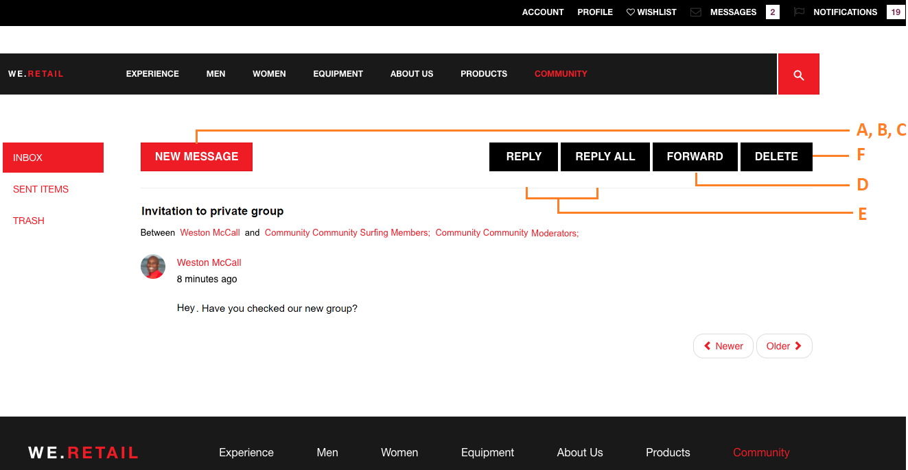

# メッセージング機能 {#messaging-feature}

フォーラムやコメントで行われる公開されたインタラクションに加えて、AEM Communitiesのメッセージング機能により、コミュニティメンバーは互いに非公開でやり取りすることができます。

This feature can be included when a [community site](/help/communities/overview.md#communitiessites) is created.

メッセージ機能を使用すると、次のことができます。

**A** - 1人または複数のコミュニティメンバーにメッセージを送信します。

**B** — ダイレクトメッセージを [一括してコミュニティのメンバーグループに送信する](/help/communities/messaging.md#group-messaging)

**C** — 添付ファイル付きのメッセージを送信する

**D** — メッセージを転送します。

**E** — メッセージに返信

**F** — メッセージを削除する

**G** — 削除したメッセージを復元します

 

メッセージ機能を有効にして変更するには、次を参照してください。

* [管理者へのメッセージの設定](/help/communities/messaging.md)
* [Messaging Essentials](/help/communities/essentials-messaging.md) for developers

>[!NOTE]
>
>作成者編集モードでのページへの `Compose Message, Message, or Message List` コンポー `Communities`ネントの追加（コンポーネントグループに含まれる）はサポートされていません。

## メッセージングコンポーネントの設定 {#configure-messaging-components}

コミュニティサイトでメッセージングを有効にすると、それ以上の設定は不要に設定されます。 この情報は、デフォルトの設定を変更する必要がある場合に表示されます。

### メッセージリストの設定（メッセージボックス） {#configure-message-list-message-box}

To modify the configuration of the list of messages for **Inbox**, **Sent Items**, and **Trash** pages of the messaging feature, open the site in [author edit mode](/help/communities/sites-console.md#authoring-site-content).

1. In `Preview` mode, select the **Messages** link to open the main messaging page. Then select either **Inbox**, **Sent Items** or **Trash** to configure the component for that message list.

1. In `Edit` mode, select the component on the page.
1. 設定ダイアログにアクセスするには、アイコンを選択して継承をキャンセルし `link` ます。
継承がキャンセルされると、設定アイコンを選択して設定ダイアログを開くことができます。

1. Once the configuration is complete, it is necessary to restore inheritance by selecting the `broken link` icon.

#### 「基本」タブ{#basic-tab}

* **サービスセレクター**

   (*Required*) Set this to the value of the property **`serviceSelector.name`** from the [AEM Communities Messaging Operations Service](/help/communities/messaging.md#messaging-operations-service).

* **構成ページ**

   (*必須*)メンバーが **`Reply`** ボタンをクリックしたときに開くページ。 ターゲットページには、**メッセージを作成**&#x200B;フォームを含める必要があります。

* **リソースとしての返信/表示**

   オンの場合、返信URLと表示URLはリソースを参照し、それ以外の場合、データはURLのクエリパラメーターとして渡されます。

* **プロファイル表示フォーム**

   送信者のプロファイルの表示に使用するプロファイルフォーム。

* **ごみ箱フォルダ**

   このチェックボックスをオンにすると、このメッセージリストコンポーネントは、削除済み（ごみ箱）としてフラグ付けされたメッセージのみを表示します。

* **Folder Paths**

   (*Required*) Referencing the values set for **inbox.path.name** and **sentitems.path.name** in the [AEM Communities Messaging Operations Service](/help/communities/messaging.md#messaging-operations-service). When configuring for an `Inbox`, add one entry using the value of **inbox.path.name**. When configuring for an `Outbox`, add one entry using the value of **sentitems.path.name**. When configuring for `Trash`, add two entries with both values.

#### 「表示」タブ{#display-tab}

* **既読をマークボタン**

   If checked, displays a `Read`button allowing a message to be marked as read.

* **未読にするボタン**

   If checked, displays a `Mark Unread` button allowing a message to be marked as read.

* **削除ボタン**

   If checked, displays a `Delete` button allowing a message to be marked as read. Will duplicate the delete functionality if **`Message Options`** is also checked.

* **メッセージオプション**

   オンの場合、メッセージ **`Reply`**&#x200B;を再送信または削除できるようにするボタン、 **`Reply All`**&#x200B;ボタン **`Forward`****`Delete`** 、およびボタンを表示します。 Will duplicate the delete functionality if **`Delete Button`** is also checked.

* **1 ページのメッセージ数**

   指定する数値は、ページネーションスキームで1ページに表示されるメッセージの最大数です。 数字を指定しない（空白のまま）場合、すべてのメッセージが表示され、ページネーションはありません。

* **タイムスタンプのパターン**

   1つ以上の言語のタイムスタンプパターンを指定します。 初期設定は en、de、fr、it、es、ja、zh_CN、ko_KR です。

* **ユーザーを表示**

   [送信者]と[受信者]のどちらを表示するか **`Sender`** を選択す **`Recipients`** るかを選択します。

### 構成メッセージの設定 {#configure-compose-message}

To modify the configuration of the compose message page, open the site in [author edit mode](/help/communities/sites-console.md#authoring-site-content).

* In `Preview` mode, select the **Messages** link to open the main messaging page. Then select the New Message button to open the `Compose Message` page.

* In `Edit` mode, select the main component on the page containing the Message body.
* 設定ダイアログにアクセスするには、アイコンを選択して継承をキャンセルし `link` ます。
継承がキャンセルされると、設定アイコンを選択して設定ダイアログを開くことができます。

* Once the configuration is complete, it is necessary to restore inheritance by selecting the `broken link` icon.

#### 「基本」タブ{#basic-tab-1}

* **リダイレクトURL**

   メッセージの送信後に表示されるページのURLを入力します。 例： `../messaging.html`

* **キャンセル URL**

   送信者がメッセージをキャンセルした場合に表示されるページのURLを入力します。 例： `../messaging.html`

* **メッセージの件名の最大長**

   件名フィールドに入力できる最大文字数。 例えば、500のように指定します。 初期設定はno limitです。

* **メッセージ本文の最大長**

   「コンテンツ」フィールドで許可される最大文字数。 例えば、10000のように指定します。 初期設定はno limitです。

* **サービスセレクター**

   (*Required*) Set this to the value of the property **`serviceSelector.name`** from the [AEM Communities Messaging Operations Service](/help/communities/messaging.md#messaging-operations-service).

#### 「表示」タブ{#display-tab-1}

* **件名フィールドを表示**

   オンの場合、フィールドを表示し、メッセージに件名を追加で `Subject` きます。 デフォルトはチェックされていません。

* **件名ラベル**

   フィールドの横に表示するテキストを入力し `Subject` ます。 デフォルトは `Subject` です。

* **ファイルの添付フィールドを表示**

   このチェックボックスをオンにすると、フィールドが表示され、メッセージに添付ファイルを追加できるようになります。 `Attachment` デフォルトはチェックされていません。

* **添付ファイルのラベル**

   フィールドの横に表示するテキストを入力し `Attachment` ます。 デフォルトは **`Attach File`** です。

* **コンテンツフィールドを表示**

   オンの場合、フィールドを表示し、メッセージ本文の追加を有効にし `Content` ます。 デフォルトはチェックされていません。

* **コンテンツラベル**

   フィールドの横に表示するテキストを入力し `Content` ます。 デフォルトは **`Body`** です。

* **リッチテキストエディターを使用**

   オンの場合、独自のリッチテキストエディターでカスタムのコンテンツテキストボックスが使用されることを示します。 デフォルトはチェックされていません。

* **タイムスタンプのパターン**

   1つ以上の言語のタイムスタンプパターンを指定します。 初期設定は en、de、fr、it、es、ja、zh_CN、ko_KR です。

