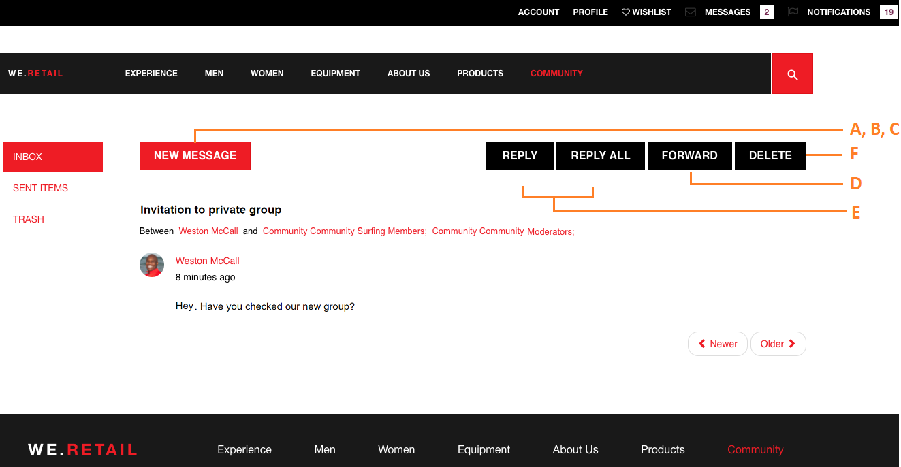
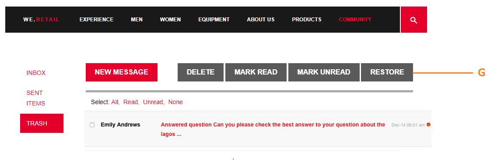
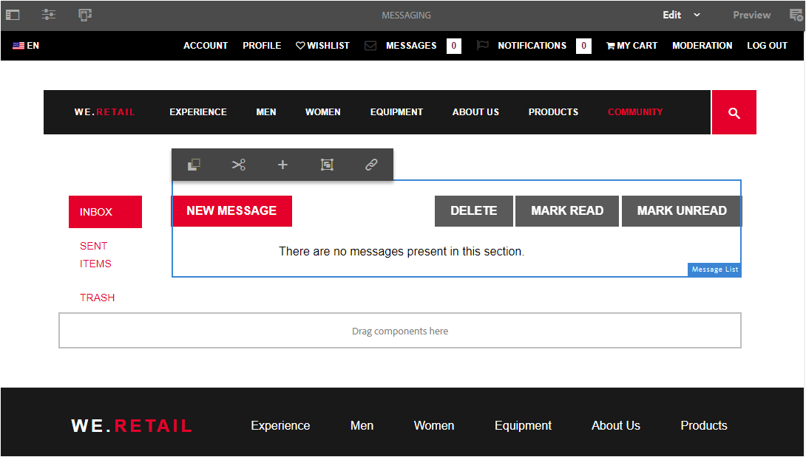
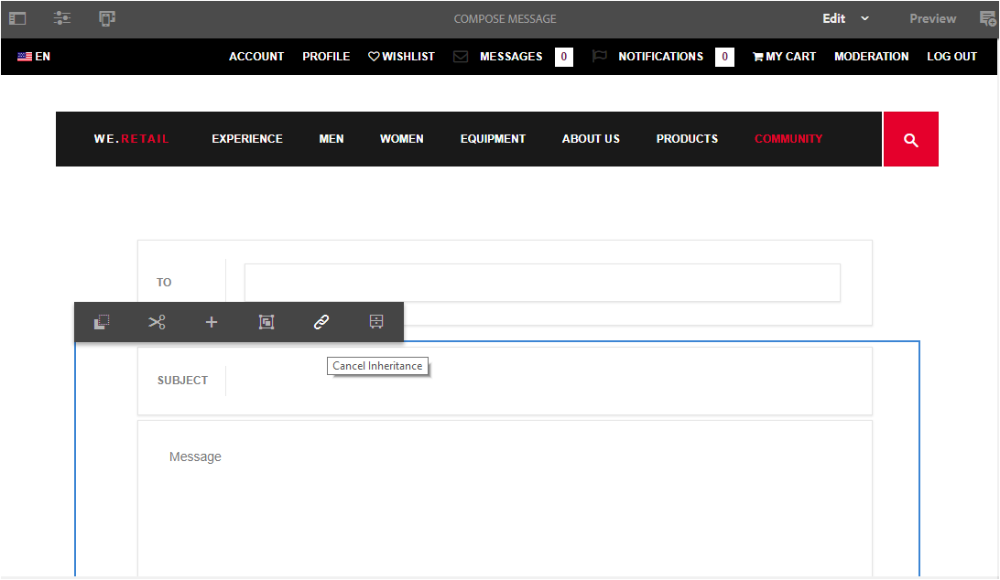
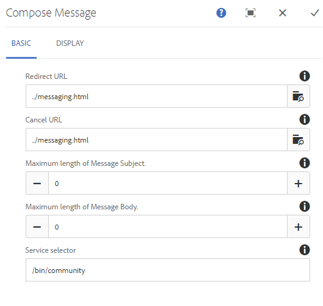

# メッセージング機能 {#messaging-feature}

AEM Communitiesのメッセージング機能を使用すると、フォーラムやコメントで発生する一般的に見えるインタラクションに加えて、コミュニティメンバー同士がよりプライベートにインタラクションできるようになります。

この機能は、[&#x200B; コミュニティサイト &#x200B;](/help/communities/overview.md#communitiessites)を作成するときに含めることができます。

メッセージング機能を使用すると、次のことが可能になります。

**A** - 1人以上のコミュニティ メンバーにメッセージを送信します

**B** - [一括でコミュニティメンバーグループにダイレクトメッセージを送信](/help/communities/messaging.md#group-messaging)

**C** – 添付ファイルを含むメッセージの送信

**D** - メッセージの転送

**E** - メッセージへの返信

**F** - メッセージを削除

**G** – 削除されたメッセージの復元

メッセージ機能を有効にして変更するには、次を参照してください。

* [管理者向けメッセージ &#x200B;](/help/communities/messaging.md)の設定
* 開発者向け[Messaging Essentials](/help/communities/essentials-messaging.md)

>[!NOTE]
>
>作成者編集モードのページに`Compose Message, Message, or Message List` コンポーネント（`Communities` コンポーネントグループ内）を追加することはサポートされていません。

## メッセージングコンポーネントの設定 {#configure-messaging-components}

コミュニティサイトに対してメッセージ機能が有効になっている場合は、それ以上の設定は必要ありません。 デフォルト設定を変更する必要がある場合は、この情報が提供されます。

### メッセージリストの設定（メッセージボックス） {#configure-message-list-message-box}

メッセージ機能の&#x200B;**受信トレイ**、**送信済みアイテム**&#x200B;および&#x200B;**ゴミ箱** ページのメッセージのリストの設定を変更するには、[作成者の編集モード &#x200B;](/help/communities/sites-console.md#authoring-site-content)でサイトを開きます。

1. `Preview` モードで、**メッセージ** リンクを選択して、メイン メッセージ ページを開きます。 次に、**受信トレイ**、**送信済みアイテム**&#x200B;または&#x200B;**ごみ箱**&#x200B;のいずれかを選択して、そのメッセージリストのコンポーネントを設定します。

1. `Edit` モードで、ページ上のコンポーネントを選択します。
1. 設定ダイアログにアクセスするには、`link` アイコンを選択して継承をキャンセルします。継承がキャンセルされると、設定アイコンを選択して設定ダイアログを開くことができます。

1. 設定が完了したら、`broken link` アイコンを選択して継承を復元する必要があります。

#### 「基本」タブ {#basic-tab}

* **サービスセレクター**

  （*必須*）これを[AEM Communities Messaging Operations Service](/help/communities/messaging.md#messaging-operations-service)のプロパティ **`serviceSelector.name`**&#x200B;の値に設定します。

* **ページを作成**

  （*必須*）メンバーが&#x200B;**`Reply`** ボタンをクリックしたときに開くページ。 ターゲットページには、**メッセージの作成** フォームを含める必要があります。

* **返信/リソースとして表示**

  オンにすると、返信URLと表示URLがリソースを参照するか、データがURL内のクエリパラメーターとして渡されます。

* **プロファイル表示フォーム**

  送信者プロファイルの表示に使用するプロファイルフォーム。

* **ゴミ箱フォルダー**

  チェックを入れた場合、このメッセージリストコンポーネントには、削除（ゴミ箱）としてフラグ付けされたメッセージのみが表示されます。

* **フォルダーパス**

  （*必須*） [AEM Communities Messaging Operations Service](/help/communities/messaging.md#messaging-operations-service)の&#x200B;**inbox.path.name**&#x200B;および&#x200B;**sentitems.path.name**&#x200B;に設定された値を参照しています。 `Inbox`に対して設定する場合、**inbox.path.name**&#x200B;の値を使用して1つのエントリを追加します。 `Outbox`に対して設定する場合は、値&#x200B;**sentitems.path.name**&#x200B;を使用して1つのエントリを追加します。 `Trash`を設定する場合は、両方の値を持つ2つのエントリを追加します。

#### 「表示」タブ {#display-tab}

* **読み取りボタンをマーク**

  オンにすると、メッセージを読み取り済みとしてマークするための`Read` ボタンが表示されます。

* **未読ボタンをマーク**

  オンにすると、メッセージを読み取り済みとしてマークするための`Mark Unread` ボタンが表示されます。

* **ボタンの削除**

  オンにすると、メッセージを読み取り済みとしてマークするための`Delete` ボタンが表示されます。 **`Message Options`**&#x200B;もチェックされている場合、削除機能が重複します。

* **メッセージオプション**

  オンにすると、**`Reply`**、**`Reply All`**、**`Forward`**、**`Delete`**&#x200B;の各ボタンが表示され、メッセージを再送信または削除できます。 **`Delete Button`**&#x200B;もチェックされている場合、削除機能が重複します。

* **ページあたりのメッセージ数**

  指定された数は、ページ番号方式でページごとに表示されるメッセージの最大数です。 番号が指定されていない場合（空白のままの場合）、すべてのメッセージが表示され、ページネーションはありません。

* **タイムスタンプパターン**

  1つ以上の言語にタイムスタンプパターンを提供します。 デフォルトは、en、de、fr、it、es、ja、zh_CN、ko_KRです。

* **ユーザーを表示**

  送信者と受信者のどちらを表示するかを決定できるように、**`Sender`**&#x200B;または&#x200B;**`Recipients`**&#x200B;のいずれかを選択します。

### メッセージ作成の設定 {#configure-compose-message}

メッセージ作成ページの設定を変更するには、[作成者編集モード &#x200B;](/help/communities/sites-console.md#authoring-site-content)でサイトを開きます。

* `Preview` モードで、**メッセージ** リンクを選択して、メイン メッセージ ページを開きます。 次に、「新規メッセージ」ボタンを選択して、`Compose Message` ページを開きます。

* `Edit` モードで、メッセージ本文を含むページ上のメインコンポーネントを選択します。
* 設定ダイアログにアクセスするには、`link` アイコンを選択して継承をキャンセルします。継承がキャンセルされると、設定アイコンを選択して設定ダイアログを開くことができます。

* 設定が完了したら、`broken link` アイコンを選択して継承を復元する必要があります。

#### 「基本」タブ {#basic-tab-1}

* **リダイレクト URL**

  メッセージの送信後に表示されるページのURLを入力します。 例えば、`../messaging.html` のように指定します。

* **URLをキャンセル**

  送信者がメッセージをキャンセルした場合に表示されるページのURLを入力します。 例えば、`../messaging.html` のように指定します。

* **メッセージ件名の最大長**

  「件名」フィールドで許可される最大文字数。 例えば、500です。 デフォルトは無制限です。

* **メッセージ本文の最大長**

  コンテンツフィールドで許可される最大文字数。 例えば、10000です。 デフォルトは無制限です。

* **サービスセレクター**

  （*必須*）これを[AEM Communities Messaging Operations Service](/help/communities/messaging.md#messaging-operations-service)のプロパティ **`serviceSelector.name`**&#x200B;の値に設定します。

#### 「表示」タブ {#display-tab-1}

* **件名フィールドを表示**

  オンにした場合は、`Subject` フィールドを表示し、メッセージに件名を追加することを有効にします。 デフォルトはオンになっていません。

* **件名ラベル**

  `Subject` フィールドの横に表示するテキストを入力します。 デフォルトは `Subject` です。

* **添付ファイル フィールドを表示**

  オンにした場合は、`Attachment` フィールドを表示し、添付ファイルをメッセージに追加することを有効にします。 デフォルトはオンになっていません。

* **添付ファイル ラベル**

  `Attachment` フィールドの横に表示するテキストを入力します。 デフォルトは **`Attach File`** です。

* **コンテンツフィールドを表示**

  オンにした場合は、`Content` フィールドを表示し、メッセージ本文の追加を有効にします。 デフォルトはオンになっていません。

* **コンテンツラベル**

  `Content` フィールドの横に表示するテキストを入力します。 デフォルトは **`Body`** です。

* **リッチテキストエディター**

  チェックを入れた場合、独自のリッチテキストエディターを持つカスタムコンテンツテキストボックスの使用を示します。 デフォルトはオンになっていません。

* **タイムスタンプパターン**

  1つ以上の言語にタイムスタンプパターンを提供します。 デフォルトは、en、de、fr、it、es、ja、zh_CN、ko_KRです。
