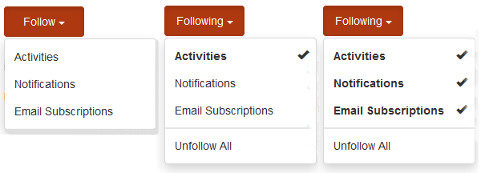

# スコアおよびバッジの基本事項{#scoring-and-badges-essentials}

AEM Communities のスコアおよびバッジ機能を使用すると、コミュニティメンバーを分類して報奨を与えることができます。

この機能の設定方法について詳しくは、以下を参照してください。

* [コミュニティのスコアおよびバッジ](/help/communities/implementing-scoring.md)

このページには、次の技術詳細が別途まとめられています。

* 画像またはテキストとして[バッジを表示](#displaying-badges)する方法
* 広範な[デバッグログ](#debug-log-for-scoring-and-badging)を有効化する方法
* how to [access UGC](#ugc-for-scoring-and-badging) related to scoring and badging

>[!CAUTION]
>
>CRXDE Lite に表示される実装構造は変更される可能性があります。

## バッジの表示 {#displaying-badges}

バッジをテキストと画像のいずれで表示するかは、クライアント側の HBS テンプレートを使用して制御します。

例えば、「 `this.isAssigned` in, `/libs/social/forum/components/hbs/topic/list-item.hbs`:」と検索します。

```
{{#each author.badges}}

  {{#if this.isAssigned}}

    <div class="scf-badge-text">

      {{this.title}}

    </div>

  {{/if}}

{{/each}}

{{#each author.badges}}

  {{#unless this.isAssigned}}

    

  {{/unless}}

{{/each}}
```

isAssigned が true の場合、役割に対してバッジが割り当てられ、そのバッジはテキストとして表示されることを示します。

isAssigned が false の場合、獲得されたスコアに対する報奨としてバッジが与えられ、そのバッジは画像として表示されることを示します。

必要に応じて、スクリプトをカスタマイズし、この動作を変更できます（オーバーライドまたはオーバーレイ）。See [Client-side Customizaton](/help/communities/client-customize.md).

## スコアおよびバッジのデバッグログ {#debug-log-for-scoring-and-badging}

スコアおよびバッジのデバッグに役立つように、カスタムログファイルを設定できます。このログファイルの内容は、この機能で問題が発生した場合にカスタマーサポートに提供されます。

詳細な手順については、[カスタムログファイルの作成](/help/sites-deploying/monitoring-and-maintaining.md#create-a-custom-log-file)を参照してください。

slinglog ファイルをすばやく設定するには、次の手順に従います。

1. 次の例に示すように、「**Adobe Experience Manager Web Console Log Support**」にアクセスします。

   * https://localhost:4502/system/console/slinglog

1. 「**Add new logger**」を選択します。

   1. select `DEBUG`for **Log Level**

   1. 「**Log File**」に次のような名前を入力します。

      * logs/scoring-debug.log
   1. enter two **Logger **(class) entries (using `+` icon)

      * `com.adobe.cq.social.scoring`
      * `com.adobe.cq.social.badging`
   1. 「**Save**」を選択します。


ログエントリを参照する方法は次のとおりです。

* Web コンソールから

   * 「**ステータス**」メニューの下
   * 「**Log Files**」を選択
   * 「`scoring-debug`」などのログファイル名を検索

* サーバーのローカルディスク上

   * ログファイルの場所は &lt;*server-install-dir*>/crx-quickstart/logs/&lt;*log-file-name*>.log

   * for example, `.../crx-quickstart/logs/scoring-debug.log`


## スコアおよびバッジの UGC {#ugc-for-scoring-and-badging}

選択された SRP が ASRP ではなく JSRP または MSRP のいずれかである場合、スコアおよびバッジに関連する UGC を参照できます(If not familiar with these terms, see [Community Content Storage](/help/communities/working-with-srp.md) and [Storage Resource Provider Overview](/help/communities/srp.md).)

ここでは、JSRP を例に挙げて、スコアおよびバッジデータにアクセスする方法を説明しています。この場合、[CRXDE Lite](/help/sites-developing/developing-with-crxde-lite.md) を使用して UGC に容易にアクセスできます。

**作成者のJSRP** :作成者環境で実験を行うと、UGCは作成者環境からのみ表示されます。

**JSRP on publish** :同様に、パブリッシュ環境でテストする場合は、パブリッシュインスタンスの管理者権限を持つCRXDE Liteにアクセスする必要があります。 If the publish instance is running in [production mode](/help/sites-administering/production-ready.md) (nosamplecontent runmode), it will be necessary to [enable CRXDE Lite](/help/sites-administering/enabling-crxde-lite.md).

The base location of UGC on JSRP is `/content/usergenerated/asi/jcr/`.

### スコアおよびバッジの API {#scoring-and-badging-apis}

使用できる API を以下に示します。

* [com.adobe.cq.social.scoring.api](https://docs.adobe.com/content/docs/en/aem/6-3/develop/ref/javadoc/com/adobe/cq/social/scoring/api/package-summary.html)
* [com.adobe.cq.social.badging.api](https://docs.adobe.com/content/docs/en/aem/6-3/develop/ref/javadoc/com/adobe/cq/social/badging/api/package-summary.html)

開発者は、インストールされた機能パックに関する最新の Javadoc をアドビのリポジトリから入手できます。[Communities 用 Maven の使用：Javadoc](/help/communities/maven.md#javadocs) を参照してください。

**リポジトリ内の UGC の場所と形式は予告なく変更されることがあります**。

### 設定例 {#example-setup}

リポジトリデータのスクリーンショットは、2 つの異なる AEM Sites 上のフォーラムに対してスコアおよびバッジを設定する場合の例です。

1. An AEM site *with* a unique id (community site created using wizard) :

* [使用の手引きのチュートリアル](/help/communities/getting-started.md)で作成された使用の手引きのチュートリアル（engage）サイトを使用します。
* フォーラムページノードを探します。

   * `/content/sites/engage/en/forum/jcr:content`

* スコアおよびバッジのプロパティを追加します。

       &quot;スコアリングルール=
 &quot;     /etc/community/scoring/rules/coring/rules-scoring,/etc/community/scoring/rules/forums/
 &quot;     forums/
    
    
    
    
    
    badging rules/et/badding/coring/comumity/coring/coring/coring/coring/coring/coring/coring/coring/coring/coring/coring/comumumumity/coring/coring/coring/coring/coring/corininininity/coring/coring/coring/coring/coring/corininininini/coring/coring/comumum
   
* フォーラムコンポーネントノードを探します。

   * `/content/sites/engage/en/forum/jcr:content/content/primary/forum`
( `sling:resourceType = social/forum/components/hbs/forum`)

* バッジを表示するためのプロパティを追加します。

   * `allowBadges = true`

* ユーザーがサインインし、フォーラムトピックを作成し、報奨としてブロンズバッジをもらいます。

1. An AEM site *without* a unique id :

* [コミュニティコンポーネントガイド](/help/communities/components-guide.md)を使用します。
* フォーラムページノードを探します。

   * `/content/community-components/en/forum/jcr:content`

* スコアおよびバッジのプロパティを追加します。

   ```
       scoringRules = [/etc/community/scoring/rules/comments-scoring,
        /etc/community/scoring/rules/forums-scoring]
       ```
   
       ```
       badgingRules =[/etc/community/badging/rules/comments-scoring,
        /etc/community/badging/rules/forums-scoring]
       ```
   
* フォーラムコンポーネントノードを探します。

   * `/content/community-components/en/forum/jcr:content/content/forum`
( `sling:resourceType = social/forum/components/hbs/forum`)

* バッジを表示するためのプロパティを追加します。

   * `allowBadges = true`

* ユーザーがサインインし、フォーラムトピックを作成し、報奨としてブロンズバッジをもらいます。

1. ユーザーにcURLを使用してモデレーターバッジが割り当てられました。

```shell
curl -i -X POST -H "Accept:application/json" -u admin:admin -F ":operation=social:assignBadge" -F "badgeContentPath=/etc/community/badging/images/moderator/jcr:content/moderator.png" https://localhost:4503/home/users/community/w271OOup2Z4DjnOQrviv/profile.social.json
```

ユーザーが2つの青銅バッジを獲得し、モデレーターバッジを授与されたので、ユーザーは次のようにフォーラムエントリと共に表示されます。


>[!NOTE]
>
>この例では次のベストプラクティスに従っていません。
>
>* スコアルールの名前はグローバルレベルで一意にする必要があり、末尾を同じ名前にしてはなりません。
   >  what *not *to doの例：
   >  /etc/community/scoring/rules/site1/forums-scoring
   >  /etc/community/scoring/rules/site2/forums-scoring
   >
   >
* 異なる AEM Sites にはそれぞれ一意のバッジ画像を作成します。
>


### スコア関連の UGC へのアクセス {#access-scoring-ugc}

[API](#scoring-and-badging-apis) の使用が推奨されます。

例えば JSRP を使用する場合、スコアが格納される基本フォルダーは次のとおりです。

* `/content/usergenerated/asi/jcr/scoring`

`scoring` の子ノードがスコアルール名になります。したがって、サーバー上のスコアリングルール名はグローバルに一意になることがベストプラクティスです。

For the Geometrixx Engage site, the user and their score is in a path contstructed with the scoring rule name, community site&#39;s site id ( `engage-ba81p`), an unique id, and the user&#39;s id :

* `.../scoring/forums-scoring/engage-ba81p/6d179715c0e93cb2b20886aa0434ca9b5a540401/riley`

コミュニティコンポーネントガイドのサイトの場合、ユーザーとそのスコアは、スコアルール名、デフォルト ID（`default-site`）、一意の ID、およびユーザー ID で構成されるパスで表されます。

* `.../scoring/forums-scoring/default-site/b27a17cb4910a9b69fe81fb1b492ba672d2c086e/riley`

The score is stored in the property `scoreValue_tl` which may directonly contain a value or indirectly refer to an atomicCounter.


### バッジ関連の UGC へのアクセス {#access-badging-ugc}

[API](#scoring-and-badging-apis) の使用が推奨されます。

例えば JSRP を使用する場合、割り当てられたバッジまたは報奨として与えられたバッジについての情報が格納される基本フォルダーは次のとおりです。

* /content/usergenerated/asi/jcr

次のように、ユーザーのプロファイルのパスが続き、最後が badges フォルダーになります。

* /home/users/community/w271OOup2Z4DjnOQrviv/profile/badges

#### 報奨として与えられたバッジ {#awarded-badge}


#### 割り当てられたバッジ {#assigned-badge}



## 追加情報 {#additional-information}

ポイントに基づいて並べ替えたメンバーリストを表示するには：

* [コミュニティサイト](/help/communities/functions.md#leaderboard-function) またはグループテンプレートに含めるリーダーボード機能。
* [リーダーボードコンポーネント](/help/communities/enabling-leaderboard.md)：ページオーサリング用のリーダーボード機能の主要コンポーネント

