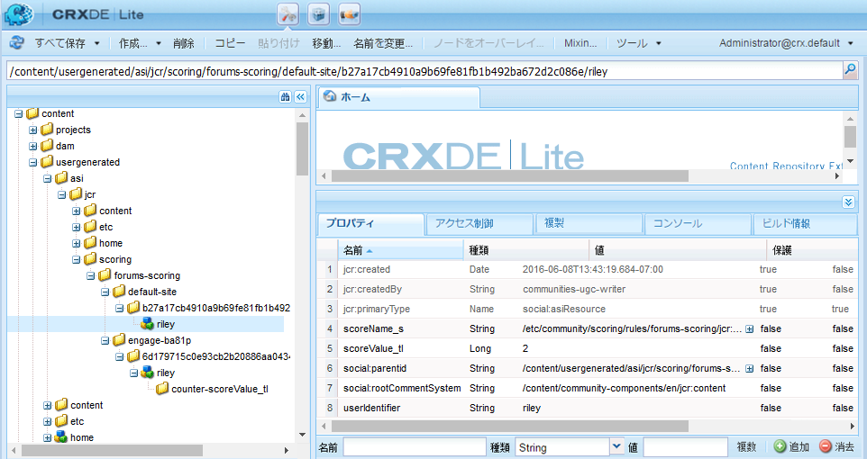
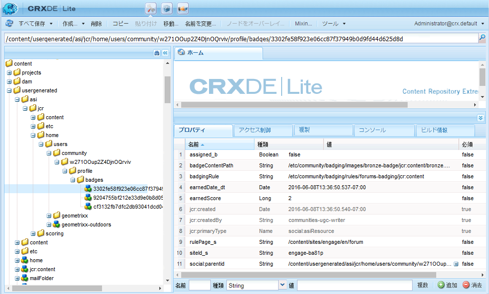
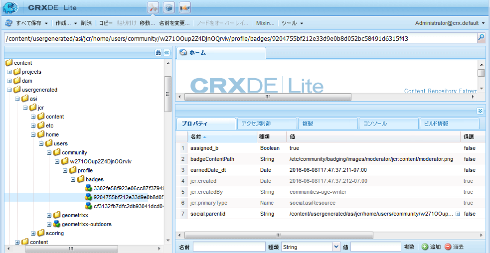

# スコアおよびバッジの基本事項 {#scoring-and-badges-essentials}

AEM Communities のスコアおよびバッジ機能を使用すると、コミュニティメンバーを分類して報奨を与えることができます。

この機能の設定方法について詳しくは、以下を参照してください。

* [コミュニティのスコアとバッジ](/help/communities/implementing-scoring.md)

このページには、次の技術詳細が別途まとめられています。

* バッジ](#displaying-badges)を画像またはテキストとして[表示する方法
* 広範な[デバッグログ](#debug-log-for-scoring-and-badging)を有効にする方法
* スコアとバッジに関連するUGC](#ugc-for-scoring-and-badging)に[アクセスする方法

>[!CAUTION]
>
>CRXDE Lite に表示される実装構造は変更される可能性があります。

## バッジの表示 {#displaying-badges}

バッジをテキストと画像のいずれで表示するかは、クライアント側の HBS テンプレートを使用して制御します。

例えば、`/libs/social/forum/components/hbs/topic/list-item.hbs`で`this.isAssigned`を検索します。

```
{{#each author.badges}}

  {{#if this.isAssigned}}

    <div class="scf-badge-text">

      {{this.title}}

    </div>

  {{/if}}

{{/each}}

{{#each author.badges}}

  {{#unless this.isAssigned}}

    

  {{/unless}}

{{/each}}
```

isAssigned が true の場合、役割に対してバッジが割り当てられ、そのバッジはテキストとして表示されることを示します。

isAssigned が false の場合、獲得されたスコアに対する報奨としてバッジが与えられ、そのバッジは画像として表示されることを示します。

必要に応じて、スクリプトをカスタマイズし、この動作を変更できます（オーバーライドまたはオーバーレイ）。[クライアント側のカスタマイズ](/help/communities/client-customize.md)を参照してください。

## スコアおよびバッジのデバッグログ {#debug-log-for-scoring-and-badging}

スコアおよびバッジのデバッグに役立つように、カスタムログファイルを設定できます。この機能で問題が発生した場合は、このログファイルの内容をカスタマーサポートに提供できます。

詳細な手順については、[カスタムログファイルの作成](/help/sites-deploying/monitoring-and-maintaining.md#create-a-custom-log-file)を参照してください。

slinglog ファイルをすばやく設定するには、次の手順に従います。

1. **Adobe Experience Manager Webコンソールログのサポート**&#x200B;にアクセスします。例：

   * https://localhost:4502/system/console/slinglog

1. 「**新しいロガーを追加**」を選択します。

   1. **ログレベル**&#x200B;に`DEBUG`を選択します。

   1. **ログファイル**&#x200B;の名前を入力します。例：

      * logs/scoring-debug.log
   1. 2つの&#x200B;**Logger** （クラス）エントリを入力します（`+`アイコンを使用）。

      * `com.adobe.cq.social.scoring`
      * `com.adobe.cq.social.badging`
   1. 「**保存**」を選択します。


ログエントリを表示するには：

* Webコンソールから

   * **ステータス**&#x200B;メニューの下
   * 「**ログファイル**」を選択します。
   * `scoring-debug`など、ログファイル名を検索します。

* サーバのローカル・ディスク上

   * ログファイルは、&lt;*server-install-dir*>/crx-quickstart/logs/&lt;*log-file-name*.logにあります。

   * 例：`.../crx-quickstart/logs/scoring-debug.log`


## スコアおよびバッジの UGC {#ugc-for-scoring-and-badging}

選択された SRP が ASRP ではなく JSRP または MSRP のいずれかである場合、スコアおよびバッジに関連する UGC を参照できます（これらの用語に詳しくない場合は、[コミュニティコンテンツストレージ](/help/communities/working-with-srp.md)および[ストレージリソースプロバイダーの概要](/help/communities/srp.md)を参照してください）。

ここでは、JSRP を例に挙げて、スコアおよびバッジデータにアクセスする方法を説明しています。この場合、[CRXDE Lite](/help/sites-developing/developing-with-crxde-lite.md) を使用して UGC に容易にアクセスできます。

**オーサー環境のJSRP**:オーサー環境で実験を行うと、UGCはオーサー環境からのみ表示されます。

**パブリッシュ環境のJSRP**:同様に、パブリッシュ環境でテストする場合は、パブリッシュインスタンスの管理者権限を持つCRXDE Liteにアクセスする必要があります。パブリッシュインスタンスが[実稼動モード](/help/sites-administering/production-ready.md)（nosamplecontent実行モード）で実行されている場合は、[CRXDE Lite](/help/sites-administering/enabling-crxde-lite.md)を有効にする必要があります。

JSRP上のUGCの基本位置は`/content/usergenerated/asi/jcr/`です。

### スコアおよびバッジの API {#scoring-and-badging-apis}

使用できる API を以下に示します。

* [com.adobe.cq.social.scoring.api](https://docs.adobe.com/content/docs/en/aem/6-3/develop/ref/javadoc/com/adobe/cq/social/scoring/api/package-summary.html)
* [com.adobe.cq.social.badging.api](https://docs.adobe.com/content/docs/en/aem/6-3/develop/ref/javadoc/com/adobe/cq/social/badging/api/package-summary.html)

開発者は、インストールされた機能パックに関する最新の Javadoc をアドビのリポジトリから入手できます。[Communities 用 Maven の使用：Javadoc](/help/communities/maven.md#javadocs) を参照してください。

**リポジトリ内の UGC の場所と形式は予告なく変更されることがあります**。

### 設定例 {#example-setup}

リポジトリデータのスクリーンショットは、2 つの異なる AEM Sites 上のフォーラムに対してスコアおよびバッジを設定する場合の例です。

1. *が一意のIDを持つAEMサイト*（ウィザードを使用して作成されたコミュニティサイト）:

   * [入門チュートリアル](/help/communities/getting-started.md)で作成した入門チュートリアル(engage)サイトの使用
   * フォーラムページノードを見つけます。

      `/content/sites/engage/en/forum/jcr:content`

   * スコアおよびバッジのプロパティの追加

   ```
   scoringRules = [/libs/settings/community/scoring/rules/comments-scoring,
   /libs/settings/community/scoring/rules/forums-scoring]
   ```

   ```
   badgingRules =[/libs/settings/community/badging/rules/comments-scoring,
   /libs/settings/community/badging/rules/forums-scoring]
   ```

   * フォーラムコンポーネントノードを探します。

      `/content/sites/engage/en/forum/jcr:content/content/primary/forum`
( `sling:resourceType = social/forum/components/hbs/forum`)

   * バッジを表示するプロパティを追加します

      `allowBadges = true`

   * ユーザーがサインインし、フォーラムトピックを作成し、ブロンズバッジを受け取る


1. 一意のIDが&#x200B;*ないAEMサイト*:

   * [コミュニティコンポーネントガイド](/help/communities/components-guide.md)の使用
   * フォーラムページノードを見つけます。

      `/content/community-components/en/forum/jcr:content`

   * スコアおよびバッジのプロパティの追加

   ```
   scoringRules = [/libs/settings/community/scoring/rules/comments-scoring,
   /libs/settings/community/scoring/rules/forums-scoring]
   ```

   ```
   badgingRules =[/libs/settings/community/badging/rules/comments-badging,
   /libs/settings/community/badging/rules/forums-badging]
   ```

   * フォーラムコンポーネントノードを探します。

      `/content/community-components/en/forum/jcr:content/content/forum`
(  `sling:resourceType = social/forum/components/hbs/forum`)

   * バッジを表示するプロパティを追加します

      `allowBadges = true`

   * ユーザーがサインインし、フォーラムトピックを作成し、ブロンズバッジを受け取る


1. cURLを使用してモデレーターバッジが割り当てられます。

   ```shell
   curl -i -X POST -H "Accept:application/json" -u admin:admin -F ":operation=social:assignBadge" -F "badgeContentPath=/libs/settings/community/badging/images/moderator/jcr:content/moderator.png" https://localhost:4503/home/users/community/w271OOup2Z4DjnOQrviv/profile.social.json
   ```

   ユーザーが2つのブロンズバッジを獲得し、モデレーターバッジを受け取ったので、この方法でユーザーがフォーラムエントリと共に表示されます。

   

>[!NOTE]
>
>この例では次のベストプラクティスに従っていません。
>
>* スコアルールの名前はグローバルレベルで一意にする必要があり、末尾を同じ名前にしてはなりません。
>
>  
*not*&#x200B;の例を次に示します。
>
>  /libs/settings/community/scoring/rules/site1/forums-scoring
>  /libs/settings/community/scoring/rules/site2/forums-scoring
>
>* 様々なAEMサイト用の一意のバッジ画像の作成


### スコア関連の UGC へのアクセス {#access-scoring-ugc}

[API](#scoring-and-badging-apis) の使用が推奨されます。

例えば JSRP を使用する場合、スコアが格納される基本フォルダーは次のとおりです。

* `/content/usergenerated/asi/jcr/scoring`

`scoring` の子ノードがスコアルール名になります。したがって、サーバー上のスコアルール名はグローバルに一意であることがベストプラクティスです。

Geometrixxのエンゲージメントサイトの場合、ユーザーとそのスコアは、スコアルール名、コミュニティサイトのサイトID( `engage-ba81p` )、一意のID、ユーザーのIDで構成されるパスになります。

* `.../scoring/forums-scoring/engage-ba81p/6d179715c0e93cb2b20886aa0434ca9b5a540401/riley`

コミュニティコンポーネントガイドのサイトの場合、ユーザーとそのスコアは、スコアルール名、デフォルト ID（`default-site`）、一意の ID、およびユーザー ID で構成されるパスで表されます。

* `.../scoring/forums-scoring/default-site/b27a17cb4910a9b69fe81fb1b492ba672d2c086e/riley`

スコアは、値を直接含むか、atomicCounterを間接的に参照するプロパティ`scoreValue_tl`に格納されます。



### バッジ関連の UGC へのアクセス {#access-badging-ugc}

[API](#scoring-and-badging-apis) の使用が推奨されます。

例えば JSRP を使用する場合、割り当てられたバッジまたは報奨として与えられたバッジについての情報が格納される基本フォルダーは次のとおりです。

* `/content/usergenerated/asi/jcr`

ユーザーのプロファイルのパスが続き、次のようなバッジフォルダーで終わります。

* `/home/users/community/w271OOup2Z4DjnOQrviv/profile/badges`

#### 授与されたバッジ{#awarded-badge}



#### 割り当てられたバッジ{#assigned-badge}



## 追加情報 {#additional-information}

ポイントに基づいて並べ替えたメンバーリストを表示するには：

* [リーダーボ](/help/communities/functions.md#leaderboard-function) ード機能（コミュニティサイトまたはグループテンプレートに含める）
* [リーダーボードコンポーネント](/help/communities/enabling-leaderboard.md)：ページオーサリング用のリーダーボード機能の主要コンポーネント
