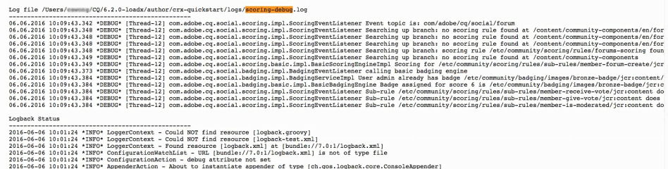

# スコアおよびバッジの基本事項 {#scoring-and-badges-essentials}

AEM Communities のスコアおよびバッジ機能を使用すると、コミュニティメンバーを分類して報奨を与えることができます。

この機能の設定方法について詳しくは、以下を参照してください。

* [コミュニティのスコアとバッジ](/help/communities/implementing-scoring.md)

このページには、次の技術詳細が別途まとめられています。

* 方法 [バッジを表示](#displaying-badges) 画像またはテキストのいずれか
* 広範な [デバッグログ](#debug-log-for-scoring-and-badging)
* 方法 [UGC にアクセス](#ugc-for-scoring-and-badging) スコアとバッジに関連する

>[!CAUTION]
>
>CRXDE Lite に表示される実装構造は変更される可能性があります。

## バッジの表示 {#displaying-badges}

バッジをテキストと画像のいずれで表示するかは、クライアント側の HBS テンプレートを使用して制御します。

例えば、「 `this.isAssigned` in `/libs/social/forum/components/hbs/topic/list-item.hbs`:

```
{{#each author.badges}}

  {{#if this.isAssigned}}

    <div class="scf-badge-text">

      {{this.title}}

    </div>

  {{/if}}

{{/each}}

{{#each author.badges}}

  {{#unless this.isAssigned}}

    

  {{/unless}}

{{/each}}
```

isAssigned が true の場合、役割に対してバッジが割り当てられ、そのバッジはテキストとして表示されることを示します。

isAssigned が false の場合、獲得されたスコアに対する報奨としてバッジが与えられ、そのバッジは画像として表示されることを示します。

必要に応じて、スクリプトをカスタマイズし、この動作を変更できます（オーバーライドまたはオーバーレイ）。詳しくは、 [クライアント側のカスタマイズ](/help/communities/client-customize.md).

## スコアおよびバッジのデバッグログ {#debug-log-for-scoring-and-badging}

スコアおよびバッジのデバッグに役立つように、カスタムログファイルを設定できます。この機能で問題が発生した場合は、このログファイルの内容をカスタマーサポートに提供できます。

詳細な手順については、[カスタムログファイルの作成](/help/sites-deploying/monitoring-and-maintaining.md#create-a-custom-log-file)を参照してください。

slinglog ファイルをすばやく設定するには、次の手順に従います。

1. 次にアクセス： **Adobe Experience Manager Web コンソールログのサポート**&#x200B;例：

   * https://localhost:4502/system/console/slinglog

1. 選択 **新しいロガーを追加**

   1. 選択 `DEBUG` 対象 **ログレベル**

   1. 名前を入力 **ログファイル**&#x200B;例：

      * logs/scoring-debug.log
   1. 2 つを入力 **ロガー** クラスエントリ ( `+` アイコン )

      * `com.adobe.cq.social.scoring`
      * `com.adobe.cq.social.badging`
   1. 選択 **保存**


ログエントリを表示するには：

* Web コンソールから

   * 以下 **ステータス** メニュー
   * 選択 **ログファイル**
   * ログファイル名を検索します（例： ）。 `scoring-debug`

* サーバのローカルディスク上

   * ログファイルは &lt;*server-install-dir*>/crx-quickstart/logs/&lt;*log-file-name*>.log

   * 例：`.../crx-quickstart/logs/scoring-debug.log`



## スコアおよびバッジの UGC {#ugc-for-scoring-and-badging}

選択された SRP が ASRP ではなく JSRP または MSRP のいずれかである場合、スコアおよびバッジに関連する UGC を参照できます( これらの用語に詳しくない場合は、 [コミュニティコンテンツストレージ](/help/communities/working-with-srp.md) および [ストレージリソースプロバイダの概要](/help/communities/srp.md).)

ここでは、JSRP を例に挙げて、スコアおよびバッジデータにアクセスする方法を説明しています。この場合、[CRXDE Lite](/help/sites-developing/developing-with-crxde-lite.md) を使用して UGC に容易にアクセスできます。

**オーサー環境の JSRP**:オーサー環境で実験を行うと、UGC がオーサー環境からのみ表示されるようになります。

**公開時の JSRP**:同様に、パブリッシュ環境でテストする場合は、パブリッシュインスタンス上の管理者権限を持つCRXDE Liteにアクセスする必要があります。 パブリッシュインスタンスがで実行されている場合 [実稼動モード](/help/sites-administering/production-ready.md) （nosamplecontent 実行モード）の場合、 [有効CRXDE Lite](/help/sites-administering/enabling-crxde-lite.md).

JSRP 上の UGC の基本的な場所は次のとおりです。 `/content/usergenerated/asi/jcr/`.

### スコアおよびバッジの API {#scoring-and-badging-apis}

使用できる API を以下に示します。

* [com.adobe.cq.social.scoring.api](https://docs.adobe.com/content/docs/en/aem/6-3/develop/ref/javadoc/com/adobe/cq/social/scoring/api/package-summary.html)
* [com.adobe.cq.social.badging.api](https://docs.adobe.com/content/docs/en/aem/6-3/develop/ref/javadoc/com/adobe/cq/social/badging/api/package-summary.html)

開発者は、インストールされた機能パックに関する最新の Javadoc をアドビのリポジトリから入手できます。[Communities 用 Maven の使用：Javadoc](/help/communities/maven.md#javadocs) を参照してください。

**リポジトリ内の UGC の場所と形式は予告なく変更されることがあります**。

### 設定例 {#example-setup}

リポジトリデータのスクリーンショットは、2 つの異なる AEM Sites 上のフォーラムに対してスコアおよびバッジを設定する場合の例です。

1. AEMサイト *と* 一意の id（ウィザードを使用して作成されたコミュニティサイト）:

   * 使用の手引きのチュートリアル (engage) サイトを使用し、 [はじめにのチュートリアル](/help/communities/getting-started.md)
   * フォーラムページノードを見つけます。

      `/content/sites/engage/en/forum/jcr:content`

   * スコアおよびバッジのプロパティの追加

   ```
   scoringRules = [/libs/settings/community/scoring/rules/comments-scoring,
   /libs/settings/community/scoring/rules/forums-scoring]
   ```

   ```
   badgingRules =[/libs/settings/community/badging/rules/comments-scoring,
   /libs/settings/community/badging/rules/forums-scoring]
   ```

   * フォーラムコンポーネントノードを探します。

      `/content/sites/engage/en/forum/jcr:content/content/primary/forum`
( `sling:resourceType = social/forum/components/hbs/forum`)

   * バッジを表示するプロパティを追加します

      `allowBadges = true`

   * ユーザーがサインインし、フォーラムトピックを作成し、ブロンズバッジを受け取ります。


1. AEMサイト *なし* 一意の id :

   * の使用 [コミュニティコンポーネントガイド](/help/communities/components-guide.md)
   * フォーラムページノードを見つけます。

      `/content/community-components/en/forum/jcr:content`

   * スコアおよびバッジのプロパティの追加

   ```
   scoringRules = [/libs/settings/community/scoring/rules/comments-scoring,
   /libs/settings/community/scoring/rules/forums-scoring]
   ```

   ```
   badgingRules =[/libs/settings/community/badging/rules/comments-badging,
   /libs/settings/community/badging/rules/forums-badging]
   ```

   * フォーラムコンポーネントノードを探します。

      `/content/community-components/en/forum/jcr:content/content/forum`
( `sling:resourceType = social/forum/components/hbs/forum`)

   * バッジを表示するプロパティを追加します

      `allowBadges = true`

   * ユーザーがサインインし、フォーラムトピックを作成し、ブロンズバッジを受け取ります。


1. cURL を使用してモデレーターバッジが割り当てられます。

   ```shell
   curl -i -X POST -H "Accept:application/json" -u admin:admin -F ":operation=social:assignBadge" -F "badgeContentPath=/libs/settings/community/badging/images/moderator/jcr:content/moderator.png" https://localhost:4503/home/users/community/w271OOup2Z4DjnOQrviv/profile.social.json
   ```

   ユーザーが 2 つのブロンズバッジを獲得し、モデレーターバッジを授与されたので、ユーザーはフォーラムエントリと共にこのように表示されます。

   

>[!NOTE]
>
>この例では次のベストプラクティスに従っていません。
>
>* スコアルールの名前はグローバルレベルで一意にする必要があり、末尾を同じ名前にしてはなりません。
>
>  例 *not* 手順：
>
>  /libs/settings/community/scoring/rules/site1/forums-scoring
>  /libs/settings/community/scoring/rules/site2/forums-scoring
>
>* 様々なAEMサイト用の一意のバッジ画像の作成


### スコア関連の UGC へのアクセス {#access-scoring-ugc}

[API](#scoring-and-badging-apis) の使用が推奨されます。

例えば JSRP を使用する場合、スコアが格納される基本フォルダーは次のとおりです。

* `/content/usergenerated/asi/jcr/scoring`

`scoring` の子ノードがスコアルール名になります。したがって、サーバー上のスコア付けルール名はグローバルに一意になることがベストプラクティスとなります。

Geometrixxエンゲージサイトの場合、ユーザーとそのスコアは、スコア付けルール名、コミュニティサイトのサイト ID( `engage-ba81p`)、一意の id、およびユーザーの id:

* `.../scoring/forums-scoring/engage-ba81p/6d179715c0e93cb2b20886aa0434ca9b5a540401/riley`

コミュニティコンポーネントガイドのサイトの場合、ユーザーとそのスコアは、スコアルール名、デフォルト ID（`default-site`）、一意の ID、およびユーザー ID で構成されるパスで表されます。

* `.../scoring/forums-scoring/default-site/b27a17cb4910a9b69fe81fb1b492ba672d2c086e/riley`

スコアはプロパティに保存されます `scoreValue_tl` この関数は、値のみを直接含む場合も、atomicCounter を間接的に参照する場合もあります。


### バッジ関連の UGC へのアクセス {#access-badging-ugc}

[API](#scoring-and-badging-apis) の使用が推奨されます。

例えば JSRP を使用する場合、割り当てられたバッジまたは報奨として与えられたバッジについての情報が格納される基本フォルダーは次のとおりです。

* `/content/usergenerated/asi/jcr`

ユーザーのプロファイルのパスが続き、次のようなバッジフォルダーで終わります。

* `/home/users/community/w271OOup2Z4DjnOQrviv/profile/badges`

#### 授与されたバッジ {#awarded-badge}


#### 割り当てられたバッジ {#assigned-badge}


## 追加情報 {#additional-information}

ポイントに基づいて並べ替えたメンバーリストを表示するには：

* [リーダーボード機能](/help/communities/functions.md#leaderboard-function) コミュニティサイトまたはグループテンプレートに含める。
* [リーダーボードコンポーネント](/help/communities/enabling-leaderboard.md)：ページオーサリング用のリーダーボード機能の主要コンポーネント
