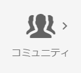

# コミュニティコンソール {#communities-consoles}

グローバルナビゲーションパネルから作成者環境で使用できるAEM Communitiesコンソールは、次のような管理タスクにアクセスできます。

* [コミュニティサイトの作成](sites-console.md)
* Adding [groups](groups.md) nested within the site
* Managing [community site templates](sites.md)
* Managing [community members](members.md)
* [モデレート](moderate-ugc.md) （ユーザー生成コンテンツ）
* Create [custom badges](badges.md)
* Configuring the [default storage for UGC](srp-config.md)

When [UGC storage](working-with-srp.md) is configured to be a common store shared by author and publish environments, the [moderation console](moderation.md), available from both author and publish environments, operates on a solitary instance of UGC.

In the author environment, after signing in with administrator privileges, the `Communities` consoles are available from the navigation and tools consoles.

>[!NOTE]
>
>In the publish environment, a [community site](sites-console.md) will display an `Administration` menu item when the signed in member has appropriate privileges.

## グローバルナビゲーションパネル {#global-navigation-panel}

`Adobe Experience Manager` のアイコンを選択し、グローバルナビゲーションパネルを開いて次の 2 つのアイコンにアクセスします。

* [ナビゲーションコンソール](#navigation-console)
* [ツールコンソール](tools.md)

## ナビゲーションコンソール {#navigation-console}

To access the various Communities consoles, from global navigation select **navigation, Communities**.

* [Sites](sites-console.md)

   The Sites console is accessible in the author environment for the purpose of creating and managing community sites and its [groups](groups.md).

* [モデレート](moderation.md)

   モデレートコンソールは、UGCの一括モデレートと作成者環境用です。 A similar bulk moderation console is accessible in the publish environment to community members assigned the role of [community moderator](users.md#publishenvironmentusersandgroups) for one or more community sites.

* [メンバー、グループ](members.md)

   メンバーコンソールとグループコンソールは、作成者環境から発行環境に存在するコミュニティメンバーとメンバーグループを管理するためのものです。

* [レポート](reports.md)

   The Reports console is where reports on assignments, page views, and posted content (UGC) may be generated when a community site has [enabled Adobe Analytics](sites-console.md#analytics). コンソールは、作成者環境でのみ使用できます。

* [リソース](resources.md)

   The Resources console is where [enablement managers](enablement.md#communitymanagers) create, manage and assign resources to members of an [enablement community site](overview.md#enablement-community). コンソールは、作成者環境でのみ使用できます。

## ツールコンソール {#tools-console}

To access [Communities Tools](tools.md) (formerly the administration console), from global navigation: **[!UICONTROL Tools]** > **[!UICONTROL Communities]**
