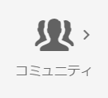

# コミュニティコンソール {#communities-consoles}

AEM Communitiesのコンソールは、グローバルナビゲーションパネルからオーサー環境で使用でき、次のような管理タスクにアクセスできます。

* [コミュニティサイトの作成](sites-console.md)
* サイト内にネストされた[&#x200B; グループ &#x200B;](groups.md)を追加しています
* [&#x200B; コミュニティサイトテンプレートの管理](sites.md)
* [&#x200B; コミュニティメンバー](members.md)の管理
* [&#x200B; ユーザー生成コンテンツ （UGC）の管理](moderate-ugc.md)
* [&#x200B; カスタムバッジの作成](badges.md)
* UGC[&#128279;](srp-config.md)の デフォルトストレージの設定

[UGC ストレージ &#x200B;](working-with-srp.md)がオーサー環境とパブリッシュ環境で共有される共通のストアとして設定されている場合、オーサー環境とパブリッシュ環境の両方から利用できる[&#x200B; モデレーションコンソール &#x200B;](moderation.md)は、UGCの単独インスタンスで動作します。

オーサー環境では、管理者権限でログインした後、ナビゲーションおよびツールコンソールから`Communities` コンソールを使用できます。

>[!NOTE]
>
>パブリッシュ環境では、サインインしたメンバーが適切な権限を持っている場合、[&#x200B; コミュニティサイト &#x200B;](sites-console.md)に`Administration` メニュー項目が表示されます。

## グローバルナビゲーションパネル {#global-navigation-panel}

左上隅の`Adobe Experience Manager` アイコンを選択して、グローバルナビゲーションパネルを開き、次の2つのアイコンにアクセスします。

* [ナビゲーションコンソール](#navigation-console)
* [ツールコンソール](tools.md)

## ナビゲーションコンソール {#navigation-console}

様々なCommunities コンソールにアクセスするには、グローバルナビゲーションから「**ナビゲーション、Communities**」を選択します。

* [Sites](sites-console.md)

  Sites コンソールには、コミュニティ サイトとその[&#x200B; グループ &#x200B;](groups.md)を作成および管理するためのオーサー環境でアクセスできます。

* [モデレート](moderation.md)

  モデレーションコンソールは、UGCとオーサー環境の一括モデレーション用です。 パブリッシュ環境では、1つ以上のコミュニティサイトに[&#x200B; コミュニティモデレーター](users.md#publishenvironmentusersandgroups)の役割を割り当てられたコミュニティメンバーに同様の一括管理コンソールがアクセスできます。

* [メンバー、グループ](members.md)

  メンバーコンソールとグループコンソールは、オーサー環境からパブリッシュ環境に存在するコミュニティメンバーとメンバーグループを管理するためのものです。

* [レポート](reports.md)

  レポートコンソールでは、コミュニティサイトで[Adobe Analytics](sites-console.md#analytics)が有効になっている場合、割り当て、ページビュー、投稿コンテンツ（UGC）に関するレポートを生成できます。 コンソールは、オーサー環境でのみ使用できます。

## ツールコンソール {#tools-console}

[&#x200B; コミュニティツール &#x200B;](tools.md) （旧管理コンソール）にアクセスするには、グローバルナビゲーションから&#x200B;**[!UICONTROL ツール]** > **[!UICONTROL コミュニティコンソール]**
