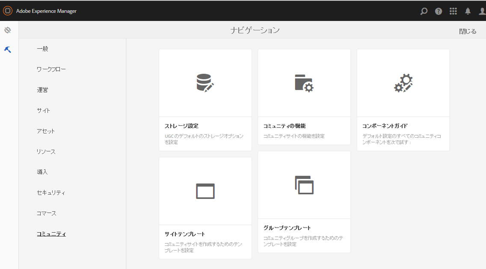
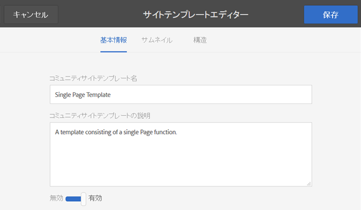
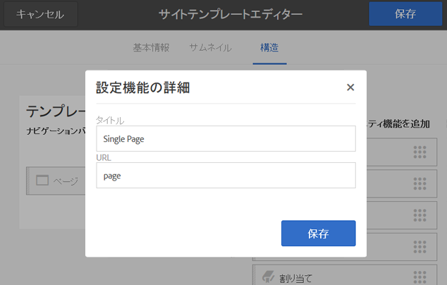
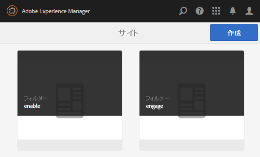
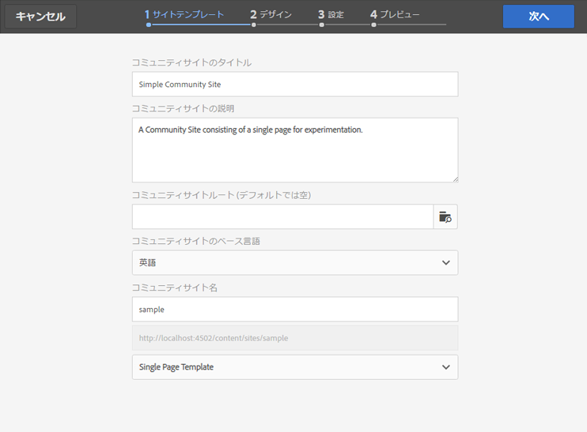
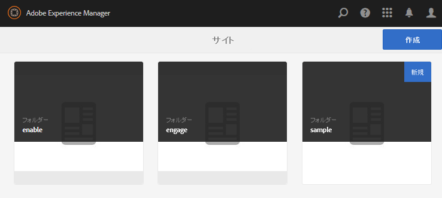
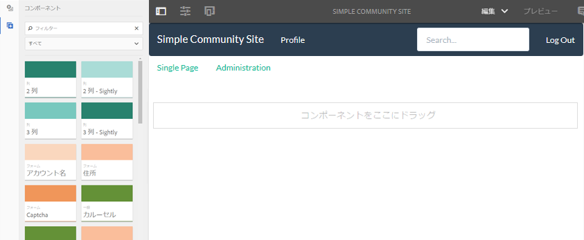

# サンプルページの作成 {#create-a-sample-page}

AEM Communities 6.1 以降では、サンプルページを作成する最も簡単な方法は、1 つのページ機能のみで構成されるシンプルなコミュニティサイトを作成することです。

この場合、[オーサリング用にコンポーネントを有効](basics.md#accessing-communities-components)にできるように parsys コンポーネントが含まれます。

サンプルコンポーネントを調査するためのもう 1 つのオプションは、[コミュニティコンポーネントガイド](components-guide.md)で提示される機能を使用することです。

## コミュニティサイトの作成 {#create-a-community-site}

これは、[AEM Communities の使用の手引き](getting-started.md)に記載されている新しいサイトの作成とよく似ています。

主な違いは、このチュートリアルでは、[ページ機能](functions.md#page-function)のみを含む新しいコミュニティサイトテンプレートを作成して、他の機能がないシンプルなコミュニティサイトを作成する点です（ただし、すべてのコミュニティサイトの基礎となる、あらかじめ接続された機能は含まれます）。

### 新しいサイトテンプレートの作成 {#create-new-site-template}

初めに、シンプルな[コミュニティサイトテンプレート](sites.md)を作成します。

オーサーインスタンスのグローバルナビゲーションから、を選択します。 **[!UICONTROL ツール]** > **[!UICONTROL コミュニティ]** > **[!UICONTROL サイトテンプレート]**.

* 選択 `Create button`
* 基本情報

   * `Name`:単一ページテンプレート
   * `Description`:単一の Page 関数で構成されるテンプレートです。
   * 選択 `Enabled`

* 構造

   * ドラッグ `Page` 関数からテンプレートビルダーに
   * 「構成関数の詳細」に、次のように入力します。

      * `Title`:単一ページ
      * `URL`: page

* 選択 **`Save`** （設定用）
* 選択 **`Save`** サイトテンプレート用

### 新しいコミュニティサイトの作成 {#create-new-community-site}

次に、シンプルなサイトテンプレートに基づいて新しいコミュニティサイトを作成します。

サイトテンプレートの作成後、グローバルナビゲーションからを選択します。 **[!UICONTROL コミュニティ/サイト]**.

* 選択 **`Create`** アイコン

* 手順 `1 - Site Template`

   * `Title`:シンプルなコミュニティサイト
   * `Description`:コミュニティサイトは、実験用の単一のページで構成されます。
   * `Community Site Root: (leave blank)`
   * `Community Site Base Language: English`
   * `Name`: sample

      * url = http://localhost:4502/content/sites/sample

      * `Template`:選択 `Single Page Template`

      

* 選択 `Next`
* 手順 `2 - Design`

   * 任意のデザインを選択

* 選択 `Next`
* 選択 `Next`

   （すべてのデフォルト設定を受け入れる）

* 選択 `Create`

   

## サイトの公開 {#publish-the-site}

[コミュニティサイトコンソール](sites-console.md)から、「発行」アイコンを選択して、サイトを http://localhost:4503（デフォルト）に公開します。

## オーサー環境でのサイトの編集モードでのオープン {#open-the-site-on-author-in-edit-mode}

「サイトを開く」アイコンを選択して、編集モードでサイトを表示します。

URL は次のようになります [http://localhost:4502/editor.html/content/sites/sample/en.html](http://localhost:4502/editor.html/content/sites/sample/en.html)

シンプルなホームページでは、コミュニティ機能とテンプレートを介してあらかじめ接続された機能を確認し、コミュニティコンポーネントの追加や設定を試してみることができます。

## パブリッシュ環境でのサイトの表示 {#view-site-on-publish}

ページを公開したら、[パブリッシュインスタンス](http://localhost:4503/content/sites/sample/en.html)でページを開いて、匿名のサイト訪問者、サインインしたメンバーまたは管理者として機能を確認します。オーサー環境に表示される「管理」リンクは、管理者がログインしない限り、パブリッシュ環境には表示されません。
