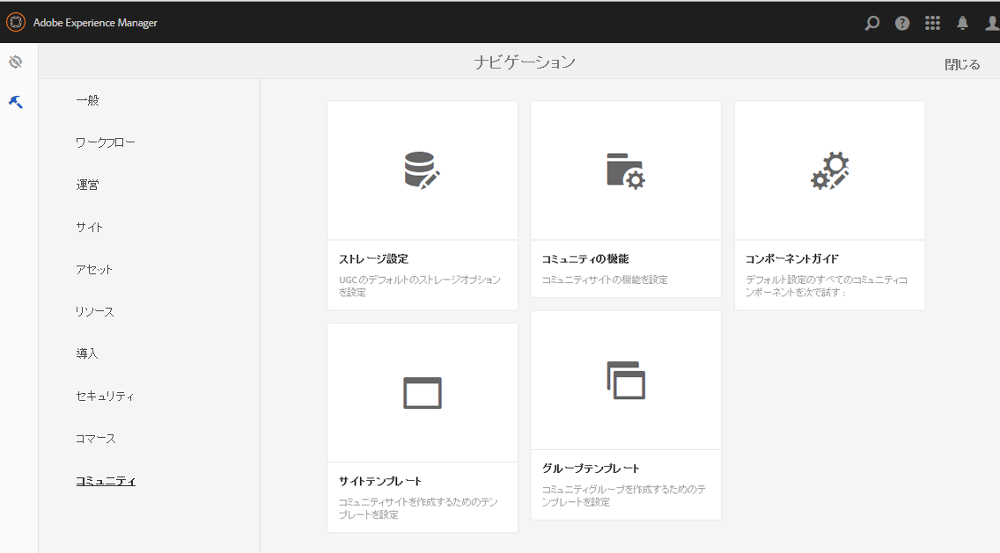
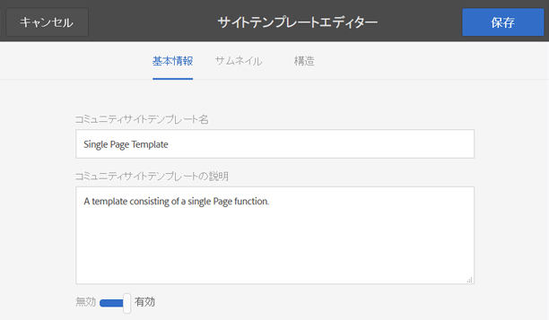
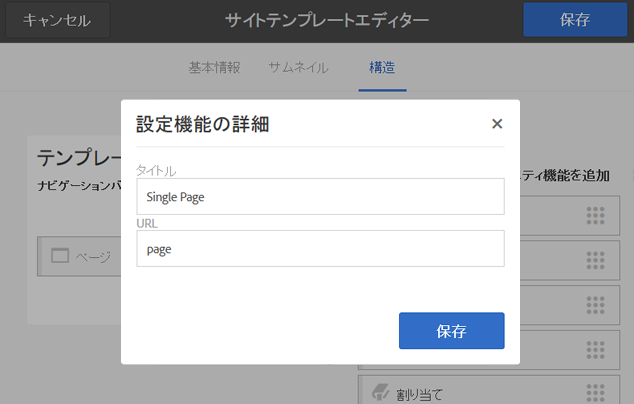
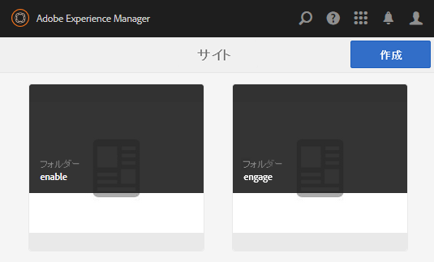
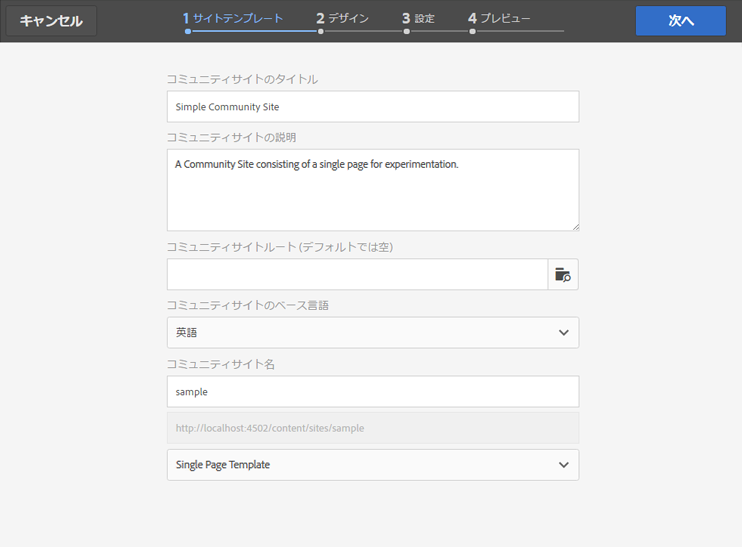
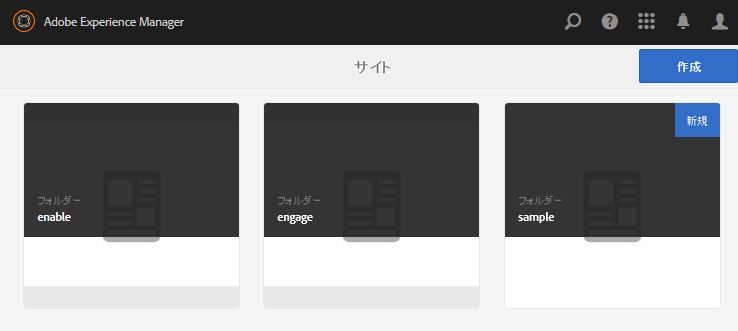
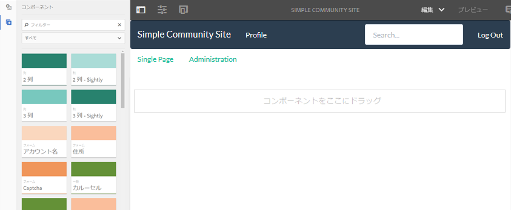

# サンプルページの作成 {#create-a-sample-page}

AEM 6.1 Communitiesでは、サンプルページを作成する最も簡単な方法は、Page関数だけで構成されるシンプルなコミュニティサイトを作成することです。

これにはparsys コンポーネントが含まれているため、[&#x200B; オーサリング用のコンポーネントを有効にできます](basics.md#accessing-communities-components)。

サンプルコンポーネントを使用して調査するもうひとつの方法は、[&#x200B; コミュニティコンポーネントガイド &#x200B;](components-guide.md)で示されている機能を使用することです。

## コミュニティサイトの作成 {#create-a-community-site}

これは、[AEM Communitiesの概要](getting-started.md)に記載されているサイトを作成する場合と同様です。

大きな違いは、このチュートリアルでは、[&#x200B; ページ関数](functions.md#page-function)のみを含むコミュニティサイトテンプレートを作成して、シンプルなコミュニティサイトを作成することです。 これは他の機能（すべてのコミュニティサイトに基本的な事前有線機能を除く）を無料で提供します。

### 新しいサイトテンプレートを作成 {#create-new-site-template}

開始するには、シンプルな[&#x200B; コミュニティサイトテンプレート &#x200B;](sites.md)を作成します。

オーサーインスタンスのグローバルナビゲーションから、**[!UICONTROL ツール]** > **[!UICONTROL コミュニティ]** > **[!UICONTROL サイトテンプレート]**&#x200B;を選択します。

* `Create button` を選択します。
* 基本情報

  * `Name`：単一ページテンプレート
  * `Description`：単一のページ関数で構成されるテンプレート。
  * `Enabled` を選択します。

* 構造

  * `Page`関数をテンプレートビルダーにドラッグします
  * 「構成機能の詳細」に、次のように入力します。

    * `Title`：単一ページ
    * `URL`: ページ

* 設定の&#x200B;**`Save`**&#x200B;を選択してください
* サイトテンプレートの&#x200B;**`Save`**&#x200B;を選択

### 新しいコミュニティサイトを作成 {#create-new-community-site}

次に、シンプルなサイトテンプレートに基づいてコミュニティサイトを作成します。

サイトテンプレートを作成したら、グローバルナビゲーションから&#x200B;**[!UICONTROL コミュニティ/サイト]**&#x200B;を選択します。

* **`Create`**&#x200B;を選択アイコン

* ステップ `1 - Site Template`

  * `Title`: シンプルなコミュニティ サイト
  * `Description`：実験用の単一ページで構成されるコミュニティサイト。
  * `Community Site Root: (leave blank)`
  * `Community Site Base Language: English`
  * `Name`: サンプル

    * url = http://localhost:4502/content/sites/sample

    * `Template`: `Single Page Template`を選択

    

* `Next` を選択します。
* ステップ `2 - Design`

  * デザインを選択

* `Next` を選択します。
* `Next` を選択します。

  （すべてのデフォルト設定を受け入れる）

* `Create` を選択します。

  

## サイトを公開 {#publish-the-site}

[&#x200B; コミュニティサイトコンソール &#x200B;](sites-console.md)から、公開アイコンを選択してサイトを公開します。デフォルトではhttp://localhost:4503です。

## 編集モードで作成者のサイトを開く {#open-the-site-on-author-in-edit-mode}

サイトを開くアイコンを選択して、編集モードでサイトを表示します。

URLは[http://localhost:4502/editor.html/content/sites/sample/en.html](http://localhost:4502/editor.html/content/sites/sample/en.html)です

シンプルなホームページでは、コミュニティ機能やテンプレートを通じて事前に接続されているものを確認したり、コミュニティコンポーネントの追加や設定を操作したりすることができます。

## 公開時にサイトを表示 {#view-site-on-publish}

ページを公開した後、[&#x200B; パブリッシュインスタンス &#x200B;](http://localhost:4503/content/sites/sample/en.html)でページを開き、匿名のサイト訪問者、サインインメンバー、または管理者として機能を試します。 オーサー環境で表示される管理リンクは、管理者がログインしない限り、パブリッシュ環境には表示されません。
