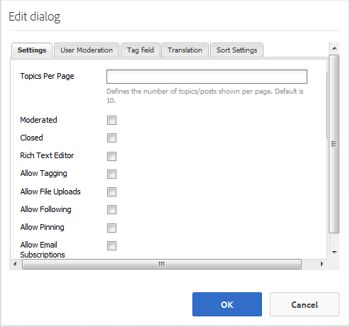

# 新しいコミュニティサイトの作成{#author-a-new-community-site}

## コミュニティサイトの作成 {#create-a-community-site}

作成者インスタンスを使用して、コミュニティサイトを作成します。 AEM作成者インスタンス上：

1. 管理者権限でサインインします。
1. From global navigation, go to **Navigation, Communities, Sites.**

コミュニティサイトコンソールでは、コミュニティサイトを作成する手順を案内するウィザードが提供されます。It is possible to move forward to the `Next`step or `Back`to the previous step before committing the site in the final step.

新しいコミュニティサイトの作成を開始するには：

* ボタンを選択 `Create`します。

### Step 1 : Site Template {#step-site-template}

[「サイトテンプレート」の手順](/help/communities/sites-console.md#step2013asitetemplate)では、URL のタイトル、説明、名前を入力し、コミュニティサイトテンプレートを選択します。次に例を示します。

* **コミュニティサイトのタイトル**: `Getting Started Tutorial`
* **コミュニティサイトの説明**: `A site for engaging with the community.`
* **コミュニティサイトのルート**:(デフォルトのルートの場合は空白のままにし `/content/sites`ます)。
* **クラウド設定**：（クラウド設定が指定されていない場合は空欄のままにする）指定されたクラウド設定へのパスを入力します。
* **コミュニティサイトの基本言語**:（単一言語の場合は手を付けないでください）。英語)ドロップダウンリストを使用して ** 、使用可能な言語(ドイツ語、イタリア語、フランス語、日本語、スペイン語、ポルトガル語（ブラジル）、中国語（繁体字）、中国語（簡体字）)から1つ以上のベース言語を選択します。 One community site will be created for each language added, and will exist within the same site folder following the best practice described in [Translating Content for Multilingual Sites](/help/sites-administering/translation.md). 各サイトのルートページには、選択したいずれかの言語の言語コード（例えば、英語では「en」、フランス語では「fr」）で名付けられた子ページが含まれます。

* **コミュニティサイト名**：engage

   * 名前はサイトの作成後には容易に変更できないので、再確認してください
   * 初期 URL は、コミュニティサイト名の下に表示されます。
   * 有効な URL に、ベース言語コード + 「.html」を追加します。
   * *例えば*、https://localhost:4502/content/sites/ `engage/en.html`

* **テンプレート**:引っ張って選ぶ `Reference Site`

「**次へ**」を選択します。

### 手順 2：デザイン {#step-design}

デザインの手順は、テーマとブランドバナーを選択するための2つのセクションに分かれています。

#### コミュニティサイトテーマ {#community-site-theme}

目的のスタイルを選択し、テンプレートに適用します。選択すると、テーマはチェックマークでオーバーレイされます。

#### コミュニティサイトブランディング {#community-site-branding}

（オプション）サイトページに表示するバナー画像をアップロードします。バナーは、ブラウザーの左端（コミュニティサイトのヘッダーとナビゲーションリンクの間）に固定されます。 バナーの高さは 120 ピクセルに切り詰められます。バナーがブラウザーの幅や 120 ピクセルの高さに合わせてリサイズされることはありません。

 

「**次へ**」を選択します。

### 手順 3：設定 {#step-settings}

On the Settings step, before selecting `Next`, note that there are seven sections providing access to configurations involving user management, tagging, moderation, group management, analytics, translation and enablement.

Visit the [Getting Started with AEM Communities for Enablement](/help/communities/getting-started-enablement.md) tutorial to experience working with the enablement features.

#### ユーザー管理 {#user-management}

「[ユーザー管理](/help/communities/sites-console.md#user-management)」タブのチェックボックスをすべてオンにします。

* サイト訪問者の自己登録を許可します。
* サイト訪問者がサインインせずにサイトを閲覧できるようにするには
* メンバーが他のコミュニティメンバーからのメッセージを送受信することを許可します。
* 登録やプロファイル作成をせずに Facebook でサインインすることを許可します。
* 登録やプロファイル作成をせずに Twitter でサインインすることを許可します。

>[!NOTE]
>
>実稼動環境では、カスタムの Facebook アプリケーションおよび Twitter アプリケーションを作成する必要があります。[Facebook と Twitter を使用したソーシャルログイン](/help/communities/social-login.md)を参照してください。

#### タグ付け {#tagging}

The tags which may be applied to community content are controlled by selecting AEM namespaces previously defined through the [Tagging Console](/help/sites-administering/tags.md#tagging-console) (such as the [Tutorial namespace](/help/communities/setup.md#create-tutorial-tags)).

名前空間は先行入力検索で簡単に検索できます。例：

* 「tut」と入力します
* select `Tutorial`

#### 役割 {#roles}

[コミュニティメンバの役割は](/help/communities/users.md) 、[役割]セクションの設定を通じて割り当てられます。

コミュニティメンバー（またはメンバーのグループ）がコミュニティマネージャーとしてサイトを体験できるようにするには、先読み検索を使用し、ドロップダウンのオプションからメンバー名またはグループ名を選択します。

例：

* 「q」と入力します。
* 「[Quinn Harper](/help/communities/enablement-setup.md#publishcreateenablementmembers)」を選択します。

>[!NOTE]
>
>[トンネルサービス](https://helpx.adobe.com/experience-manager/6-3/help/communities/deploy-communities.html#tunnel-service-on-author) では、パブリッシュ環境にのみ存在するメンバーとグループを選択できます。

#### モデレート {#moderation}

Accept the default global settings for [moderating](/help/communities/sites-console.md#moderation) user-generated content (UGC).

#### Analytics {#analytics}

Adobe Analytics のライセンスを持っていて、Analytics のクラウドサービスおよびフレームワークが設定されている場合は、Analytics を有効にしてフレームワークを選択できます。

[コミュニティ機能のための Analytics の設定](/help/communities/analytics.md)を参照してください。

#### TRANSLATION {#translation}

[翻訳設定](/help/communities/sites-console.md#translation)では、サイトの基本言語に加えて、UGC の翻訳を許可するかどうかと、どの言語に翻訳するかを指定します。

* 「**機械翻訳を許可**」をオンにします。
* デフォルトの機械翻訳サービスで翻訳するデフォルト言語は、そのままにします。
* デフォルトの翻訳プロバイダーと設定はそのままにします
* 言語コピーはないので、グローバルストアは不要です
* 「**ページ全体を翻訳**」を選択します。
* デフォルトの保持オプションはそのままにします

#### イネーブルメント {#enablement}

エンゲージメントコミュニティを作成する場合は空白のままにします。

[イネーブルメントコミュニティ](/help/communities/overview.md#enablement-community)をすばやく作成する方法のチュートリアルについて詳しくは、[イネーブルメントのための AEM Communities 使用の手引き](/help/communities/getting-started-enablement.md)を参照してください。

「**次へ**」を選択します。

### 手順 4：コミュニティサイトの作成 {#step-create-communities-site}

Select **Create.**

プロセスが完了すると、新しいサイトのフォルダーがコミュニティサイトコンソールに表示されます。

## Publish the Community Site {#publish-the-community-site}

作成したサイトは、コミュニティ - サイトコンソールで管理する必要があります。このコンソールは、新しいサイトを作成するコンソールと同じものです。

コミュニティサイトのフォルダーを選択して開いた後、サイトアイコンにマウスカーソルを合わせると 4 つのアクションアイコンが表示されます。

4つ目の省略記号アイコン（その他のアクション）を選択すると、「サイトを書き出し」および「サイトを削除」オプションが表示されます。

各アイコンの機能は次のとおりです（左から右の順に説明）。

* **サイトを開く**&#x200B;鉛筆のアイコンを選択すると、コミュニティサイトをオーサリング編集モードで開いて、ページコンポーネントを追加したり設定したりできます。

* **サイトを編集**&#x200B;プロパティアイコンを選択すると、コミュニティサイトを開いて、タイトルなどのプロパティを変更したり、テーマを変更したりできます。

* **サイトを公開**&#x200B;世界地図のアイコンを選択すると、コミュニティサイトを公開できます（例えば、パブリッシュサーバーがローカルマシン上で実行されている場合、コミュニティサイトはデフォルトで localhost:4503 に公開されます）。

* **サイトを書き出し**&#x200B;書き出しアイコンを選択すると、コミュニティサイトのパッケージが作成され、[パッケージマネージャー](/help/sites-administering/package-manager.md)に保存されて、ダウンロードされます。UGC はサイトパッケージに含まれていません。

* **サイトの削除**コミュニティ/サイトコンソールからコミュニティサイトを削除するには、削除アイコンを選択します。 サイトを削除すると、UGC やユーザーグループ、アセット、データベースレコードなど、そのサイトに関連付けられているアイテムがすべて削除されます。

>[!NOTE]
>
>パブリッシュインスタンスにデフォルトポートの 4503 を使用していない場合は、デフォルトのレプリケーションエージェントを編集し、ポート番号を正しい値に設定します。
>
>オーサーインスタンスで、メインメニューから：
>
>1. [ツール] > [操作] > [複製]メニューに移動します。
1. 「作成者のエージェント」を選択します。
1. 「デフォルトエージェント（公開）」を選択します。
1. 「設定」の横にある「編集」を選択します。
1. エージェント設定のポップアップダイアログで、「トランスポート」タブを選択します。
1. URIで、ポート番号4503を目的のポート番号に変更し、
   * 例えば、ポート6103を使用するには：https://localhost:6103/bin/receive?sling:authRequestLogin=1
1. 「OK」を選択します。
1. （オプション）複製キューをリセットするには、「クリア」または「強制再試行」を選択します。

### サイトの公開 {#select-publish}

公開サーバーが実行中であることを確認したら、地球のアイコンを選択して、コミュニティサイトを公開します。

コミュニティサイトが正常に公開されると、次のような短いメッセージが表示されます。

### New Community User Groups {#new-community-user-groups}

新しいコミュニティサイトとともに、新しいユーザーグループが作成されます。各グループには、様々な管理機能に応じて適切な権限が設定されています。For details, visit [User Groups for Community Sites](/help/communities/users.md#usergroupsforcommunitysites).

この新しいコミュニティサイトでは、手順 1 で「engage」というサイト名を指定したので、[グループコンソール](/help/communities/members.md)（グローバルナビゲーション：コミュニティ／グループ）で以下に示す 4 つの新しいユーザーグループを確認できます。

* コミュニティ管理者の関与
* コミュニティソーシャルグループ管理者
* コミュニティ Engage メンバー
* コミュニティ Engage モデレーター
* コミュニティエンゲージメント特権メンバー
* Community Engage Site Content Manager

Note that [Aaron McDonald](/help/communities/tutorials.md#demo-users) is a member of

* コミュニティ管理者の関与
* コミュニティ Engage モデレーター
* コミュニティ Engage メンバー（モデレーターグループのメンバーとして間接的に）

#### https://localhost:4503/content/sites/engage/en.html {#http-localhost-content-sites-engage-en-html}

## 認証エラーの設定 {#configure-for-authentication-error}

Once a site has been configured and pushed to publish, [configure login mapping](/help/communities/sites-console.md#configure-for-authentication-error) ( `Adobe Granite Login Selector Authentication Handler`) on the publish instance. ログイン資格情報が正しく入力されない場合、認証エラーはコミュニティサイトのログインページを再表示し、エラーメッセージが表示されるという利点があります。

名前を付けて `Login Page Mapping` 追加

* /content/sites/engage/en/signin:/content/sites/engage/en

## オプションの手順 {#optional-steps}

### デフォルトのホームページの変更 {#change-the-default-home-page}

公開サイトをデモ目的で操作するときは、デフォルトのホームページを新しいサイトに変更すると便利です。

To do so requires using [CRXDE](https://localhost:4503/crx/de) Lite to edit the [resource-mapping](/help/sites-deploying/resource-mapping.md) table on publish.

使用を開始するには：

1. 発行インスタンスで、管理者権限でサインインします。
1. Browse to [https://localhost:4503/crx/de](https://localhost:4503/crx/de).
1. In the project browser, expand `/etc/map.`
1. Select the `http` node:

   * Select **Create Node:**

      * **名前** localhost.4503( *&#39;* :&#39;を使用しないでください)

      * **Type** [sling:Mapping](https://sling.apache.org/documentation/the-sling-engine/mappings-for-resource-resolution.html)

1. With newly created `localhost.4503` node selected:

   * プロパティの追加：

      * **名前**：sling:match
      * **タイプ**：String
      * **値** localhost.4503/$（「$」文字で終わる必要があります）
   * プロパティの追加：

      * **名前**：sling:internalRedirect
      * **タイプ**：String
      * **値**：/content/sites/engage/en.html

1. Select **Save All.**
1. （オプション）閲覧履歴を削除します。
1. https://localhost:4503/を参照します。

   * https://localhost:4503/content/sites/engage/en.htmlに到着する

>[!NOTE]
To disable, simply prefix the `sling:match` property value with an &#39;x&#39; - `xlocalhost.4503/$` - and **Save All**.

#### トラブルシューティング：マップ保存エラー {#troubleshooting-error-saving-map}

If unable to save changes, be sure that the node name is `localhost.4503`, with a &#39;dot&#39; separator, and not `localhost:4503` with a &#39;colon&#39; separator, as `localhost`is not a valid namespace prefix.

#### トラブルシューティング：リダイレクト失敗 {#troubleshooting-fail-to-redirect}

The &#39;**$**&#39; at the end of the regular expression `sling:match`string is crucial, so that only exactly `https://localhost:4503/` is mapped, else the redirect value is prefixed to any path that might exist after the server:port in the URL. したがって、AEMがログインページにリダイレクトしようとすると失敗します。

### サイトの変更 {#modify-the-site}

サイトを最初に作成した後、作成者は[サイトを開くアイコン](/help/communities/sites-console.md#authoring-site-content)を使用して、標準的な AEM のオーサリングアクティビティを実行できます。

また、管理者は[サイトを編集アイコン](/help/communities/sites-console.md#modifying-site-properties)を使用して、タイトルなどのサイトプロパティを変更できます。

変更後は、必ず&#x200B;**保存**&#x200B;して再&#x200B;**公開**&#x200B;してください。

>[!NOTE]
AEM に馴染みがない場合は、[基本操作](/help/sites-authoring/basic-handling.md)に関するドキュメントおよび[ページのオーサリングのクイックガイド](/help/sites-authoring/qg-page-authoring.md)を参照してください。

