# 新しいコミュニティサイトの作成{#author-a-new-community-site}

## コミュニティサイトの作成 {#create-a-community-site}

作成者インスタンスを使用して、コミュニティサイトを作成します。 AEM作成者インスタンスで：

1. 管理者権限でサインインします。
1. グローバルナビゲーションから、**[!UICONTROL コミュニティ]** > **[!UICONTROL サイト]**&#x200B;に移動します。

コミュニティサイトコンソールでは、コミュニティサイトを作成する手順を案内するウィザードが提供されます。最後の手順でサイトをコミットする前に、`Next`または`Back`を前の手順に進むことができます。

新しいコミュニティサイトの作成を開始するには：

* `Create`ボタンを選択します。

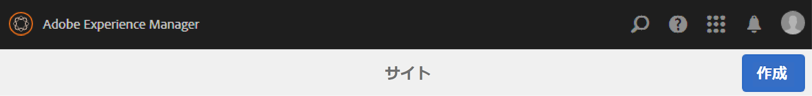

### Step 1 : Site Template {#step-site-template}

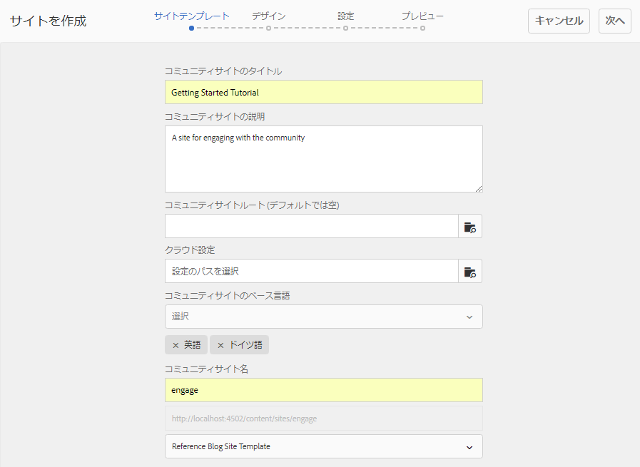

[「サイトテンプレート」の手順](/help/communities/sites-console.md#step2013asitetemplate)では、URL のタイトル、説明、名前を入力し、コミュニティサイトテンプレートを選択します。次に例を示します。

* **コミュニティサイトのタイトル**: `Getting Started Tutorial`
* **コミュニティサイトの説明**: `A site for engaging with the community.`
* **コミュニティサイトルート**:(デフォルトのルートの場合は空白のまま `/content/sites`)
* **クラウド設定**：（クラウド設定が指定されていない場合は空欄のままにする）指定されたクラウド設定へのパスを入力します。
* **コミュニティサイトの基本言語**:（単一言語の場合は手を付けないでください）。英語)ドロップダウンリストを使用して、使用可能な言語(ドイツ語、イタリア語、フランス語、日本語、スペイン語、ポルトガル語（ブラジル）、中国語（繁体字）、中国語（簡体字）)から1つ *または* 複数のベース言語を選択します。追加された言語ごとに1つのコミュニティサイトが作成され、[多言語サイト用のコンテンツの翻訳](/help/sites-administering/translation.md)で説明されているベストプラクティスに従って、同じサイトフォルダー内に存在します。 各サイトのルートページには、選択したいずれかの言語の言語コード（例えば、英語では「en」、フランス語では「fr」）で名付けられた子ページが含まれます。

* **コミュニティサイト名**：engage

   * サイトの作成後に名前が容易に変更されないので、重複チェックを行います。
   * コミュニティサイト名の下に最初のURLが表示されます
   * 有効なURLの場合は、ベース言語コード+ &quot;.html&quot;を追加します。
   * *例えば*、https://localhost:4502/content/sites/  `engage/en.html`

* **テンプレート**:下に降りて～を選ぶ  `Reference Site`

* 「**次へ**」を選択します。

### 手順 2：デザイン {#step-design}

デザインの手順は、テーマとブランディングバナーを選択するための2つのセクションで示されます。

#### コミュニティサイトテーマ {#community-site-theme}

目的のスタイルを選択し、テンプレートに適用します。選択すると、テーマはチェックマークでオーバーレイされます。

#### コミュニティサイトブランディング {#community-site-branding}

（オプション）サイトページ全体に表示するバナー画像をアップロードします。 バナーは、ブラウザーの左端（コミュニティサイトのヘッダーとナビゲーションリンクの間）に固定されます。 バナーの高さは 120 ピクセルに切り詰められます。バナーがブラウザーの幅や 120 ピクセルの高さに合わせてリサイズされることはありません。

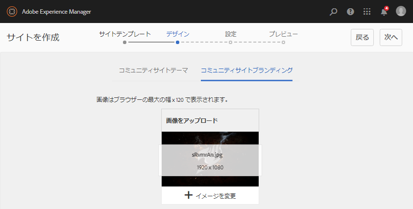

「**次へ**」を選択します。

### 手順 3：設定 {#step-settings}

設定の手順で`Next`を選択する前に、ユーザー管理、タグ付け、モデレート、グループ管理、分析、翻訳、有効化に関する設定にアクセスできる7つのセクションがあることに注意してください。

[有効化のためのAEM Communitiesの使用の手引き](/help/communities/getting-started-enablement.md)チュートリアルにアクセスして、有効化機能の使用を体験してください。

#### ユーザー管理 {#user-management}

「[ユーザー管理](/help/communities/sites-console.md#user-management)」タブのチェックボックスをすべてオンにします。

* サイト訪問者が自己登録できるようにするには
* サイト訪問者がサインインせずにサイトに表示できるようにするには
* 他のコミュニティメンバーからのメッセージの送受信を許可するには
* プロファイルの登録と作成を行う代わりにFacebookでのログインを許可するには
* プロファイルの登録と作成を行う代わりに、Twitterでのログインを許可するには

>[!NOTE]
>
>実稼動環境では、カスタムの Facebook アプリケーションおよび Twitter アプリケーションを作成する必要があります。[Facebook と Twitter を使用したソーシャルログイン](/help/communities/social-login.md)を参照してください。

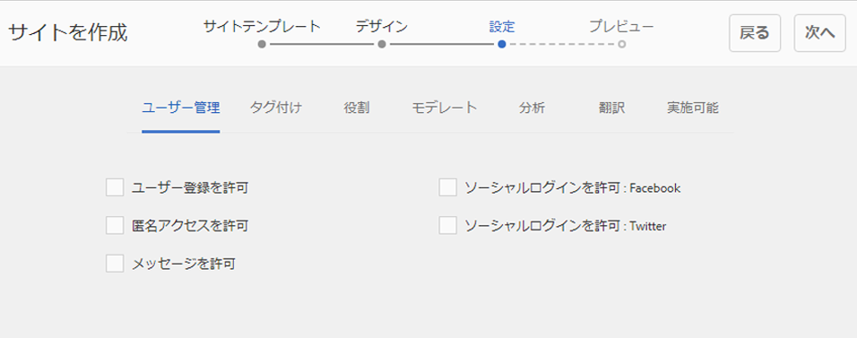

#### タグ付け {#tagging}

コミュニティコンテンツに適用できるタグは、[タグ付けコンソール](/help/sites-administering/tags.md#tagging-console)で事前に定義したAEM名前空間([チュートリアル名前空間](/help/communities/setup.md#create-tutorial-tags)など)を選択することで制御します。

名前空間は先行入力検索で簡単に検索できます。例：

* 型 `tut`
*  `Tutorial`

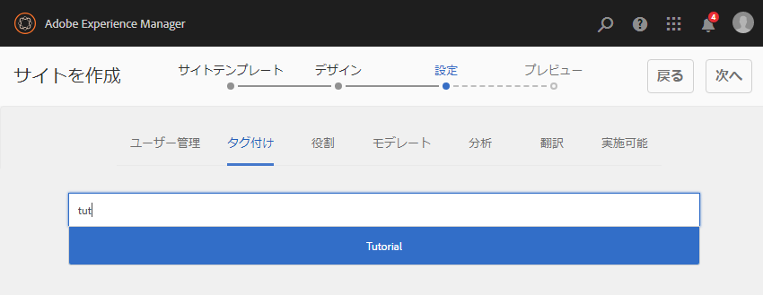

#### 役割 {#roles}

[コミュニティメンバ](/help/communities/users.md) ーロールは、[役割]セクションの設定を通じて割り当てられます。

コミュニティメンバー（またはメンバーのグループ）がコミュニティマネージャーとしてサイトを体験できるようにするには、先頭入力検索を使用し、ドロップダウンのオプションからメンバーまたはグループ名を選択します。

例：

* 型 `q`
* [クインハーパー](/help/communities/enablement-setup.md#publishcreateenablementmembers)を選択

>[!NOTE]
>
>[トンネル](https://helpx.adobe.com/experience-manager/6-3/help/communities/deploy-communities.html#tunnel-service-on-author) サービスでは、パブリッシュ環境のみに存在するメンバーとグループを選択できます。

#### モデレート {#moderation}

[モデレート](/help/communities/sites-console.md#moderation)ユーザー生成コンテンツ(UGC)のデフォルトのグローバル設定を受け入れます。

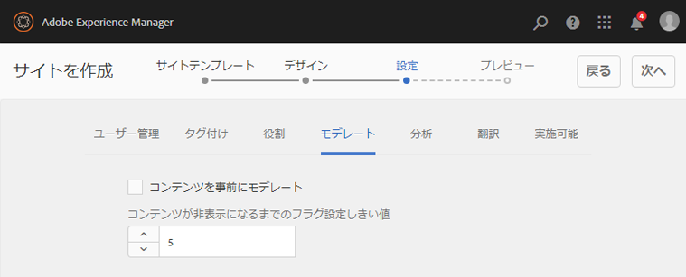

#### Analytics {#analytics}

Adobe Analytics のライセンスを持っていて、Analytics のクラウドサービスおよびフレームワークが設定されている場合は、Analytics を有効にしてフレームワークを選択できます。

[コミュニティ機能のための Analytics の設定](/help/communities/analytics.md)を参照してください。

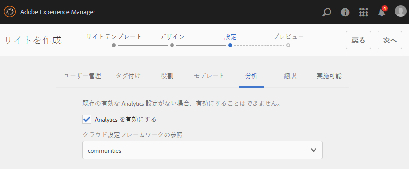

#### 翻訳{#translation}

[翻訳設定](/help/communities/sites-console.md#translation)では、サイトの基本言語に加えて、UGC の翻訳を許可するかどうかと、どの言語に翻訳するかを指定します。

* **機械翻訳を許可**&#x200B;を確認
* デフォルトの機械翻訳サービスで、翻訳用にデフォルトの言語を選択したままにする
* デフォルトの翻訳プロバイダーとconfigのままにする
* 言語コピーがないので、グローバルストアは不要です
* **ページ全体を翻訳**&#x200B;を選択
* デフォルトの永続性オプションをそのまま使用

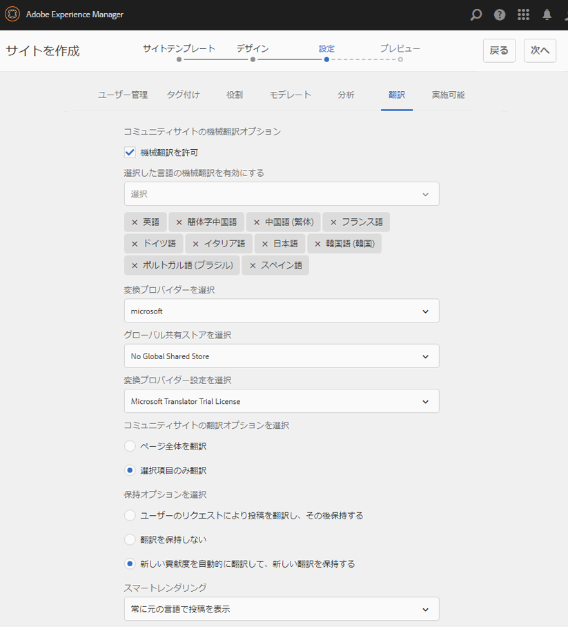

#### イネーブルメント {#enablement}

エンゲージメントコミュニティを作成する場合は空白のままにします。

[イネーブルメントコミュニティ](/help/communities/overview.md#enablement-community)をすばやく作成する方法のチュートリアルについて詳しくは、[イネーブルメントのための AEM Communities 使用の手引き](/help/communities/getting-started-enablement.md)を参照してください。

「**次へ**」を選択します。

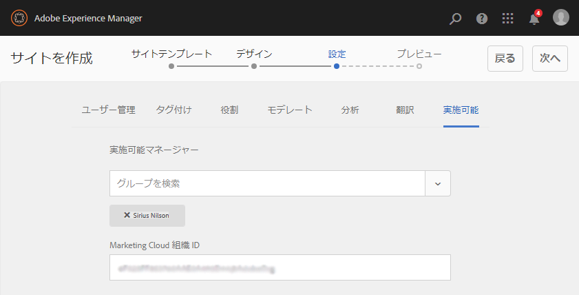

### 手順 4：コミュニティサイトの作成 {#step-create-communities-site}

「**作成」を選択します。**

プロセスが完了すると、新しいサイトのフォルダーがコミュニティサイトコンソールに表示されます。

## コミュニティサイトを公開する{#publish-the-community-site}

作成したサイトは、コミュニティ - サイトコンソールで管理する必要があります。このコンソールは、新しいサイトを作成するコンソールと同じものです。

コミュニティサイトのフォルダーを選択して開いた後、サイトアイコンにマウスカーソルを合わせると 4 つのアクションアイコンが表示されます。

4つ目の楕円アイコン（その他のアクション）を選択すると、「サイトを書き出し」オプションと「サイトを削除」オプションが表示されます。

各アイコンの機能は次のとおりです（左から右の順に説明）。

* **サイトを開く**

   ページコンポーネントの追加や設定を行うには、鉛筆アイコンを選択して、作成者編集モードでコミュニティサイトを開きます

* **サイトを編集**

   プロパティアイコンを選択して、コミュニティサイトを開き、タイトルやテーマの変更など、プロパティの変更を行います

* **サイトを公開**

   コミュニティサイトを公開するには、世界中のアイコンを選択します（例えば、公開サーバーがローカルマシンで実行されている場合は、デフォルトでlocalhost:4503に移動します）。

* **サイトを書き出し**

   書き出しアイコンを選択して、コミュニティサイトのパッケージを作成します。このパッケージが、[パッケージマネージャー](/help/sites-administering/package-manager.md)に格納され、ダウンロード可能になります。UGC はサイトパッケージに含まれていません。

* **サイトを削除**

   **[!UICONTROL コミュニティ/サイトコンソール]**&#x200B;内からコミュニティサイトを削除するには、削除アイコンを選択します。 サイトを削除すると、UGC やユーザーグループ、アセット、データベースレコードなど、そのサイトに関連付けられているアイテムがすべて削除されます。

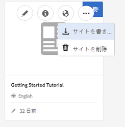

>[!NOTE]
>
>パブリッシュインスタンスにデフォルトポートの 4503 を使用していない場合は、デフォルトのレプリケーションエージェントを編集し、ポート番号を正しい値に設定します。
>
>オーサーインスタンスで、メインメニューから：
>
>1. **[!UICONTROL ツール]** > **[!UICONTROL 操作]** > **[!UICONTROL レプリケーション]**&#x200B;メニューに移動します。
>1. 「作成者&#x200B;]**のエージェント」を選択します。**[!UICONTROL 
>1. 「**[!UICONTROL デフォルトエージェント（発行）]**」を選択します。
>1. 「**[!UICONTROL 設定]**」の横にある「**[!UICONTROL 編集]**」を選択します。
>1. エージェント設定のポップアップダイアログで、「**[!UICONTROL トランスポート]**」タブを選択します。
>1. URIで、ポート番号4503を目的のポート番号に変更します。 例えば、ポート6103を使用するには：https://localhost:6103/bin/receive?sling:authRequestLogin=1
>1. 「**[!UICONTROL OK]**」を選択します。
>1. （オプション）レプリケーションキューをリセットするには、「**[!UICONTROL クリア]**」または「**[!UICONTROL 再試行を強制]**」を選択します。

### サイトの公開 {#select-publish}

公開サーバーが実行中であることを確認したら、地球のアイコンを選択して、コミュニティサイトを公開します。

コミュニティサイトが正常に公開されると、「公開済みのサイト」というメッセージが短く表示されます。

### 新しいコミュニティユーザーグループ{#new-community-user-groups}

新しいコミュニティサイトとともに、新しいユーザーグループが作成されます。各グループには、様々な管理機能に応じて適切な権限が設定されています。詳しくは、[コミュニティサイトのユーザーグループ](/help/communities/users.md#usergroupsforcommunitysites)を参照してください。

この新しいコミュニティサイトでは、手順 1 で「engage」というサイト名を指定したので、[グループコンソール](/help/communities/members.md)（グローバルナビゲーション：コミュニティ／グループ）で以下に示す 4 つの新しいユーザーグループを確認できます。

* コミュニティのソーシャル管理
* コミュニティソーシャル管理グループの管理者
* コミュニティ Engage メンバー
* コミュニティ Engage モデレーター
* コミュニティの権限を持つメンバー
* Community Engage Site Content Manager

[アーロン・マクドナルド](/help/communities/tutorials.md#demo-users)は

* コミュニティのソーシャル管理
* コミュニティ Engage モデレーター
* コミュニティ Engage メンバー（モデレーターグループのメンバーとして間接的に）

#### https://localhost:4503/content/sites/engage/en.html {#http-localhost-content-sites-engage-en-html}

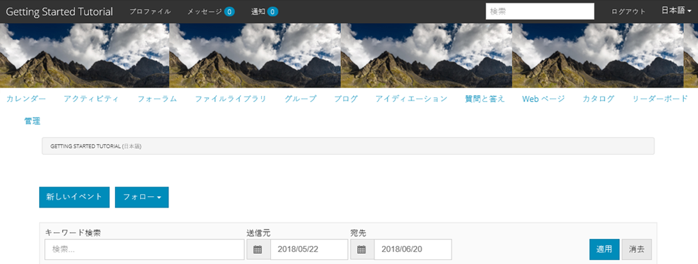

## 認証エラーの設定 {#configure-for-authentication-error}

サイトが設定され、発行にプッシュされたら、発行インスタンスで[ログインマッピング](/help/communities/sites-console.md#configure-for-authentication-error)(`Adobe Granite Login Selector Authentication Handler`)を設定します。 ログイン資格情報が正しく入力されていない場合、認証エラーによってコミュニティサイトのログインページが再表示され、エラーメッセージが表示されるという利点があります。

追加`Login Page Mapping`

* `/content/sites/engage/en/signin:/content/sites/engage/en`

## オプションの手順 {#optional-steps}

### デフォルトのホームページの変更 {#change-the-default-home-page}

公開サイトをデモ目的で操作するときは、デフォルトのホームページを新しいサイトに変更すると便利です。

これを行うには、[CRXDE](https://localhost:4503/crx/de) Liteを使用して、発行時に[resource-mapping](/help/sites-deploying/resource-mapping.md)テーブルを編集する必要があります。

開始するには：

1. 発行インスタンスで、管理者権限でサインインします。
1. [https://localhost:4503/crx/de](https://localhost:4503/crx/de)を参照します。
1. プロジェクトブラウザで`/etc/map.`を展開します。
1. `http`ノードを選択します。

   * 「**ノードを作成：**」を選択します。

      * **** Namelocalhost.4503 (&#39;:&#39;を ** 使用しないでください)

      * **** [タイプ：マッピング](https://sling.apache.org/documentation/the-sling-engine/mappings-for-resource-resolution.html)

1. 新しく作成した`localhost.4503`ノードを選択した状態：

   * 追加プロパティ：

   * **名前**：sling:match
      * **タイプ**：String
      * **** Valuelocalhost.4503/$（「$」文字で終わる必要があります）
   * 追加プロパティ：

      * **名前**：sling:internalRedirect
      * **タイプ**：String
      * **値**：/content/sites/engage/en.html

1. 「すべて保存」を選択します。****
1. （オプション）閲覧履歴を削除します。
1. https://localhost:4503/を参照します。

   * https://localhost:4503/content/sites/engage/en.htmlにアクセスします。

>[!NOTE]
>
>無効にするには、`sling:match`プロパティの値の先頭に「x」 — `xlocalhost.4503/$` — と&#x200B;**「すべて保存**」を付けます。

#### トラブルシューティング：マップ保存エラー {#troubleshooting-error-saving-map}

変更を保存できない場合は、ノード名が「ドット」区切り文字の`localhost.4503`で、「コロン」区切り文字の`localhost:4503`ではなく、「a2/>」が有効な名前空間プレフィックスではないことを確認してください。`localhost`

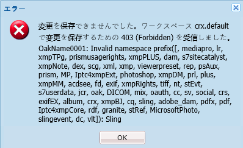

#### トラブルシューティング：リダイレクト失敗 {#troubleshooting-fail-to-redirect}

正規式`sling:match`文字列の末尾の「**$**」が重要なので、正確に`https://localhost:4503/`のみがマッピングされます。そうでない場合、リダイレクト値はURLのserver:portの後に存在する任意のパスにプリフィックスされます。 したがって、AEMがログインページにリダイレクトしようとすると、失敗します。

### サイトの変更 {#modify-the-site}

サイトを最初に作成した後、作成者は[サイトを開くアイコン](/help/communities/sites-console.md#authoring-site-content)を使用して、標準的な AEM のオーサリングアクティビティを実行できます。

また、管理者は[サイトを編集アイコン](/help/communities/sites-console.md#modifying-site-properties)を使用して、タイトルなどのサイトプロパティを変更できます。

変更後は、必ず&#x200B;**保存**&#x200B;して再&#x200B;**公開**&#x200B;してください。

>[!NOTE]
>
>AEM に馴染みがない場合は、[基本操作](/help/sites-authoring/basic-handling.md)に関するドキュメントおよび[ページのオーサリングのクイックガイド](/help/sites-authoring/qg-page-authoring.md)を参照してください。
