# コミュニティサイトの作成{#author-a-new-community-site}

## コミュニティサイトの作成 {#create-a-community-site}

オーサーインスタンスを使用してコミュニティサイトを作成します。 AEM オーサーインスタンスの場合：

1. 管理者権限でログインします。
1. グローバルナビゲーションから、**[!UICONTROL Communities]** > **[!UICONTROL Sites]**&#x200B;に移動します。

Communities Sites コンソールには、コミュニティサイトの作成手順をガイドするウィザードが用意されています。 最後の手順でサイトを確定する前に、`Next` ステップまたは`Back`を前の手順に進めることができます。

コミュニティサイトの作成を開始するには：

* 「`Create`」ボタンを選択します。

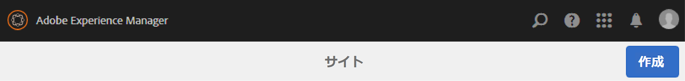

### 手順1：サイトテンプレート {#step-site-template}

サイトを作成する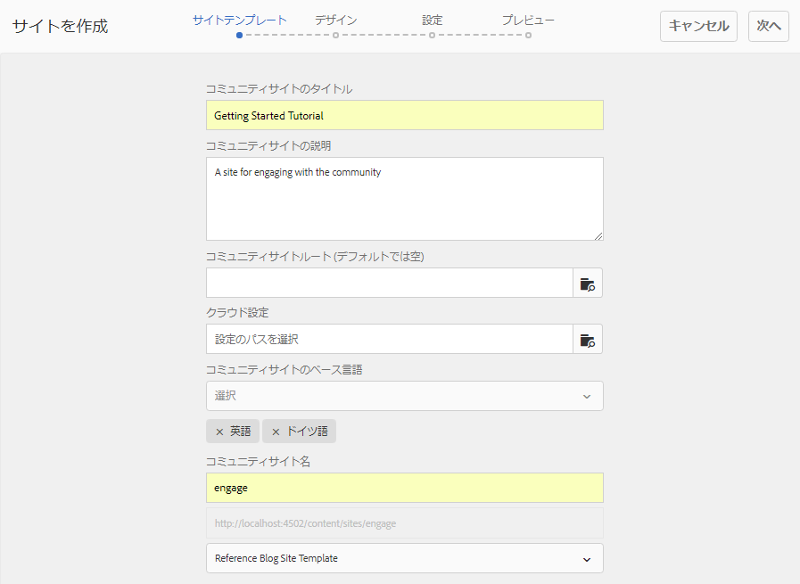

[ サイトテンプレート手順](/help/communities/sites-console.md#step2013asitetemplate)で、タイトル、説明、URLの名前を入力し、次のようなコミュニティサイトテンプレートを選択します。

* **コミュニティサイトタイトル**: `Getting Started Tutorial`
* **コミュニティサイトの説明**: `A site for engaging with the community.`
* **コミュニティサイトルート**: （デフォルトのルート `/content/sites`では空白のままにします）
* **クラウド設定**: （クラウド設定が指定されていない場合は空白のままにします）指定されたクラウド設定へのパスを提供します。
* **コミュニティサイトのベース言語**:（単一言語の場合は変更しないでください：英語）ドロップダウンリストを使用して、使用可能な言語（ドイツ語、イタリア語、フランス語、日本語、スペイン語、ポルトガル語（ブラジル）、中国語（繁体字）、中国語（簡体字）から1つの&#x200B;*以上*&#x200B;のベース言語を選択します。 言語ごとに1つのコミュニティサイトが作成され、[多言語サイトのコンテンツの翻訳](/help/sites-administering/translation.md)で説明されているベストプラクティスに従って、同じサイトフォルダー内に存在します。 各サイトのルートページには、英語の「en」、フランス語の「fr」など、選択した言語の言語コードで名前が付けられた子ページが含まれています。

* **コミュニティサイト名**: エンゲージ

   * サイトの作成後に簡単に変更できないので、名前を再確認します
   * 最初のURLは、コミュニティサイト名の下に表示されます
   * 有効なURLの場合は、ベース言語コード + 「.html」を追加します
   * *例：*, https://localhost:4502/content/sites/ `engage/en.html`

* **テンプレート**：プルダウンで`Reference Site`を選択

* 「**次へ**」を選択します。

### ステップ 2：デザイン {#step-design}

デザイン手順は、テーマとブランディングバナーを選択するための2つのセクションで示されます。

#### コミュニティサイトのテーマ {#community-site-theme}

テンプレートに適用するスタイルを選択します。 選択すると、テーマはチェックマークでオーバーレイされます。

#### コミュニティサイトブランディング {#community-site-branding}

（オプション）バナー画像をアップロードして、サイトページ全体に表示します。 バナーは、ブラウザーの左端、コミュニティサイトのヘッダーとナビゲーションリンクの間にピン留めされています。 バナーの高さは120 ピクセルにトリミングされます。 ブラウザーの幅と120 ピクセルの高さに合わせて、バナーのサイズを変更する必要はありません。

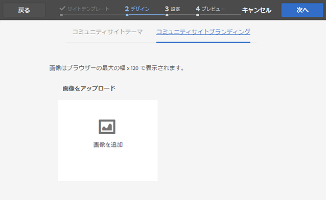

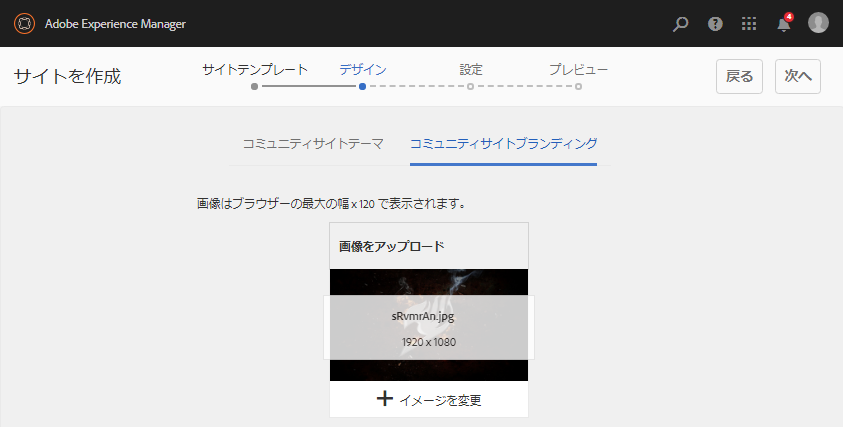

「**次へ**」を選択します。

### 手順3：設定 {#step-settings}

設定ステップでは、`Next`を選択する前に、ユーザー管理、タグ付け、モデレーション、グループ管理、分析、翻訳に関する設定にアクセスできる7つのセクションがあります。

#### User Management {#user-management}

[ ユーザー管理](/help/communities/sites-console.md#user-management)のすべてのチェックボックスをオンにします

* サイト訪問者が自己登録し
* サイト訪問者がログインせずにサイトを表示できるようにするには
* 他のコミュニティメンバーからのメッセージをメンバーが送受信できるようにするには
* プロファイルを登録および作成する代わりにFacebookでのログインを許可するには
* Twitterでのログインを許可するには、アカウント登録とプロフィール作成の代わりに

>[!NOTE]
>
>実稼動環境の場合は、カスタムのFacebookおよびTwitter アプリケーションを作成する必要があります。 [FacebookおよびTwitterでのソーシャルログイン ](/help/communities/social-login.md)を参照してください。

#### タグ付け {#tagging}

コミュニティコンテンツに適用されるタグは、[Tagging Console](/help/sites-administering/tags.md#tagging-console)で事前に定義されたAEM名前空間（[ チュートリアル名前空間](/help/communities/setup.md#create-tutorial-tags)など）を選択することで制御されます。

先行型検索を使用すると、名前空間を簡単に検索できます。 例：

* 型 `tut`
* `Tutorial` を選択します。

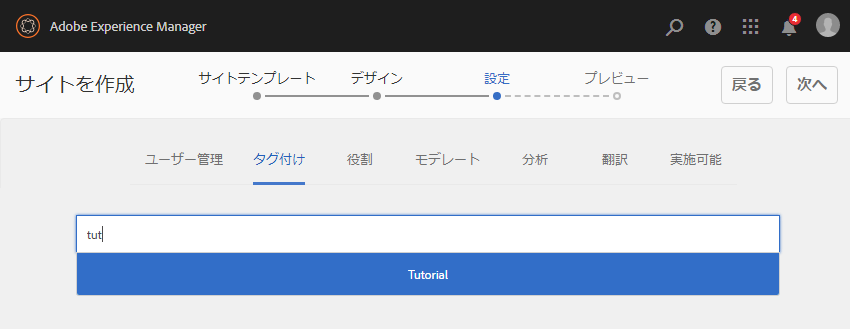

#### 役割 {#roles}

[ コミュニティメンバーの役割](/help/communities/users.md)は、「役割」セクションの設定を通じて割り当てられます。

コミュニティメンバー（またはメンバーのグループ）にコミュニティマネージャーとしてサイトを体験させるには、先行検索を使用して、ドロップダウンのオプションからメンバーまたはグループ名を選択します。

例：

* 型 `q`
* クイン・ハーパーを選択

>[!NOTE]
>
>[ トンネルサービス ](https://helpx.adobe.com/experience-manager/6-3/help/communities/deploy-communities.html#tunnel-service-on-author)では、パブリッシュ環境でのみ存在するメンバーとグループを選択できます。

新しいサイトの

#### モデレーション {#moderation}

ユーザー生成コンテンツ （UGC）の[ モデレーション ](/help/communities/sites-console.md#moderation)のデフォルトのグローバル設定を受け入れます。

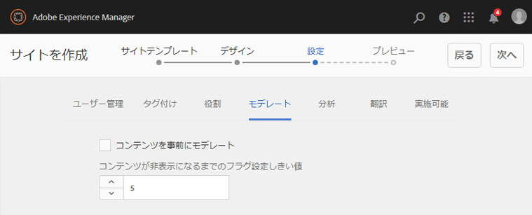

#### 分析 {#analytics}

Adobe Analyticsがライセンスされ、Analytics Cloud サービスとフレームワークが設定されている場合は、Analyticsを有効にしてフレームワークを選択できます。

[Analyticsのコミュニティ機能の設定](/help/communities/analytics.md)を参照してください。

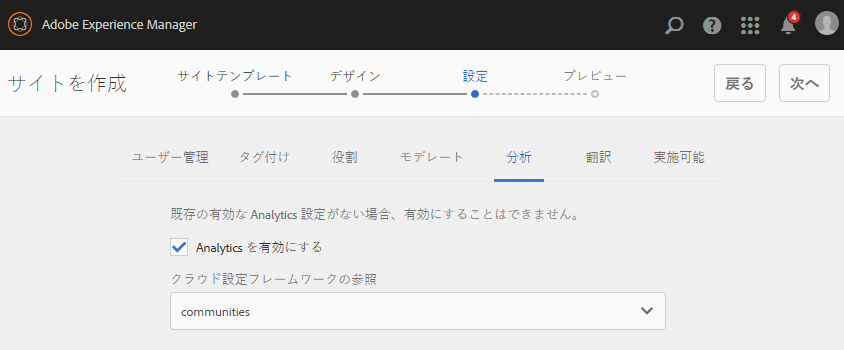

#### 翻訳 {#translation}

[翻訳設定](/help/communities/sites-console.md#translation)では、サイトのベース言語と、UGCを翻訳できるかどうか、翻訳する場合はどの言語に翻訳できるかを指定します。

* **機械翻訳の許可**&#x200B;を確認してください
* デフォルトの機械翻訳サービスで、翻訳用にデフォルトの言語を選択したままにします
* デフォルトの翻訳プロバイダーと設定のままにする
* 言語のコピーがないので、グローバルなストアは不要です
* 「**ページ全体を翻訳**」を選択
* デフォルトの永続性オプションのままにする

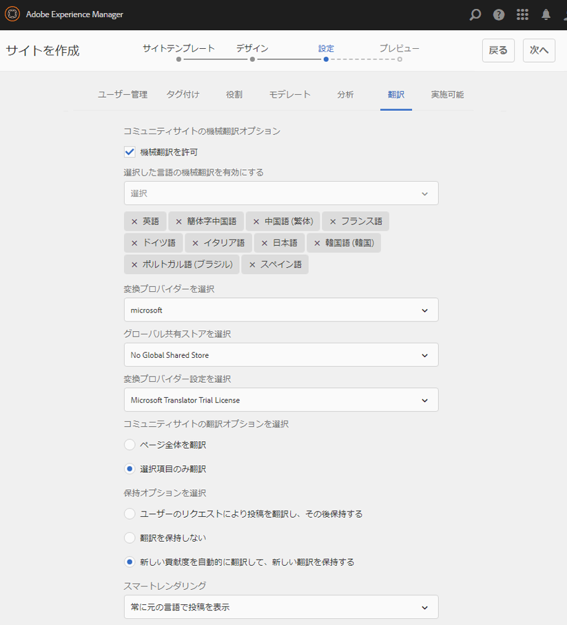

### 手順4：コミュニティサイトの作成 {#step-create-communities-site}

**作成を選択します。**

プロセスが完了すると、新しいサイトのフォルダーがCommunities - Sites コンソールに表示されます。

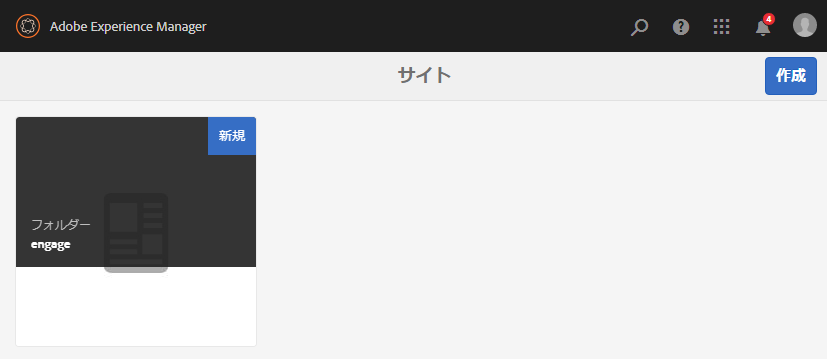

## コミュニティサイトを公開 {#publish-the-community-site}

作成したサイトは、新しいサイトを作成する場合と同じコンソールであるCommunities - Sites コンソールから管理する必要があります。

コミュニティサイトのフォルダーを選択して開いた後、サイトアイコンにカーソルを合わせると、次の4つのアクションアイコンが表示されます。

4番目の省略記号アイコン（その他のアクション）を選択すると、「サイトを書き出し」オプションと「サイトを削除」オプションが表示されます。

左から右へ向かって次のようになります。

* **サイトを開く**

  鉛筆アイコンを選択すると、コミュニティサイトがオーサー編集モードで開き、ページコンポーネントを追加または設定できます。

* **サイトを編集**

  プロパティアイコンを選択すると、タイトルなどのプロパティを変更したり、テーマを変更したりするためのコミュニティサイトが開きます。

* **サイトを公開**

  世界アイコンを選択すると、コミュニティサイトが公開されます（例えば、パブリッシュサーバーがローカルマシンで実行されている場合は、デフォルトでlocalhost:4503に公開されます）。

* **サイトを書き出し**

  書き出しアイコンを選択すると、[ パッケージマネージャー](/help/sites-administering/package-manager.md)に保存され、ダウンロードされたコミュニティサイトのパッケージが作成されます。 UGCはサイトパッケージに含まれていません。

* **サイトを削除**

  削除アイコンを選択すると、**[!UICONTROL コミュニティ/サイトコンソール]**&#x200B;内からコミュニティサイトが削除されます。 このアクションは、UGC、ユーザーグループ、アセット、データベースレコードなど、サイトに関連付けられたすべての項目を削除します。

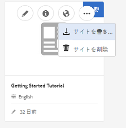

>[!NOTE]
>
>パブリッシュインスタンスにデフォルトのポート 4503を使用しない場合は、デフォルトのレプリケーションエージェントを編集して、ポート番号を正しい値に設定します。
>
>オーサーインスタンスで、メインメニューから次の操作を行います。
>
>1. **[!UICONTROL ツール]** > **[!UICONTROL 操作]** > **[!UICONTROL レプリケーション]** メニューに移動します。
>1. 作成者&#x200B;]**の**[!UICONTROL  Agentsを選択します。
>1. **[!UICONTROL Default Agent （publish）]**&#x200B;を選択します。
>1. **[!UICONTROL 設定]**&#x200B;の横にある&#x200B;**[!UICONTROL 編集]**&#x200B;を選択します。
>1. エージェント設定のポップアップダイアログで、「**[!UICONTROL トランスポート]**」タブを選択します。
>1. URIで、ポート番号4503を目的のポート番号に変更します。 例えば、ポート 6103を使用する場合は、https://localhost:6103/bin/receive?sling:authRequestLogin=1
>1. 「**[!UICONTROL OK]**」を選択します。
>1. （オプション）「**[!UICONTROL クリア]**」または「**[!UICONTROL 再試行を強制]**」を選択して、レプリケーションキューをリセットします。

### 「公開」を選択 {#select-publish}

パブリッシュサーバーが実行されていることを確認した後、世界アイコンを選択してコミュニティサイトを公開します。

コミュニティサイトが正常に公開されると、「サイト公開済み」というメッセージが簡単に表示されます。

### 新しいコミュニティユーザーグループ {#new-community-user-groups}

新しいコミュニティサイトと共に、様々な管理機能に対して適切な権限が設定された新しいユーザーグループが作成されます。 詳しくは、[ コミュニティサイトのユーザーグループ ](/help/communities/users.md#usergroupsforcommunitysites)を参照してください。

この新しいコミュニティサイトでは、ステップ 1のサイト名「engage」を指定すると、4つの新しいユーザーグループが[ グループコンソール ](/help/communities/members.md)から表示されます（グローバルナビゲーション：Communities、Groups）。

* Community Engage コミュニティマネージャー
* Community Engage グループ管理者
* Community Engage メンバー
* Community Engage Moderators
* Community Engageの特権メンバー
* Community Engage Sites コンテンツマネージャー

[Aaron McDonald](/help/communities/tutorials.md#demo-users)さんは次のメンバーです：

* Community Engage コミュニティマネージャー
* Community Engage Moderators
* コミュニティエンゲージメントメンバー（モデレーターグループのメンバーとして間接的）

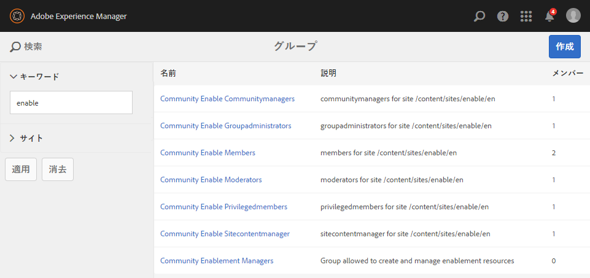

#### https://localhost:4503/content/sites/engage/en.html {#http-localhost-content-sites-engage-en-html}

## 認証エラー用に設定 {#configure-for-authentication-error}

サイトを設定して公開にプッシュしたら、公開インスタンスで[設定ログイン マッピング ](/help/communities/sites-console.md#configure-for-authentication-error) （`Adobe Granite Login Selector Authentication Handler`）を行います。 ログイン資格情報が正しく入力されていない場合、認証エラーはエラーメッセージを含むコミュニティサイトのログインページを再表示します。

`Login Page Mapping`を次のように追加

* `/content/sites/engage/en/signin:/content/sites/engage/en`

## オプションの手順 {#optional-steps}

### 既定のホームページを変更 {#change-the-default-home-page}

公開サイトをデモ目的で使用する場合は、デフォルトのホームページを新しいサイトに変更すると便利です。

これには、[CRXDE](https://localhost:4503/crx/de) Liteを使用して、パブリッシュ時に[ リソースマッピング ](/help/sites-deploying/resource-mapping.md) テーブルを編集する必要があります。

最初のステップは以下のとおりです。

1. パブリッシュインスタンスで、管理者権限でログインします。
1. [https://localhost:4503/crx/de](https://localhost:4503/crx/de)を参照します。
1. プロジェクトブラウザーで、`/etc/map.`を展開します
1. `http` ノードを選択します。

   * 「**ノードを作成：**」を選択

      * **名前** localhost.4503
（*not*&#x200B;は&#39;:&#39;を使用しません）

      * **Type** [sling:Mapping](https://sling.apache.org/documentation/the-sling-engine/mappings-for-resource-resolution.html)

1. 新しく作成された`localhost.4503` ノードを選択しました：

   * プロパティを追加：

   * **名前** sling:match
      * **Type**&#x200B;文字列
      * **値** localhost.4503/$
（&#39;$&#39;文字で終わる必要があります）

   * プロパティを追加：

      * **名前** sling:internalRedirect
      * **Type**&#x200B;文字列
      * **値** /content/sites/engage/en.html

1. **すべて保存**&#x200B;を選択します
1. （オプション）閲覧履歴を削除します。
1. https://localhost:4503/を参照します。

   * https://localhost:4503/content/sites/engage/en.htmlに到着

>[!NOTE]
>
>無効にするには、`sling:match` プロパティの値に&#39;x&#39; - `xlocalhost.4503/$` – および&#x200B;**すべて保存**&#x200B;というプレフィックスを付けるだけです。

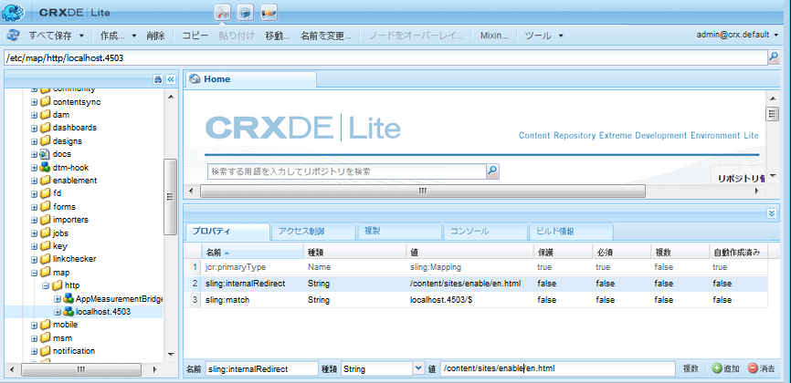

#### トラブルシューティング：マップの保存エラー {#troubleshooting-error-saving-map}

変更を保存できない場合は、`localhost`が有効な名前空間の接頭辞ではないため、ノード名が`localhost.4503`で、「ドット」区切り記号が付いており、「1」で「コロン」区切り記号が付いていないことを確認してください。`localhost:4503`

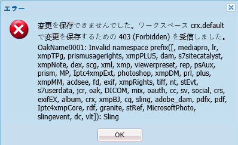

#### トラブルシューティング：リダイレクトに失敗する {#troubleshooting-fail-to-redirect}

正規表現`sling:match`文字列の末尾にある&#39;**$**&#39;は非常に重要です。そのため、`https://localhost:4503/`のみがマッピングされ、それ以外の場合、リダイレクト値はURLのサーバー:portの後に存在する可能性のある任意のパスにプレフィックスが付けられます。 したがって、AEMがログインページにリダイレクトしようとすると、失敗します。

### サイトの変更 {#modify-the-site}

サイトの作成後、作成者は[ サイトを開くアイコン ](/help/communities/sites-console.md#authoring-site-content)を使用して、標準のAEM オーサリングアクティビティを実行できます。

さらに、管理者は[ サイトを編集アイコン ](/help/communities/sites-console.md#modifying-site-properties)を使用して、タイトルなどのサイトのプロパティを変更できます。

変更が完了したら、**保存**&#x200B;してサイトを&#x200B;**公開**&#x200B;してください。

>[!NOTE]
>
>AEMに詳しくない場合は、[基本処理](/help/sites-authoring/basic-handling.md)に関するドキュメントと、[ ページのオーサリングに関するクイックガイド ](/help/sites-authoring/qg-page-authoring.md)をご覧ください。
